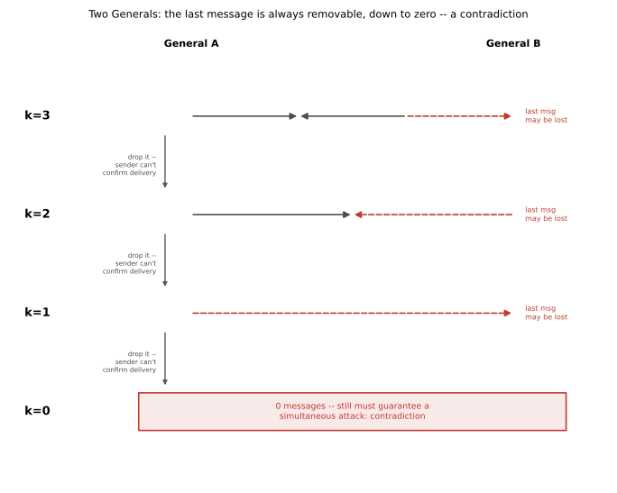

# ch18 — 兩位將軍問題：為什麼共同知識永遠差一則訊息

> **本章解決什麼問題**：Part V（共同知識與認識邏輯）從 ch15（紅藍眼睛）教你共同知識（common knowledge）這個概念本身有多強——一句公開宣告，怎麼把「大家都知道」一次墊高到無窮層；ch16（泥巴小孩）把同一套歸納換了一身乾淨的外衣；ch17（意外絞刑）轉去處理自我指涉的預言，跟共同知識暫時脫鉤。本章收攏這個 Part，回到共同知識本身，問一個更狠的問題：如果訊息只能靠會被攔截、會弄丟的信差傳遞，共同知識還能不能達到？答案是——永遠不能，不管你交換多少則訊息、交換幾層確認都一樣。這是全書第一次讓你眼睜睜看著一個嚴謹的**不可能性證明**（impossibility proof），把「再加一層確認就夠了」這句聽起來理所當然的直覺，一路逼到無限遠處，逼到它永遠搆不著。

## 從你已知的出發

想像兩支軍隊，分別駐紮在一座山谷兩側的山頭上，谷底是敵方一支頑強、正在整補的守軍。兩支藍軍的兵力都不足以獨自攻下山谷裡的白軍——只要有一支藍軍單獨發動攻擊，會被優勢兵力的白軍擊潰；但只要兩支藍軍**同時**發動攻擊，聯手的兵力就足以拿下山谷。這是整個故事裡唯一重要的軍事事實：**同時攻擊，贏；只有一方攻擊，輸；都不攻擊，僵持**。

兩位將軍——姑且稱他們為甲將軍與乙將軍——彼此看得到對方的營火，卻隔著一整座被白軍控制的山谷，沒有電話、沒有旗語（假設地形擋住視線範圍），唯一的通訊方式是派信差，抄小路穿過谷底送信。問題是，這條小路並不安全：白軍的巡邏隊隨時可能截住信差、把信搶走燒掉。信差要嘛平安把信送到，要嘛被截住、信永遠到不了對岸——而截住信差這件事，發信的一方**沒有辦法知道**。甲將軍派出信差之後，只能等；如果乙將軍沒有回音，甲將軍無從分辨究竟是「乙將軍還沒來得及回信」，還是「回信的信差被白軍截住了」，還是「乙將軍根本沒收到我的信、所以沒有回信的理由」。這三種情況，從甲將軍的座位上看起來一模一樣。

故事還需要一個關鍵設定，才能讓「為什麼非通訊不可」這件事站得住腳：兩位將軍原先並沒有一個雙方都已經知道、不需再談的固定攻擊時刻。就在今天凌晨，甲將軍的斥候回報，發現白軍今夜換防出現了一個轉瞬即逝的破口——只有今晚黎明之前發動攻擊，才有必勝的把握，錯過今晚，破口就會被補上。這個消息目前只有甲將軍知道；乙將軍如果不靠任何訊息，絕對沒有辦法無中生有地「猜」到甲將軍發現了這個破口、更不可能猜到準確的時間點。換句話說，這不是一個「兩邊反正都知道要黎明攻擊」的假通訊問題，而是一個**貨真價實、必須靠信差才能傳遞的新資訊**。

於是甲將軍寫了一張紙條：「今夜黎明，我軍發動攻擊，請貴軍同時行動」，派信差送去給乙將軍。

如果你被問到「這樣夠不夠」，一個非常自然、幾乎不假思索就會浮現的答案是：夠。理由也很直觀——只要讓乙將軍**回一封確認信**，跟甲將軍說「收到，我方同意黎明同時攻擊」，甲將軍收到這封回信之後，不就知道乙將軍也準備好了嗎？兩邊都表態了，兩邊都同意了，接下來就是各自帶兵，黎明一到，同時發動攻擊——這聽起來像是任何一次日常生活裡的「敲定一件事」：你傳訊息問朋友「晚上七點吃飯？」，朋友回「好」，這件事就這樣「說定了」，沒有人會覺得這中間還缺了什麼。這正是本章要拆穿的自信答案：把「乙將軍送出了一封確認信」，直接等同於「雙方現在確定會同時行動」。這一章要讓你看到，這兩件事之間，其實隔著一道永遠跨不過去的鴻溝——不是因為信差技術不夠好，而是因為邏輯上，這道鴻溝本來就跨不過去。

## 訊息協定：一則、兩則、三則，為什麼都不夠

在往下讀之前，先把「協定」（protocol）這個詞的意思講清楚：協定就是雙方事先說好的一套規則，規定「收到什麼、什麼時候，就採取什麼行動」。因為兩位將軍沒有時鐘同步的問題（可以先假設雙方都能看到同一個黎明），真正的難題只在於：**要不要攻擊**、以及**能不能確定對方也會攻擊**。

先看最簡陋、只用一則訊息的協定，看看它為什麼一望即知地不夠。

**k=1 協定**：甲將軍派信差送出「今夜黎明攻擊」，不等任何回音，到了黎明就直接發動攻擊。

這個協定的破綻不需要嚴謹證明就能看出來：如果信差被白軍截住，乙將軍完全不知道有這回事，天亮後按兵不動；甲將軍卻按照協定準時攻擊。結果是甲軍孤軍奮戰，被優勢白軍擊潰。一則訊息、沒有任何確認機制的協定，連最基本的「至少別讓一方送死」都保證不了。

那麼，很自然的修正是加一層確認。

**k=2 協定**：甲將軍送出提案；乙將軍一收到提案，就送出一封確認信，並且**只要提案送達，乙將軍就會在黎明行動**（乙將軍不再等待進一步回音，因為協定只設計了兩則訊息）；甲將軍則規定**只有在收到確認信之後，才會行動**。

這正是本章開頭那個自信答案的具體版本。逐項檢查它是否真的萬無一失：假設提案順利送達乙將軍——乙將軍依照協定，已經打定主意黎明行動；接著乙將軍派信差送出確認信，但這一次，白軍的巡邏隊逮住了這名信差，確認信沒有送到。這時候，乙將軍已經按照協定準備行動了（他不會知道自己的確認信沒送到，也沒有理由改變心意——協定裡沒有一條規則要求乙將軍等一個「你有沒有收到我確認信」的再確認）；而甲將軍，因為沒收到確認信，依照協定按兵不動。**結果又是一方攻擊、一方按兵不動**——這一次輪到乙將軍孤軍奮戰。兩則訊息的協定，依然沒有解決問題，只是把出錯的那一方，從甲將軍換成了乙將軍。

再加一層，會不會終於夠了？

**k=3 協定**：甲將軍送出提案（訊息 1）；乙將軍送回確認（訊息 2）；甲將軍再送回「確認的確認」（訊息 3），跟乙將軍說「我方已收到你的確認，一切照計畫進行」。

這裡出現一個關鍵的分岔，取決於乙將軍打算在哪個時間點「拍板」：

- **如果乙將軍在送出訊息 2 的當下（也就是一收到提案）就已經拍板決定黎明行動**，那麼訊息 3 對乙將軍的決定其實完全沒有影響——乙將軍早就決定好了，收不收得到訊息 3 都一樣。同時，訊息 3 對甲將軍自己的決定也沒有影響：甲將軍是在收到訊息 2 之後才決定要行動、才動筆寫訊息 3 的，訊息 3 有沒有送達乙將軍，改變不了甲將軍自己已經拍板的決定。既然訊息 3 對雙方各自的決定都毫無影響，它就是一則可有可無、可以直接刪掉的訊息——刪掉之後，就是前面已經證明會出錯的 k=2 協定，一模一樣會出現「乙將軍已經行動、甲將軍沒收到確認信而按兵不動」的錯配。
- **如果乙將軍要等到收到訊息 3，才肯拍板決定黎明行動**（也就是說，乙將軍真的把訊息 3 當一回事，需要它才安心），那麼考慮這樣一個情境：訊息 1、訊息 2 都平安送達，唯獨訊息 3 被白軍截住。這時候，甲將軍已經在收到訊息 2 之後拍板行動（協定沒有要求甲將軍等更多回音，因為訊息 3 是這個協定裡最後一則、由甲將軍發出、之後沒有更多交換），甲將軍黎明時準時攻擊；但乙將軍，因為在等訊息 3、而訊息 3 沒有送達，依照協定按兵不動。**又是一方攻擊、一方沒有行動**——這一次錯配的原因，換成了訊息 3 沒送達。

不管乙將軍選哪一種拍板時機，三則訊息的協定，一樣找得出讓雙方行動不一致的情境。表格整理這三個協定逐一失敗的原因：

| 協定長度 k | 決策規則 | 遺失的那一則訊息 | 結果 |
|---|---|---|---|
| k=1 | 甲不等回音直接行動 | 訊息 1（提案）遺失 | 乙完全不知情、按兵不動；甲已行動 → 甲孤軍 |
| k=2 | 乙收到提案即行動；甲收到確認才行動 | 訊息 2（確認）遺失 | 乙已行動；甲沒收到確認、按兵不動 → 乙孤軍 |
| k=3（乙提早拍板） | 乙收到提案即行動（訊息 3 對乙無影響） | 等價於 k=2 的情境 | 訊息 3 可刪，退化為 k=2 的錯配 |
| k=3（乙等訊息 3） | 乙要收到「確認的確認」才行動；甲收到確認即行動 | 訊息 3（確認的確認）遺失 | 甲已行動；乙還在等、按兵不動 → 甲孤軍 |

看到這裡，一個令人不安的模式已經浮現：每加一則訊息，好像只是把「誰可能孤軍奮戰」這個角色換了一次人，問題本身從來沒有真正消失。下一節要把這個模式，從「k=1、2、3 都不夠」的具體案例，提升成「對任何有限的 k，都不夠」的一般證明。

## 不可能性證明：任何協定的最後一則都能被刪掉

先把整個論證要證明的主張講清楚：**不存在任何有限則訊息的協定，能夠保證——不是「很可能」，是邏輯上百分之百保證——兩位將軍一定同時行動，只要通訊管道有可能弄丟訊息。** 這是一個不可能性證明，證明方法是數學歸納法配合歸謬法（reductio ad absurdum）：假設這樣的協定存在，一步一步把它化簡，最後化簡出一個荒謬的結論。

證明的核心觀察，其實就是上一節那張表格背後共通的道理，把它講得更精確一點：

在任何協定裡，看最後一則被送出的訊息，設它是由某一方（不失一般性，稱發送者為 X，接收者為 Y）送出的。因為這是協定裡的最後一則訊息，X 在送出它之後，不會再收到任何進一步的訊息——也就是說，**X 自己要不要行動這件事，必須在送出這則訊息「之前」就已經由 X 手上已有的資訊決定好了**，跟這則訊息之後有沒有平安送達，毫無關係（X 沒有辦法知道它有沒有送達，也沒有機制讓 X 在得知送達與否之後修改自己的決定）。

這個觀察逼出一個二分法：Y 收到這最後一則訊息之後，會不會因此改變自己的行動？

```text
情況一：Y 的決定不依賴這最後一則訊息
  → Y 收到與沒收到，行動都一樣
  → 這則訊息對甲乙雙方各自的決定都沒有影響
  → 可以把它從協定裡整條刪掉，得到一個少一則訊息、
     仍然保證雙方同時行動的協定          ← 因為刪掉它不改變任何人的行為
  → 對這個少一則的協定，重複同樣的論證

情況二：Y 的決定依賴這最後一則訊息（收到才行動，或收到才不行動）
  → 考慮這則訊息「恰好遺失」的情境（管道允許遺失，這種情境必然存在）
  → 在這個情境裡：X 已經按照送出前就定好的決定行動了
                  Y 因為沒收到、依協定改變了行動
  → 兩人行動不一致                       ← 與「保證同時行動」的前提矛盾
```

情況二直接推出矛盾，協定不可能達到保證；情況一則讓我們把協定的訊息數量減少一則，而保證同時行動的性質完全不變。把這個論證反覆套用下去：一個用了 k 則訊息的協定，如果情況二從沒發生過，就會一路被化簡成 k−1 則、k−2 則……一路減到 **0 則訊息**的協定，而且每一步「保證同時行動」這件事都必須原封不動地被保留下來（因為每一次刪除，依情況一的前提，都不改變任何人的行為）。

但 0 則訊息的協定，等於甲、乙兩位將軍完全不通訊。回頭看看故事的設定：黎明攻擊這個決定，源自甲將軍斥候今夜才回報的破口，乙將軍事前絕不可能知道。0 則訊息，意味著乙將軍完全沒有辦法得知「今夜是不是進攻的時機」，他要嘛永遠不會主動出兵（那就談不上「保證同時行動」，因為根本沒發生「同時行動」這件事），要嘛只能憑空亂猜（那就更不可能「保證」猜對）。**0 則訊息的協定不可能保證同時行動，這是顯而易見、不需要再證明的事實**——這正是歸謬法要的那個荒謬結論。

於是整條推理鏈完整了：假設存在一個有限協定能保證兩位將軍同時行動 → 反覆用「最後一則訊息可刪」的論證化簡 → 化簡到 0 則訊息，仍然保證同時行動 → 但 0 則訊息顯然不可能保證同時行動 → 矛盾。所以，**最初的假設不成立：不存在任何有限則訊息的協定，能保證兩位將軍在會遺失訊息的管道上同時行動**。這個證明對協定的具體內容完全不敏感——不管訊息裡寫什麼、來回幾次、規則多複雜，論證只用到「管道可能遺失訊息」跟「最後一則訊息之後沒有更多交換」這兩件事，其餘全部是邏輯推演，不依賴任何機率假設。

（誠實補一句：這裡示範的是最直觀的「嚴格交替送信」版本；更一般的協定——訊息可以不交替、可以有分支、可以是非決定性的——證明手法一樣，只是要對「協定執行的整棵樹」逐一剪掉可拿掉的葉節點，思路完全相同，這裡不展開技術細節。）



## 與共同知識的精確連結：為什麼永遠差一層

如果你讀過 ch15，會記得共同知識（common knowledge）的定義：一件事 p 是共同知識，不只是「大家都知道 p」（這叫「每個人都知道」，寫作 E(p)），還要「大家都知道大家都知道 p」（E²(p)）、「大家都知道大家都知道大家都知道 p」（E³(p)）……一路往上疊，疊到無窮層，全部同時成立，才叫共同知識，記作 C(p)。ch15 的公開宣告之所以震撼，是因為它一次就把「大家都知道島上有藍眼睛」這件早就人盡皆知的事，瞬間升級成了無窮層的 C(p)——正是這個升級本身，觸發了後續一百天的連鎖推理。

兩位將軍問題，可以用一模一樣的語言重講一次，而且答案格外乾脆：**要讓「今夜黎明同時攻擊」變成兩位將軍之間的共同知識，需要無窮層的「我知道你知道我知道……」；而每一則能送達的訊息，最多只能把這座知識的塔往上疊高剛好一層。** 逐則檢查前一節那個三則訊息協定，會看得非常清楚：

```text
送出訊息 1（甲→乙，提案）且送達
  → 乙知道「黎明攻擊」                         ← 這是第 1 層：乙知道 p
  → 但甲不知道乙是否收到，所以甲不知道「乙知道 p」
     （少了第 2 層）

送出訊息 2（乙→甲，確認）且送達
  → 甲現在知道「乙知道 p」                     ← 補上第 2 層
  → 但乙不知道確認信有沒有送達，所以乙不知道
    「甲現在知道乙知道 p」（少了第 3 層）

送出訊息 3（甲→乙，確認的確認）且送達
  → 乙現在知道「甲知道乙知道 p」               ← 補上第 3 層
  → 但甲不知道這則訊息有沒有送達，所以甲不知道
    「乙現在知道甲知道乙知道 p」（少了第 4 層）

……如此無限延續下去，每多一則訊息，只墊高一層，
   永遠有一層墊不上去
```

這張推導表，其實就是本章標題那句話的來源：**共同知識永遠差一則訊息**——不是差「這一次」少送的那一則，而是無論已經送達了多少則、疊了多少層，最新那一層是否真的送達，永遠沒有人能確定，於是永遠有一層懸在半空。這正是上一節不可能性證明的知識論版本：訊息交換能造出的，只是一座蓋得再高也封不了頂的塔，而共同知識要求的，是那座塔已經封頂、而且封頂這件事本身也被看見了。

那麼，ch15 的公開宣告，是怎麼繞過這整套麻煩、一步登頂的？關鍵的機制差異在這裡：紅藍眼睛島上的宣告，是所有島民**同時、公開、彼此都看得見彼此在場**聽到的一句話——不只是每個人都聽到了，而是每個人都**親眼看見別人也在場、也聽到了同一句話**。這種「所有人一起共同經歷同一個事件，並且彼此可以互相確認對方也共同經歷了」的場景，能一次跳過整條無窮的塔，直接讓那句話成為共同知識——因為不需要再一層一層去確認「你知道我聽到了嗎」，那個確認已經包含在「我們同時站在同一個現場」這件事本身裡面了。兩位將軍的信差通訊，本質上是一連串**私下的、一對一**的傳遞——不管來回多少趟，都只能建立起「甲知道」「乙知道甲知道」這種一層疊一層的鏈，永遠沒有一個「大家一起在場、彼此都看得見對方在場」的環節，可以讓這條鏈瞬間封頂。這正是兩種機制的分野：**公開、同步、彼此可見的共同經歷，能一步造出共同知識；私下、非同步、會遺失的點對點訊息，不管疊多少層，都造不出共同知識**（見 ch15 對這一機制的完整鋪陳）。

值得順帶一提：這個問題在認識邏輯（epistemic logic）與分散式系統理論裡有一個正式名字——「協同攻擊問題」（coordinated attack problem）。約瑟夫·哈爾彭（Joseph Halpern）與約拉姆·摩西斯（Yoram Moses）在他們探討分散式系統中知識與共同知識關係的經典論文裡，把這個問題形式化，證明的核心正是本章這套「共同知識在有損管道上不可達」的論證——這篇論文後來被視為把「共同知識」這個哲學/邏輯概念，正式接上分散式系統理論的關鍵橋樑（詳見延伸閱讀）。

## 歷史：從「幫派份子」到「兩位將軍」

這個問題的歷史，跟它的名字一樣，經常被搞混——原始的不可能性證明，跟後來廣為人知的「將軍」包裝，其實是兩批人、隔了三年、用了完全不同的故事場景。

**不可能性證明（1975）**：第一次嚴格證明「這件事做不到」的，是埃爾多安·阿科尤恩魯（E. A. Akkoyunlu）、克莉希南·艾卡納丹（K. Ekanadham）與 R. V. 胡伯（R. V. Huber）三人合著的論文《網路通訊設計中的若干限制與取捨》（"Some Constraints and Trade-offs in the Design of Network Communications"），發表於 1975 年第五屆 ACM 作業系統原理研討會（Proc. 5th ACM SOSP, 1975）。**這裡有一個很容易寫錯的細節：論文第三作者姓氏是胡伯（Huber），不是有些網路轉述常見的「Huang」**——這一點在 ACM Digital Library 與 dblp 的紀錄裡是一致的，本章特別確認過。這篇論文用的敘事框架，不是後來熟悉的「將軍」，而是兩群**幫派份子（gangsters）**之間需要協調行動——具體的犯罪情節，論文並未著墨太多細節，本章沒有直接取得全文逐句核對故事包裝的細節（未驗證），但可以確認的是：這篇論文首度用嚴謹的方式，證明了這一類問題在會遺失訊息的通訊管道上無解。

**「兩位將軍」的命名與包裝（1978）**：三年後，吉姆·格雷（Jim Gray）在他的長篇講義《資料庫作業系統筆記》（"Notes on Data Base Operating Systems"，收錄於 *Lecture Notes in Computer Science* 第 60 冊，1978 年，頁 393 至 481）裡，把這個已經被證明過的結果，重新包裝成「兩位將軍」的故事，並正式給了它一個好記的名字——「兩位將軍悖論」。**先有 1975 年的證明（幫派份子版），後有 1978 年的命名與「將軍」包裝（格雷）——這是兩件事、兩個年份、兩批人**，維基百科等網路條目常常把兩者混為一談、或只提格雷卻略去 1975 年的原始證明，這裡特別把時間線寫清楚。

還有一點值得一提：本章開頭那個「山頭、山谷、信差」的具體場景描寫（誰駐紮在哪座山、信差怎麼抄小路），是後世教材與科普文章逐漸沿用、加工出來的通行講法，用來讓格雷 1978 年的「將軍」框架更生動；這個場景本身的細節（例如具體是哪一座山谷、信差走哪條路）並非某一篇原始論文裡逐字給出的史實，本章按慣例採用它純粹是敘事上的方便，這裡如實註明。

## 實務裡怎麼辦：把「確定」換成「夠確定」

讀到這裡，你可能會想：如果數學上證明了不可能，那真實世界裡的電腦、手機、銀行轉帳，難道每天都活在無法協調的混亂裡嗎？當然不是——但答案不是「工程師找到了漏洞、把不可能性證明推翻了」，而是**工程上根本沒打算追求邏輯上的絕對確定，而是換了一個可以達成的目標：把出錯的機率壓到低到你願意接受的程度**。

這中間的差別非常關鍵：本章證明的是「機率為 1（百分之百）的保證做不到」，但沒有說「機率盡量接近 1、但永遠差一點點」做不到。事實上，只要每一則訊息遺失的機率固定、而且各自獨立，多交換幾層確認，確實能讓「所有必要的訊息都平安送達」的機率越墊越高——只是這個機率永遠嚴格小於 1，不管疊多少層。真實世界的網路協定，正是靠著「重送逾時的訊息」「把每個動作設計成即使重複執行也不會出錯（冪等，idempotent）」「多層確認把殘餘的失敗機率壓到億分之一甚至更低」這一整套工程手法，把「幾乎不可能出錯」做到讓人在日常使用中完全感覺不到那個理論上仍然存在的裂縫。你每天使用的網路連線建立過程（TCP 的三向交握），本質上就是一個三則訊息的協定——本章的證明告訴你，它在數學上並沒有真正「解決」兩位將軍問題，它只是把失敗的機率壓得夠低、又靠逾時重送去兜住剩下的殘餘風險；同樣地，資料庫之間要保證一筆交易在兩台機器上「同時」生效或同時作廢時常用的兩階段提交（two-phase commit）協定，也帶著跟本章一模一樣的血統——最後一次確認訊息如果剛好遺失，協調者跟參與者一樣可能卡在不確定要不要提交的狀態，這也是為什麼兩階段提交出名地在協調者故障時會「卡住」。這一整套「怎麼在做不到絕對確定的世界裡，把風險壓到你願意接受的程度」的工程細節，是分散式系統設計自己的一門大學問，不在這本悖論欣賞書的範圍裡，這裡只點出這個血緣關係，不深入展開。

也正因為如此，本章的不可能性證明，價值從來不是「告訴你系統會壞掉」，而是替你劃出一條誠實的界線：**任何聲稱「我們的系統已經徹底解決了協調同時行動」的說法，只要通訊管道有任何一絲遺失訊息的可能，邏輯上都不可能是真的百分之百**——它做到的，充其量是「機率高到你我都可以放心接受」，而這正是工程與數學誠實地分工合作的地方：數學告訴你哪裡有一道永遠存在、跨不過去的裂縫；工程告訴你怎麼把日常生活中踩到那道裂縫的機率，壓到你根本不會在意。

## 直覺的陷阱

| 階段 | 發生了什麼 |
|---|---|
| 直覺的自信答案 | 只要讓乙將軍送出一封確認信，甲將軍收到之後，雙方就「說定了」，可以放心同時行動——就像日常生活裡敲定一件事一樣自然 |
| 偷渡的假設 | 把「乙將軍送出了確認」直接當成「雙方現在確定會同時行動」；但「確定會同時行動」邏輯上要求的是共同知識——不只是我知道、你知道，而是我知道你知道我知道……一路到無窮層都要成立 |
| 為什麼聽起來理所當然 | 日常生活裡，我們幾乎從不在會遺失的通訊管道上做決定；「你回我一句『好』，這件事就定了」之所以行得通，是因為現實中大部分通訊管道可靠到我們懶得去想「萬一那句『好』根本沒送到」這種邊界情況，直覺因此把「送出確認」和「達成共識」直接畫上等號 |
| 在哪一步被帶溝裡 | 不是某一層確認做得不夠仔細，而是邏輯結構本身：協定裡最後一則訊息的發送者，永遠沒有辦法讓自己的決定依賴這則訊息有沒有送達——不是因為訊息設計得不好，是因為它之後再也沒有機會知道結果。這個結構性的漏洞，不管加多少層確認都存在，只是被推到更外面那一層 |
| 怎麼自我察覺 | 看到「只要再確認一次就好了」這句話，先問：這個「再一次」有沒有終點？如果沒有終點（每一層確認自己也可能遺失，需要再一層確認），那你面對的就不是「多加一步搞定」的問題，而是一座本質上蓋不了頂的塔——這時候該問的不是「怎麼加固最後一層」，而是「我真正需要的，是邏輯上的確定，還是機率上夠高的確定」 |

> **那句沒說出口的話是**：以為讓乙將軍送出一封確認信，就等於「雙方現在確定會同時行動」——但「確定同時行動」在邏輯上要求的是共同知識，是無窮層的「我知道你知道我知道……」全部同時成立；而任何會遺失、只交換有限次的訊息，不管疊了幾層確認，永遠只能墊高有限層，永遠還差最外面那一層，那座塔永遠封不了頂。

## 紙上推演

**練習 1（★，10 分鐘）**：延續本章的協定，設計一個 k=4 的協定——甲提案、乙確認、甲確認的確認、乙再回一句「收到你確認的確認」。請仿照本章表格的寫法，指出：無論乙將軍選擇在第幾則訊息就拍板行動，都能找到一個「某一則訊息剛好遺失」的情境，讓雙方行動不一致。具體寫出是哪一則訊息遺失、誰因此孤軍奮戰。

**練習 2（★★，15 分鐘）**：假設每一則訊息各自獨立、被白軍截住（遺失）的機率是 q=0.1（也就是有九成機率能平安送達）。如果協定要求恰好 k 則訊息**全部**平安送達，兩位將軍才會同時行動（其中任何一則遺失，協定就直接判定失敗、雙方都不行動，不需要再對照本章表格的「誰孤軍奮戰」）。分別計算 k=1、2、3、5、10 時，「協定成功執行完畢」的機率，並說明這個數列隨 k 增加的趨勢說明了什麼。

**練習 3（★★★，20 分鐘）**：用本章「與共同知識的精確連結」一節引入的「第幾層知識」語言，寫出一個嚴格的歸納論證：對本章 k=1,2,3 那種嚴格交替的協定，證明「送出 n 則訊息且全部送達」恰好只能建立到第 n 層知識（例如「甲知道乙知道甲知道……」疊 n 層），而永遠無法建立第 n+1 層。（提示：先寫清楚第 1、2、3 層各自對應哪一則訊息送達，再歸納。）

### 推演解答

**練習 1 解答**：k=4 協定裡，訊息 4（乙→甲，「收到你確認的確認」）是最後一則。跟本章 k=3 的分析完全同構：

- 如果甲將軍在送出訊息 3（也就是自己寫下「確認的確認」、在收到訊息 2 之後）就已拍板行動，那麼訊息 4 對甲、乙雙方各自的決定都沒有影響——可以刪掉，退化為 k=3 協定，一樣會出現本章表格裡「乙等訊息 3、訊息 3 遺失、甲已行動、乙孤軍」或「乙提早拍板、退化為 k=2」的其中一種錯配。
- 如果甲將軍要等收到訊息 4 才拍板行動，考慮訊息 1、2、3 都送達、只有訊息 4 遺失的情境：乙將軍在收到訊息 3、送出訊息 4 之後已經行動；甲將軍因為沒收到訊息 4，按兵不動——結果乙孤軍奮戰。

不管哪一種情況，k=4 一樣找得到讓雙方行動不一致的情境——這正是本章一般證明（任何 k 都能找到「最後一則訊息遺失」的矛盾情境，或者這則訊息可刪、退化到更短的協定）的一次具體驗算。

**練習 2 解答**：全部 k 則訊息都平安送達的機率是 (1−q)^k = 0.9^k：

```text
k=1 :  0.9¹  = 0.9      = 90.00%
k=2 :  0.9²  = 0.81     = 81.00%
k=3 :  0.9³  = 0.729    = 72.90%
k=5 :  0.9⁵  = 0.59049  = 59.05%
k=10:  0.9¹⁰ ≈ 0.34868  = 34.87%
```

這個數列隨 k 增加**單調遞減**，而且是指數衰減——直覺上「多加幾層確認，應該更保險」，但如果協定死板地要求每一層都必須成功、少一層就整個判定失敗，那麼確認的層數越多，反而讓「協定順利跑完」的機率越低，不是越高。這正好呼應本章「實務裡怎麼辦」一節的重點：真實世界的協定之所以能把可靠度做高，靠的不是死板地要求「每一層都必須成功」，而是「允許重送、允許逾時後重試」——重送讓每一層即使第一次失敗，也還有第二次、第三次機會，才能把整體成功機率越墊越高、而不是像這裡的死板版本一樣越疊越低。

**練習 3 解答**：先建立對應關係——設 p 是「今夜黎明攻擊」這件事。

```text
n=1（訊息 1 送達）：
  乙知道 p                                    ← 第 1 層：E¹(p) 對乙成立

n=2（訊息 1、2 都送達）：
  甲知道「乙知道 p」                            ← 第 2 層：甲這邊多疊了一層

n=3（訊息 1、2、3 都送達）：
  乙知道「甲知道乙知道 p」                       ← 第 3 層：乙這邊再疊一層
```

歸納假設：送出 n 則訊息且全部送達時，最新收到訊息的那一方，恰好知道到第 n 層（「……知道……知道 p」疊了 n 層）；歸納步驟：第 n+1 則訊息，是由「知道到第 n 層」的那一方，送給對方，內容等於「我方已經知道到第 n 層」——如果這則訊息送達，接收方就多知道了「對方知道到第 n 層」這件事，也就是自己這邊疊到了第 n+1 層。這證明了「n 則訊息送達 → 疊到第 n 層」對所有 n 成立。但同一個歸納法也直接說明了為什麼疊不到「第 n+1 層」：疊到第 n+1 層，需要的正是第 n+1 則訊息**送達**這件事本身，也被對方知道——而這件事，只有再送出第 n+2 則訊息才能確認，如此無限循環，永遠有一層停留在「送出了，但沒有人能確定它送達了、也沒有人能確定『沒有人能確定它送達』這件事本身被對方知道」的懸空狀態。共同知識要求所有層同時成立，而這個懸空的最外層永遠存在，所以共同知識永遠達不到——這正是本章標題「共同知識永遠差一則訊息」最形式化的版本。

## 自我檢核

1. 為什麼「乙將軍送出了確認信」這個動作本身，不能讓甲將軍「確定」乙將軍會攻擊？用自己的話講清楚「送出」跟「確定送達」這兩件事的差別。
2. 在任何協定裡，為什麼最後一則訊息的發送者，沒辦法讓自己的決定「依賴」這則訊息有沒有送達？如果他硬是要等，會出現什麼矛盾？
3. 如果通訊管道被假設成完全可靠（訊息絕對不會遺失），兩位將軍問題還存在嗎？為什麼本章的證明在這種假設下會失效？
4. ch15 紅藍眼睛悖論裡的公開宣告，為什麼能一次跳到無窮層的共同知識，而兩位將軍的信差，不管來回幾次都做不到？兩者的機制到底差在哪一點？
5. 「協定成功的機率高達 99.9999%」跟「協定保證百分之百成功」，在本章的證明裡，為什麼是兩件完全不同的事？工程實務上為什麼可以放心接受前者？
6. 為什麼證明的關鍵一步是去看協定裡「最後一則訊息」，而不是「第一則訊息」？如果反過來，試著從第一則訊息開始論證「這則訊息也可以刪掉」，會卡在哪裡、為什麼卡住？
7. 這個悖論那句沒說出口的假設是什麼？試著不看課文，用自己的話重講一次，並說明它跟「共同知識」這個詞之間的精確關係。
8. 如果有人說「我們的系統做了三次握手，所以已經徹底解決兩位將軍問題了」，你會怎麼指出這句話錯在哪裡？

## 延伸閱讀

- 〈Two Generals' Problem〉，Wikipedia——這個問題最常見的入口總覽，涵蓋標準的山谷／信差場景描述、不可能性證明的標準寫法，以及 1975 年與 1978 年兩篇原始文獻的出處對照，適合作為交叉核對的起點。<https://en.wikipedia.org/wiki/Two_Generals%27_Problem>
- Akkoyunlu, E. A., Ekanadham, K., & Huber, R. V. (1975). "Some Constraints and Trade-offs in the Design of Network Communications." *Proc. 5th ACM Symposium on Operating Systems Principles (SOSP)*.——本章不可能性證明的原始出處，第三作者確認為 Huber；本章開頭「幫派份子」框架即出自此文（本章未逐句核對其敘事細節，故事包裝部分標「未驗證」）。<https://dl.acm.org/doi/10.1145/800213.806523>
- Gray, J. (1978). "Notes on Data Base Operating Systems." *Lecture Notes in Computer Science*, Vol. 60, pp. 393–481.——把 1975 年的證明重新包裝成「兩位將軍」故事、並正式命名的出處；篇幅極長，兩位將軍段落只是其中一節，本章未取得逐頁全文核對確切段落頁碼（未驗證確切頁碼）。
- Halpern, J. Y., & Moses, Y. (1990). "Knowledge and Common Knowledge in a Distributed Environment." *Journal of the ACM*, 37(3), 549–587.——把「協同攻擊問題」形式化進認識邏輯的經典論文，直接連結本章與 ch15 共同知識的數學語言，是本章「與共同知識的精確連結」一節背後的理論依據；有公開的 arXiv 版本可免費取得。<https://arxiv.org/abs/cs/0006009>
