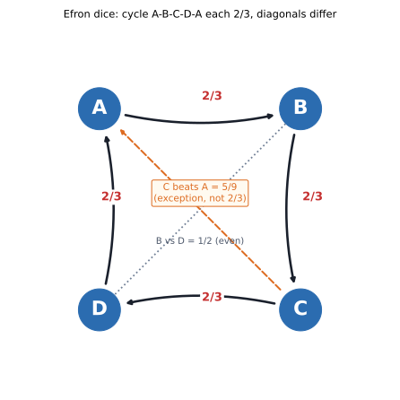

# ch19 — 非傳遞骰子：贏過一圈，卻繞回來輸給起點

> **本章解決什麼問題**：Part V（ch15～ch18）處理的是「大家都知道」這件事本身有多脆弱——知道、互相知道、共同知道，是三種不同的東西。Part VI 換一整個新家族：不再問「你知道什麼」，而是問「你以為理所當然可以一路傳遞下去的那個關係，真的可以傳遞嗎」。本章用一組看起來只是好玩的骰子，示範「甲勝過乙、乙勝過丙」這種關係，不保證「甲勝過丙」——機率意義下的「勝過」，跟你從小學就在用的「大於」，看起來很像，其實是完全不同的兩種關係。下一章（ch20，孔多塞）會換成投票而不是骰子，示範同一個結構怎麼讓多數決本身失去意義；本章先把最乾淨的版本做完。

```text
沒說出口的那句 — 八個部分

  I   解剖學 ────────── ch01 三步解剖：直覺／假設／重建
  │
  II  條件與資訊 ────── ch02 蒙提霍爾 · ch03 三囚犯 · ch04 貝特朗盒子
  │                     ch05 男孩女孩 · ch06 偽陽性
  III 因果聚合計數 ──── ch07 辛普森 · ch08 檢察官謬誤 · ch09 生日問題
  IV  漫步與賭局 ────── ch10 賭徒輸光 · ch11 賭徒謬誤與熱手
  │                     ch12 聖彼得堡 · ch13 兩個信封 · ch14 帕隆多
  V   共同知識 ──────── ch15 紅藍眼睛 · ch16 泥巴小孩
  │                     ch17 意外絞刑 · ch18 兩位將軍
  VI  選擇與集體 ────── ch19 非傳遞骰子 · ch20 孔多塞 · ch21 布雷斯 · ch22 紐康   ◄ 你在這裡
  VII 隨機與測度 ────── ch23 睡美人 · ch24 貝特朗弦 · ch25 班佛 · ch26 巴拿赫–塔斯基
  VIII 收官 ─────────── ch27 一張假設類型總表
```

## 從你已知的出發

這則故事在 2010 年代被反覆轉述：投資人巴菲特（Warren Buffett）某次與微軟創辦人比爾·蓋茲（Bill Gates）一起吃飯，帶了一組總共四顆、長得有點奇怪的骰子——每顆六個面，但點數不是尋常的 1 到 6，而是重複、缺項，看起來像是隨手亂湊出來的數字。巴菲特提議：「你先挑一顆，我再從剩下三顆裡挑一顆，我們各自擲一次，點數大的贏，賭一點小錢怎麼樣？」

這段軼事經《科學人》（Scientific American）等媒體多次轉載，細節出自巴菲特本人事後的口述，不必然逐字精確——這一點跟本書前面幾章（見 ch02 蒙提霍爾一章裡「一萬封讀者來信」的類似提醒）一樣，都該當成「據說」看待。但骰子背後的數學結構，我們接下來會自己完整驗算一遍，不需要相信任何人的轉述。

據載，蓋茲一聽到「你先挑」，反而起了疑心。他沒有立刻挑，而是把四顆骰子要過來，一顆一顆翻看點數，看了半天，最後說：「你先選。」

這個反應，才是本章真正要拆解的東西。乍看之下，「讓對方先選」聽起來像是提議的一方在讓利——畢竟，如果這四顆骰子裡有一顆「最強」的骰子，那先挑的人當然應該挑那一顆，先手怎麼可能吃虧？多數人心裡冒出的第一個念頭大概是這樣：只要骰子的點數是固定的、比賽規則是固定的（點數大的贏），「哪一顆骰子比較強」就應該是一件可以排出名次的事——用數學的話講，「甲通常贏乙」這種關係，理應跟你從小學就在用的「大於」符號一樣，滿足遞移性（transitivity）：如果甲通常贏乙、乙通常贏丙，那甲當然也應該通常贏丙。把四顆骰子按照這種「誰通常贏誰」的關係排一排，理當能排出一條從最強到最弱的隊伍，就像替四個人的身高排序一樣——不可能出現「甲比乙高、乙比丙高、丙卻比甲高」這種荒謬的結果。

如果這個直覺是對的，那麼整組骰子裡一定存在一顆「隊長」：不管對手怎麼挑，這顆骰子的勝率都不會是墊底，「先選」不會是弱勢，甚至該是優勢，因為你能率先把那顆隊長骰子拿走。

蓋茲的猶豫，暗示的卻是完全相反的一件事：這組骰子的「誰比較強」，可能根本排不出一條隊伍。

這正是本章要教會你的東西——一組由史丹佛大學統計學家布拉德利·艾夫隆（Bradley Efron）設計出來、後來被以他為名的骰子，把「勝過」這個聽起來理所當然可以傳遞的關係，做成了一個活生生的反例。在往下讀之前，不妨先自己想一下：如果真的存在這樣一組骰子，讓「甲通常贏乙、乙通常贏丙、丙卻通常贏甲」同時成立，這件事在數學上是怎麼被造出來的？它是某種取巧的障眼法，還是完全誠實、每一步都能算得清清楚楚的機率結果？

## 認識 Efron 的四顆骰子

先把道具攤在桌上。本章使用的四顆骰子，面值如下（本章數字採用本書事實基準表已驗證的版本）：

- 骰子 A：4、4、4、4、0、0
- 骰子 B：3、3、3、3、3、3
- 骰子 C：6、6、2、2、2、2
- 骰子 D：5、5、5、1、1、1

先看幾件顯眼的事。第一，沒有一顆骰子用的是尋常的 1 到 6 點——這組骰子從一開始的設計目的，就不是「公平的擲骰子工具」，而是刻意打造出來的教具。第二，四顆骰子合起來，總共只用到 0 到 6 這七個整數，而且每個數字只出現在其中一顆骰子上：0 和 4 屬於 A、3 屬於 B、2 和 6 屬於 C、1 和 5 屬於 D，彼此完全不重疊。這件事有一個很方便的副作用：任兩顆骰子的任兩個面，數字永遠不會相等——這組骰子擲出「平手」的機率剛好是 0，每一場對決都一定會分出勝負，不需要另外訂「平手怎麼算」的規則，後面的計算會乾淨得多。

本章接下來說的「A 勝 B」，精確定義是：把 A、B 各擲一次（各自獨立、均勻擲出六面中的一面），A 擲出的點數比 B 大的機率超過二分之一。這是全章唯一要用到的定義，先把它記牢，後面所有計算都是圍繞它打轉。

## 動手算到底：A 對 B 的 36 種組合

兩顆骰子各擲一次，一共有 6×6＝36 種等機率的組合。要算「A 勝 B 的機率」，最老實的辦法就是把這 36 種組合全部看過一遍，數清楚有幾種是 A 贏——不猜、不估、不用近似，一格一格數完。

A 的六個面裡，4 出現 4 次、0 出現 2 次；B 的六個面全部是 3。把這 36 種組合，按照 A 擲出的點數分成兩群來算：

```text
A＝4 的那 4 個面，各自對上 B 的 6 個面（每個面都是 3）：
    4 ＞ 3，A 贏。這一群貢獻 4×6＝24 個「A 贏」的組合。

A＝0 的那 2 個面，各自對上 B 的 6 個面（每個面都是 3）：
    0 ＜ 3，A 輸。這一群貢獻 2×6＝12 個「A 輸」的組合。

24 ＋ 12 ＝ 36     ← 兩群加起來剛好是全部 36 種組合，一個都沒漏掉
```

於是：

```text
P(A 勝 B) ＝ 24/36 ＝ 2/3     ← 環上的第一條邊
```

A 贏 B 的機率是三分之二，不是五五波，也不是某個接近一半、被四捨五入的數字。因為 A 只有兩種可能的面值（4 或 0），B 只有一種面值（3），這場對決其實只取決於一件事：A 擲出 4 還是 0——擲到 4（機率 4/6＝2/3）就穩贏，擲到 0（機率 2/6＝1/3）就穩輸。這正是 P(A 勝 B)＝2/3 的直覺版本，跟上面逐格數出來的結果一字不差。

## 沿著環走三步：B 對 C、C 對 D、D 對 A

A 贏 B 只是整個結構的第一步。真正讓這組骰子出名的，是接下來三步會把你帶回原點。用同一套「按面值分組、逐群相乘再相加」的方法，把剩下三條邊算完。

**B 對 C：** B 的六面全是 3；C 的六面裡，6 出現 2 次、2 出現 4 次。

```text
C＝6 的那 2 個面，對上 B 的 6 個面（都是 3）：
    3 ＜ 6，B 輸。這一群貢獻 2×6＝12 個「B 輸」的組合。

C＝2 的那 4 個面，對上 B 的 6 個面（都是 3）：
    3 ＞ 2，B 贏。這一群貢獻 4×6＝24 個「B 贏」的組合。

12 ＋ 24 ＝ 36     ← 全部組合都算到了

P(B 勝 C) ＝ 24/36 ＝ 2/3
```

**C 對 D：** C 的六面裡 6 出現 2 次、2 出現 4 次；D 的六面裡 5 出現 3 次、1 出現 3 次。這一次雙方都有兩種面值，得把四種組合都拆開來看：

```text
C＝6（2 面）對 D＝5（3 面）：6＞5，C 贏，貢獻 2×3＝6 格
C＝6（2 面）對 D＝1（3 面）：6＞1，C 贏，貢獻 2×3＝6 格
C＝2（4 面）對 D＝5（3 面）：2＜5，C 輸，貢獻 4×3＝12 格（算作 C 輸）
C＝2（4 面）對 D＝1（3 面）：2＞1，C 贏，貢獻 4×3＝12 格

C 贏的格數：6＋6＋12＝24
全部格數：6＋6＋12＋12＝36

P(C 勝 D) ＝ 24/36 ＝ 2/3
```

**D 對 A：** D 的六面裡 5 出現 3 次、1 出現 3 次；A 的六面裡 4 出現 4 次、0 出現 2 次。

```text
D＝5（3 面）對 A＝4（4 面）：5＞4，D 贏，貢獻 3×4＝12 格
D＝5（3 面）對 A＝0（2 面）：5＞0，D 贏，貢獻 3×2＝6 格
D＝1（3 面）對 A＝4（4 面）：1＜4，D 輸，貢獻 3×4＝12 格（算作 D 輸）
D＝1（3 面）對 A＝0（2 面）：1＞0，D 贏，貢獻 3×2＝6 格

D 贏的格數：12＋6＋6＝24
全部格數：12＋6＋12＋6＝36

P(D 勝 A) ＝ 24/36 ＝ 2/3
```

把四條邊放在一起看：A 勝 B（2/3）、B 勝 C（2/3）、C 勝 D（2/3）、D 勝 A（2/3）。四個數字完全一樣，構成一個閉合的環：A→B→C→D→A，每一步都以完全相同的機率贏過下一顆。這不是巧合湊出來的相似數字，是四次各自獨立、各自窮舉了全部 36 種組合之後，算出來的精確結果。



這張圖要你看的重點：四個節點排成一個正方形，環上的四條邊（正方形的四個邊）全部是 2/3；但正方形還有兩條對角線——那兩條對角線代表的，正是接下來要算的「非相鄰」組合，數值完全不是 2/3。

## 例外：兩條對角線不是 2/3

到這裡，一個危險的過度推論很容易冒出來：「既然環上每一步都是 2/3，是不是這四顆骰子裡，隨便任兩顆放在一起比，勝率都是 2/3？」

答案是否定的。四顆骰子兩兩配對，一共有 C(4,2)＝6 種配對，環上相鄰的四種（AB、BC、CD、DA）已經算完，都是 2/3；剩下兩種是正方形的兩條對角線——C 對 A、B 對 D——這兩種配對必須另外算，而且算出來的答案彼此也不相等。

**C 對 A：** C 的六面裡 6 出現 2 次、2 出現 4 次；A 的六面裡 4 出現 4 次、0 出現 2 次。

```text
C＝6（2 面）對 A＝4（4 面）：6＞4，C 贏，貢獻 2×4＝8 格
C＝6（2 面）對 A＝0（2 面）：6＞0，C 贏，貢獻 2×2＝4 格
C＝2（4 面）對 A＝4（4 面）：2＜4，C 輸，貢獻 4×4＝16 格（算作 C 輸）
C＝2（4 面）對 A＝0（2 面）：2＞0，C 贏，貢獻 4×2＝8 格

C 贏的格數：8＋4＋8＝20
全部格數：8＋4＋16＋8＝36

P(C 勝 A) ＝ 20/36 ＝ 5/9
```

5/9 約等於 0.5556，比 2/3（約 0.6667）小了一截，但仍然明顯超過二分之一——C 還是贏面比較大的一方，只是贏得沒有環上的邊那麼乾脆。換句話說，A 反過來贏 C 的機率是 1－5/9＝4/9，比 A 輸給 B 那次的 1/3 要好一些，但終究還是輸面較大的一方。

**B 對 D：** B 的六面全是 3；D 的六面裡 5 出現 3 次、1 出現 3 次。

```text
D＝5（3 面）對上 B 的 6 個面（都是 3）：
    3 ＜ 5，B 輸。這一群貢獻 6×3＝18 個「B 輸」的組合。

D＝1（3 面）對上 B 的 6 個面（都是 3）：
    3 ＞ 1，B 贏。這一群貢獻 6×3＝18 個「B 贏」的組合。

18 ＋ 18 ＝ 36     ← 全部組合都算到了

P(B 勝 D) ＝ 18/36 ＝ 1/2
```

B 對 D 剛好是五五波——不是「兩者旗鼓相當、大概差不多」這種模糊的說法，是精確算出來、分母 36 裡剛好對半分的 18 比 18。

把六個配對的結果收攏成一張表：

| 配對 | 勝方 | 機率 | 是環上的邊嗎 |
|---|---|---|---|
| A 對 B | A | 2/3 | 是 |
| B 對 C | B | 2/3 | 是 |
| C 對 D | C | 2/3 | 是 |
| D 對 A | D | 2/3 | 是 |
| C 對 A | C | 5/9 | 否（對角線） |
| B 對 D | 平手線上的一半一半 | 1/2 | 否（對角線） |

這張表就是本章最需要牢記的精確版本：**只有環上相鄰的四對是 2/3，兩條對角線（C 對 A、B 對 D）各自是不同的數字，5/9 不等於 1/2，兩者也都不等於 2/3。** 只要哪裡把「這組骰子每一對都是 2/3」寫出來或講出來，就已經是一個需要修正的錯誤版本。

## 別被平均值騙了：期望值排序不是勝率排序

在往下講「傳遞性為什麼骨折」之前，值得先戳破另一個常見的替代直覺——有些人算不清楚 36 格逐一比較，會想抄捷徑：「不然，先比比看哪顆骰子的平均點數（期望值）比較高，平均值高的那顆應該比較容易贏吧？」這個念頭聽起來也很合理，但同樣會誤導你。

四顆骰子的期望值（expected value）分別是：

```text
E[A] ＝ (4×4 ＋ 0×2) / 6 ＝ 16/6 ＝ 8/3 ≈ 2.667
E[B] ＝ (3×6) / 6 ＝ 18/6 ＝ 3
E[C] ＝ (6×2 ＋ 2×4) / 6 ＝ 20/6 ＝ 10/3 ≈ 3.333
E[D] ＝ (5×3 ＋ 1×3) / 6 ＝ 18/6 ＝ 3
```

按平均值由高到低排：C（3.333）＞ B（3）＝ D（3）＞ A（2.667）。如果「平均值高就比較會贏」的直覺是對的，C 應該是全場勝率最高的骰子。但正文已經算過：B 勝 C 的機率是 2/3——平均值排名墊底附近的 B，反而穩穩地贏過平均值排名第一的 C。平均點數高，不代表逐面比大小時佔便宜；C 的兩個 6 很搶眼，把平均值拉得很高，但 C 有四個面只有 2 點，一旦碰上 B 那六個穩定的 3，這四個面全部落敗，抵銷掉了 6 帶來的優勢還有剩。

還有一個容易被誤讀成規律的巧合，值得先說在前面：B 和 D 的期望值剛好都是 3，而兩者對決又剛好是精確的 1/2。這看起來像是「期望值相等，就會五五波」的一條定理，但它不是——這只是這組數字剛好設計成這樣的巧合，不是任何一般規則的必然結果（本章「紙上推演」練習 2 會請你親手驗算一組期望值相等、但對決結果完全不是五五波的骰子，把這個陷阱徹底戳破）。期望值是把一整顆骰子的資訊壓縮成一個數字，壓縮的過程一定會丟資訊——兩顆期望值相同的骰子，點數的分布形狀可以完全不同，逐面比較的結果自然也可能完全不對稱。

## 誰先選就注定吃虧：回頭解開巴菲特與蓋茲的謎

現在有了完整的六格勝率表，可以回頭解開本章開頭那個謎：蓋茲為什麼堅持要巴菲特先選？

答案在於：不管對手先選哪一顆，你都能從剩下三顆裡，找到一顆用環上的邊擊敗它——不需要動用兩條對角線的數字，光靠環本身就夠了。把「環的上一顆」定義成「在 A→B→C→D→A 這個方向上，指向某顆骰子的那一顆」：指向 A 的是 D、指向 B 的是 A、指向 C 的是 B、指向 D 的是 C。於是：

```text
對手選 A → 你選 D，P(你贏) ＝ P(D 勝 A) ＝ 2/3
對手選 B → 你選 A，P(你贏) ＝ P(A 勝 B) ＝ 2/3
對手選 C → 你選 B，P(你贏) ＝ P(B 勝 C) ＝ 2/3
對手選 D → 你選 C，P(你贏) ＝ P(C 勝 D) ＝ 2/3
```

不管對手挑哪一顆，後選的人永遠有一顆現成的骰子，能保證至少 2/3 的勝率——這正是「沒有一顆隊長骰子」這件事的具體代價：既然沒有一顆骰子能通吃其他三顆，「先選」就再也不是優勢，反而是把主動權讓給了後手。蓋茲翻看四顆骰子看了半天，很可能就是在檢查這個環是否存在——他沒有算出精確的 2/3、5/9、1/2，但顯然察覺到「這四顆骰子背後沒有一條乾淨的排名」，所以拒絕先手。這也解釋了巴菲特為什麼原本敢開出「你先選」這種聽起來大方的提議：真正佔便宜的，從來就是後選的那一方。

## 傳遞性為什麼在這裡骨折

回到本章最核心的問題：為什麼「A 通常贏 B、B 通常贏 C」推不出「A 通常贏 C」？要回答這個問題，得先把「傳遞」這個詞的精確定義攤開來看。

一個定義在某個集合上的關係 R，稱為可傳遞（transitive），若且唯若：對集合裡任意三個元素 x、y、z，只要 xRy 且 yRz 成立，就一定有 xRz 成立。實數的「大於」（＞）滿足這個定義：如果 x＞y 且 y＞z，兩個不等式相加移項後，必然得到 x＞z——這是實數順序結構的基本性質，任何時候都成立，沒有例外，也是我們從小被訓練得對「順序」深信不疑的來源。

本章的「勝過」關係，表面上長得很像「大於」——兩顆骰子放在一起比、點數大的贏——但它其實是另一種完全不同的東西：它是針對「一整顆骰子」（一個隨機變數）定義的一個逐對比較，本質上是一種競賽關係（在數學裡，n 個參賽者兩兩對決、每場都分出勝負的完整結果，稱為一個競賽圖，tournament）。競賽關係只保證「任兩個之間一定分得出勝負」，卻完全沒有保證「勝負的方向不會繞成一個圈」。A→B→C→D→A 這個環，就是一個貨真價實、可以算得清清楚楚的競賽圖循環：環上每一條邊都誠實地分出勝負（沒有一步是平手），但把四條邊串起來，方向卻繞回了起點。

為什麼會這樣？把六個配對的機率表拿出來重看一次，會發現一個共同的結構：每顆骰子都是靠「用一部分不算頂尖、但夠用的中等面值，穩穩壓過對手的普通面值」取勝，同時又對另一顆骰子的「少數幾個極端高面值」束手無策。A 的四個 4 穩穩壓過 B 全部的 3，但 A 完全沒有面對得了 D 那三個 5；D 的三個 5 穩穩壓過 A 的四個 4（外加兩個 0 更不用說），但 D 那三個 1 完全擋不住 C 那四個 2；如此環環相扣。每顆骰子的優勢和弱點，剛好被設計成跟環上「下一顆」的弱點和優勢對得起來，跟「上一顆」的弱點和優勢對不起來——這正是非傳遞骰子（nontransitive dice）之所以能被設計出來的機制核心：只要一種關係是靠著「在某些區間佔優、在另一些區間認輸」這種局部的、非全域一致的方式定義出來，遞移性就沒有任何理由必須成立。「大於」之所以可傳遞，是因為它是對同一把尺（實數線）上兩個確定的點做比較；「勝過」比的卻是兩個機率分布互相穿插之後的淨結果，兩者是完全不同層級的物件。

這正是本章埋在骰子背後的那句沒說出口的假設——把它攤在陽光下之前，先看下一章的預告：同樣的循環結構，換成「一群人對三個以上的選項做多數決投票」也會冒出來（見 ch20 孔多塞悖論），只是把骰子換成了選票、把「點數大的贏」換成了「多數人比較喜歡」。骰子與投票表面上毫不相干，底下卻是同一副數學骨架。

## 誰發明了這副骰子：Efron、Gardner，與另一組不同的骰子

這組骰子的發明者，是史丹佛大學（Stanford University）統計學家布拉德利·艾夫隆（Bradley Efron）——他後來以提出拔靴法（bootstrap，一種現在統計學裡幾乎人人都會用到的重抽樣技術）聞名於世，並在 2005 年獲頒美國國家科學獎章。艾夫隆具體是哪一年設計出這組骰子，已不可考，只知道是在 1970 年之前的幾年。

真正把這組骰子介紹給大眾的，是老加德納（Martin Gardner）在《科學人》（Scientific American）1970 年 12 月號（第 223 卷，第 110 至 114 頁）「數學遊戲」（Mathematical Games）專欄裡的一篇文章，標題是〈非傳遞骰子的悖論與難以捉摸的無差別原則〉（The Paradox of the Nontransitive Dice and the Elusive Principle of Indifference）——這是這組骰子第一次公開見諸印刷品。

值得順帶一提、但本章不深入的一件事：後來英國數學科普作者詹姆斯·格萊姆（James Grime）另外設計了一組五顆一組的骰子（俗稱 Grime dice），能做出比 Efron 骰子更複雜的非傳遞效果，甚至有「把骰子的點數翻倍之後，其中一個循環方向會反轉」這種更詭異的性質——但那是一個不同、也比 Efron 骰子晚了將近半世紀的構造，不是同一組骰子的重新包裝，細節不在本章展開。

## 直覺的陷阱

把本章開頭那個自信的答案拆開來看，一步一步指認它在哪裡踩空：

| 階段 | 發生了什麼 |
|---|---|
| 直覺的自信答案 | 骰子的點數固定、規則固定（點數大的贏），「哪顆骰子比較強」理應能排出一條從強到弱的隊伍；先選的人只要挑走最強的那一顆，先手就該是優勢，不可能是劣勢 |
| 偷渡的假設 | 把「A 通常贏 B」這種逐對比較的機率關係，直接套用了「大於」在實數上才具備的可傳遞性——沒有意識到「勝過」其實是一種靠局部區間分布互相穿插決定的競賽關係（tournament），而不是像實數順序那樣、對同一把尺上兩個固定點的比較 |
| 為什麼聽起來理所當然 | 我們從小到大接觸的「排序」幾乎都是可傳遞的（身高、分數、金額……），大腦已經把「可以比較大小」和「可以排出一條總順序」這兩件事，內化成幾乎同一件事；很少有日常經驗會逼你去區分「兩兩都能分出勝負」跟「一定能排出一條全域的隊伍」，其實是兩個不同的命題 |
| 在哪一步被帶溝裡 | 不是任何一步算術算錯了——四條環邊的 2/3、兩條對角線的 5/9 與 1/2，全部經得起逐格驗算。錯的是在還沒驗算之前，就跳過了「這種關係到底有沒有可傳遞的保證」這個問題，直接假設答案是有 |
| 怎麼自我察覺 | 只要看到「A 通常勝過 B、B 通常勝過 C」這種語句，先問自己一句：這裡的「勝過」，是像「大於」一樣針對同一把固定尺上兩個點的比較，還是像本章這樣，是兩個機率分布局部穿插之後算出來的淨結果？只要答案是後者，遞移性就不能被假設，必須逐對算過、或至少先找找看有沒有環存在 |

值得多說一句：這個陷阱不是骰子特有的把戲。任何一個由「逐對比較的機率淨結果」定義出來的關係——球隊之間的勝率、藥物之間的療效優劣、產品之間的消費者偏好調查——原則上都可能藏著同一種環。本章接下來兩章（ch20 孔多塞、ch21 布雷斯）會讓你看到，這個結構換了兩種完全不同的外衣，一樣能讓「集體看起來理性的規則」，繞出一個誰都想不到的圈。

> **那句沒說出口的話是**：「甲通常勝過乙、乙通常勝過丙，所以甲通常也該勝過丙」，把機率意義下逐對比較出來的「勝過」，直接套用了「大於」這種只有在同一把固定尺上比較兩個點時才具備的可傳遞性——但「勝過」其實是一種靠機率分布局部穿插決定勝負的競賽關係，沒有任何保證它不會繞成一個環。

## 紙上推演

**練習 1（★☆☆，10 分鐘）**：不做任何新計算，只憑本章正文已經算出的四條環邊機率（A 勝 B、B 勝 C、C 勝 D、D 勝 A 皆為 2/3），論證一件事：這四顆骰子裡，沒有任何一顆能被稱為「全場最強」——換句話說，對任何一顆骰子，都存在另一顆能以 2/3 的機率擊敗它。寫下你的論證邏輯（不必再算任何新的機率）。

**練習 2（★★☆，15 分鐘）**：本章提過「期望值相等，不保證對決是五五波」，這裡請你親手驗證這句話。給定兩顆新骰子：P 的六面是 0、0、0、0、0、30；Q 的六面是 5、5、5、5、5、5。(a) 分別算出 E[P] 與 E[Q]，確認兩者是否相等；(b) 用本章「逐格分組相乘」的方法，完整算出 P(P 勝 Q)；(c) 把這個結果拿來跟本章 B 對 D（期望值同為 3、對決結果剛好是 1/2）做對比，說明「期望值相等」到底能不能保證「對決五五波」。

**練習 3（★★★，20～25 分鐘）**：驗證另一組三顆骰子的非傳遞循環。給定：骰子 I 的六面是 2、2、4、4、9、9；骰子 II 的六面是 1、1、6、6、8、8；骰子 III 的六面是 3、3、5、5、7、7。請完整算出 P(I 勝 II)、P(II 勝 III)、P(III 勝 I) 三個機率（提醒：這三顆骰子每顆都有三種不同面值，逐格分組時要拆成 3×3＝9 種面值組合，過程比本章正文的骰子稍微繁瑣，但方法完全一樣）。這三個機率是否構成一個閉合的環？環上每一步的機率是多少？

### 推演解答

**練習 1 解答**：本章正文已經算出 A 勝 B、B 勝 C、C 勝 D、D 勝 A，四個機率全部是 2/3。假設有人主張「X 是全場最強的骰子」，X 必須是 A、B、C、D 之一。但無論 X 是哪一顆，四條環邊裡都有恰好一條「別人打敗 X」的邊：若 X＝A，D 勝 A（2/3）；若 X＝B，A 勝 B（2/3）；若 X＝C，B 勝 C（2/3）；若 X＝D，C 勝 D（2/3）。也就是說，對任何一顆候選的「最強骰子」，都存在另一顆能以 2/3 的機率擊敗它——「全場最強」這個頭銜，邏輯上不可能落在任何一顆骰子頭上，因為只要你指認出一顆候選者，環的結構立刻就給你變出一顆剋星。這正是「沒有隊長骰子」這句話的精確意義：不是「很難找到最強的」，而是「最強的」這個概念本身，在這種循環結構下沒有良定義的答案。

**練習 2 解答**：

```text
(a) E[P] ＝ (0×5 ＋ 30×1) / 6 ＝ 30/6 ＝ 5
    E[Q] ＝ (5×6) / 6 ＝ 30/6 ＝ 5
    兩者期望值完全相等，皆為 5。

(b) P 的六面：0（出現 5 次）、30（出現 1 次）；Q 的六面：全部是 5。

    P＝0（5 面）對上 Q 的 6 個面（都是 5）：
        0 ＜ 5，P 輸。這一群貢獻 5×6＝30 個「P 輸」的組合。
    P＝30（1 面）對上 Q 的 6 個面（都是 5）：
        30 ＞ 5，P 贏。這一群貢獻 1×6＝6 個「P 贏」的組合。

    30 ＋ 6 ＝ 36     ← 全部組合都算到了

    P(P 勝 Q) ＝ 6/36 ＝ 1/6

(c) B 與 D 期望值相同（皆為 3），對決結果剛好是 1/2；
    P 與 Q 期望值也相同（皆為 5），對決結果卻是 1/6——完全不是五五波。
```

這組結果戳破了一個容易被誤讀成規律的巧合：B 對 D 的 1/2，純粹是那組數字設計出來的個案，不是「期望值相等就必然五五波」的定理。P 之所以期望值能追平 Q，全靠那唯一一個 30 的極端值撐起來；但正常對決時，P 有五分之六的機率（一次擲骰的六面裡有五面）落在 0，遠遠低於 Q 穩定的 5，所以絕大多數時候 P 都輸。期望值把整顆骰子的資訊壓縮成一個數字，這個壓縮的過程本身就會把「點數分布的形狀」——到底是集中、還是像 P 這樣一頭極端、一頭平庸——完全抹平，而逐對比較的勝率恰恰高度依賴這個被抹平的形狀。

**練習 3 解答**：三顆骰子每顆都有三種面值，逐格分組時要拆成 3×3＝9 種面值組合。先把每一種面值組合的勝負與格數列清楚，再加總：

```text
I 對 II：I＝{2(×2), 4(×2), 9(×2)}，II＝{1(×2), 6(×2), 8(×2)}

  I＝2 對 II＝1：2＞1，I贏，2×2＝4格
  I＝2 對 II＝6：2＜6，I輸，2×2＝4格
  I＝2 對 II＝8：2＜8，I輸，2×2＝4格
  I＝4 對 II＝1：4＞1，I贏，2×2＝4格
  I＝4 對 II＝6：4＜6，I輸，2×2＝4格
  I＝4 對 II＝8：4＜8，I輸，2×2＝4格
  I＝9 對 II＝1：9＞1，I贏，2×2＝4格
  I＝9 對 II＝6：9＞6，I贏，2×2＝4格
  I＝9 對 II＝8：9＞8，I贏，2×2＝4格

  I 贏的組合：(2,1)、(4,1)、(9,1)、(9,6)、(9,8)，共 5 種面值組合，每種各佔 4 格
  I 贏的格數：5×4＝20
```

換成本章正文慣用的「按面值分群、群內機率相加」寫法，重新算一次確認答案一致：

```text
I 面值：2（機率 2/6）、4（機率 2/6）、9（機率 2/6）
II 面值：1（機率 2/6）、6（機率 2/6）、8（機率 2/6）

v＝2 對 II：僅贏過 1（2＞1），贏的面數佔 II 的 2/6；貢獻 2×2＝4 格
v＝4 對 II：僅贏過 1（4＞1），贏的面數佔 II 的 2/6；貢獻 2×2＝4 格
v＝9 對 II：贏過 1、6、8 全部（9 最大），贏的面數佔 II 的 6/6；貢獻 2×6＝12 格

I 贏的格數：4＋4＋12＝20
全部格數：36

P(I 勝 II) ＝ 20/36 ＝ 5/9
```

同樣的方法算 II 對 III、III 對 I：

```text
II 對 III：II＝{1(×2), 6(×2), 8(×2)}，III＝{3(×2), 5(×2), 7(×2)}

v＝1 對 III：不贏任何一個（1 最小），貢獻 0 格
v＝6 對 III：贏過 3、5（6＞3、6＞5），輸給 7；贏的面數佔 4/6；貢獻 2×4＝8 格
v＝8 對 III：贏過 3、5、7 全部；貢獻 2×6＝12 格

II 贏的格數：0＋8＋12＝20
P(II 勝 III) ＝ 20/36 ＝ 5/9


III 對 I：III＝{3(×2), 5(×2), 7(×2)}，I＝{2(×2), 4(×2), 9(×2)}

v＝3 對 I：贏過 2；輸給 4、9；貢獻 2×2＝4 格
v＝5 對 I：贏過 2、4；輸給 9；貢獻 2×4＝8 格
v＝7 對 I：贏過 2、4；輸給 9；貢獻 2×4＝8 格

III 贏的格數：4＋8＋8＝20
P(III 勝 I) ＝ 20/36 ＝ 5/9
```

三個機率都是 5/9，而且方向剛好首尾相接：I 勝 II、II 勝 III、III 勝 I——是一個閉合的三元環，環上每一步的勝率都是 5/9（比本章正文 Efron 骰子環上的 2/3 溫和一些，但一樣穩穩超過二分之一，一樣構成一個沒有「隊長」的循環）。這說明本章的結論不是 Efron 那四顆骰子獨有的巧合：只要面值分布設計得當，三顆骰子、四顆骰子，甚至更多顆骰子，都能造出同樣結構的非傳遞循環。

## 自我檢核

1. 用一句話講清楚：本章的「A 勝 B」精確定義是什麼？為什麼這組骰子剛好不會出現平手？
2. 為什麼「大於」這種關係在實數上一定可傳遞，但「哪顆骰子通常擲得比較大」這種關係不一定？兩者最根本的差異在哪裡？
3. 不看課文，自己重新算一次 A 對 B 的 24/36，並說出「按面值分群、群內機率相加」這個方法為什麼等同於把 36 種組合全部列出來看一遍。
4. C 對 A 的 5/9 和 B 對 D 的 1/2，這兩個數字為什麼不能被視為「跟環上的 2/3 差不多，四捨五入一下都算 2/3」？把兩者的精確值和環上的 2/3 放在一起比較，說明差距。
5. 「期望值排序」和「逐對勝率排序」是兩種不同的比較方式，本章用哪一個具體例子證明了「平均值較高不代表逐對比較較容易贏」？
6. 如果對手先選了 C，你會選哪一顆骰子、勝率是多少？把你的推理依據講一次（不查表，憑本章的環狀邏輯直接推）。
7. 這個悖論那句沒說出口的假設是什麼？試著不看課文，用自己的話重講一次，並舉一個骰子以外、也可能藏著同樣陷阱的情境（球隊戰績、產品偏好調查……皆可）。
8. 本章結尾預告了 ch20（孔多塞悖論）會用投票重現同一個結構。你能不能先猜猜看，「候選人」跟「非傳遞骰子裡的骰子」，在這個類比裡分別對應到什麼？

## 延伸閱讀

- 〈Intransitive dice〉，Wikipedia——本章 Efron 四顆骰子的面值、環上勝率、與對角線例外的總覽條目，可作為本章計算的交叉核對。<https://en.wikipedia.org/wiki/Nontransitive_dice>
- Gardner, M. (1970). "Mathematical Games: The Paradox of the Nontransitive Dice and the Elusive Principle of Indifference." *Scientific American*, 223, 110–114.——本章歷史段落引用的原始專欄，這組骰子第一次公開見諸印刷品之處。<https://www.scientificamerican.com/article/mathematical-games-1970-12/>
- "How Warren Buffett Rigged a Dice Game with Bill Gates", *Scientific American* Guest Blog——本章開場軼事的來源報導；細節出自巴菲特本人轉述，本書已在正文提醒讀者將其視為「據載」的敘事而非逐字精確的史料。<https://www.scientificamerican.com/article/how-warren-buffett-rigged-a-dice-game-with-bill-gates/>
- "Efron's Dice", Wolfram MathWorld——簡潔的數學條目，附四顆骰子的勝率矩陣，方便快速核對本章表格。<https://mathworld.wolfram.com/EfronsDice.html>
- Grime, J. "Nontransitive Dice for Three Players"（Gathering 4 Gardner 資料）——本章一句話帶過的 Grime dice 出處，有興趣深入不同、較晚構造的讀者可從此篇入手（未驗證：本書未逐字核對其完整證明細節）。<https://www.gathering4gardner.org/g4g13gift/games/GrimeJames-GiftExchange-NontransitiveDice-G4G13.pdf>
