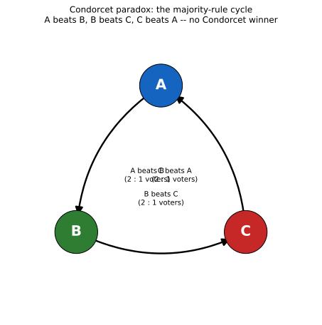

# ch20 — 孔多塞悖論：多數決會轉圈

> **本章解決什麼問題**：ch19 用四顆骰子證明「甲贏過乙」這種關係不必可傳遞（transitive）——這一章把同一種現象搬到一個乍看完全不同的場景：投票。三個理性的選民，每個人心裡的偏好都乾淨俐落、毫無矛盾，但只要把他們的偏好用「兩兩相比、多數決」的方式合成一個「集體偏好」，合出來的結果照樣可以繞著圈子跑，找不到一個大家公認「最好」的選項。這是本書「選擇與集體」（Part VI）的第二章，也是全書後段少數直接橋接回前一章的悖論之一：非傳遞骰子的機制，幾乎原封不動地搬進了投票箱。下一章 ch21 布雷斯悖論會離開「聚合怎麼騙人」，轉去談另一種集體失靈——每個人都理性自利，系統整體卻變得更糟。

## 從你已知的出發

想像十八世紀末的巴黎，法國科學院裡一場關於「怎麼選出院士」的爭論。當時的科學院確實會用投票決定人選、決定獎項、決定各種需要集體表態的場合，而怎麼把一群人的個別意見，換算成一個「大家的意見」，從來不是一件顯而易見的小事。

這場爭論裡有兩位主角。第一位是數學家兼工程師波達（Jean-Charles de Borda）。一七七〇年，他在法國皇家科學院提出一套具體的計票辦法：每位選民把所有候選人排出名次，第一名給最高分、第二名次高分，依序遞減，最後把每位候選人從所有選民那裡拿到的分數加總，總分最高的當選。這套辦法後來被稱為波達計數法（Borda count），邏輯直觀、規則明確，一時頗受科學院採用。

第二位主角，就是本章的主角——孔多塞侯爵（Marquis de Condorcet）。孔多塞是啟蒙時代少見同時橫跨數學與政治哲學的人物，他對波達的辦法並不滿意。他的疑慮很直觀：波達計數法看的是「總分」，但總分會被選民怎麼填寫排序的細節左右——如果某個選民把原本沒什麼希望的候選人排得很低、藉此拉抬自己屬意的人選相對名次，總分就可能被操弄，而這種操弄的痕跡不會直接顯現出來。孔多塞認為，真正該問的問題更根本：與其看總分，不如直接問「如果只讓這兩個人一對一競爭，多數人會選誰」——把每一對候選人都拿出來單挑一次，用最直接、最沒有花招空間的方式，一對一算出多數決的結果。這聽起來是再公平不過的原則：既然每一場一對一的多數決都清清楚楚、無可爭議，把所有這些一對一的結果放在一起，應該就能拼出一個同樣清楚、同樣可信的「整體排名」。

在你繼續往下讀之前，先把這個直覺在心裡確認一遍：三位選民，每個人心裡對三個選項都有一份前後一致、不自相矛盾的排序——這叫作偏好（preference）具有可傳遞性（transitivity），意思是如果某人覺得甲比乙好、乙比丙好，那他一定也覺得甲比丙好，不會有人心裡想著「甲比乙好，乙比丙好，但丙比甲好」這種自相矛盾的排序。既然每一位選民自己想得清清楚楚、毫無矛盾，那麼把這三份排序放在一起，兩兩單挑、讓多數決說了算，合出來的「集體排序」怎麼可能會不清楚、會出現矛盾？直覺告訴我們：不可能。個人的理性應該會層層疊加成集體的理性，這幾乎像是一條不需要證明的常識。

孔多塞在一七八五年出版的《論多數決之機率分析在決策裡的應用》（*Essai sur l'application de l'analyse à la probabilité des décisions rendues à la pluralité des voix*，直譯大意如此，後文簡稱《隨筆》）裡，正是想用嚴謹的機率分析，替他偏好的「成對比較」方法背書。但他自己算著算著，卻算出了一個連他自己都始料未及的結果——這個結果不但沒有替波達計數法的對手撐腰，反而讓「兩兩單挑、多數決」這個聽起來無懈可擊的原則，自己先崩潰給大家看。這一章要重建的，就是孔多塞怎麼親手拆穿了自己原本想捍衛的方法。

## 三個選民、三個選項：把偏好列成一張表

先把場景收斂到最小、卻已經足夠致命的規模：三位選民，投票選出三個選項裡的一個，記作 A、B、C（可以想成三位候選人、三項政策提案，或任何需要三選一的場合，本章不特別指定，只在乎背後的數學結構）。

每位選民對 A、B、C 三者，都有一份完整、可傳遞的偏好排序——用符號「≻」表示「嚴格偏好於」，例如「A ≻ B」讀作「偏好 A 甚於 B」。孔多塞在《隨筆》裡分析的核心案例，正是下面這一組排序：

| 選民 | 偏好排序 |
|---|---|
| 選民 1 | A ≻ B ≻ C |
| 選民 2 | B ≻ C ≻ A |
| 選民 3 | C ≻ A ≻ B |

先確認一件事：這三份排序，每一份自己都是完全合理、完全可傳遞的——選民 1 覺得 A 最好、C 最差，中間夾著 B；選民 2 覺得 B 最好、A 最差；選民 3 覺得 C 最好、B 最差。三個人，剛好把 A、B、C 三種排法輪流轉了一圈（A-B-C、B-C-A、C-A-B），像是把同一副撲克牌洗過三次、每次都往同一個方向遞移一位。沒有任何一位選民心裡是矛盾的、糊塗的，每個人都清清楚楚知道自己要什麼。

接下來，孔多塞要做的事，正是他所偏好的那套辦法：把 A、B、C 兩兩拿出來單挑，看看在每一場「一對一」的多數決裡，誰會贏。

## 三場成對對決：循環怎麼跑出來

**第一場對決：A 對 B。** 逐一檢查每位選民，在 A 跟 B 之間，比較偏好誰：

```text
選民 1：A ≻ B ≻ C  → 偏好 A 甚於 B  → 投給 A
選民 2：B ≻ C ≻ A  → 偏好 B 甚於 A  → 投給 B
選民 3：C ≻ A ≻ B  → 偏好 A 甚於 B  → 投給 A
────────────────────────────────────────────
計票：A 得 2 票（選民 1、3），B 得 1 票（選民 2）
結果：A 以 2 比 1 擊敗 B
```

**第二場對決：B 對 C。** 同樣逐一檢查：

```text
選民 1：A ≻ B ≻ C  → 偏好 B 甚於 C  → 投給 B
選民 2：B ≻ C ≻ A  → 偏好 B 甚於 C  → 投給 B
選民 3：C ≻ A ≻ B  → 偏好 C 甚於 B  → 投給 C
────────────────────────────────────────────
計票：B 得 2 票（選民 1、2），C 得 1 票（選民 3）
結果：B 以 2 比 1 擊敗 C
```

**第三場對決：C 對 A。** 這一場是關鍵的最後一步：

```text
選民 1：A ≻ B ≻ C  → 偏好 A 甚於 C  → 投給 A
選民 2：B ≻ C ≻ A  → 偏好 C 甚於 A  → 投給 C
選民 3：C ≻ A ≻ B  → 偏好 C 甚於 A  → 投給 C
────────────────────────────────────────────
計票：C 得 2 票（選民 2、3），A 得 1 票（選民 1）
結果：C 以 2 比 1 擊敗 A
```

把三場對決的結果擺在一起看：

```text
A 打敗 B（2:1）
B 打敗 C（2:1）
C 打敗 A（2:1）
```

這正是全書基準表外、本章專屬的核心結果：三場成對多數決，每一場都乾淨俐落地分出勝負，沒有任何平手，但三場結果串起來，卻繞成了一個閉合的圈：A 贏 B、B 贏 C、C 反過來又贏 A。「贏過」這個關係，在集體層次上失去了可傳遞性——你沒辦法說「A 比 B 好、B 比 C 好，所以 A 比 C 好」，因為投票的結果明明白白告訴你，C 才是那場一對一對決裡的贏家。下圖把這個循環畫成一張圖，箭頭從每一場對決的贏家指向輸家：



這張圖要你看的重點，是三個節點的對稱性：如果只挑 A 跟 B 一場對決，A 看起來像贏家；如果只挑 B 跟 C 一場對決，B 看起來像贏家；如果只挑 C 跟 A 一場對決，C 看起來像贏家。三場對決各自都給出一個「贏家」，但把三場放在一起，沒有任何一個節點，是那個永遠贏、從不輸的選項——每一個節點都至少輸過一場。

孔多塞把這種在成對多數決底下「誰都打不贏所有其他人」的局面，稱為沒有孔多塞贏家（Condorcet winner）。孔多塞贏家的精確定義是：一個選項，在跟其餘每一個選項的成對多數決裡都獲勝。在上面這組三選民的偏好底下，A、B、C 三者都不是孔多塞贏家——每一個都能找到另一個選項，在一對一單挑裡把它擊敗。這不是計票出了錯，三場投票各自都算得完全正確；問題出在，把三個各自正確的局部結果，硬拼成一個整體結論這一步，本身沒有保障。

## 沒有孔多塞贏家：波達與孔多塞的老對手戲

值得停下來想一想這個結果對孔多塞自己有多諷刺。他原本是為了替「成對比較」這套方法辯護、跟波達計數法打對台，才動手做這個機率分析；結果算出來的，卻是「成對比較」這套方法自己內部就可能沒有答案——連一個唯一、無爭議的贏家都端不出來。孔多塞當然沒有因此就倒戈支持波達，他後來提出了各種「怎麼從循環裡挑出一個近似最合理排名」的修補辦法（這類方法今天統稱孔多塞法，見延伸閱讀），但《隨筆》裡這個三選民範例本身，成了社會選擇理論（social choice theory，研究「怎麼把個人偏好合成集體決策」的學門）裡最早、也最乾淨的一個反例：它證明了，即使拿孔多塞自己心目中「最公平」的方法（兩兩單挑多數決），也保證不了合成出來的集體偏好是可傳遞的。

這裡有一個值得順手看一眼、但不深入的對照：波達計數法會不會也在同一組偏好底下遇到麻煩？把上表三位選民的排序，按照波達計數法的規則換算成分數（三個選項給 2 分、1 分、0 分）：

```text
選民 1（A≻B≻C）：A=2 分，B=1 分，C=0 分
選民 2（B≻C≻A）：B=2 分，C=1 分，A=0 分
選民 3（C≻A≻B）：C=2 分，A=1 分，B=0 分
──────────────────────────────────────
總分：A = 2+0+1 = 3　B = 1+2+0 = 3　C = 0+1+2 = 3
```

三個選項的波達總分完全相等——三方平手，沒有循環，卻也一樣沒有唯一贏家，只是失敗的方式從「繞圈子」換成了「打成平手」。這個平手不是巧合：這組偏好本身具有完美的輪轉對稱性（三位選民的排序剛好互相輪替一位），任何把每個選項一視同仁對待的計分規則，套在這種完全對稱的輸入上，都不可能給出偏袒任何一方的結果。波達計數法之所以不會「循環」，根本原因是它把每位選民的排序換算成一個實數分數，再把所有分數加總——實數的大小順序天生就是可傳遞的（3 分永遠比 2 分多，2 分永遠比 1 分多，這件事不會因為換一個選項而改變），所以波達排名不可能繞成一個圈，最多只會出現平手。但這不代表波達計數法「解決」了孔多塞的難題——它只是把問題換了一種面貌：波達計數法早就被證明會被無關選項的加入或退出改變原本兩個選項之間的相對名次（換句話說，A 跟 B 誰的總分高，可能因為第三個選項 C 用什麼方式加入計票，而發生翻轉），這是另一種型態的不穩定，本書不在此深入（見延伸閱讀），只點出一件事：換一個聚合方法，不會讓「怎麼把個人偏好合成集體偏好」這個問題突然變得毫無風險，只會讓風險換一個地方藏起來。

## 跟骰子同一個結構：ch19 的回音

如果你讀過 ch19 的非傳遞骰子（non-transitive dice），這一章的循環圖，看起來應該似曾相識。ch19 裡，四顆刻著特殊點數的骰子 A、B、C、D，排成一個環，每一顆骰子都以恰好 2/3 的機率打敗環上下一顆（A 打敗 B、B 打敗 C、C 打敗 D、D 打敗 A），形成一個「打敗」關係完全繞成一圈、找不到一顆「最強的骰子」的局面。這一章孔多塞悖論裡的三個選項，發生的事在結構上是同一件事，只是把骰子換成了選項、把「擲骰子比大小」換成了「選民投票比偏好」：

| 對照項目 | ch19 非傳遞骰子 | ch20 孔多塞悖論 |
|---|---|---|
| 「打敗」關係怎麼定義 | 兩顆骰子各擲一次，比點數大小，重複很多次，佔多數的那顆算贏 | 兩個選項，讓每位選民各自表態偏好誰，佔多數的那個選項算贏 |
| 底層在比較的原子單位 | 兩顆骰子的所有面值組合（36 種擲法） | 全體選民各自的一份偏好排序（本章 3 位選民） |
| 每個原子單位本身有沒有良好定義的順序 | 有——每一種擲法就是兩個固定的數字，誰大誰小一翻兩瞪眼 | 有——每位選民自己的排序完全可傳遞，毫無矛盾 |
| 合成出來的「打敗」關係是否可傳遞 | 不一定——A 打敗 B、B 打敗 C、C 打敗 D、D 反過來打敗 A | 不一定——A 打敗 B、B 打敗 C、C 反過來打敗 A |

這張對照表要你看出的，是兩章共享的同一個抽象骨架：只要一個「打敗」關係，是由「一大堆各自良好定義的原子比較，取多數決」拼出來的，這個「打敗」關係本身就沒有任何理由要繼承可傳遞性——不管這些原子比較是擲骰子的點數，還是選民腦中的排序。可傳遞性是「用同一把尺去量」才會自動成立的性質；一旦你改成「讓一群各自拿著不同尺的人（或一堆各自獨立的擲骰結果）表決」，這把新湊出來的「集體的尺」，就不再保證還是一把真正的尺。ch19 用骰子的具體點數，讓你摸得到這個現象發生的機制；這一章換成投票，讓你看到同一個現象，也會不由分說地發生在「民主決策」這種看起來完全不同、甚至帶有道德分量的場合裡。這正是孔多塞悖論比骰子版本更讓人不安的地方：骰子繞圈子只是一個有趣的機率巧合，但選票繞圈子，代表著「多數人的意志」這個概念本身，在超過兩個選項的時候，可能連定義都沒有良好地立住。

## 從三票的巧合到不可能定理：阿羅 1951

孔多塞在一七八五年揭露的，還只是一個具體的反例——一組三位選民、三個選項的偏好，剛好湊出一個循環。讀者這時候很自然會想問：這是不是只是運氣不好，湊巧選到了一組「壞」的偏好？換一種聚合方法（例如前面提到的波達計數法），或者換一種對「集體理性」的要求方式，是不是就能避開這個問題？

一百六十六年後，經濟學家阿羅（Kenneth Arrow）給出的答案，把孔多塞的具體反例，一舉推廣成了一個涵蓋所有可能聚合方法的一般性結論。阿羅這個結果最早以論文形式，發表在一九五〇年《政治經濟學期刊》（*Journal of Political Economy*）上，題為〈社會福利概念中的一個困難〉（"A Difficulty in the Concept of Social Welfare"）；隔年（一九五一年），他把這個結果擴充成一整本專書《社會選擇與個人價值》（*Social Choice and Individual Values*），這本書後來成為社會選擇理論這整個領域公認的奠基之作，書裡這個結果就是後世所稱的阿羅不可能定理（Arrow's impossibility theorem）。

阿羅不可能定理最精簡的講法是這樣一句話：如果你要求一個「把很多人的偏好，合成一份大家共用的集體偏好排序」的規則（這種規則在社會選擇理論裡稱為社會福利函數，social welfare function），同時滿足以下四個聽起來都極其合理、幾乎沒有人會反對的條件——

- **無限制定義域（unrestricted domain）**：不管每位選民各自的偏好排序長什麼樣子（只要求各自可傳遞），這個規則都必須能處理、都必須給出一個結果，不能挑三揀四只處理「好」的輸入。
- **（弱）帕雷托原則（weak Pareto principle）**：如果所有選民都一致認為某個選項比另一個好，合成出來的集體排序，也必須認為前者比後者好——這是最起碼的一致性要求。
- **無關選項獨立性（independence of irrelevant alternatives，簡稱 IIA）**：集體排序裡「A 跟 B 誰排前面」這件事，只該取決於每位選民各自怎麼排 A 跟 B 兩者的相對順序，不該被第三個選項 C 存不存在、排在哪裡所影響。
- **非獨裁（non-dictatorship）**：不能存在某一位選民，只要他個人偏好 A 甚於 B，集體排序就一定跟著把 A 排在 B 前面，完全不理會其他所有人怎麼想。

那麼，只要待選的選項數有 3 個以上，這個規則就沒辦法保證合成出來的集體偏好，永遠是一份乾淨、完整、可傳遞的排序。

孔多塞的三選民範例，正是這條定理最直接、也最早出現的一個具體見證者。逐條檢查成對多數決這個規則，你會發現它老老實實滿足了阿羅列出的全部四個條件：不管選民怎麼投，它都能算（無限制定義域）；大家都同意的事，多數決當然也同意（弱帕雷托原則）；A 跟 B 誰在成對對決裡贏，確實只看選民怎麼排 A 跟 B，完全不管 C 排在哪裡（無關選項獨立性）；沒有任何一位選民可以憑一己之力左右結果，永遠是票多的一方贏（非獨裁）。正因為成對多數決把這四件事全都做對了，阿羅的定理告訴我們，它就必然在別的地方出包——出包的地方，正是可傳遞性：孔多塞的三選民範例，就是這個「必然出包」具體實現出來的樣子。這不是成對多數決這一套方法設計得不夠精巧，換一套更聰明的規則就能修好；阿羅證明的是，任何想要同時滿足這四個條件的規則，都逃不掉在某些偏好組合下繞出同一種圈子，或者（如果硬是要求可傳遞）被逼著放棄四個條件裡的至少一個——最常見的犧牲品，要嘛是無關選項獨立性（像波達計數法那樣），要嘛就是接受某種形式的獨裁。

順帶一提一個容易被誤解的地方：阿羅在一九七二年獲頒諾貝爾經濟學獎，與英國經濟學家希克斯（John Hicks）共同獲獎，但正式的獲獎理由，是表彰兩人對一般均衡理論與福利經濟學的整體開創性貢獻，不可能定理是這整體貢獻裡後世最常引用、最廣為人知的一塊，但嚴格來說並不是「單獨因為這一篇定理」而得獎——這跟本書後面 ch27 會提到的另一位諾貝爾得主阿曼（Aumann，共同知識形式化的奠基者，見 ch15）的獲獎脈絡，是同一種需要小心區分「代表作」跟「正式得獎理由」的情形。

值得一提的是，孔多塞悖論所展示的成對多數決循環，並非史上第一次有人碰觸這類問題——據載，十三世紀的加泰隆尼亞哲學家拉蒙·柳利（Ramon Llull）就曾用手稿分析過類似的成對比較投票法，只是這份手稿在中世紀晚期之後失傳，直到二十世紀才重新被學界發現與整理，因此在思想史上並未真正影響到孔多塞或後續的社會選擇理論發展——這一段值得記住的是「這個現象可能比想像中更早被人摸到邊」，而不是要修改孔多塞作為十八世紀這個問題的關鍵奠基者的地位。

## 直覺的陷阱

回頭梳理一遍，本章開頭那個「多數決合起來一定也乾淨可信」的自信直覺，是怎麼一步步被推翻的：

| 階段 | 發生了什麼 |
|---|---|
| 直覺的自信答案 | 每一位選民的偏好都可傳遞（理性、前後一致），所以只要用最直接、最公平的方法——兩兩相比、讓多數決說了算——把大家的偏好合起來，合出來的「集體偏好」也應該一樣乾淨、可傳遞，一定能找出一個大家公認排第一的選項 |
| 偷渡的假設 | 把「在個人層次成立的性質（可傳遞性）」直接搬到「聚合之後的整體」身上，暗自假設可傳遞性是一種能由局部自動保證整體的性質——但可傳遞性其實是針對「同一份排序」才有意義的性質，把好幾份不同的排序，用逐對多數決硬「縫」在一起，縫出來的東西不是任何一個人的排序，沒有理由自動繼承這個性質 |
| 為什麼聽起來理所當然 | 「兩兩比較、票多的贏」這條規則本身簡單到讓人無法想像它背後藏著任何機關；而且每一場成對投票，本身都是嚴謹正確的多數決，沒有任何一步計算出錯，錯覺自然更難被抓到——你找不到任何一場「算錯的投票」可以怪罪 |
| 在哪一步被帶溝裡 | 錯誤不在任何一場成對投票（每一場都算對了），而在於默默假設「三場各自正確的成對投票，其結果可以直接拼成一個一致的整體結論」這一步——沒有人事先檢查，這三場投票的結果擺在一起，會不會出現 A 贏 B、B 贏 C、C 反過來又贏 A 這種閉環 |
| 怎麼自我察覺 | 只要看到某種「多數決」或「多數同意」拼出來的排序或關係，先別急著相信它天然存在一個唯一最好的選項；動手把每一對選項都真的跑一次成對多數決，把結果串成一張有向圖，檢查有沒有箭頭繞回原點——只要出現一個圈，就代表「最好的選項」這個詞，在這一組偏好底下根本沒有良好定義 |

> **那句沒說出口的話是**：我們假設「集體偏好」會像每一位選民自己的偏好一樣，自動繼承可傳遞性、自動存在一個唯一最好的選項——但可傳遞性是「用同一把尺去量」才有的性質，把好幾把不同的尺（選民）硬用多數決縫成一把，縫出來的關係不必然還是一把真正的尺。

## 紙上推演

**練習 1（★，10 分鐘）**：另外給定一組三選民、三選項的偏好：選民 1：A ≻ B ≻ C；選民 2：A ≻ C ≻ B；選民 3：B ≻ A ≻ C。請仿照正文的做法，逐一算出 A 對 B、B 對 C、A 對 C 三場成對多數決的結果，判斷這組偏好裡有沒有孔多塞贏家。

**練習 2（★★，15 分鐘）**：用正文波達計數法的計分規則（三個選項給 2 分、1 分、0 分），重新計算練習 1 那組偏好的波達總分，並比較：這一次波達計數法選出的贏家，跟你在練習 1 算出的孔多塞贏家，是不是同一個選項？這說明了什麼？

**練習 3（★★★，20 分鐘）**：本章提到，成對多數決這個規則，同時滿足阿羅不可能定理列出的四個條件：無限制定義域、（弱）帕雷托原則、無關選項獨立性、非獨裁。請針對這四個條件，各用一到兩句話說明「為什麼成對多數決確實滿足這一條」，並說明：既然這四條都滿足了，根據阿羅的定理，這個規則注定會在哪一項性質上出問題？這跟本章第一組三選民範例算出的循環，是什麼關係？

### 推演解答

**練習 1 解答**：逐場計算：

```text
A 對 B：
選民 1（A≻B≻C）→ 投 A；選民 2（A≻C≻B）→ 投 A；選民 3（B≻A≻C）→ 投 B
計票：A 得 2 票，B 得 1 票 → A 以 2:1 擊敗 B

B 對 C：
選民 1 → 投 B；選民 2（A≻C≻B）→ 投 C；選民 3（B≻A≻C）→ 投 B
計票：B 得 2 票，C 得 1 票 → B 以 2:1 擊敗 C

A 對 C：
選民 1 → 投 A；選民 2 → 投 A；選民 3（B≻A≻C）→ 投 A
計票：A 得 3 票，C 得 0 票 → A 以 3:0 擊敗 C
```

這一次，A 在跟 B 的對決裡贏、在跟 C 的對決裡也贏——A 是每一場成對對決都獲勝的選項，因此 A 就是這組偏好底下的孔多塞贏家，沒有出現循環。這個練習要你確認的重點是：孔多塞悖論描述的是「成對多數決有可能繞成一個圈」，不是「成對多數決永遠會繞成一個圈」——大多數隨手寫下的偏好組合，其實都有孔多塞贏家，正文那組偏好之所以特別，正是因為它剛好具備完美的輪轉對稱性，才把循環逼了出來。

**練習 2 解答**：把練習 1 那組偏好換算成波達分數：

```text
選民 1（A≻B≻C）：A=2 分，B=1 分，C=0 分
選民 2（A≻C≻B）：A=2 分，C=1 分，B=0 分
選民 3（B≻A≻C）：B=2 分，A=1 分，C=0 分
──────────────────────────────────────
總分：A = 2+2+1 = 5　B = 1+0+2 = 3　C = 0+1+0 = 1
```

波達總分最高的是 A（5 分），跟練習 1 用成對多數決算出的孔多塞贏家（同樣是 A）完全一致。這說明：在這組沒有循環的偏好底下，兩種不同的聚合方法（成對多數決、波達計數法）剛好給出了相同的答案——這種「殊途同歸」的情形其實很常見，也正是波達計數法在實務上長期被接受的原因之一。但正文已經指出，這種一致性不是保證：一旦偏好組合換成正文裡那種完美輪轉對稱的三選民範例，成對多數決會繞出一個圈、完全端不出贏家，波達計數法雖然不會繞圈，卻會落入三方完全平手的另一種僵局。兩種方法在「好」的輸入上表現一致，在「壞」的輸入上卻各自用不同方式失靈——這正是阿羅不可能定理想告訴我們的：沒有一種方法能保證在所有輸入下都全身而退。

**練習 3 解答**：逐條檢查成對多數決規則：

- **無限制定義域**：成對多數決只需要知道每位選民對每一對選項的相對偏好，不管選民實際的排序組合是哪一種（只要求各自可傳遞），演算法都能照樣跑、照樣給出每一對的勝負，不會因為輸入的偏好組合「長得奇怪」就拒絕處理，所以滿足這一條。
- **（弱）帕雷托原則**：如果所有選民都一致偏好 A 甚於 B，那麼在 A 對 B 的成對多數決裡，A 顯然會得到全部選民的票、以全票之姿獲勝，集體偏好自然也判定 A 優於 B，這一條顯然滿足。
- **無關選項獨立性**：判斷 A 對 B 誰贏，成對多數決只需要逐一檢視每位選民「偏好 A 甚於 B」還是「偏好 B 甚於 A」這一件事，完全不需要知道、也不會用到選民把選項 C 排在哪裡——不管 C 存不存在、C 排第幾，A 對 B 這場對決的勝負都不會改變，所以滿足這一條。
- **非獨裁**：成對多數決的勝負完全由票數多寡決定，沒有任何一位選民的一票能單獨蓋過其餘所有人的票，所以不存在一個能片面決定結果的獨裁者，滿足這一條。

四個條件成對多數決都滿足了，根據阿羅不可能定理，當選項數達到 3 個以上時，這個規則就注定沒辦法保證合成出來的集體偏好永遠是一份完整、可傳遞的排序——它必須在「可傳遞」這件事上留下破口。本章第一組三選民範例算出的 A 打敗 B、B 打敗 C、C 打敗 A 這個循環，正是這個「必然留下破口」的具體實現：不是計算出錯，而是阿羅的定理早就從結構上保證了，只要成對多數決同時做對前面四件事，就一定會在某些偏好輸入下，繳出這種繞不出去的圈子。孔多塞的具體反例，和阿羅的一般性定理，兩者的關係，正是「一個特例親手示範了一條普遍規律，日後才被證明對所有滿足同樣四個條件的規則都成立」。

## 自我檢核

1. 為什麼三位選民各自的偏好都可傳遞，兩兩多數決合起來卻可能不可傳遞？用自己的話重講一次「成對多數決」到底在做什麼事、又漏掉了什麼保證。
2. 什麼是孔多塞贏家？本章正文那組 3×3 範例裡，為什麼 A、B、C 都不是孔多塞贏家？
3. 波達計數法為什麼結構上不可能出現循環，最多只會平手？這是不是代表波達計數法「解決」了孔多塞悖論？為什麼不是？
4. 說出阿羅不可能定理的四個條件，並說明成對多數決滿足了哪些、又是因為做對了這幾件事，才被迫在哪一項性質上出包。
5. 孔多塞悖論跟 ch19 非傳遞骰子，兩者在數學結構上到底哪裡相同、哪裡不同？如果要你向別人解釋這個結構對應，你會怎麼講？
6. 阿羅在一九七二年拿到諾貝爾經濟學獎，這是不是代表他的不可能定理本身被單獨授獎了？正確的說法應該怎麼講？
7. 如果偏好組合不是正文那種完美輪轉對稱的版本，是不是就一定會有孔多塞贏家？練習 1 的結果告訴你什麼？
8. 這個悖論那句沒說出口的假設是什麼？試著不看課文，用自己的話重講一次。

## 延伸閱讀

- 〈Condorcet paradox〉，Wikipedia——孔多塞悖論的總覽條目，收錄本章使用的三選民範例、與阿羅不可能定理的關係，以及更多歷史脈絡。<https://en.wikipedia.org/wiki/Condorcet_paradox>
- 〈Arrow's impossibility theorem〉，Wikipedia——阿羅不可能定理的完整條目，收錄四個條件的正式定義與定理的證明梗概。<https://en.wikipedia.org/wiki/Arrow%27s_impossibility_theorem>
- Stanford Encyclopedia of Philosophy，"Social Choice Theory" 條目——社會選擇理論的哲學脈絡總覽，適合想理解孔多塞悖論在更大理論脈絡裡定位的讀者。<https://plato.stanford.edu/entries/social-choice/>
- 〈Arrow's Theorem〉，Stanford Encyclopedia of Philosophy——聚焦阿羅定理本身的條目，收錄四個條件的哲學討論與各種弱化版本的後續研究。<https://plato.stanford.edu/entries/arrows-theorem/>
- "The French Connection: Borda, Condorcet and the Mathematics of Voting Theory"，Mathematical Association of America（*Convergence*）——梳理波達與孔多塞兩人在十八世紀投票理論上的對手戲，本章歷史段落部分參考自此（未驗證，屬科普整理文章，未經同儕審查）。<https://old.maa.org/press/periodicals/convergence/the-french-connection-borda-condorcet-and-the-mathematics-of-voting-theory-condorcet-s-use-of>
- 〈Borda count〉，Wikipedia——波達計數法的完整介紹，包含本章點到為止、未深入的「無關選項獨立性被違反」等已知弱點。<https://en.wikipedia.org/wiki/Borda_count>
