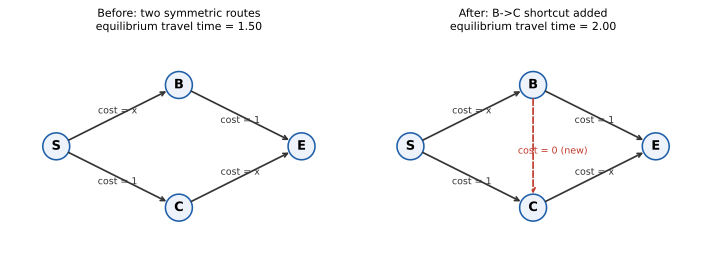

# ch21 — 布雷斯悖論：多開一條路，大家都變慢

> **本章解決什麼問題**：Part VI（選擇、偏好與集體）到目前為止的兩章，都在演練「個體理性加總起來不等於集體理性」的兩種面貌：ch19（非傳遞骰子）讓你看到「贏過」這個關係本身可以繞成一個圈；ch20（孔多塞悖論）讓你看到即使每個人的偏好都乾淨傳遞，多數決把它們加總起來，社會偏好照樣可以繞成一個圈。本章把同一個主題，搬到一張看得見的地圖上：一群各自只想走最快路線的用路人，在路網裡加了一條看起來只會更好、不會更差的路之後，所有人的通勤時間反而一起變長。下一章（ch22，紐康悖論）會把鏡頭收回單一決策者身上，檢驗「理性」這個詞本身，在一個幾乎全準的預測者面前還站不站得住。

## 從你已知的出發

想像你是二十世紀六十年代末某座城市的交通規劃官員。當時整個工程界有一條幾乎沒人懷疑過的常識：路網的容量只會愈修愈大、交通只會愈修愈順——多開一條路，頂多是沒人願意走它，最壞的情況也不過是白花一筆錢，絕不可能讓所有人的通勤時間反而變長。這條常識背後，其實藏著一句更基本的直覺：多一個選項，不會讓你更差。你原本能走的路，加了新選項之後仍然能走；沒有人強迫你改道，所以你的處境只可能不變或變好，不可能變壞。把這句話套用到一整座城市的所有用路人身上，結論自然順理成章：路網多一條邊，全體的處境同樣只可能不變或變好。

德國數學家迪特里希·布雷斯（Dietrich Braess，1938 年生於漢堡；1964 年在漢堡大學取得理論物理博士學位，日後從一九七〇年代末開始才長年任教於波鴻魯爾大學〔Ruhr-Universität Bochum〕）在研究交通網路的數學模型時，用一個刻意簡化到極致的假想路網，把這條看似無懈可擊的常識，當場推翻。他 **1968 年**在德文期刊《Unternehmensforschung》（第 12 卷，第 258 頁至第 268 頁）發表的這篇論文〈Über ein Paradoxon aus der Verkehrsplanung〉（題目直譯大約是「一個出自交通規劃的悖論」），本身沒有用到任何一座真實城市的資料，純粹是一個四個節點、四條邊的玩具網路，卻精確地算出一個違反直覺的結論：在自私選路的前提下，加一條邊，即使這條邊本身完全不花任何成本，也可能讓所有人的均衡通勤時間變得更長。

這正是本章要拆穿的自信答案：不是「有時候新路沒有用」，而是「新路可能讓所有人一起變得更慢」——即使每個人都只是理性地選擇對自己最快的路。設定講清楚之前，先不揭曉答案，讓我們把布雷斯當年那個四節點網路，原原本本地攤在桌上。

## 一張地圖：延遲函數與均衡怎麼定義

布雷斯的網路有四個節點：起點 S（Start）、終點 E（End），以及中間兩個轉運點 B 與 C。所有從 S 出發、要去 E 的車流，只能走以下四條邊中的某個組合：

```text
S → B：這條邊會塞車，通過它所花的時間，正比於「有多少比例的車流正在使用這條邊」——
        邊上的車愈多，每一輛車經過它要花的時間就愈長。這裡把總車流量標準化為 1 個單位
        （可以想成「這段時間內要通勤的所有人」，1 代表全部人數），
        設這條邊的延遲函數為 cost(x) ＝ x，x 為使用這條邊的車流比例。
S → C：這條邊不塞車（比方說是一條車道很寬、幾乎不受車流量影響的大路），
        不管多少人走，每輛車都固定花 1 個時間單位。cost ＝ 1（常數）。
B → E：跟 S → C 一樣不塞車，固定花 1 個時間單位。cost ＝ 1（常數）。
C → E：跟 S → B 一樣會塞車，cost(x) ＝ x，x 為使用這條邊的車流比例。
```

在加邊之前，從 S 到 E 只有兩條可能的路徑：S-B-E（先走會塞車的 S→B，再走不塞車的 B→E）與 S-C-E（先走不塞車的 S→C，再走會塞車的 C→E）。這兩條路徑，在結構上完全對稱——一條先塞後不塞，另一條先不塞後塞。

這裡要用到交通工程裡的核心概念：**均衡（equilibrium）**。當每一位用路人都各自獨立選擇對自己最快的路線，而且誰都沒有動機單方面改道時，整個系統就達到了均衡。這個概念早在 **1952 年**，就由英國交通工程師 John Glen Wardrop 在論文〈Some Theoretical Aspects of Road Traffic Research〉裡，用兩條原則講清楚：**第一原則**（後稱「使用者均衡」，user equilibrium，UE）——所有被實際使用的路徑，旅行時間都相等，而且不高於任何一條未被使用的路徑；**第二原則**（「系統最優」，system optimum，SO）——由一個能指揮所有人的中央調度者，去最小化全體用路人的總旅行時間。這兩條原則描述的其實是同一個問題的兩種解法：第一原則是自私選路（每個人只管自己）算出來的結果——每一位用路人都只在乎自己走哪條路最快，沒有人有動機單方面改變自己的選擇，這正是納許均衡（Nash equilibrium）這個概念在「無窮多個各自渺小的用路人、連續流量」這種情境下的版本，一般也直接稱作 Wardrop 均衡；第二原則則是把整個路網當成一個整體來優化的解。本章要拆穿的，正是「這兩種解法算出來的答案，理應差不多」這個假設。

## 加邊之前：對稱網路的均衡通勤時間

先算清楚，在只有兩條路徑（S-B-E 與 S-C-E）的情況下，均衡通勤時間是多少。設 x 為選擇 S-B-E 這條路徑的車流比例，則選擇 S-C-E 的車流比例就是 1−x（因為總車流量標準化為 1）。

```text
路徑 S-B-E 的旅行時間 ＝ x（S→B 的延遲，車流愈多愈慢）＋ 1（B→E 固定延遲）
                     ＝ x + 1

路徑 S-C-E 的旅行時間 ＝ 1（S→C 固定延遲）＋ (1−x)（C→E 的延遲）
                     ＝ 1 + (1−x)
```

均衡的定義是：所有被使用的路徑，旅行時間必須相等——否則走比較慢那條路的人，會立刻改道去走比較快的那條，直到兩條路一樣快為止。把兩條路徑的旅行時間設為相等，解出 x：

```text
x + 1 ＝ 1 + (1−x)                        ← 均衡條件：兩條被使用的路徑旅行時間相等
x ＝ 1 − x                                 ← 兩邊同時減 1
2x ＝ 1
x ＝ 0.5                                    ← 對稱網路，均衡下剛好對半分
```

代回任一條路徑的旅行時間，得到均衡通勤時間：

```text
均衡通勤時間 ＝ x + 1 ＝ 0.5 + 1 ＝ 1.5
```

換句話說，在加邊之前，一半的人走 S-B-E，一半的人走 S-C-E，每個人的通勤時間都是 **1.5 個單位**，沒有人有改道的動機——走 S-B-E 的人如果偷偷改道去 S-C-E，路上會多出一個人（此時 x 略小於 0.5，S-C-E 的延遲反而略微上升），改道沒有好處；反之亦然。這是一個穩定的均衡。

## 加一條「幾乎免費」的路：均衡怎麼被打破

現在，布雷斯的關鍵一步：在 B 與 C 之間，加一條單向的新邊 B→C，而且這條邊完全不塞車、完全不花時間——cost ＝ 0。可以把它想成一條剛好連接兩個轉運點、路況極好、幾乎瞬間穿越的捷徑。

直覺上，這條新邊看起來只會有好處：它給了用路人一個新選項——原本要走 S-B-E 的人，現在多了一種走法：S→B，再走這條免費的捷徑到 C，再走 C→E。這條新路徑的旅行時間是：

```text
路徑 S-B-C-E 的旅行時間 ＝ x_SB（S→B 的延遲）＋ 0（捷徑，免費）＋ x_CE（C→E 的延遲）
                       ＝ x_SB + x_CE
```

這裡 x_SB 是使用 S→B 這條邊的車流比例（走 S-B-E 與走 S-B-C-E 的人都要經過它），x_CE 是使用 C→E 這條邊的車流比例（走 S-C-E 與走 S-B-C-E 的人都要經過它）。

問題出在：只要 x_CE 還沒漲到 1（也就是說，C→E 這條邊還沒被塞滿），走 S-B-C-E 這條新路徑就一定比直接走 S-B-E（旅行時間固定是 x_SB + 1）划算，因為 x_CE < 1。任何一個站在節點 B 的理性用路人，只要看到「經 C 繞過去」比「直接到 E」快，就會選擇繞過去——不管其他人怎麼選，這個判斷永遠對他自己有利。這正是這條新邊的殺傷力所在：它創造了一個對每個人來說都各自佔優的選項，最終把所有車流都吸引過去。

一步一步推演這個過程：一開始只有一小部分人繞道經過 B→C，這讓 x_CE 略微上升；但只要 x_CE 還小於 1，繞道依然划算，於是愈來愈多人跟進。這個過程會持續到什麼時候才停？停在所有人都改道經過捷徑、x_SB 和 x_CE 都漲到 1（全部車流都經過 S→B 與 C→E）的那一刻：

```text
x_SB ＝ 1，x_CE ＝ 1（全部車流都走 S-B-C-E）

新路徑 S-B-C-E 的旅行時間 ＝ x_SB + x_CE ＝ 1 + 1 ＝ 2

比較未使用的兩條舊路徑：
路徑 S-B-E 的旅行時間 ＝ x_SB + 1 ＝ 1 + 1 ＝ 2
路徑 S-C-E 的旅行時間 ＝ 1 + x_CE ＝ 1 + 1 ＝ 2
```

三條路徑的旅行時間，在這一點上剛好全部打平，都是 **2**——沒有人能透過改道讓自己變快，這正是均衡的定義。全部車流擠上新捷徑，是這個加了邊的網路唯一穩定的均衡。

把加邊前後放在一起看：均衡通勤時間從 **1.5** 漲到 **2.0**。這條路完全免費、完全沒有壞處、純粹多了一個選項，卻讓每一個人（不是少數人，是所有人）的通勤時間增加了三分之一。



## 系統最優完全沒被影響：中央調度者的視角

到這裡，一個自然的疑問是：既然這條新捷徑存在，是不是只是「大家選錯了」？如果換一個更聰明的中央調度者來安排車流，能不能利用這條捷徑，讓整體通勤時間比 1.5 更短？

答案是不能——中央調度者能做到的最好結果，跟加邊之前一模一樣，還是 1.5，而且達成方式是完全不使用這條新捷徑。

推導過程如下。設 α 為使用 S→B 這條邊的車流比例、γ 為使用 C→E 這條邊的車流比例（不論這些車最終走的是舊路徑還是新捷徑）。全體車流的守恆關係，會把「只走 S-B-E」「只走 S-C-E」「走新捷徑 S-B-C-E」這三種人的比例，唯一地決定成 α 與 γ 的函數：只走 S-B-E 的人數比例是 1−γ、只走 S-C-E 的人數比例是 1−α、走新捷徑的人數比例是 α+γ−1（這一項若算出負值，代表新捷徑根本沒被使用，比例視為 0）。

全體車流的總延遲（把每個人各自花的時間加總）可以完全用 α 與 γ 表示：

```text
總延遲 T(α, γ) ＝ α²（S→B 這條邊：車流 α，每輛車延遲 α，貢獻 α×α）
              ＋ γ²（C→E 這條邊：同理，貢獻 γ×γ）
              ＋ (1−α)（B→E 這條邊：只走 S-B-E 的人使用，人數比例化簡後為 1−α，固定延遲 1）
              ＋ (1−γ)（S→C 這條邊：只走 S-C-E 的人使用，人數比例化簡後為 1−γ，固定延遲 1）
              ＝ α² + γ² − α − γ + 2
```

把 α² − α 與 γ² − γ 各自配方（complete the square）：

```text
α² − α ＝ (α − 0.5)² − 0.25
γ² − γ ＝ (γ − 0.5)² − 0.25

T(α, γ) ＝ (α − 0.5)² − 0.25 + (γ − 0.5)² − 0.25 + 2
        ＝ (α − 0.5)² + (γ − 0.5)² + 1.5
```

因為平方項永遠不小於 0，所以 T(α, γ) ≥ 1.5，等號只在 α ＝ 0.5 且 γ ＝ 0.5 時成立。代回「走新捷徑的人數比例 ＝ α+γ−1」，在最優點上這個比例是 0.5+0.5−1 ＝ 0——中央調度者算出來的最佳安排，跟加邊之前一模一樣：一半人走 S-B-E、一半人走 S-C-E，完全不使用新捷徑，總延遲同樣是 **1.5**。

這正是布雷斯悖論最刺眼的地方：加了一條邊，讓「能做到最好的方案」原封不動（系統最優仍是 1.5），卻讓「人人自私選路會走到的地方」變差（均衡從 1.5 漲到 2.0）。兩個數字之間的落差，衡量的正是「自私」這件事本身要付出的代價。

## Price of anarchy：無政府狀態的代價

這個「均衡有多接近最優」的落差，在演算法賽局理論（algorithmic game theory）裡有一個正式的名字：**price of anarchy**（無政府狀態的代價，簡稱 PoA），定義為「均衡總成本」除以「系統最優總成本」。本章這個加邊後的網路，算出來的 PoA 是：

```text
PoA ＝ 均衡通勤時間 ／ 系統最優通勤時間 ＝ 2.0 ／ 1.5 ＝ 4/3 ≈ 1.33
```

這個 4/3 不是巧合。Tim Roughgarden 與 Éva Tardos 在 **2002 年**發表於《Journal of the ACM》的經典論文〈How Bad Is Selfish Routing?〉證明了一個一般性的結果：只要路網裡每一條邊的延遲函數都是**線性（affine）函數**（也就是形如 cost(x) ＝ a·x ＋ b 這種一次式，本章的 cost(x)＝x 正是最簡單的特例），不管路網長什麼樣子、不管延遲函數的係數怎麼設，自私均衡造成的無效率，最壞也不會超過系統最優的 4/3 倍——而且這個上界是**緊的（tight）**，也就是真的存在網路能讓比值精確卡在 4/3。本章這個教科書等級的玩具網路，剛好就是能讓比值觸頂的例子之一。這句話值得記住的地方在於：布雷斯悖論聽起來像是一個駭人的意外，但從 price of anarchy 的角度看，它其實是「自私選路最多能壞到什麼程度」這件事的一個具體示範，而且壞的程度是有理論上限的，不是無底洞。

## 真實案例：軼事、爭議，與唯一嚴謹的同儕審查案例

布雷斯悖論在科普作品裡，最常被拿來佐證的，是三個廣為流傳的城市軼事：**斯圖加特（Stuttgart）1969 年**，市政府新建一條聯絡道以紓解市中心車流，通車後壅塞反而加劇，後來拆除這段新路，車流才恢復順暢；**紐約 42 街 1990 年**，交通局在地球日臨時封閉這條橫貫曼哈頓的主要幹道，原本預期會造成史上最大塞車，結果周邊車流反而變得更順；**首爾清溪川 2003 年至 2005 年**，市政府拆除一條高架快速道路、恢復河道，市中心交通同樣沒有惡化。

這三個故事流傳很廣，但誠實地說，它們作為布雷斯悖論的「證據」，各自都有明顯的侷限：斯圖加特與紐約 42 街的案例，主要來自單一則新聞報導或口耳相傳的敘述，並沒有嚴謹的封路前後車流量測、也沒有排除其他同時發生的因素（比如駕駛人本來就會臨時改變行程，或當天車流本來就偏低）；而清溪川的案例爭議更大——很可能反映的是另一種機制：拆除快速道路、同時大幅投資替代的公共運輸，讓一部分通勤者整批轉向搭乘大眾運輸，這種「載運方式之間的轉移」，在交通經濟學裡有自己的名字，叫**唐斯－湯姆森悖論（Downs–Thomson paradox）**，跟布雷斯悖論處理的「同一種運具、在同一個路網裡選路徑」，是不同的機制，兩者容易被混為一談。這三個案例都值得記住，但都不宜被寫成「已經證實的布雷斯悖論」。

唯一一篇通過同儕審查、嚴謹處理這個問題的研究，是 Hyejin Youn、Michael T. Gastner 與 Hawoong Jeong 三人合著、發表於《Physical Review Letters》第 101 卷、編號 128701（**2008 年**）的論文〈Price of Anarchy in Transportation Networks: Efficiency and Optimality Control〉。這篇論文做的事情，跟前面三個城市軼事性質不同：它不是回溯某個歷史事件、事後說故事，而是拿波士頓、紐約、倫敦這幾座真實城市的路網拓樸與實測交通資料，建立數學模型，用本章這一整套均衡與系統最優的演算法，去計算整個路網裡是否存在「布雷斯型」的道路——也就是某幾條路的存在，讓整體均衡通勤時間比拿掉它們還要長。他們的模型確實在這幾座城市的真實路網結構裡，找到了具有這種性質的道路。必須說清楚的是，這仍然是一個**模型預測**：論文說的是「照這套延遲函數與均衡假設去算，這些路段理論上有害」，而不是「已經觀測到拿掉這條路、城市真的變快了」的歷史紀錄。它是目前最接近嚴謹驗證的一篇文獻，但嚴謹的代價，是換成了模型上的推論，而不是軼事式的、事後諸葛的故事。

## 直覺的陷阱

| 階段 | 發生了什麼 |
|---|---|
| 直覺的自信答案 | 路網多一條邊（尤其是完全零成本的邊），最壞情況也不過是沒人使用它，不可能讓所有人一起變慢——多一個選項，處境只會不變或變好 |
| 偷渡的假設 | 把「每個人各自的選擇集合變大」，悄悄等同於「系統整體的處境變好」；忽略了每個用路人只會用「對自己」最快的路，完全不會考慮自己多佔用一單位邊、會讓其他所有人多付出多少延遲——這種對別人造成的成本，經濟學裡稱為外部性（externality），自私均衡從來不會替你把它算進去 |
| 為什麼聽起來理所當然 | 如果只看一個人：他確實不會因為多了一個選項而變差，他大可以無視新捷徑，走原本的路。這句「對個人成立」的話，被無意識地放大成「對全體也成立」，但集體不是個人的簡單加總——新捷徑改變的是所有人共同面對的均衡點，不是某一個人孤立的選擇集合 |
| 在哪一步被帶溝裡 | 加了新捷徑之後，「經 C 繞過去比直接到 E 快」這件事，對站在 B 點的每一個人都各自成立，於是所有人都各自理性地做出同一個選擇，把車流全部塞進同一條邊，卻沒有人意識到自己這個理性選擇，正在讓所有人共同承受的擁塞變得更嚴重 |
| 怎麼自我察覺 | 看到「加一個選項」或「多開一條路」這類敘述，先把「系統最優（一個中央調度者能做到的最好結果）」與「均衡（人人自私選擇會走到的地方）」分開來算：只要這兩個數字在加了新選項之後拉開距離，就代表某種外部性正在悄悄發生作用，不能只看「有沒有人被迫變差」，要看「全體加總起來的處境有沒有變差」 |

> **那句沒說出口的話是**：多一個選項，對「一個人」而言處境只會不變或變好，但這句話悄悄被放大成「對全體」也成立——自私均衡不會替任何人把他強加在別人身上的擁塞成本算進去，而納許（或 Wardrop）均衡從來就不等於系統最優。

## 紙上推演

**練習 1（★，10 分鐘）**：驗證本章「加邊之前」算出的 x ＝ 0.5 確實是穩定均衡：把 x 改成 0.6，分別算出路徑 S-B-E 與 S-C-E 各自的旅行時間，判斷選 S-B-E 的人，這時候有沒有動機改道去走 S-C-E。

**練習 2（★★，15 分鐘）**：本章假設新捷徑 B→C 完全免費（cost ＝ 0）。如果把它改成一個固定成本 ε（0 ≤ ε ≤ 0.5），用本章的方法重新推導均衡：走新捷徑的車流比例 s 是多少（用 ε 表示）？均衡通勤時間又是多少（用 ε 表示）？並說明 ε 要小於多少，布雷斯悖論才會發生。

**練習 3（★★，15 分鐘）**：本章證明了「加邊之前」的均衡通勤時間（1.5）剛好等於系統最優（1.5）。這是不是代表「只要還沒加這條新捷徑，自私選路就永遠等於系統最優、不會有任何無效率」？用自己的話說明這句話對不對，並指出這個「相等」跟這個特定網路的什麼性質有關。

**練習 4（★★★，20 分鐘）**：延續練習 2 的結果，把 price of anarchy 寫成 ε 的函數 PoA(ε)（分子用練習 2 算出的均衡通勤時間，分母固定是系統最優 1.5）。當 ε 從 0 一路增加到 0.5，PoA(ε) 怎麼變化？在哪一個 ε 值，PoA 剛好等於本章提到的 4/3 這個理論上界？

### 推演解答

**練習 1 解答**：x ＝ 0.6 時，路徑 S-B-E 的旅行時間 ＝ 0.6 ＋ 1 ＝ 1.6；路徑 S-C-E 的旅行時間 ＝ 1 ＋ (1−0.6) ＝ 1 ＋ 0.4 ＝ 1.4。走 S-B-E 的人，花的時間（1.6）比走 S-C-E 的人（1.4）多，所以有明確動機改道去走 S-C-E——這股改道的壓力，會把 x 往下推回 0.5，證實 x ＝ 0.5 是一個會自我修正、穩定的均衡點，不是隨便設的一個數字。

**練習 2 解答**：設走新捷徑的比例為 s，另外兩條舊路徑各自的比例，由對稱性假設各為 (1−s)/2。此時 S→B 邊上的車流 α ＝ (1−s)/2 + s ＝ (1+s)/2，C→E 邊上的車流同理也是 γ ＝ (1+s)/2。路徑 S-B-E 的旅行時間 ＝ α + 1 ＝ (1+s)/2 + 1 ＝ (3+s)/2；新捷徑路徑 S-B-C-E 的旅行時間 ＝ α + ε + γ ＝ (1+s) + ε。均衡條件（兩條被使用的路徑旅行時間相等）：

```text
(3+s)/2 ＝ 1 + s + ε
3 + s ＝ 2 + 2s + 2ε                       ← 兩邊同乘 2
1 − s − 2ε ＝ 0
s ＝ 1 − 2ε
```

代回均衡通勤時間：

```text
均衡通勤時間 ＝ (3+s)/2 ＝ (3 + 1 − 2ε)/2 ＝ (4 − 2ε)/2 ＝ 2 − ε
```

當 ε ＝ 0，s ＝ 1（全部車流走新捷徑）、均衡通勤時間 ＝ 2，跟本章正文一致。當 ε 增加，s 隨之下降；當 ε ＝ 0.5，s ＝ 0（新捷徑完全沒人使用）、均衡通勤時間回到 1.5，跟加邊之前一模一樣。所以只要 0 ≤ ε ＜ 0.5，s 大於 0，布雷斯悖論就會發生（均衡通勤時間介於 1.5 到 2 之間）；一旦 ε ≥ 0.5，新捷徑的價值不夠高，沒有人會用它，網路的表現退回加邊之前的樣子，悖論完全消失。這說明布雷斯悖論不是「加邊就一定發生」的萬用結論，而是要看新捷徑的成本，相對於原本網路的擁塞程度，是不是夠便宜。

**練習 3 解答**：不對，這句話講得太滿了。「加邊之前」這個網路的均衡剛好等於系統最優，是因為這個網路的兩條路徑（S-B-E 與 S-C-E）在結構上完全左右對稱——一條先塞後不塞、另一條先不塞後塞，延遲函數的形狀完全一樣。正是這種對稱性，讓「自私選路的均衡條件」（兩條路旅行時間相等）跟「系統最優的一階條件」（配方後在 α ＝ γ ＝ 0.5 取得最小值），剛好指向同一個點 x ＝ 0.5。如果把其中一條路徑的常數成本改掉（比如 S→C 改成固定 2、B→E 仍是固定 1），均衡與最優一般就不會再重疊——這是絕大多數不對稱路網的常態：自私均衡本來就會帶來一定程度的無效率，只是通常沒有布雷斯悖論這麼戲劇化（一加邊就從「剛好相等」跳到「相差 4/3 倍」）。

**練習 4 解答**：把練習 2 算出的均衡通勤時間 2−ε 代入 PoA 的定義：

```text
PoA(ε) ＝ (2 − ε) / 1.5
```

當 ε ＝ 0，PoA(0) ＝ 2/1.5 ＝ 4/3 ≈ 1.33——剛好卡在本章提到的理論上界。當 ε 增加，分子 (2−ε) 線性下降，PoA(ε) 也跟著線性下降；當 ε ＝ 0.5，PoA(0.5) ＝ 1.5/1.5 ＝ 1（完全沒有無效率，均衡等於最優，因為此時新捷徑根本沒人使用）。這條「PoA 隨 ε 從 4/3 一路滑落到 1」的曲線，直觀地畫出了布雷斯悖論的嚴重程度，怎麼隨新捷徑愈來愈「不划算」而逐漸消退——4/3 是這個網路能達到的最壞情況，不是唯一可能的結果。

## 自我檢核

1. 為什麼在加邊之前，這個網路的自私均衡通勤時間，剛好等於中央調度出來的系統最優？這件事是通則，還是這個網路剛好左右對稱造成的巧合？
2. 用自己的話解釋：加了一條「幾乎免費」的路之後，為什麼每個人都會被吸引去用它，即使這麼做讓大家整體變慢？
3. 使用者均衡（本章也用納許均衡來對照）跟系統最優，這兩個詞差在哪一個字？為什麼「每個人都選了對自己最好的路」不等於「整體通勤時間最短」？
4. Price of anarchy 這個詞在講什麼？本章這個網路算出來的值是多少，為什麼會剛好卡在一個理論上的上界？
5. 如果讀到「斯圖加特／紐約 42 街／首爾清溪川是布雷斯悖論的真實案例」這句話，你會怎麼追問，才能判斷這句話有多可信？
6. 為什麼 Youn、Gastner 與 Jeong（2008）的研究，比前面那三個城市軼事更接近「嚴謹驗證」，但仍然不等於「觀測到的歷史事件」？兩者的差別在哪裡？
7. 這個悖論那句沒說出口的假設是什麼？試著不看課文，重講一次，並說明它跟「多一個選項不會更糟」這個常見直覺，具體是在哪裡衝突。
8. 如果把新加的那條路的成本，從 0 一路調高，悖論會怎麼變化？在什麼條件下，悖論會完全消失？

## 延伸閱讀

- Braess, D. (1968). Über ein Paradoxon aus der Verkehrsplanung. *Unternehmensforschung*, 12, 258–268.——本悖論的原始德文論文全文（PDF），布雷斯親自維護的版本，本章四節點網路的最初出處。<https://homepage.ruhr-uni-bochum.de/dietrich.braess/paradox.pdf>
- 〈Braess's paradox〉，Wikipedia——總覽條目，收錄了本章提到的三個城市軼事與其他變體網路，可作為交叉核對的起點（但軼事部分請照本章的態度自行查證，不要照單全收）。<https://en.wikipedia.org/wiki/Braess%27s_paradox>
- Youn, H., Gastner, M. T., & Jeong, H. (2008). Price of Anarchy in Transportation Networks: Efficiency and Optimality Control. *Physical Review Letters*, 101, 128701.——本章提到的唯一同儕審查案例，此為公開的 arXiv 預印本版本。<https://arxiv.org/abs/0712.1598>
- Roughgarden, T., & Tardos, É. (2002). How Bad Is Selfish Routing? *Journal of the ACM*, 49(2), 236–259.——本章 price of anarchy 上界 4/3 的原始證明，此為作者本人網站提供的公開 PDF。<https://theory.stanford.edu/~tim/papers/routing.pdf>
