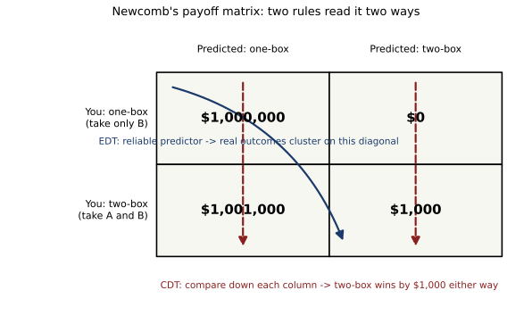

# ch22 — 紐康悖論：一個能預測你的對手

> **本章解決什麼問題**：Part VI（選擇與集體）前三章——非傳遞骰子（ch19）、孔多塞悖論（ch20）、布雷斯悖論（ch21）——講的都是「很多個決定疊加在一起，會在集體層次塌陷」：偏好會轉圈、多數決會循環、多修一條路反而讓大家更塞。本章換一個場景：桌上只有你一個人，對面是一個幾乎每次都能猜中你選擇的對手，你該怎麼選？這裡塌陷的不是「加總」，而是「怎樣算才叫理性」這件事本身——因果決策理論（causal decision theory，CDT）與證據決策理論（evidential decision theory，EDT）對著同一張報酬表，算出兩個完全相反的答案，而且超過一甲子過去，這場爭論依然沒有公認的贏家。這一章也替 Part VII（隨機與測度）先埋一條線索：接下來幾章要拆穿的，往往不是算式算錯了，而是連「機率」「隨機」這些詞的定義本身，在某些場景下就會分裂出好幾個都說得通的版本。

## 從你已知的出發

想像你走進一個房間，桌上擺著兩個盒子。A 盒是透明的，你一眼就能看到裡面放著 $1,000——這件事沒有懸念。B 盒是不透明的，你看不到裡面裝了什麼，但主辦單位告訴你一件關鍵訊息：稍早，有一位「預測者」已經仔細研究過你——你的個性、你過去做決定的方式、甚至一套據稱極為精密的模型或思想實驗——並且據此對你會怎麼選，下了判斷。如果預測者判斷你會「只拿 B 盒」，工作人員就已經在 B 盒裡放進 $1,000,000（一百萬美元）；如果預測者判斷你會「兩盒都拿」，B 盒此刻是空的，裡面是 $0。這個判斷早在你走進房間之前就已經做完，盒子也早就已經按判斷結果裝好，此刻密封在桌上，不會再改變。

你的選擇只有兩種：**只拿 B 盒**，或是**兩盒都拿**。而這位預測者的紀錄，據說近乎完美——不是說她從來沒錯過，而是說在過去無數次類似的場合裡，她「猜你會怎麼選」這件事，準到近乎不可思議的地步，錯的次數少到可以忽略。

現在，你會怎麼選？

大多數人第一次聽到這個設定，腦中幾乎立刻跳出一個聽起來無懈可擊的論證：不管預測者當初猜的是什麼，此刻 B 盒裡裝的東西早就已經是定局了——要嘛是 $1,000,000，要嘛是 $0，這件事在你踏進房間、在你開始思考「該怎麼選」的這一刻，就已經物理上固定住了。你現在做的任何決定，都沒有辦法讓時光倒流、回頭去改變一個已經封起來、放在桌上的盒子裡裝的東西。既然 B 盒的內容物已經不會再變，那麼比較「只拿 B」跟「兩盒都拿」的差別，答案簡單得像算術：不管 B 盒裡到底是 $1,000,000 還是 $0，只要你多拿了那個透明的 A 盒，你都會比「只拿 B」多賺整整 $1,000。這是一筆穩賺不賠的加碼——反正 A 盒裡的 $1,000 已經明擺在那裡，不拿白不拿，理性的人怎麼可能放著眼前的錢不要？

這個論證聽起來如此乾淨俐落，以至於很難想像還有什麼漏洞。它甚至有一個正式的名字——**優勢原則**（dominance principle）：如果某個選項不管在哪一種可能的世界狀態下，結果都至少一樣好、而且至少有一種狀態下嚴格更好，那麼一個理性的人就該選它。兩盒都拿，正是這樣一個「不管狀態如何都嚴格更好」的選項。

但這一章要老實告訴你：這個看起來無懈可擊的論證，並沒有讓所有嚴肅思考過這道題的人都同意兩盒都拿。恰恰相反，六十多年來，一整批同樣嚴謹、同樣不含糊的論證者，堅持只拿 B 盒才是唯一理性的答案，而且他們手上也有一套完整的計算，算出一模一樣具體的數字。這一章不會在文末宣布誰對誰錯——因為到今天為止，決策理論這個領域本身都還沒有一致的結論。這一章真正要做的事，是把兩派各自的推理攤開來、算到底、對齊擺在一起，然後把兩派分歧真正的起點——那句誰都沒有明講、卻兩派各自用不同方式對待的假設——指出來。

## 這道題的身世：一位物理學家、一篇沒有發表的手稿

這個設定出自一位美國物理學家**威廉·紐康**（William A. Newcomb）。據載，他大約在 **1960 年**構思出這個思想實驗，但他自己從未正式發表過——沒有留下一手的論文或手稿可供查證，這道題完全是靠口耳相傳、朋友之間的討論擴散開來的（本書在此老實標示：紐康本人的原始構思細節，目前查無一手文件）。

真正把它寫進哲學文獻、讓它從私下閒聊變成一篇正式論證的，是哲學家**羅伯特·諾齊克**（Robert Nozick）。他的論文題目是〈紐康的問題與兩條選擇原則〉（"Newcomb's Problem and Two Principles of Choice"），收錄在一本向邏輯實證論哲學家卡爾·亨佩爾（Carl G. Hempel）致敬的論文集裡，由尼可拉斯·雷謝爾（Nicholas Rescher）編輯、Reidel 出版社出版。這裡有一個很容易被忽略、卻值得記一筆的小分歧：哲學文獻裡引用這篇論文，慣例上都寫成 **1969 年**；但那本論文集本身的正式出版年份，書目編目上寫的其實是 **1970 年**。這不是誰弄錯了年份，而是「單篇論文的慣用引用年」跟「整本論文集的書目出版年」剛好對不上——本書兩個年份都寫出來，不做取捨。

諾齊克的論文正是這一章開頭的原型：他把兩派論證都寫得清清楚楚——「兩盒都拿」的優勢論證，以及「只拿一盒」的期望值論證——並且誠實地承認，這兩套論證看起來都無懈可擊，卻指向相反的結論。他在文中留下一句後來被反覆引用的觀察：他認識的人裡，幾乎每個人一聽完題目都立刻有強烈的直覺該怎麼選，而且無論是傾向兩盒還是傾向一盒的人，都覺得對方簡直莫名其妙——這道題目分裂陣營的能力，本身就是它出名的原因之一。

讓這道題真正走出哲學系、變成家喻戶曉的「悖論」，是科普作家**馬丁·加德納**（Martin Gardner）。他在《科學人》（*Scientific American*）**1973 年 7 月**的「數學遊戲」專欄裡，用「自由意志再思考」為題，把紐康的設定介紹給大眾讀者，從此「紐康的問題」（Newcomb's Problem）這個名字正式定型，並且持續在專欄後續的讀者回應裡引發了大量的爭論信件。

## 兩把尺、兩套推算方式：因果決策 vs 證據決策

要看清楚兩派到底在爭什麼，最乾淨的辦法是把整個情境攤成一張 2×2 的報酬表。橫的方向是**你的選擇**：只拿 B 盒，或兩盒都拿。直的方向是**預測者當初的判斷**：預測你會只拿 B，或預測你會兩盒都拿。四個格子分別是：

```text
                    預測你：只拿 B          預測你：兩盒都拿
你選：只拿 B         $1,000,000               $0
你選：兩盒都拿       $1,001,000               $1,000
```



**因果決策理論**（CDT）的推算方式，是沿著表格的**每一直行往下比**：固定住「預測者當初判斷了什麼」這件事（因為這件事已經是過去式，不會被你現在的選擇改變），然後在同一個判斷之下，比較你兩種選擇分別拿到多少錢。在「預測你只拿 B」這一行，兩盒都拿（$1,001,000）比只拿 B（$1,000,000）多 $1,000；在「預測你兩盒都拿」這一行，兩盒都拿（$1,000）也比只拿 B（$0）多 $1,000。不管落在哪一行，兩盒都拿永遠贏 $1,000——這正是前面「從你已知的出發」那段裡，那個聽起來無懈可擊的優勢論證，寫成表格之後的樣子。用正式一點的語言說，CDT 計算的是「假設性因果」（如果我做了這個選擇，世界會變成什麼樣）之下的期望效用，而不是直接拿你的選擇去對已經觀察到的機率做條件化。

**證據決策理論**（EDT）的推算方式完全不同：它不去問「假設世界的狀態不變，我的選擇會造成什麼結果」，而是直接問「已知我即將做出這個選擇，這件事本身透露了什麼關於 B 盒裡裝了什麼的資訊」。因為題目一開始就設定了預測者近乎完美——換句話說，你的選擇跟預測者當初的判斷，兩者之間有極強的**統計關聯**（correlation），即使兩者之間沒有一條直接的因果管道。EDT 沿著表格的**對角線**看：如果預測者夠準，那麼「你選只拿 B」這件事，幾乎總是跟「預測者早就猜到你會只拿 B」同時發生（左上格）；「你選兩盒都拿」也幾乎總是跟「預測者早就猜到你會兩盒都拿」同時發生（右下格）。左下跟右上這兩格——預測者猜錯的情形——機率很小，可以先忽略，之後再精確算進去。

## 完整計算：同一張表，算出兩個相反的推薦

現在把兩套推算方式各自的期望值算到底，讓兩個相反的結論並排站在一起。先設一個具體的數字：假設這位預測者的準確率是 **p＝99%**——也就是說，不論你最後實際選了什麼，預測者當初猜對的機率是 0.99，猜錯的機率是 0.01。這裡要老實提醒一句：諾齊克的原始論文並沒有指定一個精確的百分比，只寫「幾乎必然猜對」；本書選用 99% 這個常見於後續教學文獻的示範數字，方便算出具體結果，並不是紐康或諾齊克本人給出的官方數字。

**CDT 的計算**——沿著每一直行比較，跟預測者的準確率完全無關：

```text
CDT：兩盒都拿 vs 只拿 B，逐行比較

「預測你只拿 B」這一行：
  兩盒都拿 $1,001,000  −  只拿 B $1,000,000  ＝ ＋$1,000   ← 兩盒都拿贏

「預測你兩盒都拿」這一行：
  兩盒都拿 $1,000      −  只拿 B $0           ＝ ＋$1,000   ← 兩盒都拿贏

無論預測者當初判斷是哪一種，兩盒都拿都嚴格多賺 $1,000
→ CDT 的結論：兩盒都拿是優勢策略，選它
```

**EDT 的計算**——把你的選擇當成證據，對「預測者判斷」這個變數做條件化：

```text
EDT：以 p＝0.99（預測者準確率）算條件期望值

若你選「只拿 B」：
  EU(只拿B) ＝ P(預測你只拿B｜你只拿B)×$1,000,000
             ＋ P(預測你兩盒｜你只拿B)×$0
           ＝ 0.99×1,000,000 ＋ 0.01×0
           ＝ 990,000 ＋ 0
           ＝ $990,000                          ← 幾乎等於一百萬

若你選「兩盒都拿」：
  EU(兩盒都拿) ＝ P(預測你只拿B｜你兩盒都拿)×$1,001,000
               ＋ P(預測你兩盒｜你兩盒都拿)×$1,000
             ＝ 0.01×1,001,000 ＋ 0.99×1,000
             ＝ 10,010 ＋ 990
             ＝ $11,000                         ← 只有一萬出頭

$990,000 遠大於 $11,000
→ EDT 的結論：只拿 B 的期望值遠遠更高，選它
```

兩張計算表算的是完全同一組數字——同一張報酬表、同一個預測者準確率——卻導向兩個南轅北轍的建議：CDT 說兩盒都拿穩賺 $1,000；EDT 說只拿一盒的期望值幾乎是兩盒都拿的九十倍。這不是誰算錯了小數點，而是兩套框架從一開始就在回答不同的問題：CDT 問的是「固定住已經發生的事，我這個動作能不能讓結果變好」；EDT 問的是「知道我即將這樣選，這件事本身告訴了我什麼」。

## 準確度要多低，EDT 才會改口？

這裡有一個很值得動手算的延伸問題：EDT 的建議會不會隨著預測者的準確率 p 改變？把上面的算式換成一般化的 p（不再固定在 0.99），兩個期望值分別是：

```text
EU(只拿B)   ＝ p × 1,000,000
EU(兩盒都拿) ＝ (1−p) × 1,001,000 ＋ p × 1,000
            ＝ 1,001,000 − 1,000,000p          ← 展開、合併同類項後的結果
```

讓兩者相等，解出讓 EDT 兩種選擇打平的臨界準確率 p*：

```text
p × 1,000,000 ＝ 1,001,000 − 1,000,000p
2,000,000 × p ＝ 1,001,000                     ← 兩邊同時加上 1,000,000p
p*            ＝ 1,001,000 / 2,000,000
              ＝ 0.5005
```

換句話說，只要預測者的準確率高於 **50.05%**——換算成更直覺的形式，臨界值恰好等於 ½ ＋ A/(2B)，這裡 A＝1,000（A 盒的固定獎金）、B＝1,000,000（B 盒的頭獎）——EDT 就會建議只拿 B。這個臨界值高得離譜地接近純粹的丟銅板（50%），只比丟銅板高出 0.05 個百分點。這一點很值得停下來品味：預測者根本不需要「近乎完美」，只要比隨機亂猜好上一點點點，EDT 的建議就已經從兩盒都拿翻轉成只拿一盒。而 CDT 的優勢論證完全不管 p 是多少——不管預測者是猜中率 99.99% 的天才，還是猜中率剛好 50%、跟丟銅板沒兩樣的江湖術士，CDT 給出的結論永遠是「兩盒都拿多賺 $1,000」。這個對比正是這道悖論最鋒利的地方：一套推理完全不理會題目最關鍵的那個設定（預測者很準），另一套推理把它當成唯一重要的事。

## 那句沒說出口的假設到底藏在哪裡

前面那個「聽起來無懈可擊」的優勢論證，仔細看一遍，它其實在暗中假設了一件事：**你此刻要做的選擇，跟預測者早已放進盒子裡的東西，兩者之間除了「盒子已經裝好、不會再變」這件事之外，沒有任何進一步的關聯。** 這句話聽起來像是常識——已經發生的事就是已經發生了，你現在做什麼都不能讓時光倒流去改變一個已經封好的盒子。這件事本身完全正確，沒有任何物理定律被違反。

但優勢論證偷偷把這句正確的物理常識，換成了另一句聽起來很像、但其實內容完全不同的話：「所以我的選擇，不會透露任何關於盒子裡裝了什麼的資訊。」這一步的跳躍，把「沒有因果通道」直接等同於「沒有統計關聯」——而這道題目一開始設定的前提，恰恰是這兩件事在這裡並不相等。預測者判斷準確這件事本身，就是在告訴你：你即將做出的選擇方式（不管是你的個性、你的推理習慣，還是任何促使你選一盒或兩盒的深層原因），跟預測者當初依據同一組特徵做出的判斷，兩者高度相關——即使預測者的判斷這個動作，時間上發生在你做選擇之前，兩者之間沒有一條「你的選擇回頭改變盒子」的因果箭頭。

這正是這道悖論真正咬人的地方：**因果獨立**（causal independence）不等於**證據獨立**（evidential independence）。CDT 只在乎前者，EDT 只在乎後者。當一道題目明確告訴你有一個高度可靠的預測機制存在時，這兩種獨立性就會分道揚鑣——而優勢論證能夠聽起來如此理所當然，正是因為它悄悄借用了因果獨立性的正確直覺，卻沒有說明白它其實同時在假設證據獨立性也成立，而後者，正是題目本身明著否定掉的東西。

## 誠實的現況：六十多年，沒有共識

值得把話說在前面：這一章不會、也不能替你裁定哪一派才是「正確答案」。決策理論這個領域，直到今天都還在為這道題爭論。2020 年一項針對將近兩千位專業哲學家的大型問卷調查顯示，整體而言約 **39%** 的受訪者傾向兩盒都拿、約 **31%** 傾向只拿一盒，其餘則抱持其他立場或不表態；如果只看「決策理論」這個次領域的專家，傾向更明顯地倒向兩盒都拿（約六成），但仍有相當比例堅持只拿一盒——完全不是哪一派已經說服了整個領域。

這種僵局並不是因為沒有人夠聰明。相反，正是因為兩派各自的核心論證——優勢原則、跟條件期望值最大化——本身都是決策理論裡站得住腳、單獨拿出來看都無可挑剔的原則。紐康的問題之所以難纏，是因為它精心構造出一個場景，讓這兩條原則罕見地指向相反的方向；一般日常的決策問題裡，這兩條原則幾乎永遠會給出同一個答案，所以我們平常根本不需要區分「因果決策」跟「證據決策」。也正因如此，這道題常被拿來檢驗任何一套新的決策理論夠不夠完整——包括近年為了替高度精密的預測系統（例如更強大的預測模型或代理人）設計決策規則的一些新提案，都會先拿紐康的問題當第一關測試。這些後續發展、以及效用理論與理性選擇本身更完整的深探，交叉引用《在不確定中下注》（decide 書），本章不在此展開。

## 直覺的陷阱

| 階段 | 發生了什麼 |
|---|---|
| 直覺的自信答案 | 優勢原則：不管預測者當初判斷了什麼，B 盒的內容物此刻已經固定不變，所以兩盒都拿永遠比只拿一盒多賺 $1,000——這是一筆穩賺不賠的加碼，理性的人怎麼可能不拿 |
| 偷渡的假設 | 「我此刻的選擇，跟已經裝好的盒子之間，除了不能回頭改變它之外，沒有任何進一步的關聯」——把「沒有因果通道」直接偷換成「沒有統計關聯」 |
| 為什麼聽起來理所當然 | 「已經發生的事無法被之後的行動改變」是牢不可破的物理常識，沒有人會質疑這句話本身；優勢論證正是借用了這句話百分之百的正確性，把讀者的信任一併帶到下一句沒有明講、卻完全不同的主張上 |
| 在哪一步被帶溝裡 | 題目一開始就設定了預測者近乎完美——這件事本身就是在告訴你，你的選擇方式跟預測者的判斷高度相關（統計上、非因果上）。優勢論證完全沒有用到這條前提，逕自假設兩者無關，等於是在論證裡把題目最關鍵的那句設定，悄悄丟掉了 |
| 怎麼自我察覺 | 看到「我的選擇不會改變已經發生的事，所以我的選擇不透露任何資訊」這種推論時，先分開問兩句：①這件事有沒有因果通道能被我現在的選擇改變？②即使沒有因果通道，我即將做出的選擇，跟某個已經存在、但我還不知道內容的狀態之間，有沒有統計上的關聯？只要第二句答案是「有」，「這與我無關」這句話就還站不住腳 |

> **那句沒說出口的話是**：我此刻的選擇，跟預測者早已放進盒子裡的內容，在因果上彼此獨立，所以我的選擇不會帶來任何關於盒子內容的證據——但題目本身明明白白設定了預測者近乎完美，這代表選擇與盒子內容之間存在極強的統計關聯，因果獨立並不等於證據獨立，兩者之間的落差，正是這道難題六十多年來沒有人能徹底裁決的原因。

## 紙上推演

**練習 1（★，10 分鐘）**：把本章的報酬表換成另一組數字——A 盒固定放 $500，B 盒頭獎改成 $200,000（其餘規則不變：預測你只拿 B 就放頭獎，預測你兩盒都拿就是空的）。請重新列出 2×2 報酬表，並驗證 CDT 的優勢論證在這組新數字下，仍然是「兩盒都拿恆多賺 $500」。

**練習 2（★★，15 分鐘）**：延續練習 1 的數字（A＝$500、B＝$200,000），假設預測者準確率 p＝95%，請照本章「完整計算」那一節的方法，分別算出 EDT 對「只拿 B」與「兩盒都拿」的期望值，並指出 EDT 會建議哪一種選擇。

**練習 3（★★，15 分鐘）**：本章推出的一般公式是「EDT 的臨界準確率 p* ＝ ½ ＋ A/(2B)」，其中 A 是 A 盒金額、B 是 B 盒頭獎金額。請用練習 1 的數字（A＝$500、B＝$200,000）代入這條公式，算出臨界 p*，並用它來檢查練習 2 裡 p＝95% 是不是已經超過臨界值。

**練習 4（★★★，20 分鐘）**：有一種常被提起的變體叫「透明紐康問題」：假設 B 盒也是透明的，你在做選擇之前，就已經能親眼看到裡面到底裝了 $1,000,000 還是 $0。試著分別用 CDT 跟 EDT 的思路重新分析這個變體——當你已經**看到** B 盒的內容之後，「你的選擇」還能不能替預測者當初「猜你會怎麼選」這件事提供任何新的證據？兩派在這個變體下，會不會比原本的版本更容易達成共識？

### 推演解答

**練習 1 解答**：新的報酬表如下：

```text
                    預測你：只拿 B          預測你：兩盒都拿
你選：只拿 B         $200,000                 $0
你選：兩盒都拿       $200,500                 $500
```

逐行比較：「預測你只拿 B」這一行，兩盒都拿（$200,500）比只拿 B（$200,000）多 $500；「預測你兩盒都拿」這一行，兩盒都拿（$500）比只拿 B（$0）也多 $500。不論落在哪一行，差距恆等於 A 盒的金額（這裡是 $500），驗證了優勢論證的結論跟具體金額無關，只跟「A 盒金額固定加碼」這個結構有關。

**練習 2 解答**：套用本章公式，p＝0.95：

```text
EU(只拿B)   ＝ 0.95 × 200,000 ＋ 0.05 × 0
            ＝ 190,000

EU(兩盒都拿) ＝ 0.05 × 200,500 ＋ 0.95 × 500
            ＝ 10,025 ＋ 475
            ＝ 10,500
```

190,000 遠大於 10,500，EDT 建議只拿 B——跟本章 p＝0.99 的例子方向一致，只是差距的具體數字不同。

**練習 3 解答**：代入 A＝500、B＝200,000：

```text
p* ＝ 1/2 ＋ A/(2B)
   ＝ 0.5 ＋ 500/(2×200,000)
   ＝ 0.5 ＋ 500/400,000
   ＝ 0.5 ＋ 0.00125
   ＝ 0.50125
```

臨界準確率是 50.125%，比原本 A＝1,000、B＝1,000,000 那組數字算出的 50.05% 稍微高一點——因為這裡 A/B 的比例（500/200,000＝1/400）比原本的比例（1,000/1,000,000＝1/1000）要大，A 盒的「加碼誘惑」相對頭獎更顯著，所以需要稍微更準的預測者，EDT 才會翻向只拿一盒。練習 2 用的 p＝0.95，遠遠超過這個 50.125% 的臨界值，兩者結論一致。

**練習 4 解答**：在透明紐康問題裡，你做選擇之前就已經親眼看到 B 盒的內容。這時候 CDT 的分析完全不變——不管你看到的是 $1,000,000 還是 $0，反正這件事已成定局，兩盒都拿一樣多賺 $1,000，CDT 依然建議兩盒都拿。但這個變體對 EDT 造成了嚴重的麻煩：一旦你已經親眼看到盒子裡的內容，你接下來的選擇，就不可能再替「預測者當初猜了什麼」這件事提供任何新的證據——因為那件事你已經直接觀察到了，不需要再從你的選擇去反推。這時候 EDT 沿著對角線比較的整套邏輯站不住腳，計算會塌回跟 CDT 一樣：兩盒都拿。這個變體之所以常被提起，正是因為它讓兩派在這個特例上罕見地達成一致（都建議兩盒都拿），因而被拿來檢驗「EDT 建議只拿一盒」這個結論，到底有多依賴「B 盒內容不透明」這個前提——但這已經涉及決策理論裡對 EDT 更精細的修正版本，本書在此不深入展開，交叉引用 decide 書。

## 自我檢核

1. 為什麼「兩盒都拿」的優勢論證，看起來完全不需要用到「預測者很準」這個前提，仍然成立？這件事本身透露了 CDT 跟 EDT 在乎的東西有什麼根本不同？
2. 用自己的話解釋一次：「因果獨立」跟「證據獨立」差在哪裡？為什麼一件事可以「無法被我現在的選擇改變」，卻同時「跟我現在的選擇高度相關」？
3. 本章算出 EDT 的臨界準確率只要 50.05% 就會翻向只拿一盒，這個數字為什麼低得讓人意外？如果把 A 盒的金額改成跟 B 盒差不多大（例如 A＝$900,000、B＝$1,000,000），這個臨界值會怎麼變化？
4. 為什麼諾齊克在原始論文裡沒有給出一個具體的準確率百分比，只寫「幾乎必然猜對」？這樣的模糊表述，對兩派論證各自的說服力，有沒有造成不對稱的影響？
5. 2020 年那份哲學家問卷調查顯示兩派都各有相當比例的支持者，這件事對「這道題有沒有一個客觀正確答案」這個問題，能不能算是一種證據？為什麼算或不算？
6. 練習 4 的透明紐康問題裡，兩派為什麼會在那個特例罕見地達成一致？這對「EDT 建議只拿一盒」這個結論的適用範圍，說明了什麼？
7. 這個悖論那句沒說出口的假設是什麼？試著不看課文，用自己的話重講一次，並說明它跟「優勢原則本身沒有錯」這件事，要怎麼同時成立而不矛盾。

## 延伸閱讀

- Nozick, R. (1969). "Newcomb's Problem and Two Principles of Choice". In N. Rescher (ed.), *Essays in Honor of Carl G. Hempel* (D. Reidel, 1970), pp. 114–146.——本悖論進入哲學文獻的原始論文，完整寫出兩派論證與作者本人的猶豫；本章已於正文說明其 1969／1970 年份的引用歧義。
- 〈Causal Decision Theory〉，《Stanford Encyclopedia of Philosophy》——CDT 與 EDT 兩套形式定義最嚴謹的總覽，涵蓋本章未展開的後續修正版本與批評。<https://plato.stanford.edu/entries/decision-causal/>
- 〈Newcomb's problem〉，Wikipedia——設定、兩派論證、多種變體（包含本章練習 4 的透明紐康問題）的總覽條目，可作為本章計算的交叉核對。<https://en.wikipedia.org/wiki/Newcomb%27s_problem>
- 2020 PhilPapers Survey，"Newcomb's problem: one box or two boxes?"——本章引用的哲學家問卷調查原始數據頁面，可查看依專業領域細分的完整分布。<https://survey2020.philpeople.org/survey/results/4886>
- Gardner, M. (1973). "Mathematical Games: Free Will Revisited, with a Mind-Bending Prediction Paradox by William Newcomb". *Scientific American*, 229(1)——把這道題推廣給大眾讀者的原始專欄，《科學人》官網保留條目頁面（未驗證是否為免費全文）。<https://www.scientificamerican.com/article/mathematical-games-1973-07/>
