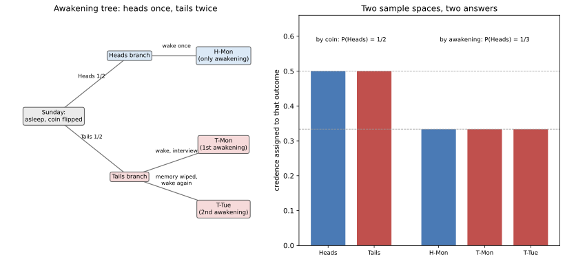

# ch23 — 睡美人問題：你該相信硬幣是正面的機率是多少

> **本章解決什麼問題**：前六章（ch19～ch22）拆的是「選擇與集體」——非傳遞的偏好、循環的投票、自私路由的代價、因果與證據互相打架的決策。這一章開始 Part VII「隨機與測度」，主題換成一件更根本的事：當「機率」這個詞本身要指涉什麼都說不清楚時，連最單純的一枚公正硬幣，都能讓兩群嚴謹的哲學家吵二十幾年、誰也說服不了誰。睡美人問題（Sleeping Beauty problem）問的是：你一覺醒來，被問「你相信硬幣是正面的把握有多高」，這時候你該回答 1/2 還是 1/3？兩個答案背後各自有一套完整無誤的推導，分歧不在算術，而在「機率」這個詞，到底該套用在哪一個樣本空間上。下一章（ch24 貝特朗弦）會示範同一種病灶換一件外衣重演一次：「隨機」這個詞在連續空間裡也不是唯一的。

```text
沒說出口的那句 — 八個部分

  I   解剖學 ────────── ch01 三步解剖：直覺／假設／重建
  │
  II  條件與資訊 ────── ch02 蒙提霍爾 · ch03 三囚犯 · ch04 貝特朗盒子
  │                     ch05 男孩女孩 · ch06 偽陽性
  III 因果聚合計數 ──── ch07 辛普森 · ch08 檢察官謬誤 · ch09 生日問題
  IV  漫步與賭局 ────── ch10 賭徒輸光 · ch11 賭徒謬誤與熱手
  │                     ch12 聖彼得堡 · ch13 兩個信封 · ch14 帕隆多
  V   共同知識 ──────── ch15 紅藍眼睛 · ch16 泥巴小孩
  │                     ch17 意外絞刑 · ch18 兩位將軍
  VI  選擇與集體 ────── ch19 非傳遞骰子 · ch20 孔多塞 · ch21 布雷斯 · ch22 紐康
  VII 隨機與測度 ────── ch23 睡美人 · ch24 貝特朗弦 · ch25 班佛 · ch26 巴拿赫–塔斯基   ◄ 你在這裡
  VIII 收官 ─────────── ch27 一張假設類型總表
```

## 從你已知的出發

實驗是這樣設計的。週日晚上，一位自願參與記憶實驗的受試者——文獻裡習慣稱她「睡美人」——被安眠藥送入沉睡。研究人員拋一枚公正硬幣，正反面各半。如果是正面，睡美人只會在週一被喚醒一次：叫醒她、進房間訪談、問她一個問題，訪談結束後再讓她睡回去，整個實驗到此結束，她不會再醒來。如果是反面，情況比較複雜：她一樣在週一被喚醒、訪談、問同一個問題，但訪談結束後，研究人員會給她注射一種讓她徹底遺忘這次甦醒的藥物——不是普通的「印象模糊」，是連「自己曾經醒來過」這件事本身的記憶都被抹除——再讓她睡回去；到了週二，她會被喚醒第二次，再訪談一次，問同一個問題，訪談結束後實驗才真正結束。

每一次訪談，問題都完全一樣：「你現在相信這枚硬幣是正面的把握有多高？」而且——這是整個設計的靈魂所在——因為失憶藥物的效果，睡美人每次醒來時，完全無法分辨自己正處在哪一種情境裡。她不知道今天是週一還是週二，不知道自己是不是已經被問過這個問題，也不知道硬幣究竟是正面還是反面。她能確定的事情只有實驗的整套規則（這些規則在週日晚上被清楚告知她，她也完全理解並記得），以及此刻自己「正被問到這個問題」這個赤裸裸的事實。

在往下讀之前，先給出你自己的答案。多數人被問到這道題的第一反應，幾乎不假思索：「這不是廢話嗎？硬幣是公正的，正反面各半，這件事在週日晚上拋下去的那一刻就已經決定了，跟我什麼時候被叫醒、被叫醒幾次完全無關——硬幣又不知道自己被誰問了幾次。所以答案當然是 1/2。」這個直覺聽起來滴水不漏：物理世界裡，一枚硬幣落地的那一刻，正反面的結果就固定下來了，後續發生在睡美人身上的任何事——她睡了幾次、醒了幾次、被問了幾次——照理說都不該讓一個已經拋定的硬幣「變得比較可能是正面或反面」。這正是本章開頭要請你老實面對的立場：**你有多確定「與我何時被問無關」這句話一定成立？**

這道題目最早的出處相當模糊。據較弱的次級來源記載，哲學家阿諾德·祖伯夫（Arnold Zuboff）大約在 1980 年代中期就構思過類似的思想實驗，但當時並未正式發表；題目「睡美人」這個名字則據說是羅伯特·斯托爾內克（Robert Stalnaker）取的，並在 1999 年的 Usenet 新聞群組 rec.puzzles 上引發過一輪熱烈討論——但這兩項歸屬都只有次級來源可查，不宜當成確定的史實。真正把這道題目帶進主流哲學期刊、給出標準兩天版本、並且明確主張答案是 1/3 的，是亞當·艾爾加（Adam Elga）2000 年發表於《Analysis》期刊第 60 卷第 2 期的論文〈Self-locating belief and the Sleeping Beauty problem〉。這篇論文出版還不到一年，大衛·路易斯（David Lewis）就在同一份期刊（《Analysis》61 卷 3 期，2001 年）發表反駁，主張答案應該是 1/2。往後二十多年，這場「三分之一派（thirder）」與「二分之一派（halfer）」之間的爭論從未真正落幕——這是本書少數幾章必須誠實承認：**讀完這一章，你不會得到一個「正確答案」，你會得到兩個都無懈可擊的推導，以及一句話，說明它們到底在哪裡分道揚鑣**。

## 把設定釘死：三種可能的「甦醒」

要看清楚爭論的根源，得先把睡美人每次醒來時，究竟身處哪一種情境，逐一列出來。整個實驗只有三種互斥、卻各自可能發生的「甦醒事件」：

```text
H-一：硬幣正面，這是（唯一的）週一甦醒
T-一：硬幣反面，這是週一甦醒（第一次）
T-二：硬幣反面，這是週二甦醒（第二次，記憶已被清空）
```

正面分支只產生一次甦醒（H-一），反面分支產生兩次甦醒（T-一與 T-二）。因為失憶藥物徹底抹去了「我是否已經醒來過」這個線索，睡美人在任何一次甦醒當下，主觀感受到的房間、訪談者、問題，在這三種情境裡完全相同——她沒有任何辦法從自己的感官經驗裡分辨自己此刻是 H-一、T-一，還是 T-二。

這裡出現一個在前面二十二章都不需要特別命名的東西：**指示性資訊（indexical information）**，也叫「自我定位信念（self-locating belief）」。一般的機率問題裡，你不確定的是外在世界的某個事實（這枚硬幣正面或反面、這個病人有病或沒病）；但睡美人不確定的，除了硬幣的結果之外，還多了一層——她不確定「現在」在整條時間線上對應到哪一個時刻、哪一次甦醒。這種不確定性沒辦法單靠「觀察外在世界多蒐集一點資料」來消除，因為不管是週一還是週二，房間裡的一切她能觀察到的東西都一模一樣。這正是本章「必不涵蓋」完整貝氏認識論框架、只在用得上的地方引入這個新概念的原因——後面兩派的分歧，幾乎全部濃縮在「該怎麼替這種指示性不確定性算機率」這一件事上。

睡美人清楚知道整個實驗設計（她週日晚上被告知過），所以她也清楚知道：如果自己此刻正被問問題，那麼眼前這一刻，一定落在 H-一、T-一、T-二這三種情境的其中之一。問題來了——**這三種情境，該不該被賦予相同的可信度（credence）？如果不是三等分，又該怎麼分？**

## 三分之一派的論證：以甦醒次數為樣本空間

艾爾加的論證分成兩步，每一步各自援引一條看起來完全站得住腳的原則，合起來就把三種情境的可信度死死釘在相等。

**第一步（關於反面分支內部：週一甦醒 vs 週二甦醒）**。假設硬幣確實是反面。這時候睡美人一定會經歷兩次甦醒：T-一與 T-二。從她主觀的角度看，這兩次甦醒是完全對稱的——房間佈置相同、問題相同、她對「現在是哪一天」毫無線索，而且（這是關鍵）不管是哪一天，成立的客觀事實都完全平行：都是「反面、被問到同一個問題」。這種時候，一條相當克制、幾乎沒有人會反對的原則——**限制版無差別原則（restricted principle of indifference）**——告訴我們：既然兩種情境在她能取得的所有資訊底下完全對稱，她的可信度就該平分：

```text
C(T-一) = C(T-二)                          ← 反面分支內部兩次甦醒對稱、等可信
```

**第二步（關於「今天是週一」這件事本身，跟硬幣有沒有關係）**。設想一種略有不同、但邏輯上等價的情境：睡美人醒來後，除了被問「你相信正面的把握多高」，訪談者還額外多告訴她一句客觀事實：「今天是週一。」——注意，這句話**沒有**洩漏硬幣的結果，因為不管正面或反面，週一都保證會有一次甦醒（正面版本的唯一甦醒在週一，反面版本的第一次甦醒也在週一）。換句話說，「今天是週一」這件事發生的機率，在正面世界與反面世界裡完全相同，都是「必然發生」。一件在兩種假設下發生機率都是 1、完全不偏袒任何一邊的證據，不該讓睡美人的可信度往任何一個方向移動——這正是機率論裡貝氏更新（Bayesian updating，完整式見 ch06）最基本的直覺：**似然比（likelihood ratio）等於 1 的證據，不改變勝算（odds）**。硬幣本身在週日晚上就已經是公正的 1/2 對 1/2，而「今天是週一」這句話不偏不倚，所以聽到這句話之後，她對「硬幣是正面」的可信度，應該還停留在拋硬幣當下那個客觀的 1/2：

```text
C(正面 ∣ 今天是週一) = C(反面 ∣ 今天是週一) = 1/2      ← 週一這件事本身不洩漏硬幣結果
```

把這句話翻回「H-一」與「T-一」的語言：已知「今天是週一」這件事只可能對應到 H-一或 T-一這兩種情境（週二不可能有「今天是週一」這種訊息），所以上面這個條件式等價於：

```text
C(H-一) / [C(H-一) + C(T-一)] = 1/2
⟹ C(H-一) = C(T-一)                       ← 正面的唯一甦醒 與 反面的第一次甦醒，等可信
```

**把兩步接起來**：第一步給出 C(T-一) = C(T-二)，第二步給出 C(H-一) = C(T-一)。三個等式串在一起，H-一、T-一、T-二 這三種互斥又窮盡所有可能的情境，可信度必須完全相等。既然三者加起來必須等於 1（每一次甦醒，睡美人一定落在其中恰好一種情境裡）：

```text
C(H-一) + C(T-一) + C(T-二) = 1
且 C(H-一) = C(T-一) = C(T-二)
⟹ C(H-一) = C(T-一) = C(T-二) = 1/3
```

而「硬幣是正面」這件事，正好等同於「此刻落在 H-一這個情境裡」——正面分支不會產生任何其他種類的甦醒。所以：

```text
P(正面) = C(H-一) = 1/3                    ← 三分之一派的答案
```

這是本章第一個 worked example：**樣本空間選成三種「不可分辨的甦醒情境」，每種各 1/3，正面只佔其中一種，答案是 1/3。** 值得停下來留意的是，這個論證的第二步，用的其實是路易斯自己一貫主張的原則——「當你手上的證據完全不偏袒某個已知客觀機率的事件時，你的可信度該直接等於那個客觀機率」——艾爾加等於是拿路易斯自己的武器，去論證一個路易斯不會同意的結論。這也是這場爭論讓哲學界覺得特別耐嚼的地方：雙方不是各說各話、互不理睬，而是深入到對方的地基裡辯論。

艾爾加自己還提供了第二種、更直覺的論證方式，可以當成上面嚴謹推導的自我複核：想像把整套「週日拋硬幣、視結果甦醒一或兩次」的實驗，獨立重複一千次（一千枚各自公正的硬幣）。大數法則下，大約 500 次會拋出正面、500 次拋出反面。正面的 500 次實驗，各自只產生一次甦醒，合計 500 次甦醒；反面的 500 次實驗，各自產生兩次甦醒，合計 1,000 次甦醒。把一千次獨立實驗裡「所有發生過的甦醒」全部攤開來算比例：

```text
正面產生的甦醒次數 = 500 × 1 = 500
反面產生的甦醒次數 = 500 × 2 = 1,000
甦醒總次數         = 500 + 1,000 = 1,500

在所有甦醒之中，屬於「正面」的比例 = 500 / 1,500 = 1/3     ← 與上面的推導一致
```

這套「長期比例」的計算方式，算的其實是另一件事——不是單一次實驗裡「硬幣是正面」的機率，而是「如果你是被隨機抽出來詢問的某一次甦醒，這次甦醒剛好來自正面分支」的長期比例——但兩種計算方式殊途同歸，都指向 1/3，這也是艾爾加認為三分之一派立場站得住腳的重要理由之一。

## 二分之一派的論證：以硬幣為樣本空間

路易斯的反駁不是說艾爾加的算術有錯，而是質疑一件更根本的事：**睡美人醒來時，究竟有沒有拿到任何值得更新可信度的新證據？**

先把時間拉回週日晚上，睡美人尚未入睡之前。這時候她的可信度毫無爭議：硬幣公正、尚未拋擲，C(正面) = 1/2。整套實驗規則——正面只喚醒一次、反面喚醒兩次並在中間清除記憶、每次都問同一個問題——她在週日晚上就已經完整知悉、完整記得。

路易斯的論點是：當她之後某一次醒來、被問到那個問題時，她「學到」的東西，只有「我現在醒著、正被問這個問題」這樣一件事，記作證據 E。這件事到底有沒有透露硬幣的結果？路易斯說沒有——因為不管硬幣正面或反面，**這個實驗設計保證她一定至少會醒來一次、一定至少會被問一次這個問題**。用機率的語言講：

```text
P(E ∣ 正面) = 1     ← 正面分支保證她會在週一醒來、被問一次
P(E ∣ 反面) = 1     ← 反面分支保證她至少會醒來、被問一次（其實會被問兩次，但「至少一次」已保證發生）
```

貝氏定理的核心精神是：**一件在各種假設下發生機率都相同的證據，不攜帶任何區分假設的資訊**——這正是本書從 ch06 一路強調到現在的那把刀。把這件事套進貝氏定理的完整式：

```text
C(正面 ∣ E) = P(E ∣ 正面)·C(正面) / P(E)
            = P(E ∣ 正面)·C(正面) / [P(E∣正面)·C(正面) + P(E∣反面)·C(反面)]
            = (1 × 1/2) / (1 × 1/2 + 1 × 1/2)
            = (1/2) / 1
            = 1/2                          ← 二分之一派的答案
```

換一種寫法看更直白：貝氏更新的「勝算形式（odds form）」告訴我們，後驗勝算＝先驗勝算 × 似然比。這裡的似然比 P(E∣正面) / P(E∣反面) = 1/1 = 1，代表「醒來被問到」這件證據完全不偏袒任何一邊，先驗勝算（1 比 1）原封不動地變成後驗勝算，可信度自然停留在 1/2 沒有移動。

這是本章第二個 worked example：**樣本空間選成硬幣本身的兩種結果（正面、反面），甦醒這件事本身的似然比是 1 比 1，貝氏更新後可信度不變，答案是 1/2。** 路易斯的核心主張換句話講就是：「醒來被問問題」對睡美人而言不是新聞——她週日晚上就百分之百確定自己會經歷至少一次這樣的甦醒，不管硬幣落在哪一面；一件你早就篤定會發生的事，真的發生時不該讓你改變任何原有的信念。

值得留意的是，兩位作者對「睡美人一次也沒醒過」這種情況完全沒有分歧——如果實驗根本沒有把她叫醒，她自然沒有機會回答任何問題，這不在爭論範圍內。真正吵起來的，是「她已經醒了、正被問到這個問題」這個當下，這件事本身算不算一則新證據。

## 兩邊到底在吵什麼：分歧藏在「機率」指的是哪個樣本空間

看完兩套推導，你會發現一件很不尋常的事：**雙方的算術都無懈可擊，沒有人算錯任何一步。** 這跟本書前面二十二章的悖論很不一樣——蒙提霍爾（見 ch02）的直覺答案 1/2 之所以錯，是因為它漏算了主持人被規則綁住這件事；男孩女孩問題（見 ch05）的爭議，一旦講清楚抽樣程序，答案立刻唯一。睡美人問題不是這樣：把兩套論證的前提都攤開來看，各自的每一步都合法，卻導向兩個不同的數字。

分歧真正藏在哪裡？答案是：**「機率」這個詞，兩派各自悄悄套用了不同的樣本空間，卻都沒有把這件事講出來。**

- 二分之一派（路易斯）把樣本空間釘在**硬幣本身**：Ω = {正面、反面}，各 1/2。他隱含的假設是：可信度的更新，應該只對「客觀世界裡發生了什麼、還沒發生什麼」這種命題做貝氏條件化；而「我現在醒著、正被問問題」——因為在正反面底下發生機率都是 1——不算一則能改變這個外部世界機率的證據。
- 三分之一派（艾爾加）把樣本空間換成**甦醒事件本身**：Ω = {H-一、T-一、T-二}，各 1/3。他隱含的假設是：當一個人可能經歷多次、彼此主觀無法分辨的「自我定位時刻」時，正確的可信度必須把這些時刻本身當成基本單位來平均分配，而不能只看「外部世界的硬幣結果」這一層——因為反面分支製造了兩個這樣的時刻，正面分支只製造一個，這個「數量上的不對稱」本身就是一條真正相關的資訊，不能被忽略。

換句話說，這不是兩個人在同一把尺上量出不同刻度，而是兩個人各自拿了一把不一樣的尺——一把只丈量「外部世界的客觀狀態」，一把丈量「所有可能發生的自我定位時刻」。硬幣作為一個物理裝置，機率永遠是乾乾淨淨的 1/2，這件事雙方都同意，從頭到尾沒有爭議；真正的分歧，在於「當你被問到『你現在相信……的把握有多高』時，這句話裡的『你現在』，該不該把『反面分支製造了兩次可以問這句話的機會，正面分支只製造了一次』這個事實算進去」。這正是本章「必涵蓋」的那句話：分歧的本質是「醒來這件事有沒有給出新資訊」——路易斯說沒有（醒來是必然發生的事，不攜帶資訊），艾爾加說有（這一次甦醒，是指示性的、需要在所有可能的甦醒時刻裡自我定位的一則資訊）。

這裡可以借用本書第 6 章（見 ch06）已經建立好的語言，把整件事講得更貼近直覺一次——上一次你被「一個動作洩漏了資訊」教訓過，是偽陽性悖論：一次篩檢結果是陽性，聽起來像是「疾病比較可能存在」的鐵證，但陽性結果本身出現的頻率——包含多少來自真的有病、多少來自健康人身上的假警報——才是決定 P(有病∣陽性) 真正大小的關鍵。這裡的機制在結構上有一個相似之處：睡美人「被喚醒、被問到」這件事，就像是那個陽性結果——表面上看起來只是「一個中性的動作發生了」，但這個動作本身在正面分支只發生一次、在反面分支發生兩次，發生頻率不對稱。三分之一派主張，這種「發生頻率不對稱」跟 ch06 的檢測陽性率不對稱一樣，是必須被計入的資訊；二分之一派則反駁，睡美人早就篤定自己一定會被喚醒（不像疾病篩檢——你事前並不確定自己會不會測出陽性），所以這個類比在「事前確定性」這一點上失效——這正是這個橋接的邊界：ch06 的陽性結果，是一件事前不確定、發生了才算新聞的事；睡美人的「被喚醒」，是一件事前就百分之百確定會發生的事，只是「會發生幾次」因硬幣而異。這條邊界，恰好就是兩派爭執不下的所在。

順帶一提，這場論戰還牽出一個常被拿來質疑二分之一派的技術性難題：如果沿用路易斯的框架去算「已知今天是週一，硬幣是正面的可信度」，算出來的數字是 **2/3**——而不是二分之一派自己在別處主張的、感覺上「應該」是 1/2（因為「今天是週一」照理說不該偏袒任何一邊，這正是艾爾加論證第二步用的那個原則）。這個結果被不少評論者視為二分之一派內部的一處緊張——它不代表路易斯的論證整體崩潰，但確實顯示這場爭論比表面上「1/2 或 1/3，選一個」複雜得多。本書在此誠實停筆：這是形式知識論（formal epistemology）裡一個持續超過二十年的活躍研究問題，史丹佛哲學百科全書（Stanford Encyclopedia of Philosophy, SEP）目前沒有替它開一個獨立條目，而是收在「知態悖論（Epistemic Paradoxes）」這個綜合條目底下——這個歸類本身，也在暗示這個問題目前還沒有被視為已經「解決」到可以獨立成章的地步。



## 直覺的陷阱

| 直覺在哪一步被帶偏 | 偷渡了什麼假設 | 怎麼自我察覺 |
|---|---|---|
| 一聽到「公正硬幣」就直接斷言答案是 1/2 | 假設「機率」只能指涉硬幣本身這個外部世界的物理裝置，沒意識到題目還牽涉「我現在是哪一次甦醒」這種自我定位的不確定性 | 問自己：如果反面分支被喚醒的次數改成三次、一百次，我的答案還會不會一樣？如果直覺上「應該會變」，就代表甦醒次數本身在悄悄影響你的判斷，不是純粹的硬幣機率 |
| 覺得「反正兩套計算方式都對，隨便選一個就好」 | 沒意識到兩套計算方式其實各自回答了一個定義不同的問題，答案的差異不是誤差、是問題本身沒講清楚在問哪一個樣本空間 | 把每個答案配上它真正對應的樣本空間寫下來——「以硬幣計得 1/2」「以甦醒次數計得 1/3」——而不是抽象地問「到底哪個對」 |
| 以為「甦醒被問到」跟「檢測呈陽性」是同一種資訊 | 忽略了偽陽性（見 ch06）裡的陽性結果事前並不確定會不會發生，而睡美人的甦醒事前就已經確定會發生（差別只在發生幾次） | 檢查那件被條件化的事，在各個假設下發生的機率是不是都恰好等於 1——如果是，路易斯式的論證會說它不攜帶資訊；如果甦醒次數本身不對稱，艾爾加式的論證會說這個不對稱才是關鍵 |
| 以為哲學家吵了二十幾年一定有一方最後被說服 | 把「無共識」誤讀成「還沒有人夠聰明去解決它」，而不是「這是一個關於機率定義本身的分歧」 | 檢查延伸閱讀裡兩篇原始論文的日期與期刊——2000 年提出、2001 年反駁、到今天雙方陣營都還在發表新論文，這種持續時間本身就是訊號 |

> **那句沒說出口的話是**：這道題目問「你相信硬幣是正面的機率是多少」，卻沒有講清楚「機率」在這裡該套用在哪一個樣本空間——是硬幣本身的兩種結果，還是所有可能、彼此無法分辨的甦醒時刻；醒來這件事本身，到底算不算一則值得更新可信度的新資訊，兩派給出了兩個都自洽、卻互不相容的答案。

## 紙上推演

### 題一 ★　**[10 分鐘]**：把反面的甦醒次數改成三次

假設把實驗規則改成：反面時，睡美人會在週一、週二、週三各醒來一次（記憶都被清除），正面依然只在週一醒來一次。用三分之一派的邏輯（艾爾加的兩步論證，只是把「週一 vs 週二」的對稱擴大成「週一 vs 週二 vs 週三」的三方對稱），求 P(正面)。

### 推演解答

樣本空間變成四種情境：H-一、T-一、T-二、T-三。第一步（反面分支內部對稱）現在要證明三個而不是兩個情境相等：T-一、T-二、T-三在睡美人主觀經驗上完全無法分辨，且成立的客觀事實在三天裡完全平行，套用同一條限制版無差別原則，得 C(T-一) = C(T-二) = C(T-三)。第二步不變：告知「今天是週一」這件事，在正面與反面底下發生的機率都是 1（兩種分支都保證週一有一次甦醒），因此 C(正面∣週一) = 1/2，換算回 C(H-一) = C(T-一)。四個等式串起來：C(H-一) = C(T-一) = C(T-二) = C(T-三)，四者相加為 1，所以每個都是 1/4。P(正面) = C(H-一) = **1/4**。這個結果可以一般化：如果反面分支喚醒 n 次、正面喚醒 1 次，三分之一派算出的 P(正面) = 1/(n+1)——喚醒次數越不對稱，正面被稀釋得越低。

### 題二 ★★　**[15 分鐘]**：二分之一派的答案會不會被同一個變動影響

沿用題一的變體（反面喚醒三次），用路易斯的論證（貝氏更新、樣本空間是硬幣本身）重新算一次 P(正面∣醒來被問到)。這個答案跟原本兩天版本的 1/2 相比，有沒有變化？請說明為什麼。

### 推演解答

路易斯的論證完全不看「反面分支喚醒幾次」這個數字，只看「甦醒這件事本身，在正面與反面底下發生的機率是不是都等於 1」。不管反面喚醒兩次還是三次，只要保證「至少醒來一次」，P(E∣正面) = 1、P(E∣反面) = 1 這兩個條件都成立，似然比永遠是 1 比 1，貝氏更新後可信度永遠停在先驗的 1/2，**完全不受喚醒次數影響**。這正是題一與題二放在一起最值得停下來體會的地方：三分之一派的答案 1/(n+1) 會隨著反面的喚醒次數而改變，二分之一派的答案卻對這個數字完全無感——兩套論證，面對同一個變動，表現出截然不同的敏感度，這也是這場爭論裡雙方互相質疑對方「是不是漏算了什麼」的常見切入點。

### 題三 ★★★　**[20 分鐘]**：長期比例計算方式的自我複核

用本章「三分之一派」那節提到的長期比例計算方式（獨立重複整個兩天版實驗 N 次，數所有甦醒次數裡屬於正面的比例），驗證 N = 4,000 次獨立實驗時，理論上大約會出現多少次「正面甦醒」、多少次「反面甦醒」，並算出兩者的比例是否仍然貼近 1/3。

### 推演解答

N = 4,000 次獨立實驗，硬幣公正，理論上大約一半、也就是 2,000 次會拋出正面，另外 2,000 次拋出反面（實際數字會因抽樣噪音而有小幅波動，這裡先用期望值計算）。正面的 2,000 次實驗，各自只產生一次甦醒，合計 2,000 次甦醒；反面的 2,000 次實驗，各自產生兩次甦醒，合計 4,000 次甦醒。

```text
正面產生的甦醒次數 = 2,000 × 1 = 2,000
反面產生的甦醒次數 = 2,000 × 2 = 4,000
甦醒總次數         = 2,000 + 4,000 = 6,000

正面甦醒佔全部甦醒的比例 = 2,000 / 6,000 = 1/3
```

跟本章正文用 1,000 次實驗算出的比例一字不差，都是 1/3——這確認了長期比例這套計算方式的答案不隨實驗重複次數 N 而改變，只要硬幣公正、正反面各半，這個比例就穩定收斂在 1/3。這也再次印證：這套計算方式回答的是「隨機抽出一次甦醒、它剛好來自正面分支」的長期頻率，跟艾爾加主論證裡「單一次實驗、此刻甦醒屬於 H-一的可信度」殊途同歸，兩者是同一個數字的兩種計算方式。

## 自我檢核

1. 睡美人問題跟蒙提霍爾（見 ch02）、男孩女孩問題（見 ch05）最大的不同是什麼？為什麼前兩者最終有唯一答案，睡美人問題卻沒有？
2. 用你自己的話重講一次艾爾加論證的兩個步驟——哪一步在講反面分支內部的對稱，哪一步在講「今天是週一」這句話為什麼不洩漏硬幣的結果？
3. 路易斯的論證核心，用一句話講完，會怎麼講？「醒來被問問題」這件事，為什麼在他的框架裡不算新證據？
4. 如果反面分支喚醒的次數從兩次改成一百萬次，三分之一派與二分之一派的答案各自會不會變？哪一派的答案對這個變動比較敏感，為什麼？
5. 指示性資訊（indexical information）／自我定位信念是什麼意思？為什麼一般的條件機率問題不需要這個概念，睡美人問題卻需要？
6. 這個悖論那句沒說出口的假設是什麼？為什麼它跟前面二十二章「找出一個被忽略的假設、然後嚴謹重建出唯一答案」的模式不太一樣？
7. 本章借用了 ch06 偽陽性的哪個概念來類比睡美人的「被喚醒」？這個類比在哪裡成立、又在哪裡失效？
8. 如果有人告訴你「睡美人問題早就解決了，答案就是 1/3（或 1/2）」，根據本章你會怎麼回應？

## 延伸閱讀

- Adam Elga, "Self-locating belief and the Sleeping Beauty problem," *Analysis* 60(2) (2000): 143–147——三分之一派的原始論文，本章兩步論證與長期比例計算方式都出自這裡，普林斯頓大學個人網頁提供全文 PDF。https://www.princeton.edu/~adame/papers/sleeping/sleeping.pdf
- David Lewis, "Sleeping Beauty: reply to Elga," *Analysis* 61(3) (2001): 171–176——二分之一派的原始反駁，篇幅極短、論證極精煉，是本章路易斯論證那一節的直接依據。
- Stanford Encyclopedia of Philosophy, "Epistemic Paradoxes"（睡美人問題收錄於此綜合條目，SEP 未替它開獨立條目）——想確認本章提到「至今無共識、仍是活躍研究問題」這句話的讀者，這是最權威的起點。https://plato.stanford.edu/entries/epistemic-paradoxes/
- Wikipedia, "Sleeping Beauty problem"——整理了兩派論證的多個變體版本（含不公正硬幣、多次甦醒等推廣），也收錄了對路易斯框架「P(正面∣週一) = 2/3」這個技術性難題的整理，適合想繼續往下追的讀者。https://en.wikipedia.org/wiki/Sleeping_Beauty_problem
