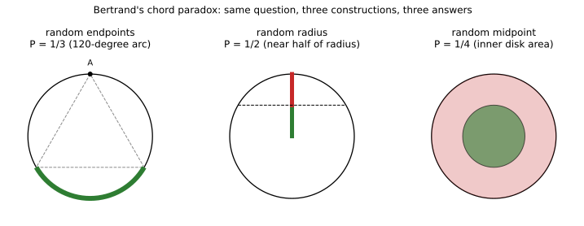

# ch24 — 貝特朗弦悖論：「隨機」這個詞沒定義完

> **本章解決什麼問題**：這一章要先做一件澄清的工作——這裡的貝特朗（Bertrand）弦悖論，跟 ch04 的貝特朗盒子悖論，是同一位法國數學家貝特朗在 1889 年同一本書《機率計算》（Calcul des probabilités）裡提出的兩個不同問題，不是同一題換個講法，答案（2/3 對 1/3、1/2、1/4）也完全對不上，兩者只是撞名。ch23（睡美人問題）拆穿的是「主觀信念該怎麼更新」在哲學上懸而未決；這一章換一個更基礎的破口——連「隨機挑一個東西」這句話本身，在連續、無限的空間裡，都可能有不只一種合法的意思。這是 Part VII（隨機、無限與測度：定義塌在暗處）的第二章，下一章 ch25（班佛定律）、ch26（巴拿赫－塔斯基悖論）會繼續在「均勻」「體積」這些聽起來理所當然的詞底下，挖出同樣的坑。

## 從你已知的出發

先把問題講清楚：在一個圓裡，畫一個內接正三角形（三個頂點都落在圓周上）；然後在同一個圓裡，「隨機」畫一條弦（chord，連接圓周上兩點的線段）。問題是——這條隨機畫出來的弦，比正三角形的邊長還要長，機率是多少？

在往下讀之前，先在腦中把整個畫面想清楚一遍：一個圓、一個內接正三角形、一條隨手畫下去的弦。這條弦有可能很短（兩個端點離得很近），也有可能幾乎是一條直徑（兩個端點幾乎在圓的正對面）；正三角形的邊，則是一個固定的長度，介於「很短」和「直徑那麼長」之間某個位置。直覺上，這聽起來是一個定義清楚、答案唯一的機率問題——圓是幾何上最對稱的圖形，「隨機」聽起來也是最沒有歧義的詞：不偏袒任何一個位置，每個可能性的機會均等。多數人心裡冒出的做法會是這樣：在圓周上隨機點兩個點，把它們連起來，這就是「隨機畫一條弦」最自然、最直覺的操作型定義。順著這個做法算下去，會得到一個具體的數字（正文稍後會算出來是 1/3），而且會覺得這就是這題唯一的正解——這是一個幾何機率問題，圓的對稱性擺在那裡，怎麼可能有第二個「一樣正確」的答案？

這正是貝特朗在 1889 年那本書裡，故意留給讀者的陷阱。他不是在教怎麼算一個機率題，他是在提醒讀者：上面那個「隨機點兩個端點連起來」的做法，聽起來自然，卻只是眾多「聽起來同樣自然」的操作型定義裡的一種。他自己至少給出了三種同樣嚴謹、同樣站得住腳的取法，而這三種取法算出來的答案彼此不同，沒有一個能被指控「算錯了」。這一章要做的事，就是把貝特朗當年擺出來的三種取法，一步一步算到底，然後停下來問一個更根本的問題：如果同一道題目、三種都無可挑剔的做法，能算出三個不同的正確答案，那麼「隨機」這兩個字，到底憑什麼被當成一個定義清楚的概念？

## 準備工作：弦長跟什麼有關

在動手算三種取法之前，先建立一個所有取法都會用到的共同工具：弦長怎麼用幾何算出來。設圓心為 O，半徑為 R。

**弦長對中心角**：如果弦的兩個端點在圓心看出去的夾角（central angle，中心角）是 θ，從圓心往弦作垂線，垂足會把弦平分，也把這個等腰三角形（兩腰都是半徑 R）從中間切成兩個全等的直角三角形，直角三角形的斜邊是 R、其中一個銳角是 θ/2，於是半弦長＝R·sin(θ/2)，弦長本身就是：

```text
弦長 = 2R·sin(θ/2)
```

θ 從 0 增加到 π（180 度）時，弦長從 0 一路增加到直徑 2R（θ 再往 2π 增加，等於是從另一邊繞回來，弦長對稱地縮回 0，物理上就是同一組端點）。

**弦長對距圓心的垂直距離**：換一個角度看同一件事。設某條弦到圓心的垂直距離是 d（0 ≤ d ≤ R），從圓心到弦的垂足、到弦的一個端點，這三點又組成一個直角三角形：斜邊是半徑 R，一股是 d，另一股是半弦長，由畢氏定理（Pythagorean theorem）：

```text
半弦長 = √(R² − d²)　　⟹　　弦長 = 2√(R² − d²)
```

d 越大（弦離圓心越遠），弦越短；d=0 時弦長剛好是直徑 2R；d=R 時弦長縮成 0（弦退化成一個點，切在圓周上）。這兩個公式是等價的（同一條弦，只是分別用中心角、垂直距離去描述），後面三種取法會輪流用到其中一個。

**正三角形的邊長與內切距離**：內接正三角形的三個頂點把圓周三等分，任兩個相鄰頂點之間的中心角是 360°/3=120°。代入弦長對中心角的公式，正三角形的邊長：

```text
s = 2R·sin(120°/2) = 2R·sin(60°) = 2R·(√3/2) = R√3
```

再算這條邊到圓心的垂直距離（也就是正三角形的內切圓半徑，apothem）。圓心 O 到頂點 A、B 的中心角是 120°，從 O 向邊 AB 作垂線，垂足 M 把這個角平分成兩個 60°，直角三角形 OMA 裡，斜邊 OA=R、∠MOA=60°，所以：

```text
OM = R·cos(60°) = R/2
```

這兩個數字——邊長 s=R√3、邊到圓心的垂直距離 R/2——是接下來三種取法都要拿來當「門檻」比較的基準值。特別要記住：**弦長大於邊長 s，等價於這條弦到圓心的垂直距離小於 R/2**（因為弦長是 d 的遞減函數，d 越小弦越長，門檻就落在 d=R/2 這個點上）。

## 取法一：隨機端點——圓周上點兩個點

第一種取法，也是多數人直覺會想到的做法：在圓周上獨立、均勻地隨機點兩個點，連成一條弦。

利用圓的旋轉對稱性，可以先把第一個點固定在正三角形的一個頂點 A 上——這不會影響最終機率，因為不管第一個點落在圓周哪個位置，都可以把整個正三角形連同圓一起旋轉，讓某個頂點對齊第一個點，而第二個點是均勻隨機分布在圓周上，旋轉並不改變「均勻」這件事。

固定 A 之後，正三角形另外兩個頂點 B、C，把圓周分成三段弧，每段弧都是 120°（因為三頂點三等分圓周）。第二個點 P 均勻隨機地落在整條圓周上，連成弦 AP。這條弦比邊長 s 長，等價於 AP 的中心角大於 120°（因為中心角越大、弦越長，而 AB、AC 這兩條邊本身的中心角剛好是 120°）。

只有當 P 落在「B 和 C 之間、不含 A 的那段弧」時，AP 的中心角才會超過 120°——這段弧正好是三段 120° 弧裡的其中一段。P 均勻分布在整個 360° 圓周上，P 落在這段特定 120° 弧內的機率：

```text
P(弦長 > 邊長) = 120° / 360° = 1/3
```

這就是取法一的答案：**1/3**。直覺上也能對照確認：P 若落在 A 附近（B、C 之外的那兩段弧），弦 AP 會比較短，比不上邊 AB 或 AC；只有 P 繞到正三角形「正對面」那段弧，AP 才會拉得比邊長更長。

## 取法二：隨機半徑——先選方向、再選距離

第二種取法：先隨機選一個方向（也就是隨機選一條半徑），再沿著這條半徑，均勻隨機選一個介於圓心與圓周之間的點，過這個點、垂直於這條半徑，畫出對應的弦。

同樣利用旋轉對稱性，半徑的方向本身不影響機率（不管選哪個方向的半徑，沿它均勻選點、畫垂直弦的規則都一樣），真正決定弦長的只有選中的那個點到圓心的距離 d，而 d 均勻分布在 0 到 R 之間。

用前面準備好的門檻：弦長大於邊長 s，等價於 d < R/2。d 均勻分布在整條長度為 R 的線段（半徑）上，d 落在「0 到 R/2」這一段（長度剛好是半徑的一半）的機率：

```text
P(弦長 > 邊長) = (R/2) / R = 1/2
```

這就是取法二的答案：**1/2**。這條半徑上，「離圓心比較近」的那一半，畫出來的弦都比正三角形邊長長；「離圓心比較遠」的那一半，畫出來的弦都比邊長短——這條半徑剛好被邊長門檻切成長度相等的兩段，所以機率是乾淨的二分之一。

## 取法三：隨機中點——在整個圓盤面積裡點一個點

第三種取法：在整個圓盤（圓周所包住的整個平面區域，包含內部）裡，均勻隨機點一個點 P（均勻的意思是，圓盤裡任兩塊面積相等的區域，P 落在裡面的機率相等），把 P 當成某條弦的中點——除了圓心本身（機率為零的單點，可以忽略），圓盤裡每一個點都恰好是唯一一條弦的中點：這條弦垂直於 OP、且到圓心的距離就是 d=|OP|。

這一次，d 不再均勻分布在 0 到 R（這是取法三跟取法二唯一，卻是決定性的差異）。把圓盤用同心圓一圈一圈切開想：半徑在 d 到 d+一個很小的距離之間的那一圈細環，面積大約是「周長 × 寬度」＝2πd×（小距離）——半徑 d 越大，同樣寬度的細環面積就越大。換句話說，P 落在「離圓心比較遠」的細環裡的機率，比落在「離圓心比較近」、寬度相同的細環裡的機率要來得高，因為外圈本身面積比較大。

具體算式是：半徑小於等於 d 的圓盤（一個半徑為 d 的小圓）面積是 πd²，整個圓盤面積是 πR²，所以 P 落在「半徑小於等於 d」這個範圍的機率，是兩個面積的比：

```text
P(|OP| ≤ d) = πd² / πR² = (d/R)²
```

同樣用門檻 d<R/2：

```text
P(弦長 > 邊長) = P(|OP| < R/2) = (R/2 / R)² = (1/2)² = 1/4
```

這就是取法三的答案：**1/4**。留意這個結果跟取法二的關鍵差異——取法二裡，「半徑上離圓心較近的一半」機率是二分之一（因為是長度的比）；取法三裡，「圓盤上離圓心較近、半徑為 R/2 的那個小圓」機率卻只有四分之一（因為是面積的比，而面積跟半徑的平方成正比，同樣的長度比例，換算成面積比例，數字會被平方壓縮）。同一個門檻（d<R/2），套在兩種不同的「均勻」定義下，卻算出兩個不同的機率——這正是整章要凸顯的核心現象。

下面這張圖把三種取法的成功區域並排畫出來：左邊是取法一，圓周上有一段 120° 的弧被標成成功區；中間是取法二，一條半徑被門檻點切成兩段相等長度；右邊是取法三，整個圓盤裡有一個半徑減半的小圓被標成成功區，它的面積只佔整個圓盤的四分之一。



## 三個答案為什麼都對：均勻在量誰

三種取法算出 1/3、1/2、1/4，而且每一步推導都無可挑剔——沒有任何一步用錯公式、算錯數字。三個答案能夠同時成立，關鍵在於：**「均勻隨機」從來不是一個獨立於量法而存在的概念，它永遠是「在某個特定的量、某個特定的座標系底下均勻」**。

一條弦，可以用好幾種不同的座標去描述它：可以用兩個端點各自的角度（θ₁, θ₂）去描述，也可以用「半徑方向的角度＋到圓心的距離」（φ, d）去描述，還可以用「中點的直角座標」（x, y）去描述。這幾種座標系之間可以互相換算，描述的是同一組弦，但「在某個座標系裡均勻」這件事，換到另一個座標系底下，通常就不再均勻了。

取法一，是在（θ₁, θ₂）這組角度座標上均勻；取法二，是在（φ, d）這組座標上，對 d 均勻（φ 因為旋轉對稱不影響結果）；取法三，是在圓盤的直角座標（x, y）上均勻——而換算成極座標的（φ, d）之後，同樣的均勻分布，d 卻不再均勻，而是帶有一個隨半徑增大而增大的權重（面積元素 dA=d·dd·dφ 裡那個額外的 d），這就是取法二跟取法三雖然用的是同一個「d<R/2」門檻，算出來的機率卻是 1/2 對 1/4 的根本原因——同一個門檻，套在兩種不同權重的「均勻」底下，換算出的比例本來就不會一樣。

「弦的空間」本身是一個連續、二維的無限集合，這個集合上沒有一個先驗、獨一無二、「大家會自動同意」的均勻分布——就像一條無限長的數線上沒有天生的均勻分布一樣，你一定要先選定一種參數化方式（用什麼座標描述一條弦），「均勻」才有意義。這正是貝特朗弦悖論真正指出的破口：不是計算出錯，而是「隨機選一個東西」這句話，在有限、離散的世界裡（例如「隨機從一副撲克牌抽一張」）幾乎不會有歧義，但一旦搬到連續、無限的空間，就必須先講清楚「均勻是均勻在哪一個量上」，否則這句話根本沒有定義完。（這個問題再往下深挖，會碰到「並非每一個集合都有良定義的體積」這類更深的測度論坑，那是 ch26 巴拿赫－塔斯基悖論要處理的層次，這裡不展開。）

## 賈因斯的嘗試：加上不變性，選出「唯一」的答案，但代價是什麼

貝特朗弦悖論提出將近一個世紀後，物理學家賈因斯（Edwin T. Jaynes）在 1973 年一篇題為〈The Well-Posed Problem〉的論文（《Foundations of Physics》3(4), 1973）裡，提出了一個試圖「選出唯一正解」的辦法。

賈因斯的論證是這樣的：想像貝特朗的問題其實描述的是一個物理過程——比如把一根細長的稻草，從高處隨意扔到一張畫著圓的桌上，稻草落下時剛好跨過整個圓，在圓上截出一條弦。這個物理過程有一個特性：投稻草的人，並不知道（也不需要知道）桌上那個圓畫在桌面的哪個確切位置、也不知道那個圓的半徑剛好是多少——如果知道答案不應該因為圓画得偏左一點、偏右一點，或者圓畫得大一點、小一點而改變，那麼描述這個隨機過程的機率分布，就必須在圓心平移、圓的尺度縮放這兩種變換下保持不變（invariant），而不只是在圓自身的旋轉下保持不變（三種取法都自動滿足旋轉不變性，因為圓本身是旋轉對稱的）。

用這一條額外的不變性要求去檢驗貝特朗的三種取法，賈因斯證明只有**取法二（隨機半徑）** 同時滿足平移不變性與尺度不變性；取法一（隨機端點）和取法三（隨機中點），在圓心稍微平移或圓稍微放大縮小之後，算出來的分布會跟著改變，不滿足這個要求。於是，如果把「這個機率分布必須不受圓的位置與大小影響」當成篩選條件，貝特朗弦悖論就有了唯一解：**P=1/2**。

這是一個漂亮、也確實常被拿來當「貝特朗弦悖論已被解決」的論證，但要誠實地把它的代價寫清楚：賈因斯選出唯一解的方法，靠的是**額外加上一條貝特朗原題根本沒有講出口的要求**——「這個隨機分布必須在圓心平移、圓的尺度縮放下不變」。貝特朗原本的題目，只講了一個固定的圓、固定的半徑，題目本身完全沒有要求「答案不能因為換一個位置、換一個大小的圓而改變」。賈因斯的論證，回答的其實是一個更精確也更具體的問題——「如果我要描述一個不知道圓確切位置與大小的物理隨機過程，用哪一種分布最合理」——這個問題確實有唯一解，但它不等於「貝特朗原本那個問題也只有一個正解」。換句話說，賈因斯用一套新的無差別原則（不變性下的最大熵，或者說變換群方法），去解決舊的無差別原則失靈的問題，這在應用上（例如統計物理裡對稱性論證）非常有用，但**沒有消解「均勻隨機」這個詞在哲學上原本就存在的歧義**——它只是把「該對什麼均勻」這個選擇，從「三種取法選一種」，往後推移到「該不該要求對圓的位置與大小也保持不變」，而後面這個選擇，本身仍然是一個沒有被邏輯必然性強迫、而是被額外採納的假設。

## 直覺的陷阱

把整章的錯覺攤開來看：

| 階段 | 發生了什麼 |
|---|---|
| 直覺的自信答案 | 「圓內隨機一條弦，比內接正三角形邊長還長的機率」聽起來是一道定義清楚的幾何機率題，圓又是最對稱的圖形，理應只有一個正確答案 |
| 偷渡的假設 | 把「隨機」當成一個獨立於座標系、自帶唯一意義的詞——彷彿「均勻隨機選一條弦」就跟「均勻隨機丟一枚公平硬幣」一樣單純，沒有意識到「弦的空間」是連續、二維的，均勻分布永遠依附在某一種特定的參數化方式上 |
| 為什麼聽起來理所當然 | 在離散、有限的世界裡（丟骰子、抽牌、翻硬幣），「均勻隨機」幾乎從不會產生歧義，因為可能性的清單是明確、可數的；連續空間裡的「無限多種可能」，讓人下意識把同一套直覺原封不動地搬過去，卻沒發現這裡的「清單」根本沒有唯一寫法 |
| 在哪一步被帶溝裡 | 錯誤發生在選定「用哪一種操作型定義去實現隨機取一條弦」的那一刻，比任何一個機率計算都早——選端點、選半徑上的距離、還是選中點的位置，這三種操作本身就已經預設了三種不同的「均勻」，而題目的原始敘述裡，從未指定該用哪一種 |
| 怎麼自我察覺 | 每次遇到連續空間裡的「隨機選一個 X」，先停下來問一句：「均勻是均勻在哪一個座標、哪一個量上？」如果換一種同樣合理的參數化方式，答案還會一樣嗎？只要這句話問不出唯一答案，就代表「隨機」這個詞在這裡還沒有定義完 |

值得指出的是，賈因斯的不變性論證，是目前最有說服力的一種「補上定義」的方式——它明確講出了自己額外假設了什麼（平移與尺度不變性），而不是含糊地宣稱「這才是真正隨機的意思」。但即使補上這條假設、選出 P=1/2 這個唯一解，這個做法本身仍然是「選定一種特定的均勻」，只是選得比另外三種更講究、更能連結到物理過程的對稱性而已。它讓「在這一套額外假設下，答案唯一」這件事成立，卻沒有、也不可能讓「均勻隨機」這個詞本身，在完全不附加任何額外條件的情況下，重新變回一個定義完整的概念。

> **那句沒說出口的話是**：你以為「圓內隨機一條弦」裡的「隨機」，就跟「隨機丟一枚公平硬幣」一樣，是一個獨立於量法、自帶唯一意義的詞；其實「弦的空間」是連續、無限的，均勻分布永遠依附在你選定的參數化方式上——選端點角度、選半徑上的距離、還是選中點的座標，是三種同樣合法、卻互不相容的「均勻」，而題目本身從未指定該選哪一種，就算像賈因斯那樣額外加上不變性去篩選出一個唯一解，那也只是換了一套更講究、卻仍是額外選定的均勻標準，不是把「隨機」原本的歧義徹底消除。

## 紙上推演

**練習 1（★，10 分鐘）**：如果把圓的半徑從 R 換成 2R（圓變大一倍，其他條件不變），正三角形的邊長會變成多少？三種取法（隨機端點、隨機半徑、隨機中點）算出來的機率，會不會因此改變？請用正文的公式重新代入，說明理由。

**練習 2（★★，15 分鐘）**：把「內接正三角形」換成「內接正方形」（四個頂點都在圓周上），改用取法二（隨機半徑）：先求正方形的邊到圓心的垂直距離（apothem），再算「弦長大於正方形邊長」的機率。

**練習 3（★★★，20 分鐘）**：延續練習 2 的正方形設定，改用取法三（隨機中點，圓盤內均勻選點）算同一個機率——「弦長大於正方形邊長」的機率是多少？並比較這個答案跟練習 2 的答案，用正文「面積跟半徑平方成正比」的道理，解釋兩者為什麼不同。

### 推演解答

**練習 1 解答**：把 R 換成 2R 代入正文公式，正三角形邊長 s=(2R)·√3=2R√3——邊長本身雖然變成了原來的兩倍，但它跟半徑的比例 s/R=√3 完全沒變。三種取法的機率，全部只跟「門檻位置佔整個範圍的比例」有關，跟半徑的絕對大小無關：取法一的機率只跟中心角的比例（120°/360°）有關，跟半徑完全無關；取法二的門檻是 d<R/2，不管 R 是 1 還是 2，「小於半徑一半」這件事佔整條半徑的比例永遠是二分之一；取法三的門檻機率是 (1/2)²=1/4，同樣只跟「門徑佔半徑的比例」有關。所以答案是：三種機率完全不變，仍然是 1/3、1/2、1/4——這正是貝特朗弦悖論的一個內建性質：整個問題在「把圓放大或縮小」這個操作下是尺度不變的（scale-invariant），這也是賈因斯的論證裡，為什麼「尺度不變性」是一個聽起來自然、值得拿來當篩選條件的原因。

**練習 2 解答**：正方形內接於半徑 R 的圓，四個頂點把圓周四等分，相鄰兩頂點的中心角是 360°/4=90°。用正文同樣的直角三角形論證：圓心到邊的垂足把 90° 角平分成兩個 45°，直角三角形裡斜邊是 R、鄰角是 45°，所以邊到圓心的垂直距離（apothem）：

```text
apothem = R·cos(45°) = R·(√2/2) = R√2/2 ≈ 0.7071R
```

（順便算出正方形邊長 s=2R·sin(45°)=2R·(√2/2)=R√2，僅供對照，不是本題直接要求的量。）

用取法二的邏輯：d 均勻分布在 0 到 R，門檻是 d < apothem=R√2/2，機率是門檻值除以整條半徑的長度：

```text
P(弦長 > 正方形邊長) = (R√2/2) / R = √2/2 ≈ 0.7071，約 70.71%
```

**練習 3 解答**：延續練習 2 算出的門檻 d<R√2/2，改用取法三的邏輯——機率是面積比、也就是門檻值除以半徑、再平方：

```text
P(弦長 > 正方形邊長) = (√2/2)² = 2/4 = 1/2
```

答案是 1/2，恰好是練習 2 答案（√2/2≈0.7071）的平方。這正是正文「均勻在半徑上」跟「均勻在面積上」的差異在數字上的具體體現：同一個門檻比例 √2/2，取法二直接拿它當機率（線性關係，機率＝比例本身），取法三卻要把這個比例平方之後才是機率（因為面積正比於半徑平方）。把練習 2、3 的答案跟正文對正三角形算出的 1/2、1/4 放在一起看，會發現同一個模式重複了一次：換了不同的內接正多邊形，取法二跟取法三之間，永遠是「平方」的關係——這不是巧合，而是「距離的比例」跟「面積的比例」之間，本來就差了一個平方，跟內接的是三角形、四邊形，還是其他正多邊形完全無關。

## 自我檢核

1. 貝特朗弦悖論跟 ch04 的貝特朗盒子悖論，雖然是同一位作者、同一本書提出的，但兩者的「隨機」分別作用在什麼東西上？為什麼不能把兩題的答案混在一起記？
2. 三種取法（隨機端點、隨機半徑、隨機中點）分別算出多少機率？各自「均勻隨機」的到底是哪一個量（角度、距離，還是面積座標）？
3. 為什麼隨機半徑法跟隨機中點法，同樣用「到圓心的距離小於半徑的一半」當門檻，機率卻是 1/2 對 1/4，不是一樣的數字？試著不看課文，用「面積跟半徑平方成正比」自己重講一次。
4. 賈因斯的不變性論證，額外加上了哪兩條貝特朗原題沒有明講的要求？這兩條要求為什麼能篩選出唯一解，又為什麼不算是「徹底解決」了這個悖論？
5. 如果有人說「貝特朗弦悖論已經被賈因斯解決了，正確答案就是 1/2」，這句話哪裡說得太滿？你會怎麼幫他補上但書？
6. 「弦的空間是連續、無限的」這句話，跟「均勻分布沒有唯一定義」之間，是什麼樣的因果關係？換成離散、有限的例子（例如丟一顆公平骰子），這個問題會不會出現？為什麼？
7. 這個悖論那句沒說出口的假設是什麼？試著不看課文，用自己的話重講一次。
8. 比較這一章跟 ch23（睡美人問題）：兩章都出現在 Part VII，都在講「機率的定義在某個地方塌陷」，但兩者塌陷的位置有什麼不同——一個是塌在「怎麼更新信念」，另一個是塌在「怎麼選出均勻分布」？

## 延伸閱讀

- 〈Bertrand paradox (probability)〉，Wikipedia——貝特朗弦悖論的總覽條目，收錄三種取法的完整推導與後續文獻，可作為本章計算的交叉核對。<https://en.wikipedia.org/wiki/Bertrand_paradox_(probability)>
- E. T. Jaynes,〈The Well-Posed Problem〉，《Foundations of Physics》3(4), 1973——本章討論的不變性論證原始論文，說明如何用平移與尺度不變性篩選出隨機半徑法。<https://link.springer.com/article/10.1007/BF00709116>
- 〈Bertrand's Paradox: Introduction〉，cut-the-knot.org——用互動示意圖重新演示三種取法，適合對本章的靜態圖示還不夠有感的讀者交叉閱讀（未驗證站內全部子頁內容，但站台本身是行之有年的機率科普網站）。<https://www.cut-the-knot.org/bertrand.shtml>
- 〈Bertrand's box paradox〉，Wikipedia——貝特朗盒子悖論（見 ch04）的條目，方便讀者並排對照，確認兩者的原作者、年份相同，問題本身完全不同。<https://en.wikipedia.org/wiki/Bertrand%27s_box_paradox>
