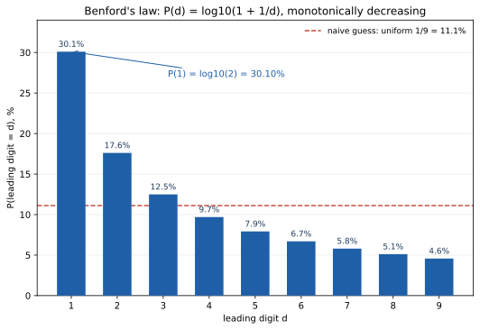

# ch25 — 班佛定律：為什麼開頭是 1 的數字這麼多

> **本章解決什麼問題**：Part VII（隨機、無限與測度：定義塌在暗處）目前為止拆穿了兩句被當成理所當然的話——ch23 拆的是「機率該對哪個樣本空間算」，ch24 拆的是「隨機這個詞在連續空間裡有沒有唯一意思」。這一章拆的是另一句更基本、卻同樣沒人講清楚的話：「一堆數字的第一位數字，出現 1 到 9 的機會應該一樣多」。答案是：只要這堆數字橫跨了好幾個數量級，第一位數字幾乎從不均勻，而是嚴格遵守一條對數分布，這條分布就叫班佛定律（Benford's law）。下一章 ch26（巴拿赫－塔斯基悖論）會把「均勻」「體積」這類詞底下的坑挖到最深——不可測集。

## 從你已知的出發

想像一件很平常的稽核工作：你手上有一份試算表，裡面是某家公司過去一年、好幾千筆的請款金額——有些是 12 元的文具採購，有些是 340,000 元的設備採購。現在有人問你一個聽起來無關痛癢的問題：如果只看每一筆金額的「第一位數字」（也就是把 12 元看成「1」開頭、340,000 元看成「3」開頭，其他位數全部忽略），這幾千個第一位數字裡，開頭是 1 的比例大概會是多少？

多數人心裡會有一個又快又篤定的答案：大約 1/9，也就是 11.1%左右。這個答案的理由聽起來相當紮實——第一位數字只可能是 1 到 9 這九個值當中的一個（不會是 0，因為沒有人會把一個數字寫成 0 開頭），而這九個數字，看起來沒有任何一個比另一個「更容易」出現。1 沒有比 9 特別、9 也沒有比 1 特別，兩者在數學上的地位似乎完全對稱——如果要你解釋「為什麼開頭是 7 的數字會比開頭是 2 的數字少」，你大概答不出來，因為聽起來就沒有理由。既然找不到任何理由讓某個數字比另一個更容易當開頭，最合理的假設，就是九個數字出現的機會均等，這是機率論裡「無差別原則（principle of indifference）」最直覺的一次應用：找不到區分兩個結果的理由，就該給它們相同的機率。

這個推理聽起來無懈可擊，多數受過教育的人被問到這個問題，都會給出 1/9 這個答案，而且相當有把握。

但如果你真的把一堆橫跨多個數量級的真實數字攤開來數——不管是全世界河流的長度、各國城市的人口、股票的收盤價、還是一份真實公司的請款金額——你會發現開頭是 1 的數字，遠遠不只 1/9。真實的比例，接近三成。而且不是巧合、不是某個特定資料集的怪癖，而是幾乎所有「自然生成、橫跨多個數量級」的數字資料，都會呈現同一個模式：開頭是 1 的最多，開頭是 2 的次多，一路遞減到開頭是 9 的最少。這件事第一次被人白紙黑字記錄下來，不是靠統計普查，而是靠一件非常樸素的物理線索：一本書的哪幾頁比較髒。

## 紐康的觀察：對數表被翻爛的那幾頁

1881 年，天文學家暨數學家紐康（Simon Newcomb）在《美國數學期刊》（American Journal of Mathematics）第 4 卷發表了一篇僅僅兩頁的短文，標題是〈論自然數中不同數字使用的頻率〉（Note on the Frequency of Use of the Different Digits in Natural Numbers）。

在那個沒有計算機、沒有計算器的年代，天文學家、工程師要做乘法、除法、開根號這類繁重計算，標準做法是查對數表（logarithm table）——一本厚厚的書，把每個數字對應的對數值事先算好、印出來，查表之後用加減法取代乘除法。紐康注意到一件很奇怪的小事：他和同事手邊那些對數表，前面幾頁（也就是對應「以 1 開頭的數字」的那幾頁）明顯比後面幾頁（對應「以 9 開頭的數字」）又髒又破，書頁邊緣磨損得更嚴重，彷彿被翻閱的次數多了好幾倍。

這是一條純粹的物理線索，卻指向一個統計事實：如果對數表每一頁被翻閱的次數應該一樣多（假設大家查的數字第一位數字均勻分布），那麼每一頁磨損的程度也該差不多。但事實是前面幾頁明顯磨損得更嚴重——這代表大家實際拿去查表、計算的那些數字，開頭是 1、2 這類小數字的頻率，遠高於開頭是 8、9 這類大數字。紐康從這個磨損現象反推回去，寫下了正確的公式與百分比，斷言自然產生的數字裡，開頭數字並不均勻，而是遵守某個遞減的規律。

紐康的這篇短文只有兩頁，發表之後幾乎沒有引起任何迴響，被完全冷落了將近六十年——直到另一個人，用完全不知道紐康這篇短文存在的方式，獨立重新發現了同一件事。

## 班佛的獨立重新發現：跨二十個資料集的實證

1938 年，任職於奇異公司（General Electric）的物理學家班佛（Frank Benford）發表了一篇題為〈反常數字定律〉（The Law of Anomalous Numbers）的論文，刊登在《美國哲學學會會刊》（Proceedings of the American Philosophical Society）第 78 卷。班佛注意到的現象，跟紐康幾乎一模一樣——他手邊那本對數表，前面幾頁也磨損得比後面幾頁嚴重——但班佛沒有止步於這個觀察，他決定動手驗證：這個現象是不是一個真正、普遍存在的統計規律。

班佛蒐集了超過二萬筆來自各種不同來源的真實數字，橫跨大約二十個性質完全不相干的資料集：河流的流域面積、化合物的分子量、各種商品的成本數據、街道的門牌號碼、城市與鄉鎮的人口、物理常數、報紙文章裡出現的數字，甚至還有棒球比賽的統計數字。這些資料集彼此毫無關聯——流域面積跟分子量能有什麼共同點？——但班佛把每一個資料集的第一位數字分布分別統計出來，發現雖然每個單獨資料集跟理論值都有或多或少的落差，一旦把二十個資料集全部混在一起統計，混合後的分布跟同一條對數公式的吻合程度，好得驚人。

班佛因為這篇實證力道遠超紐康那篇短文的論文，讓這個定律以他的名字流傳下來，即使紐康早了他五十七年提出同一個公式——這在科學史上並不罕見：一個定律最終冠上的名字，往往不是最早提出它的人，而是把它做得夠扎實、夠有說服力、讓後人真正開始使用它的人。本章之後仍然沿用「班佛定律」這個通行名稱，但紐康 1881 年的優先權，是這段歷史裡不該被略過的一句話。

## 完整推導：為什麼是對數，不是均勻

現在把「開頭是 1 的比例接近三成」這件事，從一條經驗觀察，變成一個可以從頭推導出來的封閉式。

**先把「第一位數字是 d」翻成數學語言。** 任何一個正數 x，都可以唯一寫成「一個 1 到 10 之間的數字，乘上 10 的某個整數次方」的形式，例如 340,000＝3.4×10⁵，12＝1.2×10¹。取以 10 為底的對數（記作 log₁₀，本書後面簡寫成 log），會得到：

```text
log(x) = log(m) + k　　← m 是 1 到 10 之間的「首位有效數」，k 是整數次方
```

log(m) 一定落在 0 到 1 之間（因為 m 在 1 到 10 之間，log(1)=0、log(10)=1）。把 log(x) 拆成「整數部分 k」加上「小數部分 log(m)」，這個小數部分——log(x) 減掉它的整數部分——之後就稱為 log(x) 的**尾數（mantissa）**，寫作 frac(log(x))，數值範圍固定在 0 到 1 之間（不含 1）。

x 的第一位數字是 d，若且唯若 m 落在 d 到 d+1 之間（比如 m=3.4 時第一位數字是 3，因為 3≤3.4<4）。取對數之後，這等價於：

```text
frac(log(x)) 落在 [log(d), log(d+1)) 這個區間內
```

也就是說，只要知道 frac(log(x)) 這個介於 0 到 1 之間的數字落在哪一段，就能反推出 x 的第一位數字是幾。這一步只是換了一種語言描述同一件事，還沒有用到任何機率假設。

**再問：frac(log(x)) 這個量，它的機率分布長什麼樣子？** 這才是整個推導真正的關鍵一步，答案要靠一個尺度不變（scale invariance）的論證來逼出來。

考慮一批橫跨多個數量級、自然生成的數字——例如以美元計價的各公司市值。如果把這批數字全部換算成歐元（乘上一個固定的匯率常數 c），或是換算成台幣（乘上另一個常數），這批數字「第一位數字的統計分布」照理不應該因為換了計價單位而改變——畢竟公司真正的市值大小，不會因為你用美元還是歐元計價就有本質上的不同，換算單位這件事，純粹只是乘上一個跟資料本身無關的常數。這個「換算單位不該改變第一位數字統計規律」的要求，就是尺度不變性：如果一條統計規律真的反映了「自然生成的數字」這一大類東西共通的性質，而不是恰好挑中某個計量單位造成的巧合，它就必須在乘上任何正的常數 c 之後保持不變。

把這個要求翻譯回對數的語言：x 乘上常數 c，log(x) 就變成 log(c)+log(x)，也就是對 log(x) 整體平移了 log(c) 這個固定量。「尺度不變」翻成對數語言，就變成「frac(log(x)) 這個分布，不管平移多少量，形狀都不能變」——也就是說，frac(log(x)) 必須是一個對任意平移都不變的分布。

而一個定義在 0 到 1 之間（把頭尾接起來想成一個圓圈）、對任意平移都保持不變的機率分布，只有一種可能：均勻分布。這個道理不難想：如果 0 到 1 之間某一段的機率密度比另一段高，隨便挑一個平移量，把密度高的那一段移到密度低的那一段原本的位置，分布就變了，跟「平移不變」這個前提矛盾。唯一不會因為任何平移而改變形狀的分布，就是每一段等長區間機率都相等的均勻分布——這跟一個圓盤如果要「怎麼轉都看起來一樣」，唯一的辦法就是每個角度的密度都相等，是同一套道理（本書只在直覺層次上論證這一點，完整的測度論證明需要更嚴格的工具，這裡不深入）。

**於是**：frac(log(x)) 在 0 到 1 之間均勻分布，而「第一位數字是 d」對應到 frac(log(x)) 落在 [log(d), log(d+1)) 這一段區間內，均勻分布底下，機率就等於這段區間的長度：

```text
P(第一位數字 = d) = log(d+1) − log(d) = log((d+1)/d) = log(1 + 1/d)
```

這就是班佛定律的完整封閉式：**P(d) ＝ log₁₀(1 + 1/d)**。這個推導誠實地說是一個直覺層次的 sketch（略去了「哪些真實過程真的會產生尺度不變的資料」這個更深的問題，那需要更進階的機率工具），但它抓住了整件事的核心邏輯：均勻分布藏在對數的世界裡，不是藏在原本的數字裡。

## 逐一算開：d=1 到 9 的完整機率表

把公式對 d=1 到 9 逐一代入，這是本章的 worked example，每一步算到小數點後兩位，最後驗證加總是否等於 1（100%）。

```text
d=1： log(1+1/1) = log(2)     = 0.30103  → 30.10%
d=2： log(1+1/2) = log(1.5)   = 0.17609  → 17.61%
d=3： log(1+1/3) = log(4/3)   = 0.12494  → 12.49%
d=4： log(1+1/4) = log(1.25)  = 0.09691  →  9.69%
d=5： log(1+1/5) = log(1.2)   = 0.07918  →  7.92%
d=6： log(1+1/6) = log(7/6)   = 0.06695  →  6.69%
d=7： log(1+1/7) = log(8/7)   = 0.05799  →  5.80%
d=8： log(1+1/8) = log(1.125) = 0.05115  →  5.12%
d=9： log(1+1/9) = log(10/9)  = 0.04576  →  4.58%
```

把九個百分比加總：30.10+17.61+12.49+9.69+7.92+6.69+5.80+5.12+4.58＝100.00%，完全對得上（誤差只來自四捨五入）。這個加總不是巧合，而是九個對數項的一個漂亮性質：log(2/1)+log(3/2)+log(4/3)+…+log(10/9)，每一項的分母跟前一項的分子恰好相消（這叫**望遠鏡求和，telescoping sum**），最後只剩下 log(10/1)＝log(10)＝1，也就是 100%。這九個機率一定加總成 1，是這條公式結構上的必然，不需要另外驗證每次都湊巧成立。

一般引用班佛定律時，習慣把數字四捨五入到一位小數：1→30.1%、2→17.6%、3→12.5%、4→9.7%、5→7.9%、6→6.7%、7→5.8%、8→5.1%、9→4.6%，跟本章算出的兩位小數版本互相對得上（只是取捨位數不同）。其中最關鍵的一個數字：**P(第一位數字=1)＝log(2)≈30.10%**，開頭是 1 的機率，幾乎是「均勻分布下 1/9≈11.1%」的三倍，也是九個數字裡最大的一個，跟直覺完全相反地遠遠超過其他任何一個開頭數字。

下圖把這九個機率並排畫出來，跟均勻分布的參考線放在一起比較。



## 適用與不適用：跨數量級是核心條件

班佛定律不是「所有數字資料的萬用規律」，它有清楚的適用邊界，而這個邊界正好呼應前面的推導——尺度不變性這個前提，只有在資料本身橫跨足夠多個數量級、而且沒有人為設定的上下界時，才站得住腳。

**符合條件、班佛定律吻合得很好的例子**：城市人口（從幾百人的小鎮到上千萬人的都會區，橫跨好幾個數量級）、河流流域面積、股票價格、公司財報裡各種科目的金額、物理常數。這些數字有一個共通點：它們是某種自然增長或分布過程的產物，沒有一個「人為設下的」固定範圍，而且橫跨的數量級夠廣——一個城市可能是 800 人，也可能是 2400 萬人，中間橫跨了將近五個數量級。

**不符合條件、班佛定律不適用（或明顯偏離）的例子**：成年人的身高（幾乎全部集中在 140 到 200 公分這一個數量級內，橫跨不到一個數量級，開頭數字幾乎全是 1）、樂透號碼（人為設計的均勻抽樣機制，本來就該是均勻分布，不是自然生成的資料）、依序編列的流水號或員工編號（第一位數字由編號規則決定，不是由某個自然過程決定）。這些例子的共通點是：資料被限制在一個很窄的範圍內，或者資料的產生過程本身不是自然增長、而是人為設計成某種特定分布——尺度不變性這個前提從一開始就不成立。

還有一個容易被誤用的灰色地帶，值得特別點名：**選票計數**。選舉的得票數，理論上聽起來也是「一堆自然產生的數字」，但實際上它受到選區規模、選民登記人數這些人為設定的上下界限制，跟「橫跨多個數量級、沒有人為邊界」這個前提並不吻合，班佛定律在選票資料上的適用性，一直是統計學界公認有爭議、不建議直接套用的案例。

## 查帳應用與一個常被誤傳的法庭案例

班佛定律最廣為人知的實務應用，是法務會計（forensic accounting）——尼格里尼（Mark Nigrini）從 1990 年代開始大力推廣，把它用作偵測財報、報帳紀錄是否有人為竄改的初步篩檢工具：人為捏造的數字（例如虛報請款金額）往往是人腦「隨手掰出來的」，開頭數字的分布通常比真實交易數據更接近均勻，跟班佛定律預測的對數分布出現落差，這個落差就成了進一步稽核的線索。這裡要說清楚一句常被誇大的話：班佛定律測出來的異常，只是「值得進一步調查的訊號」，不是「詐欺已被證明」——真實世界裡有太多合法的理由，會讓某批數字的開頭數字分布偏離對數規律（例如資料本身就落在受限值域裡，前一節已經說明過）。

這個「班佛只標示異常、不是詐欺鐵證」的分寸，在一個真實法庭案件裡，被後續的網路二手文章講得比原始判決更誇張，是本章特別要拆穿的一個案例。案件是 United States v. Channon——被告錢儂夫婦（Matthew and Brandi Channon）因為用假名假地址開立 OfficeMax 的 MaxPerks 會員回饋帳戶詐領商品，被控詐欺。控方在審判中提出了班佛定律的長條圖分析，作為佐證被告試算表數據異常的專家證詞，這份分析在**2015 年 10 月 28 日的地方法院層級 Daubert 聽證**（依聯邦證據規則第 702 條與 Daubert 案建立的專家證詞可採性標準）被裁定為可以採納。

問題出在後續流傳的版本：許多網路文章、部落格會引用「881 F.3d 806（10th Cir. 2018）」這個引註，把它講成「班佛定律證據被法院正式採認的上訴先例」。但如果你真的去讀那份第十巡迴上訴法院在 2018 年就本案作出的上訴意見全文，會發現裡面完全沒有討論班佛定律——那份上訴意見處理的是本案其他上訴爭點，跟班佛定律的可採性毫無關係。真正做出「這份班佛定律分析可以採納」這個裁定的，只是 2015 年那場地方法院層級的 Daubert 聽證，從未被提升到上訴審層級去正式確立成先例。這其實是一個很適合放在本章結尾的示範：連「這個判決是不是先例」這種聽起來應該很客觀的法律事實，都可能被二手轉述層層加工，變成一句聽起來更有分量、卻沒人真正核對過原文的話——跟整本書要拆穿的機制，是同一種病。

## 直覺的陷阱

把整章的錯覺攤開來看：

| 階段 | 發生了什麼 |
|---|---|
| 直覺的自信答案 | 「一堆數字的第一位數字，開頭是 1 到 9 的機會應該一樣多，都是 1/9」——因為找不到任何理由讓某個數字比另一個更容易當開頭 |
| 偷渡的假設 | 把「找不到理由區分九個數字」直接等同於「這九個數字在原始數值的尺度上均勻分布」——卻沒有意識到，真正該均勻分布的，是數字取了對數之後的尾數，不是數字本身 |
| 為什麼聽起來理所當然 | 無差別原則在離散、有限的情境裡（丟骰子、抽牌）幾乎從不出錯，因為那些情境裡本來就沒有一個「數量級」的概念可以偷偷產生偏斜；把同一套直覺搬到「橫跨多個數量級的數字」這種全新情境，卻沒發現這裡多了一層對數結構，均勻分布藏在你沒看到的那一層裡 |
| 在哪一步被帶溝裡 | 錯誤發生在「假設每個開頭數字地位對稱」這一步——這句話對「取了對數之後的尾數」是對的，對「原始數字的開頭數字」卻是錯的，兩者中間隔著一個對數轉換，這個轉換不是線性的，它把小數字所佔的區間拉長、把大數字所佔的區間壓縮 |
| 怎麼自我察覺 | 遇到「一堆自然數字的某個統計特徵應該均勻」這類直覺時，先問一句：這堆數字橫跨了幾個數量級？如果橫跨了不少數量級、又沒有人為設下的上下界，就該提高警覺——均勻分布很可能只是看起來理所當然，實際上藏在對數尺度裡才成立 |

> **那句沒說出口的話是**：你以為「一堆自然數字的第一位數字，九個候選值沒有理由偏袒任何一個，所以該均勻分布」；其實橫跨多個數量級、沒有人為邊界的自然資料具有尺度不變性——換算單位不該改變統計規律——而這條要求逼出的，是數字取對數之後尾數的均勻分布，不是原始開頭數字本身的均勻分布，兩者換算回來就是那條單調遞減的對數曲線，開頭是 1 的機率接近三成，是開頭是 9 的六倍還多。

## 紙上推演

**練習 1（★，10 分鐘）**：正文用「望遠鏡求和」解釋了為什麼 d=1 到 9 的九個機率加總必定等於 1。請把 log(2/1)+log(3/2)+log(4/3)+…+log(10/9) 這串加總，逐項寫開、標出哪些項互相抵消，最後說明為什麼結果剛好是 log(10)。

**練習 2（★★，15 分鐘）**：算出「第一位數字落在 1、2、3 之中（也就是 d≤3）」的機率。用正文的公式，說明為什麼這個機率會等於 log(4)，並算出它的百分比數值，跟均勻分布下「d≤3」應有的 3/9≈33.3%做比較。

**練習 3（★★，15 分鐘）**：假設有一位審查主管，看到某公司一整年的請款金額試算表，用班佛定律測出「開頭是 1 的請款金額只有 18%，明顯低於理論值 30.10%」，就直接下結論「這份試算表一定有人為造假」。用正文「適用與不適用」與「查帳應用」兩節的內容，指出這個結論至少可能忽略了哪兩件事，讓這個推論不成立。

**練習 4（★★★，20 分鐘）**：正文只推導了「第一位數字」的分布。試著把同一套「尺度不變 → frac(log(x)) 均勻」的論證，延伸到「前兩位數字組成的兩位數 D」（D 從 10 到 99，例如 340,000 的前兩位數是 34）。寫出 P(前兩位數字＝D) 的封閉式，並代入 D=10，算出它的百分比數值。

### 推演解答

**練習 1 解答**：把加總逐項寫開：

```text
log(2/1) + log(3/2) + log(4/3) + log(5/4) + log(6/5)
  + log(7/6) + log(8/7) + log(9/8) + log(10/9)
```

利用「log(a/b) = log(a) − log(b)」把每一項拆開：

```text
[log2−log1] + [log3−log2] + [log4−log3] + [log5−log4] + [log6−log5]
  + [log7−log6] + [log8−log7] + [log9−log8] + [log10−log9]
```

把括號拿掉重新排列，會發現除了最前面的 −log1 跟最後面的 log10，中間每一項都出現兩次、正負號相反、恰好抵消：−log2 跟 +log2 抵消、−log3 跟 +log3 抵消，一路抵消到 −log9 跟 +log9。最後只剩下 log10 − log1 ＝ log10 − 0 ＝ log10 ＝ 1（因為 log₁₀10＝1）。這正是「望遠鏡求和」這個名字的由來——像一支望遠鏡的鏡筒收合起來，中間的節全部滑進彼此裡面，只留下最外面兩端。九個機率加總必定是 1，是這個代數結構決定的，不是每次計算湊巧算出來的巧合。

**練習 2 解答**：P(d≤3) ＝ P(d=1)+P(d=2)+P(d=3)。用正文望遠鏡的邏輯，這其實也可以直接用區間長度算：d≤3 對應到 frac(log(x)) 落在 [log(1), log(4)) 這一段（因為 d=1 的區間左端點是 log(1)=0，d=3 的區間右端點是 log(4)），所以：

```text
P(d ≤ 3) = log(4) − log(1) = log(4) − 0 = log(4) ≈ 0.60206 → 60.21%
```

也可以用正文表格直接加總驗證：30.10%+17.61%+12.49%＝60.20%（誤差來自四捨五入，跟 log(4)≈60.21%對得上）。這個數字相當驚人：光是開頭數字 1、2、3 這三個，就佔了超過六成的比例，遠遠超過均勻分布下「3/9≈33.3%」的預期——這也再次凸顯真實分布把機率大量向小數字傾斜的程度。

**練習 3 解答**：這位主管的推論至少忽略了兩件事。第一，正文「適用與不適用」一節說明過，班佛定律只在資料「橫跨多個數量級、沒有人為上下界」時才站得住腳——如果這家公司的請款金額本身因為公司規模、採購類別的限制，集中在某個較窄的範圍內（例如大多數請款都落在幾千到幾萬元之間，沒有橫跨太多數量級），那麼即使資料完全真實、沒有任何造假，第一位數字的分布本來就可能偏離班佛定律的理論值，偏離本身不能單獨當成造假的證據。第二，正文「查帳應用」一節明確說過，班佛定律測出的異常，只是「值得進一步調查的訊號」，不是「詐欺已被證明」——就算資料確實橫跨足夠多數量級、理論上該吻合班佛定律，一次偏離也可能來自其他合法原因（例如某類特定商品的固定報價、四捨五入規則、資料蒐集方式的偏誤），要下「一定造假」這麼強的結論，需要排除這些替代解釋、搭配其他證據，不能只靠一張班佛定律的長條圖。

**練習 4 解答**：把正文的推導原封不動地延伸：「前兩位數字組成兩位數 D」（D 從 10 到 99）對應到 x 的首位有效數 m 落在 D/10 到 (D+1)/10 之間（例如 D=34 對應 m 落在 3.4 到 3.5 之間），取對數之後，frac(log(x)) 落在 [log(D/10), log((D+1)/10)) 這段區間。均勻分布下，機率等於區間長度：

```text
P(前兩位數字 = D) = log((D+1)/10) − log(D/10) = log((D+1)/D) = log(1 + 1/D)
```

有趣的是，這個式子跟正文單一位數字的公式，形式上一模一樣，只是把 d 換成了 D，這正是尺度不變性推導自然延伸出的結果——不管你關心的是第一位數字還是前兩位數字，本質上都是同一套「frac(log(x)) 均勻分布」在切不同長度的區間。代入 D=10：

```text
P(前兩位數字 = 10) = log(1 + 1/10) = log(1.1) ≈ 0.04139 → 4.14%
```

也就是說，一個橫跨多個數量級的自然資料集裡，前兩位數恰好是「10」（例如 1000 到 1099 之間、或 10.0 到 10.99 之間）的比例，理論上約為 4.14%——比均勻分布下「1/90≈1.11%」高出不少，同樣延續了「小數字組合更容易出現」這個模式。

## 自我檢核

1. 為什麼多數人第一直覺會覺得第一位數字應該均勻分布在 1 到 9 之間？這個直覺用的是哪一條機率論原則，這條原則在哪些情境下通常沒問題？
2. 「frac(log(x)) 均勻分布」跟「x 的第一位數字均勻分布」，這兩句話為什麼不能互相替換？中間隔著哪一個關鍵的數學轉換？
3. 為什麼「橫跨多個數量級」是班佛定律成立的必要條件？舉一個橫跨數量級不足、因此不適用的真實例子，說明理由。
4. 紐康 1881 年的觀察，跟班佛 1938 年的研究，兩者在「發現方式」與「後續影響力」上分別做了什麼不同的事，導致這條定律最後冠上班佛的名字而不是紐康的名字？
5. 為什麼「班佛定律測出某批數字有異常」不能直接當成「這批數字一定造假」的證據？請試著舉出至少一種合法、但會讓分布偏離班佛定律的情境。
6. United States v. Channon 這個案例裡，哪一個具體的法律事實（哪一個層級的法院、哪一天的裁定）才是真正做出「班佛定律證據可採納」這個判斷的，跟網路上常被引用的「881 F.3d 806（10th Cir. 2018）」這個引註，兩者的差別是什麼？
7. 這個悖論那句沒說出口的假設是什麼？試著不看課文，用自己的話重講一次。
8. 比較這一章跟 ch24（貝特朗弦悖論）：兩章都在講「均勻分布」這個詞在連續、無限的情境下沒有唯一意思，但兩者「均勻該對什麼東西均勻」這個問題的答案分別是什麼？

## 延伸閱讀

- Simon Newcomb,〈Note on the Frequency of Use of the Different Digits in Natural Numbers〉，《American Journal of Mathematics》4(1), 1881——本章「對數表被翻爛的那幾頁」這個故事的原始出處，兩頁的短文，可以直接讀完。<https://pdodds.w3.uvm.edu/files/papers/others/1881/newcomb1881a.pdf>
- Frank Benford,〈The Law of Anomalous Numbers〉，《Proceedings of the American Philosophical Society》78(4), 1938——本章「跨二十個資料集」實證的原始論文，收錄了他當年蒐集的完整資料表。<http://pdodds.w3.uvm.edu/research/papers/others/1938/benford1938a.pdf>
- 〈Benford's law〉，Wikipedia——總覽條目，收錄公式推導的多種版本、應用範圍與常見誤用案例，適合作為本章計算的交叉核對。<https://en.wikipedia.org/wiki/Benford%27s_law>
- United States v. Channon（Matthew），No. 16-2254（10th Cir. 2018），Justia 全文——本章討論的常被誤引案例，讀者可以自行讀完全文，驗證這份上訴意見確實沒有討論班佛定律，跟坊間流傳的說法對照。<https://law.justia.com/cases/federal/appellate-courts/ca10/16-2254/16-2254-2018-01-31.html>
- Mark J. Nigrini,《Benford's Law: Applications for Forensic Accounting, Auditing, and Fraud Detection》，Wiley——本章「查帳應用」一節提到的推廣者本人所著的專書，完整說明班佛定律在稽核實務上該怎麼用、不該怎麼用（未驗證全書逐頁內容，但作者與出版社均為法務會計領域公認來源）。
