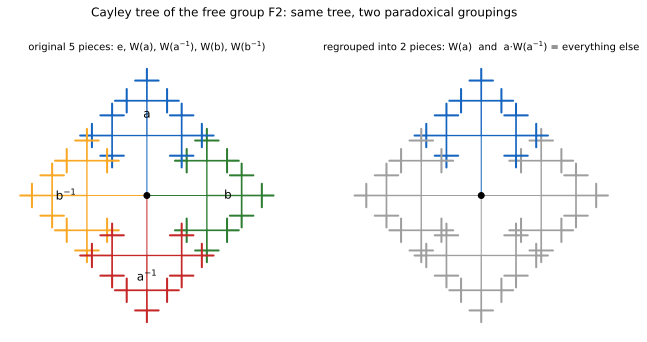

# ch26 — 巴拿赫–塔斯基悖論：一顆球切成兩顆一樣的球

> **本章解決什麼問題**：這是 Part VII（隨機、無限與測度：定義塌在暗處）的最後一章，也是全書進入收官（見 ch27）前，挖得最深的一個坑。ch23（睡美人問題）拆穿的是「機率該對哪個樣本空間算」沒有共識；ch24（貝特朗弦悖論）拆穿的是「隨機」這個詞在連續空間裡沒有唯一定義；這一章要拆穿的，是比這兩者都更底層的一句預設——「每一個集合都有一個良定義的體積」。巴拿赫（Stefan Banach）與塔斯基（Alfred Tarski）在 1924 年證明：一顆實心球可以切成有限塊，只靠旋轉與平移重新組裝，就能拼出兩顆跟原本一模一樣大的球。這不是物理魔術，也不是證明哪一步算錯了；讀完這一章，你會看到「體積」這個聽起來理所當然的概念，在某些集合上根本沒有被定義——這是全書「沒說出口的那句話」這套解剖法，能挖到的最深、最違反直覺的一層。

## 從你已知的出發

1924 年，兩位當時都在波蘭學術圈活動的數學家——巴拿赫與塔斯基——在期刊《Fundamenta Mathematicae》第 6 卷發表了一篇論文，標題直白到近乎挑釁：《論點集合分解為分別全等的部分》（Sur la décomposition des ensembles de points en parties respectivement congruentes，頁 244 至 277）。論文的核心結論，放到今天讀起來依然像個惡作劇：一顆實心的球，可以切成有限多塊碎片，光是把這些碎片搬動、旋轉（不許壓扁、不許拉伸、不許加料、不許減料），重新組裝起來，就能拼出**兩顆**跟原本那顆球一模一樣大小的實心球。這篇論文建立在德國數學家豪斯多夫（Felix Hausdorff）1914 年一項更早的發現之上，後面會回頭談這段接力。

先把讀者心裡此刻冒出的第一個念頭老實寫下來：這不可能是真的，因為它違反最基本的「東西不會憑空變多」的常識。這個常識背後其實有一個相當堅實的靠山——如果把問題換成二維（平面上的多邊形），這個直覺不但正確，還早在十九世紀就被證明成一條嚴謹的定理：波爾約（Farkas Bolyai）與格爾溫（Paul Gerwien）在 1830 年代各自獨立證明了波爾約－格爾溫定理（Bolyai–Gerwien theorem）——任何兩個面積相等的簡單多邊形，都可以切成有限多塊，重新拼裝成另一個。這叫做「剪拼相等」（scissors congruence）。這條定理的精神，剛好呼應直覺所期待的那種世界觀：面積是切拼之下的不變量，你絕對沒辦法把一塊面積為一的正方形切一切、搬一搬，變出兩塊面積為一的正方形。

於是讀者很自然地把這條二維的直覺，原封不動地搬到三維的體積上：一顆半徑 R 的球，體積固定是 (4/3)πR³，不管切成幾塊、怎麼旋轉搬移，總體積這個數字，理應跟守恆定律一樣不可侵犯——這正是巴拿赫與塔斯基那篇論文，故意要推翻的那個「聽起來理所當然」的答案。

而且他們的定理裡有兩個限制條件，讀者這時候心裡的辯護會更加篤定：第一，切的塊數是**有限的**——不是無窮多塊，也不是切成什麼「霧狀」的連續介質。讀者可能會想：如果允許切成無窮多塊，那還有什麼好意外的，無窮小的東西本來就可以憑空搬弄；但巴拿赫－塔斯基定理明明白白地說，有限塊就夠了。第二，重組時允許的操作只有**剛體運動**（rigid motion）——旋轉與平移，不准做任何會改變形狀或大小的變形，甚至連鏡射都用不上。碎片本身的形狀，在搬動前後完全沒有改變，改變的只有它們在空間裡的擺放位置。這樣「保守」的操作，怎麼可能讓體積這種東西憑空加倍？

這正是接下來要拆穿的：故事的關鍵，不在於證明的哪一步算錯了——沒有任何一步算錯——而在於「一顆球可以被切成有限塊」這句敘述裡，藏了一句誰都沒有明講、卻被每個人都當成理所當然的前提。這一章要做的事，就是把巴拿赫和塔斯基怎麼構造出這些碎片的核心步驟，一步一步攤開來看，然後回頭指出：問題到底出在哪一個字上。

## 定理到底說了什麼

先把定理本身講精確，避免它被以訛傳訛地誇大或簡化。巴拿赫－塔斯基定理陳述的是：三維歐幾里得空間 ℝ³ 裡的一顆實心球 B，存在一種把 B 切成**有限個**（不多不少，是一個確定的自然數）互不相交的碎片 P₁, P₂, ..., Pₙ 的方法，使得只用剛體運動（旋轉加平移）分別搬動這 n 塊碎片、重新組裝，可以拼出**兩顆**分別跟 B **全等**（congruent，形狀、大小完全相同）的實心球。注意這裡的用詞：不是「兩顆比較小的球」，也不是「一顆體積加倍的球」，而是貨真價實的**兩顆**，每一顆都跟原本那顆球一樣大。這件事對任何維度 ≥3 的歐幾里得空間都成立，本章聚焦在最直觀的三維情形。

值得一提（但本章不深入推導）的是，這個結果還能再推得更誇張：任何兩個「有界（bounded，可以被裝進一個足夠大的球裡）且內部非空」的三維集合，不管形狀差多遠、體積差多懸殊，都可以用有限塊碎片、剛體運動互相拼裝出來——坊間常用「一顆豌豆理論上可以切成有限塊、重組成跟太陽一樣大的實心球」這句誇張的比喻來描述它。這個推論跟「一顆球變兩顆球」共用同一套機制，本章不重複推導。

回到本章的核心版本——一顆球變兩顆一樣大的球。這個定理最違反直覺的地方，不是「體積」這兩個字本身有什麼問題，而是：這個定理的存在性證明，完全依賴選擇公理（Axiom of Choice，本章後段會精確講清楚需要哪一種選擇），因此它**沒有給出**任何一種可以實際畫出來、描述出來的切法。碎片存在，但沒有人（也不可能有人）具體寫得出它們的形狀。這件事本身就是一個重要的線索：一個東西的存在性可以被證明，卻同時無法被構造出來——這正是接下來要揭曉的關鍵。

## 為什麼不是變出物質：碎片不可測

先把讀者可能浮現的第一個誤解排除掉：這個定理跟物理世界的物質守恆、能量守恆完全無關，也沒有推翻它們。真正發生的事情是：巴拿赫－塔斯基定理裡切出來的那些碎片，是**不可測集**（non-measurable set）——它們並不是「體積算出來是零」的怪異薄片，也不是「體積算出來是無窮大」的龐然大物，而是「體積」（更精確地說是勒貝格測度，Lebesgue measure）這個概念，對它們**根本沒有被定義**。這句話值得停下來想清楚：一個集合可以形狀複雜、卻依然有明確的體積（例如碎形，只要夠規則，通常還是可測的）；但巴拿赫－塔斯基用到的碎片，複雜到連「有沒有體積」這個問題本身都問不出一個答案。

要看清楚為什麼「碎片必須不可測」不是可有可無的技術細節，而是這個定理成立的**必要條件**，可以用反證法直接推出矛盾。假設（為了推出矛盾）巴拿赫－塔斯基定理裡切出的每一塊碎片都是勒貝格可測的，各自都有一個明確的體積數值：

```text
假設：碎片 P₁, P₂, ..., Pₙ 都可測，體積各為 v(P₁), ..., v(Pₙ)（可以是 0，但一定是個確定數字）

原球 B 的體積：
  v(B) = v(P₁) + v(P₂) + ... + v(Pₙ)          ← 有限可加性：碎片互不相交、恰好拼滿整顆球

旋轉、平移都保體積：
  v(移動後的 Pᵢ) = v(Pᵢ)                       ← 剛體運動不改變勒貝格測度

把 n 塊碎片分成兩組：G₁ 重組成球 B₁（跟 B 全等）、G₂ 重組成球 B₂（跟 B 全等）
  v(B) = Σ_{P∈G₁} v(P)                          ← G₁ 的碎片恰好拼滿 B₁，體積跟 B 相同
  v(B) = Σ_{P∈G₂} v(P)                          ← G₂ 的碎片恰好拼滿 B₂，體積也跟 B 相同

兩式相加：
  2·v(B) = Σ_{P∈G₁} v(P) + Σ_{P∈G₂} v(P)
         = v(P₁) + v(P₂) + ... + v(Pₙ)          ← G₁、G₂ 合起來就是原本那 n 塊碎片，一個不多一個不少
         = v(B)

所以：2·v(B) = v(B)  ⟹  v(B) = 0

但 v(B) = (4/3)πR³ > 0（R 是原球的半徑，B 是一顆貨真價實、半徑為正的實心球）── 矛盾！
```

矛盾的產生，代表「假設所有碎片都可測」這個前提本身不成立——n 塊碎片裡，至少必須有一塊，體積這個概念對它沒有定義。這不是一個湊巧發生的技術瑕疵，而是這個定理成立的**邏輯必要條件**：如果碎片全部可測，剛才那個推導會強迫體積等於零，跟一顆正常的球矛盾；唯一逃出這個矛盾的辦法，就是至少有一塊碎片脫離「可測」的範圍。

把這件事講白話一點：勒貝格測度（也就是我們日常理解的「體積」）有兩個性質，是它之所以「表現正常」的原因——有限可加性（拼在一起的體積等於各自體積相加）與剛體運動不變性（搬動、旋轉不改變體積）。這兩條性質，對**所有可測集合**都成立，而且互相一致，不會產生矛盾。但勒貝格測度**沒有辦法**被擴展成一個對「ℝ³ 裡每一個子集合」都有定義、又同時保有這兩條性質的東西——選擇公理保證了這種「壞集合」的存在，而巴拿赫和塔斯基的貢獻，正是具體構造出一批這樣的壞集合，而且排列得夠巧妙，讓它們可以被剛體運動重新拼裝出兩份原本的球。

也正因為如此，這個定理跟物理世界完全脫鉤，不是能量或質量守恆被打破，而是一個徹頭徹尾的範疇錯誤（category error）：真實世界裡的固體，是由有限多個原子組成的離散結構，任何真實存在的刀刃，切出來的碎片必然是普通、規則、可測的幾何區域——沒有任何真實操作能把一顆球切成巴拿赫－塔斯基定理所需要的那種碎片，因為那些碎片的存在性依賴選擇公理保證的「非構造式」選擇，不是任何有限步驟、任何物理操作可以產生的東西。這個定理談的，從頭到尾都是抽象點集合與抽象群論的性質，不是關於物質、能量或任何真實可切割對象的陳述。「巴拿赫－塔斯基悖論證明了物理上可以無中生有」是坊間最常見的一種誤讀，破口正落在「碎片」這個詞上——把一個純粹活在測度論、選擇公理與群論裡的抽象存在性結果，錯當成一份物理世界的操作指南。

## 自由群 F₂：一份切四塊，重組出兩份完整的自己

巴拿赫－塔斯基定理最核心的證明步驟，不是直接對著球面或球體動手，而是先在一個更乾淨、更抽象的舞台上，把「一份東西切幾塊、重組成兩份一樣的東西」這件事，先在一個純代數的結構裡做出來——這個舞台叫做自由群（free group），本節接下來的推導，是這整個定理的心臟，不是類比、不是打比方，而是證明本身真正發生的地方。

**自由群 F₂ 是什麼**：取兩個符號 a、b 當作生成元（generator），連同它們的反元素 a⁻¹、b⁻¹（滿足 a·a⁻¹ = a⁻¹·a = e，e 是單位元、代表「什麼都不做」）。F₂ 裡的每一個元素，都可以唯一地寫成一個由 a、a⁻¹、b、b⁻¹ 這四個符號排成一串的**簡化字**（reduced word）——「簡化」的意思是：字裡面不准出現相鄰的一對互為反元素的符號（例如不能出現 a 緊接著 a⁻¹，或 b 緊接著 b⁻¹），因為那樣的一對會直接抵消（等於什麼都沒做，可以刪掉）。舉例來說，ab⁻¹a 是一個合法的簡化字；而 aa⁻¹b 不是簡化字，因為開頭的 a、a⁻¹ 相鄰可以消掉，化簡後其實就只是 b。單位元 e，對應到空字——一個符號都沒有。

「自由」這個詞的意思是：除了「x 挨著 x⁻¹ 會消掉」這一條規則之外，F₂ 裡不存在任何其他關係式——不像一般的旋轉群，兩個旋轉合成幾次之後可能剛好繞回原地；在自由群裡，只要兩個字化簡到底之後不完全一樣，它們就一定代表兩個不同的群元素，沒有任何「意外的巧合」。這條「沒有意外關係」的性質，正是接下來悖論式分解能夠成立的根本原因。

按照每個字的第一個符號，把 F₂ 裡除了單位元 e 之外的所有元素，分成四堆：

```text
W(a)   = 所有以 a 開頭的簡化字     （例如 a、ab、ab⁻¹、aba⁻¹ ...）
W(a⁻¹) = 所有以 a⁻¹ 開頭的簡化字
W(b)   = 所有以 b 開頭的簡化字
W(b⁻¹) = 所有以 b⁻¹ 開頭的簡化字
```

這四堆，加上單位元 {e}，五個集合兩兩不相交（一個字不可能同時以兩個不同符號開頭），合起來剛好是整個 F₂——目前為止，這只是最平常不過的一種分類方式，還沒有任何悖論可言。

悖論在下一步登場：把 W(a⁻¹) 裡的每一個字，最前面都補上一個 a（也就是計算「a 乘上這個字」），會發生什麼事？先用幾個具體例子算算看：

```text
a·(a⁻¹)        = e            ← 開頭的 a、a⁻¹ 相鄰，直接消掉，剩下空字（也就是 e）
a·(a⁻¹b)       = b            ← 消掉開頭那一對之後，剩下 b（屬於 W(b) 那一堆）
a·(a⁻¹b⁻¹a)    = b⁻¹a         ← 消掉開頭那一對之後，剩下 b⁻¹a（屬於 W(b⁻¹) 那一堆）
a·(a⁻¹a⁻¹b)    = a⁻¹b         ← 消掉一對之後，剩下的字仍以 a⁻¹ 開頭（屬於 W(a⁻¹) 那一堆）
```

把這個觀察一般化：取 W(a⁻¹) 裡任何一個字 w，它的第一個符號是 a⁻¹，可以寫成 w = a⁻¹·w'（w' 是拿掉開頭 a⁻¹ 之後剩下的部分，也可能是空字）。因為 w 本身是簡化字，w' 的第一個符號絕不可能是 a（否則 a⁻¹ 後面緊接著 a 會抵消，跟「w 是簡化字」矛盾）——但 w' 的第一個符號可以是 a⁻¹、b、b⁻¹，或者 w' 本身就是空字（這對應 w 恰好就是 a⁻¹ 本身的情形）。於是：

```text
a·w = a·(a⁻¹·w') = w'
```

而 w' 要嘛是空字 e，要嘛第一個符號是 a⁻¹、b 或 b⁻¹——絕不可能以 a 開頭。這代表，把 a 乘到 W(a⁻¹) 裡每一個字的前面，得到的結果集合恰好是：

```text
a·W(a⁻¹) = {e} ∪ W(a⁻¹) ∪ W(b) ∪ W(b⁻¹)
         = 整個 F₂，扣掉 W(a) 那一堆
```

這是整個構造裡最關鍵的一步：把 W(a⁻¹) 這一整堆字，每個都在最前面乘上 a，得到的不是「這堆字的某種變形」，而是「除了 W(a) 之外的所有東西」——單位元 e、W(a⁻¹) 自己、W(b)、W(b⁻¹)，一個不少、也不多。於是整個 F₂ 可以只靠兩塊重新拼出來：

```text
F₂ = W(a)  ⊔  a·W(a⁻¹)
     (原封不動)   (把 W(a⁻¹) 整堆平移一格)
```

這裡的「⊔」代表不相交聯集：W(a) 跟 a·W(a⁻¹) 沒有任何一個字同時屬於兩邊，加起來又剛好是整個 F₂，一個不多、一個不少。

完全對稱地，把上面每一步的 a 換成 b、a⁻¹ 換成 b⁻¹，同樣的論證可以重做一遍（讀者可以在「紙上推演」裡自己驗證），得到另一組拼出整個 F₂ 的兩塊分法：

```text
F₂ = W(b)  ⊔  b·W(b⁻¹)
```

現在把兩件事放在一起看：原本的分類，把 F₂（扣掉單位元 e）分成四堆——W(a)、W(a⁻¹)、W(b)、W(b⁻¹)。只用其中兩堆——W(a) 跟 W(a⁻¹)，經過「W(a) 原封不動、W(a⁻¹) 整堆平移」——就重組出一份完整的 F₂；再用另外兩堆——W(b) 跟 W(b⁻¹)，經過同樣的手法，又重組出另一份完整的 F₂。四堆字，從頭到尾沒有被複製，也沒有被加料，只是「搬了個位置」，卻拼出了**兩份**跟原本一樣完整的群。

這就是自由群 F₂ 的「悖論式分解」（paradoxical decomposition）：存在一種把 F₂ 切成有限塊、只用群自身的乘法重新拼裝，就能拼出兩份跟原來一樣的 F₂。再次強調：這一步不是拿來幫助讀者理解的類比，它就是巴拿赫－塔斯基定理最核心的證明步驟本身——接下來要做的所有事，都是把這個純代數的把戲，原封不動地搬到旋轉群與實心球上，把「乘法」換成「旋轉」，把「F₂ 裡的字」換成「球面上的點」。

下面這張圖把整個構造畫在 F₂ 的凱萊樹（Cayley tree，把群元素當節點、把生成元的乘法當邊畫出來的圖）上：左圖是原本依第一個符號分出的五堆——e、W(a)、W(a⁻¹)、W(b)、W(b⁻¹)；右圖把同一棵樹重新只塗兩種顏色——藍色是原封不動的 W(a)，灰色是「其餘全部」，也就是 a·W(a⁻¹)。兩張圖畫的是完全同一棵樹，差別只在於怎麼分組，這正是悖論式分解「沒有任何東西被複製、只是重新分組」的視覺版本。



## 從字的世界搬到球面：SO(3) 裡藏著一個自由群

上一節在純代數的世界裡，已經把「悖論式分解」這件事做出來了。接下來的問題是：F₂ 那套「乘法把一堆字搬到另一堆字」的把戲，怎麼變成「旋轉把球面上一批點搬到另一批點」？答案在於：三維空間裡所有旋轉組成的群——記作 SO(3)（三維特殊正交群，直觀理解就是「所有繞著某條通過球心的軸轉某個角度」這種操作全部收集起來組成的群）——裡面，藏著一個跟 F₂ 一模一樣（數學上稱為「同構」）的子群。

具體怎麼找到這樣兩個旋轉？取兩個旋轉 A、B：A 是繞 z 軸旋轉角度 θ = arccos(1/3)，B 是繞 x 軸旋轉同樣的角度（arccos(1/3) 是一個無理數角度，換算成角度大約 70.53 度）。可以證明——這是一個標準結果，完整推導需要一點矩陣代數與數論，核心手法是把每個旋轉寫成含有分母是 3 的某次方的矩陣，證明任何非平凡的簡化字對應的矩陣都不可能剛好等於單位矩陣——由 A、B 生成的子群，在 SO(3) 裡是自由的、秩為 2，跟上一節的自由群 F₂ 完全同構：任何一個非平凡的簡化字，對應到的旋轉組合都不是單位旋轉，沒有任何「意外繞回原地」的巧合。這一段的完整證明本章不重複，屬於 sketch 層級，有興趣的讀者可以參考延伸閱讀裡的原始文獻。

有了這個嵌入，前一節在 F₂ 上做的悖論式分解，就可以逐字逐句「翻譯」到球面上：把球面上除了少數幾個特殊點之外的每一個點，按照它在這個自由群作用下的**軌道**（orbit，一個點反覆被 A、B 及其反旋轉作用後，能到達的所有點組成的集合）分組，每個軌道裡選一個代表點（這一步用到選擇公理，後面會專門講），然後仿照 W(a)、W(a⁻¹)、W(b)、W(b⁻¹) 的分法，把整個球面切成對應的四堆加上一個特殊點集合，再用旋轉 A、B 把它們重組成兩份完整的球面。

這裡也順便回答一個自然會冒出的問題：這個悖論為什麼只在三維（或更高維）成立，不會發生在二維的圓盤或圓周上？答案跟群的一個基本性質有關：二維裡的旋轉群 SO(2)（平面上繞圓心旋轉的所有操作）是**阿貝爾群**（abelian group，任兩個元素的乘積跟順序無關，先轉 30 度再轉 45 度，跟先轉 45 度再轉 30 度，結果一樣）。任何阿貝爾群的子群也必然是阿貝爾群，而自由群 F₂ 本質上是**非阿貝爾**的（ab 跟 ba 是兩個不同的字，代表兩個不同的元素）——所以 F₂ 這種秩為 2 的自由群，根本沒有辦法塞進 SO(2) 裡。這正是巴拿赫在 1923 年（比巴拿赫－塔斯基那篇論文還早一年）證明的一件事：在一維（直線）與二維（平面）裡，確實存在一種有限可加、且對剛體運動保持不變的測度，可以定義在**每一個**子集合上（這種測度後來被稱為「巴拿赫測度」，Banach measure）——換句話說，二維（或一維）的世界裡，不存在任何形式的巴拿赫－塔斯基式悖論，因為 SO(2) 這個群本身太「溫馴」（阿貝爾），塞不進任何秩 ≥2 的自由群。三維以上的旋轉群 SO(3)、SO(4) …… 都是非阿貝爾群，而且都能找到像 A、B 這樣的一對旋轉生成自由子群，這正是維度 ≥3 這個門檻的真正來源——不是巴拿赫和塔斯基剛好只證明了三維，而是三維（或更高維）的旋轉群，結構上就是比二維的旋轉群「野」得多。

## 從球面到實心球：豪斯多夫 1914、巴拿赫－塔斯基 1924，以及最少幾片

把悖論式分解從自由群搬到球面，最早不是巴拿赫和塔斯基做的，而是德國數學家豪斯多夫（Felix Hausdorff）——巴拿赫－塔斯基定理站在他 1914 年的一項發現之上（發表於《數學年刊》，Mathematische Annalen，同年也收錄進他的著作《集合論綱要》，Grundzüge der Mengenlehre）。豪斯多夫證明：把單位球面 S²（半徑為 1 的球的表面）扣掉一個**可數**的點集合 D 之後，剩下的部分可以切成三塊 A、B、C，使得 A、B、C 兩兩全等（都可以靠旋轉互相變成彼此），而且 A 本身又跟 B∪C 全等。精神跟前面 F₂ 的悖論式分解完全一致——只是把「乘法作用在字上」換成「旋轉作用在球面上的點」。

豪斯多夫的版本有一個附帶條件：必須先挖掉一個可數的「壞點」集合 D。這些壞點是什麼？在把 F₂ 嵌入 SO(3) 之後，這個自由群裡每一個非單位元素（也就是每一個旋轉，除了「什麼都不轉」之外）在球面上都恰好有兩個不動點（fixed point，繞著該旋轉的軸與球面的兩個交點，旋轉軸上的點自然不會被這個旋轉移動）。因為這個自由群本身是可數的（可數多個字），所以整個群裡所有旋轉的不動點加起來，也只有可數多個——這就是 D。挖掉 D 之後剩下的點，每一個都有一個乾淨的、沒有被自己的軌道「纏住」的軌道結構，可以照著 F₂ 的辦法整齊分類。

巴拿赫和塔斯基 1924 年的貢獻，是把豪斯多夫的結果再往前推兩步。第一步，把「挖掉可數點集合」這個附帶條件去掉：由於 D 只有可數多個點，而球面上所有旋轉軸的方向有不可數多個，總能找到一個旋轉 ρ，讓 D、ρ(D)、ρ²(D)、ρ³(D) …… 這一整串集合彼此兩兩不相交（這一步同樣仰賴選擇公理挑出這樣一個 ρ）。把 D 裡每一個點，沿著這一串位置往後挪一格，就在「整個球面」跟「球面扣掉 D」之間建立了一個一一對應——D 這批可數的壞點，可以被「吸收」進球面剩下的部分裡，不影響整體的悖論式分解。第二步，把結果從球的**表面**延伸到**實心**的球體：把整顆實心球（扣掉球心）想成一疊疊同心球面，半徑從趨近於零一路排到 R，每一層球面各自套用同一組旋轉做悖論式分解，就把整顆實心球（扣掉球心）也悖論式地分解掉了。

球心本身呢？球心是一個單獨的點，任何一個繞著通過球心的軸的旋轉，都會讓球心留在原地不動（球心永遠是自己的不動點）——這代表球心沒有辦法用前面那套「靠旋轉把一堆點搬到另一堆點」的技巧來處理，它必須被當成**額外獨立的一塊**，用另一種方式安置到兩顆輸出球的其中一顆裡。這正是為什麼球的悖論式分解，比球面（或扣掉球心的實心球）多需要一塊碎片。

美國數學家羅賓森（R. M. Robinson）在 1947 年的論文《論球面的分解》（On the Decomposition of Spheres，《Fundamenta Mathematicae》第 34 卷，頁 246 至 260）把這個「最少需要幾塊碎片」的問題徹底解決：只要不管球心，四塊就夠；但如果連球心也要一併搬到某一顆輸出球裡，就必須用上第五塊，而且五塊是砍不掉的下限——羅賓森同時證明了「五塊足夠」與「少於五塊不可能」兩件事。這也是為什麼精確陳述這個定理時，會說「最少五片」（本章開頭陳述定理時刻意迴避了具體片數，這裡補齊）：這個數字不是一個隨口估計，而是一個被證明過的精確下界。

## 選擇公理的角色：不是全部的選擇公理

整個構造裡，選擇公理（Axiom of Choice，簡稱 AC）究竟用在哪一步、又用到了「多少」選擇公理，是這個定理最容易被寫錯、也最值得講精確的地方。

用到選擇的地方，具體來說是這一步：把球面（扣掉可數壞點之後）按照自由群的軌道分組，每一個軌道裡都要挑出恰好一個代表點，重新組成前面說的 W(a)、W(a⁻¹)、W(b)、W(b⁻¹) 這幾堆。問題是：這樣的軌道有**不可數多個**，而且沒有任何一條公式、任何一種演算法可以「批次地」指定「每個軌道該選哪一個點」——選擇公理正是那條允許「同時對不可數多個非空集合，各自挑出一個元素，不需要交代具體挑法」的公理。

那麼，這個定理精確需要「多強」的選擇原則？先確定一個下界：光靠標準分析裡常用的相依選擇公理（Dependent Choice，簡稱 DC，一種比完整選擇公理弱、卻足以支撐微積分與實數分析大部分日常結論的較弱選擇原則）是不夠的。美國數學家索洛維（Robert Solovay）在 1970 年構造了一個模型：假設存在一個不可及基數（inaccessible cardinal，集合論裡的一種大基數假設），就存在一個滿足 ZF 加上 DC、卻讓**每一個**實數集合都是勒貝格可測的模型。在這樣的模型裡，巴拿赫－塔斯基定理所需要的不可測碎片根本不存在，定理因此不成立——這證明 DC 不足以推出巴拿赫－塔斯基定理，它確實需要**超出 DC** 的某種更強選擇原則。

但另一方面，這個定理也**不需要完整的選擇公理**。波蘭數理邏輯學家帕夫利科夫斯基（Janusz Pawlikowski）在 1991 年證明：只要在 ZF 集合論的基礎上，加上泛函分析裡的哈恩－巴拿赫定理（Hahn–Banach theorem，一條關於線性泛函延拓的定理，日常分析、最佳化理論裡經常用到），就足以推出巴拿赫－塔斯基定理。而哈恩－巴拿赫定理本身，嚴格弱於完整的選擇公理——它比布林質理想定理（Boolean Prime Ideal theorem，一條介於 DC 與完整 AC 之間的中等強度選擇原則）還要弱，而且不蘊含完整的選擇公理。

把這三條原則按強度排起來，精確的位置是：

```text
DC（相依選擇）  <  哈恩－巴拿赫定理（Pawlikowski 1991 證明這已足夠推出 B-T）  <  完整選擇公理 AC
      ↑ 不夠：Solovay 1970 模型裡 DC 成立、B-T 不成立
```

所以精確的講法應該是：巴拿赫－塔斯基定理需要**超出 DC 的某種選擇原則**，但**不需要完整的選擇公理**——哈恩－巴拿赫這個強度的原則就已足夠。「巴拿赫－塔斯基定理等價於選擇公理」，或「完整選擇公理是這個定理的最小需求」，都是常見卻不精確的說法：定理只用到了選擇公理的**一部分力量**，而選擇公理本身能推出的東西，遠遠不只巴拿赫－塔斯基定理這一項。

## 直覺的陷阱

把整章的錯覺攤開來看：

| 階段 | 發生了什麼 |
|---|---|
| 直覺的自信答案 | 「有限塊碎片＋剛體運動」聽起來是最保守、最不可能製造出額外物質的操作，體積守恆就跟二維的剪拼相等定理一樣，理應是切拼下不可侵犯的不變量 |
| 偷渡的假設 | 把「每一個集合都有良定義的體積」當成理所當然——彷彿勒貝格測度可以毫無例外地延伸到 ℝ³ 裡的每一個子集合上，而且延伸之後還能同時保有有限可加性與剛體運動不變性 |
| 為什麼聽起來理所當然 | 日常經驗裡遇到的所有形狀——多邊形、球、任何規則或不規則但「畫得出來」的圖形——全部都是可測的，體積這個概念對它們從來沒有失效過，讀者沒有理由懷疑會有集合連體積都定義不了 |
| 在哪一步被帶溝裡 | 選擇公理保證存在一種「非構造式」的挑選方式，能挑出恰好足以拼出悖論式分解的碎片；這些碎片天生就不可能可測（前面 V=2V 的反證已經證明這一點），而「不可測」這件事，恰好就是體積這個概念定義域的邊界，超出這條邊界，「體積」兩個字根本沒有意義可言 |
| 怎麼自我察覺 | 遇到任何「靠選擇公理構造出來、卻沒有具體構造方法」的集合時，先停下來問一句：這個集合有沒有被證明是可測的？如果答案是「無法證明可測」甚至「可以證明不可測」，就代表日常對「大小」「體積」「機率」的直覺，在這裡已經失去了適用的資格 |

> **那句沒說出口的話是**：你以為「每一個空間裡的集合都可以被賦予一個體積，而且體積在你怎麼切、怎麼搬動之後都該老實相加、守恆不變」；其實勒貝格測度這套「體積」的定義，從來就只對可測集合成立——選擇公理容許構造出來的那些碎片，恰好精心避開了可測的範圍，體積這個概念對它們不是算出零、也不是算出無窮大，而是根本沒有被定義，所以「切拼不改變總體積」這條你以為放諸四海皆準的守恆定律，其實一直都附帶著一個從沒被說出口的條件：僅限可測集合。

## 紙上推演

**練習 1（★，10 分鐘）**：仿照正文對 W(a⁻¹) 的推導，把角色換成 b：證明 F₂ = W(b) ⊔ b·W(b⁻¹)，並具體舉出三個屬於 W(b⁻¹) 的字，各自算出「b 乘上這個字」化簡後的結果，驗證它們都落在 {e}∪W(a)∪W(a⁻¹)∪W(b⁻¹) 裡（也就是整個 F₂ 扣掉 W(b) 之後剩下的部分）。

**練習 2（★★★，20 分鐘）**：正文用四堆非單位元素的集合 W(a)、W(a⁻¹)、W(b)、W(b⁻¹)，重組出兩份完整的 F₂（一份用 a 那一組、一份用 b 那一組）。假設有人主張：「既然四堆就能重組出兩份完整的 F₂，我們乾脆把單位元 e 也拿出來單獨當第五塊，這樣不是應該能重組出『兩份 F₂ 再加一個額外的 e』，變得更多嗎？」請指出這個論證的破綻——具體說明 e 在 a·W(a⁻¹) 與 b·W(b⁻¹) 這兩個重組結果裡分別扮演了什麼角色，為什麼把 e 單獨切成第五塊反而是多餘的、甚至會讓分法不再是「不相交」。

**練習 3（★★，15 分鐘）**：如果把生成元從兩個（a、b，也就是 F₂）換成三個（a、b、c，也就是自由群 F₃），是不是能做出一樣的「一份切幾塊、重組出兩份」的悖論式分解？請不必詳細推導，只需說明：F₃ 是不是也具備 F₂ 那個關鍵性質（非阿貝爾、沒有意外的關係式）；如果具備，這個悖論式分解的關鍵條件，究竟是「生成元恰好兩個」，還是別的東西？

### 推演解答

**練習 1 解答**：把正文的推導逐字替換 a→b、a⁻¹→b⁻¹（因為 a、b 在自由群的定義裡地位完全對稱，這個替換不會破壞任何一步邏輯）。取 W(b⁻¹) 裡任何一個字 w，可寫成 w = b⁻¹·w'，w' 的第一個符號不可能是 b（否則 w 不是簡化字），只可能是 a、a⁻¹、b⁻¹，或 w' 本身是空字。於是 b·w = b·(b⁻¹·w') = w'，落在 {e}∪W(a)∪W(a⁻¹)∪W(b⁻¹) 裡，這正是整個 F₂ 扣掉 W(b) 之後剩下的部分。具體驗證三個例子：

```text
b·(b⁻¹)      = e        ← 開頭 b、b⁻¹ 消掉，剩下空字
b·(b⁻¹a)     = a        ← 消掉一對之後剩下 a（屬於 W(a)）
b·(b⁻¹a⁻¹b)  = a⁻¹b     ← 消掉一對之後剩下 a⁻¹b（屬於 W(a⁻¹)）
```

三個結果都不以 b 開頭，全部落在「F₂ 扣掉 W(b)」的範圍裡，跟正文對 a 版本驗證的模式完全一致。於是 F₂ = W(b) ⊔ b·W(b⁻¹) 成立。

**練習 2 解答**：這個論證的破綻在於，e 其實已經自動包含在 a·W(a⁻¹) 與 b·W(b⁻¹) 這兩個重組結果裡了——正文算過，a·(a⁻¹) = e，所以 e 就是「a 乘上 W(a⁻¹) 裡的元素 a⁻¹」得到的結果，已經算在 a·W(a⁻¹) 這一塊裡面；同樣地，b·(b⁻¹) = e，e 也已經算在 b·W(b⁻¹) 這一塊裡面。如果再把 e 單獨切出來當作「第五塊」，跟 W(a⁻¹) 放在一起做 a 的平移，會發生的事情是：a·({e}∪W(a⁻¹)) = {a}∪a·W(a⁻¹)，多出了一個 {a}，而 {a} 早就已經是 W(a) 的一部分（W(a) 裡本來就包含 a 這個最短的字）——於是 a 這個元素會同時出現在「原封不動的 W(a)」跟「多算了 e 之後的平移結果」兩邊，破壞了「不相交」這個關鍵要求，讓後續的體積論證（也就是正文那個 V=2V 的反證）失效。正確的做法，就是正文採用的：讓 e 保持在原本五堆分類裡的「單獨一堆」，但重組兩份 F₂ 的時候，完全不需要特別處理它，因為 a·W(a⁻¹) 和 b·W(b⁻¹) 這兩個「平移後」的結果，早就已經自動吸收了 e。

**練習 3 解答**：F₃（由 a、b、c 三個生成元構成的自由群）完全具備 F₂ 那個關鍵性質——非阿貝爾（ab ≠ ba，任何兩個不同生成元的乘積都跟順序有關）、而且沒有任何意外的關係式（每個非平凡簡化字都對應一個獨立不同的元素）。而且更進一步：F₃ 裡其實已經藏有跟 F₂ 同構的子群（例如只用 a、b 這兩個生成元及其反元素構成的所有簡化字，本身就是一個跟 F₂ 一模一樣的子群，c 完全不需要出場）。所以答案是：F₃ 一樣可以做出「一份切幾塊、重組出兩份」的悖論式分解，而且做法可以直接借用 F₂ 那一套（把 c 晾在一邊不動即可）。這說明了關鍵條件並不是「生成元恰好兩個」，而是「這個群裡藏著一個秩至少為 2 的自由（非阿貝爾）子群」——只要具備這個結構性質，不管生成元有兩個、三個，或更多，悖論式分解都會成立；秩為 1 的自由群（也就是無限循環群，只有一個生成元 a、沒有 b）反而做不出這種分解，因為它是阿貝爾群，跟二維旋轉群 SO(2) 一樣「溫馴」。

## 自我檢核

1. 為什麼「有限塊碎片＋只用旋轉平移」重組出兩顆一樣大的球，聽起來違反常識，但巴拿赫－塔斯基定理本身在數學上完全站得住腳，沒有任何一步算錯？
2. 定理裡的碎片是不可測集合，這跟「碎片體積為零」有什麼本質上的不同？為什麼不能說「反正碎片體積都是零，加起來還是零，所以不奇怪」？
3. 正文用反證法推出「如果碎片都可測，就會得到 2·v(B)=v(B)，逼出 v(B)=0 的矛盾」。試著不看課文，自己口頭重講一次這個反證法的每一步。
4. 為什麼這個悖論在二維（平面上的圓盤）不成立，只有維度三以上才成立？跟 SO(2)、SO(3) 這兩個旋轉群的什麼結構性質有關？
5. 選擇公理在這個定理裡扮演的角色，精確地說是什麼？為什麼不能說「巴拿赫－塔斯基定理等價於選擇公理」，也不能說「完整選擇公理是這個定理的最小需求」？
6. 羅賓森 1947 年證明最少要五片碎片，其中「四片」跟「第五片」分別在處理球體的哪一部分？為什麼球心必須被特別對待？
7. 這個悖論那句沒說出口的假設是什麼？試著不看課文，用自己的話重講一次。
8. 如果有人跟你說「巴拿赫－塔斯基悖論證明了物理世界裡可以無中生有」，你會怎麼指出這句話錯在哪一個環節？

## 延伸閱讀

- 〈Banach–Tarski paradox〉，Wikipedia——定理的總覽條目，收錄歷史脈絡、完整證明架構與後續延伸（例如「豌豆變太陽」推論），可作為本章各段落的交叉核對。<https://en.wikipedia.org/wiki/Banach%E2%80%93Tarski_paradox>
- S. Banach, A. Tarski,〈Sur la décomposition des ensembles de points en parties respectivement congruentes〉，《Fundamenta Mathematicae》6, 1924，頁 244 至 277——原始論文，本章定理陳述與歷史細節的一手來源。<https://eudml.org/doc/214280>
- R. M. Robinson,〈On the Decomposition of Spheres〉，《Fundamenta Mathematicae》34, 1947，頁 246 至 260——證明最少五片碎片的原始論文。<https://eudml.org/doc/213130>
- 〈Hausdorff paradox〉，Wikipedia——豪斯多夫 1914 年更早的球面悖論條目，說明它跟巴拿赫－塔斯基定理之間的接力關係。<https://en.wikipedia.org/wiki/Hausdorff_paradox>
- 〈Banach measure〉，Wikipedia——說明巴拿赫 1923 年在一維、二維裡證明的有限可加不變測度，對照本章「為什麼三維以上才會出現悖論」的討論。<https://en.wikipedia.org/wiki/Banach_measure>
- 〈Solovay model〉，Wikipedia——索洛維 1970 年構造的模型條目，本章「DC 不足以推出巴拿赫－塔斯基定理」這一論證的背景資料。<https://en.wikipedia.org/wiki/Solovay_model>
- J. Pawlikowski,〈The Hahn–Banach theorem implies the Banach–Tarski paradox〉，1991——證明哈恩－巴拿赫定理已足以推出巴拿赫－塔斯基定理的原始論文，本章「不需要完整選擇公理」論證的一手依據。<https://eudml.org/doc/211871>
- Stan Wagon,《The Banach–Tarski Paradox》，Cambridge University Press, 1985——公認最完整的專書，收錄自由群嵌入 SO(3) 的完整矩陣證明、羅賓森最少片數證明的細節，本章 sketch 帶過的部分都可以在這裡找到完整版本（未逐頁驗證版次與頁碼，標未驗證，但書本身是這個主題公認的標準參考）。
