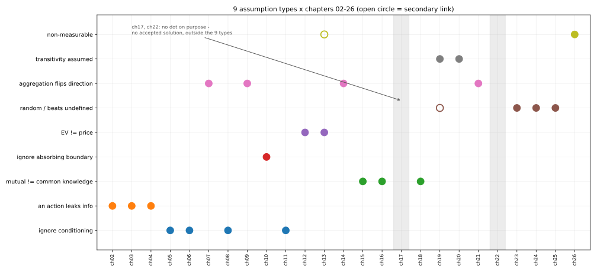

# ch27 — 沒說出口的那句：一張假設類型總表

> **本章解決什麼問題**：這是全書收官的一章，不解任何新悖論。前面二十六章各自留下一句「那句沒說出口的話」；這一章把它們攤在同一張桌上，問一個更大的問題——這二十六句話，到底是二十六種各自獨立的錯，還是少數幾種模式反覆穿著不同的戲服上場？本章交付一張假設類型總表、一份能在書外任何一個反直覺結論上使用的自我提問清單，並逐條回收全書七條主線。讀完本章，你手上會有一套可以帶出這本書的工具，而不只是二十六個聽過的故事。

```text
沒說出口的那句 — 八個部分

  I   解剖學 ────────── ch01 三步解剖：直覺／假設／重建
  │
  II  條件與資訊 ────── ch02 蒙提霍爾 · ch03 三囚犯 · ch04 貝特朗盒子
  │                     ch05 男孩女孩 · ch06 偽陽性
  III 因果聚合計數 ──── ch07 辛普森 · ch08 檢察官謬誤 · ch09 生日問題
  IV  漫步與賭局 ────── ch10 賭徒輸光 · ch11 賭徒謬誤與熱手
  │                     ch12 聖彼得堡 · ch13 兩個信封 · ch14 帕隆多
  V   共同知識 ──────── ch15 紅藍眼睛 · ch16 泥巴小孩
  │                     ch17 意外絞刑 · ch18 兩位將軍
  VI  選擇與集體 ────── ch19 非傳遞骰子 · ch20 孔多塞 · ch21 布雷斯 · ch22 紐康
  VII 隨機與測度 ────── ch23 睡美人 · ch24 貝特朗弦 · ch25 班佛 · ch26 巴拿赫–塔斯基
  VIII 收官 ─────────── ch27 一張假設類型總表   ◄ 你在這裡
```

## 從你已知的出發

在往下讀之前，先自己猜一個數字：讀完前面二十六章，你覺得，這二十六句「沒說出口的話」，骨子裡到底是二十六種各自獨立的假設，還是——把長得像的擺在一起看——其實只有少數幾種模式反覆出現，換了年代、換了主角、換了數字，一次又一次上場？

多數讀者的第一反應是「大概十幾種吧，八個部分（Part），每個部分總該有自己獨特的東西」。這個猜測聽起來很合理——蒙提霍爾的主持人、三囚犯的獄卒、貝特朗盒子的那一面金幣，三個故事的場景完全不像；紅藍眼睛的公開宣告、泥巴小孩的同時作答、兩位將軍的最後一則訊息，三個故事的主角也完全不像。但如果你把「主持人一定會避開藏車的門」「獄卒必須從會被處決者裡不偏不倚挑一個名字」「你看到的那一面金幣是從所有金面均勻抽出來的」這三句話並排放在一起讀，你會發現它們其實是同一句話換了三套服裝：**一個在某條已知規則下被迫做出的動作，本身就是資訊。**

這正是本章要做的事——把巡演的次數一次數完。答案不是二十幾種，是**九種**。這九種模式，會在下一節逐一亮相；每一種都配上二到三個你已經讀過的章節當證人，外加它們各自留下的那個招牌數字。讀完這一節，你應該能把任何一本書裡沒收錄的反直覺結論，套進這九種模式裡的至少一種——這才是這整本書真正想留給你的東西，不是二十六個可以拿去講給別人聽的故事，而是一套可以自己用的偵測器。

## 二十六句話，收成九種模式

下面九種模式，是把前面二十六章「那句沒說出口的話」逐句攤開、按機制而不是按場景重新分組後的結果。每一種先給一句話定義，再配它的證人章節與招牌數字。

### 忽略條件化

**定義**：把一個機率算式套用在錯的條件事件上——要嘛把 P(證據∣某假設) 跟 P(某假設∣證據) 這兩個方向相反的數字直接畫等號，要嘛沒注意到「條件」本身是怎麼被篩選出來的。

- **ch06 偽陽性**：檢測「準」只保證了 P(陽性∣有病)、P(陰性∣沒病) 這兩個方向，卻沒有保證你真正想問的反方向 P(有病∣陽性)。盛行率 1/1000、敏感度＝特異度 99%，代進貝氏定理，答案只有 **9.02%**——這是全書最尖銳的一次「準確率」跟「你想要的機率」之間的落差。
- **ch08 檢察官謬誤**：法庭版的同一個條件反轉。「這種巧合在清白者身上只有百萬分之一」被直接讀成「被告清白的機率只有百萬分之一」，中間隔著一個從未被講出口的先驗機率。
- **ch05 男孩女孩**：「至少一個是男孩」這句話本身是怎麼被篩選出來的沒講清楚——是從所有符合條件的家庭裡隨機挑一戶（答案 1/3），還是挑一戶人家後、隨機指認一個孩子恰好是男孩（答案 1/2）。條件事件本身的定義不清楚，答案就跟著分裂。
- 附帶一提，**ch11 賭徒謬誤與熱手**的修正也屬於這個家族的變體：短序列裡「連中後再中」這個統計量，本身就是對「剛好連中」這件事做條件化，而這個條件化在有限樣本裡會系統性地向下偏——連「用來檢驗獨立性的那把尺」都可能沒條件化乾淨。

### 一個動作洩漏了資訊

**定義**：某人依照一條你原本沒注意到的規則，被迫做出一個動作；那條規則本身，就把資訊灌進了機率分布裡。

- **ch02 蒙提霍爾**：主持人知情，且規則保證他一定避開藏車的門、也一定避開你選的門——這個「一定會避開」把原本壓在另外兩扇門上、合計 2/3 的機率，整個灌進了他沒開的那一扇門。切換獲勝機率 **2/3**，維持原選 **1/3**。
- **ch03 三囚犯**：同一個機制換上囚服。獄卒只能從「B、C 之中確定會被處決者」裡不偏不倚地挑一個名字說出來，絕不能提到 A——A 存活機率仍是 **1/3**，C 升到 **2/3**，跟蒙提霍爾同構。
- **ch04 貝特朗盒子**：你抽到的那一面金幣，是從「所有金面」均勻抽出來的，不是從「含金的盒子」均勻抽出來的——同一個 **2/3**，這次來自數金面而不是數盒子。

### 相互知識≠共同知識

**定義**：一件事早就是「大家都知道」，不代表它已經升級成「大家都知道大家都知道⋯⋯」一路疊到頂的共同知識——中間可能斷在某個特定的高度，公開宣告補的正是那個斷點以上的所有層級。

- **ch15 紅藍眼睛**：外來者一句大家早就知道的話，把互知升級成共同知識，島上 **100** 個藍眼人在第 100 天集體離島。
- **ch16 泥巴小孩**：同一個歸納換乾淨了看——同時、公開、共同知道回合數，三個條件缺一不可。
- **ch18 兩位將軍**：任何有限次確認都墊不到共同知識那個頂，最後一則訊息永遠可以被歸謬地刪掉。

### 忽略吸收邊界

**定義**：以為「公平」保證了長期不會出事，卻沒注意到賽局裡有一道吸收邊界（例如資本歸零），公平只保證單局期望值不變，不保證你碰不到那道牆。

- **ch10 賭徒輸光**：公平賭局下，起始資本 i、總資本 N，破產機率是 **1 − i/N**——資本愈懸殊，你離那道牆愈近，跟賭局公不公平無關。

這一型在全書裡誠實地只有一個乾淨的證人。這不是分類沒做好，是本書其餘的賭局悖論各自踩中的是別的假設（獨立的定義、無限期望、混合改變漂移）——吸收邊界這個主角，只需要登場一次就能立住，湊滿三個例子反而是在硬塞。

### 期望值≠價格

**定義**：把「期望值」直接當成「該付的價」或「該相信的數字」，卻沒檢查這個期望值本身有沒有良定義——它可能真的發散成無限大，也可能是用一個無法正規化的先驗算出來的假象。

- **ch12 聖彼得堡**：賭局期望報酬 Σ 2ⁿ·(1/2ⁿ)＝**∞**，這不是算錯，是一個貨真價實的無限大——本來就不是能拿來討價還價的數字。
- **ch13 兩個信封**：「換信封期望賺 1.25 倍」的論證，把同一個符號 X 同時當成定額與隨機變數；有限、可正規化先驗下正確條件化後，增益其實是 0。只有無界先驗版本，才是至今沒有公認解的那個更難的問題——這裡示範的是期望值被誤用的第二種方式，不是聖彼得堡的翻版。

### 「隨機」或「勝過」未定義

**定義**：以為「隨機」「均勻」「勝過」這些詞只有一種意思，其實它們都依附在你選定的取法、母空間或比較規則上——換一種合法的取法，答案就換一個。

- **ch24 貝特朗弦**：「圓內隨機一弦」依你選端點、選半徑、還是選中點，分別給出 1/3、1/2、1/4——三個都合法，「隨機」在連續空間沒有唯一定義。
- **ch25 班佛**：以為首位數字九個候選值該均勻分布；其實跨數量級資料具有尺度不變性，逼出對數分布，開頭是 1 的機率是 **30.10%**，不是 1/9。
- **ch19 非傳遞骰子**：「勝過」這個詞在機率語境下，只保證了兩兩比較的結果，沒有保證它能拼出一個全局排序——環上相鄻對都是 2/3，但非相鄻的 C 對 A 只有 **5/9**。

留意這個數字巧合：蒙提霍爾切換獲勝的 2/3，跟非傳遞骰子環上每一邊的 2/3，是同一個分數、完全不同的概念——前者是貝氏更新後兩個原子結果相加的結果，後者是 36 種骰面組合裡 24 種獲勝的計數比例，兩者沒有任何數學關聯，純屬巧合。把兩個 2/3 混為一談，本身就是一個小型的「沒說出口的假設」：以為同一個數字背後一定藏著同一種機制。

### 聚合改變方向

**定義**：把幾個子群體、幾個策略、幾種計數單位合起來看的時候，假設了合併前後的結論方向不會變；但只要合併時的權重、停留比例、或計數單位本身有系統性的差異，合併後的結論就可能整個反過來。

- **ch07 辛普森**：每一組治療、每一個系所，優勢方都各自佔優，合併起來卻反過來——關鍵在於兩個群體在子群間的分布比例不同，而且這個差異剛好跟子群本身的高低順序相關。
- **ch09 生日問題**：直覺以為在比較「23 個人各自撞上某一天」的機會，真正在算的其實是 23 人兩兩配對、C(23,2)＝253 種組合——聚合的單位從「人」換成「配對」，成長率從線性換成接近平方，23 人時機率就過半，答案是 **50.73%**。
- **ch14 帕隆多**：兩個各自輸的賭局，被以為混在一起還是輸，因為直覺假設了它們互相獨立；但其中一個賭局的輸贏本身是資本狀態的函數，混合恰好改變了資本停留在各個狀態的比例，讓吃虧的狀態被停留得更少——時間軸上的辛普森悖論。
- **ch21 布雷斯**也可以算進這一型的邊界成員：個體最優（每個人各自選最快的路）加總起來，不保證系統最優（全體通勤時間反而變長）——同一種「部分之和不等於整體」的骨架，這次被加總的是路由選擇而不是資料。

### 傳遞性被預設

**定義**：把「甲勝過乙、乙勝過丙」直接推出「甲勝過丙」，把「勝過」或「多數決偏好」當成像數字大小一樣必然可傳遞；但機率意義下的勝過、或多數決縫出來的集體偏好，都不保證這件事。

- **ch19 非傳遞骰子**：Efron 四顆骰子沿環 A→B→C→D→A，相鄻對勝率恰好 2/3，形成一個找不到起點的循環。
- **ch20 孔多塞**：三個選民對三個選項成對多數決，同樣能產生 A>B>C>A 的循環——集體偏好被當成必然繼承個人偏好的可傳遞性，但用多數決縫出來的關係，不必然還是一把真正的尺。

### 不可測

**定義**：以為每一個集合、每一種切分重組的方式，都能被賦予一個良定義、可加總、守恆不變的「體積」；但這個概念只對可測集合成立，用選擇公理造出的碎片可以精心避開可測的範圍。

- **ch26 巴拿赫–塔斯基**：一顆實心球切成有限塊，只靠旋轉平移重組成兩顆與原球等大的球——碎片是不可測集，勒貝格測度對它們根本沒有定義，不是算出零或無窮大。這一型的證明深度是全書之最。
- **ch13 兩個信封**的無界先驗版，某種程度上碰到同一堵牆的另一面：想在全體正整數（或全體正實數）上放一個「每個值機率相等」的先驗，這樣的機率測度根本不存在，跟不可測集不是同一件事，但都是「測度這個工具在無界的地方失靈」的同一種家族症狀。

## 一張總表：招牌數字與二十六章對照



這張圖的看點不是每一格填了什麼，是**留白的地方**：ch17、ch22 那兩欄完全沒有點，是刻意的，不是漏標——這兩章是本書明講「無公認解」的例子，硬要塞進九型裡，反而是本章接下來要拆穿的那個陷阱。另外兩個看點是重疊：ch19 同時出現在「傳遞性被預設」和「隨機或勝過未定義」兩列，ch13 同時出現在「期望值≠價格」和「不可測」兩列——這兩個空心圈提醒你，分類是可以疊加的鏡頭，不是互斥的抽屜。

下表把二十六章逐一對照假設類型與招牌數字，數值與 `_meta/running-examples.md` 一字不差：

| 章 | 悖論 | 假設類型 | 招牌數字 |
|---|---|---|---|
| ch01 | 三步解剖（框架） | 全書母結構，不計入九型 | — |
| ch02 | 蒙提霍爾 | 一個動作洩漏了資訊 | 切換 2/3、維持 1/3 |
| ch03 | 三囚犯 | 一個動作洩漏了資訊 | 2/3（同構於 ch02） |
| ch04 | 貝特朗盒子 | 一個動作洩漏了資訊 | 2/3（同構，換成數金面） |
| ch05 | 男孩女孩 | 忽略條件化 | 1/3 或 1/2（依抽樣程序） |
| ch06 | 偽陽性 | 忽略條件化 | 偽陽 9.02% |
| ch07 | 辛普森 | 聚合改變方向 | 柏克萊 44% vs 35%（分組反轉） |
| ch08 | 檢察官謬誤 | 忽略條件化 | 百萬分之一型示範值 |
| ch09 | 生日問題 | 聚合改變方向（計數單位） | 生日 23／50.73% |
| ch10 | 賭徒輸光 | 忽略吸收邊界 | 破產 1 − i/N |
| ch11 | 賭徒謬誤與熱手 | 忽略條件化（統計尺偏誤） | 輪盤押紅機率 18/38 |
| ch12 | 聖彼得堡 | 期望值≠價格 | 聖彼得堡 ∞ |
| ch13 | 兩個信封 | 期望值≠價格／不可測（交叉） | ∞（交叉引用聖彼得堡） |
| ch14 | 帕隆多 | 聚合改變方向（時間版） | 資本漂移由負轉正 |
| ch15 | 紅藍眼睛 | 相互知識≠共同知識 | 藍眼 100 |
| ch16 | 泥巴小孩 | 相互知識≠共同知識 | 同構於 ch15 |
| ch17 | 意外絞刑 | 自我指涉／無公認解（九型之外） | — |
| ch18 | 兩位將軍 | 相互知識≠共同知識 | — |
| ch19 | 非傳遞骰子 | 傳遞性被預設／隨機或勝過未定義（交叉） | 環上 2/3，例外 5/9 |
| ch20 | 孔多塞 | 傳遞性被預設 | 三方循環 A>B>C>A |
| ch21 | 布雷斯 | 聚合改變方向（均衡版） | 均衡通勤 1.5→2 單位 |
| ch22 | 紐康 | 因果獨立≠證據獨立／無公認解（九型之外） | — |
| ch23 | 睡美人 | 「隨機」未定義（樣本空間） | 1/2 vs 1/3（無共識） |
| ch24 | 貝特朗弦 | 「隨機」未定義 | 1/3、1/2、1/4 三解並存 |
| ch25 | 班佛 | 「隨機」未定義（均勻假設被打破） | 首位為 1：30.10% |
| ch26 | 巴拿赫–塔斯基 | 不可測 | 最少 5 片 |

## 三個誠實的例外：分類不是互斥的抽屜

上面的表格裡有三件事，值得停下來多想十秒，而不是滑過去。

第一，**ch17（意外絞刑）與 ch22（紐康）完全不掛在任何一型上**。這不是本章漏標，是這兩章本來就屬於 ch01 開場就點名過的那一小撮——連同 ch23 睡美人（thirder／halfer）與 ch13 的無界先驗版——本書誠實標示「無公認解」的例子。它們的論證幾乎無懈可擊，卻導出彼此矛盾的結論，而且幾十年到近百年沒有共識。這其實是蒯因（Quine）三分法裡最貼近「二律背反」的那一類（見 ch01），跟前面九型「找出被偷渡的假設、補上就解決」的模式不同——補上那句話之後，這幾題爭議還在，不是本書偷懶，是它們真的還沒被解決。

第二，**忽略吸收邊界只有 ch10 一個乾淨證人**，不像其他八型都湊得到二到三個。一套分類法如果堅持每一格都要填滿，那就是分類法在說謊，不是悖論在配合。

第三，**ch19 與 ch13 各自橫跨兩型**。ch19 非傳遞骰子既是「傳遞性被預設」的教科書案例，也是「勝過未定義」的教科書案例——這兩件事其實是同一個現象的兩種講法：先有「勝過」這個詞沒講清楚它是不是能保證全局排序（定義層面），才會有「以為它可傳遞」這個推論（推論層面）。ch13 兩個信封的無界先驗版也一樣，橫跨「期望值≠價格」與「不可測」——期望值算錯，跟拿來算期望值的那個測度根本不存在，是一體兩面。

這三件事合起來說明一件事：**這九種模式是九副可以疊戴的鏡頭，不是九個要把每個悖論塞進唯一一格的抽屜。**

## 遇到反直覺結論時的自我提問清單

把九種模式收成一份可以隨身帶走的清單。下次你聽到一個讓你自信喊出「不可能」或「這太反常識了」的結論，依序問自己：

1. 看到「某人做了一個動作，機率就變了」——先問：那個動作背後有沒有一條你還沒講出口的規則（誰必須怎麼做、必須避開什麼）？那條規則本身就是資訊（一個動作洩漏了資訊，見 ch02、ch03、ch04）。
2. 看到「準」「顯著」「巧合的機率只有 X」——先問：你講的是哪個方向的條件機率？P(證據∣某假設) 跟 P(某假設∣證據) 是兩個不同的數字，中間永遠隔著一個基率（忽略條件化，見 ch05、ch06、ch08、ch11）。
3. 看到「長期而言」「反正會回本」「早晚要付出代價」——先問：有沒有一道你沒注意到的邊界（歸零、輸光、破產），讓「長期」提早被卡住（忽略吸收邊界，見 ch10）。
4. 看到「期望值是多少，所以應該付多少」——先問：這個期望值真的收斂嗎？算它用的那個機率分布，是良定義的嗎（期望值≠價格，見 ch12、ch13）。
5. 看到「隨機」「均勻」「隨便選一個」——先問：是在哪一個母空間、哪一種取法下定義的均勻（「隨機」未定義，見 ch24、ch25，以及 ch23 的樣本空間爭議）。
6. 看到「甲勝過乙、乙勝過丙，所以甲勝過丙」或「大家都同意的方案」——先問：這個「勝過」或「集體同意」，有沒有被偷偷當成必然可傳遞（傳遞性被預設，見 ch19、ch20）。
7. 看到「大家都知道」——先問：是「大家都知道」，還是「大家都知道大家都知道⋯⋯」一路無限層下去的共同知識（相互知識≠共同知識，見 ch15、ch16、ch18）。
8. 看到「把幾組資料合起來看」或「把幾個策略、幾條路混著用」——先問：合併前後，各組的權重、各狀態被停留的比例，有沒有偷偷改變（聚合改變方向，見 ch07、ch09、ch14、ch21）。
9. 看到「每一種切法，體積都該老實相加」——先問：你討論的對象，有沒有被證明是可測的（不可測，見 ch26，以及 ch13 無界先驗版的另一面）。
10. 以上都問過了，答案還是分裂成兩派、吵了幾十年——先別急著怪自己不夠聰明：去查一下，這一題會不會正是本書會誠實標「無公認解」的那幾題之一（ch13 無界版、ch17、ch22、ch23）。

## 七條主線，逐條回收

ch01 埋下的七條主線，此刻逐條核對：

1. **一個悖論由哪三步構成**——直覺答案、偷渡的假設、嚴謹重建。二十六章沒有一章例外：每章的「從你已知的出發」給直覺答案，「直覺的陷阱」給偷渡假設，中間的推導給嚴謹重建。
2. **「沒說出口的那句」是什麼意思、怎麼在野外辨認**——上一節的清單就是這條主線的最終產品：十道問題，對應九種模式。
3. **條件與資訊怎麼騙人**——一個動作洩漏了什麼。ch02、ch03、ch04 三章逐一交卷，答案是同一個 2/3、換了三套服裝。
4. **長期與邊界怎麼騙人**——吸收態、無限期望。ch10 的破產機率 1 − i/N、ch12 的無限期望 ∞，各自把「長期」的兩種騙法交代清楚。
5. **共同知識為什麼不等於人人都知道**——ch15、ch16、ch18 三章，從島嶼、泥巴、戰場三種場景，反覆示範同一套無限層歸納。
6. **聚合、傳遞性、隨機的定義怎麼在暗處塌掉**——這條主線本身就對應了本章三種模式：聚合改變方向（ch07、ch09、ch14、ch21）、傳遞性被預設（ch19、ch20）、隨機未定義（ch24、ch25，及 ch05、ch23 的變體）。友誼悖論（ch01）已經替「聚合」這一項打過頭陣。
7. **讀者能不能把任一章的震撼用自己的話重講**——這條主線沒有一個「回收的段落」可以指給你看；它的驗收方式是，你現在能不能闔上書，對另一個人講清楚蒙提霍爾為什麼是 2/3、紅藍眼睛為什麼要等一百天。能講出來，才算數。

## 直覺的陷阱

本章沒有專屬的新悖論，但它自己也藏了一句沒說出口的話——而且這一句，跟前面二十六章那句「以為翻譯只有一種做法」（ch01）是同一個母結構的最後一次示範，只是這次被翻譯的對象換成了「二十六句話該怎麼分類」這件事本身。

| 環節 | 發生了什麼 | 怎麼自我察覺 |
|---|---|---|
| 直覺答案 | 讀完二十六章，覺得自己「抓到規律」，把這張九型表當成一組窮盡、彼此互斥、可以把任何新悖論一眼分類進去的抽屜 | 問自己：這張表裡，有沒有哪一格是我硬塞進去、其實兩格都站得住腳的？ |
| 偷渡的假設 | 把「這是一套好用的分類法」偷偷升級成「這是唯一正確、彼此不重疊、涵蓋一切的分類法」 | 檢查 ch19、ch13 這種同時掛兩格的例子，以及 ch10 這種只站得住一格、不必湊滿三個的例子；再看看 ch17、ch22 那兩欄的空白 |
| 嚴謹重建 | 九種模式是九副可以疊戴的**鏡頭**，不是九個要把每個悖論塞進唯一答案的**抽屜**——換一個角度看，同一個悖論常常會落進另一種模式；有些悖論則落在九副鏡頭之外，誠實承認比硬塞更有用 | 遇到新悖論時，至少套兩到三副鏡頭，再問一句：有沒有哪副鏡頭完全照不到它、而這件事本身就值得寫下來 |

把這張表再往上抽一層看：這正是全書二十七章唯一沒變過的骨架——直覺答案、偷渡的假設、嚴謹重建——這一次，被拿來檢查的對象不是某個具體的悖論，是「分類悖論」這個動作本身。連收官的這一章，都逃不過自己訂下的規則，這也許是全書最誠實的一個示範：沒有任何一次「找到規律」的喜悅，可以豁免於「這條規律本身有沒有偷渡假設」這個追問。

> **那句沒說出口的話是**：這張分類表本身，也是一次翻譯——把二十六個各自獨立的故事，套進九個看起來互斥、其實會重疊、也不保證窮盡的抽屜裡；如果你把這張表當成「找到所有沒說出口的假設」的最終清單，你就正好掉進了這本書從頭到尾想要拆穿的那個陷阱。

## 紙上推演

### 練習一（★★，20 分鐘）：辛普森變體——腎結石治療數據

1986 年，一組倫敦泌尿科醫師在《英國醫學期刊》（BMJ）發表了一份比較兩種腎結石治療法的資料（Charig et al., 1986；本書 ch07 用的是柏克萊錄取率，這是同一種悖論的另一個真實資料集，不是同一份資料重講）：治療 A 是開放式手術、治療 B 是經皮腎造廔取石術（較不具侵入性）。原始資料如下：

```text
小結石（< 2 公分）：
  A：81 / 87 成功
  B：234 / 270 成功

大結石（≥ 2 公分）：
  A：192 / 263 成功
  B：55 / 80 成功

整體：
  A：273 / 350 成功
  B：289 / 350 成功
```

用本章「聚合改變方向」那一節的框架、以及 ch01 的三步解剖法，拆解這組資料：直覺答案是什麼？偷渡的假設在哪裡？嚴謹重建之後，你會建議病人選哪一種治療？

### 練習二（★，10 分鐘）：找出表裡的裂縫

回頭看「一張總表」那一節的二十六列。挑出至少兩個同時符合兩種假設類型、卻只被列出一種的章節（提示：不必侷限在本章已經點名的 ch19、ch13），寫下你選的章節、你認為它還可以掛上哪一型，以及為什麼。

### 練習三（★★★，20 分鐘）：帶著清單出門

找一個你在新聞、社群媒體、或日常對話裡聽過的「反直覺結論」——不是本書裡的悖論（例如某種投資報酬率的說法、某個統計新聞標題、某句「大家都同意」的政策評論）。套用本章的自我提問清單，寫下你猜測「那句沒說出口的話」是什麼，以及你要怎麼查證你猜對了（去哪裡找原始數據、原始定義）。

### 推演解答

**練習一解答**：

先給直覺答案——多數人看到「整體：A 78.0%，B 82.6%」，會直接建議選 B，因為整體成功率比較高（273/350＝78.0%；289/350＝289÷350＝82.57%，四捨五入為 82.6%）。

```text
拆開小結石與大結石重算：

小結石：A 81/87 = 93.10%    B 234/270 = 86.67%   ← A 領先
大結石：A 192/263 = 73.00%   B 55/80 = 68.75%     ← A 仍領先

兩個子群裡，A 都贏；整體卻是 B 贏（78.0% < 82.6%）——反轉出現。
```

偷渡的假設：把「整體成功率」直接當成「治療效果的公平比較」，卻沒注意到病人不是被隨機分到 A、B 兩組——醫師知道結石大小，傾向把病情較輕的小結石病人（270/357≈75.6%）分給侵入性較低的 B，把病情較重的大結石病人（263/343≈76.7%）分給 A。A 因此被系統性地分配到「本來就比較難治好」的病人，B 則被系統性地分配到「本來就比較容易治好」的病人。結石大小，是一個混淆因子（confounding variable），跟 ch07 柏克萊案例裡系所申請人數扮演的角色一模一樣。

嚴謹重建後的建議：這組資料裡，A（開放式手術）在兩種結石大小上都優於 B——如果結石大小這個混淆因子確實是決定治療效果的關鍵（而不是只是決定「誰被分去哪一組」的巧合），應該看拆開後的兩個子群結果，而不是整體數字；本例中這代表 A 在兩種情況下都可能是更好的選擇，但實務上是否如此，仍取決於這份資料是不是隨機分派實驗（Charig 1986 是回溯性資料，不是隨機對照試驗，這一點本身也值得在下判斷前追問）。

**練習二解答**：這一題沒有唯一答案，重點是練習「用兩副鏡頭看同一格」的動作。一個可能的例子：ch09 生日問題除了「聚合改變方向（計數單位從人換成配對）」之外，也可以掛上「忽略條件化」的邊緣——因為多數人算錯的另一個原因，是沒有意識到「至少一對相同」的機率，正確的算式要條件在「兩兩都不同」這個補集事件上，跟 ch06 的條件機率思路系出同源。另一個可能的例子：ch14 帕隆多除了「聚合改變方向（時間版）」，也可以視為「忽略吸收邊界」的遠親——因為它的資本狀態模型本質上仍是一條馬可夫鏈，只是沒有真正的吸收態。只要你的理由講得通、扣得回具體機制，就算過關。

**練習三解答**：這一題沒有標準答案，示範一個做法：假設你聽過的說法是「某支基金過去五年年化報酬率 15%，所以現在投資，長期預期會賺」。套清單第 4 條（期望值≠價格）：先問，這個「年化報酬率」是用什麼方法算的平均——算術平均還是幾何平均？如果是算術平均，波動越大的資產，算術平均會系統性地高估你真正拿到手的複利報酬（這是一種期望值計算方式被誤用的變體）。查證方式：去找該基金逐年報酬率的原始數字，自己用幾何平均（連乘再開五次方根）重算一次，跟宣傳用的算術平均數字比較差距。

## 自我檢核

1. 這本書用二十七章鋪陳，最後收成幾種假設類型？如果請你不看本章、憑記憶列出來，你能列出幾種？
2. 選一種本章的假設類型，舉出至少兩個屬於它的章節，並且不看書、用自己的話講一次它們共同的機制。
3. ch19 與 ch13 為什麼會同時掛在兩種類型上？這件事本身告訴你，「假設類型」這套分類法的性質是什麼？
4. 「忽略吸收邊界」這一型全書只有 ch10 一個乾淨的例子，為什麼本章沒有硬湊出第二、第三個？湊出來會付出什麼代價？
5. ch17、ch22（以及 ch13 的無界先驗版、ch23）為什麼落在九型之外？它們跟前面九型裡的悖論，本質上的差別是什麼？
6. 這本書最後留給你的那句「沒說出口的話」——關於這張分類表本身——是什麼？換成你自己的話講一次。
7. 挑一個本書沒有收錄的反直覺結論（不是練習三用過的那個），套用本章的自我提問清單，你會先問哪一句？
8. 如果要向一個完全沒讀過這本書的人，用三分鐘解釋這本書在講什麼，你會怎麼講？

## 延伸閱讀

- Charig, C. R., Webb, D. R., Payne, S. R., & Wickham, J. E., "Comparison of treatment of renal calculi by open surgery, percutaneous nephrolithotomy, and extracorporeal shockwave lithotripsy," *British Medical Journal* 292(6524), 1986, pp. 879–882——本章紙上推演練習一用的真實腎結石資料出處，PMC 上有全文。<https://pmc.ncbi.nlm.nih.gov/articles/PMC1339981/>
- Wikipedia, "List of paradoxes"——收錄的悖論按主題分組，條目本身就註明「分組是近似的，因為悖論常常同時符合不只一類」，跟本章「分類是鏡頭不是抽屜」的立場互相印證。<https://en.wikipedia.org/wiki/List_of_paradoxes>
- W. V. Quine, "Paradox," *Scientific American* 206, 1962——ch01 用過的真實悖論／謬誤悖論／二律背反三分法，本章 ch17、ch22 這幾個「無公認解」的例外，正是貼近第三類的位置，值得回頭重讀一次。<https://math.dartmouth.edu/~matc/Readers/HowManyAngels/WaysofParadox/WaysofParadox.html>
- Stanford Encyclopedia of Philosophy, "Paradoxes and Contemporary Logic"——如果讀完這本書意猶未盡，想追真正的邏輯悖論（說謊者、羅素悖論），這是本書刻意不收的那一半，這篇條目是入口。<https://plato.stanford.edu/entries/paradoxes-contemporary-logic/>
- Scott L. Feld, "Why Your Friends Have More Friends Than You Do," *American Journal of Sociology* 96(6), 1991——ch01 友誼悖論的原始論文，本章開頭再次引用它作為「同一句話換了服裝」的示範，值得在收官時回頭重讀一次。<https://www.journals.uchicago.edu/doi/abs/10.1086/229693>
