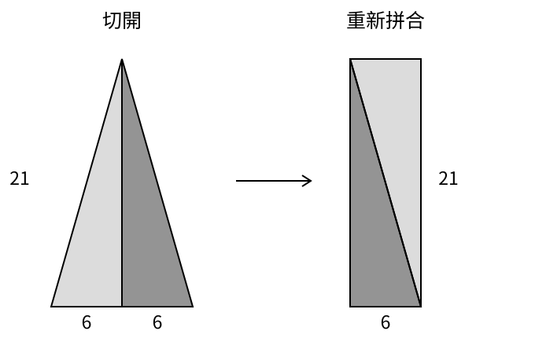

# 第四章　多條理由之路：中國、印度與伊斯蘭世界

一段簡短算法，可能把最重要的理由留給注釋；一段注釋，又可能把算法改讀成幾何關係。若只翻大字正文，或只尋找「定理」與「證明」的固定標題，閱讀就會在理由出現以前停止。本章並讀《九章算術》的注釋、印度一部天文數學著作的解說，以及花拉子米的代數論述。它們並不同時成書，也不能各自代表一整個文明。比較的對象，是幾份文本如何使運算有理由。

[上一章](ch03-greek-deduction.md)用反證排除了不可能的分數，也看見每一步借用的依據。現在要問的是：如果理由並未集中成同樣的書首起點，而是隨著題目、操作和讀者疑問出現，能否仍把它找出來？答案不能靠寬容地把一切都叫作證明，也不能靠嚴格地只接受某一種排版。我們必須實際追過它的步驟。

## 經典的大字，注釋的小字

《九章算術》不是在劉徽寫注時才忽然出現。其編成時間與材料層次仍有爭論，研究常把編成放在公元前一世紀至公元一世紀的範圍；劉徽注的傳統紀年為公元二六三年，後來又有李淳風等人於六五六年呈上的注釋。[^ch04-chemla-canon] 這些是不同層次的年代。不能把注者的年分當成全部題目的起源，也不能把傳世印本當成三世紀的原稿。

林力娜研究《九章算術》不同時期的閱讀，指出古代注釋與後來解說有時在傳抄中混合，讀者也曾以不同方式理解同一段程序。[^ch04-chemla-readings] 因此，說「《九章算術》認為什麼」還不夠精確：究竟是題目正文、劉徽注、唐代注釋，還是後來編者的判斷？把層次分開，才能看見知識如何被解釋，也如何被修改。

第一卷方田題的一個例子，給出圭田的廣十二步、正從二十一步，答案是一百二十六平方步；程序要求先取廣的一半，再乘正從。劉徽注以補足形狀的方式說明這一步，使用了「以盈補虛」的說法。[^ch04-liu] 這裡的廣是底，正從是對底的垂直高度。若只保存十二除以二再乘二十一，程序可以執行；加上形狀的解釋，就多出一條可以追問的理由。

為了把這條理由展開，先選一個底十二、高二十一的等腰三角形。數值沿用原題，等腰配置則是本章為便於閱讀而指定，不宣稱原題數字已唯一決定圖形。從頂點沿高度切到正好居中的底部，得到兩個相同的直角三角形，各自的兩條直角邊是六和二十一。把其中一片轉過來，與另一片沿斜邊拼合，就能組成六乘二十一的長方形。

這個移動沒有伸縮紙片，也沒有重疊或遺漏。長方形的面積因此等於原三角形，為一百二十六。先把底減半的程序，現在有了幾何上的工作：它給出重組後長方形的寬。數字六不只是按命令得到的中間結果，而是能在圖形中找到位置的量。

如果頂點沒有對準底邊中點，還能算嗎？只看剛才的對稱圖，答案尚未交代。以下再用現代語言把通常的三角形面積理由補全。從頂點向底邊所在直線作垂線，交點稱為「垂足」；它可能在底邊內、端點或延長線上。對一個底為 b、高為 h，垂足落在底邊內的三角形，設垂足把底分成 u 與 v，便有 u + v = b。兩側分別是直角三角形；每個都能和另一份相同的自己拼成長方形，所以面積分別為 uh/2 與 vh/2。

把兩部分加起來，得到 (u + v)h/2，也就是 bh/2。垂足若恰好落在底邊端點，原三角形本身就是直角三角形，可直接使用前述拼成長方形的論證，面積同樣是 bh/2。若垂足落在底邊延長線上，就把原三角形看成較大的直角三角形扣去較小者。兩者底邊相差 b，高都為 h，面積差仍為 bh/2。只要三角形不退化、底與高為正，這個現代初等證明就涵蓋頂點位置不同的情形。對稱圖顯示線索，分情形則交代它適用的範圍。

這不是聲稱劉徽原文逐字寫出了 b、h、u、v 與所有情形。原注留下的是重組形狀的理由方向；本章把其中一項算法放到明確的現代幾何假設下展開。讀者因而能分別評估原文的解釋作用與本書補出的完整論證，不必在「只是口訣」和「已經等同現代教科書」之間選一個過度的答案。

注釋也不只是替經典辯護。《九章算術》方田的圓田段落中，劉徽針對周三徑一的粗略比例提出批評，並尋求更密的比率。[^ch04-liu] 因而，閱讀經典可以同時包含承認其程序、解釋其結構，以及糾正某項數值。把「尊重經典」直接翻成「不准懷疑」，會讀不出同一段傳承中的爭論。

這個小例子也讓「實用」與「理論」不容易被切成兩個互斥盒子。圭田題用田地和步數提問，理由卻藉由形狀重組，處理超過一塊具體田地的關係。是否為實際測田而編題，需要其他史料；數值題能否承載一般結構，則可以直接從它的程序與解釋檢查。用途不能替我們決定論證深度。

## 印度注釋中的一束光

第五世紀末的《阿耶波多書》（Āryabhaṭīya）以梵文韻文給出天文與數學內容，其數學章的簡短句子包含算法和數量關係。第七世紀的婆什迦羅第一（Bhāskara I）為它作注，用散文解釋讀法、程序與理由。[^ch04-keller] 這裡談的是這位具名注者及特定段落，不能拿一部書的風格，替所有印度數學、宗教辯論或語言傳統畫一張統一面孔。

凱勒對這份注釋的研究，區分了釋義、理由、證成與回算檢查等活動；其中一個明確案例是《阿耶波多書》第二章第十五節的標杆與光源問題。婆什迦羅把計算解讀成三率法，也就是由已知比例的三個量求第四量。[^ch04-keller] 注釋的作用因此不只把難字換成容易的字，而是指出一串操作應當接到哪一項數學關係。

我們用自選數值和現代幾何把這個案例展開。設水平地面上有一盞理想點光源，高九個單位；距光源垂直投影六個單位處立著一根高三的垂直標杆。光源比杆頂高，穿過杆頂的直光線繼續向下，與地面相遇，形成影子的尖端。求從杆腳到影尖的長度。這不是聲稱古代原題恰用九、三、六，而是沿著原注的比例理由設計一個可核對的例子。

令所求影長為 s。從光源垂直到地面，再沿地面走到影尖，得到一個高度九、底長六加 s 的直角三角形。從杆頂垂直到杆腳，再到同一影尖，則得到高度三、底長 s 的小直角三角形。兩者都有直角，又共享影尖處同一條光線與地面的夾角，所以兩個三角形相似，相應邊保持比例。

於是 9/(6 + s) = 3/s。由於影長為正，可以交叉相乘，得到 9s = 18 + 3s；移去同樣的 3s，剩下 6s = 18，所以 s = 3。把結果放回圖形，大三角形的高和底都是九，小三角形的高和底都是三，比例確實相同。這項回算不是代替推導，而是讓結果與原來的幾何條件重新接上。

一般的情形也能寫清楚。光源高度為 H，杆高為 h，兩者在地面的距離為 D，而且 H > h > 0、D > 0。同樣的兩個三角形給出 H/(D + s) = h/s，整理後為 (H − h)s = hD，因此 s = hD/(H − h)。先把距離乘杆高，再除以高度差的程序，就這樣得到了一個比例上的理由。

高度差出現在分母，並非神秘規則。光源若降到和杆頂一樣高，穿過杆頂的光線便與地面平行，不會在前方形成有限的影尖；公式的分母也同時變成零。若光源更低，眼前這種向前延伸至地面的配置也改變。算法的適用條件在圖形與運算中彼此對應，恰好說明為什麼不能把所有輸入都照表塞進去。

這份現代推導還指出一個常見的讀圖錯誤：把九對三的比例，直接配到六對 s。六只量到杆腳，並不是大三角形的完整底邊。若這樣配比，會算出影長二；代回完整底長八，就會發現九比八與三比二不同。比例理由除了產生答案，也能解釋錯誤答案是在哪裡丟失了一段長度。

原注以三率法重讀程序的例子，支持我們說，至少這份梵文數學傳統中的文本明確關心操作依據。它沒有授權我們宣稱所有程序都有同樣完整的證明，也沒有讓歷史中的三率法自動等同於某套現代公理。共同的數學關係可以辨認，文本安排與論證目的仍須逐段研究。

這個例子還橫跨了數學與物理。只要接受水平地面、垂直標杆、理想點光源和光沿直線的模型，比例推導便成立；真實燈具若有大小，地面若傾斜，影子的邊界就可能不符合這個理想構造。注釋讓程序在模型內有了根據，模型與真實測量之間仍有另一項工作。[第十一章](ch11-experiment-and-evidence.md)會討論那項工作的證據要求。

## 三十九如何變成六十四

花拉子米《代數學》的某一類問題，問一個平方與它的十個根合起來等於三十九時，平方的根是多少。這裡的「根」是某個正量，平方是它與自身相乘所得的量。用今天的字母寫成 x² + 10x = 39，是方便我們閱讀的改寫，並不是說原書已經印著這串符號。羅森一八三一年英譯的正文先給計算程序，後面另有幾何解釋。[^ch04-khwarizmi-rule][^ch04-khwarizmi-geometry]

程序很短：把十減半得到五；五的平方是二十五；把二十五加到三十九，得到六十四；開平方得到八；再扣去五，所求的根為三。直接代入可以核對：三的平方為九，十個三是三十，兩者合起來三十九。回算確認三符合題目，尚未單靠自己說明為何應該取十的一半，或為何加上二十五就能找到它。

幾何解釋正好回答這兩個問題。取一個邊長為 x 的正方形，面積為 x²。在右側加上一條寬五、長 x 的長方形，在上側再加上一條同樣大小的長方形。兩條合起來的面積為 10x，與原正方形合計三十九。新的外框接近邊長 x + 5 的正方形，但右上角還缺一個五乘五的小正方形。

缺角的面積是二十五。把它補上，大正方形的面積就成了三十九加二十五，等於六十四。因此大正方形的邊長是八，原邊長 x 比它少五，便是三。這種把平方和長條補成完整平方的操作，今天稱為配方。減半的理由來自把十個根的面積分成兩條同寬的帶，補二十五的理由則來自兩條帶交接處缺失的角。

這裡每一塊面積都有角色。若把兩條長帶放在同一側，雖然總面積仍是三十九，外框就不會只缺一個五乘五的角；若兩條的寬不是五和五，補出的外形也不是同一個正方形。算法選擇均分，不只是為了使數字好算，而是為了得到可以直接取邊長的圖形。構造的目的決定了運算次序。

羅森譯本的相應段落確實提供了把十個根分到兩個相鄰邊的說明；前面還有另一幅把面積分到四邊的解釋。[^ch04-khwarizmi-geometry] 本章只展開兩邊配置，並把方向叫作上側、右側以方便想像。這是選用原書已見的論證安排，與[第二章](ch02-tablets-and-algorithms.md)替泥板數值構造一個未刻在板上的誤差界，歷史證據的關係不同。

用符號濃縮，可以寫成 (x + 5)² = 64，但這一步沒有使原來的領域消失。在正長度的幾何配置中，x + 5 必為正，所以它等於八。若改在全部實數中求 x² + 10x = 39，則還有 x + 5 = −8 的可能，得到另一根 −13；代回可見 169 − 130 = 39。原來的正量解讀只保留三，現代實數問題則有三與負十三兩根。

這不是替原作者補記一個「忘掉的答案」。兩個問題容許的對象不同，答案集合就可以不同。[下一章](ch05-algebra-and-symbols.md)會看符號運算如何把領域與條件帶得更遠；此處先看清楚，幾何解釋既提供理由，也把正長度的限制放在眼前。表示方式能打開某些可能，同時把另一些可能留在邊界之外。

還可以問：三是正量問題的唯一答案嗎？若正數 x 增大，x² 和 10x 都增大，兩者之和也嚴格增大，所以不能有兩個不同正數都得到三十九。或者直接利用已推出的大正方形邊長八，便得到原邊長只能為三。構造與回算合在一起，既給出符合條件的數，也排除了其他正量答案。

## 相似的理由，不是傳播的收據

把劉徽的面積重組、婆什迦羅的比例重讀、花拉子米的配方並排，很容易注意到共同點：它們都把看似任意的步驟放回可理解的關係。這個比較有數學價值，卻不能單靠相似就畫出影響箭頭。兩份材料同樣補上一個角，可能有傳播，也可能各自由相同的幾何限制得到。要判斷歷史關係，還要看譯本、術語、引文、抄本與可成立的接觸路徑。

有些傳播可以提出更具體的證據。花拉子米代數著作的部分內容有十二世紀拉丁譯本；研究者依據傳本與校勘，區分約一一四五年的切斯特的羅伯特譯本及克雷莫納的傑拉德譯本。[^ch04-hoyrup-transmission] 這讓我們能談一份文本如何跨語言流動。它仍不會自動證明每位後來的數學家讀過哪一版，也不會證明所有歐洲代數都只來自單一管道。

傳播也可能改變讀者實際得到的作品。研究者指出，某些拉丁傳本沒有包括原著的全部測量與繼承問題。[^ch04-hoyrup-transmission] 如果一種語言中的讀者只見到部分內容，就可能對作者的目的形成不同印象。證明方法的歷史因此也包含選擇、刪節與重組；一套理由怎樣被接收，不只由原作者決定。

本章所用的「中國」「印度」「伊斯蘭世界」，只是協助定位材料的歷史稱呼。就證據而言，更有力的主語往往是某位注者、某種語言、某個版本或某項程序。阿拉伯文的幾何理由不能被一個宗教標籤完全解釋，梵文注釋的問題意識也不能從「印度人重直覺」這種概括推出。讀者要接受的仍是具體論證，而非替某個群體判定固定性格。

這並不要求放棄比較。反而因為對象縮小，比較才更準確。圭田例子問如何保持面積，燈影例子問哪些邊對應成比例，配方例子問如何把未知量放入可求邊長的平方。三者都可用現代符號重寫，符號卻不是辨認其理由的先決條件。只要追問哪個量在何處、哪一步保留何種關係，就能開始檢查。

## 注釋為什麼能改變經典

一位注者若把十二與二十一的運算接到可重組的形狀，後來的讀者就不只繼承一道題的答案。讀者還取得一種改動題目的能力：頂點偏了怎樣辦，高度改了哪些地方跟著變，原來的拆合是否仍成立？解釋因而可能擴大文本的用途。經典的內容沒有變成另一句答案，卻因為理由更清楚而能走到原題之外。

同樣地，婆什迦羅把一項操作重新辨認為比例程序，會使原本分散的題目出現共同關係。讀者可以檢查所謂「同類」是否真的共享假設，不能只因兩題都有乘除就認定相同。花拉子米的幾何解釋則提供另一種檢查：當代入的係數換了，缺角如何改變？原有構造還能完成嗎？這些問題都是理由產生的新工作。

最值得留下的比較，也許不是誰的證明較像今天，而是每種文本讓讀者能做哪些以前難以做的事。注釋可以辨明省略的對象、指出程序的意義、限制套用範圍，也可以糾正經典數值。它未必每次成功，仍應逐段評估。把注釋讀作知識本身，就能看見證明並不總是以宣布新定理的姿態出現；它也在替一句舊規則回答一個新的「為什麼」。

[^ch04-chemla-canon]: Karine Chemla，〈Canon and Commentary in Ancient China: An Outlook Based on Mathematical Sources〉，2008，Max Planck Institute for the History of Science，Preprint 344，正文開頭及註1。[機構全文](https://www.mpiwg-berlin.mpg.de/Preprints/P344.PDF)。支持《九章》編成年代仍有爭論、經典與劉徽及李淳風注釋的年代分層。
[^ch04-chemla-readings]: Karine Chemla，〈Reading Instructions of the Past, Classifying Them, and Reclassifying Them: Commentaries on the Canon The Nine Chapters on Mathematical Procedures from the Third to the Thirteenth Centuries〉，2020，《BJHS Themes》5，15–37。[研究全文](https://www.cambridge.org/core/journals/bjhs-themes/article/reading-instructions-of-the-past-classifying-them-and-reclassifying-them-commentaries-on-the-canon-the-nine-chapters-on-mathematical-procedures-from-the-third-to-the-thirteenth-centuries/F402B3DE252D1799135618C259E5C706)。支持注釋層次有時混合、不同讀者對程序的處理會改變；不把這種混合概括成所有段落都無法辨認作者。
[^ch04-liu]: 《九章算術》，劉徽注、李淳風等注釋，〈卷第一・方田〉，圭田及圓田段落；《四部叢刊》影印微波榭刊本的電子轉錄。[原典](https://zh.wikisource.org/wiki/%E4%B9%9D%E7%AB%A0%E7%AE%97%E8%A1%93_%28%E5%9B%9B%E9%83%A8%E5%8F%A2%E5%88%8A%E6%9C%AC%29/%E5%8D%B7%E7%AC%AC%E4%B8%80)。支持十二、二十一、一百二十六的題目、補形說明及對周三徑一的批評；本章一般三角形的分情形推導是現代展開。
[^ch04-keller]: Agathe Keller，〈Dispelling Mathematical Doubts: Assessing Mathematical Correctness of Algorithms in Bhāskara’s Commentary on the Mathematical Chapter of the Āryabhaṭīya〉，2012，收於 Karine Chemla 編《The History of Mathematical Proof in Ancient Traditions》，487–508，尤其第二節對 Ab.2.15 的解讀。[原典譯述與研究](https://www.ms.uky.edu/~sohum/ma330/files/Chemla_K.Ed.-The_history_of_mathematical_proof_in_ancient_traditions-Cambridge_University_Press_2012.pdf)。支持具名梵文注釋對算法理由的關心與燈影的三率解釋；H、h、D、s 及九、三、六為本章自選的現代表示。
[^ch04-khwarizmi-rule]: Muḥammad ibn Mūsā al-Khwārizmī，《The Algebra of Mohammed Ben Musa》，Frederic Rosen 編譯，1831，頁8。[原譯本該頁](https://en.wikisource.org/wiki/Page:The_Algebra_of_Mohammed_Ben_Musa_%281831%29.djvu/24)。支持平方、十根與三十九的題目及計算步驟；頁下注的符號式屬譯編者，不冒充阿拉伯原文。
[^ch04-khwarizmi-geometry]: 同書，頁15–16。[頁15](https://en.wikisource.org/wiki/Page:The_Algebra_of_Mohammed_Ben_Musa_%281831%29.djvu/31)、[頁16](https://en.wikisource.org/wiki/Page:The_Algebra_of_Mohammed_Ben_Musa_%281831%29.djvu/32)。支持兩邊長條、補二十五成六十四的幾何說明；全部實數中另有負根是本書的現代領域比較。
[^ch04-hoyrup-transmission]: Jens Høyrup，〈The Fifteenth–Seventeenth Century Transformation of Abbacus Algebra〉，2011-09-17預印本，〈Latin Twelfth- to Thirteenth-century Reception〉節。[作者機構全文](https://rucforsk.ruc.dk/ws/portalfiles/portal/34964168/Hoyrup_2011_a_15th_17th_c._transformation_of_abbacus_algebra.PDF)。支持具名拉丁譯本及部分傳本的省略；本文只援引文本傳播，不採用該文對個別傳本影響大小的全部判斷。
