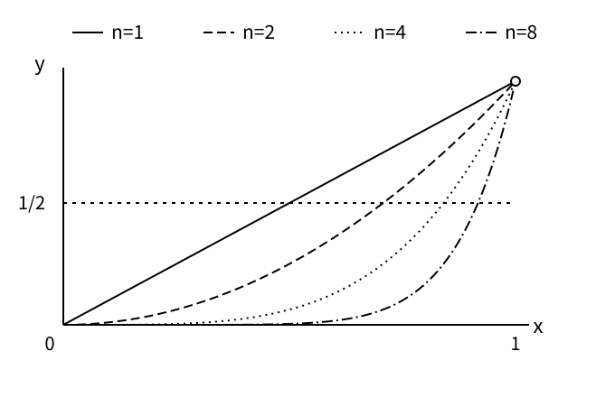

# 第六章　把無限說清楚：窮竭法、微積分與極限

沿著曲線 y = x² 移動一個點，到了 x = 2，曲線有多陡？[上一章](ch05-algebra-and-symbols.md)教我們用等式描述圖形，現在卻遇到一個不能直接代入的問題。取曲線上另一點，橫座標是 2 + h；兩點連線的斜率為 ((2 + h)² − 4)/h。只要 h ≠ 0，展開與約分便得到 4 + h。看起來，只要讓 h 變成零，就會得到斜率四。

但原式在 h = 0 時沒有定義。先靠 h ≠ 0 才能除以 h，接著又宣布 h = 0，會不會重演除以零的假證明？答案四可以完全正確，交代理由的方式卻仍有欠缺。微積分的核心難題之一，正是在正確而有用的運算背後，說清楚那些忽然消失的差量究竟去了哪裡。

## 不把剩餘當成不存在

處理無限的困難，遠早於微積分記號。阿基米德的《拋物線求積》用逐步添入三角形的辦法逼近曲邊區域，最後證明其面積是同底、同高的特定內接三角形面積的三分之四。在幾何證明的後段，每一輪添入的三角形總面積是前一輪的四分之一；第二十三命題處理有限串面積與剩餘項，第二十四命題再完成反證。[^ch06-archimedes] 這不是畫到肉眼看不見空隙便停下來。

用現代記號抽出其中的算術骨架。若第一個面積是 A > 0，加入到第 n 輪，總和寫成 S_n = A + A/4 + A/4² + … + A/4ⁿ，其中 n 是包含零的整數。把有限和乘以四，再減去原和，中間各項相消，得到 3S_n = 4A − A/4ⁿ。因此 S_n = 4A/3 − A/(3 × 4ⁿ)。這是有限等式，並未把無限多次加法假裝成一次普通加法。

式子告訴我們，每一次有限加總都還差 A/(3 × 4ⁿ)。差距不是零，卻能小於任何事先給定的正數。兩句話必須分開。如果對方提出一個正差距 d，我們可以增加 n，使剩餘小於 d；但這不表示某個有限 n 會讓剩餘真的消失。「沒有固定正差距能一直留下來」，與「現在完全沒有差距」，是不同的陳述。

歐幾里得《幾何原本》卷十第一命題，處理反覆移去超過一半的量後，剩餘終能小於另一個預先指定的量。[^ch06-euclid-x1] 對本章使用的通常長度與面積，這種窮竭推理讓有限步驟足以對付任意小的誤差要求。阿基米德仍須證明，內接圖形確實位於原區域內，留下的區域能按要求縮小；一條幾何級數的公式，不能單獨取代那些幾何工作。

窮竭法的嚴格性在於，它給反對者留下挑戰的空間。假如有人認為目標面積比三分之四大一點，就拿那個正差額作為新的尺度，再細分到矛盾出現；認為比較小，也另走反方向的反證。這裡只概括原證明的架構，不冒充已重做全部拋物線命題。需要保留的思想是：越過每一個可能的誤差門檻，才有資格宣稱精確相等。

因此，歷史不能被排成「古代只有圖形直覺，十九世紀才有嚴格證明」。窮竭法本來就有清楚的證明要求。後來的變化，是把多種曲線、運動與求積問題納入更通用的運算，並替這些運算建立足夠精細的共同規則。範圍擴大了，原本不顯眼的依賴也就變得重要。

## 成功的運算，仍可以被追問

萊布尼茲一六八四年發表〈求極大、極小與切線的新方法〉，提出一套可操作的微分計算；牛頓《自然哲學的數學原理》第一卷第一節則以最初比與最終比組織後面的論證。[^ch06-leibniz][^ch06-newton] 這些文本呈現的語言、目的與證明形式不同，不能揉成某一個人某一天完成的「微積分發明」。本章關心的是，它們如何把局部變化與累積量變成可研究的問題，以及新的步驟需要哪些理由。

牛頓並非毫不在意那個趨近卻尚未到達的差距。在本章所用的莫特英譯本裡，第一引理就以能接近到小於任何給定差異來排除一個固定的最終差異；該節末尾又分辨消失中的量與它們所趨向的比。[^ch06-newton] 不能把他的整套方法縮成「先除以零，然後僥倖算對」。然而這些表述與今天逐一標示量詞依賴的定義，也不能直接畫上等號。

貝克萊在一七三四年的《分析家》中，特別攻擊先假定增量存在、除去它，之後又讓增量消失而保留所得結果的論法。他的著作帶著宗教論戰目的，但其中一個問題仍然可以獨立檢查：若推導中改了假設，原來的結論還有多少效力？[^ch06-berkeley] 批評者的立場不替他的推理保證正確，也不會讓這個問題失去意義。

設想一位計算者回答：「可是用這套方法能算出正確切線。」那回答說明方法值得研究，尚未說明某段推導沒有漏洞。正確答案可能來自別的有效理由，也可能在不嚴密的計算裡偶然得到。證明工作的要求更高：它要把成功依賴的條件從熟練手勢中拆出來，讓不肯只憑成果接受的人也能跟進。

柯西在一八二一年的《分析教程》預備篇，以變量的相繼取值能與固定值相差任意小，說明極限；他把無窮小描述為以零為極限的變量，後續章節再討論連續性與級數。[^ch06-cauchy] 這足以看見十九世紀分析學對定義與運算條件的集中整理，卻不應把柯西所有文字直接改寫成今日版本，再宣稱後人只是更換符號。下面採用現代實數分析的表述，證明也由本書重做。

## 把「夠近」交給對方決定

先暫時放下斜率，處理更基本的命題：當實數 x 趨近 2 時，x² 趨近 4。直接代入 2 得到 4，只算出了函數在那一點的值；極限談的是那一點附近所有足夠接近的輸入。兩件事往往相合，卻需要理由。

例如另定一個函數 g：當 x ≠ 2，g(x) = x²；當 x = 2，g(2) = 100。只改動正中央的一點，不會改變附近那些值如何接近四。因此 g 在 2 的極限仍是四，雖然 g(2) 是一百。極限若只由代入得到，就無法表達這個差別。它要把「附近的行為」與「中心的取值」分開。

如果函數在一點有定義，且附近的極限恰等於那一點的函數值，我們說它在該點連續。因此 x² 在二是否連續，可以拆成三件可檢查的事：中心值存在、附近的極限存在、兩者相等。剛才改動中心值的 g 缺的是最後一項。這個例子也說明，知道函數某一點的精確值，未必知道小幅改動輸入之後會發生什麼。

連續與可微也不是同一項保證。連續只要求輸出隨輸入靠近而靠近；導數還要求輸出變化除以輸入變化後，得到穩定的極限。這一個除法放大了要檢查的細節。即使輸出差已經很小，輸入差可能更小，比值仍可能震盪或向兩側分開。稍後的絕對值函數會讓這個差別具體顯現。

現代 ε–δ 定義把這份要求拆成一個有順序的承諾。ε 是對輸出誤差提出的任意正上限，δ 是我們交出的正輸入容許距離。要說 x² 在 x 趨近 2 時以 4 為極限，必須保證：對每一個 ε > 0，都能找到 δ > 0，使所有符合 0 < ∣x − 2∣ < δ 的實數 x，都滿足 ∣x² − 4∣ < ε。[^ch06-limit-definition] 絕對值在這裡表示數線上的距離。

先給 ε，後選 δ，最後才讓 x 在指定範圍內任意變動。這個順序有實質內容。我們可以依照對方要求的誤差調整輸入範圍，但不能先看到某個方便的 x，再替它量身裁一個只管那一次的保證。δ 一旦交出，就要照顧整個小區間。對方也不必順著我們的例子，只挑 1.9、1.99 或 2.01。

ε 不是神祕的「無限小數」。它可以是十分之一，也可以是萬億分之一；定義要求任何正實數都可提出。δ 同樣是普通正數。「無限」藏在這份要求沒有最後一個最小誤差，而不是藏在一個既不是零、又小於所有正實數的實數之中。本章的證明完全不需要這樣的對象。

為何要寫 0 < ∣x − 2∣？因為極限只要求靠近目標，不要求函數恰在目標點有定義。這在斜率問題尤其重要：h = 0 的商不能算，但所有足夠小且不為零的 h 都可以算。排除中心不是鑽漏洞；它把正在研究的對象明確限定為附近的變化。

反對極限命題也有對應的方式。若有人聲稱不存在這個極限保證，他得找出一個正誤差門檻 ε，使得無論我們把 δ 選得多小，都還能在其中找到違反要求的 x。只指出某個 δ 選得太大，並不足以推翻極限；我們可以換一個更小的 δ。這正像反對一個解題程序，必須辨認它宣稱的全部保證，而不只是攻擊某次粗糙估計。

也不能把定義誤讀成先選一個固定 δ，然後讓它應付所有 ε。對平方函數而言，任給正 δ，取 h 為 δ/2 與 1/2 中較小的數，便有 0 < h < δ。令 x = 2 + h，則輸出差為 4h + h²，是一個確定的正數。對方只要再要求 ε = (4h + h²)/2，這個 x 就違反保證。錯誤的順序會要求函數在某段範圍裡完全沒有變化，遠比我們本來要說的極限強。

因此，定義裡哪些數可以依賴哪些數，不能只靠語感帶過。把 δ 寫成 ε 的函數，不是方便排版，而是把「接受要求後如何回應」公開出來。這類先後關係將在[第八章的量詞](ch08-logic-and-foundations.md)中得到通用的邏輯語言；現在只要按選擇順序讀，就能理解它對證明的限制。

## 一份可以從頭查到底的證明

我們現在完整證明極限。先給任意 ε > 0，選擇 δ = min(1, ε/5)，也就是一與 ε/5 中較小的數。兩者都為正，所以 δ > 0。設 x 是任意實數，並滿足 0 < ∣x − 2∣ < δ。我們要從這些條件推出 ∣x² − 4∣ < ε，途中不能再為 x 更換 δ。

因為 δ ≤ 1，有 ∣x − 2∣ < 1，於是 1 < x < 3。兩邊加二，得到 3 < x + 2 < 5，所以 ∣x + 2∣ < 5。另一方面，平方差可以精確分解為 x² − 4 = (x − 2)(x + 2)。因此輸出誤差是 ∣x² − 4∣ = ∣x − 2∣ × ∣x + 2∣ < 5∣x − 2∣。

又因 ∣x − 2∣ < δ 且 δ ≤ ε/5，接著有 5∣x − 2∣ < 5δ ≤ ε。連起來便得到 ∣x² − 4∣ < ε。我們對任意 ε 都交出正 δ，且對範圍內每一個 x 都完成保證，所以 x² 在 x 趨近 2 時的極限等於四。這已是一份完整的初等證明，而非抽查幾個接近二的數。

數字五並不神聖。它來自先把 x 限制在一與三之間，再替 x + 2 找一個容易使用的上界。這個界甚至不是最銳利的，但證明只要求它足以控制誤差。估計常常需要兩步：先把局部範圍固定，防止某個因子跑遠；再依 ε 把真正變小的因子收緊。min 把這兩份要求合在一起。

假如只取 δ = ε/5，忘了 δ ≤ 1，ε 很大時就可能容許 x 離二很遠，先前的 ∣x + 2∣ < 5 不再有根據。問題未必是那個 δ 對每一個 ε 都失敗，而是我們這份證明失去了必需的一環。檢查證明要跟著依賴走，不能因結論「顯然應該對」就替缺漏補上不存在的理由。

用具體誤差看一遍，可以理解保證的意思。若 ε = 0.01，這個選法給 δ = 0.002；凡是與二的距離小於 0.002、又不等於二的 x，平方後與四的距離必小於 0.01。這不是說誤差恰為 0.01，也不是說稍微超出這個輸入範圍就一定失敗。δ 給的是充分條件，不是最大可能容許範圍。

這還解釋了為何極限證明常比計算答案長。答案四沒有告訴我們該控制哪個因子；完整論證卻交出一套對任意要求都能回應的辦法。一旦平方函數的連續性和其他極限定理已經建立，以後就可以引用定理直接代入。簡短解法依然可靠，是因為更長的依賴已經有地方可以查，而非那些依賴從此不需要證明。

## 回到那個不能代入的零

現在處理開頭的斜率。對每個 h ≠ 0，商 ((2 + h)² − 4)/h 確實等於 4 + h。給任意 ε > 0，只要 0 < ∣h∣ < ε，商與四的距離就等於 ∣h∣，小於 ε。依照剛才的極限要求，這個商在 h 趨近零時以四為極限。我們始終沒有把 h = 0 代入原商，也沒有宣稱某個非零 h 突然等於零。

在這個例子裡，曲線在該點的導數，就是這個差商的極限。兩個分開的點決定割線；當另一點以任意方向接近，割線斜率趨向同一個有限值，這個值便描述局部的變化率。對一般函數，差商的極限可能不存在，因此「每條曲線每一點都有斜率」並不是定義贈送的事實。存在性仍須判斷。

例如 f(x) = ∣x∣ 在零附近，右側差商等於一，左側差商等於負一。兩側無法接近同一個數，因此零點沒有通常的雙側導數。圖形的尖角提供直覺，差商則指出精確障礙：不是計算者還沒把 h 選得夠小，而是不同方向一直保留不同結果。定義讓「算不出來」變成一項可證明的不存在結論。

建立極限語言並未禁止近似。若實際只需要斜率誤差小於某個門檻，剛才的推導反而給出可用的有限選擇。精確定理保證哪些近似可靠；近似計算再按用途決定要付多少成本。這與把很小的量隨手丟掉，理由完全不同。被省略的量必須先被估計，才能知道省略造成什麼。

## 每一點都做到，不等於同時做到

前面的極限證明只處理一個函數。現在把問題稍微改一下：不是讓輸入靠近某點，而是不斷換用下一個函數。依序排出 x、x²、x³，這串以正整數編號的函數就叫「函數列」。記作 f_n(x) = xⁿ 時，n 是正在使用的第幾個函數，x 則是交給它的輸入。先把兩個角色分清楚。

本節先只看 0 ≤ x < 1。若一直使用 x = 1/2，輸出依序是 1/2、1/4、1/8，愈來愈小；若一直使用 x = 9/10，也會下降，只是慢些。我們要問兩件事：每一個固定輸入，是否終究能把誤差壓小？能否找出同一個起始編號，保證往後整段輸入範圍都已經夠準？後一項要求比較多。

先完成第一件事。x = 0 時，各次方都是零。若 0 < x < 1，令 t = 1/x − 1 > 0，便有 xⁿ = 1/(1 + t)ⁿ。有限展開或歸納可得 (1 + t)ⁿ ≥ 1 + nt：n = 1 時等號成立；若 n 時成立，再乘正數 1 + t，便得到 (1 + t)ⁿ⁺¹ ≥ 1 + (n + 1)t + nt² ≥ 1 + (n + 1)t。

因此，0 ≤ xⁿ ≤ 1/(1 + nt)。給定誤差 ε > 0，選一個正整數 N 大於 1/(tε)，此後每個 n ≥ N 都有 xⁿ < ε。這裡新出現的 N 不是另一個輸入，而是「從第幾個函數開始已經夠準」的門檻。n 繼續往後增加，N 則是這次選定的起點。

例如固定 x = 1/2，t 就是 1；若要求誤差小於 1/10，按上面的估計，選 N = 11 就足夠。改成 x = 9/10，t 變成 1/9，同一估計可選 N = 91。這些門檻不求最小，只求確實保證結果。輸入更靠近 1，這份方法准許等得更久。

這叫逐點收斂：先固定一個 x，再替這個 x 找到足夠大的 N。每個點可以有自己的門檻，記成 N(x, ε)。我們已證明每個固定的 x < 1 都趨向零，還沒證明所有點能共用同一個門檻。

一致收斂問的就是那個共同門檻。給定 ε 後，要能選出同一個 N，讓每個 n ≥ N、每個範圍內的 x 都同時符合誤差要求。這個 N 可以依賴 ε 和已固定的範圍，卻不能等看到 x 後再改選。兩種承諾可以並排讀：

| 要保證什麼 | 何時選 N | N 要照顧誰 |
| --- | --- | --- |
| 逐點收斂 | 先固定 x，再依 x 與 ε 選 N | 那個已選定的 x |
| 一致收斂 | 給定 ε 後，為整段範圍選 N | 範圍內所有 x，共用同一個 N |

在 [0, 1) 上，第二種承諾做不到。把誤差門檻固定為 ε = 1/2。無論有人提出多大的正整數 N，我們就在第 n = N 個函數上，選 x 為 3/4 的正 n 次方根。這個 x 仍介於零與一，而 xⁿ 恰好等於 3/4，大於允許的 1/2。於是每一個候選 N 都有一個管不住的輸入。

這沒有推翻逐點收斂。反例中的 x 會隨 n 改變，愈來愈靠近 1；逐點收斂則要求先固定同一個 x，再讓 n 增大。兩種走法的差別，正是圖上那些貼近右端、始終高於門檻的區域。只盯著幾個固定取樣點，容易漏掉這項要求。

把範圍縮成 [0, r]，其中 r 已固定且 0 < r < 1，情況就變了。所有 x 都滿足 0 ≤ xⁿ ≤ rⁿ，而我們已證明固定的 rⁿ 趨向零。只要替最右端的 r 選好 N，同一個 N 就能控制整段範圍。例如把範圍固定在 [0, 9/10]，便不再有輸入任意靠近 1 的問題。是否一致收斂，連範圍也要一起說明。

最後才把端點 1 放回來。每個函數在 x = 1 的值都是一，因此在 [0, 1] 上逐點得到的極限函數，小於一時為零，等於一時為一。每條原曲線都連續，極限卻在端點跳起來。這就足以反駁「連續函數逐點取極限，結果總是連續」。這是現代教學例子，不是在指認某位歷史作者犯過同一個錯誤。

交換兩個極限時，也有相同警訊：先固定 x < 1 讓 n 增大，再讓 x 從左側靠近 1，得到零；先固定 n 讓 x 靠近 1，再讓 n 增大，得到一。此處只用這個例子提醒操作次序有差別，不另外引入一套交換極限定理。要交換，仍須另有充分條件。

到這裡，極限語言增加的不是一組需要背誦的術語，而是讓追問有位置：是哪個輸入還沒夠準？能不能共用 N？換了範圍會不會成功？支持者可以補估計、縮小範圍，或放棄過強的承諾；反對者也能指出具體失敗處，而不必只爭論「到底算不算無限接近」。

[^ch06-archimedes]: Archimedes，《Quadrature of the Parabola》，約西元前三世紀，命題 20–24；T. L. Heath 編譯《The Works of Archimedes》，1897。[版本全文與 OCR](https://archive.org/stream/worksofarchimede00arch/worksofarchimede00arch_djvu.txt)。支持三角形面積的四分之一關係、有限和的剩餘及雙向反證；正文 S_n 推導是現代重建，未聲稱逐字翻譯古文。
[^ch06-euclid-x1]: Euclid，《Elements》，約西元前三百年前後，卷 X 命題 1；David E. Joyce 線上編本。[命題與證明](https://mathcs.clarku.edu/~djoyce/elements/bookX/propX1.html)。支持反覆減半式的誤差控制；正文限定通常長度與面積，不把命題無條件套到任何種類的量。
[^ch06-leibniz]: Gottfried Wilhelm Leibniz，〈Nova methodus pro maximis et minimis, itemque tangentibus…〉，《Acta Eruditorum》，1684 年 10 月。[Gary S. Stoudt 整理的原始資料頁](https://www.people.iup.edu/gsstoudt/history/images/novamethodus.html)。支持該文的發表年代與微分計算主題；不據此裁定牛頓與萊布尼茲的發現先後。
[^ch06-newton]: Isaac Newton，《Philosophiæ Naturalis Principia Mathematica》，初版 1687；Andrew Motte 英譯，1729，第一卷第一節，引理 I–III 與末尾 Scholium；David R. Wilkins，2002 整理。[英譯正文 PDF](https://www.maths.tcd.ie/pub/HistMath/People/Newton/Principia/Bk1Sect1/PrBk1St1.pdf)。支持給定差距、最終比及內外逼近的表述；所閱為後出的英譯文本，不將它的全部細節倒推為初版措辭。
[^ch06-berkeley]: George Berkeley，《The Analyst》，1734，第 XII–XX 節；David R. Wilkins 依倫敦與都柏林初版整理。[全文](https://www.maths.tcd.ie/pub/HistMath/People/Berkeley/Analyst/Analyst.html)。支持先設增量、後取消增量的批評與其宗教論戰脈絡；正文的斜率計算是本書例子。
[^ch06-cauchy]: Augustin-Louis Cauchy，《Cours d’analyse》，1821，〈Préliminaires〉及第二章；參照《Œuvres complètes》第二系列第三卷，1882 重刊。[預備篇](https://fr.wikisource.org/wiki/Cours_d’analyse_de_l’école_royale_polytechnique/Préliminaires)；[第二章](https://fr.wikisource.org/wiki/Cours_d’analyse_de_l’école_royale_polytechnique/Chapitre_II)。支持柯西對極限、無窮小及連續性的表述，不將其原文直接等同今日的所有量詞約定。
[^ch06-limit-definition]: Gilbert Strang、Edwin Herman 等，《Calculus Volume 1》，OpenStax，2016，第 2.5 節〈The Precise Definition of a Limit〉。[定義與量詞順序](https://openstax.org/books/calculus-volume-1/pages/2-5-the-precise-definition-of-a-limit)。用來核對現代實數極限定義；本章 ε/5 的估計、差商與函數列論證均自行展開。
