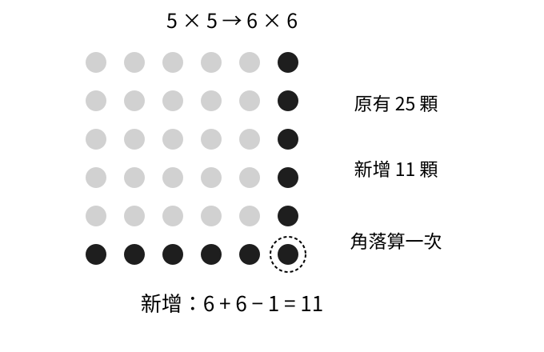
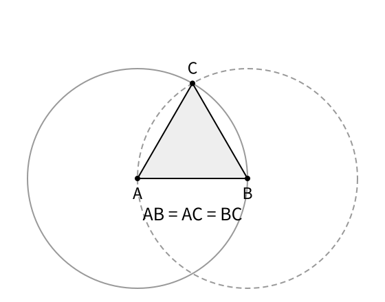

# 人類證明方法的演化：敘事修訂樣章

> 本次改稿範圍：開場與前三章。這不是全書新版；原來十八章與離線閱讀器尚未替換。

## 開場　算出來以後

有人交來一個答案。我們看了一眼，問：「你怎麼知道？」

這句話可以有很多種回答。再算一次，拿出一張圖，指出前人留下的做法，或者從幾條彼此同意的規則開始，一步步走到結果。回答不一定很長。有時，把幾顆石子換個排法，疑問就消失了；有時，為了補上一個看似不起眼的「為什麼」，整套數學都得重新整理。

這本書要追的，是那些疑問如何長大。

我們先從一個能放在桌面上的問題開始，接著翻看古代留下的計算，再走到令人不安的發現：有些答案不是還沒算出來，而是根本不可能用原來期待的方式寫出來。往後，符號會讓人走得更遠，也會藏起新的困難。到了機器參與證明的時代，「你怎麼知道」仍然沒有消失，只是多了一句：「電腦交來的結果，又由誰來檢查？」

這條閱讀路線，不是各文明依序交棒的一場比賽。不同地方的人會遇到相似的問題，也會把理由留在不同形式的文字裡。本書按疑問安排先後；實際的歷史，則有交會，也有各自發展的道路。[^intro-history]

## 第一章　多問一句「為什麼」

先在桌上做一個小實驗。

放下一顆石子。它太小，暫時看不出什麼。再添三顆，排成兩列，每列兩顆，桌上便有了一個小小的正方形。這次再添五顆，不要隨便撒開，而是沿著正方形外側排成一道轉彎的邊：下面三顆，右側再補兩顆。

兩乘二，變成了三乘三。

再添七顆，又能多長一圈，成為四乘四。接著是九顆，正方形變成五乘五。這五堆石子的總數沒有因排列而改變，但那串本來平凡的加法，現在有了形狀：

1 + 3 + 5 + 7 + 9 = 25。

我們可以逐項相加，算出二十五。也可以數正方形的列數，知道五列各五顆，一共二十五。兩條路在同一個答案相遇了。

### 這一次對，下一次呢？

事情本來可以到這裡結束。可是，那道轉彎的邊讓人忍不住想再試一次。

下一圈要十一顆嗎？

五乘五的正方形若要長成六乘六，下面得添一排六顆，右邊也得添一排六顆。不過，右下角那顆石子同時屬於這兩排，不能算兩次。因此，真正要添的是六加六，再扣一，恰好十一顆。

十一，不是碰巧猜中的。

我們已經看見它從哪裡來了：新的底邊，新的右邊，以及兩邊共用的那個角落。桌上的安排，解釋了下一個數為什麼仍然是奇數。

但有人還可以追問：第七圈呢？第一百圈呢？我們是不是終究得一圈圈排下去，才能知道後面不會出錯？

不必。剛才的理由沒有要求正方形一定是六乘六。只要邊長增加一顆石子的寬度，就得補下面和右面這兩排，也總有一個角落被重複算到。這件事不會因為正方形變大而改變。

到這裡，才值得請一個字母進來。把新正方形每邊的顆數叫作 n。n 可以是六、七、一百，或任何正整數。新增的兩排各有 n 顆，扣掉重複的角落，便是：

n + n − 1 = 2n − 1。

當 n 從一、二、三往上走，這個數就依序是一、三、五。每添一個奇數，正方形恰好多長一圈。排到每邊 n 顆時，裡面一共有 n 乘 n 顆，也就是 n² 顆。

第 k 次長成每邊 k 顆的正方形，新增的就是第 k 個正奇數。做到每邊 n 顆時，恰好累加了前 n 個正奇數，而不是任意挑出的 n 個奇數。因此，從一開始，前 n 個正奇數的和，就是 n²。

字母並沒有帶來另一個問題。它只是替剛才已經看懂的安排取了一個短名字。

### 一個理由，照顧許多次計算

現在，假使桌上沒有空間再排石子，我們仍然知道接下來會怎樣。

這和「前幾次都成功，所以以後大概也成功」不同。前幾次成功，原本只是引人注意的線索；找出每一圈為什麼一定有那麼多顆，才讓我們不必永遠試下去。

還可以問得更細：排的時候，會不會有石子漏在某一圈之外？不會。每次都是把原有正方形留著，在外側補上新的邊；舊位置不動，新位置恰好填滿。若指定最後要做多大的正方形，從一顆開始照這樣長大，所有位置都會被填到。

這段話是證明的一部分。它回答的就是眼前的疑問：石子究竟有沒有數對。

證明也沒有貶低最初那次加法。要知道桌上的五堆石子總共有多少，算出二十五已經把事情做完了。只是當問題改成「無論加到哪裡都如此嗎」，我們需要一個能跟著問題一起變大的理由。[^ch1-reasoning]

這個理由還能告訴我們，公式什麼時候不能直接套用。

假如第一堆不是一顆，而是三顆，接著加五、七、九、十一，總和就不是二十五。正方形沒有推翻自己的承諾；是我們換了起點。第一顆石子、每次接上的邊，以及不跳過任何一層，原來都在理由裡。

條件不必先排成一張清單，等著讀者背下來。看清楚石子怎麼長，條件就有了來處。

### 人走了，方法怎麼留下？

當面講解時，我們可以指著角落說明，也可以把排錯的石子移回去。可是，如果看懂的人離開了呢？

只留下「二十五」，後來的人可以使用這個答案，卻不知道它為什麼和奇數有關。留下一張點陣圖，能看見排列，卻未必知道該按什麼順序添上去。把添邊的做法寫下來，另一個人便能重做；再交代角落只能算一次，他就能檢查這個做法。

答案因此有了第二次生命。它不只屬於最先想到的人，也能成為別人接著思考的起點。

不過，這正是我們閱讀古代材料時常遇到的困難：有時留下答案，有時留下做法，有時兩者都有，當時的說明卻不在了。

下一章的桌面上，不再是我們排的石子，而是一塊真的留存下來的泥板。板上也有一個正方形。這次，難題藏在它的對角線裡。

## 第二章　泥板留下了答案，沒有留下聲音

那塊泥板今天的編號是 YBC 7289。上面畫著正方形和對角線，旁邊刻著數字。研究者把它歸入古巴比倫時期，大約在公元前十九至十七世紀；它確切來自哪裡、何時製作，仍不清楚。[^ch2-tablet]

我們不知道落筆的人當時在想什麼，卻能讀懂一件事：其中一組數，和正方形的對角線有關。

要看出它的厲害，先想像一個邊長為一的正方形。沿著兩條邊走到對角，是一加一；直接穿過中間，當然短一些。那條斜線究竟有多長？

用今天熟悉的畢氏定理，斜線長度的平方等於一平方加一平方，也就是二。因此，我們要找一個正數，乘以自己後恰好得到二。今天把它寫作 √2，讀作「根號二」。

一太小，因為一乘一還是一。二太大，因為二乘二已經是四。一點四呢？平方是一點九六，接近了，但仍小一點。

泥板上的數，換成今天的小數，約是 1.414212963。它的平方比二小不到百萬分之二。這不是隨意抓出的一點四，而是一個相當精細的近似值。[^ch2-calculation]

### 一串數字，能走出原來的正方形

原來的記號和我們不同。古巴比倫數字使用六十進位。現代研究者把泥板上的這組數轉寫為 1;24,51,10：一，加上二十四個六十分之一，再往更小的位值讀下去。分號和逗號是現代轉寫加上的，不是泥板原有的標點。[^ch2-context]

不必先學會整套記數法，仍能明白這個數的用途。

邊長若是二，對角線就把原來的長度乘二；邊長若是三十，便乘三十。按一種常見讀法，泥板上的另外兩組數對應邊長 30，以及對角線近似長度 42;25,35。用現代轉寫核對：30 × (1 + 24/60 + 51/60² + 10/60³) = 42 + 25/60 + 35/60²，約為 42.426389。分號與逗號是現代的位值標示；這項乘法說明三組數如何相合，不表示泥板刻出了我們這一行算式。[^ch2-context]

於是，一次計算不再只服務一張圖。留下這個比例，後來的人就能拿它計算別的正方形。正方形換了大小，不必重新從「一太小、二太大」開始摸索。

這和上一章的石子有一個共同點：人找到了一件能重複使用的東西。石子給我們一個每次添邊都成立的理由；泥板給後來的使用者一個可以帶走的數值。

但泥板沒有告訴我們，這個數究竟怎麼算出來。

方勒與羅布森把它和其他學習材料、係數表放在一起研究，提出這可能是一份學習中的演算，而數值可能取自已有的表格。這是有根據的解讀，不是我們親眼看見了某個學生抄寫的現場。[^ch2-context]

我們能證明這個近似數很準，和我們知道古人如何得到它，是兩件事。把前者讀成後者，故事會很順，卻會多出史料沒有留下的情節。

### 紙草把步驟也留了下來

另一種材料，讓我們看見更多過程。

埃及的《萊因德數學紙草書》留下了書吏阿赫摩斯抄寫的計算材料。現存抄本屬於公元前第二千紀。它不只列答案，也保存了一些中間運算。[^ch2-papyrus]

現代編號第五十題問一塊圓田的面積，直徑給的是九。做法是先從九扣掉它的九分之一，剩下八；再算八乘八，得到六十四。原文還留下八、十六、三十二、六十四這串倍增的數字。[^ch2-rhind]

每往下走一步，前面的量就成了兩份。這種安排並不神祕。用一個我們自己選的例子，就能跟上它。

假設要算十三乘十二，也就是十二份十三。我們先不背出答案，而是從一份十三開始，連續加倍：

一份是十三；兩份是二十六；四份是五十二；八份是一百零四。

十二份可以拆成八份加四份。因此，只要把一百零四和五十二合起來，得到一百五十六。這個例子不是紙草中的原題，而是用來說清楚倍增如何工作的現代練習。

原本一筆需要完成的乘法，被拆成了幾個比較容易跟上的動作。另一個人不必只相信最後的一百五十六；他能回頭看四份是否真的有五十二，再看八份與四份是否合成十二份。方法寫了出來，檢查也就有了落腳的地方。

### 算術完全正確，答案仍可能只是近似

然而，圓田那一題藏著另一個問題。

八乘八確實是六十四。但為什麼直徑為九的圓，其面積就該等於一個邊長為八的正方形？

前面的倍增，可以完整說明乘法怎麼算對。它不能順便保證圓和正方形的面積相等。這是另一項需要理由的主張。

按照今天的圓面積公式，直徑為九的理想圓，面積約是 63.617 個平方單位。六十四很接近，但並不完全一樣。[^ch2-rhind]

這個差別值得停一下。一次運算裡，可以有精確的部分，也可以有近似的部分。我們完全正確地算出八乘八，不表示最前面把圓田換成正方形的做法也完全精確。

泥板上的對角線近似值，也有同樣的情況。把它乘三十，乘法可以一點都沒錯；最初使用的數值，仍只是對角線比例的近似。

這不是說近似值沒有用。量長度、估面積，本來就可能只需要一定精度。只是當我們繼續追問，問題會改變：這個數有多準？怎樣知道誤差不會超過某個範圍？再往下算，是否終究能把最後一點差距消掉？

古代文本不一定留下對這些問題的完整回答。也不能因此斷言，當時的人從未想過。它們交給我們的，有時是一段可重做的程序，有時是一個很好用的數；我們必須讀出它實際留下了什麼。[^intro-history]

現在把圓田放在一旁，回到那條斜線。如果泥板上的數還差一點，那就多算幾位；若小數不方便，也許能找出一個恰好的分數。

這個想法十分自然。下一章要看的，卻是它為什麼一定會失敗。

## 第三章　一條畫得出的線，為什麼寫不成分數

正方形的對角線沒有什麼難畫的地方。把相對的兩個角連起來，它就在紙上了。

可是，畫得出，不表示我們已經有一個分數能精確說出它相對於邊長的比例。

1.4 還短一些，1.41 也仍短一些。我們可以把前者寫成 14/10，後者寫成 141/100。把分母放大，好像總能再靠近一點。這很容易使人相信：只要有耐心，總會找到剛剛好的分子和分母。

畢竟，三分之一的小數也寫不完；寫成分數，問題不就解決了嗎？

對角線的困難，偏偏不是小數太長。下面這個理由會排除所有可能的分數，連那些尚未有人試算過的也一起排除。

### 先給分數最好的機會

先假設我們真的找到了。

把邊長定為一，對角線便是 √2。我們假設它等於某個分數。分子叫 a，分母叫 b；兩者都是正整數。至於 a 和 b 究竟多大，先不管。

唯一要先做的事，是把分數約到最簡。例如六除以八可以改寫成三除以四，數值不變，只是把兩邊共同含有的因數去掉。假想找到的分數也一樣，先約到不能再約。

這一步很重要，稍後還會回來用到。

既然 a/b 就是 √2，兩邊乘以自己，便得到 a²/b² = 2。再把等式兩邊都乘以 b²，寫成：

a² = 2b²。

讀成白話，是「分子的平方，等於分母平方的兩倍」。因此，分子的平方一定是偶數。

現在先停在這裡，不急著往下算。平方是偶數，能不能推出原來的數也是偶數？

### 一個小小的奇偶規律

試幾個數就看得見線索：三的平方是九，五的平方是二十五，七的平方是四十九。奇數平方後，似乎仍是奇數。

但我們在第一章已經吃過一次這種苦頭：線索不能代替處理全部情況的理由。

任何正奇數，都可以寫成「某個整數的兩倍，再加一」。例如七是三的兩倍加一。把那個整數暫時叫 k，奇數便寫成 2k + 1。乘開後是：

(2k + 1)² = 4k² + 4k + 1。

前面兩項都是偶數，最後卻還多一。因此，不論挑哪個正奇數，它的平方仍然是奇數。

這就堵住了一條路。如果 a 是奇數，它的平方不可能是偶數。既然剛才已經知道 a² 是偶數，a 只能是偶數。

於是，分子裡一定含有一個二。

### 分母也逃不掉

把 a 寫成 2k，代回 a² = 2b²，左邊就成了 4k²。等式兩邊都除以二，得到：

b² = 2k²。

是不是很熟悉？這次輪到分母的平方，是某個整數的兩倍。

所以 b² 也是偶數。用剛才已經說清楚的規律，b 也必須是偶數。

分子是偶數，分母也是偶數。那麼，兩者都能再除以二。

可是，我們一開始拿的，不是已經約到最簡的分數嗎？

衝突就在這裡。同一個分數，不能既已經不能再約，又還可以一起除以二。推理沒有告訴我們「分子應該再大一點」，也沒有叫我們「多試幾個分母」。它告訴我們：一開始假設能找到的那個分數，不可能存在。

√2 因此不是兩個整數的比。我們把能寫成整數比、分母不為零的數叫作有理數，不能這樣寫的實數叫作無理數。名字在這裡才出場，因為我們已經看見它們差在哪裡。[^ch3-diagonal]

### 不去找答案，也能知道答案不存在

剛才的走法，叫作反證。

我們沒有先宣布分數找不到，而是暫時讓那個分數存在，按照它應該遵守的規則往下走。結果，它同時被要求「不能再約分」和「可以再約分」。這兩件事不能一起成立，最初的假設於是站不住腳。

反證最有力的地方，不是結尾說了「矛盾」，而是它不需要挨個檢查分數。分子可以很小，也可以有一千位；只要聲稱平方恰好等於二，它就逃不過同一個奇偶推理。

第一章裡，我們用一個理由照顧了任意大的正方形。現在，另一個理由排除了任意大的分子分母。有限長的一段話，能比無止境的試算走得更遠。

前面泥板上的數值，沒有因此變得無用。想估計對角線長度，它仍然很準。只是「夠接近」和「恰好相等」，終於分開了。再多算小數，可以讓近似更好；不能讓一個有限小數忽然成為精確的 √2，因為有限小數本身也能寫成分數。

古希臘文獻中，確實留下用奇偶衝突說明正方形對角線不可公度的記述。這裡的「不可公度」，是說找不到一個共同的小長度，能以整數次數量完邊長，也量完對角線。若找得到，兩者的比就能寫成分數。亞里斯多德提及了這類論證；本章使用的是現代分數寫法，不是在重演已知的某次發現現場，也不據此指定首創者。[^ch3-diagonal]

### 把理由接成一本書

走到這裡，還可以回頭問：剛才到底用了哪些已經知道的事情？

分數可以約分。正整數分成奇數和偶數。等式兩邊可以作同樣的運算。奇數的平方仍然是奇數。

最後一件，我們當場證明了；前面的幾件，則從熟悉的算術帶了進來。理由開始有前後次序：有些事情要先知道，另一些事情才能跟著成立。

這個次序，在《幾何原本》裡成了整部著作的安排。歐幾里得通常被置於約公元前三百年；傳世的書並不是直接把各種答案堆在一起，而是先交代用語、允許的幾何操作和共同接受的起點，再展開後面的命題。[^ch3-elements]

翻到第一個命題，任務很小：以一條給定線段為底，作出三邊相等的三角形。

做法是以線段兩端為圓心，各畫一個圓，半徑都用原來那條線段。取兩圓的一個交點，再把交點連到兩個圓心。三角形就出現了。

為什麼三邊相等？不是因為量起來差不多，而是新畫出的兩條邊，各自都是一個圓的半徑；兩個圓的半徑又都用同一條原線段。因此，三邊必然一樣長。[^ch3-triangle]

這裡的每一句話，都能往前找到依據。「三角形」要先有意思，「畫圓」要是允許的操作，同一個圓的半徑相等也要說清楚。證明不再只是獨立的漂亮解答，而能接在先前完成的工作上。

有意思的是，這份安排也讓後來的讀者找到新的問題：作圖時取用了兩圓的交點，交點一定存在的保證，卻沒有從書首先列的條件裡明白交代完。圖形替論證做了一部分沒有說出口的工作。[^ch3-triangle]

所以，整理依據並不是一次就把所有問題封住。它也可能使缺口更容易被看見。

我們最初只想知道石子有幾顆。到了這裡，已經能不靠測量，排除一整類不可能的答案；也開始把一個理由放到另一個理由上，追問整段推理靠什麼支撐。

但別急著把這一種書寫安排當成所有證明的標準。理由也可能跟著切割、拼補和計算步驟一起出現，而不另立一個「定理」標題。下一段故事要走進的，就是那些把解釋寫在操作旁邊的文本。[^intro-history]

## 註釋與來源

以下沿用初稿已有的來源及取得範圍。本次是敘事改寫，沒有重新開啟原典或宣稱完成新的獨立史料審查。石子、十三乘十二、分數反證的逐步表述，均為現代教學敘述。

[^intro-history]: Karine Chemla，〈Historiography and History of Mathematical Proof: A Research Programme〉，收於《The History of Mathematical Proof in Ancient Traditions》，2012，序論。[研究論集](https://www.ms.uky.edu/~sohum/ma330/files/Chemla_K.Ed.-The_history_of_mathematical_proof_in_ancient_traditions-Cambridge_University_Press_2012.pdf)。用於區分古代不同文本中的論證方式，避免把現存幾何著作的格式當作唯一標準；不據此主張各傳統的直接承繼關係。

[^ch1-reasoning]: Henri Poincaré，《Science and Hypothesis》，W. J. Greenstreet 英譯，1905，第一章，尤其第五至七節。[Brock University 電子版](https://brocku.ca/MeadProject/Poincare/Poincare_1905_02.html)。可對照有限檢查與一般推理的區別；正文的添邊論證由本書直接展開，不採納書中全部哲學主張。

[^ch2-tablet]: Institute for the Study of the Ancient World，〈YBC 7289〉，《Before Pythagoras: The Culture of Old Babylonian Mathematics》，2010–2011。[藏品說明](https://isaw.nyu.edu/exhibitions/before-pythagoras/items/ybc-7289/)。支持泥板上的圖形、數字及概略年代；確切出土地與年代不確定。

[^ch2-context]: David Fowler、Eleanor Robson，〈Square Root Approximations in Old Babylonian Mathematics: YBC 7289 in Context〉，1998，《Historia Mathematica》25，366–378。[論文](https://www.ux1.eiu.edu/~cidelman/Classes/4900/Class%20Notes/Babylonian%20Approximations.pdf)。支持數值轉寫、邊長三十的讀法，以及與係數表和學習材料的比較。現代轉寫的分號與逗號不屬於原泥板。

[^ch2-calculation]: 對應泥板記數的精確分數為 30547/21600；它的平方是 2 − 791/466560000，差額約為 0.0000016954。正文所說的「不到百萬分之二」指平方與二的差，不是把兩種誤差混成一個。這是現代重算，不是泥板留下的誤差證明。

[^ch2-papyrus]: British Museum，〈Papyrus: EA10058〉。[館藏紀錄](https://www.britishmuseum.org/collection/object/Y_EA10058)。初稿取得的目錄資料標示書吏 Ahmose、第二中間期及公元前1550年。正文沿用較寬的公元前第二千紀定位，不把抄本年代當成方法發明年代。

[^ch2-rhind]: Arnold Buffum Chace，H. P. Manning 等協助，《The Rhind Mathematical Papyrus》，第一卷，1927，導論及第五十題，印本頁92。[數位化版本](https://upload.wikimedia.org/wikipedia/commons/7/7b/The_Rhind_Mathematical_Papyrus,_Volume_I.pdf)。支持先把直徑九減為八，再平方求得六十四的操作及倍增記錄。現代理想圓的比較值為 π × 4.5² ≈ 63.617；十三乘十二是本書另選的教學例，不是原題。

[^ch3-diagonal]: Aristotle，《Prior Analytics》，第一卷第二十三章，41a23–27；A. J. Jenkinson 英譯。[原典譯文](https://www.logoslibrary.org/aristotle/prior/123.html)。支持以奇偶衝突說明對角線不可公度的古代記述，不足以指定首創者。正文最簡分數的完整證明是現代改寫；沒有將它逐行歸給古代作者。

[^ch3-elements]: Euclid，《Elements of Geometry》；Richard Fitzpatrick 編譯，2007，2008修訂，導論及第一卷開頭。[希英對照版](https://farside.ph.utexas.edu/Books/Euclid/Elements.pdf)。支持約公元前三百年的定位及定義、公設、共同概念的組織，不宣稱全書只有五條明示前提。

[^ch3-triangle]: Euclid，《Elements》，第一卷第一命題及共同概念；David E. Joyce 英文電子版。[第一命題與現代編者解說](https://mathcs.clarku.edu/~djoyce/elements/bookI/propI1.html)。支持等邊三角形作圖及現代編者指出的交點存在問題；原命題與後來的檢查分開表述。
