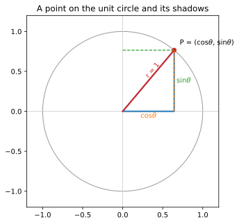

# ch01 — 三角形的搖籃，圓的真身：三角函數到底在描述什麼

> **本章解決什麼問題**：開全書的場。先把一句主張擺上檯面——三角函數不是三角形的學問，是旋轉與週期的語言；三角形只是它出生的搖籃，單位圓（unit circle）才是它的家。本章不教任何新公式，只做一件事：把你腦中那個「SOH-CAH-TOA、量量直角三角形」的舊圖像，翻轉成「一個點繞圓走、它的影子在牆上來回」的新圖像。這個視角翻轉是後面十四章的地基——弧度、和角公式、複數、波、傅立葉，全都站在它上面。本章是 Part I 的首章，所以也把全書地圖攤開給你看。

```
Part I 搖籃與真身 ◄你在這裡  Part II 旋轉是母題       Part III 複數：旋轉的代數
ch01 三角形→圓的真身     ch04 和角公式            ch07 複數平面=旋轉+縮放
ch02 弧度            →   ch05 旋轉矩陣        →   ch08 Euler 公式 ★
ch03 單位圓：六函數的家  ch06 點積與投影          ch09 de Moivre 與單位根
                                                        │
                                                        ↓
Part V 近親與收官        Part IV 週期與波
ch14 反函數與 atan2  ←   ch13 傅立葉的門口    ←   ch10 波的解剖（相量）
ch15 雙曲孿生＋收官 ★    ch12 疊加：拍頻/Lissajous  ch11 為什麼 sin′=cos
```

這張地圖你會在每個 Part 的首章再看到一次，每次「◄你在這裡」會移到不同格子。先不用記住路線，只要記住一件事：所有格子都連到同一個母題——**旋轉**。

在我們動身之前，先把全書要交付給你的東西講清楚。讀完這十五章，你應該能對另一個工程師（不必是數學家，一個願意聽十分鐘的同事就好）把下面六件事用自己的話講清楚。這是全書的驗收標準，ch15 會逐條口試：

1. 三角函數真正在描述什麼（旋轉與週期），三角形為什麼只是搖籃；
2. 單位圓為什麼是「家」、弧度為什麼是「自然」的角度單位；
3. 為什麼**恆等式都有來源**（和角公式 = 旋轉相疊），不必背；
4. 複數（complex number）乘法 = 旋轉加縮放，Euler 公式 e^{iθ}=cosθ+i·sinθ 從旋轉這一側看是什麼意思；
5. 一個波的解剖（振幅、頻率、相位）與「sin′=cos 因為旋轉的速度還是旋轉」；
6. 為什麼「任何週期訊號 = 一堆旋轉的圓疊起來」（傅立葉的門口），以及這在你的技術棧裡藏在哪。

這六條看起來跨度很大——從國中的直角三角形一路到傅立葉。但它們其實是同一個故事的六個段落，主角自始至終只有一個：**繞圓的那個點，和它投在牆上的影子**。

## 從你已知的出發

你其實每天都在用三角函數，只是它藏在 API 後面，你沒注意到它在那。

你在遊戲後端寫過 sprite 轉向。角色面朝某個方向，你給它一個角度 θ，它就走到對應的位置——`x = cos θ`、`y = sin θ` 乘上速度。你沒去想「這是直角三角形的對邊比斜邊」，你想的是「角度 → 位置」。這個直覺**已經是對的**：你腦中的 sin/cos 不是三角形的邊比，是「轉到某個角度，會落在哪個座標」。本書要做的，就是把你這個工程直覺扶正，告訴你它才是主定義，國中那個「對邊／斜邊」反而是特例。

你也被 deg/rad 坑過。某次把 `90`（你想的是度數）丟進 `Math.sin`，得到 `0.8939…` 這種莫名其妙的數，debug 半天才發現 `Math.sin` 吃的是弧度（radian），`Math.sin(Math.PI/2)` 才是 1。這個坑 ch02 會正式處理——它不是 API 設計者找你麻煩，是因為弧度才是「自然」的角度單位，度數是巴比倫人留下來的方便約定。

你還見過 cosine similarity。兩個 embedding 向量「方向有多像」，你算的是 `dot(a,b) / (|a||b|)`，那個結果就是夾角的 cos。你知道 1 是同向、0 是垂直、−1 是反向，但你大概沒推過為什麼點積（dot product）會等於 `|a||b|cosθ`。ch06 會把這條補上，而且你會發現它和本章的「影子」是同一件事。

還有監控曲線的日週期、週週期；交流電；音訊的音高就是頻率；你寫過的 cron 週期、相位回繞——任何「規律重複」「會繞回來」的東西，背後都有 sin/cos。GPS 定位的本質是測距與測角（三角測量），你手機裡那顆晶片可能正用一個叫 CORDIC（1959 年公開，ch14 會提）的演算法，靠「一連串小旋轉」算出 sin/cos——三角函數就是旋轉，連矽晶片都這樣算。

這些你都碰過。本書不是教你新東西，是把你已經在用、卻沒串起來的這些直覺，串成一條線：**它們全是「旋轉」這一件事的不同講法。**

## 三角學的出生現場：先有圓，才有三角形

我們先回到起點，因為起點本身就是本書論點的史實根。

很多人以為三角學是從「量地、蓋房子的直角三角形」長出來的。不是。三角學的出生現場是**天文台**，它要解的問題是：天上那兩顆星之間隔多遠？月亮離我們多遠？船在大海中央，怎麼靠星星定位？這些都不是「量一個你手邊的三角形」，而是「量一個你構不到的、攤在天球上的大圓上的弧」。

已知最早的工具不是 sine，是**弦（chord）**。希臘天文學家喜帕恰斯（Hipparchus，約西元前 190–120）約於西元前 150 年（年份坊間有「約前 150」「約前 140」兩說）製作了已知最早的弦表。他被不少人稱作「三角學之父」——理由值得你停一下：不是因為他發明了 sin，而是因為他**第一個把『角度』和『一段量』系統地列成一張表**，讓你查一個角，就讀出對應的長度（2026-06 查證）。這個「角度 → 長度」的對應表，就是三角函數的祖宗。喜帕恰斯的原表（據說十二卷）已佚失。

什麼是弦？想像一個圓，圓心拉出兩條半徑，夾一個角 θ，這兩條半徑碰到圓周的兩個點，連起來的那條直線段，就是「角 θ 所對的弦」chord(θ)。托勒密（Ptolemy，約西元 2 世紀）在《天文學大成》（Almagest）第一卷第 11 章給出更完整的弦表：角度從 0.5° 到 180°、間距 0.5°，半徑取 60（六十進位）。

請特別注意這件事：**早期三角學的基本量，是圓上一段弧所對的弦。起點就是圓，不是直角三角形。**弦和我們今天的 sine 是什麼關係？一條算式就講完：

```text
chord(θ) = 2·sin(θ/2)        ← 在半徑 1 的圓上
```

為什麼？把圓心到弦的中點拉一條垂線，它會把那個等腰三角形（兩腰是半徑）平分成兩個直角三角形，每個的頂角是 θ/2、斜邊是半徑 1，對邊是半條弦。所以半條弦 = sin(θ/2)，整條弦 = 2·sin(θ/2)。

自我複核一下：取 θ=60°，chord(60°) 在單位圓上應該等於 2·sin(30°) = 2·(1/2) = 1。而 60° 所對的弦，兩個端點和圓心剛好構成一個正三角形（兩腰都是半徑 1、夾角 60° 的等腰三角形，頂角 60° 就逼出另兩角各 60°），所以弦長正好等於半徑 1。對得上。

托勒密那張表的精度，以今天的標準看都很驚人（與真值的均方根誤差約 0.000136，2026-06 查證）。但重點不是精度，是**他們的世界裡，這些量天生長在圓上**。後來印度數學家阿耶波多（Aryabhata，476–550）做了一個關鍵的偷懶：與其列「整條弦」，不如直接列「半條弦」——半弦就是我們今天的 sine。他在《Aryabhatiya》（成書 499 年）裡列出史上第一張正弦表。從「整弦」到「半弦」這一步，sine 才正式登場。

> **一個你會在 ch03 聽到的詞源伏筆**：「sine」這個字本身就是一連串誤讀的化石。梵文 jyā 本義「弓弦」，阿拉伯人音譯成 jiba，因阿拉伯文常省母音只寫子音 jb，後人讀成了 jaib（意為「灣／衣襟褶／胸懷」），12 世紀拉丁譯者再把 jaib 意譯成 sinus——於是「弓弦」變成了「海灣」。誰在傳抄中讀岔的（阿拉伯人或歐洲譯者），史料兩說並存（2026-06 查證），ch03 細講。這裡先記住：連名字都在提醒你，sine 原本是「圓上的一段弦」。

歷史說完，記住一句就好：三角學是從「量圓上的弧與弦」出生的。直角三角形是後來才被請進來幫忙算的工具——是搖籃，不是家。

## SOH-CAH-TOA 的侷限：它只活在一個很小的盒子裡

現在輪到你最熟的那個東西。SOH-CAH-TOA——sin = 對邊／斜邊（Opposite/Hypotenuse）、cos = 鄰邊／斜邊（Adjacent/Hypotenuse）、tan = 對邊／鄰邊（Opposite/Adjacent）。這是個 20 世紀的教學記憶術（在印刷品中至遲 1944 年已出現，沒有單一發明人，2026-06 查證），純粹是幫學生背比例的口訣，和三角學的數學本質沒什麼關係。它很好用，但它有個你可能沒意識到的牢籠。

**SOH-CAH-TOA 只活在直角三角形裡，而直角三角形的銳角只能介於 0° 和 90° 之間。**

這不是吹毛求疵。你想想：一個直角三角形，直角佔掉一個角，剩下兩個角加起來必須是 90°，所以每個銳角都嚴格大於 0°、小於 90°。在這個框架下：

- **sin(0°) 是什麼？** 對邊長度為 0 的「三角形」根本不是三角形，它塌成一條線了。
- **sin(120°) 是什麼？** 一個鈍角放不進直角三角形——它根本配不出一個直角三角形讓你量。
- **sin(−30°) 是什麼？** 負的角度？三角形的邊長沒有負數。
- **轉了一整圈、轉了三圈半，又是什麼？** SOH-CAH-TOA 連「角度可以一直加上去」這個念頭都容不下。

你寫程式時 `Math.sin` 顯然能吃 `120°`、`−30°`、`720°`，而且回得出有意義（還有正負號）的數。這代表你每天在用的 sin，**早就不是 SOH-CAH-TOA 那個 sin 了**。你用的是一個定義域涵蓋所有實數、會週期重複、有正負號的函數。SOH-CAH-TOA 那個只是它在 (0°, 90°) 這一小段上的影子。

問題來了：那個「能吃任何角度、會週期、有正負」的 sin，它的主定義到底是什麼？答案就是下一節——也是這本書真正的開場。

## 視角翻轉：把直角三角形塞進單位圓

這一節值得你停十分鐘，把那張圖在腦裡轉一遍。本章的情緒核心就在這裡，我會講慢一點。

拿一個半徑為 1 的圓，圓心放在座標原點 (0, 0)。這就是**單位圓**。現在從圓心拉一條半徑出去，和正 x 軸夾一個角 θ（逆時針方向為正，這是全書的約定，請現在就記住）。這條半徑碰到圓周的那一點，叫它 P。

P 落在哪裡？它的座標是什麼？

先用你熟的 SOH-CAH-TOA 算一次。從 P 往 x 軸拉一條垂直虛線，垂足在 x 軸上。現在你有一個直角三角形：

- **斜邊**：圓心到 P，長度就是半徑 = **1**。
- **對邊**（對著角 θ 的那條，也就是 P 的高度）：根據 SOH，sin θ = 對邊／斜邊 = 對邊／1 = 對邊。所以**對邊長 = sin θ**。
- **鄰邊**（貼著角 θ 的那條，也就是垂足到原點的水平距離）：根據 CAH，cos θ = 鄰邊／斜邊 = 鄰邊／1 = 鄰邊。所以**鄰邊長 = cos θ**。

把它寫下來，慢慢看：

```text
斜邊 = 半徑 = 1
P 的高度（縱座標 y） = 對邊 = sin θ
P 的水平位置（橫座標 x） = 鄰邊 = cos θ

所以        P = (cos θ, sin θ)
```

**就是這一步。整本書的轉軸就是這一行。**

剛剛還是「對邊除以斜邊」的比值 sin θ，現在因為斜邊 = 1，分母消失了，sin θ **直接變成 P 的縱座標**。cos θ 直接變成 P 的橫座標。

換句話說——

> **sin 與 cos 不再是邊長比，它們是圓上一點的座標。**

一旦你接受這個視角，那個牢籠就拆掉了。因為「圓上一點的座標」這個說法，**完全不需要直角三角形**：

- θ = 0°？P 在 (1, 0)，cos 0° = 1、sin 0° = 0。沒問題，圓上真有這個點。
- θ = 90°？P 轉到正上方 (0, 1)，cos 90° = 0、sin 90° = 1。
- θ = 120°？P 轉進第二象限，橫座標變負（cos 120° < 0）、縱座標還是正。鈍角？單位圓眼睛都不眨。
- θ = −30°？逆時針的相反，順時針轉，P 落到 x 軸下方，sin(−30°) = −1/2，自然帶負號。
- θ = 720°？繞兩整圈回到 (1, 0)，和 θ = 0° 同一點。**這就是週期性**——sin、cos 每隔 360°（後面會說是 2π）重複一次，因為點繞回了同一個地方。

你看，SOH-CAH-TOA 那一堆「破功」的情況，在單位圓上全都自然成立。不是因為我們發明了什麼新規則去硬補，而是因為**單位圓本來就是 sin/cos 的家**，三角形只是它小時候待過的搖籃。角度可以無限轉下去，因為點可以無限繞下去。

這就是我認為值得你停下來的一步：你以為單位圓是 SOH-CAH-TOA 的「應用」或「進階版」，其實**順序反過來**——單位圓是主定義，SOH-CAH-TOA 是它困在第一象限那一小段時的化石記憶術。



## 影子：本書最重要的一個隱喻

現在把這個圖再推一步，請出本書從頭貫穿到尾的隱喻。

想像 P 不是靜止的，而是**等速繞著單位圓逆時針轉**。θ 隨時間增加，P 一圈一圈轉個不停。

現在打一盞燈。從正上方往下照，P 在 x 軸（地板）上會投下一個影子，這個影子的位置就是 cos θ。隨著 P 繞圈，這個影子在地板上**左右來回滑動**——滑到最右邊（cos = 1），停一下，滑回來，穿過原點，滑到最左邊（cos = −1），再回來。它永遠在 −1 和 +1 之間來回，不快不慢有節奏。

從旁邊水平照，P 在 y 軸（牆）上投下另一個影子，位置是 sin θ，它在牆上**上下來回**，同樣在 −1 和 +1 之間。

**這個來回滑動的影子，如果你把它隨時間畫出來，就是一條正弦波（sine wave）。**

旋轉（圓上勻速繞圈）和振盪（影子來回擺動）是**同一件事的兩個視角**：一個從正面看是圓，從側面看就是波。圓周運動投影到一條軸上，就是簡諧振盪；簡諧振盪「立起來」看，就是圓周運動。

這就是為什麼「量三角形」的工具，能搖身一變成為「描述一切會轉、會週期重複的東西」的通用語言。彈簧的上下振動、聲波的疏密、交流電的正負、你監控圖上的日週期流量——它們全是某個「在轉的東西」的影子。等你走到 ch10，我們會給這支旋轉的箭頭一個正式的名字：相量（phasor）。到 ch13 的傅立葉，我們會說：任何複雜的週期訊號，都是一大堆不同速度、不同大小的旋轉箭頭，它們的影子疊加起來的結果。

但那些都是後話。本章你只要把這個畫面焊進腦子：

> **sin 與 cos，是一個點繞圓時投在牆上的影子。**

如果這本書只能帶走一句，就是這句。其餘十四章都是在把這句話講細、講透、講到能算。

## Worked example：50 公尺外的塔，兩種看法

光講隱喻不算數，來算一個具體的、帶數字的例子，而且要算兩次——一次用搖籃（三角形），一次用家（圓）——讓你親眼看到是同一個 sin。

**題目**：你站在離一座塔底 50 公尺的地方，抬頭看塔頂，仰角（視線與水平的夾角）是 30°。塔有多高？（假設你的眼睛貼著地面，先不管身高。）

**第一種看法：直角三角形（你的舊工具）**

畫一個直角三角形：底邊是你到塔底的水平距離 50 m，高是塔高 h（這是我們要求的），底角是仰角 30°，塔底那個角是直角。

對 30° 這個角來說，塔高 h 是**對邊**，水平距離 50 是**鄰邊**。對邊配鄰邊，用 tan（TOA）：

```text
tan 30° = 對邊 / 鄰邊 = h / 50

⇒ h = 50 · tan 30°
```

tan 30° 是多少？從特殊角（ch03 會從幾何推出來，這裡先用結果）：

```text
tan 30° = sin 30° / cos 30° = (1/2) / (√3/2) = 1/√3 = √3/3 ≈ 0.57735
```

所以：

```text
h = 50 · (1/√3) = 50/√3 ≈ 50 / 1.73205 ≈ 28.87 公尺
```

自我複核：50/√3，把分母有理化是 50√3/3 = 50·1.73205/3 ≈ 86.6025/3 ≈ 28.87。兩種算法一致，塔約 **28.87 公尺**高。（用計算機直接按 50·tan(30°) 也得 28.867…，對得上。）

**第二種看法：同一個 30°，畫進單位圓**

現在把這同一個 30°，從正 x 軸逆時針量進單位圓。圓上那一點 P 的座標是：

```text
P = (cos 30°, sin 30°) = (√3/2, 1/2) ≈ (0.86603, 0.5)
```

看那個縱座標：**sin 30° = 1/2 = 0.5**。這就是剛剛塔那題裡，如果斜邊（你的視線）長度是 1 的話，塔頂的高度。塔那題的斜邊不是 1（是 50/cos30° 那麼長），所以實際高度被放大了；但「高度／斜邊 = sin 30° = 0.5」這個比例，和單位圓上 P 的高度 = sin 30° = 0.5，是**同一個 sin 30°**。

一個 sin 30°，在三角形裡是「對邊比斜邊」，在圓裡是「那一點的高度」。同一個數，兩種看法。三角形把斜邊縮放到任意長度，圓把斜邊固定成 1——固定成 1，比值就退化成了座標。這就是 ch03 會反覆用的招數。

**懸念收尾**：那如果仰角不是 30°，而是 120° 呢？三角形那邊立刻當機——你沒辦法用一個 120° 的銳角去配直角三角形。但圓那邊眼睛眨都不眨：P 轉到第二象限，cos 120° = −1/2（橫座標變負，跑到原點左邊），sin 120° = √3/2（高度還是正的）。圓接得住,三角形接不住。這個「接得住超過 90°」的能力，正是 ch03 要正式交付給你的——六個函數真正的家。

## 直覺的陷阱

這是本書的招牌段落（故障視角的數學版）：一個概念**最常被誤解成什麼**、錯誤直覺**會在哪一步把你帶溝裡**、**怎麼自我察覺**。本章談的是「三角函數的真身」這件事上最容易卡住的幾個地方。

| 錯誤直覺 | 它會在哪裡把你帶溝裡 | 自我察覺的徵兆 |
|---|---|---|
| 「三角函數就是三角形的學問」 | 一旦遇到負角、超過 90°、繞圈、週期，你的腦子就沒圖可用，只好硬背公式表——背了又忘，因為沒有圖撐著 | 你發現自己在「記」sin 的性質（奇函數、週期 2π…）而不是「看」出來；該回去看單位圓 |
| 「sin θ 是一個比值」 | 你會卡在「比值怎麼會有負號」「比值怎麼會週期重複」——比值是純量、沒有方向感 | 你對 sin(−30°)=−1/2 的負號感到意外。徵兆：你沒在用「座標有正負」這個圖像 |
| 把度數丟進 `Math.sin` | `Math.sin(90)` 給你 0.894 而不是 1，整個計算靜默地錯掉，不報錯，最難 debug | 結果「差不多對但就是不對」、或週期看起來被拉長／壓縮了 57 倍——ch02 正式處理 |
| 「sin(a+b) = sin a + sin b」 | 你會把「角度相加」錯當成「函數值相加」。反例：sin(90°+90°)=sin180°=0，但 sin90°+sin90°=2，差了十萬八千里 | 任何時候你想把 sin 拆進括號裡——sin 不是線性的；正確的拆法是和角公式（ch04） |
| 「影子隱喻只是比喻、不能拿來算」 | 你以為「繞圓的影子」只是教學用的軟性說法，於是錯過它其實是嚴格定義——P=(cosθ,sinθ) 字面上就是座標 | 你把影子當「直覺輔助」而非「主定義」；其實它就是定義本身 |

最值得提防的是第一個和第四個。第一個是本書要拆的整個舊框架；第四個（sin 不是線性的）是後面學和角公式時最常見的絆腳石——你的工程腦習慣了「線性可拆」（`f(a+b)=f(a)+f(b)`），但 sin 偏偏不是這種函數，它「可拆」的方式是旋轉的合成，不是加法的分配。先在這裡記一筆。

## 紙上推演

動手做。本章三題，先自己想，再看解答。

---

**推演 1 ★ [10 分鐘]｜把三角形重畫成圓上的點**

給你一個直角三角形：斜邊長 5，一個銳角 θ 滿足 sin θ = 3/5、cos θ = 4/5（沒錯，就是 3-4-5 直角三角形）。請：(a) 在單位圓上找出對應 θ 的那一點 P 的座標；(b) 說明為什麼原三角形的斜邊是 5，但圓上的對應點只跟比例 3/5、4/5 有關，和「5」這個絕對長度無關。

---

**推演 2 ★★ [15 分鐘]｜SOH-CAH-TOA 在哪三種情境會破功**

列出 SOH-CAH-TOA（直角三角形版的 sin/cos/tan）會破功的三種具體情境，每種給一個明確的角度當例子，並說明「破功」的確切原因——不要只說「角度太大」，要說清楚是三角形的哪個性質擋住了。

---

**推演 3 ★★ [15 分鐘]｜用「影子」向只懂國中數學的人解釋 sin**

口頭題。假設對象是一個只學過國中數學（知道座標、知道圓、沒學過 SOH-CAH-TOA 以外的三角）的人。請用「繞圓的點」和「影子」這兩個詞，在不寫任何公式的前提下，講清楚 sin θ 是什麼、為什麼它會在 −1 和 +1 之間來回、為什麼它會週期重複。講完錄下來或寫成逐字稿，自己聽一遍——卡住的地方就是你還沒真懂的地方。

---

### 推演解答

**推演 1 解答**

(a) 單位圓上的對應點 P，定義就是 P = (cos θ, sin θ) = (4/5, 3/5) = (0.8, 0.6)。

複核它真的落在單位圓上：(4/5)² + (3/5)² = 16/25 + 9/25 = 25/25 = 1 ✓。落在半徑 1 的圓上,沒問題。（這個 `cos²θ + sin²θ = 1` 不是巧合，它就是單位圓方程 x²+y²=1 的直接後果，ch03 會正式講——這是畢氏定理穿了件三角函數的外衣。）

(b) 關鍵在於：把原三角形「縮放」到斜邊為 1，所有邊都除以 5——對邊 3→3/5，鄰邊 4→4/5。sin θ = 對邊／斜邊 = 3/5，這個比值在縮放時分子分母同除以 5，**比值本身不變**。單位圓固定斜邊 = 1，等於替你做了這個縮放，於是比值直接變成了座標。原三角形是斜邊 5 還是斜邊 500，θ 這個角不變，圓上的 P 就不變——因為 sin/cos 描述的是**角度（方向）**，不是長度。這正是「sin/cos 是旋轉的語言」的第一個徵兆：它們只在乎你轉到哪個方向，不在乎你站多遠。

**推演 2 解答**

三種破功情境（你的答案只要抓到「為什麼」對就行，例子可不同）：

1. **零角與直角邊界，θ = 0° 或 θ = 90°**：直角三角形的銳角必須嚴格大於 0° 且小於 90°（因為直角已佔 90°，兩銳角和必為 90°）。θ=0° 時對邊塌成 0、三角形退化成一條線；θ=90° 時這個角自己變成直角，配不出來。破功原因：直角三角形的角度天生被鎖在開區間 (0°, 90°)。

2. **鈍角，θ = 120°**：鈍角放不進直角三角形（一個三角形最多一個角 ≥ 90°，若它是 120° 就不可能再有直角）。破功原因：直角三角形容不下第二個非銳角。但單位圓上 120° 對應 P=(−1/2, √3/2)，cos 帶了負號——而三角形的邊長沒有負數，這也是三角形版根本表達不出「cos 為負」的原因。

3. **負角或超過一圈，θ = −30° 或 θ = 405°**：三角形的角度沒有方向（沒有「逆時針才算正」這回事），也沒有「轉超過一圈」的概念。破功原因：SOH-CAH-TOA 只給「比值大小」，丟掉了「轉向」與「圈數」這兩個資訊，而那正是旋轉與週期的核心。

共同的病根：SOH-CAH-TOA 把 sin/cos 當成「靜態的比值」，丟掉了「角度是一個會繞、有方向、可累積的旋轉量」這件事。

**推演 3 解答**（一個可接受的口述版本，給你對照）

「想像一個時鐘，但只有一根針，針尖固定長度，繞著中心轉。我們在針尖貼一個小燈泡，然後從正旁邊用一道水平光照它，看它在右邊牆上的影子停在多高。針指向正右邊時，影子在中間高度，我們叫它 0；針轉到正上方時，影子升到最高，我們叫它 1；針轉到正下方，影子降到最低，我們叫它 −1。針一直轉，影子就一直在最高和最低之間上上下下。sin（這個角度）就是『針轉到這個角度時，影子的高度』。它永遠在 −1 和 +1 之間，因為影子不可能超出針尖能到的最高最低點；它會週期重複，因為針每轉一整圈,影子就回到同一個高度,故事重來一遍。」

如果你講的時候忍不住想說「對邊除以斜邊」，那就是舊框架還黏在你身上——這題的全部目的就是把它撕下來。

---

### 動手生圖

本章的圖就是本章的 Python 小實驗。下面這段腳本畫出單位圓、圓上一點 P=(cosθ, sinθ)、把座標投影到兩軸的虛線（那就是影子），並疊一個斜邊=1 的直角三角形。腳本即實驗：跑它、改它、重生那張圖。

```python
# ch01 figure: unit circle point P=(cos,sin) with axis-projection "shadows"
# overlaid on a right triangle whose hypotenuse = the radius = 1.
from pathlib import Path
import numpy as np
import matplotlib
matplotlib.use("Agg")          # headless; no display needed
import matplotlib.pyplot as plt

OUT = Path(__file__).resolve().parent / "out" / "ch01-circle-vs-triangle.svg"
OUT.parent.mkdir(parents=True, exist_ok=True)

theta = np.deg2rad(50.0)       # the angle; change this to move P around the circle
cx, cy = np.cos(theta), np.sin(theta)

fig, ax = plt.subplots(figsize=(5, 5))
t = np.linspace(0, 2 * np.pi, 400)
ax.plot(np.cos(t), np.sin(t), color="0.6", lw=1)          # the unit circle
ax.axhline(0, color="0.8", lw=0.8); ax.axvline(0, color="0.8", lw=0.8)

# right triangle: origin -> (cos,0) -> P -> origin; hypotenuse = radius = 1
ax.plot([0, cx, cx, 0], [0, 0, cy, 0], color="C0", lw=2)
ax.plot([0, cx], [0, cy], color="C3", lw=2)               # hypotenuse = 1
ax.plot(cx, cy, "o", color="C3")                          # the point P

# the "shadows": dashed projections onto both axes
ax.plot([cx, cx], [0, cy], "--", color="C1", lw=1.2)      # shadow onto x-axis
ax.plot([0, cx], [cy, cy], "--", color="C2", lw=1.2)      # shadow onto y-axis

ax.annotate("P = (cos$\\theta$, sin$\\theta$)", (cx, cy),
            textcoords="offset points", xytext=(8, 8))
ax.text(cx / 2, -0.08, "cos$\\theta$", ha="center", color="C1")
ax.text(cx + 0.03, cy / 2, "sin$\\theta$", va="center", color="C2")
ax.text(cx / 2 - 0.05, cy / 2 + 0.04, "r = 1", color="C3", rotation=np.rad2deg(theta))
ax.set_xlim(-1.2, 1.2); ax.set_ylim(-1.2, 1.2)
ax.set_aspect("equal")         # for circle/rotation figures, keep it round
ax.set_title("A point on the unit circle and its shadows")
fig.savefig(OUT, bbox_inches="tight")
print("wrote", OUT)            # build_figures.py reads this
```

**預期輸出**：終端機印出 `wrote .../figures/out/ch01-circle-vs-triangle.svg`，並在 `out/` 生成一張 SVG：一個灰色單位圓，圓上第一象限約 50° 處有一點 P，藍色直角三角形的兩股貼著兩軸、紅色斜邊就是半徑（長度 1），橘色與綠色虛線分別把 P 的橫縱座標打到 x 軸與 y 軸上——那兩段就是 cos θ 與 sin θ 的「影子」。

**改參數看什麼**：
- 把 `theta = np.deg2rad(50.0)` 改成 `120.0`：P 跑進第二象限，你會看到 `cos θ` 的影子落到原點**左邊**（負值）——三角形版表達不出來的負號，圓上一目瞭然。
- 改成 `-30.0`：P 落到 x 軸下方，`sin θ` 影子變負。
- 改成 `405.0`（= 360°+45°）：P 落在和 45° 同一個位置——這就是週期性，繞一整圈回到原點。
- 想看影子「動起來變成波」，把 theta 從 0 掃到 2π，記錄每個 cy 對時間畫出來——那就是 ch10 要做的事，正弦波就是這樣長出來的。

## 自我檢核

口頭自答。講得出來才算過關，講不清楚＝還沒懂。優先回答「為什麼」。

1. 用一句話說：三角函數真正在描述的是什麼？三角形在這個故事裡扮演什麼角色？
2. 為什麼說「單位圓是 sin/cos 的家、三角形只是搖籃」，而不是反過來？單位圓上 sin θ 和 cos θ 分別是什麼？
3. SOH-CAH-TOA 為什麼困在 0° 到 90°？舉一個它表達不出來、但單位圓輕鬆接住的具體角度，並說它在圓上落在哪。
4. 「影子」隱喻具體指什麼？一個繞圓的點，它的影子如何同時和 sin、和「波」扯上關係？
5. 為什麼 sin(a+b) ≠ sin a + sin b？舉一組具體角度讓這個錯覺爆掉。
6. 同一個 sin 30° = 1/2，在「直角三角形」和「單位圓」兩種看法下分別是什麼意思？為什麼是同一個數？
7. （回看地圖）這本書要帶你從「量三角形」走到「傅立葉」，串起這整條路的那個單一母題是什麼？

## 延伸閱讀

- **Eli Maor,《Trigonometric Delights》**（Princeton Science Library 版）——把三角函數當「值得欣賞的東西」而非考試工具來寫的科普經典，史與數交織，和本書的氣質最近。開頭幾章談 sine 的身世與弦表，正好補本章的歷史。（2026-06 確認存在）
- **3Blue1Brown,「Trigonometry fundamentals」（Lockdown Math ep. 2）**——影片把單位圓與「世界最有名的三角恆等式」用視覺講透。注意：3Blue1Brown 並沒有名為「Essence of trigonometry」的系列（常被誤傳），三角內容散在 Lockdown Math 與傅立葉影片裡。（2026-06 確認系列存在）
- **MacTutor History of Mathematics,「Trigonometric functions」條目**（mathshistory.st-andrews.ac.uk）——喜帕恰斯、托勒密、阿耶波多到伊斯蘭黃金時代的弦表→正弦表演化，學術可靠，本章歷史的查證來源之一。（2026-06 查證）
- **姊妹書《馴服無限：微積分的直覺與驚嘆》**——若你想先看「導數、極限、級數」那一側，它和本書互為鏡像；本書 ch11 證 sin′=cos、ch08 推 Euler 公式時會明確和它對帳「同一定理的兩個鏡頭」。
