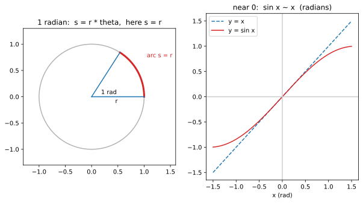

# ch02 — 弧度：為什麼用「半徑當尺」量角度才自然

> **本章解決什麼問題**：上一章我們把直角三角形塞進單位圓，sin、cos 從「邊長比」翻身成「圓上一點的座標」。但要談「轉了多少」，得先有一把量角度的尺。這章說的是：度數（degree）是一個方便但任意的約定，弧度（radian）才是圓自己長出來的尺——它讓弧長、扇形面積、小角近似、乃至往後 `sin′=cos`（ch11）通通變乾淨。弧度是整本書的預設單位；不先把它釘穩，後面每一條公式都會被一個醜常數 π/180 污染。下一章（ch03）才正式用單位圓把六個函數一次定義清楚。

## 從你已知的出發

你被弧度坑過。

幾乎每個寫過數值或圖形程式的人都有這一刻：你想畫一個轉 90° 的東西，於是寫下 `Math.sin(90)`，期待拿到 1。結果是 `0.8939966636...`。你盯著螢幕半秒，才想起來——`Math.sin`、`Math.cos`、`numpy.sin`、C 的 `sin()`、GPU shader 裡的 `sin()`，**全部吃的是弧度，不是度數**。`Math.sin(90)` 算的是「90 弧度」的正弦，那是繞了十四圈多以後某個莫名其妙的位置。正確寫法是 `Math.sin(90 * Math.PI / 180)`，或者乾脆一開始就用弧度思考。

這個坑不是程式語言設計者偷懶。剛好相反：它們**選了對的單位**，是我們的直覺還停在度數。遊戲裡角色的角速度寫成 `rad/s`、物理引擎的 `angularVelocity`、shader 裡的相位——底層全是弧度，因為只有弧度能讓微分、積分、級數展開保持乾淨。度數要乾淨，每一步都得拖著 π/180 這條尾巴。

這章要回答的就是：**為什麼是弧度？** 不是「弧度是另一種角度單位，背一下換算公式」這種應付答案，而是「弧度是圓拿自己的半徑當尺量出來的角度，所以它是圓的母語，度數才是外來語」。等你看懂了，`Math.sin(90)` 給出垃圾這件事就從「煩人的陷阱」變成「理所當然——你用外語對它講話，它當然聽不懂」。

## 度數的身世：方便，但任意

先說清楚度數錯在哪——它沒錯，它只是**任意**。

一整圈是 360°。為什麼是 360？這要回到巴比倫人（約西元前 2000 年起用六十進位）。主流解釋是幾個因素疊在一起，史學界並不能斬釘截鐵說哪個權重最大（2026-06 查證）：

- **天文巧合**：巴比倫人注意到太陽繞回起點大約要 360 天（一年約 365.25 天的方便近似）。把圓分成 360 份，太陽每天差不多走 1°——量天的人會喜歡這種對應。
- **六十進位**：他們用 base-60 記數，而 360 = 6 × 60，和進位制咬合得剛好。
- **整除性**：這是工程師最該欣賞的一點。360 有 **24 個因數**（1, 2, 3, 4, 5, 6, 8, 9, 10, 12, 15, 18, 20, 24, 30, 36, 40, 45, 60, 72, 90, 120, 180, 360），是「沒有比它小一半以內的數能有更多因數」的那種高度合成數。所以圓可以切成 2、3、4、5、6、8、9、10、12… 等份，每份都是整數度。半圓 180°、三分之一 120°、四分之一 90°、五分之一 72°——全是整數，不會冒出討厭的小數。

換句話說，360 是個**為了好分割而選的人造數字**。它服務的是「我要把圓切成幾塊、報出整數刻度」這件事。這在量天、航海、做地圖、刻度盤上非常實用，所以它活了四千年。

但請注意：360 這個數字裡，**沒有任何資訊來自圓本身的幾何**。換一個文明、換一套需求，這個數字完全可以是別的。法國大革命時期就推過「百分度」（gradian），把直角定為 100 grad、整圈 400 grad，理由是配合十進位。它沒能流行，但它存在這件事本身就證明了：**整圈該是多少「度」，是約定，不是發現。**

工程師對這種東西應該很敏感——這就像 port 號、HTTP 狀態碼、或某個只因為歷史因素而存在的 magic number。能用，但不是從第一性原理長出來的。

## 弧度的定義：讓圓拿自己的半徑當尺

那有沒有一個量角度的方法，是從圓本身長出來、不靠任何人造約定的？

有。看著一段圓弧，問一個問題：**這段弧有多長，相對於半徑？**

> 弧度的定義：一個圓心角的弧度數 = 它所對的弧長 ÷ 半徑。
>
>     θ (rad) = s / r        ← s 是弧長，r 是半徑

就這樣。沒有 360、沒有 100、沒有任何外來數字。我們只用了圓自己身上的兩個長度——弧長和半徑——相除。比值是無因次的（長度除以長度），所以弧度嚴格說不是一個「單位」，而是一個純數；寫 `rad` 只是提醒你「這個純數在當角度用」。

這個定義立刻給出幾個關鍵值，全部不必背、現推：

```text
整圈：    繞圓一週的弧長 = 圓周長 = 2πr
          θ = 2πr / r = 2π                  ← 整圈 = 2π rad
半圈：    弧長 = 半個圓周 = πr
          θ = πr / r = π                     ← 180° = π rad   ★這是換算的錨
直角：    θ = π/2 rad                        ← 90°
1 rad：   定義上就是「弧長剛好等於半徑」時的那個角
```

最後一行值得你停十分鐘，把它在腦裡轉一遍。**1 弧度，就是當你沿著圓周走過「剛好一個半徑那麼長」的弧時，所張開的那個角。** 它跟半徑多大無關——大圓小圓都一樣，因為定義是個比值。這是本章左圖要畫的東西。

那 1 rad 等於幾度？用 180° = π rad 這個錨換算：

```text
π rad = 180°
1 rad = 180° / π ≈ 180 / 3.14159 ≈ 57.2958°    ← 自我複核：180/π = 57.29578…
```

1 弧度 ≈ 57.2958°。這是個醜數字——故意的。**自然的單位在另一套單位底下看起來總是醜的。** 1 公尺等於幾「腳掌長」？也是個醜數字。弧度醜在度數的尺上，正因為它根本不是為了配合度數而生的；它配合的是圓。

我認為這是整章最該內化的一句話：**度數讓「整圈」漂亮（360 好分割），弧度讓「公式」漂亮（後面會看到）。** 兩者各自漂亮在不同的地方，而數學和物理在乎的是公式漂亮，所以選了弧度。

### 名字比概念晚了約一百六十年

順帶一個工程師會心一笑的歷史細節。弧度的**概念**——拿弧長與半徑之比當角的自然度量——一般歸給 Roger Cotes（科茨），約在 1714 年；有人說他「除了名字以外，把弧度的一切都描述清楚了」。

但 **radian 這個名字**，要到 1873 年 6 月 5 日才第一次出現在印刷品上：工程師 James Thomson（湯姆森，他是 Lord Kelvin 的哥哥，不是父親）在貝爾法斯特 Queen's College 出的一份考卷上用了它（他 1871 年就在用了）。差不多同時，Thomas Muir 在 1869 年還在 "rads"、"radials"、"radians" 之間猶豫，1874 年和 Thomson 商量後採用了 "radian"，理解成 "radial angle" 的縮寫（2026-06 查證）。

概念 1714、命名 1873——一個好東西被用了一百六十年才有正式的名字。這對寫過「那個我們一直叫它 `tmp` 的東西其實是核心抽象」的人來說，應該不陌生。

## 弧度的紅利之一：弧長與扇形面積變乾淨

定義的好處馬上兌現。既然 θ = s / r，反過來就是：

```text
弧長：     s = r · θ              ← θ 用弧度
扇形面積： A = ½ · r² · θ          ← θ 用弧度
```

`s = r·θ` 漂亮到近乎廢話——它根本就是定義移項。但你試試用度數寫同一條：

```text
弧長（度數版）：     s = r · θ° · (π/180)     ← 拖著 π/180 的尾巴
扇形面積（度數版）： A = ½ · r² · θ° · (π/180)
```

每一條都得乘 π/180。這個 π/180 不是物理，是「把外來單位翻譯回圓的母語」的匯率。用弧度，匯率是 1，翻譯免了。

扇形面積那條也值得一推，因為它不是定義移項。直覺：整圈（θ = 2π）的扇形就是整個圓，面積 πr²。扇形面積和圓心角成正比，所以：

```text
A / (πr²) = θ / (2π)        ← 扇形面積佔整圓的比例 = 角度佔整圈的比例
A = πr² · θ/(2π) = ½ r² θ    ← 弧度下，乾淨
```

**Worked example（弧長與扇形面積）**：半徑 r = 2、圓心角 θ = 1.2 rad。

```text
弧長：     s = r·θ = 2 × 1.2 = 2.4
扇形面積： A = ½·r²·θ = ½ × 4 × 1.2 = 2.4
```

弧長和面積數值都是 2.4——這是巧合（因為這裡 r = 2，恰好 ½r² = 2 = r，兩條公式的係數撞在一起了），不是通則，別被它騙了。換 r = 3、θ = 1.2 就分開：s = 3.6、A = ½×9×1.2 = 5.4。我故意留這個巧合在這裡，因為它正好示範了「自我複核」該有的警覺：兩個數一樣時，先問「是巧合還是我算錯了」，別急著高興。

## 弧度的紅利之二：小角近似 sin x ≈ x（這才是重頭戲）

弧長乾淨只是開胃菜。弧度真正的價值，是它讓三角函數在小角度時露出一個極漂亮的近似。

先看數字。基準表（landscape 已複核）：

```text
sin(0.1) ≈ 0.0998334       ← 0.1 是弧度
cos(0.1) ≈ 0.9950042
tan(0.1) ≈ 0.1003347
```

看 `sin(0.1) ≈ 0.0998334`。它和 0.1 只差 0.0001666。也就是說，當角度很小（用弧度量），**sin x 幾乎就等於 x 本身**。同樣地：

```text
sin x ≈ x              ← 小角，弧度
cos x ≈ 1 − x²/2       ← 小角，弧度
tan x ≈ x              ← 小角，弧度
```

驗一下 cos：`cos(0.1) ≈ 0.9950042`，而 `1 − 0.1²/2 = 1 − 0.005 = 0.995`。對到小數第三位才開始差。

為什麼「sin x ≈ x」這麼自然？回到本章的左圖（也是本章的程式實驗）。在單位圓（r = 1）上，角 x（弧度）對應的弧長就是 s = r·x = x。而 sin x 是這個角對應的那一點的**高度**（縱座標）。當 x 很小，那段弧幾乎是直的、幾乎貼著縱軸往上走，弧長（≈ x）和高度（= sin x）幾乎一樣長。角越小，弧越像一段垂直線段，sin x 越逼近 x。

這就是弧度的關鍵：**因為弧度把角度定義成弧長，sin x（高度）才能直接和 x（弧長）相比。** 換成度數，x 不再是弧長，這個「高度 ≈ 弧長」的對應就斷了，近似式裡會冒出 π/180。我們等一下用具體數字看這個災難。

「sin x ≈ x」是整個微積分裡三角函數能算導數的地基：`lim(x→0) sin x / x = 1`（ch11 會正式用到）。而這條極限**只在弧度下等於 1**。度數下它等於 π/180 ≈ 0.01745。同一條極限，換個單位就多出一個醜常數——這就是為什麼 `(sin)′ = cos` 只在弧度下乾淨（ch11 會從旋轉這一側正式補上證明，本章只負責說明「弧度讓它乾淨」）。

> 這裡先記一個伏筆：弧度的「兩個紅利」其實是同一件事的兩面——`sin x ≈ x` 和 `(sin)′=cos` 都來自「弧度讓弧長與高度可直接比較」。ch11 會把這條伏筆收掉。

### Worked example：小角近似誤差表（一步步算，自我複核）

近似總有誤差。問題是誤差掉得多快。理論上 `x − sin x ≈ x³/6`（這來自 sin 的級數 sin x = x − x³/6 + x⁵/120 − …，級數的嚴格層指向姊妹書《馴服無限》ch09；本章只用它的第一項當誤差估計）。我們用 x = 0.5、0.1、0.01 三個值逐列算（全部自己重算，不抄記憶）：

| x (rad) | sin x | x − sin x（實際誤差） | x³/6（誤差估計） |
|---|---|---|---|
| 0.5 | 0.4794255 | 0.0205745 | 0.0208333 |
| 0.1 | 0.0998334 | 0.0001666 | 0.0001667 |
| 0.01 | 0.0099998 | 0.000000167 | 0.000000167 |

讀這張表的方式：

- **x 從 0.5 縮到 0.1（縮 5 倍），誤差從 0.0206 掉到 0.000167（掉約 123 倍）。** 5³ = 125——誤差大致按 x 的**立方**縮小，和 x³/6 的預測吻合。
- **x = 0.01 時，誤差只有 1.67×10⁻⁷。** 對工程上絕大多數用途，`sin x = x` 在這個尺度下就是精確的。這就是為什麼擺鐘的小角近似（單擺週期公式）、光學的近軸近似、各種「角度不大」的物理模型，都直接把 sin θ 換成 θ——前提是 θ **用弧度**。
- 右邊兩欄越往下越貼合：x = 0.5 時 x³/6 估計（0.0208）比實際（0.0206）略大一點點（因為還有 +x⁵/120 這個正項把 sin 拉回來一些），但到 x = 0.01 已經完全對上。**誤差估計本身也是越小越準**——這是「估計的估計」要有的謙虛。

### 同一個 0.1，用「度」會怎樣：單位錯置的災難

現在把刀架在脖子上。假設你忘了 `Math.sin` 吃弧度，想算「0.1 度」的正弦，卻在腦裡用「sin x ≈ x」直接報 0.1。差多少？

`0.1°` 換成弧度是 `0.1 × π/180 ≈ 0.001745` rad。真正的值：

```text
sin(0.1°) = sin(0.001745 rad) ≈ 0.00174533
你以為的值（誤把 x≈sin x 套在度數上）：0.1
比值：0.1 / 0.00174533 ≈ 57.2958     ← 又是這個 57.2958！
```

你報的 0.1 比真值大了約 **57.3 倍**。而 57.2958 不是別的——正是 1 rad ≈ 57.2958° 那個換算因子（= 180/π）。這不是巧合：你把一個「度數」當成「弧度」餵進近似式，誤差因子當然就是兩者的匯率。

這就是文章開頭那個 `Math.sin(90)` bug 的近親。單位錯置不會丟出例外、不會 crash、不會紅字——它**靜悄悄地給你一個差了 57 倍的數**，然後你的物理模擬慢慢飄、你的動畫角度全錯、你的訊號相位整個歪掉。最危險的 bug 從來不是會爆的那種，是看起來「跑起來了」但數字悄悄錯掉的那種。

防禦只有一條，而且要刻進肌肉記憶：**角度進任何 `sin`/`cos`/`tan` 之前，先確認它是弧度。** 程式裡若一定要存度數，就在進函數前一刻顯式乘 `π/180`，並且讓變數名帶單位（`angleDeg` vs `angleRad`）。



## 直覺的陷阱

弧度看似簡單，但它埋的雷恰恰因為「看似簡單」而特別陰險。逐條列出最常把人帶溝裡的：

| 陷阱 | 錯誤直覺 | 會在哪一步爆掉 | 怎麼自我察覺 |
|---|---|---|---|
| **單位混用（頭號殺手）** | 「sin 就吃我給的角度數字」 | `Math.sin(90)` 不報錯，靜靜回 0.894（90 rad 的某個位置） | 結果差了約 57 倍，或數值「合理但不對」；養成習慣：進三角函數前先問「這是 rad 嗎」 |
| **小角近似用在度數上** | 「sin 小角 ≈ 角度本身」 | `sin(0.1°)` 你報 0.1，實際 0.001745，差 57.3 倍 | 近似式 `sin x≈x` 的「x」必須是弧度；度數版是 `sin θ° ≈ θ·π/180` |
| **弧度當成「有單位的量」去消去** | 「rad 是單位，可以像公尺一樣約分掉」 | 在量綱分析時亂消，或把 `rad/s` 當成能和 `1/s` 隨意互換 | 弧度是無因次純數（長度/長度）；`rad` 是提示標籤不是物理單位，但角速度的 `rad/s` 與頻率的 `Hz`(=1/s) 差一個 2π，不能直接劃等號 |
| **以為小角近似「角度越大越好用」** | 「反正是近似，大概對就好」 | x=0.5 時誤差已 2%，x=1 時 sin1≈0.841 而非 1，差 16% | 誤差按 x³/6 漲，記住「0.1 rad 量級才安全，0.5 已經要當心」 |
| **`s=rθ`、`½r²θ` 忘了 θ 必須是弧度** | 直接把度數代進去 | 弧長、面積全錯一個 π/180 因子 | 公式裡只要出現裸的 θ（沒乘 π/180），它就一定是弧度 |
| **整圈是 360 還是 2π 搞混** | 「2π ≈ 6.28，怎麼會是一整圈」 | 把 2π 當成某個小角，或把 π 當 180 個什麼 | π rad = 180° 是唯一要記的錨，其餘現推；2π ≈ 6.28 rad 就是整整一圈 |

最該內化的一條：**弧度的危險不在它難，在它和度數長得都像「一個角度的數字」，但餵進公式的後果天差地遠。** 一個是圓的母語，一個是外來語，中間隔著 π/180 這個匯率。

## 紙上推演

動手做。建議拿紙筆，別在腦裡硬幹——把弧長、半徑那幾個量畫出來。

### 推演題

**題 1 — 度數換弧度並驗證 s=r·θ** **[10 分鐘]** ★
把 30°、45°、90° 換成弧度。然後取一個半徑 r = 1 的圓，算這三個角各自對應的弧長 s，並用「弧長佔整個圓周的比例」反向驗證你的換算對不對。

**題 2 — 弧長與扇形面積** **[10 分鐘]** ★
一個半徑 r = 3、圓心角 θ = 1.2 rad 的扇形。算它的弧長 s 與面積 A。然後回答：如果有人用度數把 θ 寫成 1.2°（而不是 1.2 rad）代進 `s = r·θ`，他算出的弧長會錯多少倍？

**題 3 — 為什麼度數下 sin x ≈ x 不成立** **[15 分鐘]** ★★
用「弧度下 sin x（高度）≈ x（弧長）」這個幾何理由，解釋為什麼換成度數後，近似式必須改成 `sin θ° ≈ θ° · π/180`。用 θ = 0.1° 具體算給自己看，誤差是幾倍。口頭題：向一個只記得「sin 小角約等於角度」的同事，講清楚他漏了什麼前提。

### 推演解答

**題 1 解答。** 換算用 π rad = 180°，即「乘以 π/180」：

```text
30° = 30 · π/180 = π/6 ≈ 0.5236 rad      ← 自我複核：π/6 = 3.14159/6 = 0.52360 ✓
45° = 45 · π/180 = π/4 ≈ 0.7854 rad      ← π/4 = 0.78540 ✓
90° = 90 · π/180 = π/2 ≈ 1.5708 rad      ← π/2 = 1.57080 ✓
```

在 r = 1 的圓上，s = r·θ = θ（半徑是 1，弧長數值就等於弧度數）。所以：30° 的弧長 ≈ 0.5236、45° ≈ 0.7854、90° ≈ 1.5708。反向驗證——整個圓周長 = 2π ≈ 6.2832。

```text
30° 佔整圈 30/360 = 1/12，弧長應為 2π/12 = π/6 ≈ 0.5236   ✓ 對上
90° 佔整圈 90/360 = 1/4， 弧長應為 2π/4 = π/2 ≈ 1.5708     ✓ 對上
```

兩路一致。注意這裡藏著弧度為什麼自然的證據：在單位圓上，**角的弧度數 = 它的弧長**，連換算都省了。

**題 2 解答。**

```text
弧長：     s = r·θ = 3 × 1.2 = 3.6
扇形面積： A = ½·r²·θ = ½ × 9 × 1.2 = 5.4
```

（對照前文 r=2 的例子，那時 s 和 A 都是 2.4 是巧合；這裡 3.6 ≠ 5.4，巧合消失了，符合預期。）

若有人把 θ 誤當 1.2°（而非 1.2 rad）——其實他想代的「真正角度」是 1.2 rad，但若反過來想：1.2 rad 本身是 1.2 × 180/π ≈ 68.75°，是個不小的角。這題的陷阱要這樣看才清楚：`s = r·θ` 這條公式**只接受弧度**。如果你手上的角是「1.2 度」，正確弧長是 s = r × (1.2 × π/180) = 3 × 0.02094 ≈ 0.0628；但若你不換算、直接把 1.2 代進去，會得到 3.6——大了 `180/π ≈ 57.3` 倍。**任何把度數裸代進 `s=rθ` 或 `½r²θ` 的人，都會錯這個 57.3 倍因子。**

**題 3 解答。** 幾何理由：在單位圓上，角 x（弧度）對應的弧長正是 x（因為 s = r·x，r=1）。sin x 是那點的高度。小角時弧幾乎垂直、幾乎是直線，弧長 ≈ 高度，所以 sin x ≈ x。**這個對應的核心是「x 同時是角度也是弧長」——而只有弧度有這個雙重身分。**

換成度數，θ° 只是一個刻度數字，不再是弧長。要算弧長得先換算成弧度：弧長 = θ° · π/180。所以近似式必須寫成：

```text
sin(θ°) ≈ (θ° 對應的弧長) = θ° · π/180     ← 小角，度數版
```

具體：θ = 0.1°，π/180 ≈ 0.017453，所以 `sin(0.1°) ≈ 0.1 × 0.017453 = 0.0017453`。若你漏掉前提、直接報 0.1，就大了 `1/(π/180) = 180/π ≈ 57.3` 倍。

口頭版：「你那句『sin 小角約等於角度』漏了一個隱形前提——**角度要用弧度量**。在弧度下，角度數字剛好就是單位圓上的弧長，而 sin 是高度，小角時弧長和高度幾乎相等，所以才約等於。換成度數，數字不再是弧長，這個約等於就斷了，得補一個 π/180 的匯率。」

### 動手生圖

本章的程式實驗就是本章那張圖（圖即實驗）。左半邊把「1 弧度 = 弧長等於半徑」畫出來，右半邊把「sin x ≈ x」畫出來。完整腳本：

```python
# ch02 figure: 1 radian = arc length equals radius; sin x vs x near origin
from pathlib import Path
import numpy as np
import matplotlib
matplotlib.use("Agg")          # headless; no display needed
import matplotlib.pyplot as plt

OUT = Path(__file__).resolve().parent / "out" / "ch02-radian-and-smallangle.svg"
OUT.parent.mkdir(parents=True, exist_ok=True)

fig, (axL, axR) = plt.subplots(1, 2, figsize=(10, 5))

# --- Left: 1 radian = the angle whose arc length equals the radius ---
t = np.linspace(0, 2 * np.pi, 400)
axL.plot(np.cos(t), np.sin(t), color="0.7")          # full unit circle
arc = np.linspace(0, 1.0, 100)                       # arc from 0 to 1 rad
axL.plot(np.cos(arc), np.sin(arc), color="C3", lw=3) # the arc, length = r = 1
axL.plot([0, 1], [0, 0], color="C0")                 # radius along x-axis
axL.plot([0, np.cos(1)], [0, np.sin(1)], color="C0") # radius at 1 rad
axL.annotate("arc s = r", xy=(np.cos(0.5), np.sin(0.5)),
             xytext=(1.05, 0.75), color="C3")
axL.text(0.45, -0.12, "r")
axL.text(0.18, 0.05, "1 rad")
axL.set_title("1 radian:  s = r * theta,  here s = r")
axL.set_aspect("equal")        # keep the circle round
axL.set_xlim(-1.3, 1.6); axL.set_ylim(-1.3, 1.3)

# --- Right: y = sin x and y = x coincide near 0, then diverge ---
x = np.linspace(-1.5, 1.5, 400)
axR.plot(x, x, "--", color="C0", label="y = x")
axR.plot(x, np.sin(x), color="C3", label="y = sin x")
axR.axhline(0, color="0.8"); axR.axvline(0, color="0.8")
axR.set_title("near 0:  sin x ~ x  (radians)")
axR.set_xlabel("x (rad)"); axR.legend(loc="upper left")

fig.savefig(OUT, bbox_inches="tight")
print("wrote", OUT)            # build_figures.py reads this
```

**預期輸出**：終端機印出 `wrote .../figures/out/ch02-radian-and-smallangle.svg`，並生出一張左右兩欄的圖。左欄一個圓、一段粗紅弧（長度 = 半徑）夾在兩條半徑之間，張開約 57.3° 的角（這就是 1 rad）。右欄原點附近，紅線（sin x）和虛線（y=x）在中間幾乎黏在一起，往兩側 x 變大時紅線開始往內彎、落在虛線下方（因為 |sin x| < |x|，x≠0）。

**改參數看什麼**：

- 把右欄的 `x = np.linspace(-1.5, 1.5, 400)` 改成 `(-0.3, 0.3, 400)`——兩條線會幾乎完全重疊，肉眼分不出來，這就是「0.1 rad 量級下 sin x = x」的視覺證據。
- 反過來改成 `(-3, 3, 400)`，會看到 sin x 在 ±π/2 附近彎到頭、開始往回掉，而 y=x 一路往上衝——近似在大角度徹底失效，一目了然。
- 左欄把 `arc = np.linspace(0, 1.0, 100)` 的 `1.0` 改成 `np.pi`，紅弧會張成半圓（π rad = 180°）；改成 `2*np.pi` 就繞回整圈。用這個確認「弧長 = 弧度數 × 半徑」在不同角度都成立。

## 自我檢核

口頭自答，講得出來才算過。優先答「為什麼」。

1. 為什麼說 360° 是「方便但任意」的？至少講出兩個讓巴比倫人選 360 的理由，並指出這些理由裡哪一個都沒有用到「圓本身的幾何」。
2. 用一句話定義弧度，不准用「換算公式」帶過——要從「弧長與半徑」講。然後解釋為什麼這個定義跟半徑大小無關。
3. 1 rad ≈ 57.2958° 是個醜數字。為什麼一個「自然」的單位反而換算成度數時是醜的？這跟「公尺換腳掌長」是不是同一回事？
4. `s = r·θ` 為什麼只在 θ 用弧度時成立？如果硬要用度數，公式變成什麼？
5. 為什麼弧度下 `sin x ≈ x`？用「弧長」和「高度」這兩個詞，配著單位圓講清楚。
6. 小角近似的誤差大約按 x 的幾次方縮小？x 從 0.1 縮到 0.01，誤差大約縮小幾倍？（不用精確值，講量級）
7. `Math.sin(90)` 為什麼不是 1？如果你想要 90° 的正弦，正確該怎麼寫？這個 bug 為什麼比會 crash 的 bug 更危險？
8. （連到後面）為什麼說「弧度讓 `sin′=cos` 乾淨」？你不必證明（那是 ch11），但能說出「度數會多塞一個什麼常數進去」嗎？

## 延伸閱讀

- **3Blue1Brown，Lockdown Math ep. 2「Trigonometry fundamentals」**（系列頁 https://www.3blue1brown.com/topics/lockdown-math ）——三角基礎的視覺版，裡面對「角度該怎麼量」有很好的鋪陳；看他怎麼把弧度當成圓的自然語言來引入。（注意：3Blue1Brown **沒有**「Essence of trigonometry」這個系列，三角內容散在 Lockdown Math 與 Fourier 影片裡。）
- **MacTutor，"Earliest Known Uses of … (R)"**（https://mathshistory.st-andrews.ac.uk/Miller/mathword/r/ ）——查 "radian" 條，James Thomson 1873、Thomas Muir 的命名之爭原始出處就在這；想確認本章歷史細節的人可直接讀這一條。
- **Eli Maor《Trigonometric Delights》**（Princeton Science Library，ISBN 9780691202198）——一本三角的「欣賞」書，和本書同調；關於角度單位與三角早期史的章節值得對照著讀。
- **姊妹書《馴服無限》ch09**——sin x = x − x³/6 + … 的泰勒級數從哪來、為什麼第一項是 x（這正是本章「sin x ≈ x」誤差按 x³/6 縮小的嚴格來源）。本章只借用第一項當誤差估計，級數的收斂與嚴格層交給那本。
