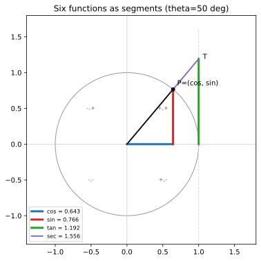

# ch03 — 單位圓：六個函數的家

> **本章解決什麼問題**：ch01 把直角三角形塞進圓、讓 sin/cos 從「邊長比」升級成「圓上一點的座標」；ch02 讓我們用弧度量角。這一章是 Part I 的收尾：把六個三角函數（sin、cos、tan、csc、sec、cot）全部安頓進單位圓這個「家」，從此它們不再是三角形的附屬品，而是同一張圓圖上六段可以親手量出來的線段。我們會把全書唯一的特殊角基準表**從幾何推出來**（不背），讓正負號、週期性、奇偶性自然落下——這張表與這套單位圓直覺，是 ch04 之後談旋轉、複數、波時反覆要回頭引用的地基。

## 從你已知的出發

你寫過 cron。`0 3 * * *` 是「每天三點」，狀態每隔 24 小時重複一次；你也處理過相位回繞——一個累加的角度跑到超過 360°（或 2π）就得 `angle % 360`，繞回原點重新算。時鐘的指針更直接：分針走到 12，不是「走完了」，而是又一圈的開始。這些東西有個共同骨架：**一個狀態沿著環形跑，每隔固定量回到起點。**

三角函數真正在描述的就是這件事。ch01 已經劇透過結論：sin 與 cos 是一個點繞圓時投在牆上的影子。但 ch01 為了講「視角翻轉」，只動用了 sin 和 cos 兩個函數。實際上學校教過你六個——sin、cos、tan，再加三個倒數版 csc、sec、cot——而當年它們是怎麼來的，多半是被當成「sin/cos 的組合，背起來就對了」。

這一章要做的事很簡單，但會改變你看它們的方式：**把六個函數全部畫回同一個單位圓上，讓你看見它們本來就是六段線段。** tan 是切線上的一段、sec 是割線上的一段——它們的名字（tangent / secant）不是抽象代號，而是字面意義上的「切線」與「割線」。這跟你在幾何裡看過的「切線只碰圓一點、割線穿過圓兩點」是同一個切線、同一個割線。當你看清這點，那些「背不起來的倒數函數」會突然變成圖上量得到的東西。

對你這種工程師背景，這一章還有一個附帶好處：特殊角表（30°、45°、60° 的 sin/cos/tan）我們**不發給你背**，而是從兩個你國中就會畫的直角三角形推出來，再用 `sin²θ + cos²θ = 1` 當單元測試自我複核。會推，就不會在半夜寫旋轉動畫時把 `cos30` 記成 `0.5`。

## 單位圓主定義：一切從這個點開始

先把家蓋好。畫一個半徑 1、圓心在原點的圓——這就是**單位圓（unit circle）**。從正 x 軸（角度 0 的方向）逆時針量一個角 θ，圓上對應的那個點，定義為：

```text
P = (cos θ, sin θ)        ← 這是全書 sin/cos 的主定義
```

橫座標叫 cos θ，縱座標叫 sin θ。就這麼一句話。不是「對邊比斜邊」，不是「鄰邊比斜邊」——而是**圓上一點的兩個座標**。為什麼這個定義比三角形版本強？因為三角形版本要求角在 0° 到 90° 之間（直角三角形裝不下鈍角），而圓上的點可以繞無限多圈、可以轉到第二三四象限、可以是負角。θ 想多大就多大，P 永遠在圓上有個明確位置，sin/cos 永遠有定義。三角形是搖籃，圓才是家。

這個定義立刻送你一條恆等式，而且是免費的。單位圓的方程就是 `x² + y² = 1`（圓心原點、半徑 1 的畢氏定理）。把 `x = cos θ`、`y = sin θ` 代進去：

```text
cos²θ + sin²θ = 1
```

這不是要你背的「三角恆等式」，這就是**單位圓上那點離原點距離 = 1** 這件事。圓上每一點到圓心都是一個半徑長，半徑是 1，所以橫縱座標的平方和永遠是 1。我認為這是整本書最該先內化的一句話：`sin²θ + cos²θ = 1` 不是公式，是畢氏定理穿了件三角函數的外衣。本章 worked example 會用它當每一格特殊角的驗算器。

那另外四個函數呢？先給代數定義（你看過），等一下我們把它們全變成圖上的線段：

```text
tan θ = sin θ / cos θ        ← 縱比橫，斜率
cot θ = cos θ / sin θ = 1/tan θ
sec θ = 1 / cos θ            ← secant，割線
csc θ = 1 / sin θ            ← cosecant，餘割線
```

`csc`、`cot` 是 `sin`、`tan` 的倒數，名字裡的 co- 表示「餘」（complementary，互餘角的版本）。記住這個分工就好：**sin / cos / tan 是主角，csc / sec / cot 是它們的倒數。** 接下來才是這章真正的看點——這六個全都是線段。

## 六個函數都是線段：tangent 真的是切線，secant 真的是割線

先講一段詞源，因為它直接洩漏了幾何。tangent 來自拉丁文 **tangere**，意思是「觸碰（to touch）」；secant 來自拉丁文 **secare**，意思是「切割（to cut）」。在幾何課裡你早就見過這兩個詞的另一半身分：**切線（tangent line）只碰圓一個點，割線（secant line）穿過圓切出兩個點。** 三角函數的 tan 和 sec，跟那個切線、那個割線，是同一回事——它們是這兩條線上量出來的線段長度。這不是巧合命名，是歷史的本來面目：六個三角函數最初都是天文學家在圓圖上量的**幾何線段**，不是三角形的邊比。

下面這張圖（程式生成）把它們畫在同一個第一象限的角 θ 上。請對著圖看下面的拆解。



**sin 與 cos：兩道影子。** 從圓上的點 P=(cos θ, sin θ) 往下打一條垂線到 x 軸，這條垂線的長度（P 的高度）就是 sin θ；P 到 y 軸的水平距離就是 cos θ。這正是 ch01 的「影子」隱喻：把單位向量 OP 照到 x 軸得 cos、照到 y 軸得 sin。原本三角形版本的「對邊 = sin、鄰邊 = cos」現在變成「縱影子 = sin、橫影子 = cos」——同一件事，換了個更能轉的視角。

**tan：切線上的那一段。** 在點 (1,0)（圓最右邊那點）畫一條**垂直的切線**，也就是直線 x = 1。這條線只碰圓一個點——它是字面意義的切線（tangere，觸碰）。現在把角 θ 的終邊（從原點射出、穿過 P 的那條射線）延長，讓它去撞這條切線，交點叫 T=(1, ?)。T 的高度是多少？終邊的斜率是 `sin θ / cos θ`，走到 x=1 時高度就是 `sin θ / cos θ = tan θ`。所以：

```text
tan θ = 切線 x=1 上，從 (1,0) 到終邊交點 T 的那一段長度
```

tan θ 就是那條切線段。難怪它叫 tangent。

**sec：割線上的那一段。** 同一張圖，看從原點 O 到交點 T 的整條斜線 OT——它從圓心出發、穿過圓（在 P 點），再延伸出去撞切線。這條穿過圓的線就是**割線（secare，切割）**。OT 這一段有多長？看直角三角形 O–(1,0)–T：底邊 = 1，高 = tan θ，斜邊 = OT。用畢氏定理：

```text
|OT|² = 1² + tan²θ
```

而從定義 `sec θ = 1/cos θ`，且這個直角三角形裡 `cos θ = 鄰邊/斜邊 = 1/|OT|`，所以 `|OT| = 1/cos θ = sec θ`。於是：

```text
sec θ = 割線 OT 的長度（從原點沿終邊到切線的那整段）
```

而且我們順手白賺一條恆等式。把 `|OT| = sec θ` 代回畢氏：

```text
sec²θ = 1 + tan²θ        ← 這就是 O-(1,0)-T 直角三角形的畢氏定理
```

這條跟 `sin²+cos²=1` 是一家人——它其實是 `sin²+cos²=1` 兩邊同除以 `cos²θ` 的結果（自己除一遍確認：`sin²/cos² + cos²/cos² = 1/cos²`，即 `tan² + 1 = sec²`）。所以你不用背 `sec²=1+tan²`，它要嘛從那個小直角三角形看出來，要嘛從畢氏恆等式除一下來。本書的招牌姿態：恆等式從來源推，不從記憶抄。

**cot 與 csc：餘的版本，畫在水平切線上。** cot 和 csc 是「co-」版本，把上面整套構造換到**頂端的水平切線 y=1** 重做一次：在 (0,1) 畫水平切線，終邊撞上去的交點到 (0,1) 的水平段是 cot θ，從原點到那個交點的斜段是 csc θ。對稱地也有 `csc²θ = 1 + cot²θ`。圖裡為了不擠成一團，主要畫 sin/cos/tan/sec 四段；cot/csc 你在腦裡把整張圖沿 45° 對角線鏡射一次就得到（這也正是「餘角」co- 的幾何意義：θ 與 90°−θ 互換，主函數與餘函數互換）。

歷史補一句：把 tangent、secant 這兩個名字正式引進三角學的，一般歸給丹麥數學家 Thomas Fincke，在他 1583 年的《Geometria rotundi》裡（書名直譯「圓的幾何」——名字就告訴你三角學的家在圓）；`sin`、`tan`、`sec` 這些縮寫也約在那本書前後定型（2026-06 查證；個別縮寫的最早出處在不同史料略有出入，此處不釘死單一歸屬）。順帶一提，「trigonometry」這個學科名要再等十二年，1595 年才由 Pitiscus 鑄造（見 ch01）。先有圓上的線段，才有「三角形度量」這個學科名——順序本身就是本書論點的旁證。

看點收束成一句話：**六個三角函數住在同一張單位圓圖上，每一個都是你能用尺量出來的一段線。** sin/cos 是影子，tan/sec 在右側垂直切線那組直角三角形上，cot/csc 在頂端水平切線那組上。它們不是六個要分開記的公式，是一張圖的六個部位。

## 四象限的正負號：看座標，不背口訣

學校多半教過「ASTC」口訣（All / Sin / Tan / Cos，第一到第四象限各誰為正），有人記成「All Students Take Calculus」。我建議你**把口訣丟掉**，因為單位圓主定義讓正負號變成「看座標的正負」這種不需要記的事。

P=(cos θ, sin θ)。cos θ 就是 P 的橫座標、sin θ 就是 P 的縱座標。座標的正負你閉著眼睛都知道：

```text
象限      點 P 落在哪       cos θ (橫)   sin θ (縱)   tan θ = sin/cos
─────────────────────────────────────────────────────────────────
第一象限  右上 (x>0,y>0)       +            +            +
第二象限  左上 (x<0,y>0)       −            +            −
第三象限  左下 (x<0,y<0)       −            −            +   ← 負/負=正
第四象限  右下 (x>0,y<0)       +            −            −
```

tan 的正負不用另外記，它是 `sin/cos`，照除法的正負規則走：第一象限正正得正、第三象限負負得正（所以 tan 在第一、三象限為正），第二、四象限一正一負得負。`sec=1/cos` 跟 cos 同號，`csc=1/sin` 跟 sin 同號，`cot` 跟 tan 同號——倒數不改變正負號。整套正負號就這樣從「P 落在哪個象限、座標是正是負」推出來，一個口訣都不用背。

這就是為什麼我認為 ASTC 是反教育的：它把一件「看圖就知道」的事包裝成要背的咒語。你只要在腦裡放一個單位圓，把 θ 的終邊掃到對應象限，看那點的 x、y 是正是負——答案自己跳出來。圖右下角的小副圖把四象限的 (cos, sin) 符號標好了，看一眼就懂。

## 特殊角從幾何推出來（本書唯一基準表）

現在是這章的重頭戲，也是全書反覆要回來查的**唯一基準表**。30°、45°、60° 的 sin/cos/tan，我不發給你背——我們從兩個你早就會畫的直角三角形推出來，再用單位圓把它們擺到正確的座標上。會推，這張表就永遠不會記錯。

### 45°：從等腰直角三角形（45-45-90）

畫一個兩股相等的直角三角形，兩股長都取 1。它的兩個銳角因為對稱必然各 45°。斜邊用畢氏定理：

```text
斜邊 = √(1² + 1²) = √2 ≈ 1.41421
```

在這個三角形裡，45° 角的對邊 = 1、鄰邊 = 1、斜邊 = √2。所以：

```text
sin 45° = 對邊/斜邊 = 1/√2 = √2/2 ≈ 0.70711
cos 45° = 鄰邊/斜邊 = 1/√2 = √2/2 ≈ 0.70711
tan 45° = 對邊/鄰邊 = 1/1 = 1
```

（`1/√2` 寫成 `√2/2` 只是把分母有理化：分子分母同乘 √2，得 `√2/2`。兩種寫法數值都是 0.70711，本書統一用 `√2/2`。）擺到單位圓上：45° 的點 P 落在第一象限對角線上，座標 `(√2/2, √2/2)`——橫縱相等，因為 45° 剛好把單位向量平分到 x、y 兩個方向。

### 30° 與 60°：從半個正三角形（30-60-90）

這個更漂亮。拿一個邊長 2 的**正三角形**（三個角都 60°），從頂點往底邊拉一條高。這條高把正三角形切成兩個全等的直角三角形，每個的角是 30°、60°、90°。看其中一個：

- 斜邊 = 原正三角形的邊 = 2
- 底邊（短的那條）= 原底邊的一半 = 1（高把底邊平分）
- 高 = 用畢氏：`√(2² − 1²) = √3 ≈ 1.73205`

於是這個 30-60-90 三角形的三邊是 **1（對 30°）、√3（對 60°）、2（斜邊）**。讀出函數值：

```text
sin 30° = 對邊/斜邊 = 1/2 = 0.5
cos 30° = 鄰邊/斜邊 = √3/2 ≈ 0.86603
tan 30° = 對邊/鄰邊 = 1/√3 = √3/3 ≈ 0.57735

sin 60° = 對邊/斜邊 = √3/2 ≈ 0.86603       ← 60° 的對邊是那條長的 √3
cos 60° = 鄰邊/斜邊 = 1/2 = 0.5
tan 60° = 對邊/鄰邊 = √3/1 = √3 ≈ 1.73205
```

注意 30° 和 60° 的 sin/cos 剛好互換：`sin 30° = cos 60° = 1/2`、`cos 30° = sin 60° = √3/2`。這不是巧合——它們是**互餘角**（30°+60°=90°），在那個直角三角形裡，一個角的對邊正好是另一個角的鄰邊。這就是「co-」（餘）的本意：`cos θ = sin(90°−θ)`。cosine 字面就是「complementary sine」，互餘角的 sine。

### 0° 與 90°：邊界（直接從圓上讀）

這兩個角三角形畫不出來（退化了），但單位圓上一目了然。0° 的點是 (1,0)：`cos 0°=1、sin 0°=0、tan 0°=0`。90° 的點是 (0,1)：`cos 90°=0、sin 90°=1`。tan 90° = `sin/cos = 1/0` —— 爆掉，無定義（後面〈直覺的陷阱〉會用切線段解釋它「爆」在哪）。

### 完整基準表

把上面推出來的擺成一張表。**這是全書唯一的特殊角基準表，後續任何章引用特殊角都以此為準，不得另創數字。**

```text
θ       弧度    sin θ        cos θ        tan θ
──────────────────────────────────────────────────────
0°      0       0            1            0
30°     π/6     1/2          √3/2         1/√3 = √3/3
                = 0.5        ≈ 0.86603    ≈ 0.57735
45°     π/4     √2/2         √2/2         1
                ≈ 0.70711    ≈ 0.70711
60°     π/3     √3/2         1/2          √3
                ≈ 0.86603    = 0.5        ≈ 1.73205
90°     π/2     1            0            無定義（tan 爆掉）
──────────────────────────────────────────────────────
基準常數：√2 ≈ 1.41421、√3 ≈ 1.73205、√2/2 ≈ 0.70711、√3/2 ≈ 0.86603
```

看這張表的兩條對稱，會比死背省力得多：

1. **sin 那一欄從上到下是 0、1/2、√2/2、√3/2、1**——分子像 √0、√1、√2、√3、√4 都除以 2（`√0/2=0`、`√1/2=1/2`、`√4/2=1`）。這是個漂亮的記憶橋（但記得它**來自**那兩個三角形，不是它本身是規則）。
2. **cos 那一欄是 sin 欄倒著讀**（1、√3/2、√2/2、1/2、0），因為 `cos θ = sin(90°−θ)`，角從小到大，餘角從大到小。

### 自我複核：每一格都過 sin²+cos²=1

本書規定所有數值要自己重算一遍。我們用單位圓送的免費恆等式 `sin²θ + cos²θ = 1` 當單元測試，逐格驗：

```text
30°：(1/2)² + (√3/2)² = 1/4 + 3/4 = 1            ✓
45°：(√2/2)² + (√2/2)² = 1/2 + 1/2 = 1           ✓
60°：(√3/2)² + (1/2)² = 3/4 + 1/4 = 1            ✓
0° ：0² + 1² = 1                                  ✓
90°：1² + 0² = 1                                  ✓
```

五格全過。`sin²+cos²=1` 是單位圓「半徑恆為 1」的化身，所以任何正確的 (cos, sin) 座標代進去都該得 1——這是你檢查特殊角有沒有記錯（或推錯）的最快單元測試。哪天你不確定 `cos30` 是 `√3/2` 還是 `√2/2`，平方加一下：`3/4+1/4=1` 過，`2/4+1/4≠1` 不過。表壞了，測試會抓到。

## 週期性與奇偶性：從圖上自然落下

把特殊角表蓋好之後，這章還剩兩個性質——而它們不用另外證，看單位圓就掉出來。

**週期性：sin、cos 週期 2π，tan 週期 π。** 角度 θ 加上 2π（轉一整圈），P 回到圓上同一個點，座標分毫不差，所以：

```text
sin(θ + 2π) = sin θ
cos(θ + 2π) = cos θ        ← 轉一圈回到原點，影子當然一樣
```

sin、cos 的**週期（period）是 2π**——這正是你 cron 的「每隔固定量重複」，只是固定量是「繞圓一整圈」。

但 tan 的週期是 **π**，不是 2π，這點很多人記不牢。為什麼是半圈就重複？從切線段看最清楚：tan θ 是終邊射線打到切線 x=1 的高度。現在把角加 π（轉半圈，180°），終邊指向**完全相反**的方向——但它所在的那條**直線沒變**（同一條過原點的直線，只是射線反了向）。同一條直線打到切線 x=1 的交點是同一個點，所以高度一樣，tan 值不變：

```text
tan(θ + π) = tan θ        ← 轉半圈，終邊所在的「直線」沒變，切線交點同一個
```

換個代數視角也對得上：轉半圈讓 sin 和 cos 同時變號（P 跑到對稱的另一側，`(cos, sin) → (−cos, −sin)`），而 `tan = sin/cos` 上下同時變號，負負抵銷——還是原值。所以 tan 半圈就重複，週期 π。我認為這是「從幾何看週期」勝過死背的典型例子：你不必記「tan 的週期是 π」，你只要記得「tan 是那條過原點直線的斜率，直線轉半圈疊回自己」。

**奇偶性：cos 偶、sin 奇，從鏡射看。** 把角取負（θ → −θ），相當於把 P 沿 x 軸往下鏡射。鏡射只翻縱座標、不動橫座標：

```text
橫座標不變 → cos(−θ) = cos θ        ← cos 是偶函數（對稱於 y 軸）
縱座標變號 → sin(−θ) = −sin θ       ← sin 是奇函數（對稱於原點）
tan(−θ) = sin(−θ)/cos(−θ) = −sinθ/cosθ = −tan θ   ← tan 也是奇函數
```

cos 偶、sin 奇、tan 奇。同樣不用背——「對 x 軸鏡射，x 不變 y 變號」是國中就會的事，cos 是 x（不變→偶）、sin 是 y（變號→奇）。這個性質在 ch10 解剖波形、ch13 談傅立葉展開（偶函數只需 cos 項、奇函數只需 sin 項）時會直接回收。

到這裡，六個函數的家蓋好了：主定義是圓上一點的座標、六函數是圖上六段線段、正負號看座標、特殊角從三角形推、週期與奇偶從圖上的轉圈與鏡射落下。ch04 開始，這個圓會開始**轉**——而你會發現旋轉才是這一切的母題。

## 直覺的陷阱

三角函數的經典誤解很多源於「還停在三角形視角、沒搬進圓」。這段把幾個最容易把你帶溝裡的列清楚。

| 陷阱 | 錯誤直覺長怎樣 | 會在哪一步爆掉 | 怎麼自我察覺 |
|---|---|---|---|
| **以為 sin/cos 只活在 0°~90°** | 還用「對邊/斜邊」想，遇到 120°、−30° 就卡住、覺得「沒有對邊」 | 任何鈍角、負角、繞圈角；ch04 之後全程 | 問自己：我能不能講出 120° 的點落在圓上哪、座標正負？講不出就還沒搬進圓 |
| **背 ASTC 卻忘了為什麼** | 死記「All-Sin-Tan-Cos」，但記混順序或記不得 tan 為何在第三象限為正 | 寫程式判正負、或被問「為什麼」時 | 改用「看 P 的座標正負、tan=sin/cos 照除法定號」——若你還在背口訣，就是沒內化 |
| **tan90° 當成一個很大的數** | 以為 `tan 90°` 是「很大但有限」 | 任何讓終邊垂直的角；數值計算會回 `inf` 或溢位 | 從切線段看：終邊垂直時平行於切線 x=1，**永遠交不到**，所以 tan 不是「很大」而是**無定義**（見下方紙上推演第 2 題） |
| **以為 tan 週期也是 2π** | 把 tan 跟 sin/cos 一律當 2π 週期 | 解 `tan θ = 1` 這類方程時漏掉一半的解（每 π 一個解，不是每 2π） | 記得 tan 是「過原點直線的斜率」，直線轉半圈疊回自己 → 週期 π |
| **把 csc/sec/cot 當全新東西背** | 覺得倒數函數是另一組要記的公式 | 一緊張就把 `sec` 配成 `1/sin`（其實是 `1/cos`） | 回到圖：sec 是割線段、跟 cos 同組（`sec=1/cos`）；csc 跟 sin 同組。記「s 配 c、c 配 s」反而易錯，回圖最穩 |
| **混淆 sin θ² 與 sin²θ** | 把 `sin²θ` 看成「sin 的 θ 平方」 | 代值算恆等式時 | `sin²θ` = `(sin θ)²`（先取 sin 再平方）；`sin(θ²)` 才是先平方再取 sin。本書一律 `sin²θ` 指前者 |

最危險的一個，是第一個：**還停在三角形視角。** 它不會立刻報錯，而是讓你在 ch04 之後每一步都隱隱卡住——因為旋轉、複數、波全都需要角度能自由跨象限、繞圈、取負。自我察覺的徵兆：若你被問「sin(210°) 是正是負」時得停下來想「210° 是第幾象限的三角形」，而不是直接「210° 的點在左下第三象限，縱座標 sin 為負」——那就是訊號，你還沒真的搬進圓。

## 紙上推演

### 題目

**第 1 題 [10 分鐘] ★** 在單位圓上標出 120°、225°、−30° 三個角的點，寫出各自的 (cos, sin) 座標（用特殊角表），並讀出 sin、cos 的正負號。提示：先判斷每個角的終邊落在哪個象限，再借「參考角」（與 x 軸的夾角）查表、補上正負號。

**第 2 題 [10 分鐘] ★★** 用切線段的圖像說明 `tan 90°` 為什麼「爆掉」（無定義），而不是「一個很大的數」。要求講到割線與切線的幾何關係，不准只說「因為 cos 90°=0 分母為零」（那是代數答案，這題要幾何答案）。

**第 3 題 [10 分鐘] ★** 證明 `sin²θ + cos²θ = 1` 其實就是單位圓上的畢氏定理。要求講出「為什麼這條恆等式對**所有** θ 成立，不只特殊角」。

### 推演解答

**第 1 題解答。**

先定象限與參考角，再查表補號。參考角是終邊與 x 軸的最小夾角，查表用參考角、正負號看象限。

```text
120° → 第二象限（左上）。參考角 = 180°−120° = 60°。
       查表 sin60=√3/2、cos60=1/2；第二象限 x<0、y>0。
       → (cos 120°, sin 120°) = (−1/2, √3/2)
       → cos 為負、sin 為正。

225° → 第三象限（左下）。參考角 = 225°−180° = 45°。
       查表 sin45=cos45=√2/2；第三象限 x<0、y<0。
       → (cos 225°, sin 225°) = (−√2/2, −√2/2)
       → cos、sin 都為負。

−30° → 第四象限（右下，順時針轉 30°）。參考角 = 30°。
       查表 sin30=1/2、cos30=√3/2；第四象限 x>0、y<0。
       → (cos(−30°), sin(−30°)) = (√3/2, −1/2)
       → cos 為正、sin 為負。
       （也可用奇偶性直接得：cos(−30°)=cos30°=√3/2、sin(−30°)=−sin30°=−1/2，對上了。）
```

常見錯路：(a) 把參考角算錯（第二象限是 `180°−θ` 不是 `θ−90°`）；(b) 查完表忘了補象限的負號，直接抄第一象限的正值。自我複核：每組座標代進 `sin²+cos²` 都該得 1——例如 120°：`(1/2)²+(√3/2)²=1/4+3/4=1` ✓。

**第 2 題解答。**

回到切線段的構造。tan θ 是「角 θ 的終邊射線，去撞右側垂直切線 x=1，那個交點的高度」。當 θ 從小慢慢加大，終邊越來越陡，撞到切線的點越來越高，tan θ 越來越大——這是對的。但問題在 θ → 90° 的那一刻：

```text
終邊 → 越來越接近「垂直」（指向正上方）。
而切線 x=1 本身就是一條「垂直線」。
兩條垂直線互相「平行」（同方向），永遠不相交。
→ 90° 時終邊與切線平行，根本沒有交點。
→ tan 90° 沒有「那個高度」可言，所以無定義（不是「很大」，是「不存在交點」）。
```

幾何上看得更清楚：θ 從 89.9° 逼近 90° 時交點往上衝到很高（tan 確實趨向 +∞），但一旦真的到 90°，交點不是「在無限高」，而是**消失了**——平行線沒有交點。所以 tan 90° 是無定義，不是某個有限大數，也不該寫成等於 ∞（∞ 不是數）。割線那一側同理：終邊指向正上方時，割線 OT 也變成與 y 軸重合、無限延伸出去、撞不到切線，sec 90° 同樣無定義（呼應 `sec=1/cos`、`cos 90°=0`）。

這就是「幾何答案」勝過「分母為零」的地方：分母為零只告訴你「算不出來」，切線平行告訴你「為什麼算不出來」——交點本身不存在。

**第 3 題解答。**

單位圓上任一點 P，依主定義座標是 `(cos θ, sin θ)`。「P 在單位圓上」這句話的數學意思，就是 P 滿足圓的方程 `x² + y² = 1`（半徑 1、圓心原點）。把 `x = cos θ`、`y = sin θ` 代入：

```text
x² + y² = 1
(cos θ)² + (sin θ)² = 1
cos²θ + sin²θ = 1            ← 得證
```

幾何上：`x² + y²` 是 P 到原點距離的平方（畢氏定理：橫位移平方加縱位移平方等於斜距平方）。P 在單位圓上 ⟺ 這個距離恆等於半徑 1 ⟺ 平方和恆等於 1。

「為什麼對所有 θ 成立」是這題的關鍵：因為**不論 θ 是多少**，對應的點 P 永遠落在單位圓上（這是主定義保證的——P 就是被定義成圓上那點）。圓上每一點都滿足 `x²+y²=1`，沒有例外，所以 `cos²θ+sin²θ=1` 對任何 θ 成立，包括鈍角、負角、繞好幾圈的角。這跟「只對 0°~90° 成立」的三角形版本恰恰相反——這正是搬進圓的紅利：恆等式從「對所有圓上的點」自動推及「對所有角度」。常見錯路：以為要分象限討論。不必——主定義已經把所有象限的點都涵蓋進「圓上的點」這一句裡了。

### 動手生圖

本章的圖（也是本章的 Python 小實驗）。它把單位圓上一個 θ 的 sin、cos、tan（切線段）、sec（割線段）畫成有色線段，並在角落標四象限正負號。完整腳本如下，可直接跑、可改參數重生。

```python
# ch03 figure: unit circle with sin/cos/tan/sec drawn as colored line segments
from pathlib import Path
import numpy as np
import matplotlib
matplotlib.use("Agg")          # headless; no display needed
import matplotlib.pyplot as plt

OUT = Path(__file__).resolve().parent / "out" / "ch03-unit-circle-six.svg"
OUT.parent.mkdir(parents=True, exist_ok=True)

theta = np.deg2rad(50)         # the one angle we illustrate (try 30, 60, 110, -40)
c, s = np.cos(theta), np.sin(theta)
t = np.tan(theta)              # tangent-segment height on the line x=1
fig, ax = plt.subplots(figsize=(6, 6))

# unit circle + axes
ang = np.linspace(0, 2 * np.pi, 400)
ax.plot(np.cos(ang), np.sin(ang), color="0.6", lw=1)
ax.axhline(0, color="0.8", lw=0.8); ax.axvline(0, color="0.8", lw=0.8)
ax.plot([1, 1], [-1.6, 1.6], color="0.85", lw=1, ls="--")  # tangent line x=1

# segments: cos (x-shadow), sin (y-shadow), tan (on x=1), sec (O to T)
ax.plot([0, c], [0, 0], color="tab:blue", lw=3, label=f"cos = {c:.3f}")
ax.plot([c, c], [0, s], color="tab:red", lw=3, label=f"sin = {s:.3f}")
ax.plot([1, 1], [0, t], color="tab:green", lw=3, label=f"tan = {t:.3f}")
ax.plot([0, 1], [0, t], color="tab:purple", lw=2, ls="-", label=f"sec = {1/c:.3f}")
ax.plot([0, c], [0, s], color="black", lw=1.5)             # radius OP
ax.plot([c], [s], "ko", ms=5)
ax.annotate("P=(cos, sin)", (c, s), textcoords="offset points", xytext=(6, 6))
ax.annotate("T", (1, t), textcoords="offset points", xytext=(6, 0))

# quadrant-sign inset: (cos, sin) signs per quadrant
signs = [("+,+", 0.5, 0.5), ("-,+", -0.5, 0.5), ("-,-", -0.5, -0.5), ("+,-", 0.5, -0.5)]
for txt, x, y in signs:
    ax.text(x, y, txt, ha="center", va="center", fontsize=8, color="0.4")

ax.set_xlim(-1.4, 1.8); ax.set_ylim(-1.4, 1.8)
ax.set_aspect("equal")         # keep the circle round
ax.legend(loc="lower left", fontsize=8); ax.set_title("Six functions as segments (theta=50 deg)")
fig.savefig(OUT, bbox_inches="tight")
print("wrote", OUT)            # build_figures.py reads this
```

**預期輸出**：一張單位圓，圓上標出 θ=50° 的點 P。藍段是 cos（x 軸上的橫影子，約 0.643）、紅段是 sin（P 落到 x 軸的縱影子高度，約 0.766）、綠段是右側垂直切線 x=1 上從底到交點 T 的 tan（約 1.192）、紫段是從原點到 T 的 sec 斜段（約 1.556）。圖例印出四個數值，四個角落標 (cos,sin) 的正負號。終端印出 `wrote .../ch03-unit-circle-six.svg`。

**改參數看什麼**：把 `theta = np.deg2rad(50)` 改成 `30`、`60` 比對特殊角——你會看到 30° 時紅段（sin）剛好是綠段⋯不，更直接：把 θ 推到 `80`、`85`，看綠段（tan）和紫段（sec）一起往上暴衝，這就是 tan/sec 在 90° 附近「爆掉」的視覺版——終邊越接近垂直，撞切線的交點越高。再把 θ 改成負角 `-40` 或第二象限 `110`，看 cos 段往左跑成負的、sin 段方向也跟著座標符號變——驗證〈四象限正負號〉那節：線段的方向就是座標的正負。

## 自我檢核

口頭自答，講得出來才算過關：

1. 單位圓的「主定義」是什麼？為什麼用它定義 sin/cos 比用直角三角形強？（提示：角度能不能超過 90°、能不能繞圈、能不能取負）
2. 為什麼 tangent 叫「切線」、secant 叫「割線」？在單位圓圖上，tan θ 和 sec θ 各是哪一段線？把那張圖在腦裡畫一遍、指出兩段。
3. 不准用 ASTC 口訣：說明 sin、cos、tan 在四個象限各自的正負號是怎麼從「P 點的座標正負」推出來的。
4. 從一個 30-60-90 直角三角形（你自己畫）推出 `sin 30°`、`cos 30°`、`tan 60°`，並用 `sin²+cos²=1` 驗算 30°。
5. 為什麼 sin、cos 的週期是 2π，但 tan 的週期是 π？用「切線段／過原點直線」的圖像講，不要只說「因為 sin/cos 同時變號」。
6. `sin²θ + cos²θ = 1` 為什麼對**所有** θ 成立（不只特殊角）？它跟畢氏定理是什麼關係？
7. cos 是偶函數、sin 是奇函數——用「對 x 軸鏡射」一句話講清楚為什麼。
8. `tan 90°` 是「一個很大的數」還是「無定義」？用切線的幾何（不是「分母為零」）說明差別。

## 延伸閱讀

- **3Blue1Brown，「Trigonometry fundamentals | Lockdown math ep. 2」**（Lockdown Math 系列）——用視覺方式重講單位圓與六函數的關係，與本章「函數即線段」的視角同調；看單位圓那段。系列頁：https://www.3blue1brown.com/topics/lockdown-math （注意：3Blue1Brown 沒有「Essence of trigonometry」系列，別找錯標題。2026-06 確認系列存在）
- **Eli Maor《Trigonometric Delights》**（Princeton Science Library, ISBN 9780691202198）——數學史與直覺並重的三角函數欣賞書，談六函數的幾何身世與詞源很對味；可讀關於 tangent/secant 作為線段、以及 sine 詞源的章節。2026-06 確認存在。
- **The Math Doctors，「Trig Terminology: What Do Those Words Mean?」**——把 sine（jya→jaib→sinus）、tangent（tangere）、secant（secare）的詞源與「它們本來是圓上線段」講得很白：https://www.themathdoctors.org/trig-terminology-what-do-those-words-mean/ （2026-06 確認存在；本章詞源即以此與 landscape 對照）
- **Keith Conrad，「Etymology of Trigonometric Function Names」**（UConn 講義 PDF）——更學術地追六個函數名的由來與幾何線段對應，含 tangent/secant 線段的歷史構造：https://kconrad.math.uconn.edu/math1131f19/handouts/trigfunctionnames.pdf （2026-06 確認連結存在）
