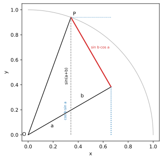

# ch04 — 和角公式：角度相加＝旋轉相疊

> **本章解決什麼問題**：這是 Part II「旋轉是母題」的開場，也是全書脊椎的第一根。前三章把三角函數從三角形搬進單位圓（見 ch01–03），現在要回答第一個真正的「旋轉」問題：先轉 a 再轉 b，等於轉 a+b——這件直覺上顯然的事，寫成 sin/cos 是什麼樣子？答案就是和角公式。本章用幾何把它推出來，並當場宣告：同一個公式，後面還會用旋轉矩陣（ch05）、複數（ch07）、Euler（ch08）各證一次，四次是同一件事。

```
Part I 搖籃與真身        Part II 旋轉是母題 ◄你在這裡  Part III 複數：旋轉的代數
ch01 三角形→圓的真身     ch04 和角公式            ch07 複數平面=旋轉+縮放
ch02 弧度            →   ch05 旋轉矩陣        →   ch08 Euler 公式 ★
ch03 單位圓：六函數的家  ch06 點積與投影          ch09 de Moivre 與單位根
                                                        │
                                                        ↓
Part V 近親與收官        Part IV 週期與波
ch14 反函數與 atan2  ←   ch13 傅立葉的門口    ←   ch10 波的解剖（相量）
ch15 雙曲孿生＋收官 ★    ch12 疊加：拍頻/Lissajous  ch11 為什麼 sin′=cos
```

## 從你已知的出發

你在遊戲後端處理過 2D 旋轉。把一個 sprite 先轉 30°、再轉 60°，最後它的朝向跟你直接轉 90° 完全一樣。沒有人會懷疑這件事——旋轉是可組合的（composable），兩次小轉疊起來就是一次大轉，而且角度直接相加。`transform: rotate(30deg) rotate(60deg)` 和 `rotate(90deg)` 是同一個結果。

這個「角度相加」的直覺，便宜到你從來不會多想。但這裡有個你可能沒問過的問題：**旋轉作用在座標上的時候，這個「相加」長什麼樣子？**

一個點轉了角度 θ 之後，它的新座標是 (cos θ, sin θ)（如果它原本在單位圓上的起點，見 ch03）。那麼「先轉 a 再轉 b」這件事，落到 cos 和 sin 上，應該要能寫成「轉 a+b」的座標 (cos(a+b), sin(a+b))。問題是：cos(a+b) 跟 cos a、cos b、sin a、sin b 之間，到底是什麼關係？

這就是和角公式（angle-addition formula）。它不是一條要背的恆等式，它是「旋轉可以相加」這件事翻譯成座標語言後的樣子。一旦你看懂它是旋轉的相疊，你會發現它根本不需要記——你只要在腦裡轉兩下，它就長出來了。

而這正是這本書最想讓你拿到的東西之一。我認為和角公式是整本書最重要的一個「啊哈」：它在後面會以四種完全不同的面貌出現（幾何、矩陣、複數、Euler），而每一次你都會發現，它們其實在說同一句話——**旋轉可以組合**。本章是這四次裡的第一次，我們從最古老、最看得見的那一種開始：幾何。

## 先打掉最常見的錯覺：sin(a+b) ≠ sin a + sin b

在推任何東西之前，先處理一個幾乎每個人都犯過、而且犯得很自然的錯誤：以為 sin 對加法是「線性的」，也就是

```text
sin(a + b)  =?=  sin a + sin b      ← 錯！這是這一章要打掉的第一個錯覺
```

為什麼這個錯覺這麼有吸引力？因為你被太多「真的線性」的東西寵壞了。`log(xy)=log x+log y`、微分 `(f+g)′=f′+g′`、矩陣 `A(u+v)=Au+Av`——線性運算到處都是，你的手指頭會自動把括號「拆開」。但 **sin 不是線性的**。它是一個點繞圓時投在牆上的影子（見 ch01），而影子的高度跟角度之間是彎的、不是直的。

用一個具體數字把它打爆。取 a = b = 90°：

```text
左邊：sin(90° + 90°) = sin 180° = 0
右邊：sin 90° + sin 90° = 1 + 1 = 2
```

差了整整 2。不是差一點點、不是邊界情況——是 0 對 2，最大可能的落差。如果 sin 真的可以這樣拆，繞半圈的影子高度會是 2，但單位圓的半徑只有 1，影子最高就是 1。錯覺在這裡撞牆撞得粉碎。

再取一組沒那麼極端的，a = b = 30°，免得你覺得「只有 90° 那種邊界才會壞」：

```text
左邊：sin(30° + 30°) = sin 60° ≈ 0.86603
右邊：sin 30° + sin 30° = 0.5 + 0.5 = 1
```

還是錯，差了約 0.134。**任何**非零的 a、b 你都會看到落差。sin 對加法從來不是用「拆開來相加」處理的。

那正確的長相是什麼？答案是：sin(a+b) 確實能用 a、b 的 sin 和 cos 寫出來，但要**四項交叉相乘**，不是兩項相加：

```text
sin(a + b) = sin a · cos b + cos a · sin b
cos(a + b) = cos a · cos b − sin a · sin b      ← 注意這裡是減號
```

這兩條就是和角公式。下面我們不背它、把它推出來——而且推法本身就告訴你為什麼是這個樣子。

## 幾何證法：把一個角疊在另一個角上

這一節值得你停十分鐘，把那張圖在腦裡轉一遍。我們要做的事很單純：在單位圓上，先轉一個角 a，再在它上面疊一個角 b，然後看終點的座標怎麼拆。

**搭建構造**。從原點 O 出發，沿 x 軸正向開始：

1. 先逆時針轉角 a，得到一條射線（叫它 OB）。
2. 在 OB 的基礎上，再逆時針轉角 b。最終射線指向角 a+b 的方向。
3. 在最終射線上取一點 P，讓 OP = 1（P 落在單位圓上）。於是按定義，P 的座標就是 (cos(a+b), sin(a+b))——這是我們要拆解的目標。

現在做兩條垂線，這是整個證明的關鍵：

4. 從 P 向射線 OB 作垂線，垂足叫 D。因為 OP = 1、∠DOP = b，直角三角形 ODP 給出 **OD = cos b**、**DP = sin b**。這一步把「角 b」榨成了兩段長度。
5. 從 P 向 x 軸作垂線，垂足叫 Q。於是 **PQ = sin(a+b)**（P 的高度）、**OQ = cos(a+b)**（P 的水平位置）。這是我們要拆的兩個量。



**把 P 的高度拆成兩層**。重點來了。OD 這一段（長度 cos b）是沿著角 a 的方向躺著的——它本身就是一條與 x 軸夾角 a、長度 cos b 的線段。所以它的高度（垂直分量）是：

```text
D 的高度 = (OD) · sin a = cos b · sin a       ← 「躺在角 a 上、長 cos b」的那段，它的影子
```

而 DP 這一段（長度 sin b）是垂直於 OB 的——它與 x 軸的夾角是 a + 90°。一條與 x 軸夾角 (a+90°)、長度 sin b 的線段，它的垂直分量是 sin b · sin(a+90°) = sin b · cos a：

```text
DP 的高度 = (DP) · cos a = sin b · cos a       ← 「垂直於角 a、長 sin b」的那段，它的影子
```

P 的高度，就是這兩層疊起來（D 先把你抬到 cos b·sin a 的高度，DP 再往上補 sin b·cos a）：

```text
sin(a + b) = PQ
           = D 的高度 + DP 的高度
           = cos b · sin a + sin b · cos a
           = sin a · cos b + cos a · sin b       ← 和角公式（sin）得證
```

**cos(a+b) 同一張圖一起出來**。水平方向同樣拆兩段，但這次第二段是往**回**減的。OD 的水平分量是 cos b · cos a（往右）；DP 與 x 軸夾角 a+90°，它的水平分量是 sin b · cos(a+90°) = −sin b · sin a（往左，所以是減）：

```text
cos(a + b) = OQ
           = (OD 的水平分量) − (DP 往左拉的量)
           = cos b · cos a − sin b · sin a
           = cos a · cos b − sin a · sin b       ← 和角公式（cos）得證，減號就是從這裡來的
```

那個常被背錯的減號，現在有了出處：它來自「垂直於角 a 的那段 DP，它的水平影子是往左指的」。你不用記減號，你只要記得 DP 是往回拐的就好。

**嚴謹度的誠實標示**。上面這張圖畫的是 a、b 都是銳角、且 a+b < 90° 的情形——這是工程師的嚴謹：每一步（OD=cos b、DP=sin b、各自的影子）你都能口頭說出理由。但公式對**任何**角度（負角、鈍角、繞好幾圈）都成立，而圖只畫了第一象限的乖巧情況。要嚴格覆蓋全部象限，最乾淨的辦法不是畫一堆討厭的分類圖，而是換工具——這正是 ch05 的旋轉矩陣與 ch07 的複數會做的事：它們對任何角度一視同仁、不分象限。所以這張幾何圖是「直覺版」，全象限的嚴格版見 ch05／ch07。這不是偷懶，是分工：幾何給你「看得見」，代數給你「不分情況」。

**它在解什麼問題**。和角公式解的問題是：把一個複合的旋轉（a+b）拆回成兩個已知旋轉（a 和 b）的座標組合。一旦你有它，整個三角函數的恆等式叢林就有了根——倍角、半角、積化和差，全部從這兩條長出來，下面就做。

## Worked example：用和角算 sin 75°，一步都不跳

光看符號推導容易「以為自己懂了」。我們拿一個既不是特殊角、又能用特殊角拼出來的角——75°——把和角公式從頭跑一次，每一步都帶數字。

75° 沒有現成的特殊角值，但它是 45° + 30°，而這兩個角的 sin/cos 你在 ch03 已經有精確值（sin45°=cos45°=√2/2≈0.70711、sin30°=1/2、cos30°=√3/2≈0.86603）。套 `sin(a+b)=sin a cos b+cos a sin b`，取 a=45°、b=30°：

```text
sin 75° = sin(45° + 30°)
        = sin 45° · cos 30° + cos 45° · sin 30°    ← 直接套和角公式（sin 版）
        = (√2/2)·(√3/2)     + (√2/2)·(1/2)         ← 代入四個特殊角值
        = √6/4              + √2/4                  ← √2·√3=√6；√2·1=√2
        = (√6 + √2)/4                               ← 通分母合併
```

到這裡得到精確值 (√6+√2)/4。現在帶數字落地（√6≈2.44949、√2≈1.41421）：

```text
sin 75° = (2.44949 + 1.41421)/4 = 3.86370/4 ≈ 0.96593
```

**兩種方式自我複核**。其一，分項算：(√2/2)·(√3/2) ≈ 0.70711·0.86603 ≈ 0.61237，加上 (√2/2)·(1/2) ≈ 0.70711·0.5 ≈ 0.35356，合計 ≈ 0.96593——和合併後的 (√6+√2)/4 一致 ✓。其二，直覺檢查：75° 很接近 90°，sin 90°=1，所以 sin75° 應該略小於 1、是個大數——0.96593 完全合理（如果你算出個 0.3 之類的小數，馬上知道哪裡配對配反了）。這個「先猜大概多大」的習慣，是擋掉粗心錯誤最便宜的一道防線。

注意這個 worked example 裡，那兩項 √6/4 與 √2/4 不是憑空來的——它們就是本章那張幾何圖的「下層」與「上層」兩段長度，現在被代了具體的 45°、30° 而已。公式、圖、數字，是同一件事的三個視角。

## 歷史的旁證：托勒密早就在圓上做這件事

值得提一句，這不是現代教科書才有的把戲。早期的三角學根本不講 sine，講的是「弦」（chord）——圓上一段弧所對的直線距離，chord(θ) = 2·sin(θ/2)（見 ch01）。托勒密（Ptolemy，約西元 2 世紀）在《天文學大成》（Almagest）第一卷裡，用一條關於圓內接四邊形的定理——**托勒密定理**（對角線乘積 = 兩組對邊乘積之和）——推出了「弦的和角／差角公式」，再用它從少數已知角（如 36°、72°）一路算出 0.5° 到 180° 的整張弦表（2026-06 查證）。

換句話說，**和角公式的歷史就誕生在圓上，不是三角形上**。用今天的語言說，托勒密那條「兩弧之和的弦」公式，重新整理一下就是 sin(a+b) 的和角公式——它「只是托勒密定理的另一種寫法」（2026-06 查證）。這恰好是本書的招牌論點的史實根：三角的母題從一開始就是圓與旋轉，三角形只是搖籃。

## 兩個立即的紅利：倍角與半角

和角公式一旦在手，最便宜的兩個推論馬上掉出來。我們不另外背它們——它們就是和角公式在 a=b 時的特例。

**倍角公式（double angle）**。在和角公式裡令 b = a：

```text
sin(2θ) = sin θ cos θ + cos θ sin θ = 2 sin θ cos θ
cos(2θ) = cos θ cos θ − sin θ sin θ = cos²θ − sin²θ          ← 直接版
```

cos(2θ) 還有兩個常用的等價變形，用畢氏恆等式 sin²θ+cos²θ=1（見 ch03）換一下：

```text
cos(2θ) = cos²θ − sin²θ
        = (1 − sin²θ) − sin²θ = 1 − 2 sin²θ                 ← 把 cos² 換掉
        = cos²θ − (1 − cos²θ) = 2 cos²θ − 1                 ← 把 sin² 換掉
```

三種寫法是同一件事，看你手上有 sin 還是 cos 比較方便就用哪個。自我複核一下，令 θ=30°：sin(60°) 應該 = 2·sin30°·cos30° = 2·(1/2)·(√3/2) = √3/2 ≈ 0.86603 ✓；cos(60°) 應該 = 1 − 2·sin²30° = 1 − 2·(1/4) = 1/2 ✓。

**半角公式（half angle）**。把 `cos(2θ)=1−2sin²θ` 反過來解 sin²θ，再把 θ 換成 θ/2，就得到半角：

```text
從 cos(2θ) = 1 − 2 sin²θ  解出  sin²θ = (1 − cos 2θ)/2
令 θ → θ/2：              sin²(θ/2) = (1 − cos θ)/2
同理由 cos(2θ)=2cos²θ−1： cos²(θ/2) = (1 + cos θ)/2
```

半角公式在 ch14（反函數）與 ch15 會回來，這裡先把來源釘好。自我複核，令 θ=30°：sin²(15°) 應該 = (1 − cos30°)/2 = (1 − √3/2)/2 ≈ (1 − 0.86603)/2 ≈ 0.0669873，開根號 sin15° ≈ 0.25882 ✓（這也等於 (√6−√2)/4，下一節的 cos75° 會再撞到這個數）。

## 預告：積化和差（留給 ch12）

和角公式還有一個我們現在只點到、留到 ch12 完整展開的後裔。把 sin(a+b) 與 sin(a−b) 相加：

```text
sin(a+b) = sin a cos b + cos a sin b
sin(a−b) = sin a cos b − cos a sin b
相加：    sin(a+b) + sin(a−b) = 2 sin a cos b
所以：    sin a · cos b = ½ [ sin(a+b) + sin(a−b) ]          ← 積化和差（product-to-sum）
```

這條看起來無聊，但它把「兩個三角函數相乘」變成了「兩個三角函數相加」。在沒有對數、沒有計算機的年代，這是天文學家拿來**做乘法**的祕技（叫 prosthaphaeresis，希臘文「加與減」）：第谷（Tycho Brahe）的助手約在 1580 年代用它把費力的大數相乘換成查表相加（更早可追到 Werner 1510、Viète 1579，2026-06 查證）。而在我們的故事線裡，它更重要的角色是 ch12 的拍頻（beats）與調變——「兩個頻率的積 = 兩個頻率的和差」，這正是你聽到的嗡嗡拍音的數學。先記住它的出身是和角公式相加減，細節 ch12 見。

## 全書脊椎宣告：同一個公式，四種證法

這裡是本章最該被你記住的一句話，所以我把它框起來說清楚。

剛才我們用**幾何**（單位圓上疊兩個角、拆影子）證了和角公式。但這只是第一次。同一個公式 `sin(a+b)=sin a cos b+cos a sin b`、`cos(a+b)=cos a cos b−sin a sin b`，在這本書裡會再出現三次，每次披著不同的外衣：

```text
證法      用什麼工具                          在哪章   核心動作
────────  ──────────────────────────────────  ───────  ──────────────────────
幾何      單位圓上的投影構造（本章）          ch04     疊兩個角，把影子拆兩層
旋轉矩陣  R(a)·R(b) = R(a+b)，矩陣相乘         ch05     兩個旋轉矩陣乘開，元素自動長出公式
複數乘法  極式相乘：輻角相加、模相乘           ch07     (cos a+i sin a)(cos b+i sin b) 展開
Euler     e^{i(a+b)} = e^{ia}·e^{ib}，比實虛部 ch08     指數律一行收掉，比對實部虛部
```

**這四個是同一件事。** 它們全都在說一句話：**旋轉可以組合，而組合的時候角度相加**。幾何版讓你看見它（影子疊起來）；矩陣版讓你不分象限地算它（機器化）；複數版讓你把它壓縮成一次乘法；Euler 版讓你發現它其實就是指數律 `eˣ·eʸ=eˣ⁺ʸ` 在虛數方向的化身。

我認為這是整本書最漂亮的一條線。當你讀到 ch08、看到 `e^{i(a+b)}=e^{ia}·e^{ib}` 比對實虛部一行就掉出和角公式時，你應該要能回頭指著本章這張幾何圖說：「對，這跟我在單位圓上拆影子的那次，是同一件事。」如果你做得到，你就真的懂了三角函數的母題不是三角形，是旋轉。每到那三章，我都會把你拉回這張表對帳一次。

## 直覺的陷阱

和角公式周邊的錯誤直覺特別多，而且都很「自然」——因為它們都來自把線性世界的習慣硬套到非線性的 sin/cos 上。

| 陷阱 | 錯誤直覺長什麼樣 | 在哪一步把你帶溝裡 | 怎麼自我察覺 |
|---|---|---|---|
| sin 是線性的 | `sin(a+b)=sin a+sin b`、`cos(2θ)=2cos θ` | 看到括號就想拆開相加 | 代 a=b=90°：左邊 sin180°=0，右邊=2。差到離譜就知道錯了 |
| 漏掉交叉項 | 記成 `sin(a+b)=sin a sin b+cos a cos b` | 把 sin/cos 配對配反 | 那個式子其實是 cos(a−b)，不是 sin(a+b)。代特殊角一驗就現形 |
| cos 的減號掉了 | 寫成 `cos(a+b)=cos a cos b+sin a sin b` | 背公式不記來源 | 記住減號來自「DP 的水平影子往左拐」；或代 a=b=90° 驗：cos180°=−1，cos²90°−sin²90°=0−1=−1 ✓，但 +sin²會給+1 ✗ |
| 度數／弧度混用 | 把 a、b 一個用度一個用弧度湊 | 程式裡 `Math.sin` 吃弧度（見 ch02） | 結果差了約 57 倍（1 rad≈57.3°）。數值大得莫名其妙時先查單位 |
| 倍角硬背三個版本 | 記不清 cos2θ 到底等於哪個 | 把三個變形當三條獨立公式背 | 它們是同一條：cos²−sin²，配畢氏恆等式換 sin² 或 cos² 而已。現推不用記 |
| 「圖只證了銳角所以公式只對銳角」 | 以為幾何圖的限制就是公式的限制 | 把「直覺版的圖」誤當「公式的證明範圍」 | 圖只是直覺；全象限的嚴格版交給 ch05 矩陣／ch07 複數，公式對任何角都成立 |

最值得內化的自我察覺術，就是**永遠用特殊角當煙霧偵測器**：任何你不確定的和角／倍角恆等式，代 a=b=90° 或 a=45°、b=30° 進去，兩邊各算一次。對得上不保證對（巧合存在），但對不上保證錯——這個一秒鐘的檢查，能擋掉九成的符號與配對錯誤。

## 紙上推演

### 推演題

**題 1（用和角推 cos 75° 並自我複核）** **[15 分鐘] ★**
用和角公式（cos 版）算 cos 75° = cos(45°+30°)，給出 (√6−√2)/4 的形式與小數值，再驗證 sin²75°+cos²75°=1。

**題 2（自己推半角）** **[15 分鐘] ★★**
不准翻前面，從倍角公式 `cos 2θ = 1 − 2 sin²θ` 出發，自己推出 `sin²(θ/2) = (1 − cos θ)/2`。然後用它算 sin²15° 並對照本章 cos75° 那一節的數字。

**題 3（找出錯覺爆掉的地方）** **[10 分鐘] ★**
有人主張 `sin(a+b)=sin a+sin b`。請找出三組具體的 (a, b)，分別示範：(i) 落差最大的一組；(ii) 一組「乍看好像對」但其實錯的；(iii) 有哪種退化情況能讓兩邊相等？說清楚為什麼。

**題 4（口頭題：把減號講出來）** **[10 分鐘] ★★**
不看公式，向另一個工程師口頭解釋：為什麼 cos(a+b) 裡是**減** sin a sin b，而 sin(a+b) 裡是**加** cos a sin b？用本章那張幾何圖的「DP 往左拐」講，不准只說「公式就這樣」。

### 推演解答

**題 1。** 用 cos(a+b)=cos a cos b − sin a sin b，取 a=45°、b=30°：

```text
cos 75° = cos 45° cos 30° − sin 45° sin 30°
        = (√2/2)(√3/2) − (√2/2)(1/2)
        = √6/4 − √2/4
        = (√6 − √2)/4
```

數值：√6 ≈ 2.44949、√2 ≈ 1.41421，所以 (2.44949 − 1.41421)/4 ≈ 1.03528/4 ≈ **0.25882**。用計算機 cos75° ≈ 0.25882 ✓。

驗證畢氏恆等式：上一節（worked example）算過 sin75° = (√6+√2)/4 ≈ 0.96593。

```text
sin²75° + cos²75° = 0.96593² + 0.25882²
                  ≈ 0.93302 + 0.06699
                  = 1.00001 ≈ 1 ✓   （尾數誤差來自四捨五入，精確值剛好=1）
```

精確地看更漂亮：[(√6+√2)/4]² + [(√6−√2)/4]² = [(6+2√12+2) + (6−2√12+2)]/16 = (8+8)/16 = 1。交叉項 ±2√12 恰好抵消——這就是為什麼它一定等於 1，不是巧合。

**題 2。** 從 `cos 2θ = 1 − 2 sin²θ` 把 sin²θ 解出來：移項得 `2 sin²θ = 1 − cos 2θ`，所以 `sin²θ = (1 − cos 2θ)/2`。這對任何 θ 都成立，所以把 θ 換成 θ/2（純粹改名字，等號不變）：左邊 sin²(θ/2)，右邊的 2θ 變成 θ：

```text
sin²(θ/2) = (1 − cos θ)/2
```

得證。算 sin²15°（取 θ=30°）：(1 − cos30°)/2 = (1 − √3/2)/2 ≈ (1 − 0.86603)/2 ≈ 0.0669873。常見錯路：直接寫 `sin(θ/2)=½ sin θ`——這又是把 sin 當線性了，和本章開頭打掉的錯覺同源，代 θ=180° 一驗（左 sin90°=1，右 ½sin180°=0）就破。

**題 3。** (i) 落差最大：a=b=90°，左 sin180°=0、右=2，差 2（已是理論上限，因為兩邊各最多到 1+1=2 而左邊最多 1）。(ii) 乍看像對的：取很小的角，a=b=0.01 rad，左 sin0.02≈0.0200、右 2·sin0.01≈0.0200——幾乎相等！這是因為小角下 sin x≈x（見 ch02），加法近似成立，但它只是近似、不是相等，放大到 a=b=1 rad 立刻分家。(iii) 最乾淨的退化情況：當 a=0（或 b=0）時，左 sin(0+b)=sin b、右 sin0+sin b=sin b，兩邊都等於 sin b。也就是「其中一個角根本沒轉」時才碰巧成立——這恰恰說明那個錯覺的本質：它假設了「沒有交叉項」，而只有一個角為零、交叉項自動消失時才對。（嚴格說，等式還有零星的孤立解：例如 a+b 剛好讓兩邊都為 0，a=60°、b=300° 時左 sin360°=0、右 sin60°+sin300°=√3/2−√3/2=0，兩個角都不為零。但 a=0 或 b=0 是唯一「對任意另一個角都成立」的情形，這才是重點——孤立解只是巧合，退化情形才揭穿錯覺。）

**題 4。** 模範口述要點：「在單位圓上先轉 a、再疊 b，終點 P 在角 a+b 上。我從 P 往角 a 的方向作垂足 D，得到兩段：OD 躺在角 a 上、長 cos b；DP 垂直於角 a、長 sin b。算 P 的高度 sin(a+b) 時，兩段的垂直影子都往上加，所以是加。算 P 的水平位置 cos(a+b) 時，OD 的水平影子往右（正），但 DP 因為垂直於角 a、它指向左上，水平影子往**左**——所以要**減**。減號不是規定，是 DP 這段往回拐的方向造成的。」能講到「DP 往左拐」這四個字，就算過關。

### 動手生圖

本章的圖就是這段 Python 小實驗。它把幾何證法那張構造圖畫出來：單位圓上疊兩個角 a、b，終點 P 在角 a+b 處，並把 sin(a+b) 拆成「下層 cos b·sin a ＋上層 sin b·cos a」兩段。

```python
# ch04 figure: classic unit-circle construction for sin(a+b)/cos(a+b)
from pathlib import Path
import numpy as np
import matplotlib
matplotlib.use("Agg")          # headless; no display needed
import matplotlib.pyplot as plt

OUT = Path(__file__).resolve().parent / "out" / "ch04-angle-addition.svg"
OUT.parent.mkdir(parents=True, exist_ok=True)

a, b = np.deg2rad(30), np.deg2rad(40)        # two stacked angles
O = np.array([0.0, 0.0])
P = np.array([np.cos(a + b), np.sin(a + b)]) # point at angle a+b on unit circle
D = np.cos(b) * np.array([np.cos(a), np.sin(a)])  # foot on ray of angle a: OD = cos b
Q = np.array([P[0], 0.0])                    # foot of P on x-axis: PQ = sin(a+b)

fig, ax = plt.subplots(figsize=(5, 5))
t = np.linspace(0, np.pi / 2, 100)
ax.plot(np.cos(t), np.sin(t), color="0.7", lw=1)            # unit circle arc
for X, c in [(P, "k"), (D, "k")]:                            # rays from O
    ax.plot([0, X[0]], [0, X[1]], color=c, lw=1.2)
ax.plot([D[0], P[0]], [D[1], P[1]], color="C3", lw=2)        # DP = sin b
ax.plot([P[0], Q[0]], [P[1], Q[1]], "--", color="0.5", lw=1) # P down to x-axis
ax.plot([D[0], D[0]], [0, D[1]], ":", color="C0", lw=1.5)    # cos b * sin a (lower stack)
ax.plot([Q[0], D[0]], [P[1], P[1]], ":", color="C0", lw=1)   # guide at height sin(a+b)
ax.annotate("P", P, textcoords="offset points", xytext=(4, 4))
ax.annotate("O", O, textcoords="offset points", xytext=(-12, -2))
ax.text(0.18, 0.06, "a", color="k"); ax.text(0.42, 0.30, "b", color="k")
ax.text(P[0] - 0.02, P[1] / 2, "sin(a+b)", rotation=90, va="center", ha="right", fontsize=8)
ax.text(D[0] / 2 - 0.02, D[1] / 2, "cos b·sin a", color="C0", rotation=90, va="center", ha="right", fontsize=7)
ax.text((D[0] + P[0]) / 2, (D[1] + P[1]) / 2 + 0.03, "sin b·cos a", color="C3", fontsize=7)
ax.set_xlim(-0.05, 1.05); ax.set_ylim(-0.05, 1.05)
ax.set_aspect("equal")         # keep the circle round
ax.set_xlabel("x"); ax.set_ylabel("y")
fig.savefig(OUT, bbox_inches="tight")
print("wrote", OUT)            # build_figures.py reads this
```

**預期輸出**：終端機印出 `wrote .../figures/out/ch04-angle-addition.svg`。圖中你會看到一個第一象限的單位圓弧、兩條從 O 出發的射線（內側那條是角 a，外側那條到 P 是角 a+b）；P 的高度被切成兩段——藍色點線（cos b·sin a，下層）與紅色斜段（sin b·cos a，上層）——兩段加起來剛好是 P 到 x 軸的高度 sin(a+b)。

**改參數看什麼**：
- 改 `a, b = np.deg2rad(30), np.deg2rad(40)` 的兩個角度，看 P 跑到圓上不同位置、兩段長度跟著變，但「下層+上層=總高度」永遠成立。
- 試把 b 加大到讓 a+b 超過 90°（例如 a=60、b=50），你會看到 P 跑進第二象限——這時 cos(a+b) 變負、構造圖開始「破相」（垂足跑到原點外側）。這正是本章說的「幾何圖只乖乖證了銳角」的那個邊界，親眼看它壞掉，就懂為什麼全象限要交給 ch05 的矩陣。
- 把 P 的高度標籤改成顯示實際數值 `f"{np.sin(a+b):.3f}"`，跑出來對照 `np.sin(np.deg2rad(70))`，自己驗一次圖沒騙你。

## 自我檢核

口頭自答，講得出來才算過關：

1. 為什麼 `sin(a+b)` **不**等於 `sin a + sin b`？舉一個讓落差最大的具體例子，並說出根本原因（sin 不是線性的，它是影子）。
2. 在那張幾何構造圖裡，`cos b`、`sin b`、`sin a`、`cos a` 各自是哪一段長度或哪一個影子？不看圖能在腦裡擺出來嗎？
3. `cos(a+b)` 裡那個減號是從哪來的？（提示：DP 段往哪邊拐。）
4. 倍角公式 `cos 2θ` 為什麼有三種寫法？它們是三條公式還是一條？怎麼從一條變出另兩條？
5. 半角公式 `sin²(θ/2)=(1−cos θ)/2` 是從哪條公式反解出來的？
6. 全書脊椎那四種證法分別用什麼工具？它們「其實是同一件事」這句話，那件事是什麼？（答案應該是一句話：旋轉可以組合、組合時角度相加。）
7. 給你一條你不確定真假的和角／倍角恆等式，你會怎麼一秒鐘判斷它可能錯？（代特殊角當煙霧偵測器。）
8. 為什麼本章的幾何圖只「乖乖地」證了銳角的情形？那全部象限的嚴格證明本書打算交給誰？

## 延伸閱讀

- **3Blue1Brown，「Trigonometry fundamentals | Lockdown math ep. 2」**（Lockdown Math 系列）。含「世界最有名的三角恆等式」的視覺推導，正好對應本章的幾何進路；看他怎麼用一張圖把和角講清楚。系列頁 https://www.3blue1brown.com/topics/lockdown-math （注意：3Blue1Brown 沒有「Essence of trigonometry」這個系列，別找錯）。
- **Eli Maor，《Trigonometric Delights》**（Princeton Science Library）。數學史與直覺並重的三角散文集；想看托勒密弦表、和角公式的歷史脈絡，從這裡讀，補本章「歷史旁證」那一節的細節。https://www.amazon.com/Trigonometric-Delights-Princeton-Science-Library/dp/0691202192
- **Wikipedia，「Ptolemy's theorem」**。想親眼看「和角公式 = 托勒密定理的重新整理」怎麼從圓內接四邊形推出來，讀它的 corollaries 一節。https://en.wikipedia.org/wiki/Ptolemy%27s_theorem
- **Cut-the-Knot，「Sine, Cosine, and Ptolemy's Theorem」**。把托勒密定理與 sin/cos 和角公式接起來的一篇清楚短文，配互動圖。https://www.cut-the-knot.org/proofs/sine_cosine.shtml
- 往前一步：本章的脊椎第二證在 ch05（旋轉矩陣 R(a)R(b)=R(a+b)），讀完那章記得回來對帳這張圖——同一件事，第二張臉。
