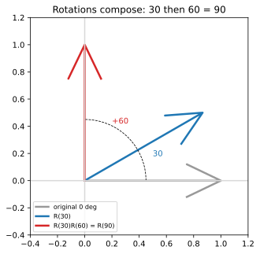

# ch05 — 旋轉矩陣：把「轉一個角」寫成一台機器

> **本章解決什麼問題**：ch04 用幾何構造圖推出了和角公式，看起來像是「在單位圓上湊出來的一個巧合」。本章換一台機器來看同一件事：把「逆時針轉 θ」寫成一個 2×2 矩陣 R(θ)，然後把兩次旋轉乘起來——R(a)·R(b)=R(a+b)。乘開後你會發現，矩陣裡那四個格子裝的，**逐字就是 ch04 的和角公式**。這是全書脊椎「同一個公式四種證法」的第二證（旋轉矩陣版），銜接 ch04（幾何）的前面、ch07（複數乘法）的後面。一句話的主題：旋轉可以被當成一個會結合（associative）的運算來操作，而和角公式只是這個結合律寫成座標的樣子。

## 從你已知的出發

你在遊戲後端寫過 sprite 旋轉。一個角色面朝某個方向，你要把它的貼圖、它的碰撞框、它身上掛的特效，整批繞著某個點轉一個角度。你不會逐點去想「這個頂點的 sin、那個頂點的 cos」——你會拿一個變換矩陣，乘上每一個頂點，一次搞定。`canvas` 的 `ctx.rotate(theta)` 在底下做的就是這件事：它把當前的變換矩陣（CTM，current transformation matrix）右乘上一個旋轉矩陣，之後你畫的每一筆都先被這個矩陣作用過。

更熟的是 transform 串接。你先 `rotate(30°)` 再 `rotate(60°)`，畫出來的東西和你直接 `rotate(90°)` 一模一樣。你從來沒懷疑過這件事——它「就是會這樣」。但停下來想一秒：**為什麼**兩次旋轉疊起來剛好等於一次 90° 旋轉？「角度相加」這件事，憑什麼可以從「先轉再轉」這個動作裡長出來？

這就是 ch04 講的可組合性（先轉 a 再轉 b＝轉 a+b）。ch04 用單位圓上的投影構造把它證了一遍。本章要說的是：當你把旋轉寫成矩陣，這個可組合性就變成最樸素的一件事——**矩陣乘法的結合律**。而「角度相加」這個結果，會以一種你躲不掉的方式，從矩陣相乘的算術裡掉出來：那就是和角公式。

換句話說，你 transform 串接時依賴的那個「理所當然」，和高中背過卻不知道為什麼的那一串 `sin(a+b)=sin a cos b+cos a sin b`，是同一件事的兩個說法。本章把這條等號接起來。

## 旋轉是線性的，所以它是一個矩陣

先確認一件事：為什麼旋轉可以寫成矩陣，而不是某種更複雜的東西。

矩陣能表示的變換叫**線性變換（linear transformation）**。線性的意思有兩條：第一，直線變換後還是直線（不會彎）；第二，原點不動（純旋轉沒有平移）。更精確地說，一個變換 T 是線性的，若它對任意向量 u、v 與純量 c 滿足 `T(u+v)=T(u)+T(v)` 與 `T(c·u)=c·T(u)`——加法與縮放都「穿得過」這個變換。

繞原點的旋轉滿足這兩條，這件事你的幾何直覺其實已經知道：把整個平面當成一張剛性的透明片，釘住原點，轉一個角度。直線轉完還是直線（透明片不會皺）；原點是釘子，不動；兩個向量先相加（平行四邊形）再一起轉，和各自轉完再相加，得到的平行四邊形完全一樣（整張片子一起轉，內部相對關係不變）。所以旋轉是線性變換。

線性變換有一個關鍵性質，是整個矩陣表示法的地基：**一個線性變換被它在基底向量上的作用完全決定**。平面上的標準基底是 `e₁=(1,0)`（指向右）與 `e₂=(0,1)`（指向上）。任何向量 `v=(x, y)` 都能寫成 `x·e₁+y·e₂`。於是

```text
T(v) = T(x·e₁ + y·e₂)
     = x·T(e₁) + y·T(e₂)     ← 線性：加法與縮放穿得過去
```

只要知道 `T(e₁)` 和 `T(e₂)` 跑到哪去，任何向量的去向就定了。而把 `T(e₁)`、`T(e₂)` 當成兩個直行（column）並排，就得到那個矩陣。這不是約定，是被線性逼出來的——矩陣的每一直行，就是「某個基底向量被送到哪裡」。記住這句話，下面推 R(θ) 全靠它。

## 推導 R(θ)：盯著兩個基底向量看它們轉到哪

現在來逆時針轉 θ（逆時針為正，這是全書約定）。我只需要回答兩個問題：`e₁=(1,0)` 轉去哪？`e₂=(0,1)` 轉去哪？

`e₁=(1,0)` 是長度 1、指向正右方（0°）的箭頭。逆時針轉 θ 之後，它變成一個長度仍是 1、方向指向 θ 的箭頭。而「單位圓上方向 θ 的點」的座標——這是 ch03 釘死的單位圓主定義——就是 `(cos θ, sin θ)`。所以

```text
e₁ = (1, 0)  --轉 θ-->  (cos θ, sin θ)
```

`e₂=(0,1)` 是長度 1、指向正上方（90°）的箭頭。逆時針轉 θ 之後，它指向 90°+θ。它的座標是 `(cos(90°+θ), sin(90°+θ))`。這裡可以不用和角公式（我們正要去證和角公式，不能循環引用）——直接用幾何：把指向上方的箭頭逆時針轉 θ，它會往左後方倒。畫一下你就看到，它的 x 分量是 `−sin θ`、y 分量是 `cos θ`。

驗證這個幾何結論用一個你已知的特例就夠：θ=90° 時，`e₂=(0,1)` 應該轉到指向正左方 `(−1, 0)`。代進去：`(−sin 90°, cos 90°)=(−1, 0)` ✓。再用 θ=0：`(−sin 0, cos 0)=(0, 1)`，沒轉就是它自己 ✓。所以

```text
e₂ = (0, 1)  --轉 θ-->  (−sin θ, cos θ)
```

把這兩個去向當成矩陣的兩個直行並排（第一直行是 e₁ 的去向，第二直行是 e₂ 的去向）：

```text
        | cos θ   −sin θ |
R(θ) =  |                |
        | sin θ    cos θ |
```

這就是基準寫法（逆時針為正）。每個元素都有來歷，不是背的：左上 `cos θ` 是 e₁ 落點的 x、左下 `sin θ` 是 e₁ 落點的 y；右上 `−sin θ` 是 e₂ 落點的 x、右下 `cos θ` 是 e₂ 落點的 y。那個惹眼的負號不是裝飾——它就是「把朝上的箭頭逆時針轉，x 會變負」這件事。

快速體檢一下這台機器。拿它去乘 `(1, 0)`：

```text
| cos θ   −sin θ | | 1 |   | cos θ |
|                | |   | = |       |
| sin θ    cos θ | | 0 |   | sin θ |
```

得到 `(cos θ, sin θ)`，和我們對 e₁ 的設定一致。R(90°) 應該把 `(1,0)` 送到 `(0,1)`：代 θ=90°，矩陣是 `[[0,−1],[1,0]]`，乘 `(1,0)` 得 `(0,1)` ✓；乘 `(0,1)` 得 `(−1,0)` ✓（朝上轉 90° 變朝左）。機器沒問題。

## 脊椎第二證：把 R(a)·R(b) 乘開，和角公式自己掉出來

現在是本章的核心，也是我認為整本書最省力的一次「啊哈」。

「先轉 b 再轉 a」這個複合動作，等於「一次轉 a+b」。寫成矩陣，「先做 R(b) 再做 R(a)」是 `R(a)·R(b)`（矩陣乘法裡，先作用的寫右邊——這和你 transform 串接「A followed by B = B·A」的習慣一致，2026-06 查證）。而「一次轉 a+b」是 `R(a+b)`。所以幾何上我們**期待**：

```text
R(a) · R(b) = R(a+b)
```

左邊我們會算（純矩陣乘法，國中生會的算術）。右邊我們知道長相（把 θ 換成 a+b 套進 R(θ) 的公式）。把兩邊逼到相等，就會逼出 `cos(a+b)` 和 `sin(a+b)` 是什麼。

先算左邊。兩個旋轉矩陣相乘：

```text
            | cos a   −sin a |   | cos b   −sin b |
R(a)·R(b) = |                | · |                |
            | sin a    cos a |   | sin b    cos b |
```

矩陣乘法：結果第 i 列第 j 行 = 左矩陣第 i 列「點積」右矩陣第 j 行。逐格算（這一步不准跳，全書招牌是恆等式給來源）：

```text
左上 (1,1) = (cos a)(cos b) + (−sin a)(sin b) = cos a·cos b − sin a·sin b
右上 (1,2) = (cos a)(−sin b) + (−sin a)(cos b) = −(sin a·cos b + cos a·sin b)
左下 (2,1) = (sin a)(cos b) + (cos a)(sin b)   = sin a·cos b + cos a·sin b
右下 (2,2) = (sin a)(−sin b) + (cos a)(cos b)  = cos a·cos b − sin a·sin b
```

所以左邊整理成：

```text
            | cos a·cos b − sin a·sin b    −(sin a·cos b + cos a·sin b) |
R(a)·R(b) = |                                                          |
            | sin a·cos b + cos a·sin b      cos a·cos b − sin a·sin b  |
```

再看右邊。`R(a+b)` 就是把 R(θ) 的 θ 換成 a+b：

```text
          | cos(a+b)   −sin(a+b) |
R(a+b)  = |                      |
          | sin(a+b)    cos(a+b) |
```

兩個矩陣若要相等，必須**逐格相等**。把對應的格子並排對帳：

```text
左下格:  sin(a+b)  =  sin a·cos b + cos a·sin b
左上格:  cos(a+b)  =  cos a·cos b − sin a·sin b
```

（右上格給的是 `−sin(a+b)=−(sin a cos b+cos a sin b)`，和左下同一條；右下格和左上同一條——四格只有兩條獨立資訊，正好是兩條和角公式。）

這就是和角公式。我沒有「湊」任何東西，沒有畫輔助線，沒有投影——我只是把兩個旋轉矩陣按國中的矩陣乘法乘開，然後說「R(a)·R(b) 和 R(a+b) 描述同一個旋轉，所以它們的格子必須一樣」。和角公式是這個相等的**逐格副產品**。

> **這裡了不起在哪**（一定要能用自己的話轉述）：ch04 證和角公式時，你會覺得它是單位圓上一個精巧的幾何拼圖——美，但好像是「剛好成立」。本章告訴你它一點都不剛好：只要你接受「旋轉是線性變換」（所以是矩陣）、且「先轉再轉就是轉總和」（所以 R(a)R(b)=R(a+b)），和角公式就**沒有不成立的餘地**——它就是這個矩陣等式的座標寫法。換句話說，和角公式不是關於三角形的定理，是關於**旋轉可組合**的定理。下一句話更利害：矩陣乘法本來就滿足結合律 `R(a)(R(b)R(c))=(R(a)R(b))R(c)`，這對應「轉的順序怎麼括號分組都一樣」——和角公式背後其實藏著一個群（group）結構。這個群有名字，下一節說。

### （見 ch04 幾何證法）這是同一個公式，只是寫成矩陣

明確對帳，因為這是脊椎章的義務。ch04 的幾何證法做了什麼？它在單位圓上取一個已經轉了 a 的點，再轉 b，然後用投影把新座標的 x、y 拆成 `sin a cos b`、`cos a sin b` 這些長度，拼出 `sin(a+b)`。每一項都是圖上一段長度。

本章做了什麼？同一個「先轉 a 再轉 b」，但我把「轉 a」這個動作打包成矩陣 R(a)，「轉 b」打包成 R(b)，相乘。乘法裡那些 `cos a·cos b`、`sin a·sin b` 的乘積項，和 ch04 圖上那些長度乘積，是**字字對應的同一批數**——ch04 的「`cos a` 乘上一段長度 `cos b`」，在這裡就是矩陣元素 `(cos a)(cos b)`。

差別只在記法。ch04 把資訊放在「一個被轉動的點的座標」裡，用幾何讀出來；ch05 把資訊放在「整個旋轉變換的矩陣」裡，用矩陣乘法讀出來。一個追蹤點，一個追蹤變換本身。兩者推出的 `sin(a+b)`、`cos(a+b)` 完全一致——**這是同一個公式，只是寫成矩陣**。ch07 會用複數乘法第三次推它（輻角相加、模相乘），ch08 用 Euler 第四次（`e^{i(a+b)}=e^{ia}·e^{ib}` 一行收掉）。四次都是在說同一句話：旋轉可以組合，組合的代價就是角度相加。



## det R=1、轉置=逆：這台機器的兩個體質

旋轉矩陣有兩個性質，不只是計算技巧，而是「它是個旋轉」這件事在矩陣語言裡的指紋。

**行列式 det R(θ)=1。** 直接算：

```text
det R(θ) = (cos θ)(cos θ) − (−sin θ)(sin θ) = cos²θ + sin²θ = 1
```

最後用了 `cos²θ + sin²θ = 1`（單位圓的畢氏定理，ch03）。行列式的幾何意義是「這個變換把面積放大幾倍、有沒有翻面」。det=1 的意思是：**旋轉不改變面積，也不翻面（不照鏡子）**。這很合理——轉一張紙，紙上圖形的面積不變，左手也不會變成右手。對照一下：鏡射的行列式是 −1（面積不變但翻面），縮放 2 倍的行列式是 4（面積變 4 倍）。det=1 把「純旋轉」從這些變換裡精準地挑出來。

**轉置等於逆：R(θ)ᵀ = R(θ)⁻¹ = R(−θ)。** 轉置就是把矩陣沿對角線翻過來（行列互換）：

```text
          | cos θ   −sin θ |              | cos θ    sin θ |
R(θ)  =   |                |    R(θ)ᵀ  =  |                |
          | sin θ    cos θ |              | −sin θ   cos θ |
```

而 R(−θ) 是把 θ 換成 −θ，用奇偶性 `cos(−θ)=cos θ`（偶）、`sin(−θ)=−sin θ`（奇，ch03）：

```text
          | cos θ    sin θ |
R(−θ) =   |                |
          | −sin θ   cos θ |
```

R(θ)ᵀ 和 R(−θ) 一模一樣。再驗證它真的是逆——逆的意思是「轉回去」，R(θ) 之後接 R(−θ) 應該回到原狀（單位矩陣）。用上一節的脊椎結果 `R(a)R(b)=R(a+b)`，取 a=θ、b=−θ：

```text
R(θ)·R(−θ) = R(θ + (−θ)) = R(0) = | 1  0 |   ← 轉 0 度＝什麼都沒做
                                  | 0  1 |
```

所以 `R(θ)⁻¹ = R(−θ) = R(θ)ᵀ`，三者相等。幾何意義乾淨到漂亮：**旋轉的反操作就是反方向轉同一個角，而它剛好等於把矩陣翻轉（轉置）**。轉置在一般矩陣裡是個很「形式」的操作（行列互換，看不出意義），但在旋轉矩陣這裡它直接就是「逆轉」。

滿足「轉置＝逆」的矩陣叫**正交矩陣（orthogonal matrix）**；正交矩陣裡 det=+1 的那些，構成的群叫 **SO(2)（special orthogonal group，特殊正交群）**——平面上所有旋轉的集合（2026-06 查證：SO(2) 的成員恰好就是上面這種形式的旋轉矩陣，且它與「單位圓上的點」一一對應、構成圓群 circle group）。你不需要群論術語也能用這章，但知道這個名字有好處：它告訴你「旋轉的全體」本身是個有結構的東西，乘法封閉（兩個旋轉複合還是旋轉）、有單位元（R(0)）、有逆（R(−θ)）。ch09 的單位根、ch07 的複數乘法，最後都會回到「圓群」這個同一個結構上。

## 一句話到 3D 與四元數

本章從頭到尾活在 2D。到了 3D，旋轉變成 3×3 矩陣、構成 SO(3)，而工程上更常用的是**單位四元數（unit quaternion）**——一個四維的數，用 `v' = q·v·q*` 作用在向量上來表示 3D 旋轉，比 3×3 矩陣省記憶體、插值平滑、且避開歐拉角的萬向鎖（gimbal lock）問題（2026-06 查證：Unity、Unreal 內部都用四元數存旋轉；數學上單位四元數以 2 對 1 的方式「雙重覆蓋」SO(3)，即 q 與 −q 表示同一個旋轉）。四元數是「複數乘法＝旋轉」（ch07）在 3D 的延伸，這裡不展開，想往下走見 章末延伸閱讀。

## 直覺的陷阱

| 陷阱 | 錯誤直覺 | 會在哪一步把你帶溝裡 | 怎麼自我察覺 |
|---|---|---|---|
| **矩陣乘法不可交換** | 「先轉 a 再轉 b 和先轉 b 再轉 a 一樣」 | 2D 純旋轉**剛好**可交換（都繞同一點、角度相加是可交換的），這會養成壞習慣。一進 3D（繞不同軸轉）或加上平移、縮放，`A·B ≠ B·A`，transform 串接順序錯了畫面就歪 | 問自己：我依賴的是「旋轉可交換」還是「矩陣乘法可交換」？前者只在 2D 同心旋轉成立，後者**從來不成立**。2D 旋轉能交換是巧合，不是通則 |
| **作用順序 vs 書寫順序** | 「`R(a)·R(b)` 是先做 R(a)」 | 矩陣作用在右邊的向量上：`R(a)·R(b)·v` 先算 `R(b)·v`，**先做的是 R(b)**（最靠近向量的）。寫反了，30° 先還是 60° 先你會搞混 | 把向量寫出來盯著看：誰最靠近 v 誰先動手。canvas 的 transform 串接也是這個「反序」 |
| **deg/rad 混用** | 「`R(90)` 就是轉 90 度」 | 程式裡 `Math.cos`、`numpy.cos` 吃的是弧度（見 ch02）。你把 90（當度數）丟進去，算的是 `cos(90 rad)`，整台機器歪掉，圖形亂飛 | 結果方向明顯不對、且不是差個正負號而是徹底亂——先懷疑單位。轉 90° 要傳 `π/2≈1.5708` |
| **逆＝轉置只對旋轉成立** | 「矩陣的逆就是轉置」 | 只有正交矩陣（旋轉、鏡射）才有 `Aᵀ=A⁻¹`。一旦你的變換含縮放或推移（shear），轉置完全不是逆，拿轉置當逆用會算出垃圾 | 檢查 det：旋轉 det=1。若你的矩陣 det≠±1（含縮放），就別偷懶用轉置當逆 |
| **正負號與旋轉方向** | 「負號在右上還是左下無所謂」 | `[[cosθ,−sinθ],[sinθ,cosθ]]` 是逆時針；把負號搬到左下變成順時針 R(−θ)。寫錯方向，整個世界往反方向轉 | 拿 `(1,0)` 代 θ=90° 測一發：逆時針應到 `(0,1)`（朝上）。若跑到 `(0,−1)` 你寫的是順時針 |

最深的一個陷阱是第一個：**不要把「2D 旋轉可交換」誤當成普遍規律**。本章的 `R(a)R(b)=R(a+b)` 之所以也等於 `R(b)R(a)`，是因為實數加法可交換（`a+b=b+a`）——這是 2D 的特權。3D 旋轉群 SO(3) 不可交換（先繞 x 軸再繞 y 軸 ≠ 反過來，你拿手機轉兩次就能驗），這也正是 3D 旋轉遠比 2D 麻煩、要動用四元數的根源。你在 2D 養出的「順序無所謂」直覺，是 3D bug 的溫床。

## 紙上推演

**推演 1 — 手算 R(90°) 並驗證基底去向 [10 分鐘] ★**
不查公式，從「e₁、e₂ 轉到哪」重建 R(90°)，寫出矩陣，並驗證它把 `(1,0)→(0,1)`、`(0,1)→(−1,0)`。再說明為什麼 R(90°) 乘兩次（R(90°)²）會等於 R(180°)＝`[[−1,0],[0,−1]]`，也就是把任何向量送到它的相反向量。

**推演 2 — 兩種方法證 R(θ) 的逆是 R(−θ) [15 分鐘] ★★**
方法一（幾何）：用語言說清楚「轉 θ 的反操作是轉 −θ」為什麼顯然。方法二（矩陣）：直接算 `R(θ)·R(−θ)`，乘開後用 `sin²+cos²=1` 化簡，證明它等於單位矩陣。然後說明這同時證明了 `R(θ)⁻¹=R(θ)ᵀ`（轉置＝逆）。

**推演 3 — det R=1 與「旋轉不改變面積」[10 分鐘] ★★**
算出 `det R(θ)` 並化簡到 1。然後用自己的話解釋：為什麼行列式＝1 對應「面積不變且不翻面」，而鏡射矩陣 `[[1,0],[0,−1]]` 的行列式是 −1 對應「面積不變但翻面」。延伸思考：縮放矩陣 `[[2,0],[0,2]]` 的行列式是多少？它對面積做了什麼？

**推演 4 — 把脊椎對帳講出來 [口頭，15 分鐘] ★★★**
不看書，向一個只懂矩陣乘法、沒學過三角的工程師，口頭講清楚：「為什麼把兩個旋轉矩陣乘開，就會跑出 sin(a+b)、cos(a+b) 的公式？」要講到他能點頭說「所以和角公式根本不用背，它就是 R(a)R(b)=R(a+b) 的格子」。這題是脊椎章的驗收，講不順代表你還停在「會算」沒到「懂」。

### 推演解答

**推演 1。** e₁=(1,0) 轉 90° 指向上方 →(0,1)；e₂=(0,1) 轉 90° 指向左方 →(−1,0)。兩個去向當直行並排：

```text
R(90°) = | 0   −1 |     檢查: |0 −1||1| = |0|  ✓    |0 −1||0| = |−1| ✓
         | 1    0 |           |1  0||0|   |1|        |1  0||1|   | 0|
```

R(90°)²=R(180°)：可以直接矩陣相乘，也可以用脊椎結果 `R(90°)·R(90°)=R(90°+90°)=R(180°)`。代 θ=180°：`cos180°=−1`、`sin180°=0`，得 `[[−1,0],[0,−1]]=−I`，把任何 `(x,y)` 送到 `(−x,−y)`，即點對原點的對稱（轉半圈）。

**推演 2。** 方法一：旋轉是剛性動作，「逆時針轉 θ」這個動作的反操作，就是「順時針轉 θ」＝「逆時針轉 −θ」＝R(−θ)。先轉 θ 再轉 −θ，淨效果是沒轉，回到原狀。方法二：

```text
R(θ)·R(−θ) = | cos θ  −sin θ | | cos θ   sin θ |
             | sin θ   cos θ | | −sin θ  cos θ |

左上 = cos²θ + sin²θ = 1
右上 = cos θ·sin θ − sin θ·cos θ = 0
左下 = sin θ·cos θ − cos θ·sin θ = 0
右下 = sin²θ + cos²θ = 1

         = | 1  0 |  = I    ✓
           | 0  1 |
```

所以 R(−θ) 是 R(θ) 的逆。而前面算過 R(θ)ᵀ 的四個格子和 R(−θ) 完全相同（cos 不變、兩個 sin 換了位置且配上奇偶性的負號），所以 `R(θ)ᵀ=R(−θ)=R(θ)⁻¹`。一個矩陣的轉置剛好是它的逆——這就是「正交矩陣」的定義，旋轉矩陣是它的範例。

**推演 3。** `det R(θ)=cos θ·cos θ−(−sin θ)·sin θ=cos²θ+sin²θ=1`。行列式量的是「單位面積的小方格被變換後變成多大、有沒有反向」：值的絕對值是面積放大率，正負號是「有沒有翻面（手性反轉）」。det=1：面積放大率 1（不變）、正號（不翻面）——正是旋轉該有的樣子。鏡射 `[[1,0],[0,−1]]`（對 x 軸照鏡子）的 det=`1·(−1)−0=−1`：面積不變（|−1|=1）但翻面（負號）——你的右手鏡像成左手。縮放 `[[2,0],[0,2]]` 的 det=4：x、y 各放大 2 倍，面積放大 2×2=4 倍。

**推演 4（要點）。** 講稿骨架：(1) 旋轉是線性的，所以可以寫成一個矩陣 R(θ)，矩陣的兩個直行就是 `(1,0)` 和 `(0,1)` 轉去哪。(2) 「先轉 b 再轉 a」就是矩陣相乘 `R(a)R(b)`；「一次轉 a+b」就是 `R(a+b)`；幾何上這兩個動作是同一個旋轉，所以兩個矩陣相等。(3) 左邊我乖乖用矩陣乘法乘開（沒有任何三角技巧，純算術），右邊我把 θ 換成 a+b。(4) 兩邊逐格相等，左下格逼出 `sin(a+b)=sin a cos b+cos a sin b`、左上格逼出 `cos(a+b)=cos a cos b−sin a sin b`。(5) 結論：和角公式不是要背的咒語，它是「旋轉可組合」這件事寫成座標的長相。常見錯路：把作用順序講反（誤以為 R(a) 先動）、或忘了說「兩個矩陣相等所以逐格相等」這個關鍵的橋。

### 動手生圖

本章的圖（也是本章的 Python 小實驗）：把一個不對稱形狀（一個箭頭）畫三次——原始、轉 30°、再轉 60°——疊在同一張圖上，讓你**看見**「30° 接 60° 的終點，剛好落在直接轉 90° 的地方」。不對稱很重要：如果畫對稱的東西（如圓），你看不出它轉了多少；箭頭有頭有尾，旋轉一目了然。

```python
# ch05 figure: one asymmetric arrow shown original, rotated 30 deg, then +60 deg (total 90)
from pathlib import Path
import numpy as np
import matplotlib
matplotlib.use("Agg")          # headless; no display needed
import matplotlib.pyplot as plt

OUT = Path(__file__).resolve().parent / "out" / "ch05-rotation-compose.svg"
OUT.parent.mkdir(parents=True, exist_ok=True)

def R(deg):                                    # 2D rotation matrix, ccw positive
    t = np.radians(deg)
    return np.array([[np.cos(t), -np.sin(t)],
                     [np.sin(t),  np.cos(t)]])

# an asymmetric arrow as a polyline (shaft + two head barbs), pointing +x
arrow = np.array([[0, 0], [1.0, 0], [0.75, 0.12], [1.0, 0], [0.75, -0.12]]).T

fig, ax = plt.subplots(figsize=(5, 5))
for deg, color, lab in [(0, "0.6", "original 0 deg"),
                        (30, "C0", "R(30)"),
                        (90, "C3", "R(30)R(60) = R(90)")]:
    p = R(deg) @ arrow                         # rotate every point
    ax.plot(p[0], p[1], color=color, lw=2.5, label=lab)

# arc annotation: show the 30 then 60 split summing to 90
arc = np.linspace(0, np.pi / 2, 60)
ax.plot(0.45 * np.cos(arc), 0.45 * np.sin(arc), "k--", lw=0.8)
ax.text(0.5, 0.18, "30", color="C0"); ax.text(0.2, 0.42, "+60", color="C3")
ax.axhline(0, color="0.85"); ax.axvline(0, color="0.85")
ax.set_aspect("equal")                         # keep angles honest
ax.set_xlim(-0.4, 1.2); ax.set_ylim(-0.4, 1.2)
ax.legend(loc="lower left", fontsize=8)
ax.set_title("Rotations compose: 30 then 60 = 90")
fig.savefig(OUT, bbox_inches="tight")
print("wrote", OUT)            # build_figures.py reads this
```

**預期輸出**：一張正方形比例的圖。灰色箭頭水平指向右（0°）；藍色箭頭從水平往上抬了 30°；紅色箭頭指向正上方（90°，沿 y 軸）——而紅色這支，無論你是「先用 R(30) 再用 R(60)」算還是「直接用 R(90)」算，落點完全一樣（程式裡我直接畫 R(90)，但數學上 `R(60)·R(30)=R(90)`，你可以改成連乘來驗）。背景一條虛線弧從 0° 掃到 90°，標注 `30` 與 `+60`，把「角度相加」畫出來。終端機印出 `wrote .../out/ch05-rotation-compose.svg`。

**改參數看什麼**：

- 把那組 `(30, ...)`、`(90, ...)` 改成你想要的拆法，例如 `(20,...)`、`(70,...)` 看 `20+70=90` 是否還落同一點——會，因為和角公式對任何 a、b 成立。
- 把箭頭 `R(90) @ arrow` 那行改成真正的連乘 `R(60) @ (R(30) @ arrow)`，畫出來和 `R(90) @ arrow` 應該**完全重合**——這就是 `R(60)R(30)=R(90)` 的肉眼證據。再把順序交換成 `R(30) @ (R(60) @ arrow)`，發現也重合（2D 旋轉可交換）；但別忘了「直覺的陷阱」裡說的，這在 3D 不成立。
- 把 `arrow` 換成更不對稱的形狀（例如字母 F 的折線座標），旋轉的姿態會更明顯——對稱的形狀（圓、正方形）會藏住旋轉量，這就是為什麼這張圖刻意選箭頭。

## 自我檢核

口頭自答，講得出來才算過關：

1. 為什麼旋轉「可以」寫成一個矩陣？（線性的兩個條件、以及「矩陣由基底向量的去向決定」這句話。）
2. 不查公式，從基底向量的去向重建 `R(θ)=[[cosθ,−sinθ],[sinθ,cosθ]]`，並說出右上那個負號是怎麼來的。
3. `R(a)·R(b)=R(a+b)` 在幾何上是什麼意思？為什麼這個等式一成立，和角公式就「沒有不成立的餘地」？
4. 把 `R(a)R(b)` 乘開，哪一格給你 `sin(a+b)`、哪一格給你 `cos(a+b)`？為什麼四個格子只給兩條獨立公式？
5. 本章的證法和 ch04 的幾何證法，是不是「兩個不同的證明」？如果不是，它們在追蹤的是同一批數的哪兩種記法？（追蹤點 vs 追蹤變換。）
6. `det R=1` 和「轉置＝逆」各自的幾何意義是什麼？為什麼「轉置＝逆」只對旋轉（正交矩陣）成立，對含縮放的矩陣不成立？
7. 為什麼 2D 旋轉可交換、3D 旋轉卻不行？這跟你 transform 串接的順序習慣有什麼關係？

## 延伸閱讀

- **3Blue1Brown,「Linear transformations and matrices」**（Essence of Linear Algebra 系列）—— 把「矩陣＝基底向量的去向」這個本章地基用動畫講到骨子裡；看 e₁、e₂ 被拖動、整個網格隨之變形那一段，本章的 R(θ) 推導會變得理所當然。https://www.3blue1brown.com/topics/linear-algebra
- **3Blue1Brown,「Trigonometry fundamentals | Lockdown math ep. 2」** —— 含「世界最有名的三角恆等式」（和角公式）的推導，和本章脊椎對帳互補。注意 3Blue1Brown **沒有**「Essence of trigonometry」系列，三角內容在 Lockdown Math（2026-06 查證）。https://www.3blue1brown.com/topics/lockdown-math
- **Tristan Needham《Visual Complex Analysis》（OUP，2023 年 25 週年版）** —— 全書把「複數＝旋轉＋縮放」當主視角，是本章「旋轉矩陣」往 ch07「複數乘法」過渡的最佳橋；看它怎麼把 2×2 旋轉矩陣和複數乘法當成同一件事。https://global.oup.com/academic/product/visual-complex-analysis-9780192868923
- **Wikipedia,「Rotation matrix」/「Orthogonal group」** —— 想把 SO(2)、正交矩陣、det=±1 的群結構釘清楚，這兩條是乾淨的入口；也有 3D（SO(3)）與更高維的推廣。https://en.wikipedia.org/wiki/Rotation_matrix
- **想往 3D 與四元數走**：搜尋 3Blue1Brown 與 Ben Eater 合作的「Visualizing quaternions」互動式講解（quaternions.online，2026-06 未逐一驗證確切網址，建議查證），把本章的「複合旋轉」推到 3D 並看清四元數為什麼能避開萬向鎖。四元數的代數根在 ch07 的複數乘法。
