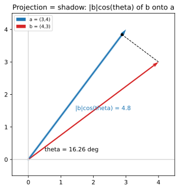

# ch06 — 點積與投影：兩個方向有多「像」

> **本章解決什麼問題**：ch04 用幾何、ch05 用矩陣，把「旋轉可組合」翻成和角公式。本章換一個更靜態的問題：給兩支箭頭，怎麼量「它們指的方向有多像」？答案是 cos——而通往這個答案的橋，是把 ch01 的「影子」隱喻正式升級成**投影（projection）**。本章要說清楚：cosθ 就是「對齊度」這個旋鈕，點積 a·b 有座標與幾何兩張面孔、它們為什麼是同一個數，以及「正交＝點積 0」這件看似平凡的事為什麼是後面傅立葉（ch13）整套機器的地基。它銜接 Part II 旋轉母題的尾聲，也為 Part IV 的波與正交性埋下伏筆。一句話主題：cos 不只活在角度裡，它是兩個方向的內積標準化後的「相似度」。

## 從你已知的出發

你其實已經用過這章的結論，而且用得很熟——只是沒從這個角度想過。

你知道 embedding：把一個詞、一句話、一張圖壓成一個高維向量。兩個東西「意思有多像」，你用 **cosine similarity** 量——兩個向量夾角的 cos，越接近 1 越像、接近 0 不相干、接近 −1 相反。你大概也知道它的算法：兩個向量「點起來」除以各自的長度。你從來沒懷疑過為什麼這個東西能當「相似度」，它就是好用——`cos_sim(a, b) = dot(a, b) / (norm(a) * norm(b))`，一行，跑得飛快。

停一秒。這一行裡藏著本章的全部：分子的 `dot` 是點積，分母的兩個 `norm` 是長度，整個商剛好就是 cosθ。也就是說，你天天在算的「相似度」，數學上就是**夾角的餘弦**。而「夾角的餘弦」這個東西，是怎麼從「把兩個向量的對應分量乘一乘加起來」這種看起來毫無幾何意味的算術裡跑出來的？這兩件事憑什麼是同一個數？這就是本章的核心問題。

換個你更老的直覺：高中物理的做功 `W = F·d = |F||d|cosθ`。你推一個箱子，只有「出力在位移方向上的那一截分量」算數——你斜著推，力裡只有沿著地面的成分做功，垂直地面那部分白費。那個「沿著位移方向的分量」就是力的**投影**，而 `cosθ` 就是「投影佔了多少比例」。力和位移垂直（θ=90°，cosθ=0）時不做功——這就是本章另一個關鍵：**正交＝點積 0＝互不貢獻**。

ch01 我們說 sin、cos 是一個點繞圓時投在牆上的影子。本章把「影子」這個字認真對待：把向量 b 打到 a 的方向上，留下的那道影子有多長？答案是 `|b|cosθ`。cos 從 ch03 的「圓上座標」，到這裡變成「影子佔原長的比例」＝「兩個方向有多對齊」。同一個 cos，又一張臉。

## 投影就是影子：把 b 打到 a 的方向上

先把「影子」講到能算。

你有兩支從原點出發的箭頭 a 和 b，夾角 θ。想像一道光，垂直於 a 的方向照下來（像正午陽光垂直照在 a 這條地面上）。b 在 a 上投下的影子，是從 b 的頂端，垂直放下一條線（垂足），落在 a 所在的那條直線上。從原點到這個垂足的長度，就是 **b 在 a 方向上的投影長**。

這是個直角三角形：斜邊是 b（長度 |b|），夾角是 θ，影子是鄰邊。SOH-CAH-TOA 的 CAH——鄰邊 = 斜邊 × cos——直接給你：

```text
投影長 = |b| · cos θ          ← 影子 = 原長 × 對齊比例
```

讀這條式子要讀出三件事：

- θ=0（b 和 a 同向）：cosθ=1，影子 = |b|，b 整支躺在 a 上，影子就是它自己。
- θ=90°（b 垂直 a）：cosθ=0，影子長 0，b 站得筆直，光照下來只剩一個點。
- θ=120°（b 偏到 a 的反側）：cosθ=−1/2，影子長 −|b|/2——**負的**。負影子不是「長度是負數」這種怪事，是「影子落在 a 的反方向那一側」。投影長帶正負號，正號表示影子和 a 同向、負號表示反向，這個正負號待會兒就是「對齊還是相反」的訊號。

注意一件對稱的事：a 打到 b 上的影子是 `|a|cosθ`，b 打到 a 上的影子是 `|b|cosθ`，兩者一般不一樣（除非 |a|=|b|），但它們共用同一個 θ、同一個 cosθ。cosθ 是「方向關係」，和誰多長無關——這個觀察是下一節「對齊度旋鈕」的種子。

## 點積的兩張面孔，與為什麼它們是同一個數

現在引入點積。它有兩個看起來八竿子打不著的定義，本章最重要的一件事就是證明它們是同一個數。

**面孔一（座標版）**：把對應分量相乘再相加。

```text
a · b = a₁·b₁ + a₂·b₂          ← 二維；n 維就一路加到 aₙ·bₙ
```

這個定義很「機械」——它只認座標，看不出半點幾何味道。這正是你 `cos_sim` 裡那個 `dot()` 在做的事。

**面孔二（幾何版）**：長度乘長度乘夾角的 cos。

```text
a · b = |a| · |b| · cos θ       ← 基準寫法（見 outline 基準表）
```

這個定義很「幾何」——它只認長度和夾角，看不出座標。把它和上一節的投影擺在一起立刻有意思：`a·b = |a| · (|b|cosθ) = |a| ×（b 在 a 上的影子長）`。**點積 = 一支的長度 × 另一支在它上面的影子**。點積就是「投影」配上一個長度權重。這是點積的幾何靈魂。

問題來了：座標版只認座標、幾何版只認長度與角度，憑什麼算出來是同一個數？這不是定義約定，是要證的。我用**餘弦定理（law of cosines）**證——這是標準做法（2026-06 查證），而且它本身就漂亮。

**嚴謹度標示：工程師的嚴謹（每步能口頭說出理由），不依賴未證的東西。** 唯一引用的外部事實是餘弦定理 `c²=p²+q²−2pq·cosθ`，它本身是畢氏定理的推廣（θ=90° 時退化回畢氏），這裡當已知用；嚴格推導見任何一本幾何書，本書 ch04 的和角構造也能推出它。

看下面這個三角形：兩邊是 a、b（夾角 θ），第三邊是 `b − a`（從 a 的頂端連到 b 的頂端的向量）。對這個三角形用餘弦定理，把 |b−a| 當對著 θ 的那條邊：

```text
|b − a|²  =  |a|² + |b|² − 2·|a|·|b|·cos θ        ← 餘弦定理（幾何，左式只認長度）
```

現在把左邊 `|b−a|²` 用座標算開（這一步只認座標，純代數，不准跳）。`b−a = (b₁−a₁, b₂−a₂)`，一個向量的長度平方 = 各分量平方和：

```text
|b − a|² = (b₁−a₁)² + (b₂−a₂)²
         = b₁² − 2a₁b₁ + a₁²  +  b₂² − 2a₂b₂ + a₂²       ← 把平方拆開
         = (a₁²+a₂²) + (b₁²+b₂²) − 2(a₁b₁ + a₂b₂)         ← 重新分組
         = |a|² + |b|² − 2(a₁b₁ + a₂b₂)                   ← 前兩組就是 |a|²、|b|²
```

把這個結果和上面餘弦定理那行擺在一起——兩者左邊都是 `|b−a|²`，所以右邊相等：

```text
|a|² + |b|² − 2(a₁b₁ + a₂b₂)  =  |a|² + |b|² − 2·|a|·|b|·cos θ
```

`|a|²+|b|²` 兩邊都有，消掉；剩下的兩邊同除以 `−2`：

```text
a₁b₁ + a₂b₂  =  |a|·|b|·cos θ
   ↑座標版          ↑幾何版
```

左邊是座標版的點積，右邊是幾何版的點積。**它們相等，證畢。** 沒有任何「顯然」，每步都是國中代數加一條餘弦定理。

> **這裡了不起在哪**（要能用自己的話轉述）：點積把兩種完全不同性質的資訊縫成了一個數。座標版 `a₁b₁+a₂b₂` 是「便於計算」的——丟給電腦，乘加，O(n)，完事，不用算任何角度。幾何版 `|a||b|cosθ` 是「便於理解」的——它告訴你這個數的**意義**是「對齊程度乘上規模」。同一個量，一張臉給機器算、一張臉給人懂。你那行 `cos_sim` 之所以能用又快：分子用座標版算（快），但因為它等於 `|a||b|cosθ`，除掉兩個長度後剩下的 cosθ 是有幾何意義的「對齊度」（懂）。能算又能懂——這就是點積值錢的地方。

順帶一段身世（照查證）：這個「把兩支向量點成一個純量」的運算，是 **Josiah Willard Gibbs（吉布斯）約 1881 年在《Elements of Vector Analysis》裡**從 Hamilton（漢米頓）的四元數乘法裡「切」出來的（2026-06 查證）。漢米頓的四元數乘法本來把點積和叉積綁在一起（`pq = −p·q + p×q`），Gibbs 把這兩塊拆開、各自獨立成現代的點積與叉積記法，從此向量分析才好教好用。記住這個源頭：點積原本是從「旋轉的代數」（四元數，ch05/ch07 會再碰）裡長出來的——它從一開始就和旋轉同源。

## cosθ 作為對齊度旋鈕：1 同向、0 垂直、−1 反向

把幾何版的點積反解出 cosθ，就得到本章的主角公式（基準表）：

```text
cos θ = (a · b) / (|a| · |b|)        ← 對齊度旋鈕
```

把右邊讀成「點積，除掉兩支的長度」。除以長度這一步叫**標準化（normalize）**——它把「規模」洗掉，只留「方向關係」。兩支箭頭，不管各自多長，cosθ 只看它們指的方向夾多少角。這正是 cosine similarity 為什麼要除以兩個 norm：它要的是「方向像不像」，不是「誰比較長」。一個出現 500 次的詞和一個出現 5 次的詞，向量長度差很多，但如果方向一致，cosθ 照樣接近 1。

把這個旋鈕從 +1 轉到 −1，看它一路報告什麼：

| cosθ | θ | 兩個方向的關係 | 你的工程直覺 |
|---|---|---|---|
| **+1** | 0° | 完全同向（重合） | embedding 幾乎一樣的兩個詞；力全用在位移方向 |
| **+0.5** | 60° | 偏同一側，銳角 | 有點像、有正相關 |
| **0** | 90° | 垂直（正交） | 不相干、互不貢獻；力垂直位移不做功 |
| **−0.5** | 120° | 偏反側，鈍角 | 有點相反、負相關 |
| **−1** | 180° | 完全反向 | 意義相反的兩個方向 |

這個旋鈕有一個你該知道為什麼的硬邊界：**cosθ 永遠落在 [−1, 1] 之間，跑不出去**。為什麼跑不出去？因為 `|a·b| ≤ |a|·|b|`——點積的絕對值，永遠不超過兩個長度的乘積。這條叫 **Cauchy–Schwarz 不等式（柯西—施瓦茲不等式）**（2026-06 查證）。直覺很簡單：點積 = `|a| × (b 在 a 上的影子)`，而**影子永遠不可能比原向量還長**（影子最多等於原長，當兩者同向時），所以 `|b 在 a 上的影子| ≤ |b|`，兩邊乘 |a| 就是 Cauchy–Schwarz。把它除進 cosθ 的式子，分子絕對值 ≤ 分母，所以 `−1 ≤ cosθ ≤ 1`。這保證了「用點積定義夾角」這件事良好定義——arccos 吃得進去（ch14 會用到值域這件事）。如果你哪天算 cosine similarity 算出 1.0001，不要懷疑數學，要懷疑浮點誤差（這是 ch06 的陷阱，後面講）。

只看 cosθ 的**正負號**就有用，連算 arccos 都不必：點積為正 ⇒ cosθ 為正 ⇒ 夾角是銳角（同一側）；點積為負 ⇒ 鈍角（偏反側）；點積為零 ⇒ 直角。判斷「兩個方向大致同向還是相背」，看一眼點積的正負就夠。



## 正交：點積為 0，與它為什麼這麼重要

把旋鈕轉到正中間——cosθ=0、θ=90°——這個位置有個專名叫**正交（orthogonal）**，就是「垂直」的向量版說法。代到公式裡：

```text
a ⊥ b   ⇔   cos θ = 0   ⇔   a · b = 0          ← 正交的三種等價說法（基準表）
```

判斷兩支向量垂不垂直，不用畫圖、不用量角度、不用算 arccos——把座標點一點，看是不是 0。`(1,2)·(2,−1) = 1·2 + 2·(−1) = 2 − 2 = 0`，所以 `(1,2)` 和 `(2,−1)` 垂直（待會兒的 worked example 會用到）。「垂直」這個幾何概念，被點積壓縮成「乘加等於零」這個純算術判據——這是點積最被低估的威力。

但正交真正的價值不在「會判斷垂直」，在於它讓**各分量互不干擾、可以各自結帳**。這是本書一條會貫穿到傅立葉的暗線，這裡先把它釘清楚。

你天天用的 xy 座標系，x 軸 `(1,0)` 和 y 軸 `(0,1)` 是正交的（點積 0）。正因為正交，一個向量 `(3,4)` 的 x 分量是 3、y 分量是 4，**這兩個數互不影響**——你改 x 分量不會動到 y 分量。要取出 `(3,4)` 的 x 分量，就把它和 x 軸點積：`(3,4)·(1,0)=3`，乾淨地把 3 撈出來，y 那一項自動歸零（因為 x 軸和 y 軸正交，`4·0=0`）。**正交基底讓「取出某個分量」變成一次點積**，而且取的時候其他分量不會來搗亂。

把這句話放大：如果你有一組兩兩正交的方向，你可以把任何向量沿這些方向拆開，每個方向的「成分」用一次點積（投影）就能單獨算出來，算這個方向時其他方向通通貢獻 0、不來干擾。這就是「各自結帳」——每個正交方向像一個獨立的帳戶，互不透支。

> **為什麼這是傅立葉的地基（ch13 伏筆）**：傅立葉說「任何週期訊號 = 一堆不同頻率的正弦波疊起來」。憑什麼能把一個訊號拆成各頻率的成分、而且每個頻率的係數能單獨算？因為**不同頻率的正弦波彼此「正交」**——只是這裡的「點積」不是有限個座標相乘相加，而是把兩個函數相乘後在一個週期上積分（積分 = 連續版的「乘加」）。`∫ sin(mx)sin(nx) dx = 0`（m≠n）就是「sin(mx) 和 sin(nx) 這兩個方向垂直」的函數版。一旦它們正交，每個頻率的係數就能用「和該頻率的正弦點積（積分）」單獨撈出來，其他頻率自動歸零、不干擾——和你從 `(3,4)` 撈 x 分量是同一招，只是維度從 2 變成無窮多。本章的「正交⇒各自結帳」，到 ch13 原封不動放大成傅立葉係數公式。記住這句：**正交的真正用途不是判斷垂直，是讓拆解成立。**

## cosine similarity：只當錨點，不展開

回到開頭那行 `cos_sim`。現在你看得懂它整個了：分子 `dot(a,b)` 是座標版點積，分母兩個 `norm` 把規模洗掉，商就是 cosθ——兩個 embedding 方向有多對齊。文字檢索把文件和查詢都變成向量、用 cosθ 排序的做法，源頭是 **Gerard Salton（薩爾頓）1960–70 年代在 Cornell 做的 SMART 系統與向量空間模型（vector space model）**（2026-06 查證）；現代的語意搜尋、推薦、RAG 召回，骨子裡還是這同一個 cosθ。

為什麼用 cos 而不用「距離」？因為 cos 只管方向、不管長度——它對「規模」免疫。兩段講同一件事的文字，一段長一段短，向量長度差很多，但方向一致，cosθ 照樣高。這正是上一節「標準化洗掉規模」那件事的應用。

到此為止。embedding 怎麼訓練出來、為什麼方向能編碼語意、用 cos 還是內積還是歐氏距離的工程取捨——那些是另一個領域的事，和本書「三角函數是旋轉與週期的語言」這條主軸無關。本書只借 cosine similarity 當一個你熟悉的錨：**你早就在用 cos 量對齊度了，本章只是把那個 cos 的來歷講清楚**。

## 直覺的陷阱

| 陷阱 | 錯誤直覺 | 會在哪一步把你帶溝裡 | 怎麼自我察覺 |
|---|---|---|---|
| **忘了標準化** | 「點積大 = 方向像」 | 點積 `|a||b|cosθ` 含長度。一個長向量就算方向不太對，點積也可能比短向量大。直接拿點積當相似度排序，會把「長的」排到前面而不是「像的」 | 你要的是方向相似度就**一定要除以兩個 norm**。沒除 norm 的「相似度」其實混進了規模。徵兆：熱門/高頻的項目莫名其妙總是排前面 |
| **cosθ 不是相關係數，但又很像** | 「cosine similarity 就是 Pearson 相關」 | 兩者公式幾乎一樣，但 Pearson 相關**先減掉平均**再算 cos（中心化），cosine similarity 沒有。對沒中心化的資料，兩者結果不同 | 問自己：我有沒有先減平均？沒有就是 cos 相似度，不是相關係數。把它當相關係數解讀會錯 |
| **浮點讓 cosθ 衝出 [−1,1]** | 「cos 理論上在 [−1,1]，所以 arccos 一定吃得下」 | `dot/(na*nb)` 在浮點下可能算出 1.0000000002，`acos(1.0000000002)` 直接拋 `NaN` 或 domain error。兩個幾乎同向的向量最容易踩到 | 算 arccos 前先 `clamp` 到 [−1,1]：`max(-1, min(1, c))`。徵兆：「明明兩個幾乎一樣的向量，算夾角卻 crash」 |
| **正交 ≠ 無關（在非中心化資料裡）** | 「點積 0 就是兩件事毫無關係」 | 幾何上正交是「垂直」，統計上「無關」是「相關係數 0」。只有中心化後兩者才一致。把幾何正交直接讀成「統計獨立」會過度解讀 | 分清楚你在哪個空間：純幾何向量 → 正交是垂直；統計變數 → 要先中心化才談「無關」 |
| **投影長的負號** | 「投影是長度，不會是負的」 | 鈍角時 `|b|cosθ` 是負數——影子落在 a 的反方向。把它當「長度」取絕對值，會丟掉「方向相反」這個關鍵資訊 | 投影是**帶號**的純量（scalar projection），負號是方向訊號不是錯誤。要無號長度才另外取絕對值 |
| **零向量沒有方向** | 「任何向量都能算夾角」 | a 或 b 是零向量時 |a| 或 |b| =0，cosθ 公式分母為 0，夾角無定義。`cos_sim` 遇到全零 embedding 會除以零 | 算 cosθ 前檢查兩個長度都 >0（或 > eps）。零向量「指向哪裡」本身沒意義 |

最該內化的是**第一個**：點積本身不是相似度，**標準化後**才是。點積 = 對齊度 × 規模；你要純對齊度，就得把規模除掉。這也回頭解釋了為什麼幾何版要寫成 `|a||b|cosθ` 而不只是 cosθ——點積天生帶著兩支的長度，cosθ 是把長度剝掉之後的純方向關係。搞混「點積」和「cosθ」，是這章所有 bug 的共同源頭。

## 紙上推演

**推演 1 — 用餘弦定理證兩張面孔相等 [20 分鐘] ★★**
不看上面的推導，自己重走一遍：對以 a、b 為兩邊、`b−a` 為第三邊的三角形用餘弦定理，把 `|b−a|²` 同時用「餘弦定理（幾何）」和「座標展開（代數）」算兩次，逼出 `a₁b₁+a₂b₂=|a||b|cosθ`。寫完回答一個問題：這個證明哪一步用到了「座標系是直角座標（基底正交）」？（提示：`|b−a|²=(b₁−a₁)²+(b₂−a₂)²` 這條畢氏式子，只在座標軸互相垂直時成立。）

**推演 2 — 只看點積正負號判斷夾角 [10 分鐘] ★**
給三對向量，**只算點積、只看正負號**，判斷夾角是銳角／直角／鈍角，不准算 arccos：
(a) `(2,1)` 與 `(1,3)`；(b) `(2,1)` 與 `(1,−2)`；(c) `(2,1)` 與 `(−3,−1)`。
然後用一句話說明：為什麼光看點積的正負就能定銳角／鈍角，背後是 cosθ 的什麼性質在撐？

**推演 3 — 把「正交⇒各自獨立」講出來 [口頭，15 分鐘] ★★★（ch13 伏筆）**
向一個只懂座標、沒學過傅立葉的工程師，口頭講清楚：「為什麼用一組兩兩正交的方向當基底，每個方向的成分可以各自算、互不干擾？」要講到他能點頭說「所以拆解才成立」。然後預告一句：如果把『點積』換成『兩個函數相乘再積分』，這套『各自結帳』就會變成什麼？（不必算，只要說出「那會是傅立葉，不同頻率的正弦正交」這個方向即可。）

**推演 4 — 投影的負號 [10 分鐘] ★★**
取 `a=(1,0)`、`b=(−1,1)`。算 b 在 a 上的投影長 `|b|cosθ`（先算 a·b、再算 |a||b|、再湊）。你會得到一個負數——解釋這個負號在幾何上是什麼意思（影子落在哪裡），並說明為什麼「投影是帶號純量」這件事不是 bug 而是 feature。

### 推演解答

**推演 1。** 餘弦定理：`|b−a|² = |a|²+|b|²−2|a||b|cosθ`。座標展開：`|b−a|² = (b₁−a₁)²+(b₂−a₂)² = (a₁²+a₂²)+(b₁²+b₂²)−2(a₁b₁+a₂b₂) = |a|²+|b|²−2(a₁b₁+a₂b₂)`。兩式左邊同為 `|b−a|²`，故右邊相等，消去 `|a|²+|b|²`、同除 `−2`，得 `a₁b₁+a₂b₂=|a||b|cosθ`。**用到正交座標的那一步**：`|b−a|²=(b₁−a₁)²+(b₂−a₂)²`——這是畢氏定理，只在 x 軸與 y 軸互相垂直時成立。換句話說，「座標版點積 = 幾何版點積」這件事，本身就建立在「座標基底正交」之上。這是個漂亮的閉環：正交讓畢氏成立、畢氏讓兩張面孔相等、兩張面孔讓你能用點積判斷正交。

**推演 2。**
(a) `(2,1)·(1,3)=2+3=5>0` ⇒ 銳角。
(b) `(2,1)·(1,−2)=2−2=0` ⇒ 直角（正交）。
(c) `(2,1)·(−3,−1)=−6−1=−7<0` ⇒ 鈍角。
背後性質：`cosθ=(a·b)/(|a||b|)`，分母 `|a||b|` 恆正（非零向量），所以 cosθ 的正負號**完全由分子 a·b 的正負號決定**。而 cosθ>0⇔θ<90°（銳角）、=0⇔90°、<0⇔θ>90°（鈍角）。判斷銳鈍角根本不必算角度，看分子正負即可。

**推演 3（要點）。** 講稿骨架：(1) 一組兩兩正交的方向（如 x 軸、y 軸），彼此點積為 0。(2) 要取出向量在某個方向上的成分，就拿它和那個方向（單位向量）點積——這是一次投影。(3) 關鍵：算「在方向 u 上的成分」時，其他正交方向 v 的貢獻是 `(v 方向的量)×(u·v)=(...)×0=0`，自動消失、不來干擾。(4) 所以每個正交方向像一個獨立帳戶，可以各自結帳：拆解 = 對每個正交方向各做一次投影。(5) 預告：把「點積」升級成「兩函數相乘後在一週期上積分」，把「正交方向」換成「不同頻率的正弦」（`∫sin(mx)sin(nx)dx=0`, m≠n），同一套「各自結帳」就變成傅立葉——每個頻率的係數用一次積分單獨撈出來。常見錯路：只講「正交＝垂直」就停了，沒講到「所以拆解時別的成分歸零」這個真正有用的後果。

**推演 4。** `a=(1,0)`、`b=(−1,1)`。`a·b=(1)(−1)+(0)(1)=−1`；`|a|=1`、`|b|=√2`；`cosθ=−1/(1·√2)=−1/√2≈−0.7071`（θ=135°）。投影長 `|b|cosθ=√2·(−1/√2)=−1`。負號的意思：b 在 a 上的影子，落在 a 的**反方向**那一側（a 指向 +x，影子卻在 −x 方向，落點 x 座標是 −1）。這不是錯——帶號投影（scalar projection）用正負號告訴你「影子和 a 同向還是反向」。要無號的「影子有多長」才取絕對值得 1；但多數時候那個正負號正是你要的資訊（例如做功的正負：負功代表力在阻礙運動）。

### 動手生圖

本章的圖（也是本章的 Python 小實驗）：把兩支向量 a、b 從原點畫出來，畫出 b 投影到 a 上的影子（垂足、虛線），標出夾角 θ 與投影長 `|b|cosθ`。讓你**看見** cos 就是「影子佔原長的比例」。圖用本章 worked example 的數字 `a=(3,4)`、`b=(4,3)`（θ≈16.26°、投影長 4.8），所以圖和算式對得起來。

```python
# ch06 figure: projection of b onto a (foot + dashed drop), angle theta, projection length |b|cos(theta)
from pathlib import Path
import numpy as np
import matplotlib
matplotlib.use("Agg")          # headless; no display needed
import matplotlib.pyplot as plt

OUT = Path(__file__).resolve().parent / "out" / "ch06-projection-cos.svg"
OUT.parent.mkdir(parents=True, exist_ok=True)

a = np.array([3.0, 4.0]); b = np.array([4.0, 3.0])     # worked-example vectors
proj_scalar = a.dot(b) / np.linalg.norm(a)             # |b|cos(theta) = 24/5 = 4.8
foot = (a.dot(b) / a.dot(a)) * a                       # foot of perpendicular on line a -> (2.88, 3.84)
theta = np.degrees(np.arccos(a.dot(b)/(np.linalg.norm(a)*np.linalg.norm(b))))

fig, ax = plt.subplots(figsize=(5, 5))
ax.quiver(0, 0, *a, angles="xy", scale_units="xy", scale=1, color="C0", label="a = (3,4)")
ax.quiver(0, 0, *b, angles="xy", scale_units="xy", scale=1, color="C3", label="b = (4,3)")
ax.plot([b[0], foot[0]], [b[1], foot[1]], "k--", lw=1)         # drop b onto line a
ax.plot([0, foot[0]], [0, foot[1]], color="C0", lw=4, alpha=0.35)  # the shadow on a
ax.plot(*foot, "ko", ms=4)                                     # foot point
ax.annotate(f"|b|cos(theta) = {proj_scalar:.1f}", (foot[0]/2, foot[1]/2-0.4), color="C0")
ax.annotate(f"theta = {theta:.2f} deg", (0.5, 0.25))
ax.axhline(0, color="0.85"); ax.axvline(0, color="0.85")
ax.set_aspect("equal"); ax.set_xlim(-0.5, 4.5); ax.set_ylim(-0.5, 4.5)
ax.legend(loc="upper left", fontsize=8)
ax.set_title("Projection = shadow: |b|cos(theta) of b onto a")
fig.savefig(OUT, bbox_inches="tight")
print("wrote", OUT)            # build_figures.py reads this
```

**預期輸出**：一張正方形比例的圖。藍色箭頭 a 指向 (3,4)、紅色箭頭 b 指向 (4,3)，兩支幾乎並排（夾角才 16.26°，所以看起來很「像」——這正是 cosθ=0.96「高度對齊」的肉眼版）。從 b 的頂端有一條黑色虛線垂直落到 a 所在的直線上，垂足是黑點 (2.88, 3.84)；從原點到垂足那一段被一條半透明粗藍線標出來——那就是影子，長度 4.8。圖上標 `|b|cos(theta) = 4.8` 與 `theta = 16.26 deg`。終端機印出 `wrote .../out/ch06-projection-cos.svg`。

**改參數看什麼**：

- 把 `b` 改成 `(0, 5)`（和 a 夾角變大）：影子變短，投影長從 4.8 掉下來；改成和 a 同向的 `(6, 8)`（=2a），影子會等於 b 整支長（cosθ=1）。把「對齊度旋鈕」用眼睛轉一遍。
- 把 `b` 改成 `(−4, 3)`，算出來 `a·b=−16+12=−4<0`：垂足會落到原點的**另一側**（投影長變負），親眼看「負影子」是什麼——影子掉到 a 的反方向去了。
- 把 `b` 改成 `(4, −3)`，這時 `a·b=12−12=0`：垂足正好落在原點，影子長 0——兩支正交，b 在 a 上不留影子。這就是「正交＝投影為 0＝點積 0」的圖像版。
- 把 a、b 同時放大兩倍（`a=(6,8)`、`b=(8,6)`）：夾角 θ 和 cosθ 一點都不變（方向沒動），但點積變成原來的 4 倍——親眼看「cosθ 不管規模、點積管規模」這件事，正是為什麼相似度要除 norm。

## 自我檢核

口頭自答，講得出來才算過關：

1. 用「影子」一句話解釋投影長為什麼是 `|b|cosθ`。θ=90° 時影子多長？θ 是鈍角時影子的「長度」為什麼會是負的，那個負號在說什麼？
2. 點積的兩張面孔各是什麼？不看書，講出用餘弦定理證它們相等的骨架（對哪個三角形、把哪條邊算兩次）。這個證明偷偷用到了「座標軸正交」這件事——用在哪一步？
3. `cosθ=(a·b)/(|a||b|)` 裡，除以兩個長度（標準化）做掉了什麼？為什麼 cosine similarity 一定要除、不能直接拿點積排序？
4. 為什麼 cosθ 永遠落在 [−1,1]、跑不出去？（用「影子不會比原向量長」這個直覺講，名字叫什麼不重要。）這跟你算 arccos 前該做什麼防禦有什麼關係？
5. 「正交＝點積 0」這件事，真正有用的後果**不是**「會判斷垂直」，而是什麼？用「各自結帳／獨立帳戶」講一遍。
6. 上一題的「各自結帳」，到了傅立葉（ch13）會變成什麼？（點積換成什麼運算、正交方向換成什麼。）
7. 點積、cosθ、投影長，這三個量哪些帶長度（規模）資訊、哪些不帶？把 a、b 都放大兩倍，這三個量各自怎麼變？

## 延伸閱讀

- **3Blue1Brown,「Dot products and duality」**（Essence of Linear Algebra 系列）—— 把點積的「為什麼是投影」用對偶（duality）的角度講到骨子裡：為什麼「把向量點一個數」這件事，幾何上等於投影到那個方向上。看完你會明白本章的兩張面孔為什麼非相等不可。https://www.3blue1brown.com/topics/linear-algebra
- **Gregory Gundersen,「Two Forms of the Dot Product」** —— 一篇乾淨的部落格短文，專門把座標版與幾何版的等價用餘弦定理講清楚，正是本章核心證明的另一個寫法，適合對照複核。https://gregorygundersen.com/blog/2018/06/26/dot-product/
- **Wikipedia,「Dot product」/「Cauchy–Schwarz inequality」** —— 想把「為什麼 cosθ 不超出 [−1,1]」釘到不等式層級、或想看 n 維與內積空間的推廣，這兩條是乾淨入口；也有點積從 Gibbs 切出四元數乘法的歷史脈絡。https://en.wikipedia.org/wiki/Dot_product
- **Tristan Needham《Visual Complex Analysis》（OUP，2023 年 25 週年版）** —— 把點積與旋轉、複數放在同一個視覺框架；本章「點積與旋轉同源（都從四元數來）」這條線，在這本書裡會接到 ch07 的複數乘法。https://global.oup.com/academic/product/visual-complex-analysis-9780192868923
- **想深究 cosine similarity 在檢索/embedding 的用法**：搜尋 Gerard Salton 的向量空間模型與 SMART 系統（Cornell，1960–70s，2026-06 查證為 cosine 相似度進入資訊檢索的源頭）。但記得本書只借它當錨——往工程深處走是另一個領域的事，和「三角是旋轉與週期的語言」這條主軸無關。
