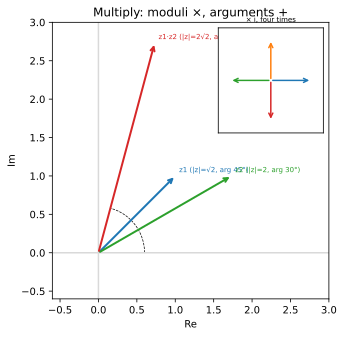

# ch07 — 複數平面：乘法為什麼是「旋轉加縮放」

> **本章解決什麼問題**：這是 Part III「複數：旋轉的代數」的開場。前面兩個 Part 把「旋轉可以組合」這件事講了兩遍——幾何（ch04）、矩陣（ch05）。本章換一套全新的工具：複數。你早就會 `a+b·i` 的四則運算，但你可能從來沒問過一個問題——**為什麼複數乘法會自帶旋轉？** 答案是：把複數看成平面上的箭頭，乘法就是「模相乘、輻角相加」。而當我們把這件事推清楚時，和角公式會**第三次**從天而降。本章刻意只用到 ch04 的和角公式來展開，**不碰 Euler 公式**（那是 ch08 的事）——因為用 Euler 證和角會變成循環論證。一句話的主題：複數是「旋轉與縮放」這個動作的代數化身。

```
Part I 搖籃與真身        Part II 旋轉是母題       Part III 複數：旋轉的代數 ◄你在這裡
ch01 三角形→圓的真身     ch04 和角公式            ch07 複數平面=旋轉+縮放
ch02 弧度            →   ch05 旋轉矩陣        →   ch08 Euler 公式 ★
ch03 單位圓：六函數的家  ch06 點積與投影          ch09 de Moivre 與單位根
                                                        │
                                                        ↓
Part V 近親與收官        Part IV 週期與波
ch14 反函數與 atan2  ←   ch13 傅立葉的門口    ←   ch10 波的解剖（相量）
ch15 雙曲孿生＋收官 ★    ch12 疊加：拍頻/Lissajous  ch11 為什麼 sin′=cos
```

## 從你已知的出發

你會 `a+b·i` 的四則運算。`(2+3i)+(1−i)=3+2i`、`(1+i)·(1−i)=1−i²=2`，這些你閉著眼睛都能算。複數對你不是新東西——它是一個帶著怪規則 `i²=−1` 的二元數對，你把它當成一種能裝兩個實數的容器在用。

但我猜你從來沒被人好好回答過一個問題：**為什麼這個怪規則會這麼有用？** 為什麼工程上、物理上、訊號處理上，凡是碰到「東西在轉」或「東西在週期重複」的場合，複數就會冒出來霸佔整個舞台？交流電用複數、訊號的相位用複數、量子力學整碗都是複數。如果複數只是「一個記帳用的二元數對」，它沒道理紅成這樣。

這一章要給你的答案，回到 Part II 的母題：**旋轉**。你在 ch05 看過，把「轉一個角」寫成機器，需要一個 2×2 矩陣，四個格子裝著 cos 和 sin。那是個堂堂正正的工具，但它笨重——四個數、要記矩陣乘法的規則。複數做同一件事，只要**一個數**，而且乘法規則你早就會。遊戲後端裡你用矩陣做 2D 變換；其實在 2D，一個複數就能把「縮放＋旋轉」打包起來，乘上去就轉好縮好了。CORDIC（ch08、ch14 會提）那一整套「用一連串小旋轉算 sin/cos」的硬體演算法，骨子裡也是在複數平面上轉箭頭。

所以本章的任務很單純：把「複數＝平面上的箭頭」這個視角擦亮，然後盯著乘法看——看它為什麼天生帶旋轉。看懂的那一刻，你會發現和角公式又跑出來了，這次是從複數乘法裡掉出來的。**這是同一個和角公式的第三種證法**（見 ch04 幾何、ch05 矩陣），我會在推完之後明確對帳。

## 複數是平面上的箭頭：加法平凡，乘法是個謎

把 `a+b·i` 畫到平面上：橫軸放實部 `a`（實軸，real axis，標 Re），縱軸放虛部 `b`（虛軸，imaginary axis，標 Im）。於是 `3+2i` 就是平面上座標 `(3, 2)` 的那個點，或者——更好的講法——是從原點指向 `(3, 2)` 的一支箭頭（向量）。這個平面叫**複數平面（complex plane）**，又稱 Argand 圖（Argand diagram）。歷史上它由三人各自獨立想到（見本章末歷史段）。

一旦複數是箭頭，**加法立刻變得平凡**：`(2+3i)+(1−i)=3+2i`，就是兩支箭頭頭尾相接的向量相加——實部加實部、虛部加虛部，跟你在 ch06 對向量做的事一模一樣。沒有任何驚喜。複數的加法就是 2D 向量加法，換了個寫法而已。

驚喜全在乘法。向量沒有一個「天生的」相乘方式（點積給你一個純量、叉積要到 3D），但複數有——而且這個乘法做的事，向量加法做不到。我們先不講大道理，先算一個最小的例子，逼自己看出規律。

### 第一個線索：乘以 i 就是逆時針轉 90°

拿任何一個複數 `z=a+b·i`，乘上 `i` 看看。照分配律老實乘開（記得 `i²=−1`）：

```text
(a + b·i)·i = a·i + b·i²
            = a·i + b·(−1)        ← i² = −1
            = −b + a·i             ← 整理成「實部 + 虛部·i」
```

所以 `z·i` 把 `(a, b)` 這支箭頭送到了 `(−b, a)`。停在這裡盯十秒鐘：`(a, b) → (−b, a)` 是什麼變換？這正是 ch05 的旋轉矩陣 `R(90°)=[[0,−1],[1,0]]` 作用在 `(a, b)` 上的結果——**逆時針轉 90°**。

具體驗證一下。實數 `1`（也就是 `1+0i`，箭頭指向正右方 `(1, 0)`）乘以 `i`，得到 `i`（指向正上方 `(0, 1)`）：右 → 上，轉了 90° 逆時針。再乘一次 `i`：`i·i=i²=−1`，從 `(0, 1)` 轉到 `(−1, 0)`，指向正左方。再乘：`(−1)·i=−i`，到 `(0, −1)`，指向正下方。再乘：`(−i)·i=−i²=1`，轉回 `(1, 0)`。**乘以 i 四次，箭頭轉了四個 90°、回到原點。** 這四步就是本章 figure 的副圖。

這個小觀察一下子幫你重新理解了那個怪規則 `i²=−1`：它不是「一個負數開根號的瘋狂約定」，它是說「**轉 90° 兩次，等於轉 180°，也就是把箭頭調頭、變成原來的負號**」。`i` 不神祕，它就是「逆時針轉 90°」這個動作。`i²=−1` 翻成白話是「轉兩個 90° 等於指反方向」——這誰都同意。複數平面把「負數的平方根」這件聽起來很玄的事，降維成「轉個彎」。

> **這裡了不起在哪**（要能用自己的話轉述）：實數線上，乘法只會做兩件事——拉長縮短（乘以 2、乘以 0.5），以及調頭（乘以 −1）。實數的乘法被困在一條線上，最多讓你「反向」。但平面上你多了一個自由度：你可以**轉**。`i` 就是那個把你帶離這條線、繞到第二維去的最小旋轉。實數乘法只有縮放，複數乘法多了旋轉——多出來的那一塊，全是 `i` 帶來的。

### 極式：把箭頭用「長度＋方向」描述

要把「乘法＝旋轉＋縮放」講乾淨，得先換一套座標。箭頭 `a+b·i` 有兩種描述法：

- **直角座標（Cartesian）**：`(a, b)`，記「往右走多少、往上走多少」。加法在這套座標下最舒服。
- **極式（polar form）**：`(r, θ)`，記「箭頭多長、指向哪個方向」。乘法在這套座標下最舒服。

長度 `r` 叫**模（modulus）**，寫 `|z|`，由畢氏定理給出 `r=√(a²+b²)`——就是箭頭的長度（ch06 的向量長度）。方向 `θ` 叫**輻角（argument）**，寫 `arg z`，是箭頭與正實軸的夾角（逆時針為正，跟全書一致）。兩者的換算就是 ch03 的單位圓定義往外放大 `r` 倍：

```text
a = r·cos θ        ← 實部 = 長度 × cos（方向）
b = r·sin θ        ← 虛部 = 長度 × sin（方向）
```

所以任何複數都能寫成

```text
z = r·(cos θ + i·sin θ)        ← 極式：模 r 在外，方向 θ 在 cos/sin 裡
```

這個 `cos θ + i·sin θ` 是一支**長度 1、指向 θ** 的單位箭頭；前面乘上 `r` 把它拉長到正確長度。注意我**沒有**寫 `e^{iθ}`——那是 Euler 公式的寫法，是 ch08 的事。本章從頭到尾只用 `cos θ + i·sin θ` 這個老實的三角寫法，因為接下來要證的東西如果用 `e^{iθ}` 會變成循環論證（理由在脊椎那一節說清楚）。

舉個例子把模和輻角算熟。`z=1+i`：模 `|z|=√(1²+1²)=√2≈1.41421`，輻角是箭頭 `(1, 1)` 與正實軸的夾角——它落在第一象限的對角線上，所以 `arg z=45°=π/4`。再驗證極式：`√2·(cos45° + i·sin45°)=√2·(√2/2 + i·√2/2)=1+i` ✓（用了 ch03 的 `cos45°=sin45°=√2/2`）。

## 脊椎第三證：把兩個極式相乘，和角公式自己掉出來

現在來看乘法的祕密。取兩個複數，都寫成極式：

```text
z₁ = r₁·(cos α + i·sin α)
z₂ = r₂·(cos β + i·sin β)
```

把它們相乘。我只用分配律和 `i²=−1`，一步都不跳：

```text
z₁·z₂ = r₁·r₂·(cos α + i·sin α)·(cos β + i·sin β)

      = r₁·r₂·[ cos α·cos β + cos α·(i·sin β)
                + (i·sin α)·cos β + (i·sin α)·(i·sin β) ]      ← 四項全展開

      = r₁·r₂·[ cos α·cos β + i·cos α·sin β
                + i·sin α·cos β + i²·sin α·sin β ]

      = r₁·r₂·[ (cos α·cos β − sin α·sin β)                     ← i² = −1，把它併進實部
                + i·(sin α·cos β + cos α·sin β) ]               ← 含 i 的併成虛部
```

盯著最後兩個括號裡的東西。左邊那個 `cos α·cos β − sin α·sin β`——這是 ch04 的 `cos(α+β)`。右邊那個 `sin α·cos β + cos α·sin β`——這是 ch04 的 `sin(α+β)`。**我什麼都沒湊，只是把兩個複數老實乘開，和角公式自己長在括號裡。** 代換進去：

```text
z₁·z₂ = r₁·r₂·(cos(α+β) + i·sin(α+β))          ← 模相乘 r₁·r₂、輻角相加 α+β
```

讀出這行結論：兩個複數相乘，**模相乘（r₁·r₂）、輻角相加（α+β）**。乘法就是「把兩支箭頭的長度乘起來、把兩個方向角加起來」——縮放（長度乘）加旋轉（角度加）。這就是本章標題那句話的完整證明。

回頭看「乘以 i」的小例子，現在它是這條規則的特例：`i` 的模是 1、輻角是 90°；乘上 `i` 等於「模乘以 1（長度不變）、輻角加 90°（轉 90°）」——所以乘以 `i` 就是純旋轉 90°，不縮放。一切自洽。



### （見 ch04、ch05）這是同一個和角公式的第三種證法

明確對帳，因為這是脊椎章的義務。

ch04 用幾何：在單位圓上把一個角 a 的點再轉 b，用投影把新座標拆成 `sin a cos b`、`cos a sin b` 這些線段長度，拼出 `sin(a+b)`。每一項是圖上一段長度。

ch05 用矩陣：`R(a)·R(b)=R(a+b)`，把兩個旋轉矩陣按矩陣乘法乘開，四個格子裡逐字長出和角公式。

ch07（本章）用複數：把兩個極式 `r(cos+i·sin)` 相乘，分配律展開後，實部自動是 `cos(α+β)`、虛部自動是 `sin(α+β)`。

三條路推出**完全一樣**的 `sin(a+b)`、`cos(a+b)`。差別只在容器：ch04 把資訊放在「一個被轉動的點的座標」、ch05 放在「整個旋轉變換的矩陣」、ch07 放在「一個被相乘的複數的實虛部」。三者都在說同一句話：**旋轉可以組合，組合時角度相加。** 複數乘法之所以「天生帶旋轉」，正因為它的展開式裡藏著和角公式；而和角公式之所以成立，正因為旋轉可以疊加。這兩件事是一體兩面。

> **必須點破的循環陷阱**：你可能在別的書上看過「用 Euler 公式證複數乘法」：`r₁e^{iα}·r₂e^{iβ}=r₁r₂e^{i(α+β)}`，一行就完事，輻角相加是指數律 `e^x·e^y=e^{x+y}` 的直接後果，漂亮得不像話。那個證法**對**，但它在本書這個位置會是**循環論證**——因為 Euler 公式 `e^{iθ}=cos θ+i·sin θ` 本身（不管你從級數推還是從旋轉推，見 ch08）內建了和角公式的全部內容。用 Euler 證和角，等於用結論證前提。所以本章死守 `cos θ+i·sin θ` 的三角寫法、只借用 ch04 已經獨立證好的和角公式。等到 ch08 我們才會反過來：先有和角（已三證），再看 Euler 如何把它一行收掉——那是脊椎第四證，順序不能顛倒。**這裡還沒有 Euler。**

## 除法、共軛：把乘法的規則倒過來用

乘法是「模相乘、輻角相加」，那除法的規則你閉著眼睛都能猜：**模相除、輻角相減**。

```text
z₁ / z₂ = (r₁ / r₂)·(cos(α−β) + i·sin(α−β))        ← 模相除、輻角相減
```

直覺：除法是乘法的逆。如果 `z₂` 是「拉長 r₂ 倍、轉 β」，那「除以 z₂」就是「縮短回 1/r₂、轉回 −β」——把 z₂ 做過的事撤銷。這也解釋了為什麼 `1/i=−i`：`i` 是「轉 90°」，要撤銷它就是「轉 −90°」，也就是 `−i`（你可以驗證 `i·(−i)=−i²=1`✓）。

但實務上你不會把每個數都先換成極式再相除。直角座標下有個更機械的招式，用到**共軛（conjugate）**。`z=a+b·i` 的共軛寫 `z̄=a−b·i`：虛部變號。幾何上，`z̄` 是 `z` **對實軸的鏡射**——箭頭以橫軸為鏡子翻下去（或翻上來）。輻角從 θ 變成 −θ，模不變。

共軛最關鍵的性質：`z·z̄` 是個實數，而且等於模的平方。

```text
z·z̄ = (a+b·i)(a−b·i) = a² − (b·i)² = a² − b²·i² = a² + b²        ← = |z|²
```

（也可以用極式看：`z` 輻角 θ、`z̄` 輻角 −θ，相乘輻角 θ+(−θ)=0，落回正實軸，模 `r·r=r²`。）

有了這個，除法就變成「把分母乘成實數」的技巧：分子分母同乘分母的共軛。

```text
1 / (1+i) = (1−i) / [(1+i)(1−i)] = (1−i) / 2 = 1/2 − (1/2)i
```

分母 `(1+i)(1−i)=|1+i|²=2` 變成乾淨的實數，剩下的就是實數除法。數值上 `1/2−(1/2)i` 的模是 `√(1/4+1/4)=√(1/2)=1/√2`，正好是 `1/|1+i|=1/√2`（模相除✓）；輻角是 `−45°`，正好是 `0−45°`（輻角相減✓）。兩套看法對得上。

共軛還有一個你在訊號處理會撞見的身分：它讓「取模」「算實部」這些操作變代數。`Re(z)=(z+z̄)/2`、`|z|²=z·z̄`——這些在 ch15 推 `cos x=(e^{ix}+e^{−ix})/2` 時會回收，先記著這個味道。

## Worked example：(1+i)² 與 (1+i)(√3+i)，兩路自我複核

本書的規矩是每個結果都用兩條獨立路徑對帳。複數乘法剛好天生有兩條路：**極式**（模相乘、輻角相加，看幾何）與**直角展開**（分配律硬乘，看代數）。算對的標誌是兩路給出同一個數。

**例一：(1+i)²。**

極式路：`1+i` 的模 `√2`、輻角 `45°`。平方就是「自己乘自己」，模相乘 `√2·√2=2`、輻角相加 `45°+45°=90°`。所以 `(1+i)²` 的模 2、輻角 90°——輻角 90° 表示指向正上方（正虛軸），模 2 表示長度 2，那就是 `2i`。

```text
(1+i)² —(極式)→ 模 √2·√2 = 2，輻角 45°+45° = 90°  ⇒  2·(cos90° + i·sin90°) = 2·(0 + i·1) = 2i
```

直角路：分配律硬乘。

```text
(1+i)² = 1 + 2·i + i² = 1 + 2i + (−1) = 2i              ← i² = −1
```

兩路都給 `2i`。✓（這對應全書基準表的 `(1+i)²=2i`。）幾何上這也好玩：把長度 √2、指 45° 的箭頭「平方」，等於把它轉到 45° 的兩倍 90°、長度變成 √2 的平方 2——平方就是「角度翻倍、長度平方」，這正是 ch09 de Moivre 定理的種子。

**例二：(1+i)(√3+i)。**

先量 `√3+i` 的極式：模 `√((√3)²+1²)=√(3+1)=√4=2`，輻角是箭頭 `(√3, 1)` 的方向——`tan θ=1/√3`，所以 `θ=30°`（這是 ch03 的 30-60-90，`(√3, 1)` 落在 30° 線上）。

極式路：模相乘 `√2·2=2√2≈2.82843`、輻角相加 `45°+30°=75°`。所以乘積是

```text
(1+i)(√3+i) —(極式)→ 2√2·(cos75° + i·sin75°)，模 2√2，輻角 75°
```

這也順帶給了你 `cos75°`、`sin75°` 一條複數版的算法——還記得 ch04 的 worked example 算過 `sin75°=(√6+√2)/4≈0.96593` 嗎？這裡的乘積實部除以模 `2√2` 就會回到 `cos75°`，殊途同歸。

直角路：分配律硬乘。

```text
(1+i)(√3+i) = √3 + i + √3·i + i²
            = √3 + i + √3·i − 1                ← i² = −1
            = (√3 − 1) + (√3 + 1)·i             ← 實部、虛部分開
            ≈ 0.73205 + 2.73205·i
```

對帳：直角路給 `(√3−1)+(√3+1)i≈0.73205+2.73205i`。極式路說模該是 `2√2≈2.82843`、輻角 `75°`，換回直角座標是 `2√2·cos75°+i·2√2·sin75°`。算一下：`2√2·cos75°≈2.82843·0.25882≈0.73205`、`2√2·sin75°≈2.82843·0.96593≈2.73205`。**兩路完全吻合。** ✓

這個例子是本章 figure 的主圖：`z₁=1+i`（45°）、`z₂=√3+i`（30°）、乘積 `z₁·z₂`（75°）三支箭頭，你會親眼看到 `45°+30°=75°`（角度疊）、長度 `√2×2=2√2`（長度乘）。

## 直覺的陷阱

複數平面把「旋轉」講得太順了，順到容易讓人在幾個地方滑倒。以下是最常把人帶溝裡的：

| 陷阱 | 錯誤直覺 | 會在哪裡爆掉 | 怎麼自我察覺 |
|---|---|---|---|
| **把 `i²=−1` 當神祕約定** | 「負數哪能開根號，這是硬湊的」 | 你永遠不會理解複數為何帶旋轉，把它當記帳符號用 | 問自己：`i` 是哪個幾何動作？答不出「逆時針轉 90°」就是還沒懂 |
| **以為乘法跟加法一樣是分量各做** | 「乘法大概也是實部乘實部、虛部乘虛部吧」 | `(1+i)(1+i)` 你會算成 `1+i²=0`（錯），正解 `2i` | 記住：加法是分量各做、乘法是「模乘輻角加」，兩者完全不同的幾何 |
| **輻角忘了週期性 / 象限** | 「`arg z` 就是 `arctan(b/a)`」 | `−1−i` 在第三象限（輻角 225° 或 −135°），但 `arctan((−1)/(−1))=arctan(1)=45°` 給你第一象限——丟了象限 | 這正是 ch14 的 `atan2(b, a)` 要解決的事；`arctan(b/a)` 只能回兩象限 |
| **以為複數乘法可交換就「啥都可交換」** | 「複數乘法 `z₁z₂=z₂z₁`，旋轉本來就隨便交換」 | 2D 旋轉可交換是因為角度相加可交換（`α+β=β+α`），這是 2D 特權；3D 旋轉不可交換（見 ch05、四元數） | 想拿這直覺去 3D 前，先停——2D 的「順序無所謂」在 3D 是 bug 溫床 |
| **把模和輻角的單位搞混** | 「輻角用度數還是弧度無所謂」 | 程式裡 `Math.atan2`、`cmath.phase` 一律回**弧度**；你拿去當度數畫圖、再丟回 `cos` 會錯 57 倍（見 ch02 的 deg/rad 坑） | 任何時候輻角出現，先確認單位；本書極式內預設弧度，度數一律標 `°` |
| **共軛與相反搞混** | 「`z̄` 大概就是 `−z` 吧」 | `−z` 是轉 180°（過原點對稱）、`z̄` 是對實軸鏡射，完全不同的箭頭 | `z=1+i`：`−z=−1−i`（第三象限）、`z̄=1−i`（第四象限），畫出來一眼看出差別 |

這些陷阱有個共同的根：**一旦你忘記複數是平面上的箭頭、退回把它當「帶 i 的代數符號」，幾何直覺就斷線了。** 自我察覺的總開關只有一句話——隨時都能說出「這個複數是哪支箭頭、這個運算是什麼幾何動作」，就不會掉進去。

## 紙上推演

**推演 1 — 把 3+3i 寫成極式，並算它乘以 i [15 分鐘] ★**
先把 `3+3i` 寫成極式（模、輻角）。再算 `(3+3i)·i`，用**幾何**（極式：輻角加 90°）和**代數**（分配律）兩路各算一次，確認一致。

**推演 2 — 用極式相乘證明和角公式（脊椎對帳）[25 分鐘] ★★★**
不看本章正文，自己把 `z₁=cos α+i·sin α`、`z₂=cos β+i·sin β`（都取模 1）相乘、展開、整理，逼出 `cos(α+β)`、`sin(α+β)`。然後口頭回答：這跟 ch04 的幾何證法、ch05 的矩陣證法「是同一件事」這句話，那件事是什麼？並說出：為什麼這裡**不能**用 `e^{iθ}` 來證？

**推演 3 — 為什麼複數乘法天生帶旋轉，實數乘法只有縮放？[口頭，10 分鐘] ★★**
向一個只會 `a+bi` 四則運算、沒想過幾何的工程師，口頭講清楚這個對比。要講到他能點頭說「實數被困在一條線上，乘法最多讓我反向；複數在平面上，多了一個方向能轉」。

### 推演解答

**推演 1（解答）。** `3+3i` 的模 `√(3²+3²)=√18=3√2≈4.24264`，輻角是 `(3, 3)` 的方向＝第一象限對角線＝`45°`。極式：`3√2·(cos45°+i·sin45°)`。

乘以 `i`——
- 幾何（極式）：`i` 模 1、輻角 90°；乘上去模不變 `3√2`、輻角 `45°+90°=135°`。輻角 135° 在第二象限，`cos135°=−√2/2`、`sin135°=√2/2`，所以結果 `3√2·(−√2/2+i·√2/2)=−3+3i`。
- 代數：`(3+3i)·i=3i+3i²=3i−3=−3+3i`。

兩路都給 `−3+3i`。✓ 幾何上就是把指向 45° 的箭頭逆時針轉 90° 到 135°，長度不變——`(3, 3)→(−3, 3)`。

**推演 2（解答）。** 取模 1，相乘：

```text
(cos α + i·sin α)(cos β + i·sin β)
  = cos α cos β + i·cos α sin β + i·sin α cos β + i²·sin α sin β
  = (cos α cos β − sin α sin β) + i·(sin α cos β + cos α sin β)      ← i² = −1
  = cos(α+β) + i·sin(α+β)
```

實部逼出 `cos(α+β)=cos α cos β − sin α sin β`，虛部逼出 `sin(α+β)=sin α cos β + cos α sin β`。**那件「同一件事」是：旋轉可以組合，組合時角度相加。** ch04 用一個被轉的點的座標講它，ch05 用旋轉矩陣的格子講它，ch07 用複數的實虛部講它——三個容器，同一句話。

為什麼不能用 `e^{iθ}`？因為 `e^{iθ}=cos θ+i·sin θ` 這條 Euler 公式本身就內建了和角公式（不論你怎麼證它）；拿它來證和角，等於拿結論當前提，是循環論證。本章只准用 ch04 已獨立證好的和角公式。

**推演 3（要點）。** 講稿骨架：(1) 實數住在一條數線上，乘法能做的幾何動作只有兩種——沿著線拉長縮短（乘正數）、調頭（乘負數）。被困在一維，沒有「轉」這個自由度。(2) 複數住在平面上，多了一整個垂直方向。`i` 就是那個帶你離開實軸、垂直跳上去的最小動作——逆時針轉 90°。(3) 一般複數乘法 = 模相乘（縮放）＋ 輻角相加（旋轉）；縮放實數也有，旋轉是平面才有的紅利，全是 `i` 帶來的。常見錯路：只會背「模乘輻角加」卻說不出「為什麼實數沒有旋轉」——關鍵在維度，一維沒地方轉。

### 動手生圖

本章的 figure 把主圖（乘法＝輻角相加、模相乘）和副圖（乘以 i 四次轉回原點）畫在一起。完整腳本如下，存成 `figures/ch07-complex-mult.py`：

```python
# ch07 figure: complex multiplication = arguments add + moduli multiply; inset of x i four times
from pathlib import Path
import numpy as np
import matplotlib
matplotlib.use("Agg")          # headless; no display needed
import matplotlib.pyplot as plt

OUT = Path(__file__).resolve().parent / "out" / "ch07-complex-mult.svg"
OUT.parent.mkdir(parents=True, exist_ok=True)

z1 = 1 + 1j                     # |z1|=sqrt2, arg 45 deg
z2 = np.sqrt(3) + 1j           # |z2|=2,     arg 30 deg
z3 = z1 * z2                    # |z3|=2sqrt2, arg 75 deg

fig, ax = plt.subplots(figsize=(5.6, 5))
for z, c, lab in [(z1, "C0", "z1 (|z|=√2, arg 45°)"),
                  (z2, "C2", "z2 (|z|=2, arg 30°)"),
                  (z3, "C3", "z1·z2 (|z|=2√2, arg 75°)")]:
    ax.annotate("", xy=(z.real, z.imag), xytext=(0, 0),
                arrowprops=dict(arrowstyle="->", color=c, lw=2))
    ax.text(z.real + 0.05, z.imag + 0.05, lab, color=c, fontsize=7)
arc = np.linspace(0, np.deg2rad(75), 80)      # show arguments stacking 0..75
ax.plot(0.6 * np.cos(arc), 0.6 * np.sin(arc), "k--", lw=0.7)
ax.axhline(0, color="0.85"); ax.axvline(0, color="0.85")
ax.set_aspect("equal"); ax.set_xlim(-0.6, 3.0); ax.set_ylim(-0.6, 3.0)
ax.set_xlabel("Re"); ax.set_ylabel("Im")
ax.set_title("Multiply: moduli ×, arguments +")

ins = ax.inset_axes([0.60, 0.60, 0.38, 0.38])  # x i four times: 1 -> i -> -1 -> -i -> 1
for k, c in zip(range(4), ["C0", "C1", "C2", "C3"]):
    p = 1j ** k                                 # i^0,i^1,i^2,i^3
    ins.annotate("", xy=(p.real, p.imag), xytext=(0, 0),
                 arrowprops=dict(arrowstyle="->", color=c, lw=1.5))
ins.set_aspect("equal"); ins.set_xlim(-1.3, 1.3); ins.set_ylim(-1.3, 1.3)
ins.set_xticks([]); ins.set_yticks([]); ins.set_title("× i, four times", fontsize=7)
fig.savefig(OUT, bbox_inches="tight")
print("wrote", OUT)            # build_figures.py reads this
```

**預期輸出**：主圖三支箭頭從原點射出——`z₁` 指 45°、`z₂` 指 30°、乘積 `z₁·z₂` 指 75°（45+30），而且乘積最長（模 2√2 ≈ 2.83，比 z₁ 的 √2 和 z₂ 的 2 都長）。虛線弧從 0° 掃到 75°，標示輻角是「疊」起來的。右上角副圖四支由短到長標號的箭頭分別指 0°、90°、180°、270°，畫出「乘以 i 一次轉 90°，四次轉回原點」。終端機印出 `wrote .../out/ch07-complex-mult.svg`。

**改參數看什麼**：
- 把 `z2 = np.sqrt(3) + 1j` 改成 `z2 = 1j`（純 `i`，模 1、輻角 90°），乘積就變成「z₁ 純轉 90°、長度不變」——驗證「乘以 i = 純旋轉」。
- 把 `z2` 改成 `2 + 0j`（純實數 2），乘積就是「z₁ 拉長兩倍、方向不變」——驗證「乘以實數 = 純縮放」。對照前一個改動，你會親眼看到旋轉與縮放是複數乘法的兩個獨立成分。
- 把副圖的 `1j ** k` 的 `k` 範圍從 `range(4)` 改成 `range(8)`，會看到箭頭繞兩圈——輻角的週期性（轉 360° 回到原狀），正是 ch14 講 `arg` 多值要小心的根。

## 自我檢核

口頭自答，講得出來才算過關：

1. 為什麼說「複數是平面上的箭頭」？加法對應什麼幾何動作、乘法對應什麼幾何動作？兩者一樣嗎？
2. `i²=−1` 翻成「旋轉」的白話是什麼？為什麼這個視角讓「負數開根號」不再神祕？
3. 一般複數乘法的規則是哪兩件事（模、輻角各怎樣）？你能不能不靠背、用「兩支箭頭」的圖在腦裡推出來？
4. 把兩個極式相乘、展開，是哪兩個括號逼出了 `cos(α+β)` 和 `sin(α+β)`？這跟 ch04、ch05 證的是不是同一個公式？「同一件事」那件事是什麼？
5. 為什麼本章**刻意不用** `e^{iθ}` 來證和角公式？用了會犯什麼錯？
6. 除法的規則為什麼是「模相除、輻角相減」？共軛 `z̄` 是什麼幾何動作，跟 `−z` 差在哪？
7. `arg z` 為什麼不能簡單寫成 `arctan(b/a)`？哪個象限會出問題？（這題在替 ch14 鋪路。）
8. 用一句話說：為什麼實數乘法只有縮放，複數乘法多了旋轉？根本差別在哪（提示：維度）？

## 延伸閱讀

- **Tristan Needham，《Visual Complex Analysis》**（OUP，有 2023 年 25 週年紀念版）。整本書的開場進路就是「複數＝旋轉與縮放」，跟本章論點高度同調；先讀第 1 章 "Geometry and Complex Arithmetic"，看他怎麼把乘法當成一個幾何動作來教，視覺密度遠超一般教科書。https://global.oup.com/academic/product/visual-complex-analysis-9780192868923
- **3Blue1Brown，「Complex number fundamentals | Lockdown math ep. 3」**（2020-04-24）。把「複數乘法＝旋轉＋縮放」用動畫講一遍，正好對應本章；看他怎麼讓「乘以 i」這支箭頭轉起來。https://www.3blue1brown.com/lessons/ldm-complex-numbers/
- **Better Explained，「Intuitive Understanding Of Euler's Formula」**。雖然主題是 Euler（ch08 才到），但它對「複數＝在圓上旋轉」的直覺鋪陳，可以當本章往 ch08 的橋；本章看完、進 ch08 前讀它最合適。https://betterexplained.com/articles/intuitive-understanding-of-eulers-formula/
- **Wikipedia，「Complex plane」**。想看複數平面的歷史（Wessel 1799 先做但被埋沒、Argand 1806 私印、Gauss 1831 使之主流，2026-06 查證與本書一致）與正式定義，從這條讀；本章歷史段的細節在此。https://en.wikipedia.org/wiki/Complex_plane
- 往後一步：本章的脊椎第三證在這裡（極式相乘）。ch08 會用 Euler 公式做第四證（`e^{i(α+β)}=e^{iα}·e^{iβ}` 一行收掉），ch09 把「角度翻倍、長度平方」推廣成 de Moivre 定理與單位根——讀完記得回來，把這四張臉並排對帳一次。
