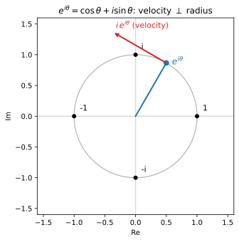

# ch08 — Euler 公式：e^{iθ}=cosθ+i·sinθ，從旋轉這一側看

> **本章解決什麼問題**：前面三章已經各用一種方式推出了和角公式——ch04 在單位圓上拼幾何、ch05 把旋轉寫成矩陣相乘、ch07 把複數乘法看成輻角相加。本章是脊椎「同一個公式四種證法」的最後一證，也是 Part III 的高潮：Euler 公式 `e^{iθ}=cosθ+i·sinθ` 把「指數成長」和「旋轉」這兩件看似毫不相干的事接上同一條線。一旦接上，`e^{i(a+b)}=e^{ia}·e^{ib}`——指數律最沒爭議的一條——就**一行收掉**整個和角公式，連帶倍角、de Moivre（ch09）、相量（ch10）全部落地。本章從旋轉／微分方程這一側推它（姊妹書《馴服無限》ch09 從 e^x 級數那一側推，同一定理的兩個鏡頭，可對照不依賴），並誠實標示哪裡是直覺、哪裡的嚴格層在別處。

## 從你已知的出發

你在訊號或動畫的程式碼裡，多半見過 `e^{iωt}` 這個東西，或它的兄弟 `Math.exp` 配上複數型別。在數位訊號處理（DSP）的函式庫裡，一個載波、一個相位旋轉，常常不是寫成 `cos(ωt)` 加 `sin(ωt)` 兩條，而是打包成一個 `e^{iωt}`——一支「轉個不停的單位箭頭」。你大概接受了「它就是這樣用」，但心裡有個沒解開的結：**指數函數不是用來描述「爆炸式成長」的嗎**？複利、人口、`O(2ⁿ)` 的演算法災難——`eˣ` 一路往上衝，怎麼到了虛數指數，就乖乖跑去畫一個圈、原地打轉、永遠不發散？

這正是本章要拆的結。Euler 公式的字面 `e^{iθ}=cosθ+i·sinθ` 你可能背過，甚至背過那句「世界上最美的公式」`e^{iπ}+1=0`。但背得出來和懂是兩回事。懂的標準是：你能向另一個工程師講清楚**為什麼指數會跑去畫圓**，而不是只會把 θ 代進去算。

我先給你一個錨。回想 ch07 的一句話：**乘以 i，就是逆時針轉 90°**。`(a+bi)·i=−b+ai`，這個點繞原點轉了個直角。把這句話和「指數」放在一起，本章的整個直覺就是一句話的展開：

> 普通的指數成長，是「往你正在去的方向推一把」；虛數的指數成長，是「把推力轉 90°，垂直於你正在去的方向推」。垂直的推力不會讓你跑遠，只會讓你**拐彎**——拐個不停，就繞成了圓。

這句話（BetterExplained 把它講成「continuous imaginary growth rate」，2026-06 查證）你現在可能還半信半疑。本章的任務就是把它從一句漂亮的話，變成你能自己重推、自己複核的東西。我認為這是整本書最值得你停下來、把那張圖在腦裡轉一遍的地方。

## 兩個鏡頭：級數那側 vs 旋轉那側

先把分工講清楚，免得你讀到一半覺得「這跟我以前看到的推法不一樣」。

Euler 公式有兩種主流的推法，是**同一個定理的兩個鏡頭**：

- **級數鏡頭**（姊妹書《馴服無限》ch09 走這條）：把 `eˣ=1+x+x²/2!+x³/3!+…` 這個泰勒級數裡的 x 換成 iθ，硬代下去。i 的次方按 `i²=−1` 循環（i, −1, −i, 1, i, …），把實部和虛部分開收集，實部那一堆剛好是 `cosθ` 的級數 `1−θ²/2!+θ⁴/4!−…`、虛部那一堆剛好是 `sinθ` 的級數 `θ−θ³/3!+θ⁵/5!−…`。三條級數一對齊，`e^{iθ}=cosθ+i·sinθ` 就掉出來。這是 Euler 本人 1748 年在《Introductio in analysin infinitorum》裡走的路（2026-06 查證，見本章歷史一節）。它的好處是**機械、無懈可擊**；代價是你得先接受「把實數的級數定義原封不動搬到虛數上是合法的」「三條無窮級數可以這樣重排」——這些收斂與重排的嚴格層，本書不證，指向《馴服無限》ch09。

- **旋轉／微分方程鏡頭**（本章走這條）：不碰級數，問一個動力學的問題——「**什麼東西的變化率，是把自己轉 90°？**」答案逼出來的軌跡，就是等速繞單位圓，而那條軌跡的座標恰好是 `(cosθ, sinθ)`。這條路的好處是**幾何直覺直接可見**（你會看到那支永遠垂直於半徑的速度箭頭，這也替 ch11 的 `sin′=cos` 先打好地基）；代價是它把「`e^{iθ}` 到底是什麼」的嚴格定義，當成「滿足某個微分方程、從 1 出發的那條軌跡」來接受——這也是一種誠實的取捨，下一節挑明。

兩個鏡頭看的是同一座山。級數鏡頭從代數的山腳上，旋轉鏡頭從幾何的山頂下。你不必選邊：讀完本章你會有旋轉這側的直覺，想要代數那側的嚴格，翻《馴服無限》ch09 對照。我選旋轉這側當主線，因為本書的主張就是「三角函數是旋轉與週期的語言」——而 Euler 公式正是這句主張裡，「旋轉」和「指數／週期」握手的那一刻。

## 旋轉這側的推導：什麼東西的變化率是「把自己轉 90°」

慢慢來，這節值得你花十分鐘。

先回到普通的、實數的指數函數，把它的靈魂看清楚。`eˣ` 最本質的性質不是「它長得多快」，而是這一條微分方程：

```text
d/dx eˣ = eˣ          ← 變化率＝它自己
```

白話：`eˣ` 在每一點的成長速度，恰好等於它當下的值。值越大、長越快；這就是複利、是失控成長的數學心臟。再加一個初始條件 `e⁰=1`（從 1 出發），這條微分方程**唯一地**釘死了 `eˣ` 這個函數——「變化率＝自己、從 1 出發」的那條曲線，只有一條，就是 `eˣ`。記住這個「方程＋初始條件＝唯一一條軌跡」的思路，整個推導靠它。

現在把指數換成虛數的：考慮函數 `f(θ)=e^{iθ}`，θ 是實數（你可以暫時把它當「一個我們還不知道長相、但服從指數律的東西」）。它該滿足什麼微分方程？指數律告訴我們，對指數函數微分，就是把指數裡那個係數乘下來——`d/dθ e^{kθ}=k·e^{kθ}`。這裡係數是 i，所以

```text
d/dθ e^{iθ} = i · e^{iθ}      ← 變化率＝把自己乘上 i
f(0) = e^{i·0} = e⁰ = 1        ← 從 1 出發
```

關鍵在右邊那個 `i·`。**乘以 i 是什麼？ch07 釘死了：逆時針轉 90°。** 所以這條方程在說一件具體到不能再具體的事：

> 這個東西在每一刻的**速度（變化率）**，等於把它**當下的位置**逆時針轉 90°。

把它當成物理來讀。`e^{iθ}` 是複數平面上一個會動的點，θ 是時間。它的位置是一支從原點指向它的箭頭（半徑向量）。它的速度，是把這支半徑箭頭轉 90° 得到的——**速度永遠垂直於半徑**。

垂直於半徑的速度會發生什麼事？想一根綁著石頭的繩子，你抓著一端甩。石頭的速度永遠垂直於繩子（半徑）——它既不往外飛走（沒有沿半徑向外的速度分量），也不往圓心掉（沒有向內的分量），只能**沿著圓周跑**。速度垂直於半徑，這正是「等速圓周運動」的定義性特徵。再看大小：`f(0)=1`，初始位置在點 `1`（離原點距離 1），初始速度是 `i·1=i`（大小也是 1）。位置的大小是 1、速度的大小也是 1、而且速度垂直於半徑——所以這個點從 `(1,0)` 出發，以**單位速率**、沿**單位圓**（半徑恆為 1，因為沒有向外或向內的速度分量去改變它）、**逆時針**（乘 i 是逆時針）地跑。

```text
位置 = e^{iθ}              一支半徑箭頭，長度 1
速度 = i·e^{iθ}            把半徑轉 90°：永遠垂直於半徑、長度也是 1
⇒ 等速、單位圓、逆時針，從 1 出發
```

現在收網。一個點，從 `(1,0)` 出發，以單位速率沿單位圓逆時針跑——跑了「時間 θ」之後，它在哪裡？這是 ch02 弧度的整碗回收：**單位圓上，弧長＝半徑×角度＝1×角度＝角度本身**。以單位速率跑了時間 θ，走過的弧長就是 θ，對應的圓心角也就是 θ 弧度。而單位圓上、從正 x 軸量起、逆時針 θ 弧度的那個點，座標是什麼？ch03 的單位圓主定義一槌定音：

```text
e^{iθ} = (cos θ, sin θ) = cos θ + i · sin θ
```

推完了。我沒有碰任何無窮級數，只問了一句「什麼東西的變化率是把自己轉 90°」，然後讓「速度垂直於半徑⇒等速繞圓」這個物理直覺把答案領出來。`e^{iθ}` 跑的就是單位圓，θ 是它跑過的弧度（＝角度＝時間），而它的座標按定義就是 `cosθ` 配 `sinθ`。

> **這裡了不起在哪**（要能用自己的話轉述）：指數函數 `eˣ` 和三角函數 `cos/sin` 在高中是兩個老死不相往來的章節——一個管成長、一個管角度。Euler 公式說它們是**同一個動力學的兩種投影**。差別只在「你往哪個方向推」：往自己前進的方向推（實數指數），就是失控成長；把推力轉 90°、垂直地推（虛數指數），就是原地繞圈。`eˣ` 的「無限往上衝」和 `e^{iθ}` 的「永遠繞圈不發散」，是同一個「變化率正比於自己」的方程，在實軸和虛軸上的兩種命運。我認為這是整本書最深的一次接線：旋轉不再只是「跟指數很像的另一個東西」，旋轉**就是**虛數方向的指數成長。

**附帶的紅利，留給 ch11。** 上面那句「速度＝把位置轉 90°」其實已經把 `sin′=cos` 證了一半。把 `e^{iθ}=cosθ+i sinθ` 兩邊對 θ 微分：左邊是 `i·e^{iθ}=i(cosθ+i sinθ)=−sinθ+i·cosθ`；右邊逐項微分是 `(cosθ)′+i(sinθ)′`。比對虛部得 `(sinθ)′=cosθ`，比對實部得 `(cosθ)′=−sinθ`。這就是「旋轉的速度還是旋轉」——`(cos, sin)` 的速度向量是 `(−sin, cos)`，恰好是把位置逆時針轉 90°。ch11 會把這件事從旋轉這側正式講完（不只引用《馴服無限》ch05 的草圖）。本章先在這裡埋下種子：**速度箭頭永遠超前位置 90°**，等下那張圖你會親眼看到。

### 這裡有多嚴格？把醜話說在前面

我把「`e^{iθ}` 是什麼」當成「滿足 `f′=i·f`、`f(0)=1` 的那條軌跡」來接受——這其實偷偷預設了三件事，全書招牌是誠實標示，我一條條挑明：

1. **「指數律 `d/dθ e^{kθ}=k·e^{kθ}` 對虛數的 k 也成立」是被我假設的，不是被我證的。** 嚴格地說，`e^{iθ}` 這個記號的合法定義（複數的複數次方）要嘛靠級數（《馴服無限》ch09），要嘛靠「把實函數的微分方程延拓到複數域」的複變分析。本章把它當「旋轉」的直覺記號使用——這層是**直覺版**，不是證明。
2. **「速度垂直於半徑⇒等速圓周運動」我用的是物理直覺（甩石頭），不是 ε-δ。** 嚴格版要動用微分方程解的存在唯一性。本書不證，嚴格層在《馴服無限》。
3. **「微分方程＋初始條件唯一決定一條軌跡」我直接用了。** 這是常微分方程的基本定理，本書當常識用，不證。

說這些不是要嚇你，是要你知道**這個推導的力氣花在哪、欠條打在哪**。它欠的是「複數指數的嚴格定義」這張條；它給的是「為什麼指數會畫圓」這個你能轉述、能在腦裡轉動的直覺。這筆交易我認為划算——本書要的就是這層懂。想連嚴格定義一起拿，級數鏡頭在隔壁書等你。

## 脊椎第四證：e^{i(a+b)}=e^{ia}·e^{ib}，一行收掉和角公式

現在來領本章的大獎，也是脊椎「同一個公式四種證法」的收官。

指數律裡最沒爭議、最不需要解釋的一條是 `e^{x+y}=eˣ·eʸ`——指數相加等於底數相乘。把它套在虛數指數上：

```text
e^{i(a+b)} = e^{ia} · e^{ib}        ← 指數律：θ 相加 ⇒ 相乘
```

左邊，用 Euler 公式把 `i(a+b)` 那個整體展開（把 a+b 當成一個角）：

```text
左邊 = e^{i(a+b)} = cos(a+b) + i·sin(a+b)
```

右邊，把兩個 Euler 公式各自展開，然後當成兩個複數相乘：

```text
右邊 = e^{ia} · e^{ib}
     = (cos a + i·sin a)(cos b + i·sin b)
```

把右邊乘開（普通複數乘法，逐項相乘，記得 `i²=−1`）：

```text
(cos a + i·sin a)(cos b + i·sin b)
  = cos a·cos b  +  i·cos a·sin b  +  i·sin a·cos b  +  i²·sin a·sin b
  = cos a·cos b  +  i·cos a·sin b  +  i·sin a·cos b  −  sin a·sin b      ← i²=−1
  = (cos a·cos b − sin a·sin b)  +  i·(sin a·cos b + cos a·sin b)
       └────── 實部 ──────┘          └────────── 虛部 ──────────┘
```

左邊等於右邊，兩個複數相等就是**實部對實部、虛部對虛部**。並排對帳：

```text
實部:  cos(a+b)  =  cos a·cos b − sin a·sin b
虛部:  sin(a+b)  =  sin a·cos b + cos a·sin b
```

這就是和角公式。**一行指數律 `e^{i(a+b)}=e^{ia}·e^{ib}`，加上一次普通的複數乘法、一次實虛部比對，整個 Part II 折進來了。** 你不必畫單位圓上的輔助線（ch04 那樣）、不必乘 2×2 矩陣（ch05 那樣）、不必背極式相乘的規則（ch07 那樣）——你只需要相信「指數相加等於相乘」這條連國中生都不會質疑的事。

> **這裡了不起在哪**：ch04 證和角公式要畫一張精巧的構造圖；ch05 要乘開矩陣；ch07 要用極式。它們都對，但都比這辛苦。Euler 公式把和角公式**降級成指數律的一個推論**——`e^{i(a+b)}=e^{ia}e^{ib}` 本來就該成立（指數就是這麼運作的），於是和角公式也本來就該成立。最省力的證明，往往是站在最高的抽象層往下看。

### 四種證法的總對帳：四次是同一件事，旋轉可組合

這是全書最重要的對帳之一，脊椎章的義務。我把四種證法並排，逐一指出它們其實都在說同一句話。

| 證法 | 章 | 「角度相加」這件事被寫成 | 它在追蹤什麼 |
|---|---|---|---|
| 幾何 | ch04 | 單位圓上把點再轉一個角，投影出新座標 | 一個被轉動的**點**的座標 |
| 旋轉矩陣 | ch05 | `R(a)·R(b)=R(a+b)`，矩陣相乘 | 整個旋轉**變換**（矩陣） |
| 複數乘法 | ch07 | 極式相乘：輻角相加、模相乘 | 一個複數**箭頭**的輻角 |
| Euler | ch08 | `e^{i(a+b)}=e^{ia}·e^{ib}`，指數律 | 指數**律**本身 |

四種證法推出的 `sin(a+b)`、`cos(a+b)` 一字不差地相同。它們不是四個不同的定理，是**同一個定理的四張臉**。串起它們的那句話是：

> **旋轉可以組合：先轉 a 再轉 b，等於一次轉 a+b。**「角度相加」就是「旋轉複合」這件事在不同記法下的影子。

把這句話分別翻成四種語言，你就看見四證的血緣：

- **ch04 幾何**：把「轉 a」「轉 b」當成在單位圓上挪動一個點的動作，連續做兩次。和角公式是這個點最後落腳座標的拆解。
- **ch05 矩陣**：把「轉 a」打包成矩陣 R(a)。複合動作＝矩陣相乘 `R(a)R(b)`；「轉 a+b」＝`R(a+b)`；兩者描述同一個旋轉所以矩陣相等，逐格逼出和角公式。
- **ch07 複數**：把「轉 a」打包成「乘以一個輻角為 a 的單位複數」。複合＝相乘；複數乘法的規則「輻角相加」直接就是「角度相加」。
- **ch08 Euler**：把那個「輻角為 a 的單位複數」寫成 `e^{ia}`。於是「輻角相加」`a+b` 寫成指數 `e^{i(a+b)}`，而指數律 `e^{i(a+b)}=e^{ia}e^{ib}` 自動把「相加」變「相乘」——和角公式是這個指數律展開後的實虛部。

注意 ch07 和 ch08 的關係特別近：ch08 只是把 ch07 那個「輻角為 a 的單位複數」換了個名字叫 `e^{ia}`。**Euler 公式做的事，就是給「單位圓上輻角 a 的點」一個叫 `e^{ia}` 的名字，而這個名字恰好讓「輻角相加」自動變成「指數相加」**——因為指數天生就把加法搬成乘法。換名字之所以威力巨大，是因為新名字把和角公式接到了一條你早就熟到不行的代數律（指數律）上。這不是巧合，這是 Euler 公式的全部意義：它讓旋轉說指數的語言。

四次是同一件事。如果你只能帶走本書一句話，帶這句：**所有的和角公式、倍角、de Moivre、相量代數，根子上都是「旋轉可組合」——而 Euler 公式是這件事最緊湊的寫法。**



## e^{iπ}+1=0 與 e^{iπ/2}=i：把特殊角讀成「轉到哪」

有了 `e^{iθ}＝逆時針轉到 θ 弧度的那個單位向量`，那些「最美公式」就不再是要膜拜的咒語，而是看一眼圖就知道答案的位置題。

**`e^{iπ/2}=i`**：π/2 弧度＝90°。從點 `1`（正 x 軸）逆時針轉 90°，到正 y 軸，那個點是 `(0,1)＝i`。所以 `e^{iπ/2}=i`。對照 ch07：「乘以 i＝逆時針轉 90°」現在有了指數的講法——`i` 本身就是「轉 90° 的算子」`e^{iπ/2}`。

**`e^{iπ}=−1`，即 `e^{iπ}+1=0`**：π 弧度＝180°。從 `1` 逆時針轉半圈，到負 x 軸 `−1`。所以 `e^{iπ}=−1`，移項就是那句被票選為「最美」的 `e^{iπ}+1=0`——它把五個最基本的常數 e、i、π、1、0 用一條等式串起來。但剝掉光環，它說的只是一件樸素到好笑的事：**從 1 出發、沿單位圓走半圈（π 弧度），你會走到 −1。** 美在它把這麼平凡的幾何事實，寫成了指數、虛數、圓周率的交會點。

**`e^{i·2π}=1`**：2π 弧度＝360°＝整圈。轉一圈回到出發點 `1`。這就是三角函數週期 2π 的指數版：`e^{i(θ+2π)}=e^{iθ}`，繞一圈回到原處。週期性——本書下半部（Part IV）整個建立在它上面——在這裡是「`e^{iθ}` 繞圈會回頭」這件再自然不過的事。

把這三個連起來看一條漂亮的鏈：`e^{iπ/2}=i`（轉 90°），那麼 `(e^{iπ/2})²` 應該是「轉 90° 再轉 90°＝轉 180°」。算：`(e^{iπ/2})²=e^{i·π}=−1`，也就是 `i²=−1`。**`i²=−1` 不是一個需要硬背的代數規定——它就是「轉兩次 90° 等於轉 180°、而轉 180° 把 1 送到 −1」的指數寫法。** 複數最初那條「想像出來的、平方等於負一的數」，在這裡終於有了不靠想像的幾何身世：i 是轉四分之一圈的操作，連做兩次自然到對面去。

## 歷史：Cotes 的對數先聲（1714）與 Euler 的系統表述（1748）

歷史在這裡服務一個直覺：這條公式不是某天從天上掉下來的天才靈光，而是「指數、對數、三角、虛數」這幾條河，花了三十多年才匯流。

最早的先聲是英國人 **科茨（Roger Cotes，1682–1716）**。他在 **1714 年**的論文《Logometria》（發表於皇家學會的《Philosophical Transactions》，後收入他身後 1722 年出版的《Harmonia Mensurarum》）裡，給出了一個**等價於 Euler 公式的對數形式**（2026-06 查證）：

```text
i·x = ln(cos x + i·sin x)        ← Cotes 1714 的對數先聲
```

把這條兩邊取指數（e 的次方），就是 Euler 公式 `e^{ix}=cos x+i sin x`。但 Cotes 沒有寫成指數式、也沒有充分展開它的意義——而且他原本的幾何論證裡有個放錯位置的因子，要校正後才讀成上面這條（2026-06 查證；嚴格的歸屬細節各來源略有出入，這裡採「等價對數形式更早見於 Cotes 1714」的穩健說法）。Cotes 三十出頭就過世，連這個發現都沒能親手推到指數形式——牛頓對他的早逝有句惋惜：「要是科茨還活著，我們本可以知道些什麼。」（這句廣為流傳，引用時當逸聞看待。）

把它寫成今天這個指數形式、並系統性地運用，是 **歐拉（Leonhard Euler，1707–1783）**。他大約在 1740 年前後就觸及這個關係（用比較指數與三角的級數展開得到，即級數鏡頭），正式的系統表述出現在 **1748 年**的兩卷本巨著《Introductio in analysin infinitorum》（無窮分析引論）第 8 章（2026-06 查證：該章標題為「On transcending quantities arising from the circle」，公式出現在 §138）。代入 x=π 就得到 `e^{iπ}+1=0`（Euler 恆等式）。

歷史的教訓對工程師特別受用：**Cotes 拿著正確的式子卻沒看出它在說「旋轉」，Euler 換了個記法（從對數換成指數），意義就豁然開朗。** 同一個數學事實，記法決定你能不能看見它的靈魂——這跟你重構一段難懂的程式碼、換個抽象就突然讀得懂，是同一種經驗。Euler 公式之所以歸功 Euler 而非更早的 Cotes，很大一部分就是因為他選對了那個讓意義浮現的記法。

## 直覺的陷阱

| 陷阱 | 錯誤直覺 | 會在哪一步把你帶溝裡 | 怎麼自我察覺 |
|---|---|---|---|
| **以為指數一定發散** | 「指數函數就是會爆炸式成長」 | 看到 `e^{iωt}` 以為它會衝到無窮大，於是不敢相信它代表一個有界的、繞圈的訊號。其實虛數指數的「成長」是轉向，不是變大——`\|e^{iθ}\|=1` 恆成立 | 算一下模：`\|e^{iθ}\|²=cos²θ+sin²θ=1`。任何時候 `e^{iθ}` 都待在單位圓上，永遠不發散。會發散的是 `e^{(a+bi)θ}` 裡那個**實部 a**（成長／衰減率），虛部 b 只管轉 |
| **θ 用度數代** | 「e^{i·90} 就是轉 90 度」 | `e^{iθ}` 的 θ 是**弧度**。整個推導靠「單位圓上弧長＝角度」，而那只在弧度成立。代度數進去，`e^{i·90}` 算的是轉 90 弧度（≈14.3 圈多），位置完全不對 | 轉 90° 要寫 `e^{iπ/2}`，不是 `e^{i·90}`。和 ch02 那個 `Math.sin` 吃弧度的坑同源——程式裡複數指數一樣吃弧度 |
| **把 e^{iθ} 當「一個會變大的數」** | 「θ 越大，e^{iθ} 越大」 | θ 增加只是讓那支單位箭頭轉得更多圈，大小永遠是 1。誤以為它隨 θ 變大，會在估計振幅／能量時整個算錯 | 記住「θ 是轉了多少弧度（時間／角度），不是大小」。大小由 `\|z\|`（模）管，相位由 `e^{iθ}` 管，兩者正交、互不干涉 |
| **e^{iπ}+1=0 是「巧合」** | 「五個常數湊在一起，太神奇了，背起來」 | 把它當咒語背，就錯過了它其實只是「沿單位圓走半圈到 −1」。當神蹟膜拜＝沒懂 | 自問：我能不能不寫式子、只用「轉半圈」這三個字解釋 `e^{iπ}=−1`？講得出來才算懂 |
| **循環論證的風險** | 「用 Euler 證和角公式，再用和角公式定義 e^{iθ}」 | 若你「定義」`e^{iθ}` 就靠 `cosθ+i sinθ`，再回頭用 Euler「證」和角公式，是繞圈圈。本章靠**微分方程**獨立地推出 Euler 公式，沒用到和角公式，才有資格反過來證它 | 檢查推導的起點：本章起點是 `f′=i·f`（微分方程），不是和角公式。ch07 的極式相乘那一證才是直接用和角公式（所以 ch07 刻意不寫 e^{iθ}，避免循環） |

最深的陷阱是第一個和最後一個。第一個（以為指數必發散）攔住你接受「指數會畫圓」這件事——破解它的鑰匙是分清楚指數裡的**實部管縮放、虛部管旋轉**：`e^{(a+bi)t}=eᵃᵗ·e^{ibt}`，前半段是成長／衰減的螺旋半徑、後半段是純旋轉。第五個（循環論證）是脊椎章的職業病：四種證法必須各自有獨立的起點，否則「四證」就塌成「一證換四種寫法」。本章的獨立起點是微分方程，這點要守住。

## 紙上推演

**推演 1 — 用 Euler 公式推 cos(a+b)、sin(a+b)，並驗證 [15 分鐘] ★★**
不看正文，從 `e^{i(a+b)}=e^{ia}·e^{ib}` 出發，把右邊乘開、比對實虛部，自己推出兩條和角公式。然後用一組具體角度自我複核：取 a=b=π/4（45°），算出 `cos(π/2)`、`sin(π/2)` 應該分別是 0 和 1，驗證你的公式吐出正確值。

**推演 2 — 四種和角證法的口頭總對帳 [口頭，20 分鐘] ★★★**
把 ch04（幾何）、ch05（矩陣）、ch07（複數極式）、ch08（Euler）四種證法並排，逐一用一句話說出「它把『角度相加』寫成了什麼」，並用一句總話把四者收成「它們都在說旋轉可組合」。這是全書最重要的對帳，講不順代表你還停在「會四種算法」沒到「看見它們是同一件事」。

**推演 3 — 用 Euler 公式推倍角公式 [10 分鐘] ★★**
從 `(e^{iθ})²=e^{i·2θ}` 出發（指數律），左邊用複數乘法乘開、右邊用 Euler 展開，比對實虛部，推出 `cos 2θ=cos²θ−sin²θ`、`sin 2θ=2 sinθ cosθ`。想想看：這跟「先轉 θ 再轉 θ＝轉 2θ」是不是同一件事？

**推演 4 — 向工程師解釋「為什麼指數會跑去畫圓」 [口頭，15 分鐘] ★]**
不寫式子，向一個會寫程式、知道 `eˣ` 會爆炸式成長但沒學過複數指數的人，口頭講清楚：為什麼 `e^{iθ}` 不發散、反而繞圈？要講到他能點頭說「喔，因為虛數把推力轉了 90°，垂直的推力只會讓你拐彎不會跑遠」。

### 推演解答

**推演 1。** 右邊展開（複數乘法，`i²=−1`）：

```text
e^{ia}·e^{ib} = (cos a + i sin a)(cos b + i sin b)
             = (cos a cos b − sin a sin b) + i(sin a cos b + cos a sin b)
```

左邊 `e^{i(a+b)}=cos(a+b)+i sin(a+b)`。實虛部各自相等：

```text
cos(a+b) = cos a cos b − sin a sin b
sin(a+b) = sin a cos b + cos a sin b
```

複核 a=b=π/4：`cos(π/4)=sin(π/4)=√2/2≈0.70711`。代入——

```text
cos(π/2) = (√2/2)(√2/2) − (√2/2)(√2/2) = 1/2 − 1/2 = 0          ✓ (cos 90°=0)
sin(π/2) = (√2/2)(√2/2) + (√2/2)(√2/2) = 1/2 + 1/2 = 1          ✓ (sin 90°=1)
```

公式吐出 `cos(π/2)=0`、`sin(π/2)=1`，正確。

**推演 2（要點）。** 四句話骨架：(ch04) 把角度相加寫成「在單位圓上把一個點連續轉兩次」，和角公式是這點落腳座標的拆解；(ch05) 寫成「兩個旋轉矩陣相乘 `R(a)R(b)=R(a+b)`」，逐格逼出公式；(ch07) 寫成「兩個單位複數相乘，輻角相加」，複數乘法規則直接給出角度相加；(ch08) 把那個單位複數叫做 `e^{ia}`，於是輻角相加變成指數相加 `e^{i(a+b)}=e^{ia}e^{ib}`，指數律自動把加變乘。總話：四者都在說「先轉 a 再轉 b＝轉 a+b」——旋轉可組合，而「角度相加」是這件事在四種記法下的影子。常見錯路：把 ch08 講成「也是用和角公式」（不是——它的起點是微分方程，獨立於和角公式）；或漏掉「ch07→ch08 只是換名字 `e^{ia}`，但這名字把公式接到了指數律」這個關鍵橋。

**推演 3。** 從 `(e^{iθ})²=e^{i·2θ}`：

```text
左邊 = (cos θ + i sin θ)²
     = cos²θ + 2i sin θ cos θ + i²sin²θ
     = (cos²θ − sin²θ) + i(2 sin θ cos θ)        ← i²=−1
右邊 = e^{i·2θ} = cos 2θ + i sin 2θ
```

實虛部比對：

```text
cos 2θ = cos²θ − sin²θ
sin 2θ = 2 sin θ cos θ
```

這和「先轉 θ 再轉 θ＝轉 2θ」是同一件事：把同一個旋轉做兩次，角度自然翻倍。倍角公式只是 `(e^{iθ})²` 的實虛部。

**推演 4（要點）。** 講稿骨架：(1) `eˣ` 的本質不是「長很快」，是「成長速度＝當下的值，方向是往你正在去的方向推」。(2) 乘以 i＝逆時針轉 90°（複數平面的事實）。(3) 所以 `e^{iθ}` 的成長方向被轉了 90°——成長速度不再往前推，而是垂直於當下位置地推。(4) 垂直的推力（像甩繩子的石頭，繩子拉力永遠垂直於石頭速度）不會讓你跑遠，只會讓你拐彎；拐個不停就繞成圓。(5) 所以 `e^{iθ}` 從 1 出發、繞單位圓跑，θ 是轉過的弧度。常見錯路：講成「因為公式長這樣」（沒解釋為什麼）；或忘了強調「垂直的推力不改變到原點的距離」這個「為什麼是圓不是螺旋」的關鍵。

### 動手生圖

本章的圖（也是本章的 Python 小實驗）：在複數平面上畫單位圓，放一個 `e^{iθ}` 的點在圓上，標出四個特殊位置 θ=0、π/2、π、3π/2 對應的 1、i、−1、−i；再從那個點畫一支**速度箭頭** `i·e^{iθ}`，讓你親眼看到它永遠垂直於半徑、超前位置 90°。這支箭頭是 ch11 `sin′=cos` 的種子——旋轉的速度還是旋轉。

```python
# ch08 figure: e^{i*theta} on the unit circle, with velocity arrow i*e^{i*theta} (90 deg ahead)
from pathlib import Path
import numpy as np
import matplotlib
matplotlib.use("Agg")          # headless; no display needed
import matplotlib.pyplot as plt

OUT = Path(__file__).resolve().parent / "out" / "ch08-euler-circle.svg"
OUT.parent.mkdir(parents=True, exist_ok=True)

fig, ax = plt.subplots(figsize=(5, 5))
t = np.linspace(0, 2 * np.pi, 400)
ax.plot(np.cos(t), np.sin(t), color="0.7", lw=1.2)        # unit circle
ax.axhline(0, color="0.85"); ax.axvline(0, color="0.85")

# four special angles -> 1, i, -1, -i
marks = [(0, "1"), (np.pi/2, "i"), (np.pi, "-1"), (3*np.pi/2, "-i")]
for ang, lab in marks:
    ax.plot(np.cos(ang), np.sin(ang), "ko", ms=5)
    ax.annotate(lab, (np.cos(ang), np.sin(ang)), textcoords="offset points",
                xytext=(8, 8), fontsize=11)

th = np.pi / 3                                             # the moving point e^{i*theta}, theta=60 deg
px, py = np.cos(th), np.sin(th)
ax.plot([0, px], [0, py], "C0-", lw=2)                    # radius (position vector)
ax.plot(px, py, "C0o", ms=7)
ax.annotate(r"$e^{i\theta}$", (px, py), textcoords="offset points", xytext=(8, -2), color="C0", fontsize=12)
# velocity = i*e^{i*theta} = (-sin, cos): 90 deg ahead, tangent to circle
ax.annotate("", xy=(px - np.sin(th), py + np.cos(th)), xytext=(px, py),
            arrowprops=dict(arrowstyle="->", color="C3", lw=2))
ax.annotate(r"$i\,e^{i\theta}$ (velocity)", (px - np.sin(th), py + np.cos(th)),
            textcoords="offset points", xytext=(4, 6), color="C3", fontsize=11)

ax.set_aspect("equal"); ax.set_xlim(-1.6, 1.6); ax.set_ylim(-1.6, 1.6)
ax.set_xlabel("Re"); ax.set_ylabel("Im")
ax.set_title(r"$e^{i\theta}=\cos\theta+i\sin\theta$: velocity $\perp$ radius")
fig.savefig(OUT, bbox_inches="tight")
print("wrote", OUT)            # build_figures.py reads this
```

**預期輸出**：一張正方形比例的圖。灰色的單位圓；四個黑點分別在 (1,0)、(0,1)、(−1,0)、(0,−1)，標注 1、i、−1、−i。一支藍色半徑箭頭指向 θ=60°（π/3）處的點 `e^{iθ}`（座標約 (0.5, 0.866)）。從那個點伸出一支紅色速度箭頭 `i·e^{iθ}`，方向是 `(−sin60°, cos60°)≈(−0.866, 0.5)`——你會看到它**切於圓、垂直於藍色半徑、指向逆時針前進的方向**（超前位置 90°）。終端機印出 `wrote .../out/ch08-euler-circle.svg`。

**改參數看什麼**：

- 把 `th = np.pi/3` 改成別的角度（如 `np.pi/6`、`5*np.pi/4`），藍色半徑和紅色速度箭頭會一起轉，但**紅箭頭永遠垂直於藍箭頭、永遠超前 90°**——這就是「速度＝把位置轉 90°」對任何 θ 都成立。把這件事在腦裡轉一圈，你就懂了 ch11 的 `sin′=cos`。
- 想看「速度大小＝1」（等速）：紅箭頭的長度永遠和藍半徑一樣（都是單位長），不管 θ 在哪。這對應 `|i·e^{iθ}|=|i|·|e^{iθ}|=1`。
- 把單位圓那行的 `np.cos(t), np.sin(t)` 改成 `1.5*np.cos(t), 1.5*np.sin(t)` 畫個更大的圓，會發現 `e^{iθ}` 的點**不在**這個大圓上——因為 `e^{iθ}` 的模恆為 1，它只認單位圓。要畫半徑 r 的圓上的點得寫 `r·e^{iθ}`（ch10 相量會用到）。

## 自我檢核

口頭自答，講得出來才算過關：

1. 為什麼 `e^{iθ}` 不發散、反而繞圈？（關鍵字：乘 i＝轉 90°、速度垂直於半徑、垂直的推力只拐彎不跑遠。）
2. 微分方程 `d/dθ e^{iθ}=i·e^{iθ}` 用白話講是什麼意思？那個 `i·` 在幾何上做了什麼？
3. 為什麼本章的推導**不算**循環論證？它的獨立起點是什麼？（對照 ch07 的極式證法為什麼刻意不寫 e^{iθ}。）
4. 用一行 `e^{i(a+b)}=e^{ia}·e^{ib}` 推和角公式，哪一步用到 `i²=−1`？實部給你哪條公式、虛部給你哪條？
5. 把四種和角證法（ch04/05/07/08）串成「都是旋轉可組合」——你能不看書講完嗎？ch07 和 ch08 的差別只在哪一個動作（提示：換名字）？
6. `e^{iπ}+1=0` 剝掉「最美公式」的光環後，只是在說什麼樸素的幾何事實？`i²=−1` 為什麼可以讀成「轉兩次 90°」？
7. 本章哪些步驟是「直覺版／本書不證」？欠的那張嚴格條打在哪本書、哪一章？
8. `e^{iθ}` 的 θ 用度數代會怎樣？為什麼整個推導非得用弧度不可？（回收 ch02。）

## 延伸閱讀

- **BetterExplained,「Intuitive Understanding Of Euler's Formula」** —— 本章「指數＝把推力轉 90°、所以畫圓」這個核心直覺的最佳補強，和本書旋轉這側完全同調；看它把 `e^{iθ}` 講成「continuous imaginary growth rate」那段（2026-06 查證存在）。https://betterexplained.com/articles/intuitive-understanding-of-eulers-formula/
- **BetterExplained,「Easy Trig Identities With Euler's Formula」** —— 把本章「用 Euler 一行收掉和角公式」的姿態推到底，示範怎麼用 Euler 公式現推一堆恆等式而不必背（2026-06 查證存在）。https://betterexplained.com/articles/easy-trig-identities-with-eulers-formula/
- **3Blue1Brown,「Complex number fundamentals | Lockdown math ep. 3」**（2020-04-24）—— 把「乘以複數＝旋轉＋縮放」「`e^{iθ}` 繞圈」用動畫講到骨子裡，是本章旋轉直覺的影像版（2026-06 查證存在）。https://www.3blue1brown.com/lessons/ldm-complex-numbers/
- **Tristan Needham《Visual Complex Analysis》（OUP，2023 年 25 週年版）** —— 全書把複數當「旋轉與縮放」的視覺進路；想把本章的「`e^{iθ}` 是旋轉」推到複變函數論（並補上本章誠實標示為「不證」的嚴格層的幾何版），這是首選（2026-06 查證存在）。https://global.oup.com/academic/product/visual-complex-analysis-9780192868923
- **姊妹書《馴服無限》ch09** —— Euler 公式的另一個鏡頭：從 `eˣ` 的泰勒級數代 iθ 推出來，補上本章刻意不碰的收斂與級數重排的嚴格層。同一定理兩個鏡頭，對照著讀最有收穫。
- **Wikipedia,「Euler's formula」/「Roger Cotes」** —— 想把 Cotes 1714 的對數先聲、Euler 1748《Introductio》第 8 章的歷史歸屬釘清楚，這兩條是乾淨的入口（2026-06 查證：Cotes《Logometria》1714、Euler《Introductio》Ch.8 §138）。https://en.wikipedia.org/wiki/Euler%27s_formula
