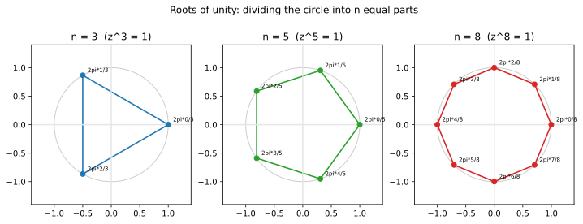

# ch09 — de Moivre 與單位根：把圓切成 n 等份

> **本章解決什麼問題**：ch07 把複數乘法看成「輻角相加、模相乘」，ch08 用 Euler 公式把這件事壓進 `e^{iθ}`。本章把這台機器接上「冪次」與「開根號」：自己乘自己 n 次（de Moivre 定理），以及反過來問「誰的 n 次方等於 1」（單位根，roots of unity）。你會看到一件高中代數從沒交代清楚的事——`xⁿ=1` 不是只有一個答案，是整整 n 個，而且它們在單位圓上排成一個正 n 邊形。這是 Part III（複數＝旋轉的代數）的收尾，銜接 ch07／ch08 的乘法直覺，並為 ch13 傅立葉「把取樣點放在單位根上」埋線。一句話的主題：開 n 次方，就是把圓平均切成 n 份。

## 從你已知的出發

你在遊戲後端排過環狀的東西。一個轉盤要均勻擺 8 個格子、一個技能特效要從中心射出 6 道等角的光、一個雷達掃描要把 360° 切成 N 個扇形——你寫過 `for k in range(n): angle = 2*pi*k/n`，然後 `(cos(angle), sin(angle))` 算出每個點的位置。你從沒把它想成「解方程」，它就是一個迴圈、一個均分。

本章要告訴你：你那個 `2*pi*k/n` 迴圈，數學上有個名字，它解的是方程 `zⁿ=1`。那 n 個均分的點，叫做 **n 次單位根**。你憑工程直覺寫出來的東西，正好就是複數開根號的全部答案——複數把「均分一個圓」和「解一個 n 次方程」釘成了同一件事。

再給一個你更熟的錨點：取樣（sampling）。你要在一個週期裡均勻取 n 個樣本點，相位（phase）就是 `2πk/n`，k=0…n−1。這些相位點，就是 n 次單位根的輻角。FFT（快速傅立葉變換）底下那些 twiddle factors，逐字就是這些單位根——這條線本章只點到，ch13 接手。但你先記住這個畫面：**單位根＝把一圈均分成 n 個相位**。你已經在用了，只是沒叫過它的名字。

而冪次這一側，你也碰過。複數乘法是「轉＋縮放」（ch07），那把同一個複數連乘 n 次，就是「轉 n 倍角、模放大 n 次方」。把這句話寫成公式，就是 de Moivre 定理。我們從這裡開始。

## de Moivre 定理：自己乘自己 n 次，就是把角度乘 n 倍

ch07 釘死了複數乘法的祕密：兩個複數相乘，**模相乘、輻角相加**。寫成極式（polar form），若 `z₁=r₁(cosα+i·sinα)`、`z₂=r₂(cosβ+i·sinβ)`，則

```text
z₁·z₂ = r₁·r₂·(cos(α+β) + i·sin(α+β))     ← 模相乘、輻角相加（ch07）
```

現在問一個最自然的後續問題：如果把**同一個**複數自己乘自己 n 次會怎樣？模相乘 n 次就是 `rⁿ`，輻角相加 n 次就是 `nθ`。所以對 `z=r(cosθ+i·sinθ)`：

```text
zⁿ = rⁿ·(cos(nθ) + i·sin(nθ))
```

把模 r 抽掉、只看單位圓上（r=1）的情形，就是 **de Moivre 定理**的標準長相：

```text
(cosθ + i·sinθ)ⁿ = cos(nθ) + i·sin(nθ)
```

白話：**單位圓上一個方向 θ 的點，自乘 n 次，就是把它的角度變成 nθ。** 冪次在做的事，是「角度乘 n 倍」。乘法是轉（ch07），冪次就是「轉很多次」——轉 n 次 θ，就是轉到 nθ。沒有更神祕的東西。

這個定理有兩條獨立的來路，兩條都不靠背、都在前兩章手上：

**來路一（從 ch07 的乘法直接堆）。** de Moivre 就是「輻角相加」用在「同一個輻角加 n 次」的特例。更嚴謹一點要用數學歸納法（mathematical induction）：n=1 顯然成立；假設 `(cosθ+i·sinθ)ᵏ=cos(kθ)+i·sin(kθ)` 對 k 成立，那麼乘上再一個 `(cosθ+i·sinθ)`，用 ch07 的乘法規則（輻角 kθ 再加 θ＝(k+1)θ），就得到 k+1 的情形。一步推一步，對所有正整數 n 成立。這是工程師的嚴謹：每一步能口頭說出理由，沒有跳步。

**來路二（從 ch08 的 Euler，一行）。** Euler 公式 `e^{iθ}=cosθ+i·sinθ`（ch08）一上場，de Moivre 就退化成指數律：

```text
(cosθ + i·sinθ)ⁿ = (e^{iθ})ⁿ = e^{i·nθ} = cos(nθ) + i·sin(nθ)
```

中間那步 `(e^{iθ})ⁿ=e^{i·nθ}` 就是國中的指數律 `(aᵇ)ⁿ=aᵇⁿ`。從這個鏡頭看，de Moivre 定理根本不是一條獨立的定理，它只是「指數相乘就是指數相加」這件事，套在虛數指數上。我認為這是看懂它最省力的角度：**de Moivre＝指數律＋Euler 公式**。

兩條來路是同一件事的兩種講法（這是全書的招牌姿態，恆等式都有來源）。歸納法那條不依賴 Euler，所以它更原始、更安全——萬一你對 `e^{iθ}` 的嚴格定義還心虛（ch08 把它當「旋轉」直覺接受，級數嚴格層指向《馴服無限》ch09），你仍可以只靠 ch07 的乘法把 de Moivre 站穩。

### 歷史插曲：這個定理為什麼掛 de Moivre 的名字

棣莫弗（Abraham de Moivre，1667–1754）是流亡到倫敦的法國新教徒，靠在咖啡館替人算賭局與保險的機率維生（他也是機率論與常態分布的先驅）。他在 1700 年代初期（**1707 年的論文**已用到相關結果）處理複數的冪與開方時得到了等價的關係——但有個常被科普來源講岔的細節：**de Moivre 本人從沒把這個定理寫成我們今天看到的緊湊形式 `(cosθ+i·sinθ)ⁿ=cos nθ+i·sin nθ`**（2026-06 查證；Wikipedia 明言「named after de Moivre, although he never stated it in his works」）。今天這個乾淨的寫法，是後來經由**歐拉（Euler）的記法**定型的——又是 Euler。坊間常見的「1707／1722」兩個年份歸屬，在不同來源裡被簡化或互相打架（landscape ⚠️ 已標：宜寫「de Moivre 在 1700 年代初期得到此結果，現代形式經 Euler 定型」，不在單一年份上釘死、未驗證處標「（未驗證）」）。

這不是吹毛求疵的考據癖。它本身就是本書的一個母題：一個以「旋轉」為靈魂的結果，要等到有人（Euler）找到「指數」這個記法，才被寫成今天這副人人能看懂的樣子。記法不是裝飾，記法是看見結構的眼鏡。

## 一招收掉多倍角公式：cos3θ=4cos³θ−3cosθ

de Moivre 定理有一個立刻能兌現的紅利：**所有的多倍角公式（multiple-angle formula），不用背、不用一層層套和角公式，展開一次二項式就全掉出來。**

拿 n=3 示範。把 `(cosθ+i·sinθ)³` 用二項式定理（binomial theorem，`(a+b)³=a³+3a²b+3ab²+b³`）硬展開，令 a=cosθ、b=i·sinθ：

```text
(cosθ + i·sinθ)³
  = cos³θ + 3·cos²θ·(i·sinθ) + 3·cosθ·(i·sinθ)² + (i·sinθ)³
  = cos³θ + 3i·cos²θ·sinθ + 3·cosθ·(i²·sin²θ) + i³·sin³θ      ← 把 i 提出來
  = cos³θ + 3i·cos²θ·sinθ − 3·cosθ·sin²θ − i·sin³θ            ← i²=−1、i³=−i
```

最後一行，把實部（沒有 i 的）和虛部（帶 i 的）分開整理：

```text
實部:  cos³θ − 3·cosθ·sin²θ
虛部:  3·cos²θ·sinθ − sin³θ
```

而 de Moivre 定理告訴我們，這整個東西又等於 `cos3θ + i·sin3θ`。**兩個複數相等，當且僅當實部對實部、虛部對虛部各自相等**（這是複數相等的定義，不是技巧）。所以一次比對拿到兩條公式：

```text
cos3θ = cos³θ − 3·cosθ·sin²θ
sin3θ = 3·cos²θ·sinθ − sin³θ
```

cos3θ 那條還能更乾淨。用單位圓的畢氏定理 `sin²θ=1−cos²θ`（ch03）代掉 sin²θ：

```text
cos3θ = cos³θ − 3·cosθ·(1 − cos²θ)
      = cos³θ − 3·cosθ + 3·cos³θ
      = 4·cos³θ − 3·cosθ          ← 只剩 cosθ 了
```

這就是基準的三倍角公式 `cos3θ=4cos³θ−3cosθ`。數值複核一發（全書規矩，不抄記憶）：取 θ=20°，右邊 `4·cos³20°−3·cos20°`，cos20°≈0.93969，`4·(0.93969)³−3·(0.93969)=4·0.82977−2.81907=3.31908−2.81907≈0.50001≈0.5`，而左邊 `cos60°=1/2=0.5` ✓（2026-06 以 Python 複核，誤差來自 cos20° 取五位）。

> **這裡了不起在哪**（要能用自己的話轉述）：你高中可能背過 cos3θ、cos4θ、cos5θ 一堆面目可憎的多倍角公式，或者用和角公式一層套一層慢慢爬。de Moivre 把這整套苦工收進「展開一次二項式、實虛部分開」這個機械動作——你要 n 倍角，就展 n 次方，要幾倍就展幾次方，公式自己長出來。背一張多倍角表是沒意義的，因為它們全部住在 `(cosθ+i·sinθ)ⁿ` 這一個式子裡。這正是全書「恆等式都有來源、不必背」的最爽快的一次兌現：來源就是把一個複數的 n 次方，老實展開。

## 開 n 次方有 n 個答案：單位根

到目前為止我們都在做「正向」——給定 z，算 zⁿ。現在反過來問：**有哪些 z，它的 n 次方等於 1？** 也就是解方程

```text
zⁿ = 1
```

在實數世界裡，這個問題乏味得很：n 是奇數時只有 z=1，n 是偶數時有 z=±1。實數軸太擠，裝不下答案。但複數平面有兩個維度，答案一下子就鋪開了。

用極式來解。把 z 寫成 `z=r·e^{iφ}`（ch08 的極式記法，r=模、φ=輻角）。那麼 `zⁿ=rⁿ·e^{inφ}`。要它等於 1，而 1 的極式是 `1·e^{i·0}`（模 1、輻角 0），於是要兩件事同時成立：

```text
模相等:   rⁿ = 1    ⇒   r = 1   （r 是非負實數，所以只有這個解）
輻角相等: nφ = 0     ⇒   φ = 0 ?
```

**陷阱就在第二行。** 輻角不是普通的數，它是「方向」——轉一整圈 2π 會回到原地。所以 `e^{i·0}` 和 `e^{i·2π}`、`e^{i·4π}`、`e^{i·2πk}`（任何整數 k）是**同一個點**：都是 1。輻角相等的正確寫法不是 `nφ=0`，而是

```text
nφ = 2πk     （k 是任意整數）   ⇒   φ = 2πk/n
```

這就是關鍵的一步：**因為輻角會繞圈，所以一個方程在這裡長出無限多組「看起來不同、其實同義」的解，但它們落在圓上只有 n 個不同的位置。** k=0,1,2,…,n−1 給出 n 個彼此不同的點；k=n 時 `φ=2π` 又轉回 k=0 的位置，之後全部重複。所以恰好 n 個解，不多不少：

```text
zₖ = e^{i·2πk/n} = cos(2πk/n) + i·sin(2πk/n),   k = 0, 1, …, n−1
```

這就是 **n 次單位根**。看出來了嗎——它的輻角 `2πk/n`，逐字就是你開頭那個 `for k in range(n): angle = 2*pi*k/n` 迴圈。你早就在算單位根，只是沒解過 `zⁿ=1` 這個方程。

幾何上它們在哪？模都是 1，所以全在單位圓上；輻角是 `2πk/n` 的等差數列，相鄰兩個差 `2π/n`——**均勻地把圓切成 n 等份**。從 z₀=1 出發（k=0 永遠是 1，因為 1ⁿ=1 是顯然的解），每隔 `2π/n` 放一個點，繞一圈回來。把它們連起來，就是一個**內接於單位圓的正 n 邊形（regular n-gon）**，一個頂點釘在 (1,0)。

這就是本章最該被你記住的畫面：**開 n 次方＝把圓平均切成 n 份。** 代數的「xⁿ=1 有 n 個根」和幾何的「正 n 邊形有 n 個頂點」，是同一句話。



### 立方根：把畫面坐實

抽象講完，落到 n=3 把數字算死。解 `z³=1`，三個根是 `e^{i·2πk/3}`，k=0,1,2，輻角分別是 0、`2π/3`（=120°）、`4π/3`（=240°）：

```text
k=0:  z₀ = cos0 + i·sin0       = 1
k=1:  z₁ = cos120° + i·sin120° = −1/2 + (√3/2)·i
k=2:  z₂ = cos240° + i·sin240° = −1/2 − (√3/2)·i
```

中間用到特殊角（ch03）：`cos120°=−1/2`、`sin120°=√3/2`、`cos240°=−1/2`、`sin240°=−√3/2`。數值上 `√3/2≈0.86603`（landscape 基準）。這三個就是 landscape 釘死的立方根：`1`、`−1/2+(√3/2)i`、`−1/2−(√3/2)i`。它們在複數平面上排成一個正三角形，一個頂點在 (1,0)，另兩個在第二、三象限——上下對稱（互為共軛，因為實係數方程的複數根成對出現）。完整的逐步驗算（各自立方＝1、三者和＝0）放在 `## 紙上推演` 的 worked example，那裡一步不跳地走完。

## 單位根的和為 0：兩條路，同一個 0

n 次單位根有個漂亮到值得單獨拉出來的性質：**n≥2 時，所有 n 次單位根加起來等於 0。** 立方根 `1+(−1/2+√3/2·i)+(−1/2−√3/2·i)=0`，五次、八次也是 0。這不是巧合，有兩條完全不同的證法殊途同歸——一條用幾何、一條用代數，兩條都該會。

**幾何證法（對稱相消）。** n 個單位根是正 n 邊形的頂點，這個多邊形的中心在原點，而且關於原點完全對稱（旋轉 `2π/n` 把整個多邊形映回自己）。把每個頂點當成一支從原點射出的向量，n 支等長、方向均勻分布一整圈的箭頭。直覺上它們會兩兩（或成組）抵消，合力為零。

要把這個直覺講到不耍賴，用「旋轉不變性」這招最乾淨：設這 n 支向量的和是 S。現在把整組根都乘上 `ζ=e^{i·2π/n}`（旋轉 `2π/n`）——但乘上 ζ 只是把每個根換成「下一個根」（`zₖ·ζ=z_{k+1}`，繞一圈後 z_{n-1}·ζ 回到 z₀），整組根換了標籤、集合一模一樣，所以它們的和還是 S。於是 `ζ·S=S`，即 `(ζ−1)·S=0`。而 n≥2 時 `ζ≠1`（`2π/n` 不是整圈），所以只能 `S=0`。一個東西旋轉一個非零角度後還等於自己，它只能是原點。

**代數證法（等比級數）。** 把 n 個根加起來。它們是 `ζ⁰, ζ¹, …, ζⁿ⁻¹`（同一個 `ζ=e^{i·2π/n}` 的連續冪次——每個根都是基本根 ζ 的某次方，這也是「單位根」這名字的另一層意思）。這是一個公比 ζ 的等比級數（geometric series）：

```text
S = 1 + ζ + ζ² + … + ζⁿ⁻¹ = (ζⁿ − 1) / (ζ − 1)     ← 等比級數求和，n≥2 時 ζ≠1，分母不為 0
```

而 ζ 是 n 次單位根，按定義 `ζⁿ=1`，所以分子 `ζⁿ−1=0`。分母 `ζ−1≠0`（n≥2）。0 除以非零＝0。所以 `S=0`。

兩條路我都喜歡，但我認為幾何那條更接近本書的靈魂：和為 0，是因為這堆根**就是均勻分布的旋轉**，旋轉的對稱性逼著它們相消。代數那條（等比級數）更俐落、更好寫，而且它額外告訴你一件事——這個求和為什麼在 ch13 傅立葉那裡是核心引擎：不同頻率的取樣點之和為 0，正是「不同頻率互相正交、各自結帳」的離散版骨架。

（注意 n=1 的退化情形：唯一的「一次單位根」是 1 自己，和是 1 不是 0。`n≥2` 的條件不能丟，因為等比級數那條的分母 `ζ−1` 在 n=1 時恰好是 0，公式失效。這是工程師該有的反射：先問邊界條件何時爆掉。）

## 一句話到 FFT：取樣點就放在單位根上

把這扇門推開一條縫就好，正門在 ch13。FFT（快速傅立葉變換）要把一段長度 N 的訊號拆成不同頻率的成分，它的做法是把訊號的取樣點對應到 **N 次單位根** `e^{−i·2πk/N}` 上——這些就是教科書裡的 twiddle factors（旋轉因子），逐字是本章的單位根（負號只是約定的旋轉方向）。「把週期均分成 N 個相位點」這個你開頭就會的迴圈，正是 FFT 的幾何地基；而「單位根之和為 0」這條，則是讓不同頻率彼此不干擾的代數引擎。本章到此為止，旋轉的圓如何疊成任意訊號、正交性如何讓每個頻率各自結帳，是 ch13 與姊妹書《馴服無限》ch11 的事。

## 直覺的陷阱

| 陷阱 | 錯誤直覺 | 會在哪一步把你帶溝裡 | 怎麼自我察覺 |
|---|---|---|---|
| **開 n 次方只有一個答案** | 「√ 給一個數，所以 z^(1/n) 也是一個數」 | 實數的 √ 約定取正根（單值），是為了當函數方便；但複數開 n 次方**本質上有 n 個答案**。你只記得 z₀=1 卻漏掉其他 n−1 個根，解方程、找特徵值、做 FFT 時會整段邏輯崩掉 | 問自己：我解的是 zⁿ=1，n 次方程**就該有 n 個根**（代數基本定理）。只報一個答案＝漏了 n−1 個 |
| **輻角不繞圈** | 「nφ=0 所以 φ=0」 | 忘了輻角加 2π 回到原地，於是 `nφ=2πk` 寫成 `nφ=0`，n 個根塌成 1 個。這是整章最致命的一步 | 看到「輻角相等」就反射補上「+2πk」。徵兆：你算出的根的個數比 n 少 |
| **把 k 跑過頭或漏掉** | 「k 從 1 跑到 n」或「跑到 n 含 n」 | k 該跑 `0…n−1`（n 個值）。從 1 開始會漏掉 z₀=1；跑到含 n 會重複算 z₀（k=n 與 k=0 同一點） | 數一數你拿到幾個**相異**點，必須剛好 n 個。k=n 那個若和 k=0 重合，就是跑過頭了 |
| **單位根「和為 0」忘了 n≥2** | 「單位根永遠和為 0」 | n=1 時唯一的根是 1，和是 1 不是 0。等比級數證法的分母 `ζ−1` 在 n=1 時為 0、公式失效 | 任何「對所有 n」的斷言先測 n=1、n=2 邊界。和為 0 只在 n≥2 |
| **de Moivre 直接套非整數次方** | 「(cosθ+i sinθ)^(1/2) = cos(θ/2)+i sin(θ/2)，就一個」 | de Moivre 對**整數** n 是乾淨的等式；推到分數次方（開根）時，右邊變成**多值**（有 n 個分支），只寫一個分支會漏根。開方要回頭用「輻角+2πk」的單位根思路 | 一旦指數不是整數，立刻警覺「答案不只一個」。把它當成解 zⁿ=w 來做，別當成單值套公式 |
| **誤以為 cos3θ 表要背** | 「多倍角公式得另外記」 | 把 cos3θ、cos5θ 當成獨立要背的恆等式，記混（少個係數、錯個正負號） | 你若在「回憶」多倍角公式，方向就錯了——它們全在 `(cosθ+i sinθ)ⁿ` 裡，現展現算，展開二項式取實部即可 |

最深的兩個陷阱是同一件事的兩面：**第一行（只有一個答案）和第二行（輻角不繞圈）**。它們的共同根源是把實數世界的「開根號給單值」直覺，硬搬到複數。複數開根號天生多值，而那個「多」的來源，就是輻角會繞圈——`+2πk` 這三個字符是 n 個根的全部祕密。你只要在「輻角相等」的瞬間反射補上 `+2πk`，n 個根自己會排好隊。漏了它，n 個根塌成一個，後面全錯。

## 紙上推演

**推演 1 — z³=1 完整走一遍（worked example，不准跳步）[20 分鐘] ★★**
解 `z³=1`，寫出三個根的精確值與座標，畫成正三角形，然後做兩件驗證：(a) 每個根各自立方確實等於 1；(b) 三個根相加確實等於 0。這題是本章的招牌 worked example，逐步解答在下方。

**推演 2 — 用 de Moivre 算 (1+i)⁸ [10 分鐘] ★**
不要硬乘八次。先把 1+i 寫成極式（模、輻角），用 de Moivre 把冪次變成「角度乘 8、模 8 次方」，得到答案。逐步解答在下方。

**推演 3 — 解 z⁴=1 與 z²=i，標在圓上 [15 分鐘] ★★**
（a）解 `z⁴=1`，寫出四個根並指出它們在圓上的位置（正方形）。（b）解 `z²=i`：先把 i 寫成極式（模 1、輻角 90°），再開平方（兩個根，輻角各 +2π·k/2）。寫出兩個根的座標並驗證各自平方＝i。

**推演 4 — 兩種方法證單位根和為 0 [口頭＋手算，15 分鐘] ★★★**
挑等比級數那條寫清楚：把 n 個根寫成 `1+ζ+…+ζⁿ⁻¹`，用等比級數求和公式得 `(ζⁿ−1)/(ζ−1)`，說明分子為 0、分母（n≥2）不為 0，故和為 0。然後口頭把幾何證法（旋轉不變性 `ζ·S=S`）也講一遍。最後回答：為什麼 n=1 時這個結論失效？

### 推演解答

**推演 1（z³=1 完整版）。** 三個根是 `e^{i·2πk/3}`，k=0,1,2：

```text
k=0:  輻角 0      →  z₀ = 1
k=1:  輻角 120°   →  z₁ = cos120° + i·sin120° = −1/2 + (√3/2)·i
k=2:  輻角 240°   →  z₂ = cos240° + i·sin240° = −1/2 − (√3/2)·i
```

座標：z₀=(1, 0)；z₁=(−0.5, +0.86603)；z₂=(−0.5, −0.86603)（`√3/2≈0.86603`）。畫出來：z₀ 在正右方，z₁ 在第二象限、z₂ 在第三象限，三點構成一個正三角形，邊長相等、相鄰輻角差 120°。

驗證 (a)，各自立方＝1。z₀=1 顯然 1³=1。對 z₁，用 de Moivre 最省事：z₁ 的輻角 120°、模 1，立方就是輻角 ×3＝360°、模 1，即 `cos360°+i·sin360°=1` ✓。z₂ 同理輻角 240°×3＝720°＝兩整圈＝0°，也是 1 ✓。（想用代數硬算 z₁³ 也行，但會比較髒；de Moivre 的價值正在這裡——冪次＝角度乘倍數。）

驗證 (b)，三者和＝0：

```text
z₀ + z₁ + z₂ = 1 + (−1/2 + (√3/2)i) + (−1/2 − (√3/2)i)
             = (1 − 1/2 − 1/2) + ((√3/2 − √3/2)·i)
             = 0 + 0·i = 0           ✓
```

實部 `1−1/2−1/2=0`，虛部 `√3/2−√3/2=0`。和為 0。幾何上：z₀ 指向正右，z₁、z₂ 是一對共軛（上下對稱），它們的虛部相消、實部各 −1/2 兩個合起來 −1，剛好抵掉 z₀ 的 +1。對稱相消，肉眼可見。

**推演 2（(1+i)⁸）。** 先極式化：`|1+i|=√(1²+1²)=√2`，輻角 `arg(1+i)=45°`（第一象限、實虛部相等，ch07 基準）。所以 `1+i=√2·(cos45°+i·sin45°)`。用 de Moivre（含模的完整版 `zⁿ=rⁿ(cos nθ+i sin nθ)`）：

```text
(1+i)⁸ = (√2)⁸ · (cos(8·45°) + i·sin(8·45°))
       = (√2)⁸ · (cos360° + i·sin360°)
```

模：`(√2)⁸=(2^{1/2})⁸=2⁴=16`。角度：`8·45°=360°`＝整整一圈，`cos360°=1`、`sin360°=0`。所以

```text
(1+i)⁸ = 16 · (1 + 0·i) = 16
```

答案是純實數 16（2026-06 以 Python 複核 `(1+1j)**8 = 16+0j` ✓）。直覺上很美：1+i 指向 45°，自乘 8 次剛好轉 8×45°＝360° 回到正實軸，而模每次 ×√2、八次就是 16。轉了整整一圈、放大 16 倍，落在正實軸上。

**推演 3（z⁴=1 與 z²=i）。**
（a）`z⁴=1`：四個根 `e^{i·2πk/4}`，k=0,1,2,3，輻角 0、90°、180°、270°：

```text
z₀ = 1,   z₁ = i,   z₂ = −1,   z₃ = −i
```

座標 (1,0)、(0,1)、(−1,0)、(0,−1)——單位圓上的正方形，四個軸向點。和為 `1+i−1−i=0` ✓（n=4≥2，符合）。

（b）`z²=i`：先把右邊 i 極式化，`i=cos90°+i·sin90°`（模 1、輻角 90°）。開平方＝模開平方（√1=1）、輻角 `(90°+360°k)/2`，k=0,1：

```text
k=0:  輻角 45°    →  w₀ = cos45° + i·sin45° = √2/2 + (√2/2)·i ≈ 0.70711 + 0.70711i
k=1:  輻角 225°   →  w₁ = cos225° + i·sin225° = −√2/2 − (√2/2)·i ≈ −0.70711 − 0.70711i
```

兩個根方向相反（差 180°），是同一條直線上的正負兩端。驗證 w₀²：輻角 45°×2＝90°、模 1，得 `cos90°+i·sin90°=i` ✓。w₁ 輻角 225°×2＝450°＝450−360＝90°，也是 i ✓。（`√2/2≈0.70711`，landscape 基準；2026-06 以 Python 複核兩根平方皆 =i ✓。）注意這裡的關鍵：`z²=i` 不是只有一個平方根，是**兩個**——又是「複數開根多值」，輻角 `+2πk` 給出第二個分支。

**推演 4（和為 0，兩證）。** 設 `ζ=e^{i·2π/n}`，n 個根就是 `ζ⁰,ζ¹,…,ζⁿ⁻¹`。

等比級數法：

```text
S = 1 + ζ + ζ² + … + ζⁿ⁻¹ = (ζⁿ − 1)/(ζ − 1)     ← n≥2 ⇒ ζ≠1，分母 ≠ 0
```

ζ 是 n 次單位根，`ζⁿ=1` ⇒ 分子 `ζⁿ−1=0`；分母 `ζ−1≠0`。故 `S=0/(ζ−1)=0`。

幾何法（口述）：S 是 n 支等長、方向均勻撒滿一圈的箭頭之和。把整組根乘上 ζ（旋轉 `2π/n`），每個根變成下一個根，集合不變、和不變，所以 `ζ·S=S`，即 `(ζ−1)S=0`；n≥2 時 ζ≠1，只能 S=0。一個向量被旋轉一個非零角度後仍等於自己，它必是零向量。

n=1 為何失效：唯一的根是 z₀=1，和是 1。等比級數法的分母 `ζ−1` 在 n=1 時 `ζ=e^{i·0}=1`，分母為 0，公式根本不能用——這是公式失效，不是結論恰好變 1。先檢查邊界，永遠的好習慣。

### 動手生圖

本章的圖（也是本章的 Python 小實驗）：把 n=3、5、8 的單位根畫在三個並排的單位圓上，連成正 n 邊形，每個根標出輻角 `2πk/n`。看點是「開 n 次方＝把圓等分成 n 份」這個畫面隨 n 變大愈來愈圓——你會看見根愈多、多邊形愈逼近那個灰色的單位圓。

```python
# ch09 figure: nth roots of unity (n=3,5,8) on the unit circle joined into regular n-gons
from pathlib import Path
import numpy as np
import matplotlib
matplotlib.use("Agg")          # headless; no display needed
import matplotlib.pyplot as plt

OUT = Path(__file__).resolve().parent / "out" / "ch09-roots-of-unity.svg"
OUT.parent.mkdir(parents=True, exist_ok=True)

fig, axes = plt.subplots(1, 3, figsize=(12, 4.2))
circ = np.linspace(0, 2 * np.pi, 200)
for ax, n, color in zip(axes, (3, 5, 8), ("C0", "C2", "C3")):
    ax.plot(np.cos(circ), np.sin(circ), color="0.8", lw=1)   # unit circle
    k = np.arange(n)
    ang = 2 * np.pi * k / n                                   # root angles 2*pi*k/n
    x, y = np.cos(ang), np.sin(ang)
    poly = np.append(np.arange(n), 0)                         # close the n-gon
    ax.plot(x[poly], y[poly], color=color, lw=1.6)            # regular n-gon edges
    ax.scatter(x, y, color=color, zorder=3)                   # the n roots
    for j in range(n):                                        # label each angle
        ax.annotate(f"2pi*{j}/{n}", (x[j], y[j]),
                    textcoords="offset points", xytext=(6, 4), fontsize=7)
    ax.axhline(0, color="0.9"); ax.axvline(0, color="0.9")
    ax.set_aspect("equal"); ax.set_xlim(-1.4, 1.4); ax.set_ylim(-1.4, 1.4)
    ax.set_title(f"n = {n}  (z^{n} = 1)")
fig.suptitle("Roots of unity: dividing the circle into n equal parts")
fig.savefig(OUT, bbox_inches="tight")
print("wrote", OUT)            # build_figures.py reads this
```

**預期輸出**：一張寬長條圖，三個正方形比例的子圖並排。左：n=3，三個彩點連成正三角形，一個頂點在正右方 (1,0)，標 `2pi*0/3`、`2pi*1/3`、`2pi*2/3`。中：n=5，正五邊形，五個頂點均分。右：n=8，正八邊形，八個頂點（含正右、正上、正左、正下四個軸向點）。每個子圖都有一個灰色單位圓當背景、淡色的 x/y 軸。終端機印出 `wrote .../out/ch09-roots-of-unity.svg`。三個子圖一字排開，肉眼就能看出「n 愈大、多邊形愈貼近圓」。

**改參數看什麼**：

- 把 `(3, 5, 8)` 改成你想看的任何 n（例如 `(4, 6, 12)`），看正方形、正六邊形、正十二邊形——n 愈大愈圓，這就是「圓是 n→∞ 的正多邊形」的視覺版。
- 把 `ang = 2*np.pi*k/n` 改成 `ang = (2*np.pi*k + theta0)/n`（給一個 `theta0`，例如解 `zⁿ=e^{i·theta0}` 而非 `zⁿ=1`），整個多邊形會**整體轉一個角**（每個根轉 `theta0/n`），但形狀不變——這示範了「解 zⁿ=w 只是把單位根的多邊形旋轉縮放一下」。
- 在每個子圖加一行算根的和（`print(n, x.sum(), y.sum())`），你會看到 x、y 的總和都在浮點誤差內等於 0——「單位根和為 0」的數值見證（注意別期待剛好 0.0，浮點會給你 1e-16 等級的渣，這正是 `abs(s) < eps` 比較的場景）。

## 自我檢核

口頭自答，講得出來才算過關：

1. de Moivre 定理 `(cosθ+i·sinθ)ⁿ=cos nθ+i·sin nθ` 在說什麼「人話」？為什麼從 ch07 的「乘法＝輻角相加」或 ch08 的 Euler 公式，它幾乎是免費的？（兩條來路各講一遍。）
2. 為什麼用 de Moivre 展開 `(cosθ+i·sinθ)³` 取實部，就能得到 cos3θ＝4cos³θ−3cosθ，而不必背多倍角公式？「實部對實部、虛部對虛部」這一步憑什麼？
3. 解 `zⁿ=1` 時，那個 `+2πk` 是從哪冒出來的？如果你忘了它，會發生什麼災難？（為什麼 n 個根會塌成 1 個？）
4. 為什麼 n 次單位根恰好是 n 個、不多不少？k 該跑哪個範圍？k=n 時發生什麼事？
5. 「開 n 次方＝把圓切成 n 等份」——把這句話和「正 n 邊形的頂點」「zⁿ=1 有 n 個根」串成同一件事，講給一個沒學過複數的工程師聽。
6. 單位根和為 0，幾何證法（旋轉不變性）和代數證法（等比級數）各自的關鍵步驟是什麼？為什麼這個結論需要 n≥2？
7. 為什麼複數開根號天生是多值的，而實數的 √ 卻是單值？這個「多」的來源是什麼？（提示：輻角會繞圈。）

## 延伸閱讀

- **3Blue1Brown,「Complex number fundamentals | Lockdown math ep. 3」**（2020-04-24）—— 把複數乘法當「旋轉＋縮放」講到骨子裡，de Moivre 與單位根在這個視角下是自然結論；看它怎麼把「自乘 n 次＝轉 n 倍角」動畫化。https://www.3blue1brown.com/lessons/ldm-complex-numbers/
- **Tristan Needham《Visual Complex Analysis》（OUP，2023 年 25 週年版）** —— 第一章用大量圖把單位根、正 n 邊形、de Moivre 串成同一個幾何故事，與本章「開根＝等分圓」的視角高度同調；想把直覺再加深就讀它。https://global.oup.com/academic/product/visual-complex-analysis-9780192868923
- **Wikipedia,「De Moivre's formula」/「Root of unity」** —— 想把歷史歸屬（de Moivre 本人未寫成緊湊形式、現代記法經 Euler 定型，2026-06 查證）與單位根的代數性質（分圓多項式、原根）釘清楚，這兩條是乾淨入口。https://en.wikipedia.org/wiki/De_Moivre%27s_formula
- **Better Explained,「Easy Trig Identities With Euler's Formula」** —— 用 Euler／de Moivre 一招收掉多倍角與積化和差，和本章「展一次二項式取實部」同路；適合把「不必背恆等式」的姿態再坐實一次。https://betterexplained.com/articles/easy-trig-identities-with-eulers-formula/
- **想往 FFT 走（ch13 之後）**：搜尋 3Blue1Brown「But what is the Fourier Transform?」與「Fourier series」（2019-06-30，epicycle 那支，landscape 已驗證存在）——本章的單位根就是 FFT 取樣點的幾何地基，但收斂與正交的嚴格層在《馴服無限》ch11。https://www.3blue1brown.com/lessons/fourier-series/
