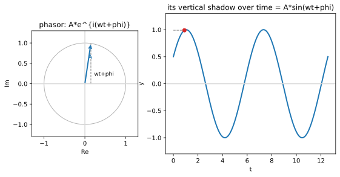

# ch10 — 波的解剖：振幅、頻率、相位（相量）

> **本章解決什麼問題**：這是 Part IV「週期與波」的開場。前面九章我們把三角函數從三角形搬進單位圓（見 ch01–03）、認出旋轉是母題（見 ch04–06）、再用複數把旋轉變成代數、用 Euler 公式把指數與旋轉接上線（見 ch07–09）。現在這條故事線要落到**時間軸**上：當那支在單位圓上轉個不停的箭頭開始隨時間轉動，它的影子在牆上來回畫出來的，就是一個波。本章解剖一個正弦波的每個部件（振幅、角頻率、相位、週期、頻率），並把它接回 ch01 的影子隱喻與 ch08 的 e^{iθ}——「波，就是旋轉的側面照」。這支旋轉箭頭有個工程名字：相量（phasor）。

```
Part I 搖籃與真身        Part II 旋轉是母題       Part III 複數：旋轉的代數
ch01 三角形→圓的真身     ch04 和角公式            ch07 複數平面=旋轉+縮放
ch02 弧度            →   ch05 旋轉矩陣        →   ch08 Euler 公式 ★
ch03 單位圓：六函數的家  ch06 點積與投影          ch09 de Moivre 與單位根
                                                        │
                                                        ↓
Part V 近親與收官        Part IV 週期與波 ◄你在這裡
ch14 反函數與 atan2  ←   ch13 傅立葉的門口    ←   ch10 波的解剖（相量）
ch15 雙曲孿生＋收官 ★    ch12 疊加：拍頻/Lissajous  ch11 為什麼 sin′=cos
```

## 從你已知的出發

你天天在看波，只是沒這樣稱呼它。

打開任何一張監控儀表板，把時間窗拉長到一週，QPS 那條線不是平的——它有日週期（白天高、深夜低）疊在週週期（工作日高、週末低）上。你看到的是兩個不同「轉速」的波疊在一起（疊加是 ch12 的事，本章先解剖單獨一個）。再往下：音訊的「音高」就是頻率，A4 這個音是每秒振動 440 次的空氣壓力波；你寫過的 EMA（指數移動平均）本質上是個低通濾波器，它讓高頻的抖動衰減、放慢頻的趨勢通過；插座裡的市電是 60 Hz（台灣）的交流電，電壓每秒來回擺盪 60 次。

這些東西有一個共同的數學骨架。任何「規律重複、上下擺盪」的量，都可以寫成這個樣子：

```text
y(t) = A · sin(ω·t + φ)
```

這一行裡藏了三個獨立的旋鈕：**A 決定它擺多高、ω 決定它擺多快、φ 決定它從哪個位置開始擺**。本章要做的第一件事，就是把這三個旋鈕一個一個拆開、講清楚每個在控制什麼。

但這本書不會只停在「認部件」。真正的「啊哈」在後面：這個波不是憑空冒出來的東西，它是**一支在單位圓上轉個不停的箭頭，投在牆上的影子**。ch01 我們說過 sin 是繞圓的影子——當時影子是隨「角度」變化；現在讓角度隨「時間」線性增加（角度 = ω·t + φ），影子就隨時間來回，畫出一條波。波是旋轉的側面照。這支旋轉箭頭在工程上有個名字叫**相量（phasor）**，它就是 ch08 那個 e^{iθ} 開始隨時間轉動的版本。把這件事看穿，你會發現「波」與「旋轉」是同一件事的兩個視角——而這正是整個 Part IV 站立的地基。

## 解剖一個正弦波：五個部件

我們把 `y(t) = A·sin(ω·t + φ)` 攤開，逐個部件講。為了讓你有具體的東西抓著，全程用一個範例貫穿：`y(t) = 3·sin(2t + π/6)`（這也是本章 worked example 要算的那個）。

### A — 振幅（amplitude）：擺多高

```text
A = 3       ← 波在 +3 與 −3 之間來回；峰值 3，谷值 −3
```

振幅是波偏離中線的最大幅度。因為 sin 的值永遠在 −1 到 +1 之間，乘上 A 之後，整條波就被框在 −A 到 +A 之間。在我們的例子裡 A=3，所以波在 +3 與 −3 之間擺。

A 控制的是「大小」，不影響「快慢」也不影響「從哪開始」。這是它的獨立性：你把 A 從 3 改成 10，波會變高，但每個峰、每個零點出現的**時刻**完全不變。在音訊裡 A 是音量；在交流電裡 A 是電壓峰值；在監控曲線裡 A 是流量的擺盪幅度。

### ω — 角頻率（angular frequency）：轉多快（rad/s）

```text
ω = 2       ← 角度以每秒 2 弧度的速率前進（單位 rad/s）
```

這是整個解剖裡最容易被誤解、也最關鍵的部件，所以慢一點。ω（讀作 omega）叫**角頻率**，單位是「弧度／秒」（rad/s）。它的意思是：把波想成一支旋轉的箭頭，ω 就是那支箭頭的**角速度**——每過一秒，箭頭轉過 ω 個弧度。

為什麼用「角」頻率、單位是弧度？因為波的本質是旋轉（這是本章的主張），而旋轉的自然單位是弧度（這是 ch02 的主張，現在回收）。`Math.sin` 吃的是弧度（見 ch02 那次把度數丟進去得到垃圾的 bug），ω·t 算出來的也是弧度——單位一路自洽。如果你硬要用「每秒轉幾度」，ω·t 就會多出一個 π/180 的醜常數，整個式子變髒（這個髒常數在 ch11 講導數時會更明顯地咬人）。

在我們的例子裡 ω=2，意思是這支箭頭每秒轉 2 弧度。轉一整圈是 2π 弧度，所以它轉一圈需要 2π/2 = π 秒——這就引出下一個部件。

### T — 週期（period）：轉一圈要多久

```text
T = 2π / ω = 2π / 2 = π       ← 約 3.14159 秒轉一整圈、波形重複一次
```

週期 T 是波形重複一次所需的時間，也就是那支箭頭轉滿一整圈（2π 弧度）所需的時間。因為箭頭以 ω rad/s 的速率轉，轉滿 2π 弧度自然要 `T = 2π/ω` 秒。

這個關係 `T = 2π/ω` 值得你內化成反射動作。它把「轉多快」（ω）翻譯成「多久重複一次」（T），兩者是倒數關係再乘 2π。ω 大 ⇒ 轉得快 ⇒ T 小（重複得頻繁）；ω 小 ⇒ 轉得慢 ⇒ T 大。在我們的例子裡 T=π≈3.14159 秒。

### f — 頻率（frequency）：每秒重複幾次

```text
f = 1 / T = 1 / π ≈ 0.31831       ← 每秒重複約 0.318 次（單位 Hz）
```

頻率 f 是週期的倒數：`f = 1/T`，單位是赫茲（Hz，每秒幾次）。週期問「重複一次要多久」，頻率問「一秒能重複幾次」——同一件事的兩種問法，互為倒數。

f 與 ω 也有直接關係。轉一圈是 2π 弧度、每秒轉 f 圈，所以每秒轉的弧度數是 2π·f，這正是 ω：

```text
ω = 2π·f          ← 角頻率 = 2π × 普通頻率
f = ω / (2π)      ← 反過來
```

三個「快慢」的量——ω（rad/s）、f（Hz）、T（秒）——其實是同一件事的三種刻度，知道一個就知道另外兩個。工程上音訊講 f（440 Hz）、市電講 f（60 Hz），數學與物理推導講 ω（因為弧度乾淨），週期性分析講 T（24 小時）。你要能在三者之間隨手換算。我們的例子：ω=2 ⇒ f=2/(2π)=1/π≈0.318 Hz ⇒ T=π≈3.14 秒。

### φ — 相位（phase）：從哪個位置開始

```text
φ = π/6       ← 初相位；t=0 時箭頭已經在 π/6（30°）的位置，不是從 0 起跑
```

最後一個旋鈕 φ（讀作 phi）叫**初相位**（initial phase）或**相位偏移**。它回答的問題是：在 t=0 那一刻，這支箭頭在哪？

如果沒有 φ（也就是 φ=0），波是純粹的 `A·sin(ω·t)`，t=0 時箭頭在角度 0、影子在中線（sin 0 = 0），波從零點往上出發。加了 φ，等於讓箭頭在 t=0 時就「預先轉好」φ 這麼多——在我們的例子裡 φ=π/6（30°），所以 t=0 時箭頭已經在 30° 的位置，影子的高度是 sin(π/6)=1/2，乘上 A=3 得 1.5。波不是從零起跑，而是從 1.5 起跑，且正在往上。

相位是三個旋鈕裡最抽象、也最容易出錯的（陷阱那節會專門修理它）。一個關鍵的直覺：**相位的差異 = 兩個波在時間上錯開了多少**。φ 為正，波被「往左推」（提早發生）；φ 為負，波被「往右推」（延後發生）。注意這個左右方向常被搞反——`sin(ω·t + φ)` 裡的 +φ 讓波**提早**到達某個相位，因為在更小的 t 就湊滿了同樣的總角度。

## 相量：把波看成旋轉箭頭的影子（本章的核心）

現在做這一章最重要的視角翻轉。前面我們把 `A·sin(ω·t + φ)` 當成一條曲線在解剖；接下來我們要證明它根本不是「一條曲線」，而是「一支旋轉箭頭的影子」。

### 從 ch08 的 e^{iθ} 接上時間

回憶 ch08：`e^{iθ}` 是單位圓上的一個點，θ 一增加，它就逆時針繞圓。現在做兩件事——把半徑放大成 A、讓角度隨時間線性增加 θ = ω·t + φ：

```text
z(t) = A · e^{i(ω·t + φ)}          ← 一支長度 A、以角速度 ω 旋轉的箭頭，t=0 時指向角 φ
```

這就是**相量**（phasor）。它是複數平面上一支箭頭：長度（模）永遠是 A，輻角隨時間以 ω rad/s 增加，t=0 時指向 φ。它轉個不停，每 T=2π/ω 秒繞一整圈。這完全就是 ch08 那個 e^{iθ}，只是現在 θ 變成了時間的線性函數，箭頭活了起來、開始轉。

把它用 Euler 公式（見 ch08）攤成實部與虛部：

```text
z(t) = A·cos(ω·t + φ) + i · A·sin(ω·t + φ)
        └──── 實部（橫影子）────┘   └──── 虛部（縱影子）────┘
```

看到了嗎？這支旋轉箭頭的**虛部**（縱座標、它在虛軸上的影子）正好是 `A·sin(ω·t + φ)`——我們一整章在解剖的那個波。而它的**實部**（橫座標、在實軸上的影子）是 `A·cos(ω·t + φ)`。

**波，就是這支旋轉箭頭投在某根軸上的影子。** 箭頭在二維平面上規規矩矩地轉圓，但你只看它的縱影子，影子就在中線上下來回，畫出正弦波；只看橫影子，就畫出餘弦波。這是 ch01「sin 是繞圓的影子」隱喻的完整兌現——當時影子隨角度動，現在角度隨時間動，影子就隨時間畫出一條波。我認為這是把「旋轉」與「週期」這兩個全書關鍵字焊在一起的那一步：它們是同一支箭頭的正面照（圓）與側面照（波）。



### 五個部件回到箭頭上

把剛才解剖的五個部件，全部翻譯成這支箭頭的語言，你會發現每一個都變得不言自明：

```text
部件        波的語言              箭頭（相量）的語言
────────    ──────────────────    ────────────────────────────────
A           擺動的最大幅度        箭頭的長度（半徑）
ω           角頻率 (rad/s)        箭頭的角速度——每秒轉幾弧度
T = 2π/ω    一個週期的時間        箭頭轉一整圈的時間
f = 1/T     頻率 (Hz)             箭頭每秒轉幾圈
φ           初相位                t=0 時箭頭指向的角度（起跑位置）
```

A 是半徑、ω 是轉速、φ 是起跑角——「波的解剖」其實就是「一支旋轉箭頭的規格表」。一旦你習慣在腦裡把任何正弦波還原成一支轉動的箭頭，波的所有性質都變成關於旋轉的、看得見的事實，不再是要背的公式。本章的 figure 就是把這件事畫出來：左邊一支在圓上轉的箭頭，右邊把它的縱座標隨時間攤開成波，虛線把對應的點連起來。

### sin 與 cos 只差一個 90° 的相位

既然 sin 是縱影子、cos 是橫影子，而橫軸與縱軸差 90°，那麼 sin 與 cos 不過是「同一支箭頭、差 90° 的兩個影子」。寫成式子（2026-06 查證，這是 EE 的標準關係）：

```text
cos θ = sin(θ + 90°) = sin(θ + π/2)          ← cos 是「超前 90° 的 sin」
sin θ = cos(θ − 90°) = cos(θ − π/2)          ← 反過來，sin 落後 cos 90°
```

用箭頭看就秒懂：橫影子（cos）總是比縱影子（sin）「早 90° 到達峰值」。t=0 時箭頭指向 0°，這時 cos（橫影子）已經在最大值 1，而 sin（縱影子）才剛在 0、正要往上爬——箭頭得再轉 90° 縱影子才追到最大。所以我們說**cos 超前（leads）sin 90°**，或等價地 **sin 落後（lags）cos 90°**。

這也回答了一個常被問的問題：「波到底該用 sin 還是 cos 寫？」答案是**都可以，差別只是相位 φ 平移 90°**。電機工程習慣用 cos（把波寫成 `A·cos(ω·t+φ)`，取旋轉箭頭的**實部**當訊號，2026-06 查證），數學課本常用 sin。本書 worked example 用 sin 形式（取虛部）以對齊 ch01 的「高度＝影子」直覺，但你心裡要清楚：換一個就是 φ 加減 π/2，同一支箭頭、換一根軸看影子而已。挑哪根軸是約定，不是數學差異。

### 為什麼工程上用相量：把微積分變成代數

如果相量只是「把波畫成箭頭」的可愛比喻，它不會成為整個電機工程的工作語言。它之所以無所不在，是因為它把**微分與相加這兩件麻煩事，變成複數的代數**。

先看相加。假設你有兩個**同頻率**的波要疊起來（同樣的 ω，不同的 A 和 φ）。在「曲線」的世界裡，相加兩條 sin 曲線要動用和角公式、湊半天。但在「箭頭」的世界裡，兩支同速旋轉的箭頭相加，就是**向量加法**——頭尾相接，得到一支新箭頭，它仍以同樣的 ω 旋轉（因為兩支同速，合起來還是同速）。於是「兩個同頻波相加還是同頻波」變成一句廢話，而新波的振幅與相位就是那支合成箭頭的長度與角度。這正是 ch12 要展開的「同頻疊加 = 相量加法」，這裡先埋下種子。

再看微分——這是相量最漂亮的一招。對 `z(t) = A·e^{i(ω·t+φ)}` 求導：

```text
d/dt [ A·e^{i(ω·t+φ)} ] = i·ω · A·e^{i(ω·t+φ)} = i·ω · z(t)
```

對時間微分，竟然只是**把整支箭頭乘上 i·ω**（2026-06 查證，這是相量分析的核心簡化）。乘 ω 是把長度放大 ω 倍，乘 i 是逆時針轉 90°（見 ch07）——所以「微分」這個本來要動用極限的操作，在相量世界裡退化成「放大 ω 倍、再轉 90°」的一次乘法。這意味著電路裡描述電感、電容的微分方程，全部可以被改寫成 i·ω 的代數方程，解聯立就好，不必解微分方程。這是相量被發明出來的真正理由（為什麼 d/dt e^{iθ} 會是乘 i，更深的旋轉直覺在 ch11 補上：旋轉的速度永遠垂直於半徑，所以是乘 i）。

一句話收束：**相量把「波」變回「旋轉的箭頭」，而旋轉的箭頭是複數，複數的微分與相加都是代數。** 這就是為什麼工程師寧願把一條好端端的 sin 曲線，硬寫成一個轉個不停的複數。

## Worked example：解剖 y = 3·sin(2t + π/6)，一步都不跳

把整章的部件清單，套到一個具體的波上跑一遍，每個數字都自己算、自己複核。

給定 `y(t) = 3·sin(2t + π/6)`，對照標準型 `A·sin(ω·t + φ)`，逐項讀出五個部件：

```text
A = 3                         ← 振幅；波在 −3 與 +3 之間
ω = 2                         ← 角頻率 2 rad/s（注意：是 t 的係數，不是別的）
T = 2π/ω = 2π/2 = π           ← 週期 ≈ 3.14159 秒
f = 1/T = 1/π ≈ 0.31831       ← 頻率 ≈ 0.318 Hz；或由 f=ω/(2π)=2/(2π)=1/π 算，一致 ✓
φ = π/6                       ← 初相位 30°；t=0 時箭頭已在 30°
```

**自我複核三個「快慢」量互相一致**：ω=2、f=ω/(2π)=1/π、T=1/f=π，而 T 也應等於 2π/ω=2π/2=π ✓。三條路殊途同歸，數字對得起來，代表沒讀錯部件。最常見的讀錯是把 ω 看成別的東西——記住 **ω 永遠是 t 的係數**，這個例子裡乘在 t 前面的是 2，所以 ω=2，不是別的。

**算兩個具體時刻的值**。先算 t=0：

```text
y(0) = 3·sin(2·0 + π/6) = 3·sin(π/6) = 3·(1/2) = 1.5
```

t=0 時波在 1.5（不是 0！因為有初相位 φ=π/6 把它預先抬高了）。用箭頭看：t=0 時箭頭長 3、指向 30°，它的縱影子高度 = 3·sin(30°) = 3·0.5 = 1.5 ✓。

再算 t=π/4：

```text
總角度 = ω·t + φ = 2·(π/4) + π/6 = π/2 + π/6      ← 先算箭頭轉到哪個角度
       = 3π/6 + π/6 = 4π/6 = 2π/3                  ← 通分相加，得 120°
y(π/4) = 3·sin(2π/3) = 3·(√3/2) ≈ 3·0.86603 ≈ 2.59808
```

t=π/4 時，箭頭已經從 30° 轉到了 120°（轉過了 90°，因為 ω·t=2·π/4=π/2=90°，符合「角速度 2、轉了 π/4 秒 ⇒ 轉 π/2」）。它的縱影子高度 = 3·sin(120°) = 3·(√3/2) ≈ 2.59808。

**自我複核這個值合不合理**：120° 在第二象限、sin 為正且接近峰值（90° 是峰值），所以 y 應該是個接近 3 的正數——2.598 完全合理。若你算出負數或大於 3，馬上知道哪裡錯了（這是 ch04 學到的「先猜大概多大」的煙霧偵測器）。順帶驗一下 √3/2：√3≈1.73205，除以 2≈0.86603（landscape 基準值），3 乘上去 ≈2.59808 ✓。

**把它畫成箭頭**。整個 worked example 用箭頭重講一遍就是：一支長 3 的箭頭，t=0 時指向 30°，以每秒 2 弧度的速率逆時針轉，每 π 秒繞一圈。你要的 `y(t)` 就是這支箭頭的縱影子隨時間的軌跡。t=0 影子在 1.5、往上爬；t=π/4（轉了 90°）影子爬到 2.598；繼續轉，影子會在某刻碰到峰值 3（當箭頭指向 90°、即總角度 = π/2、解 2t+π/6=π/2 得 t=π/6 秒），然後下滑。本章的 figure 畫的就是這幅「箭頭→影子→波」的對照圖。

## 直覺的陷阱

波的部件裡，相位與頻率是兩個最大的坑。它們之所以坑，是因為「角」這個字藏了單位、藏了正負號、藏了「不同頻率不能比相位」這條鐵律。

| 陷阱 | 錯誤直覺長什麼樣 | 在哪一步把你帶溝裡 | 怎麼自我察覺 |
|---|---|---|---|
| ω 與 f 混用 | 把 `sin(2t)` 的 2 當成「每秒 2 次」（其實是 2 rad/s） | 漏掉 2π 的換算 | 記死 ω=2πf。`sin(2t)` 的頻率是 2/(2π)=1/π≈0.318 Hz，不是 2 Hz。差了 2π≈6.28 倍 |
| φ 的正負方向搞反 | 以為 `sin(t+φ)`（φ>0）把波「往右」推（延後） | 把「+φ」直覺成「往後加時間」 | +φ 是把波**往左**推（提早）：更小的 t 就湊滿同樣的總角度。畫 sin(t) 與 sin(t+π/2) 對照，後者的峰值出現得更早 |
| 相位用度數混進弧度 | 在 `sin(ω·t + φ)` 裡 φ 填 30（想填 30°） | 程式 `Math.sin` 全吃弧度（見 ch02） | φ 該填 π/6≈0.524，不是 30。填 30 等於轉了 30 弧度（快 5 圈），波形面目全非。算出來週期不對就回頭查單位 |
| 不同頻率也拿來比相位 | 說「這兩個波相位差 90°」但它們 ω 不同 | 把相位當成「絕對的時間錯位」 | 相位差只在**同頻率**之間有穩定意義。兩個不同 ω 的波，它們的相位差每一刻都在變，沒有單一的「相位差」可言（ch12 的拍頻正是這個變動的後果） |
| 把 A 改大以為會變快 | 以為振幅和頻率會互相影響 | 三個旋鈕的獨立性沒看清 | A 只管高度、ω 只管快慢、φ 只管起點，三者正交。把 A 從 3 改成 100，每個峰、每個零點的**時刻**一秒都不變 |
| sin/cos 之爭 | 糾結「這個波到底是 sin 還是 cos」 | 以為兩者本質不同 | 它們只差 90° 相位（cos θ = sin(θ+π/2)）。同一支箭頭、換一根軸看影子。挑哪個是約定，不是數學差異 |

最該內化的一條：**相位是「相對」的量，只在同頻率之間才談得上「相位差」。** 兩支轉速相同的箭頭，它們的夾角永遠固定，這個固定夾角就是相位差，看得見、算得準；但兩支轉速不同的箭頭，夾角每一刻都在改變，問「它們相位差多少」就像問「兩支不同速的時針此刻夾角」——只能說「此刻」，沒有恆定答案。把這條記牢，ch12 的拍頻（兩個相近頻率疊加，相位差緩慢漂移造成的強弱起伏）就不會讓你意外。

## 紙上推演

### 推演題

**題 1（cos 寫成 sin，找出相位）** **[10 分鐘] ★**
把 `cos t` 寫成 `sin(t + φ)` 的形式，找出 φ。再把 `cos(t)` 寫成 `sin(t − φ′)` 的形式，找出 φ′（提示：同一件事有兩個寫法，因為相位可以加減 2π 的整數倍，但請給出最小正的與最小負的那兩個）。

**題 2（同頻不同相，畫相位差）** **[15 分鐘] ★★**
給兩個同頻率的波 `y₁ = sin(t)` 與 `y₂ = sin(t − π/3)`。(i) 哪一個超前、哪一個落後？差多少？(ii) 用兩支旋轉箭頭描述這個相位差（它們此刻的夾角是多少、誰在前）。(iii) 在時間軸上，y₂ 的峰值比 y₁ 早到還是晚到？早／晚多少時間？

**題 3（把監控週期翻成波的語言）** **[15 分鐘] ★★**
你的監控曲線有明顯的 24 小時日週期，峰值在中午 12 點、谷值在午夜，平均流量 1000 QPS、峰谷差 ±400 QPS。把它寫成 `baseline + A·sin(ω·t + φ)` 的形式：(i) baseline、A、ω 各是多少（t 以小時計）？(ii) 為了讓峰值落在 t=12（中午），φ 該設多少？(iii) 週期 T 與頻率 f 各是多少？

**題 4（口頭題：波為什麼是旋轉的影子）** **[10 分鐘] ★★**
不看圖，向另一個工程師口頭解釋：為什麼 `A·sin(ω·t+φ)` 是「一支旋轉箭頭的影子」？把 A、ω、φ 各對應到箭頭的哪個屬性。最後說清楚「sin 影子」與「cos 影子」差在哪。

### 推演解答

**題 1。** 由本章的關係 `cos θ = sin(θ + π/2)`，直接讀出：寫成 `sin(t + φ)` 時 **φ = π/2**（最小正）。寫成 `sin(t − φ′)`：我們要 `sin(t − φ′) = cos t`，而 `cos t = sin(t + π/2) = sin(t + π/2 − 2π) = sin(t − 3π/2)`，所以 **φ′ = 3π/2**（最小正的減法形式）。自我複核：t=0 時 cos 0 = 1（峰值），而 sin(0+π/2)=sin(π/2)=1 ✓，sin(0−3π/2)=sin(−3π/2)=1 ✓，兩個寫法都對得上。常見錯路：寫成 `sin(t − π/2)`——那是 `−cos t`（代 t=0 得 sin(−π/2)=−1，不是 +1），方向反了。

**題 2。** (i) `y₂ = sin(t − π/3)`，相位是 −π/3（負），代表 y₂ 被往右推、**延後**，所以 **y₁ 超前 y₂，相差 π/3（60°）**。等價說法：y₂ 落後 y₁ 60°。(ii) 兩支箭頭都以 ω=1 同速逆時針轉，y₁ 的箭頭永遠比 y₂ 的箭頭**領先 π/3**——此刻夾角 60°，y₁ 在前（角度較大）、y₂ 在後。因為同速，這個 60° 的夾角永遠固定，這就是「相位差只在同頻才穩定」的具體樣子。(iii) y₂ 的峰值**晚到**。y₁ 的峰值在 t=π/2（sin 在 π/2 達峰），y₂ 要 t−π/3=π/2 即 t=π/2+π/3=5π/6 才達峰，晚了 **π/3 秒**（時間差 = 相位差 ÷ ω = (π/3)/1 = π/3）。

**題 3。** (i) baseline = **1000**（平均流量）、A = **400**（峰谷差的一半）、週期是 24 小時所以 **ω = 2π/24 = π/12 ≈ 0.2618 rad/hr**。(ii) 我們要峰值落在 t=12。sin 在它的參數等於 π/2 時達峰，所以要 `ω·12 + φ = π/2`，即 `(π/12)·12 + φ = π/2`，`π + φ = π/2`，解得 **φ = −π/2**。（直覺檢查：φ=−π/2 把純 sin 變成 −cos，−cos 在 t=0 是 −400（午夜谷值，因為午夜流量最低）、在 t=12 是 +400（中午峰值）✓，正好符合「午夜谷、中午峰」。）寫全：`y(t) = 1000 + 400·sin((π/12)·t − π/2)`，等價於 `1000 − 400·cos((π/12)·t)`。(iii) T = 2π/ω = 2π/(π/12) = **24 小時**（理所當然，這就是我們設的日週期）；f = 1/T = **1/24 次/小時** ≈ 0.0417 cph。

**題 4。** 模範口述要點：「把波想成一支從原點出發的箭頭。箭頭的**長度**是 A，決定影子能擺多高；箭頭以**角速度 ω** 逆時針旋轉，ω 決定它轉多快、也就決定波多快重複（轉一圈 = 一個週期 = 2π/ω 秒）；**初相位 φ** 是 t=0 時箭頭指向的角度，決定波從哪個位置起跑。波，就是這支箭頭投在某根軸上的影子隨時間的軌跡——投在縱軸（看高度）得到 sin，投在橫軸（看左右）得到 cos。sin 影子與 cos 影子差 90°，因為橫軸與縱軸差 90°——cos 總是比 sin 早 90° 到達峰值。」能講出「sin 是縱影子、cos 是橫影子、差 90° 因為兩軸垂直」就算過關。

### 動手生圖

本章的圖就是這段 Python 小實驗。它把本章最核心的視角翻轉畫出來：**左邊一支在單位圓上旋轉的箭頭（相量），右邊把它的縱座標隨時間攤開成一條正弦波**，用虛線把對應的點連起來——讓你親眼看見「波 = 旋轉箭頭的影子在時間上的展開」。

```python
# ch10 figure: a rotating phasor (left) and its vertical projection unrolled into a sine wave (right)
from pathlib import Path
import numpy as np
import matplotlib
matplotlib.use("Agg")          # headless; no display needed
import matplotlib.pyplot as plt

OUT = Path(__file__).resolve().parent / "out" / "ch10-phasor-to-wave.svg"
OUT.parent.mkdir(parents=True, exist_ok=True)

A, w, phi = 1.0, 1.0, np.pi / 6        # amplitude, angular freq, initial phase
t_now = 0.9                            # the "current" time we draw the arrow at
ang = w * t_now + phi                  # current arrow angle = w*t + phi

fig, (axL, axR) = plt.subplots(1, 2, figsize=(9, 4.2),
                               gridspec_kw={"width_ratios": [1, 1.6]})
# --- left: rotating phasor on a circle ---
th = np.linspace(0, 2 * np.pi, 200)
axL.plot(A * np.cos(th), A * np.sin(th), color="0.7", lw=1)          # circle radius A
axL.annotate("", xy=(A * np.cos(ang), A * np.sin(ang)), xytext=(0, 0),
             arrowprops=dict(arrowstyle="->", color="C0", lw=2))     # the phasor arrow
axL.plot([A * np.cos(ang)] * 2, [0, A * np.sin(ang)], "--", color="0.5", lw=1)  # drop to its height
axL.text(0.30 * np.cos(ang / 2), 0.30 * np.sin(ang / 2), "wt+phi", fontsize=9)
axL.text(A * np.cos(ang) * 0.55, A * np.sin(ang) * 0.55 + 0.06, "A", color="C0", fontsize=10)
axL.set_aspect("equal"); axL.set_xlim(-1.3, 1.3); axL.set_ylim(-1.3, 1.3)
axL.axhline(0, color="0.85"); axL.axvline(0, color="0.85")
axL.set_title("phasor: A*e^{i(wt+phi)}"); axL.set_xlabel("Re"); axL.set_ylabel("Im")
# --- right: vertical coordinate unrolled over time = sine wave ---
t = np.linspace(0, 4 * np.pi, 400)
axR.plot(t, A * np.sin(w * t + phi), color="C0", lw=2)              # the wave
axR.plot([0, t_now], [A * np.sin(ang)] * 2, "--", color="0.5", lw=1)  # link same height
axR.plot(t_now, A * np.sin(ang), "o", color="C3")                  # corresponding point
axR.axhline(0, color="0.85")
axR.set_title("its vertical shadow over time = A*sin(wt+phi)")
axR.set_xlabel("t"); axR.set_ylabel("y"); axR.set_ylim(-1.3, 1.3)
fig.savefig(OUT, bbox_inches="tight")
print("wrote", OUT)            # build_figures.py reads this
```

**預期輸出**：終端機印出 `wrote .../figures/out/ch10-phasor-to-wave.svg`。左圖是一個半徑 A 的圓，一支從原點指出的藍色箭頭停在角度 `ω·t_now+φ` 的位置，虛線把箭頭尖端拉到它的高度（縱影子）。右圖是同一個波 `A·sin(ω·t+φ)` 隨時間展開的曲線，一條水平虛線把左圖那支箭頭的高度，連到右圖在 `t=t_now` 處的紅點——兩邊高度相同，這就是「波是旋轉箭頭的縱影子」的視覺證據。

**改參數看什麼**：
- 改 `A`（振幅）：左圖的圓與箭頭變大，右圖波的上下幅度跟著變大，但**峰值出現的時刻不變**——親眼確認 A 只管高度、不管快慢。
- 改 `w`（角頻率）：右圖波變密（w 大）或變疏（w 小），左圖箭頭在同一個 `t_now` 轉到的角度也不同。數一數右圖在 `0` 到 `4π` 之間擠了幾個完整週期，對照 `T=2π/w` 驗算。
- 改 `phi`（初相位）：整條波在右圖**水平平移**——φ 變大波往左移（提早），φ 變小往右移（延後）。把 `phi` 設成 `np.pi/2`，右圖會變成從峰值起跑的餘弦形狀（因為 sin(t+π/2)=cos t），親眼看見 sin 與 cos 只差 90° 相位。
- 改 `t_now`：箭頭轉到不同位置，右圖的紅點沿波移動，虛線始終連著相同高度——多試幾個值，看「箭頭轉、影子跑」的對應關係。

## 自我檢核

口頭自答，講得出來才算過關：

1. `A·sin(ω·t + φ)` 的五個部件各控制什麼？哪三個是「快慢」的不同刻度、彼此怎麼換算？
2. ω 與 f 差在哪？為什麼差一個 2π？`sin(60t)` 的頻率是 60 Hz 嗎？（不是——是 60/(2π)≈9.55 Hz。）
3. 「波是旋轉箭頭的影子」這句話，A、ω、φ 各對應箭頭的哪個屬性？sin 影子與 cos 影子差在哪、為什麼差 90°？
4. 相量 `A·e^{i(ω·t+φ)}` 跟我們解剖的那個波是什麼關係？取它的哪一部分得到 sin 波、哪一部分得到 cos 波？
5. 為什麼工程上要把波寫成旋轉的複數箭頭？對相量微分會發生什麼事（乘上什麼）？這替你省掉了什麼麻煩？
6. 「相位差」這個量，為什麼只在**同頻率**的波之間才有穩定意義？兩個不同 ω 的波談相位差會怎樣？
7. `sin(ω·t + φ)` 裡 φ 為正，波是往左推（提早）還是往右推（延後）？為什麼？
8. 給你 `y = 5·sin(4t − π/3)`，不查公式，口頭報出 A、ω、T、f、φ。（A=5、ω=4、T=π/2、f=2/π≈0.637、φ=−π/3。）

## 延伸閱讀

- **3Blue1Brown，「But what is a Fourier series? From heat flow to circle drawings」**（DE 系列，2019）。本章是「單獨一支相量」，這支影片把「一堆相量首尾相接畫出任意曲線」演給你看——是 ch13 的預告，但開頭那段「旋轉的圓 → 波」正好把本章的核心視覺化。https://www.3blue1brown.com/lessons/fourier-series/
- **Better Explained，「Intuitive Understanding Of Euler's Formula」**。把 `e^{iθ}` 講成「在圓上旋轉」的直覺，正是本章相量 `A·e^{i(ω·t+φ)}` 的地基；讀完回頭看本章「相量」那節會更通透。https://betterexplained.com/articles/intuitive-understanding-of-eulers-formula/
- **Wikipedia,「Phasor」**。工程視角的相量完整詞條：旋轉向量、複數振幅、為什麼微分變成乘 i·ω、AC 電路怎麼用它把微分方程變代數。想看本章「為什麼工程上用相量」那節的工程細節，從這裡讀（2026-06 查證，內容與本章一致）。https://en.wikipedia.org/wiki/Phasor
- **Eli Maor,《Trigonometric Delights》**（Princeton Science Library）。三角的歷史與直覺散文集；關於正弦波作為週期運動的章節，補本章「波是旋轉的側面照」的數學史脈絡。https://www.amazon.com/Trigonometric-Delights-Princeton-Science-Library/dp/0691202192
- 往前一步：本章只解剖**單獨一個**波、且只到「相量的微分是乘 i·ω」為止。下一章 ch11 會補上「為什麼 d/dt 旋轉是乘 i」更深的旋轉直覺（速度永遠垂直於半徑，sin′=cos）；ch12 把**兩三個**波疊起來（同頻＝相量加法、異頻＝拍頻與 Lissajous）；ch13 走到傅立葉的門口（無限多支相量的合奏）。本章是這整段的入口。
