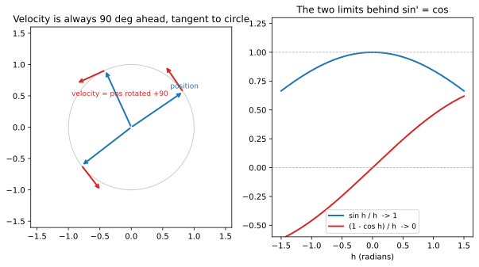

# ch11 — 為什麼 sin′=cos：旋轉的速度還是旋轉

> **本章解決什麼問題**：你大概背過 `(sin)′=cos`、`(cos)′=−sin`，但沒人好好告訴你**為什麼**。姊妹書《馴服無限》ch05 講到這裡時只給了一張幾何草圖、明說「嚴格版留給別處」——本章就是那個別處：用「旋轉」把它正式補上。核心只有一句話：一個點等速繞單位圓跑，它的速度向量永遠是「把位置向量逆時針轉 90°」——而 `sin′=cos`、`cos′=−sin` 不過是這句話拆成兩個座標分量。本章銜接 ch10（相量旋轉），並把這條導數一路接到彈簧 `x″=−x`（《馴服無限》ch10），讓你看見三角函數住在一切振動裡。它也是 ch08 那句「`d/dθ e^{iθ}=i·e^{iθ}`」的實數版翻譯——同一件事，兩個鏡頭。

## 從你已知的出發

你在遊戲後端做過上下浮動的動畫：一個道具懸在空中，輕輕地上下飄，`y = A·sin(ωt)`。你也做過監控，看過某個指標一天一個週期地起伏。你還在 ch10 看過相量——一支以角速度 ω 旋轉的箭頭，它在牆上的影子就是這支正弦波。

現在問一個你平常不會問的問題：**這支波在某一瞬間，變化得有多快？** 道具飄到最高點的那一刻，它的上下速度是多少？直覺會說「零」——到頂了，正要往回掉，瞬間靜止。那它在中間（過平衡點）的時候呢？最快。這個「位置最高時速度為零、位置在中間時速度最快」的節奏，你身體是知道的（盪鞦韆、彈簧、心跳），只是沒把它寫成一條導數。

寫出來就是：`sin` 在頂點（θ=90°）的斜率是 0，在原點（θ=0）的斜率是最大值 1。而 `cos` 這個函數，剛好在 θ=0 時等於 1、在 θ=90° 時等於 0。**`sin` 的斜率，逐點等於 `cos` 的值。** 這就是 `(sin)′=cos`。

但「逐點對得上」還只是觀察，不是理由。本章要給的是理由，而且是一個你會記一輩子、不必背的理由：把這支波還原成它的出身——一支旋轉的箭頭——然後問「這支箭頭跑得多快、往哪個方向跑」。答案漂亮到我認為它是整本書最值得在腦裡轉一遍的一張圖：**旋轉的速度，還是旋轉**。

## 先講結論，再給兩條路

`(sin)′=cos`、`(cos)′=−sin`。

到達它有兩條路，本章兩條都走，因為它們各自照亮一件事：

- **旋轉路（幾何/物理）**：把 `(cosθ, sinθ)` 看成一個等速繞單位圓的點，對 θ 微分就是求速度向量。速度永遠垂直於半徑、長度恆為 1——也就是「把位置逆時針轉 90°」。一行幾何，兩條導數同時掉出來。這條路給你**為什麼**，而且和 ch08 的 `e^{iθ}` 是同一件事。
- **極限路（差商）**：老老實實寫導數的定義 `lim (sin(θ+h)−sinθ)/h`，用 ch04 的和角公式拆開，整個問題會收斂到兩個小角極限 `lim sin h/h=1` 與 `lim(1−cos h)/h=0`（弧度下才成立——這裡回收 ch02）。這條路給你**機制**：導數哪來的、哪一步用到弧度。

兩條路推出同一對公式，這本身就是一個對帳練習（全書的招牌姿態）。先走旋轉路，因為它最短、最像「啊哈」。

## 旋轉路：速度永遠垂直於半徑

設一個點以單位角速度繞單位圓逆時針跑。在「時間」θ（這裡用角度當時間參數，因為角速度是 1，轉過的角度就是經過的時間）這一刻，它的位置是 ch03 釘死的單位圓主定義：

```text
P(θ) = (cos θ, sin θ)
```

速度，就是位置對 θ 的導數——位置在這一瞬間往哪個方向、移動得多快。逐分量寫：

```text
P′(θ) = ( (cos θ)′ , (sin θ)′ )    ← 速度向量 = 兩個分量各自的導數
```

繞了一圈，好像在用我們還沒證的東西。但這裡先不靠 `(sin)′`、`(cos)′` 的代數，先用**物理直覺**把速度向量的方向與長度釘出來，再回頭讀出兩個分量是什麼。這是本章的關鍵手法：不是「算出導數再解釋」，是「先看清楚速度長什麼樣，導數是讀出來的」。

關於等速圓周運動的速度，物理給我們兩件鐵的事實（2026-06 查證；任何大一物理的「uniform circular motion」一節都會講）：

1. **速度垂直於半徑。** 點被綁在圓上跑，它的位置到圓心的距離永遠是 1（沒變大也沒變小）。如果速度有任何沿著半徑方向的分量（朝圓心或背圓心），半徑長度就會變——但它沒變。所以速度**沒有**徑向分量，只剩切線方向。速度⊥半徑。
2. **速度的長度恆定。** 等速（角速度 1、半徑 1），所以線速度 `v=ω·r=1·1=1`。箭頭的長度永遠是 1。

把這兩件事拼起來：速度是一支**長度 1、垂直於半徑**的箭頭。垂直於半徑、長度又和半徑一樣是 1 的方向，只有兩個（半徑的左邊或右邊）。逆時針跑的點，速度指向「半徑逆時針轉 90°」那一側（你沿著圓往前走，圓心在你左手邊，前進方向就是把「指向圓心反方向的半徑」再逆時針轉 90°）。

於是——這是整章的樞紐——

```text
速度向量 = 把位置向量逆時針轉 90°
```

而「逆時針轉 90°」這個操作，我們在 ch05 早就寫成機器了：旋轉矩陣 R(90°)。把位置 `(cos θ, sin θ)` 餵進去：

```text
| cos 90°  −sin 90° | | cos θ |   | 0  −1 | | cos θ |   | −sin θ |
|                   | |       | = |       | |       | = |        |
| sin 90°   cos 90° | | sin θ |   | 1   0 | | sin θ |   |  cos θ |
```

所以速度向量是 `(−sin θ, cos θ)`。但速度的定義又是 `( (cos θ)′, (sin θ)′ )`。兩者必須相等，逐分量對帳：

```text
第一分量:  (cos θ)′ = −sin θ
第二分量:  (sin θ)′ =  cos θ
```

**兩條導數同時掉出來，一行幾何，沒有極限、沒有差商。** 我沒有「算」任何東西——我把速度向量的方向（垂直半徑）和長度（恆為 1）這兩件物理事實接受下來，剩下的就只是「逆時針轉 90° 把 `(cos θ, sin θ)` 送到哪」，而那是 ch05 的矩陣乘法。

> **這裡了不起在哪**（一定要能用自己的話轉述）：`(sin)′=cos` 看起來像兩個無關函數之間的巧合——憑什麼一個函數的斜率剛好是另一個函數的值？旋轉路告訴你它一點都不巧：`sin` 和 `cos` 本來就是同一個旋轉箭頭的兩個影子（縱影、橫影），而「微分」對這支箭頭做的事，就是「再把它逆時針轉 90°」。轉 90° 會把縱影換成橫影、把橫影換成反向的縱影——這就是為什麼 `sin` 的導數是 `cos`、`cos` 的導數是 `−sin`（那個負號是「橫影轉 90° 後跑到下面去了」）。**旋轉的速度還是旋轉。** 一旦你把這張圖在腦裡轉穩，這兩條導數你這輩子都不用再背。



### 這就是 ch08 的 `d/dθ e^{iθ}=i·e^{iθ}`

如果你讀過 ch08，這一節你會有 déjà vu，那是對的。ch08 問「什麼東西的變化率是把自己轉 90°」，答案是 `e^{iθ}`：`d/dθ e^{iθ}=i·e^{iθ}`，而「乘以 i」就是逆時針轉 90°（ch07）。把 `e^{iθ}=cos θ+i·sin θ` 代進去：

```text
d/dθ (cos θ + i·sin θ) = i·(cos θ + i·sin θ)
左邊  = (cos θ)′ + i·(sin θ)′
右邊  = i·cos θ + i²·sin θ = −sin θ + i·cos θ     ← i² = −1
```

比對實部與虛部：實部 `(cos θ)′=−sin θ`，虛部 `(sin θ)′=cos θ`。**和旋轉路一字不差。** 差別只在記法：旋轉路用「向量 + R(90°) 矩陣」說「轉 90°」，複數路用「乘以 i」說同一個「轉 90°」。`i·e^{iθ}` 和 `(−sin θ, cos θ)` 是同一支速度箭頭的兩種寫法。這不是兩個證明，是同一個證明穿了兩件衣服——這正是全書一再對帳的事：旋轉這件事，矩陣、複數、Euler 都在說它。

## 極限路：差商會收斂到哪兩個數

旋轉路漂亮，但它「借」了物理（速度⊥半徑、速度長度恆 1）。如果你想看純粹從導數定義出發、不借物理的版本，就走極限路。它也回答一個旋轉路藏起來的問題：**為什麼這一切只在弧度下成立？**

導數的定義是差商取極限。對 `sin`：

```text
(sin θ)′ = lim   sin(θ+h) − sin θ
           h→0 ─────────────────────
                        h
```

分子 `sin(θ+h)` 用 ch04 的和角公式拆開（恆等式給來源，不背）：

```text
sin(θ+h) = sin θ·cos h + cos θ·sin h
```

代回去，分子變成：

```text
sin(θ+h) − sin θ = sin θ·cos h + cos θ·sin h − sin θ
                 = sin θ·(cos h − 1) + cos θ·sin h     ← 把 sin θ 提出來
```

整條差商除以 h，拆成兩塊：

```text
sin(θ+h) − sin θ              cos h − 1            sin h
─────────────────  =  sin θ · ─────────  +  cos θ · ─────
        h                         h                   h
```

注意 `sin θ` 和 `cos θ` 在 `h→0` 的過程中是**常數**（θ 固定，動的是 h）。所以整個極限只取決於那兩個分數在 `h→0` 時跑去哪：

```text
        cos h − 1                  1 − cos h
lim   ───────────  = − lim       ───────────  = −0 = 0     ← 基準極限，弧度
h→0        h               h→0        h

        sin h
lim   ───────  = 1                                          ← 基準極限，弧度
h→0      h
```

這兩個是 ch02 就預告、landscape 釘死的基準極限：`lim sin h/h=1`、`lim(1−cos h)/h=0`（兩者都**只在弧度下成立**，下一節說為什麼）。代回去：

```text
(sin θ)′ = sin θ·0 + cos θ·1 = cos θ        ✓
```

`cos` 的導數同理（用 `cos(θ+h)=cos θ·cos h − sin θ·sin h`）：

```text
cos(θ+h) − cos θ              cos h − 1            sin h
─────────────────  =  cos θ · ─────────  −  sin θ · ─────
        h                         h                   h

(cos θ)′ = cos θ·0 − sin θ·1 = −sin θ       ✓
```

**整個導數，最後只壓在那兩個小角極限上。** 你會背的 `sin′=cos`，本質上就是「`sin h/h` 在 h 很小時等於 1」這件事乘上和角公式的結構。所有的力氣都花在那兩個極限——而那兩個極限，是 `sin`、`cos` 在原點附近長什麼樣的問題。

### 那兩個極限為什麼是 1 和 0：面積夾擠

`lim sin h/h=1` 不是天上掉下來的，它有一個只用面積就能看懂的幾何論證。本書到「直覺夠穩、能自我複核」為止，嚴格的 ε-δ 版本指向姊妹書《馴服無限》ch03/ch14；這裡給你能在腦裡畫出來的版本（2026-06 查證為標準的 squeeze 論證）。

在單位圓上取一個小的正角 h（弧度，`0<h<π/2`）。畫三個東西，比它們的面積：

```text
       B
       |\                 三個圖形,夾在一起:
       | \                ① 小三角形 OAP  (高 sin h)
   tan h  \               ② 扇形      OAP  (角 h)
       |   \ P            ③ 大三角形 OAB  (高 tan h)
       |   /|
       |  / | sin h
       | /  |
   O___|/___|____ A       OA = 半徑 = 1
            1
```

- **內接小三角形 OAP**：底 `OA=1`、高 `=sin h`（P 點的縱座標），面積 `= ½·1·sin h = ½ sin h`。
- **扇形 OAP**：角 h（弧度）的扇形，面積 `= ½·r²·h = ½ h`（ch02 的扇形面積公式 `½r²θ`——**這一步用到弧度**，記住這個位置）。
- **外接大三角形 OAB**：在 A 點畫切線交 OP 延長線於 B，底 `OA=1`、高 `=tan h`，面積 `= ½·1·tan h = ½ tan h`。

這三個圖形一個套一個（小三角形 ⊂ 扇形 ⊂ 大三角形），所以面積有大小順序：

```text
½ sin h  <  ½ h  <  ½ tan h
```

兩邊乘 2、再同除以 `sin h`（h 是小正角，`sin h>0`，不等號方向不變），並用 `tan h = sin h/cos h`：

```text
sin h  <   h   <  tan h

  1    <  h/sin h  <  1/cos h          ← 同除 sin h

cos h  <  sin h/h  <    1              ← 取倒數,不等號翻向
```

現在 `h→0`：左邊 `cos h → cos 0 = 1`，右邊就是 1。`sin h/h` 被夾在兩個都趨近 1 的東西中間，只能也趨近 1。這就是夾擠（squeeze）。**`lim sin h/h=1` 成立。**

第二個極限 `lim(1−cos h)/h=0` 可以從第一個推出來（乘上 `(1+cos h)/(1+cos h)` 把分子變成 `1−cos²h=sin²h`）：

```text
1 − cos h     1 − cos h   1 + cos h     1 − cos²h          sin²h
─────────  =  ───────── · ─────────  =  ───────────────  = ───────────────
    h             h       1 + cos h     h·(1 + cos h)      h·(1 + cos h)

           =  sin h  ·   sin h
              ─────     ─────────
                h       1 + cos h

      h→0:  →  1    ·    0/(1+1)   =   1 · 0 = 0           ✓
```

順帶一提，這個推導也送你 landscape 基準表的第三個極限：`lim(1−cos h)/h² = ½`（把上面倒數第二行不要約掉一個 h，剩 `(sin h/h)·(sin h/h)·1/(1+cos h) → 1·1·½`）。它在小角近似 `cos x≈1−x²/2`（ch02）背後，這裡不展開。

## 弧度才乾淨：度數會多出一個醜常數

旋轉路和極限路都偷偷用了弧度，現在把帳算清楚，因為這是 ch02 埋的伏筆的回收點。

極限路的破綻在面積夾擠那一步：**扇形面積 `½r²h` 只在 h 是弧度時成立**。如果 h 用度數，弧長和扇形面積公式要多塞一個 `π/180` 的換算因子，整個夾擠的數字就歪了。具體地，如果你用度數，`lim_{h→0} sin(h°)/h°` 不是 1，是 `π/180≈0.01745`——因為 `sin` 在原點的斜率（每「度」變化多少）被「度」這個小單位稀釋了 57 倍。

後果直接寫進導數。如果你堅持讓 `sin` 吃度數，那麼（2026-06 查證，標準的鏈式法則結果）：

```text
d
── sin(x°) = (π/180)·cos(x°)        ← 度數下,導數多出一個 π/180 的醜常數
dx
```

那個 `π/180≈0.01745` 永遠甩不掉，每微分一次就乘一次，二階導變 `(π/180)²`，泰勒級數每一項都被它污染。微積分裡所有關於 `sin`、`cos` 的公式都會長一身疣。

**弧度的「自然」就是在這裡兌現的**（ch02 說「弧度讓 `sin′=cos` 乾淨」，這章就是那張支票）：選弧度，等價於選一個讓 `sin` 在原點斜率恰好為 1 的角度單位——`lim sin h/h=1` 字面上就是「`sin` 過原點的斜率是 1」。斜率是 1，導數就乾淨，沒有換算常數。弧度不是「另一種角度單位」，它是**唯一讓微積分不長疣的那種**。這也是為什麼 `Math.sin`、`numpy.sin` 一律吃弧度——它們是給微積分用的，不是給量角器用的。

> 工程提醒，順手回收 ch02 的坑：你把度數丟進 `Math.sin` 得到垃圾的那次 bug，數學上的根就是這條——程式裡的三角函數活在「斜率為 1」的弧度世界，你拿度數去餵，等於在問「`sin` 每變化一度斜率多少」，答案差了 `180/π≈57.3` 倍。

## sin″=−sin：二階導指向圓心，這就是彈簧

現在把導數再做一次。`(sin)′=cos`，那 `(sin)″=(cos)′=−sin`。同理 `(cos)″=−cos`。寫成你會記住的一句：

```text
(sin)″ = −sin
(cos)″ = −cos
```

**一個函數的二階導等於它自己的相反數。** 用旋轉路看這件事，乾淨得驚人。一階導是「位置轉 90°」（速度），二階導就是「再轉 90°」——總共轉了 180°。把位置向量 `(cos θ, sin θ)` 逆時針轉 180°，得到 `(−cos θ, −sin θ)`，正好是**位置的相反向量**：

```text
位置:      P     = ( cos θ,  sin θ )
速度:      P′    = (−sin θ,  cos θ )    ← 轉 90°
加速度:    P″    = (−cos θ, −sin θ ) = −P   ← 再轉 90°,共 180°
```

加速度 `P″=−P`：它的方向是「從點指回圓心」（P 指向外、`−P` 指向圓心）。這就是物理課的**向心加速度（centripetal acceleration）**——等速圓周運動的加速度永遠指向圓心（2026-06 查證；向心加速度⊥速度、指向圓心，正是 `−P` 的方向）。旋轉路裡，一階導轉 90°（速度切於圓）、二階導再轉 90°（加速度指回圓心），兩次 90° 的幾何，就是「速度切線、加速度向心」這兩條物理事實的數學身世。

而 `x″=−x` 這條方程，你在《馴服無限》ch10 見過——它是**彈簧**的方程。彈簧的恢復力 `F=−kx`（拉得越遠、往回拉越用力，且方向相反），牛頓第二定律 `F=ma=mx″`，合起來（取單位讓係數為 1）就是 `x″=−x`。問「什麼函數的二階導是自己的相反數」，答案就是 `sin` 和 `cos`（及其線性組合）。所以彈簧的運動是 `x(t)=A·sin t+B·cos t`——一支正弦波。

這不是巧合，是同一件事的兩個說法：

```text
彈簧:        加速度 ∝ −位移,       指向平衡點    (x″ = −x)
繞圓的點:    加速度 = −位置向量,   指向圓心      (P″ = −P)
```

**彈簧的「位移」就是繞圓那個點的「縱影」。** 把等速繞圓的點投影到一個軸上，影子的上下運動，恰恰滿足 `x″=−x`——這就是為什麼簡諧運動（simple harmonic motion）的軌跡是正弦波，也是 ch10 「波是旋轉箭頭的影子」這句話在動力學上的兌現。一個點在圓上勻速跑（加速度向心），它的影子在牆上做簡諧振動（加速度恢復向平衡點），兩者是同一個 `−P` 的兩個面。

至此，三角函數的版圖擴張到一切振動：**任何「位移越大、回拉越猛且方向相反」的系統，運動都是 `sin`/`cos`**——彈簧、單擺（小角度下）、LC 振盪電路（電荷與電流互為導數，恰好是 `cos`/`−sin` 的關係）、聲波、光波、原子的晶格振動。`x″=−x` 是大自然最常見的微分方程之一，而它的解永遠是繞圓的影子。三角函數不是三角形的學問——到這一章你應該完全相信了——它是**週期與振動的通用語**，因為它就是「旋轉」這件事投在時間軸上的樣子。

## 直覺的陷阱

| 陷阱 | 錯誤直覺 | 會在哪一步把你帶溝裡 | 怎麼自我察覺 |
|---|---|---|---|
| **度數下還以為 sin′=cos** | 「導數公式跟單位無關」 | 數值微分、或自己手刻 `sin` 的泰勒級數時若以度數為變數，每階導數都被 `π/180` 污染，結果差 57 倍且越微分越離譜 | 算 `lim sin h/h`：弧度得 1，度數得 `π/180≈0.0175`。導數乾不乾淨，就看這個極限是不是 1 |
| **以為 sin′=cos 是純代數巧合** | 「兩個函數斜率剛好對上，記住就好」 | 你永遠只能背、不能重建；換成 `cos′` 你就會猶豫負號在哪 | 能不能用「速度轉 90°」一句話同時推出兩條導數並說出負號來源？不能，就還停在背 |
| **負號擺錯位置** | 「sin′=−cos 還是 cos′=−sin？」 | 解振動方程、算相位時負號錯，波整個反相、能量算錯 | 回到旋轉圖：`cos` 是橫影，轉 90° 後橫影倒向下方（變負），所以 `cos′=−sin`；`sin` 是縱影，轉 90° 變正的橫影，`sin′=+cos`。負號永遠在 `cos′` 那邊 |
| **把「速度」當成「位置的大小」** | 「位置最大時跑最快」 | 把振幅最大誤當速度最大，正好相反——頂點速度為零、過平衡點速度最大 | `sin` 在 θ=90°（頂點）斜率 0、θ=0（平衡）斜率 1。位置與速度差 90° 相位，永遠錯開 |
| **二階導的負號當成衰減** | 「`x″=−x` 那個負號表示振盪會變小」 | 把無阻尼簡諧（永遠等幅）誤當成有阻尼衰減 | `x″=−x` 的解是純 `sin`/`cos`，振幅恆定不衰減。衰減要靠一階導項（`x′`，阻尼），純二階負號只給「往回拉」不給「拉小」 |

最深的陷阱是第二個：**把 `sin′=cos` 當成兩個函數之間的代數巧合來記**。記得住，但你沒有「圖」，所以一旦變形（負號、二階導、度數）就會塌。本章整個的目的，就是把這條公式從「巧合」變成「旋轉的速度還是旋轉」——一旦你有了那張圖，`cos′=−sin`、`sin″=−sin`、彈簧、向心加速度全都從同一張圖讀出來，不必各記一條。徵兆很簡單：如果有人半夜叫醒你問「`cos` 的導數」，你得在腦裡背公式表才答得出來，那你還沒懂；如果你閉眼就看到那支箭頭轉 90°、橫影倒下去變負，那你懂了。

## 紙上推演

**推演 1 — 用旋轉路推 `(cos)′=−sin` [10 分鐘] ★**
不看上文，自己重建一遍：設點 `(cos θ, sin θ)` 等速繞單位圓，寫出它的速度向量是「位置逆時針轉 90°」，用 ch05 的 R(90°) 矩陣把 `(cos θ, sin θ)` 轉過去，讀出第一分量就是 `(cos θ)′`。說清楚那個負號是怎麼來的（哪個影子轉 90° 後跑到負的一邊）。

**推演 2 — 差商數值驗證 `sin′=cos` [15 分鐘] ★★**
取 θ=1（弧度），用差商 `(sin(1+h)−sin 1)/h` 算 h=0.1、0.01、0.001、0.0001 四個值，列成一張表，看它怎麼一步步逼近 `cos 1≈0.5403`。然後手推：把差商套和角公式拆成 `sin 1·(cos h−1)/h + cos 1·(sin h)/h`，指出 h→0 時哪一項趨 0、哪一項趨 `cos 1`。

**推演 3 — 證 `sin″=−sin` 並解釋「指向圓心」[15 分鐘] ★★**
從 `(sin)′=cos`、`(cos)′=−sin` 推出 `(sin)″=−sin`。然後用旋轉路解釋：為什麼「二階導 = 位置轉 180° = 位置的相反向量 = 指向圓心」？把它接到彈簧 `x″=−x`：說清楚「繞圓點的縱影」和「彈簧的位移」為什麼是同一個東西。

**推演 4 — 面積夾擠推 `lim sin h/h=1` [20 分鐘] ★★★**
畫單位圓上小角 h 的三個圖形（內接三角形、扇形、外接三角形），寫出三個面積 `½sin h`、`½h`、`½tan h`，排出不等式 `sin h<h<tan h`，同除 `sin h`、取倒數，夾出 `cos h<sin h/h<1`，再讓 `h→0` 用夾擠收尾。**特別標出哪一步用到了弧度**（提示：扇形面積 `½r²h`），並說明若改用度數會壞在哪。

### 推演解答

**推演 1。** 等速繞單位圓的點，位置 `P=(cos θ, sin θ)`，速度 `P′` 垂直於半徑、長度 1，方向是把位置逆時針轉 90°。用 R(90°)=`[[0,−1],[1,0]]` 乘 `(cos θ, sin θ)`：

```text
| 0  −1 | | cos θ |   | −sin θ |       ← 第一分量 = (cos θ)′ = −sin θ
| 1   0 | | sin θ | = |  cos θ |       ← 第二分量 = (sin θ)′ =  cos θ
```

第一分量 `−sin θ` 就是 `(cos θ)′`。負號的來源：`cos θ` 是位置的 x 分量（橫影）；把整個位置向量逆時針轉 90°，原本朝右的橫影成分會倒向上方、原本朝上的縱影成分會倒向左方（負 x）——所以新向量的 x 分量裡，貢獻來自原本的 y 分量（`sin θ`）並帶上負號。一句話：橫影轉 90° 跑到負 x 那邊去了。

**推演 2。** 數值表（自我複核過）：

```text
h        (sin(1+h) − sin 1)/h
0.1      0.497364
0.01     0.536086
0.001    0.539881
0.0001   0.540260
                ↓
cos 1  = 0.540302...
```

一步步逼近 `cos 1≈0.5403`，每縮小 10 倍、誤差約縮小 10 倍（差商的誤差是 O(h)，一階）。手推拆解：`(sin(1+h)−sin 1)/h = sin 1·(cos h−1)/h + cos 1·(sin h)/h`。h→0 時，`(cos h−1)/h→0`（所以第一項 `sin 1·0=0`），`(sin h)/h→1`（所以第二項 `cos 1·1=cos 1`）。和為 `cos 1`。注意 h=0.01 時值是 0.53609，還沒到 0.54030——差商在有限 h 是近似，極限才精確相等，別把兩者混為一談。

**推演 3。** `(sin)″=((sin)′)′=(cos)′=−sin`。旋轉路：一階導把位置轉 90°（得速度），二階導再轉 90°，共轉 180°。位置 `(cos θ, sin θ)` 轉 180° 得 `(−cos θ, −sin θ)=−`位置。一個指向圓外的向量乘 `−1`，就指向圓心——這是向心加速度。接彈簧：等速繞圓的點，其縱座標 `y=sin θ` 滿足 `y″=−y`；彈簧位移 `x` 滿足 `x″=−x`（恢復力 `−kx`＋牛頓 `F=mx″`）。兩條方程同型，所以彈簧位移 = 繞圓點的縱影，簡諧運動就是繞圓投影。

**推演 4。** 單位圓、小正角 h（弧度），三圖形面積：內接三角形 `½·1·sin h`、扇形 `½·1²·h`、外接三角形 `½·1·tan h`。包含關係 ⇒ `½sin h < ½h < ½tan h` ⇒ `sin h < h < tan h`。同除 `sin h`（>0，不翻號）：`1 < h/sin h < 1/cos h`。取倒數（翻號）：`cos h < sin h/h < 1`。h→0：`cos h→1`、右界 1，夾擠 ⇒ `lim sin h/h=1`。**用到弧度的那一步是扇形面積 `½r²h`**——這條公式（ch02）只在 h 為弧度時成立；用度數的話扇形面積要寫 `½r²·(π/180)·h_deg`，多出的 `π/180` 會讓夾擠的極限變成 `π/180` 而非 1，導數就不乾淨了。

### 動手生圖

本章的圖（也是本章的小實驗）有兩半，剛好對應兩條路。**左半**把「旋轉路」畫成肉眼可見的東西：單位圓上幾個取樣角度，每個畫一支位置向量（從圓心指到圓周）和一支速度向量（從圓周點出發、切於圓）——你會看到速度永遠垂直於半徑、永遠比位置超前 90°、長度都一樣。**右半**把「極限路」最後剩下的那兩個數畫出來：`y=sin h/h` 怎麼貼著 1、`y=(1−cos h)/h` 怎麼貼著 0。

```python
# ch11 figure: velocity is position rotated +90 deg (left); sin h/h -> 1 and (1-cos h)/h -> 0 (right)
from pathlib import Path
import numpy as np
import matplotlib
matplotlib.use("Agg")          # headless; no display needed
import matplotlib.pyplot as plt

OUT = Path(__file__).resolve().parent / "out" / "ch11-velocity-perp.svg"
OUT.parent.mkdir(parents=True, exist_ok=True)

fig, (axL, axR) = plt.subplots(1, 2, figsize=(10, 5))

# LEFT: unit circle, position (cos t, sin t) and velocity (-sin t, cos t) at three angles
t = np.linspace(0, 2 * np.pi, 200)
axL.plot(np.cos(t), np.sin(t), color="0.8", lw=1)
for a in [0.6, 2.0, 3.8]:                       # three sample angles (radians)
    px, py = np.cos(a), np.sin(a)               # position on the unit circle
    vx, vy = -np.sin(a), np.cos(a)              # velocity = position rotated +90 deg
    axL.annotate("", xy=(px, py), xytext=(0, 0),
                 arrowprops=dict(arrowstyle="->", color="C0", lw=2))           # radius
    axL.annotate("", xy=(px + 0.5 * vx, py + 0.5 * vy), xytext=(px, py),
                 arrowprops=dict(arrowstyle="->", color="C3", lw=2))           # velocity, tangent
axL.text(0.62, 0.62, "position", color="C0", fontsize=9)
axL.text(-0.95, 0.5, "velocity = pos rotated +90", color="C3", fontsize=9)
axL.set_aspect("equal")                         # keep the circle round
axL.set_xlim(-1.6, 1.6); axL.set_ylim(-1.6, 1.6)
axL.set_title("Velocity is always 90 deg ahead, tangent to circle")

# RIGHT: the two limits that the difference quotient reduces to
h = np.linspace(-1.5, 1.5, 400)
h = h[np.abs(h) > 1e-6]                          # avoid 0/0 at the origin
axR.plot(h, np.sin(h) / h, color="C0", lw=2, label="sin h / h  -> 1")
axR.plot(h, (1 - np.cos(h)) / h, color="C3", lw=2, label="(1 - cos h) / h  -> 0")
axR.axhline(1, color="0.7", ls="--", lw=0.8)
axR.axhline(0, color="0.7", ls="--", lw=0.8)
axR.set_xlabel("h (radians)"); axR.set_ylim(-0.6, 1.3)
axR.legend(loc="lower center", fontsize=9)
axR.set_title("The two limits behind sin' = cos")

fig.savefig(OUT, bbox_inches="tight")
print("wrote", OUT)            # build_figures.py reads this
```

**預期輸出**：一張左右並排的圖。左圖一個圓，圓上三個點（角度 0.6、2.0、3.8 弧度），每點一支藍箭頭（半徑，從圓心指出）和一支紅箭頭（速度，從該點出發、切於圓）；繞圓走一圈你會看到紅箭頭永遠在藍箭頭的逆時針 90° 方向、長度一致——這就是「速度永遠垂直半徑」的肉眼證據。右圖兩條曲線：藍線 `sin h/h` 在 h=0 附近頂到 1（且左右對稱，偶函數）、紅線 `(1−cos h)/h` 穿過原點貼著 0（奇函數）；兩條虛線標出 1 與 0 的水平線。終端機印出 `wrote .../out/ch11-velocity-perp.svg`。

**改參數看什麼**：

- 把左圖那三個取樣角 `[0.6, 2.0, 3.8]` 改多幾個（例如 `np.linspace(0, 2*np.pi, 8)`），畫一圈速度箭頭，你會看到整圈都是「紅箭頭超前藍箭頭 90°」——這就是 `e^{iθ}` 的速度場 `i·e^{iθ}`，整章的核心一目了然。
- 把紅箭頭那行的 `(-np.sin(a), np.cos(a))` 故意改成 `(np.sin(a), np.cos(a))`（去掉負號），你會看到速度方向歪掉、不再切於圓——這正是「負號擺錯」會發生什麼事的視覺版。
- 右圖把 `np.sin(h)/h` 換成 `np.sin(np.radians(h))/np.radians(h)`（假裝 h 是度數再轉弧度），你會看到藍線不再頂到 1、而是壓到 `π/180≈0.0175` 附近——這就是「度數下 `lim sin h/h≠1`、導數會多出 `π/180`」的圖證。

## 自我檢核

口頭自答，講得出來才算過關：

1. 為什麼等速繞單位圓的點，它的速度向量永遠垂直於半徑、且長度恆為 1？（兩條物理事實各說一句。）
2. 從「速度 = 位置逆時針轉 90°」出發，怎麼一行同時推出 `(sin)′=cos` 和 `(cos)′=−sin`？那個負號是哪個影子轉 90° 後跑去負的一邊？
3. 極限路裡，差商最後收斂到哪兩個數？哪一步用到了和角公式、哪一步用到了弧度？
4. `lim sin h/h=1` 的面積夾擠論證，三個圖形是哪三個、面積各是多少、不等式怎麼排？為什麼用度數會壞掉？
5. 為什麼 `sin′=cos` 只在弧度下成立？度數下導數會多出什麼？這跟 ch02 說「弧度自然」是同一件事嗎？
6. `sin″=−sin` 在旋轉路上是什麼意思（轉了幾度、指向哪裡）？為什麼這代表「指向圓心 = 向心加速度」？
7. 為什麼彈簧 `x″=−x` 的解是 `sin`/`cos`？「繞圓點的縱影」和「彈簧的位移」為什麼是同一個東西？三角函數憑這條住進了哪些振動系統？
8. 本章的旋轉路，和 ch08 的 `d/dθ e^{iθ}=i·e^{iθ}`，是兩個證明還是同一個？「乘以 i」和「轉 90° 的矩陣」對應到哪？

## 延伸閱讀

- **3Blue1Brown,「Trigonometry fundamentals | Lockdown math ep. 2」** —— 含 `sin`/`cos` 與圓周運動的動畫直覺，本章「速度轉 90°」的視覺版在這系列裡反覆出現。注意 3Blue1Brown **沒有**「Essence of trigonometry」系列，三角內容散在 Lockdown Math（2026-06 查證）。https://www.3blue1brown.com/topics/lockdown-math
- **MIT OCW,「Highlights of Calculus」— Derivatives of sin x and cos x（Gilbert Strang）** —— Strang 從差商和小角極限把 `sin′=cos` 講得極清楚，正好補足本章「極限路」的嚴格細節；看他怎麼處理 `sin h/h` 那一步。https://ocw.mit.edu/courses/res-18-005-highlights-of-calculus-spring-2010/ （2026-06 查證該課程頁含此講次的 PDF）
- **《馴服無限》ch05（草圖）與 ch10（彈簧）** —— 姊妹書 ch05 只給了 `sin′=cos` 的幾何草圖、明說沒證；本章是它的正式補完。ch10 從微分方程那側講 `x″=−x` 的解，和本章「繞圓投影」互為表裡——一個從方程出發找解，一個從旋轉出發給出解。兩章對讀，振動的全貌就齊了。
- **Tristan Needham《Visual Complex Analysis》（OUP，2023 年 25 週年版）** —— 把 `d/dθ e^{iθ}=i·e^{iθ}` 當「速度永遠垂直半徑」的幾何來講，正是本章旋轉路的複數版加強版；想把 ch08 與本章接成一塊看，這是最佳讀物。https://global.oup.com/academic/product/visual-complex-analysis-9780192868923
- **嚴格極限（ε-δ）那一側** —— 本章的面積夾擠到「直覺夠穩」為止；想看 `lim sin h/h=1` 的 ε-δ 嚴格證明與「為什麼夾擠定理本身成立」，指向《馴服無限》ch03/ch14。本書誠實地停在能自我複核的幾何論證。
