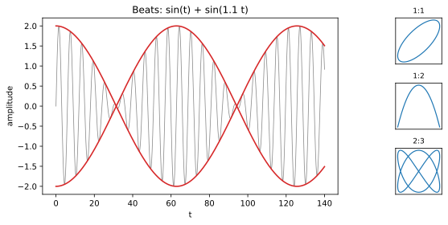

# ch12 — 疊加：兩個波相加還是波嗎？拍頻、Lissajous 與積化和差

> **本章解決什麼問題**：Part IV 到這裡，ch10 把一個波解剖成相量（旋轉箭頭）的影子，ch11 解釋了為什麼 sin′=cos。現在問下一個工程師每天都在碰、卻很少被講清楚的問題：把兩個正弦波加起來，會發生什麼事？答案分兩種情況——**同頻率**相加還是同一個頻率的波（相量加法），**不同頻率**相加則生出拍頻（beats）與 Lissajous 圖形這兩個你聽得見、看得見的現象。本章用 ch04 的和角公式推出積化和差，把這些現象的數學釘死；下一章（ch13）才把「兩三個波」推到「無限多個波」的傅立葉門口。

## 從你已知的出發

你在處理音訊時撞過拍頻，只是當時可能不知道它叫這個名字。兩根吉他弦調得差一點點，撥下去不是兩個音，是**一個音在那裡嗡——嗡——嗡地一脹一縮**。差得越多嗡得越快；調到完全一致，嗡聲就消失了（這就是調音師說的 zero-beat，2026-06 查證）。或者你在監控上疊過兩條週期性曲線——日週期和一個稍微錯開的近日週期——看過它們合成出一條時強時弱的包絡。

還有一個你大概在電子實驗或 demo 裡看過的東西：示波器切到 XY 模式，把兩個訊號分別餵給水平和垂直偏轉，螢幕上不是兩條波，是一個會轉、會打結的封閉圖案。頻率比剛好時它定住不動，比例一偏它就開始慢慢旋轉。那就是 Lissajous 圖形（2026-06 查證）。

這兩個現象——拍頻和 Lissajous——表面上一個是「聽到的」、一個是「看到的」，骨子裡是同一件事：**兩個週期運動疊加**。本章要回答的核心問題只有兩個：

1. **同頻率**兩個波相加，結果是什麼？（會不會跑出新的頻率？）
2. **不同頻率**兩個波相加，結果是什麼？（拍頻和 Lissajous 從哪來？）

而且我要強調一件事，它會貫穿整章：**疊加（superposition）不會無中生有地造出新頻率**。同頻相加只是換振幅換相位、頻率原封不動；異頻相加看起來「冒出了新東西」（拍頻的慢包絡、Lissajous 的封閉圈），但那些新東西的頻率全都是原來兩個頻率的**和與差**，沒有任何一個是憑空長出來的。這個「頻率守恆」的直覺，是擋掉本章一堆錯誤想像的地基。

## 同頻疊加：A sin x + B cos x 還是一個 sin 波

先處理最基本、也最重要的情況：兩個**同頻率**的正弦量相加。最常見的長相是一個 sin 配一個 cos：

```text
A · sin x + B · cos x = ?
```

注意這兩項是同頻率的（都是「x」，不是「2x」或「1.1x」），只是一個是 sin、一個是 cos——而 cos 不過是超前 90° 的 sin（cos x = sin(x+90°)，見 ch10）。所以這其實是「兩個同頻、但相位差 90° 的波相加」。答案是：

```text
A · sin x + B · cos x = √(A²+B²) · sin(x + φ)，  其中 φ = atan2(B, A)
```

**結果還是同一個頻率的 sin 波**，只是振幅變成 √(A²+B²)、整體相位平移了 φ。沒有 2x、沒有任何新頻率冒出來。這是本章「頻率守恆」直覺的第一個、也是最乾淨的證據。

### 為什麼還是同頻：用相量（向量）加法看

光看公式你會覺得這是某條要背的恆等式。它不是。用 ch10 的相量視角，它一秒鐘就變顯然。

回想 ch10：一個正弦波 `A sin(x+φ)` 就是一支長度 A、初始角 φ 的箭頭，以角速度繞圈時投在牆上的影子。現在 `A sin x` 和 `B cos x` 是**兩支以同樣速率旋轉**的箭頭的影子：

- `A sin x` ＝一支長 A、指向「0°」方向（對應 sin 的相位基準）的箭頭。
- `B cos x` ＝一支長 B、指向「90°」方向（cos 超前 90°）的箭頭。

關鍵在這裡：**兩支箭頭以同樣的角速度一起轉**。它們之間的夾角永遠是 90°，不會變。那麼任何時刻，兩支箭頭的影子之和，就等於「先把兩支箭頭頭尾相接成一支合成箭頭，再看那支合成箭頭的影子」——因為投影（取某個方向的分量）是線性運算，影子的和等於和的影子。

於是問題從「兩個波相加」塌縮成「兩支箭頭相加」。兩支夾 90°、長 A 與 B 的箭頭相加，用畢氏定理：合成箭頭長度 √(A²+B²)，方向角 φ = atan2(B, A)（B 是「90° 方向」那支的長度＝縱座標，A 是「0° 方向」那支＝橫座標，所以 atan2 的第一個參數是 B、第二個是 A——順序別顛倒，見 ch14）。而**一支箭頭旋轉的影子，永遠是同頻率的正弦波**。所以結果必然還是同頻 sin 波，振幅 √(A²+B²)、相位 φ。

```text
兩支同速旋轉的箭頭          相加成一支          影子還是同頻 sin
   ↑ B (cos 方向)              ╲                波，振幅 √(A²+B²)
   │                            ╲  長 √(A²+B²)   相位 φ=atan2(B,A)
   └──→ A (sin 方向)             ╲ 角 φ
```

這就是「同頻兩波相加不可能變頻」的根本原因：**兩支轉速相同的箭頭，合成後還是一支轉速相同的箭頭**。轉速＝頻率。頻率不會因為相加而改變。你要記的不是公式，是這張圖。

### Worked example：3 sin x + 4 cos x，一步都不跳

拿一組漂亮的數字落地。取 A=3、B=4：

```text
3 sin x + 4 cos x = R sin(x + φ)
R = √(A²+B²) = √(3²+4²) = √(9+16) = √25 = 5      ← 3-4-5 直角三角形，振幅就是斜邊
φ = atan2(B, A) = atan2(4, 3) ≈ 0.9273 rad ≈ 53.13°
```

所以 `3 sin x + 4 cos x = 5 sin(x + 53.13°)`。

**數值自我複核**。最便宜的檢查是代一個好算的 x。取 x=0：

```text
左邊：3·sin 0 + 4·cos 0 = 3·0 + 4·1 = 4
右邊：5·sin(0 + 53.13°) = 5·sin 53.13° = 5·0.8 = 4      ← sin 53.13°=4/5=0.8（3-4-5 三角形）
```

兩邊都是 4 ✓。再代一個 x=90° 補強信心：

```text
左邊：3·sin 90° + 4·cos 90° = 3·1 + 4·0 = 3
右邊：5·sin(90° + 53.13°) = 5·sin 143.13° = 5·0.6 = 3   ← sin 143.13°=sin(180°−143.13°)=sin 36.87°=3/5
```

也對 ✓。注意 R=5、φ≈53.13° 不是巧合——A=3、B=4 就是 3-4-5 直角三角形的兩股，合成箭頭的長度（斜邊）是 5、它與 sin 方向（x 軸）的夾角就是 atan2(4,3)。那張相量圖直接畫出了這個三角形。

**一個常見的反向陷阱**：如果你把相位寫成 atan2(A, B) 而不是 atan2(B, A)，會算出 φ≈36.87°，代 x=0 得 5·sin 36.87°=5·0.6=3≠4，當場露餡。順序記法：**φ 的 tan 是「cos 係數 ÷ sin 係數」＝B/A**，因為 cos 那支箭頭站在「上方」（90° 方向）、貢獻的是縱座標。

## 積化和差：把「頻率的積」換成「頻率的和差」

同頻講完了，往不同頻率走之前，先補一個工具——它是後面拍頻與 Lissajous 的數學引擎，而且它就是 ch04 和角公式的直系後裔，不是新東西。

### 從和角公式推出來（不背）

ch04 的預告在這裡兌現。把 sin 的和角與差角公式並排：

```text
sin(a + b) = sin a cos b + cos a sin b
sin(a − b) = sin a cos b − cos a sin b
```

兩式相加，右邊的 `cos a sin b` 一正一負抵消，`sin a cos b` 翻倍：

```text
sin(a+b) + sin(a−b) = 2 sin a cos b               ← 積化和差（product-to-sum）
```

兩式相減，則是 `sin a cos b` 抵消、`cos a sin b` 翻倍：

```text
sin(a+b) − sin(a−b) = 2 cos a sin b
```

同樣對 cos 的和角／差角公式做加減，得到另外兩條（cos a cos b 與 sin a sin b 的版本）。這四條合起來就是**積化和差公式**：左邊是兩個三角函數**相乘**，右邊是兩個三角函數**相加（或相減）**。

但拍頻要用的是反過來的方向——**和差化積（sum-to-product）**：給兩個正弦相加，怎麼寫成相乘？把上面那條 `sin(a+b)+sin(a−b)=2 sin a cos b` 換個變數名就好。令 `p = a+b`、`q = a−b`，反解得 `a = (p+q)/2`、`b = (p−q)/2`，代回去：

```text
sin p + sin q = 2 · sin( (p+q)/2 ) · cos( (p−q)/2 )    ← 和差化積（sum-to-product）
```

這條是本章的主角公式。它在說一件意味深長的事：**兩個正弦「相加」，可以改寫成兩個正弦「相乘」**——一個頻率是兩者的平均 (p+q)/2，另一個頻率是兩者差的一半 (p−q)/2。「加」變「乘」，「兩個原頻率」變「平均頻率」與「差頻率」。拍頻的整個現象，就藏在這個改寫裡。

### Worked example：sin 60° + sin 30° 驗證和差化積

用具體角度驗一次，確認公式沒騙人。取 p=60°、q=30°：

```text
左邊：sin 60° + sin 30° = √3/2 + 1/2 = (√3 + 1)/2
```

右邊套和差化積，平均角 (60°+30°)/2 = 45°、差的一半 (60°−30°)/2 = 15°：

```text
右邊：2 · sin 45° · cos 15°
```

兩邊要相等。左邊 (√3+1)/2 ≈ (1.73205+1)/2 ≈ 1.36603。右邊 2·sin45°·cos15° = 2·0.70711·cos15°，cos15° ≈ 0.96593（這是 ch04 算過的 (√6+√2)/4），所以 ≈ 2·0.70711·0.96593 ≈ 1.36603 ✓。兩邊一致。

驗證完成。注意這裡沒有任何「新公式」——它從頭到尾是 ch04 那兩條和角公式相加減而已。本書的招牌姿態：恆等式一律從來源推，不從記憶抄。

## 拍頻：兩個相近頻率相加，慢包絡 × 快載波

現在進入不同頻率的世界。最戲劇化的情況是**兩個頻率非常接近**。

考慮兩個振幅相同、頻率接近的正弦波相加。為了看清楚結構，把它寫成 `sin(2π f₁ t) + sin(2π f₂ t)`，但我們先用簡化記號 `sin(ω₁ t) + sin(ω₂ t)`（ω 是角頻率，見 ch10）。套剛才的和差化積，p=ω₁t、q=ω₂t：

```text
sin(ω₁ t) + sin(ω₂ t) = 2 · cos( (ω₁−ω₂)/2 · t ) · sin( (ω₁+ω₂)/2 · t )
                         └────── 慢包絡 ──────┘   └────── 快載波 ──────┘
```

這個改寫就是拍頻的全部祕密。讀懂這一行的兩個因子：

- **快載波（carrier）**：`sin((ω₁+ω₂)/2 · t)`，頻率是兩者的**平均** (f₁+f₂)/2。因為 f₁、f₂ 很接近，平均值約等於它們本身——你聽到的還是「那個音」。
- **慢包絡（envelope）**：`2 cos((ω₁−ω₂)/2 · t)`，頻率是兩者**差的一半** (f₁−f₂)/2。因為 f₁、f₂ 很接近，這個差很小，所以這個 cos 振得非常慢——它不是音高，是**音量在緩緩地脹大縮小**。

合起來：一個正常音高的快波，被一個慢慢起伏的「音量旋鈕」乘著。這就是你聽到的「嗡——嗡——嗡」：音高沒變（載波），但響度在週期性地脹縮（包絡）。



### 一個容易踩的細節：拍頻 = |f₁−f₂|，不是它的一半

這裡有個非常經典、連教科書都常講錯的陷阱，值得停下來釘清楚。

包絡的數學頻率是 (f₁−f₂)/2——這是那個 cos 真正的振盪頻率。但你**耳朵聽到的拍頻**（每秒幾次「嗡」）是 **|f₁−f₂|**，剛好是包絡頻率的兩倍。

為什麼差一個 2 倍？因為響度跟的是包絡的**絕對值**，不是包絡本身。那個 cos 在一個週期裡會到達正的最大值一次、負的最大值一次。但「音量最大」這件事不分正負——cos 衝到 +最大或 −最大，響度都是峰值（振幅的大小一樣）。所以**一個 cos 週期裡，響度脹到最大兩次**。聽覺上的「嗡」次數因此是包絡頻率的兩倍，等於 |f₁−f₂|（2026-06 查證）。

```text
包絡 cos：  +max ─── 0 ─── −max ─── 0 ─── +max     ← cos 的一個完整週期
響度 |cos|： 峰  ─── 谷 ──  峰  ─── 谷 ──  峰        ← 兩個峰！所以聽到的拍頻是兩倍
```

調音的物理就在這：兩根弦差 f₁−f₂ Hz，你每秒聽到 |f₁−f₂| 次嗡聲。調到兩弦同頻，差為 0，包絡變成不會動的常數（cos(0)=1），嗡聲消失——zero-beat（2026-06 查證）。吉他、鋼琴調音師靠的就是「把拍頻調到聽不見」，比盯著調音器的數字更靈敏，因為人耳對「每秒一兩次的脹縮」異常敏感。

**自我察覺術**：如果有人告訴你「拍頻就是包絡那個 cos 的頻率」，請反問他絕對值的事。包絡 cos 的頻率（(f₁−f₂)/2）和你聽到的拍頻（|f₁−f₂|）差兩倍——兩個都對，但講的是不同的東西，混在一起就會算錯一半。

### Worked example：sin x + sin(1.1x) 的拍頻

把抽象的 ω 換成具體數字。考慮 `sin x + sin(1.1x)`（兩個角頻率 1 與 1.1，差得很小）。套和差化積，p=x、q=1.1x：

```text
sin x + sin(1.1x) = 2 · cos( (1 − 1.1)/2 · x ) · sin( (1 + 1.1)/2 · x )
                  = 2 · cos( −0.05 x ) · sin( 1.05 x )
                  = 2 · cos( 0.05 x ) · sin( 1.05 x )            ← cos 是偶函數，負號可丟
```

- **載波**頻率（角頻率）1.05——介於 1 和 1.1 之間的平均，幾乎就是原來的音高。
- **包絡** `2 cos(0.05 x)`——角頻率 0.05，振得極慢（週期 2π/0.05 ≈ 126，比載波週期 2π/1.05 ≈ 6 長二十幾倍）。

**聽到的拍頻**＝|1 − 1.1|＝0.1（角頻率），是包絡角頻率 0.05 的兩倍，如上一節所說。

**數值自我複核**。隨便取 x=2，兩邊各算一次：

```text
左邊：sin 2 + sin 2.2 ≈ 0.90930 + 0.80850 ≈ 1.71779
右邊：2·cos(0.1)·sin(2.1) ≈ 2·0.99500·0.86321 ≈ 1.71779    ✓
```

兩邊到小數第五位都一致。改寫沒有改變任何值——它只是把「兩個波相加」這個你看不出結構的式子，翻譯成「慢包絡 × 快載波」這個一眼看穿的式子。圖的左 panel 畫的就是這個：細線是合成波，粗線是 ±2cos(0.05x) 的包絡，你會看到快波被慢慢起伏的包絡「框」住。

**頻率守恆對帳**：拍頻看起來「冒出了一個新的慢頻率」(0.05 或聽到的 0.1)，但它不是憑空來的——它就是原來兩個頻率的**差**。載波 1.05 是兩者的**和的一半**。一切都是原頻率的和與差，沒有真正的新頻率。這正是本章開頭那句話的兌現。

## Lissajous：兩個垂直方向的波，畫出封閉的圖案

拍頻是把兩個波「相加」（同一個方向、疊在一起）。如果改成讓兩個波**垂直**地各管一個座標軸呢？

```text
x(t) = sin(a · t)
y(t) = sin(b · t + δ)
```

橫座標被一個頻率 a 的波控制、縱座標被另一個頻率 b 的波控制（δ 是兩者的相位差）。隨著時間 t 推進，點 (x(t), y(t)) 在平面上畫出一條軌跡——這就是 **Lissajous 圖形**（Lissajous curve），又稱 Bowditch 曲線。這正是示波器 XY 模式做的事：把一個訊號接水平偏轉、另一個接垂直偏轉，螢幕上的光點就描出這條曲線（2026-06 查證）。

### 為什麼有理頻率比 ⇒ 封閉曲線

整條曲線會不會「畫回起點、封閉起來」，取決於一件事：**頻率比 a/b 是不是有理數**（2026-06 查證）。

直覺是這樣。x 方向的波每隔週期 Tₓ = 2π/a 回到原狀，y 方向的波每隔 Tᵧ = 2π/b 回到原狀。整個圖案要完全重複（軌跡封閉），必須**兩個波同時回到起始狀態**——也就是要找到一個共同週期 T，讓 T 同時是 Tₓ 和 Tᵧ 的整數倍。這種共同週期存在的充要條件，就是 Tₓ/Tᵧ = b/a 是有理數。

- **有理比**（如 1:1、1:2、2:3）：共同週期存在，點跑完一個共同週期就回到起點，軌跡封閉成一個定住的圖案。
- **無理比**（如 1:√2）：永遠找不到共同週期，軌跡永遠不重複、把整個方框慢慢填滿，看起來像在緩緩旋轉、永不封閉（2026-06 查證）。

這跟 ch09 單位根「把圓等分」是同一種有理數魔法的不同面孔：有理數帶來「整數次之後回到原點」的封閉性。

### 三個基準比例，逐一看懂

圖的右側三個 panel 就是這三個基準比例（與基準表一致）：

**1:1（a=b）**——同頻率。這時 x 和 y 是同頻的兩個正弦，相位差 δ 決定形狀：

```text
δ = 0     ：x=sin t, y=sin t  ⇒  y=x，一條 45° 斜線
δ = π/2   ：x=sin t, y=sin(t+π/2)=cos t  ⇒  x²+y²=1，一個正圓
0<δ<π/2   ：介於兩者之間，一個傾斜的橢圓
```

這呼應了 ch10：同頻不同相的兩個波，相位差從 0 到 90° 之間掃過，圖形從「線」開到「圓」。示波器 XY 模式量相位差，靠的就是看這個橢圓胖到什麼程度（2026-06 查證）。本書圖裡這個 panel 用 δ=π/4，畫出介於線與圓之間的傾斜橢圓。

**1:2（b=2a）**——y 的頻率是 x 的兩倍。x 走完一個來回，y 已經走完兩個，軌跡打一個結，呈現「橫躺的 8 字」或拋物線狀的弓形（依 δ 而定）。橫向看到 1 個來回、縱向 2 個，比例就是 1:2——這正是示波器數「水平峰數 : 垂直峰數」讀出頻率比的方法（2026-06 查證）。

**2:3（a:b=2:3）**——更複雜的封閉結，橫向 2 個瓣、縱向 3 個瓣。比例 2:3 是有理數，所以它仍然封閉。它的共同週期：x 的週期 2π/2=π、y 的週期 2π/3，最小公倍週期是 2π（x 跑 2 圈、y 跑 3 圈後同時回到起點），所以軌跡每 2π 重複一次、封閉。

### 一句話的史實

Lissajous 圖形最早由美國的 Nathaniel Bowditch（鮑迪奇）於 **1815 年**研究（所以又叫 Bowditch 曲線），後來由法國的 Jules Antoine Lissajous（李薩如，1822–1880）於 **1857 年**用光學鏡面實驗更詳細地研究、並以他命名（2026-06 查證，依 landscape）。它是「兩個垂直的週期運動疊加 → 圖形」最漂亮的教具，恰好呼應本書的週期性主題：你把兩支不同轉速的旋轉箭頭分別投影到兩個軸上，它們合奏出的就是這些封閉的結。

## 直覺的陷阱

疊加這個主題的錯誤直覺，幾乎全都圍繞著一件事：**以為相加會生出新頻率，或搞混「哪個頻率是哪個」**。

| 陷阱 | 錯誤直覺長什麼樣 | 在哪一步把你帶溝裡 | 怎麼自我察覺 |
|---|---|---|---|
| 同頻相加會變頻 | 以為 `sin x + cos x` 裡會跑出 2x 之類的東西 | 把「相加」誤當「相乘」（相乘才生和差頻） | 用相量看：兩支同速箭頭相加還是一支同速箭頭，頻率＝轉速，不變 |
| 相位順序顛倒 | 寫成 `φ = atan2(A, B)`（sin 係數在前） | 沒記住「cos 係數對應縱座標、在第一個參數」 | 代 x=0 驗：左邊＝B（cos 那項），對不上就是順序錯了 |
| 拍頻 = 包絡頻率 | 以為聽到的「嗡」次數＝包絡 cos 的頻率 | 漏了「響度跟的是絕對值，一個 cos 週期有兩個峰」 | 拍頻＝\|f₁−f₂\|，是包絡頻率 (f₁−f₂)/2 的兩倍；兩弦差 3Hz 每秒嗡 3 次不是 1.5 次 |
| 不同頻率可以直接相位相加 | 把兩個不同頻的波當成「一個波相位平移」 | 同頻才有「合成成單一相位」這回事 | 不同頻的兩波合成不是正弦波（是拍頻/週期性波形），根本沒有單一相位可言 |
| 無理比的 Lissajous「也會封閉，只是要等」 | 以為跑久一點總會接回起點 | 把「填滿」誤當「封閉」 | 無理比永遠找不到共同週期，軌跡稠密填滿方框、永不重複 |
| 把「加」和「乘」的頻率效果搞混 | 以為調變（相乘）和疊加（相加）一樣 | 相加＝頻率不變地共存；相乘＝生出和頻與差頻 | 拍頻的「乘法形式」是改寫出來的；真正餵進去的是兩個波**相加** |

最後一行值得多說一句，因為它是本章最深的一個點。`sin(ω₁t)+sin(ω₂t)`（相加）和 `cos(ω_m t)·sin(ω_c t)`（相乘，調變）長得幾乎一樣——和差化積就是把前者改寫成後者。差別在於「物理上發生的是什麼」：拍頻是兩個波在空氣裡**疊加**（線性、各走各的），只是我們的耳朵把它**詮釋**成「一個被音量旋鈕乘著的載波」。而真正的振幅調變（AM 收音機）是電路裡實際做了**乘法**。數學上同一條恆等式連接兩者，物理上是兩件事——這個「同一個式子、兩種身世」的區分，是訊號工程的反覆出現的主題（調變理論不在本書範圍，一句話帶過）。

## 紙上推演

### 推演題

**題 1（把和寫成包絡×載波，並讀出拍頻）** **[15 分鐘] ★★**
把 `sin x + sin(1.2x)` 用和差化積寫成「慢包絡 × 快載波」的形式。寫出載波頻率、包絡頻率，以及**聽到的拍頻**是多少。比起本章的 `sin(1.1x)` 例子，這次嗡得更快還是更慢？

**題 2（用相量解釋「同頻相加不可能變高頻」）** **[10 分鐘] ★**
不准用公式，只用相量（旋轉箭頭）的圖像，向另一個工程師口頭解釋：為什麼把兩個同頻率的正弦波相加，結果不可能是一個更高頻的波？（提示：轉速＝頻率。）

**題 3（判斷 3:2 的 Lissajous 是否封閉並說週期）** **[15 分鐘] ★★**
給 `x(t)=sin(3t)`、`y(t)=sin(2t)`（頻率比 3:2）。判斷它的軌跡是否封閉；若封閉，求出最小的共同週期 T（讓 x、y 同時回到起始狀態的最小 T），並說 x、y 在這段 T 內各轉了幾圈。

**題 4（相位合成的順序，自己踩一次陷阱再爬出來）** **[10 分鐘] ★★**
把 `5 sin x + 12 cos x` 寫成 `R sin(x+φ)`。算出 R 和 φ。然後故意用錯誤的 `φ=atan2(5,12)` 算一次，代 x=0 驗證，說清楚錯在哪、為什麼。

### 推演解答

**題 1。** 套和差化積 `sin p + sin q = 2 sin((p+q)/2) cos((p−q)/2)`，p=x、q=1.2x：

```text
sin x + sin(1.2x) = 2 · cos( (1−1.2)/2 · x ) · sin( (1+1.2)/2 · x )
                  = 2 · cos(0.1 x) · sin(1.1 x)            ← cos 偶函數，−0.1 的負號丟掉
```

載波角頻率 1.1（兩者平均），包絡角頻率 0.1。**聽到的拍頻**＝|1 − 1.2|＝0.2（角頻率），是包絡頻率 0.1 的兩倍。比起 `sin(1.1x)` 那個例子（拍頻 0.1），這次兩頻率差更大（0.2 vs 0.1），所以**嗡得更快**——拍頻正比於兩頻率的差距。這跟調音直覺一致：兩弦差越多，嗡聲越急。

**題 2。** 模範口述要點：「一個正弦波就是一支以某個轉速旋轉的箭頭，它的影子。兩個同頻率的波，就是兩支**轉速相同**的箭頭。任何時刻把兩支箭頭頭尾相接，得到一支合成箭頭——而因為兩支都以同一轉速轉，合成箭頭也以同一轉速轉（它們的相對角度永遠固定，整體一起轉）。一支以某轉速旋轉的箭頭，影子就是那個轉速對應的正弦波。轉速就是頻率，沒變過，所以合成波的頻率跟原來一樣，只是振幅（合成箭頭的長度）和相位（合成箭頭的角度）變了。要生出更高頻，得讓某支箭頭轉得更快，但相加不會改變任何一支的轉速。」能講到「轉速＝頻率、相加不改轉速」就過關。

**題 3。** x(t)=sin(3t) 的週期 Tₓ=2π/3；y(t)=sin(2t) 的週期 Tᵧ=2π/2=π。頻率比 3:2 是有理數，所以**封閉**。最小共同週期 T 要同時是 Tₓ 和 Tᵧ 的整數倍：

```text
T = m · (2π/3) = n · π     找最小的正整數 m, n
m·(2π/3) = n·π  ⇒  2m/3 = n  ⇒  2m = 3n
最小整數解：m=3, n=2  ⇒  T = 3·(2π/3) = 2π
```

所以 T=2π。在這段時間內，x 走了 T/Tₓ = 2π/(2π/3) = **3 圈**，y 走了 T/Tᵧ = 2π/π = **2 圈**。x 轉 3 圈、y 轉 2 圈後兩者同時回到起點，軌跡封閉、每 2π 重複一次。（注意頻率比 3:2 對應「x 轉 3 圈、y 轉 2 圈」——圈數比＝頻率比，符合直覺。）

**題 4。** 正確算法，A=5（sin 係數）、B=12（cos 係數）：

```text
R = √(5²+12²) = √(25+144) = √169 = 13           ← 5-12-13 直角三角形
φ = atan2(B, A) = atan2(12, 5) ≈ 67.38°
```

所以 `5 sin x + 12 cos x = 13 sin(x + 67.38°)`。驗證 x=0：左邊＝5·0+12·1=12，右邊＝13·sin 67.38°=13·(12/13)=12 ✓。

**故意踩陷阱**：若用 `φ=atan2(5, 12)≈22.62°`，代 x=0 得右邊＝13·sin 22.62°=13·(5/13)=5≠12 ✗。錯在順序：atan2 的第一個參數該是「cos 那一項的係數 B」（它貢獻縱座標），第二個才是「sin 那一項的係數 A」（橫座標）。把 5 和 12 對調，等於把相量畫到錯誤的角度，整個相位就歪了 (67.38°→22.62°，恰好是互餘角——因為兩股對調)。記法：**φ 量的是合成箭頭離 sin 方向（x 軸）多遠，而 cos 係數站在 y 軸上**，所以 cos 係數 B 進 atan2 的第一格。

### 動手生圖

本章的圖就是這段 Python 小實驗。它一次畫出本章兩個主題：左 panel 是 `sin(ω₁t)+sin(ω₂t)` 的拍頻波形，連慢包絡一起畫出來；右側三個小 panel 是頻率比 1:1、1:2、2:3 的 Lissajous 圖形。

```python
# ch12 figure: left = beats waveform with slow envelope; right = three Lissajous panels (1:1, 1:2, 2:3)
from pathlib import Path
import numpy as np
import matplotlib
matplotlib.use("Agg")          # headless; no display needed
import matplotlib.pyplot as plt

OUT = Path(__file__).resolve().parent / "out" / "ch12-beats-lissajous.svg"
OUT.parent.mkdir(parents=True, exist_ok=True)

fig = plt.figure(figsize=(10, 4))

# --- left (spans both rows): beats = sin(w1 t) + sin(w2 t), with slow envelope ---
axL = fig.add_subplot(1, 2, 1)
w1, w2 = 1.0, 1.1                                     # two close angular frequencies
t = np.linspace(0, 140, 4000)
axL.plot(t, np.sin(w1 * t) + np.sin(w2 * t), color="0.55", lw=0.8)  # superposed wave
env = 2 * np.cos((w1 - w2) / 2 * t)                  # slow envelope +-2 cos((w1-w2)t/2)
axL.plot(t, env, color="C3", lw=1.6); axL.plot(t, -env, color="C3", lw=1.6)
axL.set_title("Beats: sin(t) + sin(1.1 t)")
axL.set_xlabel("t"); axL.set_ylabel("amplitude")

# --- right column: three Lissajous panels x=sin(a t), y=sin(b t + delta) ---
ratios = [(1, 1, np.pi / 4), (1, 2, np.pi / 2), (2, 3, np.pi / 2)]
tt = np.linspace(0, 2 * np.pi, 2000)
for k, (a, b, d) in enumerate(ratios):
    ax = fig.add_subplot(3, 2, 2 * k + 2)            # right column, three stacked rows
    ax.plot(np.sin(a * tt), np.sin(b * tt + d), color="C0", lw=1.2)
    ax.set_title(f"{a}:{b}", fontsize=9)
    ax.set_aspect("equal"); ax.set_xticks([]); ax.set_yticks([])

fig.tight_layout()
fig.savefig(OUT, bbox_inches="tight")
print("wrote", OUT)            # build_figures.py reads this
```

**預期輸出**：終端機印出 `wrote .../figures/out/ch12-beats-lissajous.svg`。左半張圖是一條快速振盪的灰色合成波，被一對紅色的慢包絡曲線（±2cos(0.05t)）上下框住——你會看到合成波在包絡的「腰」處（包絡過零）幾乎歸零、在包絡的「肚」處振幅最大，這就是一脹一縮的拍頻。右半張是三個小方塊：1:1 是一個傾斜橢圓（相位差 π/4）、1:2 是橫躺的弓形/8 字、2:3 是更複雜的封閉結；三條都封閉，因為比例都是有理數。

**改參數看什麼**：
- 把 `w2 = 1.1` 改成 `1.05`，兩頻率更接近——包絡振得更慢、拍頻更低（每秒嗡更少次），合成波被框得更「長」。改成 `1.3` 則拍頻變快、結構變密。親眼看「拍頻正比於頻率差」。
- 右側某個 panel 的 δ 改一改：把 1:1 那組的 `np.pi/4` 換成 `0`（變成一條斜線）、再換成 `np.pi/2`（變成正圓）——同頻不同相，圖形從線開到圓，正是示波器量相位差的原理。
- 在 `ratios` 裡把某個比例換成無理比，例如 `(1, np.sqrt(2), 0)`，跑出來的軌跡**不封閉**、會把整個方框慢慢填滿——對照有理比的乾淨封閉，直接看見「有理⇒封閉」這條規則。（這時 `set_title` 會印出 `1:1.41…`，提醒你比例不是整數。）

## 自我檢核

口頭自答，講得出來才算過關：

1. 為什麼 `A sin x + B cos x` 相加之後**還是同一個頻率**的 sin 波？用相量（旋轉箭頭）一句話講出根本原因（兩支同速箭頭相加還是一支同速箭頭）。
2. `A sin x + B cos x = √(A²+B²) sin(x+φ)` 裡的 √(A²+B²) 和 φ=atan2(B,A) 各自是相量圖上的什麼？為什麼是 atan2(B,A) 而不是 atan2(A,B)？
3. 積化和差是從哪條公式推出來的？（不准說「背的」——說出它是 ch04 和角公式相加減的後裔。）
4. 拍頻現象裡的「慢包絡」和「快載波」頻率各是原來兩頻率的什麼組合？為什麼**聽到的**拍頻是包絡頻率的兩倍？
5. 兩根吉他弦調到「嗡聲消失」代表什麼？（拍頻＝0＝兩頻率相等＝包絡變成不動的常數。）
6. Lissajous 圖形封閉的條件是什麼？為什麼有理頻率比會封閉、無理比不會？
7. 1:1 的 Lissajous 在相位差 δ=0 和 δ=π/2 時分別是什麼形狀？這跟 ch10 的相位差有什麼關係？
8. 本章反覆強調「疊加不會無中生有造出新頻率」。拍頻看起來「冒出了慢頻率」，這個慢頻率其實是哪兩個頻率的什麼運算？（差。載波是和的一半。一切都是原頻率的和與差。）

## 延伸閱讀

- **3Blue1Brown，「But what is a Fourier series? From heat flow to circle drawings」**（DE 系列，2019-06-30，約 25 分）。雖然主題是傅立葉（ch13），但前半把「多個旋轉箭頭疊加」講得極清楚，正是本章「同速箭頭相加」往「多個圓疊加」的橋。看 0–8 分鐘那段的相量加法直覺。https://www.3blue1brown.com/lessons/fourier-series/
- **Wikipedia，「Beat (acoustics)」**。把拍頻＝|f₁−f₂| 與包絡頻率 (f₁−f₂)/2 的「差兩倍」講清楚的標準參考；想釘死本章那個絕對值陷阱，讀它的數學推導一節。https://en.wikipedia.org/wiki/Beat_(acoustics)
- **Wikipedia，「Lissajous curve」**。各種頻率比與相位差的圖形總覽、封閉條件、Bowditch/Lissajous 史實；想多看幾個比例（3:4、5:4…）的封閉結，看它的圖庫。https://en.wikipedia.org/wiki/Lissajous_curve
- **示波器 XY 模式的 Lissajous 應用**（Test & Measurement Tips，「Lissajous patterns: using a scope for display signals」）。從工程量測角度看怎麼用 Lissajous 讀頻率比與相位差，配本章「示波器」那一段。https://www.testandmeasurementtips.com/using-scope-display-lissajous-patterns/
- 往前一步：本章是「兩三個波」，ch13 把它推到「無限多個波」——任何週期訊號＝一堆不同頻率的正弦疊起來（傅立葉）。本章的相量加法直覺，到那裡會變成「一堆圓的大合奏」。
