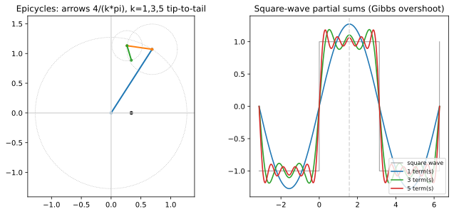

# ch13 — 傅立葉的門口：把任意週期訊號拆成旋轉的圓

> **本章解決什麼問題**：ch10 把一個正弦波看成一支旋轉箭頭（相量）的影子，ch12 把兩三支箭頭加起來看出拍頻與 Lissajous。本章把這件事推到極限：**任何**週期訊號，都等於一堆不同半徑、不同轉速的旋轉箭頭首尾相接、末端掃出來的曲線——這就是傅立葉（Fourier）。本章只負責回答「為什麼正弦是對的基底」這一側：靠的是**正交性**（orthogonality），也就是「不同頻率互不干擾、各自結帳」，而 ch06 的點積在這裡升級成函數的內積、積分變成「探測某個頻率有多少」的探測器。至於「這個無窮和『等於』原訊號是什麼意思、什麼時候真的收斂」——那是嚴格分析的活，本章把它交給姊妹書《馴服無限》ch11，我們只站到門口為止。一句話主題：傅立葉不是新魔法，是 ch10 那支旋轉箭頭的大合奏。

## 從你已知的出發

你看過頻譜圖。把一段監控曲線丟進去，它告訴你「這條線裡有一個 24 小時的週期成分、一個 7 天的週期成分、還有一坨高頻雜訊」。你也用過音訊 EQ：把一首歌拆成低頻、中頻、高頻幾條軌，分別拉動。JPEG 壓縮在做的事更狠——它把一張圖切成 8×8 的小方塊，每塊拆成一堆「不同粗細的條紋」（不同頻率的餘弦），然後把人眼看不太出來的高頻條紋係數直接丟掉或粗量化，檔案就小了。MP3 同理，丟掉你聽不到的頻率。

這些東西的共同骨架只有一句話：**把一個訊號拆成一堆不同頻率的成分，分開處理，再（需要時）加回去**。你天天在用這個骨架，但大概沒停下來問過兩個問題：

1. 為什麼「一堆正弦波相加」就能拼出**任意**形狀？一條方方正正、帶垂直跳變的方波，憑什麼能用一堆圓滑的 sin 湊出來？
2. 頻譜圖怎麼知道「這裡有多少 24 小時成分」？它怎麼把混在一起的頻率**一個一個分離**出來、互不干擾？

第一個問題是「正弦是不是夠用的基底」，第二個問題是「怎麼把係數一個個量出來」。本章告訴你：這兩個問題的答案是同一件事——**正交性**。而正交你已經很熟了，它就是 ch06 的「點積為零＝垂直＝不相關」，只是這次「向量」換成了「函數」，「點積」換成了「積分」。頻譜圖那個「分離各頻率」的能力，本質上就是 ch06 你算 cosine similarity 時做的同一件事：投影。

## 主張：任何週期訊號 = 一堆旋轉的圓疊起來

先把主張講清楚，再講為什麼可行。

傅立葉的主張是：一個週期為 2π 的函數 `f(x)`（你可以想成「轉一圈就重複」的訊號），可以寫成一堆正弦與餘弦的和：

```text
f(x) = a₀/2 + (a₁cos x + b₁sin x)
            + (a₂cos 2x + b₂sin 2x)
            + (a₃cos 3x + b₃sin 3x) + …      ← 頻率 1,2,3,… 的成分各佔多少
```

每一個 `cos(nx)`、`sin(nx)` 是一個**諧波（harmonic）**：頻率是基頻的 n 倍。`a₀/2` 是直流項（平均值）。整個展開叫**傅立葉級數（Fourier series）**。係數 `aₙ`、`bₙ` 就是「第 n 個頻率在這個訊號裡佔多少分量」——這正是頻譜圖那一根根長條的高度。

### 旋轉的圓：epicycles（本輪）視角

正弦餘弦的寫法是給代數用的。要看見它，回到 ch10：`cos(nx)` 與 `sin(nx)` 是同一支東西的實部與虛部——一支以角速度 n 旋轉的單位箭頭 `e^{inx}=cos(nx)+i·sin(nx)`（ch08 的 Euler 公式）。所以傅立葉級數還有一個更漂亮的寫法：

```text
f(x) = Σ cₙ·e^{inx}     n 從 −∞ 到 +∞，cₙ 是複數係數
```

`cₙ·e^{inx}` 是什麼？是一支**半徑 |cₙ|、初始角 arg cₙ、以角速度 n 旋轉**的箭頭（ch10 的相量）。把這些箭頭**首尾相接**：第一支從原點出發、轉速 0（不動，就是平均位置）；接上第二支轉速 1 的箭頭；它的尖端再接一支轉速 2 的；再接轉速 3 的……每一支用自己的速度繞著前一支的尖端轉。整串箭頭最末端那一點，隨著時間 x 推進，會在平面上**畫出一條曲線**——而你可以調每支箭頭的半徑與初始角，讓這條曲線變成**任何**你要的週期形狀。

這就是 epicycles（本輪）：一個圓繞著另一個圓的尖端轉，層層相疊。3Blue1Brown 那支著名的影片（DE 系列，2019-06-30，下見延伸閱讀）就是用幾十支這樣的箭頭，把自己的 logo、甚至一行手寫字「畫」了出來——那不是特效，是傅立葉級數逐項加起來的真實樣子。

> **這裡了不起在哪**（要能用自己的話轉述）：ch10 你接受了「一支旋轉箭頭的影子＝一個正弦波」。ch13 只多說一句：把**很多支**不同轉速的箭頭首尾接起來，它們末端的合成軌跡可以是**任意**週期曲線。所以「波是旋轉的影子」這個 ch01 就埋下的隱喻，在這裡長成了完整的定理：週期世界裡的一切——方波、鋸齒波、你的監控曲線、一段語音——都是「一堆圓以整數倍轉速一起轉」的合奏。傅立葉沒有發明新東西，他發現了：旋轉的圓是週期世界的**樂高積木**，而且這套積木什麼都拼得出來。

但「什麼都拼得出來」是個很大的宣稱。憑什麼？而且就算拼得出來，我**怎麼知道**每支箭頭該多長、初始角多少？這兩個問題的鑰匙都是下一節。

## 正交性：每個頻率「各自結帳」

回到 ch06。兩個向量 `a`、`b`，點積 `a·b=|a||b|cosθ`。當它們垂直時 `cosθ=0`，點積為零，我們叫它們**正交**。正交的好處你在 ch06 末尾就埋過伏筆：**正交基底讓每個座標可以各自獨立算**——要知道一個向量在 x 方向的分量，就把它和 x 方向的單位向量做點積，y 方向的存在完全不干擾這個結果，因為 x⊥y、點積為零。

傅立葉的全部祕密，就是把這件事原封不動搬到函數上。

### 函數也能做點積：把求和換成積分

ch06 的點積，兩個向量 `a=(a₁,a₂,…,aₙ)`、`b=(b₁,b₂,…,bₙ)`，是「對應分量相乘再相加」：`a·b=Σ aᵢbᵢ`。

一個函數 `f(x)` 是什麼？把它想成一個「分量無限多」的向量：每一個 x 值就是一個座標軸，`f(x)` 是它在那個軸上的分量。那兩個函數 `f`、`g` 的「點積」自然就是「對應分量相乘再相加」——只是分量是連續的，求和變成積分：

```text
向量點積:   a·b = Σ aᵢ·bᵢ              ← 離散，有限個分量相乘相加
函數內積: ⟨f,g⟩ = ∫ f(x)·g(x) dx        ← 連續，積分就是「連續版的相加」
```

這就是**函數內積（inner product）**。積分號在這裡的角色，和 ch06 的求和號 Σ 一模一樣：它把「每一點上 f 和 g 對齊的程度」全部累加起來，得到一個數，量「f 和 g 整體有多像、多對齊」。（積分當「連續的加總」這個直覺，也是《馴服無限》ch07 的主場，可對照。）

### 關鍵事實：不同頻率的正弦互相正交

現在算一個積分。取兩個不同頻率的正弦 `sin(mx)`、`sin(nx)`（m≠n），在一個完整週期 `−π` 到 `π` 上做內積：

```text
⟨sin(mx), sin(nx)⟩ = ∫₋π^π sin(mx)·sin(nx) dx = 0      （當 m ≠ n）
```

**這個積分是零。** 不同頻率的正弦波，在函數內積的意義下，是**垂直的**。

為什麼是零？用 ch12 的積化和差（積→和），它本身來自 ch04 的和角公式——全書一以貫之，恆等式都有來源：

```text
sin(mx)·sin(nx) = ½[cos((m−n)x) − cos((m+n)x)]     ← 積化和差
```

兩個 cos 在一個完整週期上積分，各自都是零（一個完整週期裡 cos 的正負面積剛好抵消，前提 m≠n 所以兩個頻率 m−n、m+n 都非零）。所以整個積分是零。直覺版：兩個不同頻率的波，在一個週期裡「同號」和「異號」的時間剛好一樣多，乘積的正負面積互相抵消——它們**互不相關**，就像 ch06 兩個垂直向量點積為零。

而當 m=n（同一個頻率和自己做內積），抵消不發生，積分是個正數：

```text
⟨sin(nx), sin(nx)⟩ = ∫₋π^π sin²(nx) dx = π          （非零！這是它的「長度平方」）
```

我用數值積分複核過這三件事（2026-06）：`∫sin(2x)sin(3x)dx=0`、`∫cos(2x)sin(3x)dx=0`（cos 和 sin 也彼此正交）、`∫sin²(3x)dx=π`。全套正弦餘弦 `{1, cos x, sin x, cos 2x, sin 2x, …}` 構成一組**正交基底**：任兩個不同的成員內積為零，每個成員和自己內積是個固定正數。

### 探測器：用積分把每個係數單獨「測」出來

有了正交，第二個問題（怎麼知道每支箭頭多長）瞬間解決。這正是頻譜圖分離頻率的機制。

假設 `f(x)=Σ bₖ sin(kx)`（先只看正弦項，方波就是這種）。我想知道**第 n 個係數 `bₙ`**——也就是「`sin(nx)` 這個頻率在 f 裡佔多少」。怎麼把它從一大堆其他頻率裡單獨撈出來？

把 `f` 和 `sin(nx)` 做內積（＝拿 `sin(nx)` 當「探測器」去探 f）：

```text
⟨f, sin(nx)⟩ = ⟨Σ bₖ sin(kx), sin(nx)⟩
             = Σ bₖ·⟨sin(kx), sin(nx)⟩       ← 內積可以拆進求和
```

現在看右邊那個內積 `⟨sin(kx), sin(nx)⟩`：除了 k=n 那一項，**其他全是零**（正交！）。只有 k=n 活下來，值是 π。所以整串求和坍縮成單獨一項：

```text
⟨f, sin(nx)⟩ = bₙ · π        ⇒    bₙ = (1/π)·∫₋π^π f(x)·sin(nx) dx
```

**第 n 個係數，就是 f 對 `sin(nx)` 的投影**（除以歸一化常數 π）。每個頻率的係數可以**單獨**算出來，因為其他頻率在這個積分裡全被正交性抵消掉了——它們對 `bₙ` 沒有一毛錢的貢獻。

這就是「各自結帳」：你想結算第 n 個頻率的帳，把帳本（f）和第 n 個頻率的探測器（sin(nx)）做內積，所有其他頻率因為和它正交，帳目自動歸零、互不干擾。頻譜圖的每一根長條，就是 f 對那個頻率做一次這樣的內積測出來的高度。積分在這裡扮演的角色，和 ch06 的點積一字不差：**投影**。

> **這裡了不起在哪**（第二個，要能轉述）：正交性把一個看似不可能的問題——「在無窮多個混在一起的頻率裡，單獨量出某一個的分量」——變成一次積分。沒有正交，你得解一個無窮維的聯立方程組（每個係數都和其他所有係數糾纏）；有了正交，每個係數**互不相干、各自一條積分搞定**。這就是為什麼是「正弦」這組基底特別好用：不是因為正弦長得漂亮，是因為它們**彼此垂直**，垂直讓分解變成投影。任何一組正交基底都有這個性質（JPEG 用的離散餘弦、小波都是），正弦只是其中最自然的一組——因為它們是旋轉的影子（ch10），而旋轉是週期世界的母題。

## Worked example：方波，用探測器算出它的傅立葉係數

把上面的機器開到一個具體訊號上：**方波（square wave）**。振幅 1 的方波，在 `(0, π)` 上是 +1、在 `(−π, 0)` 上是 −1，週期 2π。它是奇函數（對原點對稱），所以餘弦項（偶函數）全為零，只剩正弦。

### 用探測器算 sin x 的係數

拿 `sin x`（n=1）當探測器去探方波，算 `b₁=(1/π)∫₋π^π f(x)sin x dx`。f 是奇函數、sin x 是奇函數，乘積是偶函數，所以可以只算右半邊 `(0,π)` 再乘 2；在 `(0,π)` 上 f=+1：

```text
b₁ = (1/π)·∫₋π^π f(x)·sin x dx
   = (1/π)·2·∫₀^π (1)·sin x dx        ← 偶函數，右半乘 2；右半 f=+1
   = (2/π)·[−cos x]₀^π
   = (2/π)·(−cos π + cos 0)
   = (2/π)·(−(−1) + 1)
   = (2/π)·2 = 4/π                     ← 第一個係數
```

`b₁=4/π≈1.27324`。同樣方法（探測器換成 sin(nx)）算下去，會發現偶數諧波全為零，奇數諧波 `bₙ=4/(nπ)`。我數值複核過（2026-06）：探測器內積除以 π 得到 `b₁=1.27324`、`b₃=0.42441`、`b₅=0.25465`，正好就是 `4/(1π)`、`4/(3π)`、`4/(5π)`。於是：

```text
方波(振幅1) = (4/π)·(sin x + sin 3x/3 + sin 5x/5 + sin 7x/7 + …)
            （只有奇次諧波；係數 4/(nπ) 隨頻率衰減）
```

這就是基準表釘死的方波展開。注意係數隨 n 衰減（4/π、4/3π、4/5π…），所以低頻是骨架、高頻是細節——這正是 JPEG 敢丟高頻的理由。

### 部分和在 x=π/2：盯著 Gibbs 過衝冒出來

方波在 `x=π/2`（右半段正中間）的真值是 **+1**。看部分和一項一項加上去，在這一點上逼近 1 的過程。`x=π/2` 時 `sin(π/2)=1`、`sin(3π/2)=−1`、`sin(5π/2)=+1`，所以：

```text
1 項 (只 sin x):        (4/π)·1                = 4/π        ≈ 1.27324
2 項 (加 sin3x/3):      (4/π)·(1 − 1/3)        = 8/(3π)     ≈ 0.84883
3 項 (加 sin5x/5):      (4/π)·(1 − 1/3 + 1/5)  = 52/(15π)   ≈ 1.10347
```

我把這三個數重算了三遍：`4/π=1.27324`；減掉 `4/(3π)=0.42441` 得 `0.84883`；再加 `4/(5π)=0.25465` 得 **1.10347**（也等於 `(4/π)(13/15)`、等於 `52/(15π)`，三種寫法同值——這是與姊妹書《馴服無限》ch11 釘死的同一個錨點，務必是 1.10347，不是別的數）。

看出問題了嗎？真值是 1，但部分和**衝過頭**了：一項時 1.27324（超過 1 太多）、兩項時 0.84883（不及）、三項時 1.10347（又超過，但比一項時近一點）。它在 1 的上下來回震盪，逐漸收窄逼近。但這裡藏著傅立葉最有名的一根刺——

### Gibbs 過衝：壓不掉的耳朵

在方波的**跳變點**（x=0、x=π 這些 +1 突降到 −1 的地方）旁邊，部分和會固執地**過衝（overshoot）**：衝出一個小尖角，超過方波的平頂。你以為「項數加得夠多就能壓平」——錯了。多加項，這個尖角會**往跳變點靠近、變窄**，但它的**高度不會降**：永遠過衝約 **8.95%**（相對於整個跳躍幅度，2 單位的跳躍過衝約 0.179 單位，2026-06 查證），這叫 **Gibbs 現象（Gibbs phenomenon）**。

直覺：你在用一堆**處處光滑**的正弦，去拼一個**帶垂直斷崖**的方波。光滑的東西永遠追不上瞬間的跳變，只能在斷崖邊「衝過頭再修正」。加更多項只是把這個衝過頭的區域擠得更窄（震盪頻率更高、更貼著斷崖），但那一下衝出去的高度是個常數，壓不掉。它像一隻怎麼撫平都會翹起來的耳朵。

（順帶：上面 `x=π/2` 的 1.10347 是**平頂正中間**的值，不是過衝峰值；過衝發生在更靠近 x=0 跳變點的地方。但同一個來回震盪的機制，在平頂中央你也看得到部分和在 1 上下擺。）

至於「加無窮多項時，這個級數到底**等不等於**方波？在跳變點上等於什麼（答案是上下值的平均 0）？這種收斂在什麼意義下成立？」——這些是嚴格分析的問題，是 Gibbs 現象、Dirichlet 條件、逐點收斂 vs 均方收斂的戰場。**本書到此為止**，把這條路交給姊妹書《馴服無限》ch11（它管收斂與級數的嚴格化，連同 19 世紀那場「三角級數到底算不算函數」的嚴格化危機）。我們站在門口，看清了「為什麼正弦是對的基底」（正交＝各自結帳），就夠了。

## 一句話到 FFT、JPEG、MP3、頻譜

把這套東西數位化、跑得飛快，就是你技術棧裡到處藏著的傅立葉：

- **FFT（快速傅立葉變換）**：訊號取樣成 N 個點時，上面的連續積分變成 N 項求和，而探測器 `e^{inx}` 的取樣點，恰好落在 **N 次單位根**上（ch09 的正 N 邊形頂點！FFT 裡叫 twiddle factors）。FFT 是一個 O(N log N) 的演算法，利用單位根的對稱性把 O(N²) 的暴力 DFT 加速——這是 ch09「把圓切成 n 等份」在工程上的回收。演算法細節指向延伸閱讀與姊妹書。
- **JPEG**：每個 8×8 區塊做離散餘弦變換（DCT，餘弦版的傅立葉），丟掉高頻係數。
- **MP3／AAC**：把音訊拆成頻率成分，丟掉你聽不到的（心理聲學遮蔽）。
- **頻譜圖／監控**：把一段時間序列拆成頻率成分，看出日週期、週週期、雜訊——就是你開頭那張圖。

它們全都是同一件事：**用正交基底把訊號投影到各頻率上，分開處理**。你現在知道那個「分開」靠的是正交性，那個「投影」就是 ch06 的點積長大成了積分。



## 直覺的陷阱

| 陷阱 | 錯誤直覺 | 會在哪一步把你帶溝裡 | 怎麼自我察覺 |
|---|---|---|---|
| **過衝會被「加更多項」壓平** | 「Gibbs 尖角是項數不夠，多算幾項就消失」 | 你以為提高取樣率／多留係數就能消除跳變點旁的振鈴（ringing）——濾波器設計、影像銳化邊緣的鬼影就是這個。加項只讓尖角**變窄不變矮**（永遠約 8.95%） | 問自己：我期待的是「過衝高度下降」還是「過衝區域變窄」？前者不會發生。看到邊緣振鈴別怪取樣不足，那是 Gibbs，要靠加窗（windowing）緩解 |
| **正弦特別漂亮所以才當基底** | 「傅立葉用正弦是因為波就長那樣」 | 你會以為換成別的函數就不行，錯失「任何正交基底都能分解」這個更大的圖（小波、DCT 都是正交基底） | 真正的理由是**正交**（彼此垂直＝各自結帳），不是美觀。正弦的好處是它正交**且**是旋轉的影子（自然、有物理意義），不是它「圓滑好看」 |
| **不同頻率可以直接相位相加** | 「兩個成分疊起來，相位也加一加」 | 只有**同頻率**的正弦相加才還是同頻正弦、能用相量（向量）加法（ch12）。不同頻率正交、互不干擾，**不能**把它們的相位混為一談——這正是它們可以各自結帳的原因 | 若你在對不同頻率的相位做算術，停。不同頻率在函數內積下是垂直的，它們不共用一個相位空間 |
| **係數 = 函數在某點的值** | 「`bₙ` 是 f 在某個 x 的高度」 | `bₙ` 是 f 對整個週期的**積分**（投影），是「全域」的量，不是某一點的值。把它當點值會在能量、Parseval、濾波時全錯 | `bₙ` 來自 `∫f·sin(nx)dx`——一個跨整個週期的積分。它回答「整體有多少這個頻率」，不是「這一點多高」 |
| **「等於」是逐點處處相等** | 「傅立葉級數＝原函數，每一點都一樣」 | 在跳變點，級數收斂到**上下值的平均**（方波在 x=0 收斂到 0，不是 +1 也不是 −1）；收斂還分逐點／均方等不同意義 | 一旦你在跳變點上較真「到底等於幾」，你已踏出本章——這是收斂的嚴格問題，去《馴服無限》ch11 |
| **deg/rad 又一次** | 「`sin(nx)` 的 x 是度數」 | 整套積分、週期 2π、正交常數 π 全建立在弧度上（ch02）。混入度數，週期、歸一化常數全錯 | 週期是 2π、不是 360；積分上下限是 ±π、不是 ±180。程式裡永遠弧度 |

最深的一個是第一個與最後一個的合體：**Gibbs 過衝壓不掉**，以及**「等於」不是逐點處處相等**。這兩件事都在說同一句話——用無窮多個光滑的正弦去逼近一個有斷崖的函數，逼近的「品質」在斷崖處有本質的限制。承認這個限制、知道它叫 Gibbs、知道嚴格的「等於」要去姊妹書談，就是站對了門口的位置。

## 紙上推演

**推演 1 — 用正交直覺講「各自結帳」[口頭，15 分鐘] ★★**
不看書，向一個懂 ch06 點積、沒學過傅立葉的工程師，口頭講清楚：「為什麼一個訊號裡每個頻率的係數可以**單獨**算出來，互不干擾？」要用「探測器」比喻走完——拿 `sin(nx)` 去探 f，為什麼其他頻率全歸零、只剩第 n 項活著。講到他能說出「因為不同頻率正交，內積為零，所以結帳時別人的帳自動歸零」。

**推演 2 — 親手算方波對 sin x 的係數 [20 分鐘] ★★**
從 `b₁=(1/π)∫₋π^π f(x)sin x dx` 出發，用「f 是奇、sin 是奇、乘積是偶、右半乘 2」把它化簡，積出 `4/π`。然後說明為什麼**偶數**諧波的係數是零（提示：方波是奇函數，偶函數成分沒有它的份）。

**推演 3 — 預測過衝會不會變矮 [15 分鐘] ★★**
從三項部分和在 x=π/2 的值（1.27324 → 0.84883 → 1.10347）出發，先描述「部分和在真值 1 上下震盪、逐漸收窄」的圖像。然後回答：把項數從 5 加倍到 10、再到 100，跳變點旁的 Gibbs 過衝**高度**會變矮嗎？說出理由。

**推演 4 — 把「監控有日週期」翻成傅立葉語言 [15 分鐘] ★★**
你的監控曲線有明顯的 24 小時週期、較弱的 7 天週期、一坨高頻雜訊。用傅立葉級數的語言描述它：哪個頻率對應日週期、哪個對應週週期？如果你要「去掉雜訊只留趨勢與週期」，在頻譜上你會做什麼操作（用本章的正交／投影語言說）？

### 推演解答

**推演 1（要點）。** 講稿骨架：(1) 把函數想成無限維向量，函數內積 `⟨f,g⟩=∫f·g dx` 就是 ch06 點積的連續版（求和換積分）。(2) 關鍵事實：不同頻率的正弦彼此正交，`∫sin(mx)sin(nx)dx=0`（m≠n）——就像兩個垂直向量點積為零。(3) 要量第 n 個係數，拿 `sin(nx)` 當探測器和 f 做內積；展開後每一項是 `bₖ·⟨sin(kx),sin(nx)⟩`，除了 k=n 全是零。(4) 所以只剩 `bₙ·π` 活著，`bₙ=(1/π)⟨f,sin(nx)⟩`——一條積分搞定，其他頻率的帳自動歸零。常見錯路：忘了說「為什麼其他項是零」（那才是重點，正交），只講「做個積分」就跳過了靈魂。

**推演 2。** `f` 奇、`sin x` 奇，乘積偶，故 `∫₋π^π = 2∫₀^π`；右半 f=+1：

```text
b₁ = (1/π)·2·∫₀^π sin x dx = (2/π)·[−cos x]₀^π
   = (2/π)·(−cos π + cos 0) = (2/π)·(1 + 1) = 4/π ≈ 1.27324  ✓
```

偶數諧波為零的理由：方波是奇函數。任何函數的傅立葉展開裡，餘弦項（偶）抓的是函數的偶部、正弦項（奇）抓奇部。方波純奇，所以餘弦係數 `aₙ` 全為零。至於正弦項裡為何**偶數** n 也為零，可直接算 `bₙ` 的積分：偶數 n 時 `[−cos(nx)/n]₀^π` 因 `cos(nπ)=cos 0=1`（n 偶）而抵消為零；奇數 n 時 `cos(nπ)=−1`，不抵消，得 `4/(nπ)`。所以只剩奇次諧波。

**推演 3。** 圖像：部分和在 1 附近上下震盪（1.27324 偏高、0.84883 偏低、1.10347 又偏高但更近），振幅逐漸收窄向 1 靠。**但跳變點旁的過衝高度不會變矮。** 理由：Gibbs 現象是「用處處光滑的正弦逼近一個帶垂直跳變的函數」的本質限制。加更多項，過衝的尖角會往跳變點**靠近、變窄**（震盪頻率變高），但那一下衝出去的高度收斂到一個固定比例——約整個跳躍幅度的 **8.95%**（2026-06 查證），不隨項數下降。所以從 5 項到 100 項，尖角越來越窄越貼著斷崖，但永遠翹著那 8.95%。要真正壓它得換手段（加窗 / windowing），不是加項。嚴格的「為什麼是 8.95%」（牽涉正弦積分 Si(π)）見《馴服無限》ch11。

**推演 4。** 設時間單位是小時，基本週期取一段夠長的觀測窗。日週期對應的角頻率 `ω_day=2π/24`（每 24 小時轉一圈），週週期 `ω_week=2π/168`（168 小時）。整條曲線 ≈ 平均值（直流項）＋ 日週期成分 `A_day·sin(ω_day·t+φ_day)` ＋ 週週期成分 `A_week·sin(ω_week·t+φ_week)` ＋ 一堆高頻雜訊成分。「去雜訊留趨勢與週期」＝在頻譜上做**低通**：把 f 投影到各頻率（每個頻率一次內積／探測），保留低頻（直流、日、週）的係數、把高頻係數歸零，再加回去重建。用本章語言：因為各頻率正交、各自結帳，你可以「只結算想留的那幾個頻率的帳，其餘清零」而不影響保留的成分——這正是 EQ、JPEG 丟高頻在做的同一件事。

### 動手生圖

本章的圖（也是本章的 Python 小實驗）有兩個 panel，正好對應本章的兩個視角。左邊把方波的前三個奇次諧波畫成**首尾相接的旋轉箭頭（epicycles）**：每支箭頭半徑是它的係數 `4/(kπ)`、以 k 倍轉速繞著前一支的尖端轉，末端那一點的高度就是當下的方波逼近值——這是「波＝旋轉的圓疊起來」的字面圖像。右邊畫方波與它的 1、3、5 項**部分和**疊加，讓你**看見** Gibbs 過衝：項數越多越貼合，但跳變點旁的尖角壓不掉、只變窄。虛線標在 `x=π/2`，三項部分和在那裡正是我們手算的 1.10347。

```python
# ch13 figure: epicycles (tip-to-tail rotating arrows) vs square-wave partial sums (1,3,5 terms)
from pathlib import Path
import numpy as np
import matplotlib
matplotlib.use("Agg")          # headless; no display needed
import matplotlib.pyplot as plt

OUT = Path(__file__).resolve().parent / "out" / "ch13-epicycles-square.svg"
OUT.parent.mkdir(parents=True, exist_ok=True)

fig, (axL, axR) = plt.subplots(1, 2, figsize=(11, 4.6))

# LEFT: odd harmonics 1,3,5 as rotating arrows chained tip-to-tail at one instant t
t = 1.0
ks = [1, 3, 5]                                   # odd harmonics only
x, y = 0.0, 0.0
for k in ks:
    r = 4 / (np.pi * k)                          # radius = coefficient 4/(k*pi)
    nx, ny = x + r * np.cos(k * t), y + r * np.sin(k * t)
    axL.plot([x, nx], [y, ny], "-o", lw=2, ms=3) # one arrow of the chain
    ang = np.linspace(0, 2 * np.pi, 100)         # its dotted orbit circle
    axL.plot(x + r * np.cos(ang), y + r * np.sin(ang), ":", color="0.7", lw=0.8)
    x, y = nx, ny
axL.plot(x, 0, "k.", ms=8)                        # tip's height = the wave value
axL.axhline(0, color="0.85"); axL.axvline(0, color="0.85")
axL.set_aspect("equal"); axL.set_title("Epicycles: arrows 4/(k*pi), k=1,3,5 tip-to-tail")

# RIGHT: square-wave partial sums with 1, 3, 5 terms (overshoot near the jump)
xs = np.linspace(-np.pi, 2 * np.pi, 2000)
square = np.where(np.mod(xs, 2 * np.pi) < np.pi, 1.0, -1.0)
axR.plot(xs, square, color="0.6", lw=1, label="square wave")
for n, c in [(1, "C0"), (3, "C2"), (5, "C3")]:
    s = sum((4 / (np.pi * k)) * np.sin(k * xs) for k in range(1, 2 * n, 2))
    axR.plot(xs, s, color=c, lw=1.6, label=f"{n} term(s)")
axR.axvline(np.pi / 2, color="0.85", ls="--")     # x = pi/2: 3-term sum = 1.10347
axR.set_title("Square-wave partial sums (Gibbs overshoot)")
axR.legend(loc="lower right", fontsize=8)
fig.savefig(OUT, bbox_inches="tight")
print("wrote", OUT)            # build_figures.py reads this
```

**預期輸出**：一張左右兩 panel 的圖。左 panel 三支不同顏色的箭頭首尾相接（最長的是半徑 `4/π≈1.27` 的基頻箭頭，越往後越短：`4/3π≈0.42`、`4/5π≈0.25`），每支配一圈淡虛線軌道圓，末端一個黑點——這個黑點的縱座標就是當下時刻方波逼近值。右 panel 一條灰色方波（在 ±1 之間跳），疊上藍（1 項）、綠（3 項）、紅（5 項）三條部分和曲線；項數越多越貼方波，但在每個跳變點（x=0、π…）旁可以看到曲線衝過頭的小尖角（Gibbs），且尖角隨項數變窄不變矮；一條虛線標在 `x=π/2`。終端機印出 `wrote .../out/ch13-epicycles-square.svg`。

**改參數看什麼**：

- 把右 panel 迴圈裡的 `(5, "C3")` 改成更多項（如加 `(20, ...)`、`(50, ...)`）：你會看到部分和整體越來越貼方波平頂，**但跳變點旁的過衝尖角高度幾乎不變、只是越來越窄越貼斷崖**——這就是 Gibbs 壓不掉的肉眼證據。對照推演 3。
- 把左 panel 的 `ks=[1,3,5]` 加長成 `[1,3,5,7,9,11]`，並把這段改成「掃過一整圈 t、記錄末端黑點軌跡」，你就能看到那串箭頭末端**畫出**方波本身——這是 3Blue1Brown epicycles 影片的最小版。
- 把左 panel 的半徑公式 `4/(np.pi*k)` 換成別的係數序列（例如全設 1，或改成鋸齒波的 `2/(π·k)·(−1)^{k+1}` 全諧波），末端畫出的曲線就變成不同的週期波形——係數決定形狀，這就是「調每支箭頭的長度與初始角就能畫任意週期曲線」。

## 自我檢核

口頭自答，講得出來才算過關：

1. 用一句話說：傅立葉的主張是什麼？「一堆旋轉的圓疊起來」和「一堆正弦相加」為什麼是同一件事？（提示：ch08 的 `e^{inx}`、ch10 的相量。）
2. 函數內積 `⟨f,g⟩=∫f·g dx` 和 ch06 的向量點積 `a·b=Σaᵢbᵢ` 是什麼關係？積分號在這裡扮演什麼角色？
3. 「不同頻率的正弦正交」具體是哪個積分等於零？為什麼它等於零（用積化和差或「正負面積抵消」講）？
4. 「探測器」比喻：要量第 n 個係數 `bₙ`，你對 f 做什麼操作？為什麼其他所有頻率對這個結果**一毛錢貢獻都沒有**？
5. 為什麼說「正弦是對的基底」靠的是**正交**而不是「正弦好看」？換成別的正交基底（DCT、小波）行不行？
6. 方波對 sin x 的係數是 `4/π`，這個數你會用探測器（積分）算嗎？方波三項部分和在 x=π/2 是多少？（必須是 1.10347。）
7. Gibbs 過衝是什麼？「加更多項把它壓平」錯在哪？多加項到底改變了什麼、沒改變什麼？
8. 「傅立葉級數**等於**原函數」這句話，在跳變點上要小心什麼？這個「等於」的嚴格意義該去哪本書談？

## 延伸閱讀

- **3Blue1Brown,「But what is a Fourier series? From heat flow to circle drawings」**（DE 系列；2019-06-30；約 25 分）—— 本章「epicycles＝一堆旋轉的圓畫出任意曲線」的動畫聖經，把首尾相接的旋轉箭頭畫出複雜形狀那一段，看完本章的「旋轉的圓疊起來」會從文字變成肉眼直覺（2026-06 確認存在）。官網 https://www.3blue1brown.com/lessons/fourier-series/ ；YouTube https://www.youtube.com/watch?v=r6sGWTCMz2k
- **姊妹書《馴服無限》ch11** —— 本章把「收斂與『等於』的嚴格意義」整個交給它：逐點收斂 vs 均方收斂、Dirichlet 條件、Gibbs 為什麼是 8.95%（牽涉正弦積分 Si(π)），以及 19 世紀「三角級數算不算函數」逼出實分析嚴格化的歷史危機。本章管「為什麼正弦是對的基底」，那本管「無窮和到底等於什麼」——兩本對照著讀最完整。
- **Gilbert Strang，MIT「Fourier Series」講義章節** —— 把正交性、係數＝投影、方波例子用工程師語言寫得最乾淨的免費教材之一；想看「探測器＝投影」如何嚴謹展開，從這裡入手（2026-06 經本章查證引用，連結 https://math.mit.edu/~gs/cse/websections/cse41.pdf ）。
- **Wikipedia,「Gibbs phenomenon」** —— 想把過衝常數（8.95% of the jump、Wilbraham–Gibbs 常數）與「為什麼變窄不變矮」釘清楚的最快入口；數值與歷史（Wilbraham 1848、Gibbs 1899）都在（2026-06 查證）。https://en.wikipedia.org/wiki/Gibbs_phenomenon
- **回看 ch09（單位根）** —— FFT 的取樣探測器就落在 N 次單位根上（twiddle factors）。本章只用一句話帶過 FFT，想把「離散傅立葉＝在單位根上做投影、O(N log N) 利用單位根對稱性加速」這條線接起來，重讀 ch09 的「把圓切成 n 等份」，再往訊號處理教材（如 Oppenheim《Discrete-Time Signal Processing》，2026-06 未逐一驗證版次）走。
