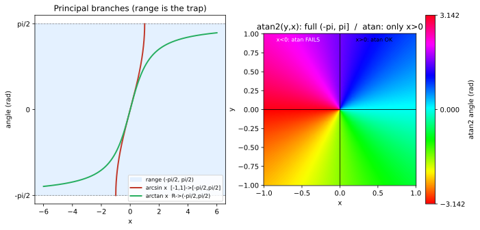

# ch14 — 反函數與 atan2：把影子還原成角度的陷阱

> **本章解決什麼問題**：前面十三章我們一路把「角度 → 位置」這個方向講透了——給你一個角，sin、cos 告訴你影子落在哪。本章反過來走：給你影子（一個座標、一個比值），怎麼還原出角度？這就是反三角函數。但「還原」這件事天生有麻煩：sin 不是一對一，同一個影子對應無限多個角。本章是 Part V 的開場，也是全書「故障視角」這條暗線的高潮——arcsin 的值域陷阱、開根號丟象限、atan 在 x=0 爆掉，全在這裡集合，而 atan2 是工程界對這團麻煩的標準答案。回收 ch01 的三角測量、ch10 的相量相位、ch12 的 atan2(B, A)。

```
Part I 搖籃與真身        Part II 旋轉是母題       Part III 複數：旋轉的代數
ch01 三角形→圓的真身     ch04 和角公式            ch07 複數平面=旋轉+縮放
ch02 弧度            →   ch05 旋轉矩陣        →   ch08 Euler 公式 ★
ch03 單位圓：六函數的家  ch06 點積與投影          ch09 de Moivre 與單位根
                                                        │
                                                        ↓
Part V 近親與收官 ◄你在這裡  Part IV 週期與波
ch14 反函數與 atan2  ←   ch13 傅立葉的門口    ←   ch10 波的解剖（相量）
ch15 雙曲孿生＋收官 ★    ch12 疊加：拍頻/Lissajous  ch11 為什麼 sin′=cos
```

## 從你已知的出發

你寫過這樣的 bug。遊戲裡有一個敵人，座標 (ex, ey)，玩家在 (px, py)，你要讓敵人轉身面向玩家。方向向量是 (dx, dy) = (px−ex, py−ey)。角度就是這個向量跟 x 軸的夾角，於是你很自然地寫：

```js
const angle = Math.atan(dy / dx);   // 看起來人畜無害
```

跑起來，玩家在敵人右上方時一切正常。玩家走到敵人左邊，敵人卻轉去面對相反方向——它瞄準了玩家的「鏡像」。再倒楣一點，玩家正好在敵人正上方（dx = 0），你拿到一個 `Infinity` 丟進 `atan`，或者直接 `NaN`，整個 transform 矩陣崩掉。

你大概查了 Stack Overflow，得到一句「用 `atan2(dy, dx)` 啦」，換掉就好了。它真的好了。但你心裡留了個疙瘩：**為什麼 `atan` 不夠？`atan2` 多吃一個參數到底多救了什麼？** 那個多出來的參數，不是寫得醜，是它必須知道 dx、dy 各自的正負號，才有辦法把你送到對的象限。

這一章就是把這個疙瘩拆開。它的根，是一件比 atan2 更早、更深的事：**sin、cos、tan 都不是一對一的函數**。它們週期重複，同一個輸出對應無限多個輸入。你想「反過來查」——從影子查角度——數學上根本不存在唯一答案。反三角函數是怎麼在這團多值的泥沼裡，硬切出一個唯一答案的？切的時候犧牲了什麼？那些被犧牲掉的東西，就是你 bug 的來源。

我認為這一章是全書最「工程師」的一章。前面講的是數學有多漂亮，這一章講的是當你把漂亮的數學接進真實系統時，它會在哪裡漏氣——以及人們怎麼用一個多吃一個參數的小函數，把漏氣的地方補起來。

## 為什麼反函數需要先「砍一刀」

回到最根本的問題。函數有反函數的前提是**一對一（one-to-one，雙射）**：每個輸出只能由唯一一個輸入產生，這樣「反查」才有唯一答案。

sin 完全不滿足這個條件。看單位圓（ch03）就懂：`sin θ` 是圓上那點的高度。高度 0.5 的點有幾個？在 [0, 2π) 一圈裡就有兩個——30°（π/6）和 150°（5π/6）都坐在高度 0.5 上。再加上週期性，每轉一圈又重來一次：

```text
sin θ = 0.5  的解：
  θ = π/6, 5π/6, π/6 + 2π, 5π/6 + 2π, π/6 − 2π, ...
  ── 無限多個 ──
```

所以「arcsin(0.5) 等於多少」這個問題，誠實的答案是「有無限多個」。但函數只能回傳一個值。怎麼辦？

**答案是：砍一刀。** 把 sin 的定義域限制在一段它**單調遞增、不重複**的區間上，在那一段裡 sin 變成一對一，就有乾淨的反函數了。這段被選中的區間叫**主值分支（principal branch）**，回傳的那個唯一角度叫**主值（principal value）**。

選哪一段是約定，但約定得有道理。對 sin，全世界選的是 **[−π/2, π/2]**：

- 在這段裡 sin 從 −1 單調爬到 +1，每個值只出現一次（一對一✓）。
- 它對稱於原點，把正負輸入對應到正負角度，符合直覺。

於是定下三個主值分支（這是本章的骨架，請記住值域，那是後面所有陷阱的源頭）：

| 反函數 | 定義域 | 值域（主值範圍） | 砍出來的那段原函數 |
|---|---|---|---|
| `arcsin x` | [−1, 1] | **[−π/2, π/2]** | sin 在 [−π/2, π/2] 單調遞增 |
| `arccos x` | [−1, 1] | **[0, π]** | cos 在 [0, π] 單調遞減 |
| `arctan x` | 全體實數 ℝ | **(−π/2, π/2)**（開區間） | tan 在 (−π/2, π/2) 單調遞增 |

幾個值得停下來的點：

- **arccos 為什麼選 [0, π] 而不是 [−π/2, π/2]？** 因為 cos 在 [−π/2, π/2] 不是一對一（它是偶函數，cos(−θ)=cos θ，左右對稱會撞值）。cos 要單調，得選一段它一路下降的區間，[0, π] 就是標準選擇：cos 從 1 單調降到 −1。記住 **arccos 的值域永遠是非負的 [0, π]**——這點等下會咬人。
- **arctan 為什麼是開區間？** tan 在 ±π/2 處爆掉（趨向 ±∞，那是 ch03 的割線平行、交不到的那一刻）。tan 把整條實數線一對一地鋪滿 (−π/2, π/2) 這段開區間——所以 arctan 吃**任何**實數都不會出界，但永遠吐不出正好 ±π/2。`atan(1e300)` 會非常接近 π/2，但碰不到。
- **arcsin 和 arctan 共用值域邊界 ±π/2，但意義不同**：arcsin 的定義域只有 [−1, 1]（影子高度不可能超過半徑），arctan 的定義域是整條 ℝ（斜率可以任意大）。

這張表本身不難。難的是「砍一刀」這個動作留下的疤：**主值分支只是無限多個答案裡，我們協議好回傳的那一個。** 它不一定是你要的那一個。下一節先看 atan2 怎麼把疤補大一點，再看疤怎麼變成 bug。

## atan2：用兩個座標的正負號救回完整象限

先看清楚單參數 `atan` 的病。`atan(y/x)` 拿到的輸入是**一個比值** `y/x`，這裡資訊已經流失了。考慮兩個點：

- 第一象限的 (x, y) = (1, 1)：比值 y/x = 1。
- 第三象限的 (x, y) = (−1, −1)：比值 y/x = (−1)/(−1) = 1。

**同一個比值 1。** atan 看到的就是 1，它無從分辨你原本在右上還是左下，只能回傳主值 45°。這就是本章開頭那個敵人 AI 瞄準鏡像的 bug：第三象限的目標被當成第一象限處理了。atan 的值域是 (−π/2, π/2)，只覆蓋右半平面（x>0 那兩個象限）——左半平面的方向它**根本表達不出來**。

再加上 x=0 的災難：方向正上方時 x=0，`y/x` 是除以零，得到 `Infinity` 或 `NaN`，atan 直接報廢。

**`atan2(y, x)` 的修法很直接：不要先把 y、x 壓成一個比值，把它們兩個分別交給函數，讓函數看得到各自的正負號。** 有了兩個符號，象限就唯一確定了：

| x 的符號 | y 的符號 | 象限 | 角度落在 |
|---|---|---|---|
| + | +（或 0） | I（右上） | [0, π/2) |
| − | +（≥0） | II（左上） | (π/2, π] |
| − | − | III（左下） | (−π, −π/2) |
| + | −（或 0） | IV（右下） | (−π/2, 0) |

它的輸出範圍是 **(−π, π]**（左閉右閉地說：大於 −π，小於等於 π；正 π 取得到，負 π 取不到，剛好繞完一整圈不重複）。完整的分段定義（這就是 Stack Overflow 那句話背後的東西）：

```text
            ┌ arctan(y/x)        x > 0          ← 右半平面，直接用 atan
            │ arctan(y/x) + π    x < 0, y ≥ 0   ← 左上：補一個 +π 轉過去
            │ arctan(y/x) − π    x < 0, y < 0   ← 左下：補一個 −π 轉過去
atan2(y,x)= │ +π/2               x = 0, y > 0   ← 正上方，不除零，直接給 +90°
            │ −π/2               x = 0, y < 0   ← 正下方，直接給 −90°
            └ undefined          x = 0, y = 0   ← 原點沒有方向（合理）
```

讀這段定義時，注意三件事：

1. **x>0 那一行就是老 atan**——右半平面 atan2 和 atan 完全一致。atan2 不是另一套數學，它是「atan 加上把左半平面接回來、把 x=0 特判掉」的工程包裝。
2. **x<0 的兩行靠 y 的符號決定補 +π 還是 −π**：上半就往逆時針補到第二象限，下半就往順時針補到第三象限——這正是 y 的符號在做的事，也正是單參數 atan 看不到的那個符號。
3. **x=0 直接特判**，碰都不碰除法，根除了除零。這是工程上比「象限正確」更要命的修補：一個 NaN 流進你的 transform 鏈，後面全毀，而且常常 silent——畫面歪掉、物理亂飛，但程式不報錯。

關於來歷：`atan2` 最早隨 **Fortran** 進入程式語言的標準數學函式庫（Wikipedia 記為「1961 年首見於 Fortran」「至少早至 1960 年代的 Fortran IV」；landscape 提醒過——「起源於 Fortran」是廣為接受的說法，但**確切是哪一版 Fortran 最早，缺一手出處，標『（2026-06，確切版本未驗證）』**）。它的目的從第一天起就是工程的：把笛卡兒座標轉成極座標時，給出**正確且不含糊**的角度。後來 C 沿用、幾乎所有語言照抄，連引數順序的怪癖都一起繼承了——

**引數順序是 `atan2(y, x)`，y 在前、x 在後。** 這和你寫座標 (x, y) 的習慣相反，是經典的踩雷點。記法：它是 `atan(y/x)` 的兩參數版，分子 y 拆到第一個位置、分母 x 拆到第二個位置，順序和分數一致（上/下 → 前/後）。寫錯順序不會報錯，只會讓你的角度沿著 45° 線鏡射——又一個 silent 的災難。

> **回收 ch01 與 ch12**：ch01 說 GPS、三角測量的本質是測距與測角；當你手上是「相對座標差 (dx, dy)」要還原「方位角」，用的就是 atan2。ch12 的相位合成 `A·sin x + B·cos x = √(A²+B²)·sin(x+φ)`，那個相位 `φ = atan2(B, A)`——之所以是 atan2 不是 atan，正因為 (A, B) 這支相量可以指向任何象限，你需要完整的 (−π, π] 才能描述它的方向。相位本來就是個方向，方向就需要 atan2。

CORDIC 一句話（landscape §6.1）：硬體（早期沒有浮點乘法器的導航計算機、後來的 DSP 與計算機）算 sin/cos/atan2，常用 **CORDIC**（COordinate Rotation DIgital Computer，Volder 1956 內部構想、1959 公開發表，為 B-58 轟炸機的數位導航而生）——它只用加法與位移，把三角函數的計算拆成「一連串固定角度的小旋轉」去逼近。這是「三角函數＝旋轉」這個全書主題在矽晶片上的完美印證：連硬體算 sin，底層做的也是轉圈。



## 直覺的陷阱

這是本書「故障視角」這條線的最高點。前面每一章都埋了一個陷阱，這裡是它們的集合地——因為反函數是「角度→位置」這條單行道硬要逆行的地方，所有資訊流失都在逆行的瞬間爆發。逐條看，每條都附「徵兆」：你怎麼從現象察覺自己其實踩了它。

### 陷阱一：arcsin(sin x) ≠ x（除非 x 本來就在主值區間內）

這是最深、最反直覺的一個。你會理所當然地以為「先 sin 再 arcsin 應該抵銷，拿回原來的 x」。**只有當 x 已經落在 [−π/2, π/2] 時才成立。** 否則 arcsin 會把你「折」回主值區間裡的那個替身角。

具體看 x = 3π/4（135°，在第二象限）：

```text
sin(3π/4) = √2/2 ≈ 0.70711          ← 影子高度
arcsin(0.70711) = π/4  (45°)        ← arcsin 只能回主值區間 [−π/2, π/2]
                                       裡那個高度相同的角
∴ arcsin(sin(3π/4)) = π/4 ≠ 3π/4
```

為什麼是 π/4 而不是 3π/4？因為 135° 和 45° 的**影子一樣高**（sin 135° = sin 45°，這是 ch03 的鏡射對稱：sin(π−θ)=sin θ）。arcsin 拿到 0.70711，按規定只能回傳 [−π/2, π/2] 裡的代表，那就是 45°。3π/4 出界了，被「反射」回它在主值區間的同高度替身。

**徵兆**：你做完一趟「角度→某種正規化→還原角度」的往返，發現鈍角或反向的角度悄悄變成了銳角、或正負號掉了。動畫角色該轉到背後（>90°），卻只轉到側面。這幾乎一定是某處用了 arcsin/arccos 把角度「夾」回主值區間。**自我察覺的提問**：我的輸入角度保證在主值區間內嗎？如果不保證，我就不該指望 arcsin∘sin 是恆等。

順帶釘一個 landscape 點名的小題：`arccos(cos(−1))` 等於多少？−1（弧度，約 −57.3°）在第四象限，但 arccos 的值域是 **[0, π]，永遠非負**。cos 是偶函數，cos(−1) = cos(1)，所以 `arccos(cos(−1)) = 1`（正的）。負號被吃掉了——因為 arccos 不可能回傳負值。這不是 bug，是值域的定義使然，但會讓沒想清楚的人很驚訝。

### 陷阱二：開根號丟象限資訊

你常見這種「從 sin 求 cos」的推導：由 `sin²θ + cos²θ = 1` 得 `cos θ = √(1 − sin²θ)`。

**那個正號是憑空冒出來的。** 平方根預設取正值，但 cos θ 在第二、三象限是負的。如果你只知道 `sin θ = 0.6`，θ 可能在第一象限（cos = +0.8）也可能在第二象限（cos = −0.8）。`√(1−0.36) = √0.64 = 0.8`——根號只給你 +0.8，第二象限那個 −0.8 被無聲地丟掉了。平方這個動作把正負號碾平了（(+0.8)² = (−0.8)² = 0.64），開根號補不回來。

這和 atan2 的病同源：**平方、取比值、取絕對值——任何「壓縮掉符號」的操作，都會讓你後面無法還原象限。** atan2 的設計哲學就是反過來：絕不提前壓縮符號，把 y、x 的符號留到最後一刻才用。

**徵兆**：某個量在「應該是負」的區域算出了正值（或反之），而你回溯發現中間有一步開了根號或取了模。

### 陷阱三：把 atan 當 atan2 用（鏡像 bug 與除零）

本章主病，已在上一節拆過。集中成一句：**只要方向可能指向左半平面（x<0），或可能正上/正下（x=0），就必須用 atan2，不能用 atan。** atan 只在「你能保證 x>0」時安全。

**徵兆**：(a) 物件在某半邊正常、跨到另一半邊就瞄準反方向（鏡像 bug，左半平面被折回右半平面）；(b) 偶發 NaN / Infinity，且總在物件正上/正下方對齊的瞬間（x=0 除零）。

### 陷阱四：引數順序 atan2(y, x) 寫反成 atan2(x, y)

工程慣例 y 在前、x 在後，和「座標 (x, y)」的書寫順序相反。寫反了不會報錯，結果是角度沿 45° 線鏡射（因為 atan2(x, y) 算的是 π/2 − atan2(y, x) 那種互補關係）。

**徵兆**：所有角度都「差不多對但系統性地偏掉」，順時針逆時針顛倒，或繞著 45° 對稱錯位。整體一致地錯，通常就是參數順序。

### 陷阱五：忘了 atan2 吃的是弧度（deg/rad，回收 ch02）

`atan2`、`atan`、`asin`、`acos` 全部回傳**弧度**。把回傳值當成度數丟進需要度數的 API（或反過來），就是 ch02 那個老坑的反向版。1 rad ≈ 57.3°——差 57 倍的錯。

**徵兆**：角度數值「小了約 57 倍」或「大了約 57 倍」，或物件只轉一點點 / 瘋狂亂轉。

### 陷阱六：arcsin / arccos 在 ±1 附近的數值敏感

這是純數值的坑，連邏輯都對也會中。arcsin 的導數是 `1/√(1−x²)`，當 x 趨近 ±1，分母趨近 0，**導數爆炸**：

```text
x        d(arcsin)/dx = 1/√(1−x²)
0.9      2.29
0.99     7.09
0.999    22.4
0.9999   70.7         ← 輸入動一點點，輸出角度劇烈跳動
```

意思是：在 x≈±1 附近，輸入 x 的一丁點浮點誤差，會被放大成輸出角度的大誤差。更糟的是 x 因浮點誤差**略微超過 1**（例如算出 1.0000000002）時，`asin` 直接回傳 `NaN`（定義域外）。這在「先算出一個本該 ≤1 的內積或比值、再丟進 arcsin」的程式裡很常見（例如算兩個單位向量夾角 `arccos(a·b)`，a·b 理論上 ≤1，浮點下可能變 1.0000001）。

**徵兆**：夾角計算在兩向量幾乎平行（夾角≈0）或幾乎反向（≈π）時偶發 NaN，或角度抖動異常大。**防禦**：丟進 arcsin/arccos 前先 clamp 到 [−1, 1]（`Math.max(-1, Math.min(1, v))`）。這是工程上算夾角的標準護欄。順帶一提：算兩向量夾角時，數值上更穩健的做法是用 `atan2(|a×b|, a·b)`（同時用上「垂直分量」和「平行分量」），它在端點附近不會像 arccos 那樣失準——又一次，atan2 因為「保留了兩個分量的完整資訊」而更穩。

把六條濃縮成一句你能背走的話：**反三角函數是把多值硬切成單值的工具，凡是『壓縮掉符號或落在區間／定義域邊界』的地方，它就漏。atan2 之所以是工程標準，正因為它一個符號都不提前丟。**

## 紙上推演

### 題目

**題 1 ★ [10 分鐘] 四象限 atan2 對照 atan。**
平面上四個點，各在一個象限：A=(1, 1)、B=(−1, 1)、C=(−1, −1)、D=(1, −1)（座標寫成 (x, y)）。對每個點，算出 `atan(y/x)`（以度為單位）與 `atan2(y, x)`（以度為單位），列成表，並指出哪些點被 atan 送到了錯誤象限、為什麼。

**題 2 ★★ [15 分鐘] arcsin∘sin 的折返。**
不用計算機，回答 `arcsin(sin(3π/4))` 等於多少，並用「影子一樣高」的語言解釋為什麼答案不是 3π/4。接著推廣：對於 x 在 (π/2, π] 的鈍角，`arcsin(sin x)` 的通式是什麼？（提示：用 sin(π−θ)=sin θ。）

**題 3 ★★ [10 分鐘] 為什麼 arccos(cos(−1)) 是正的。**
解釋為什麼 `arccos(cos(−1)) = 1` 而不是 −1。指出是哪兩個事實聯手造成這個結果（一個關於 cos 的性質，一個關於 arccos 的值域）。再自問：`arcsin(sin(−1))` 等於多少？這次負號保得住嗎？為什麼？

**題 4 ★★★ [15 分鐘] 口頭題：向同事解釋 atan2 多救了什麼。**
你的同事把 `Math.atan(dy/dx)` 換成 `Math.atan2(dy, dx)`，bug 好了，但他不知道為什麼。用 90 秒、不寫公式，講清楚「多吃一個參數」到底多換來了什麼能力，以及原來那版會在哪兩種情況出錯。

### 推演解答

**題 1。** 逐點算（y/x 與兩函數，度數）：

```text
點         y/x      atan(y/x)   atan2(y,x)   真實象限   atan 對嗎？
A (1, 1)    1        45°          45°          I         ✓ 對
B (−1, 1)   −1      −45°         135°          II        ✗ 錯（落到 IV 的 −45°）
C (−1,−1)    1       45°        −135°          III       ✗ 錯（落到 I 的 45°）
D (1, −1)   −1      −45°         −45°          IV        ✓ 對
```

關鍵觀察：B 和 C 都在**左半平面（x<0）**，正是 atan 表達不出來的兩個象限，所以兩個都被 atan 搞錯。注意 A 與 C 的比值同為 1（atan 都給 45°），B 與 D 的比值同為 −1（atan 都給 −45°）——**比值相同的兩點，atan 無從分辨，atan2 靠 x、y 各自的符號分開**。右半平面的 A、D，atan 與 atan2 一致（這呼應分段定義第一行：x>0 時 atan2 就是 atan）。

**常見錯路**：把 atan2 的引數寫成 atan2(x, y) 去算，會得到沿 45° 鏡射的另一組角度——若你算出 B 是 −45°、A 是 45°… 看起來「也有道理」，那就是順序寫反了。

**題 2。** `arcsin(sin(3π/4)) = π/4`（45°）。

語言解釋：3π/4 是 135°，在第二象限，它的影子高度 sin(3π/4) = √2/2 ≈ 0.70711。45° 的影子也正好這麼高（sin 45° = √2/2）——135° 和 45° 是「鏡射雙胞胎」，隔著 90° 那條垂直線左右對望，影子一樣高。arcsin 收到 0.70711 這個高度，按規矩只能回傳主值區間 [−π/2, π/2] 裡的代表，那就是 45°。3π/4 出界了，被換成它的銳角替身。

通式：對 x ∈ (π/2, π]，因為 sin x = sin(π−x)，而 π−x 落在 [0, π/2) 內（合法主值），所以

```text
arcsin(sin x) = π − x      （x 在第二象限 (π/2, π]）
```

驗證：x=3π/4 ⇒ π − 3π/4 = π/4 ✓。

**題 3。** 兩個事實聯手：

1. **cos 是偶函數**：cos(−1) = cos(1)。所以 arccos 拿到的輸入其實是 cos(1) ≈ 0.5403，根本不帶 −1 的負號資訊——負號在 cos 那一步就被偶對稱碾掉了。
2. **arccos 的值域是 [0, π]，恆非負**：就算它想回負角也不行，規定如此。

兩者一夾：`arccos(cos(−1)) = arccos(cos 1) = 1`。

對照 `arcsin(sin(−1))`：sin 是**奇函數**，sin(−1) = −sin(1)，負號保留下來了；而 arcsin 的值域 [−π/2, π/2] **允許負值**，且 −1 ∈ [−π/2, π/2]（−1 rad ≈ −57.3°，沒出界）。所以 `arcsin(sin(−1)) = −1`，負號保得住。差別的根源：cos 偶 + arccos 非負 ⇒ 吃掉負號；sin 奇 + arcsin 容許負 + 輸入在界內 ⇒ 保住負號。這題的價值在於看清：**負號能不能保住，取決於函數的奇偶性與反函數值域的搭配，不是隨意的。**

**題 4。** 模範口述（約 90 秒）：

「`atan` 只吃一個數，就是 dy 除以 dx 那個比值。問題是，左上和右下的比值可能一模一樣——比如 (−1, 1) 和 (1, −1)，比值都是 −1，atan 看到 −1 就只能回一個答案，它分不出你原本在哪一邊。所以左半邊的方向它根本講不出來，會把它鏡射到右半邊去——這就是你的物件跨到左邊就瞄反方向的原因。另外，正上方時 dx 是 0，比值除以零，直接 NaN。`atan2` 多吃一個參數，是因為它要分別看到 dy 和 dx 的正負號，不先壓成比值；有了兩個符號，四個象限就唯一確定，而且 dx=0 它直接特判成 ±90°，不碰除法。多換來的，就是『完整一圈 360° 的方向』加上『不會除零』。」

（這題沒有單一正確措辭，自評重點：有沒有講到「比值丟失符號」「左半平面表達不出」「x=0 除零」這三點。）

### 動手生圖

本章的圖把兩件事擺在一起：左邊看主值分支「值域帶」（arcsin 卡在 [−π/2, π/2]、arctan 卡在開區間 (−π/2, π/2)），右邊看 atan2 如何用四象限的顏色覆蓋完整的 (−π, π]，而 atan 只敢碰右半平面。腳本如下，可直接跑、可改參數。

```python
# ch14 figure: arcsin/arctan principal branches (left) and atan2 four-quadrant coverage (right)
from pathlib import Path
import numpy as np
import matplotlib
matplotlib.use("Agg")          # headless; no display needed
import matplotlib.pyplot as plt

OUT = Path(__file__).resolve().parent / "out" / "ch14-arctan-atan2.svg"
OUT.parent.mkdir(parents=True, exist_ok=True)

fig, (axL, axR) = plt.subplots(1, 2, figsize=(11, 5))

# --- Left: principal-branch curves with range bands ---
x1 = np.linspace(-1, 1, 400)                 # arcsin domain [-1, 1]
xt = np.linspace(-6, 6, 600)                 # arctan domain (all reals, sampled)
axL.axhspan(-np.pi/2, np.pi/2, color="#d9ecff", alpha=0.7, label="range (-pi/2, pi/2)")
axL.plot(x1, np.arcsin(x1), color="#c0392b", lw=2, label="arcsin x  [-1,1]->[-pi/2,pi/2]")
axL.plot(xt, np.arctan(xt), color="#27ae60", lw=2, label="arctan x  R->(-pi/2,pi/2)")
axL.axhline(np.pi/2, color="#888", ls="--", lw=0.8)
axL.axhline(-np.pi/2, color="#888", ls="--", lw=0.8)
axL.set_yticks([-np.pi/2, 0, np.pi/2]); axL.set_yticklabels(["-pi/2", "0", "pi/2"])
axL.set_title("Principal branches (range is the trap)")
axL.set_xlabel("x"); axL.set_ylabel("angle (rad)"); axL.legend(loc="lower right", fontsize=8)

# --- Right: four quadrants colored by atan2 range (-pi, pi] vs atan's (-pi/2, pi/2) ---
g = np.linspace(-1, 1, 240)
X, Y = np.meshgrid(g, g)
A = np.arctan2(Y, X)                          # full angle in (-pi, pi]
im = axR.pcolormesh(X, Y, A, cmap="hsv", shading="auto", vmin=-np.pi, vmax=np.pi,
                    rasterized=True)   # rasterize only the dense mesh; keeps SVG small
axR.axvspan(0, 1, color="white", alpha=0.0)   # placeholder; right half is atan's reach
axR.axvline(0, color="k", lw=0.8); axR.axhline(0, color="k", lw=0.8)
# mark the two halves atan can/cannot express
axR.text(0.45, 0.9, "x>0: atan OK", fontsize=8, ha="center")
axR.text(-0.55, 0.9, "x<0: atan FAILS", fontsize=8, ha="center", color="white")
axR.set_aspect("equal")
axR.set_title("atan2(y,x): full (-pi, pi]  /  atan: only x>0")
axR.set_xlabel("x"); axR.set_ylabel("y")
fig.colorbar(im, ax=axR, label="atan2 angle (rad)", ticks=[-np.pi, 0, np.pi])

fig.savefig(OUT, bbox_inches="tight", dpi=150)
print("wrote", OUT)            # build_figures.py reads this
```

**預期輸出**：終端機印出 `wrote .../figures/out/ch14-arctan-atan2.svg`。左圖兩條曲線都被夾在淺藍色的 [−π/2, π/2] 帶子裡——arcsin（紅）只在 x∈[−1,1] 有定義、兩端碰到 ±π/2 的虛線；arctan（綠）橫跨整條 x 軸但永遠逼近、碰不到 ±π/2（開區間的視覺證據）。右圖是一張用 HSV 色輪上色的平面：顏色就是 atan2 在該點給的角度，整整繞滿一圈（−π 到 π 的色相連續變化），左半平面（標 "atan FAILS"）的那些顏色，是單參數 atan 永遠表達不出來的角度。

**改參數看什麼**：

- 把 arctan 的取樣範圍 `xt` 從 `(-6, 6)` 改成 `(-50, 50)`，會看到綠線更貼近 ±π/2 卻仍碰不到——把「開區間」這件事看得更死。
- 把右圖的 `cmap="hsv"` 改成 `"twilight"`（同樣是循環色盤），更能看出 atan2 在 ±π（左半平面正中那條負 x 軸）的「接縫」——那正是值域端點 π 與 −π 幾乎相接、繞完一圈的地方（注意定義上 +π 取得到、−π 取不到）。
- 把右圖改成畫 `np.arctan(Y / X)`（單參數，會在 X=0 那一列產生 NaN/Inf）試試——你會看到中間豎軸一條壞掉的縫，以及左右半平面顏色相同（無法區分象限）。這就是 atan 的病，眼見為憑。

（圖內所有文字皆英文／數學記號，符合本書圖片慣例。）

## 自我檢核

口頭自答，講得出來才算過關：

1. 為什麼 sin 沒有「真正的」反函數？我們是用什麼動作硬造出一個來的，這個動作犧牲了什麼？
2. arcsin、arccos、arctan 的值域各是什麼？為什麼 arccos 選 [0, π] 而不跟 arcsin 一樣選 [−π/2, π/2]？為什麼 arctan 的值域是開區間？
3. 用「影子一樣高」解釋 `arcsin(sin(3π/4)) = π/4` 而非 3π/4。鈍角的通式是什麼？
4. 單參數 atan 有哪兩個病？atan2 各用什麼手段治它們？（一個關於象限/符號，一個關於 x=0。）
5. atan2 的引數順序是什麼？寫反了會發生什麼（會報錯嗎）？怎麼從現象認出「順序寫反」這個 bug？
6. 為什麼「`cos θ = √(1−sin²θ)` 那個正號」是個陷阱？它和 atan 丟象限是同一種病嗎？
7. 為什麼算兩向量夾角時，把內積丟進 arccos 前要先 clamp 到 [−1,1]？arcsin/arccos 在 ±1 附近為什麼特別危險？
8. （回收）ch12 的相位 `φ = atan2(B, A)` 為什麼用 atan2 而不是 atan？這跟「相位是一個方向」有什麼關係？

## 延伸閱讀

- **Wikipedia「atan2」** — https://en.wikipedia.org/wiki/Atan2 。完整的分段定義、各象限公式、與 Fortran 起源（2026-06；確切版本仍 hedge）。當你要釘死「x<0 時補 +π 還是 −π」時直接查這頁的定義式。
- **Wikipedia「CORDIC」** — https://en.wikipedia.org/wiki/CORDIC 。看「硬體怎麼用一連串小旋轉算 sin/cos/atan2」——本書「三角＝旋轉」主題在矽晶片層的印證（Volder 1956 構想 / 1959 公開，為 B-58 而生）。看 rotation mode 與 vectoring mode 兩節即可。
- **The Math Doctors「Ranges of Inverse Trig Functions」** — https://www.themathdoctors.org/ranges-of-inverse-trig-functions/ （2026-06 確認存在）。把「為什麼這三個值域是這樣選的、選別的會壞在哪」講得很細，正是本章主值分支那節的擴充。
- **Math LibreTexts「The functions of arcsin, arccos, and arctan」** — https://math.libretexts.org/Bookshelves/Precalculus/Precalculus_(Tradler_and_Carley)/19:_Inverse_Trigonometric_Functions （2026-06 確認存在）。要重看主值分支的圖（哪一段被砍出來）時的標準參考。
- **Tristan Needham《Visual Complex Analysis》** — https://global.oup.com/academic/product/visual-complex-analysis-9780192868923 。多值與分支的視覺進路（複數的 arg、log 的多值與分支切割）——本章 arcsin 的「砍一刀」其實是複變裡「分支（branch）」概念的入門版，想往下走的話這本接得最順（複數對數的多值，本書不展開，指這裡）。
