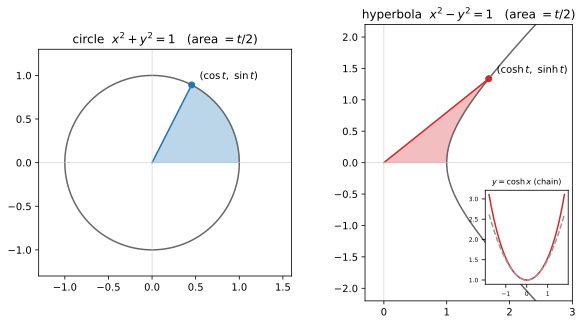

# ch15 — 雙曲孿生與總收官：圓與雙曲的對稱，旋轉與週期的通用語

> **本章解決什麼問題**：這是全書最後一章，做兩件事。第一，介紹最後一個新概念——雙曲函數（hyperbolic functions）sinh/cosh，它是圓三角函數的「雙曲線版孿生兄弟」，也是 e 與 Euler 那條主線的最後一塊對稱拼圖（你會看到 cosh x=(eˣ+e⁻ˣ)/2 與 cos x=(e^{ix}+e^{−ix})/2 像照鏡子一樣）。第二，總收官：把全書十四章收進一條你能用十分鐘講完的故事，並把開篇許下的六條驗收目標當口試逐條過一遍。本章不開任何新證明、不開除雙曲以外的新坑——它是回收與打包。讀完這章，這本書對你就不再是「讀過的內容」，而是「你能複述的一套看法」。

雖然 ch15 不是哪個 Part 的首章，但收官這件事需要把全書地圖最後攤開一次——這次每一格都已經走過了。對著它回想：你從哪裡出發，現在站在哪裡。

```
Part I 搖籃與真身        Part II 旋轉是母題       Part III 複數：旋轉的代數
ch01 三角形→圓的真身     ch04 和角公式            ch07 複數平面=旋轉+縮放
ch02 弧度            →   ch05 旋轉矩陣        →   ch08 Euler 公式 ★
ch03 單位圓：六函數的家  ch06 點積與投影          ch09 de Moivre 與單位根
                                                        │
                                                        ↓
Part V 近親與收官        Part IV 週期與波
ch14 反函數與 atan2  ←   ch13 傅立葉的門口    ←   ch10 波的解剖（相量）
ch15 雙曲孿生＋收官 ◄你在這裡  ch12 疊加：拍頻/Lissajous  ch11 為什麼 sin′=cos
```

十四格，一個母題。最後一格我們補上孿生兄弟，然後把整張圖講成一個故事。

## 從你已知的出發

先把鏡頭拉回 ch01 的你。那時候你腦裡的 sin，多半還是國中那個「對邊除以斜邊」的 SOH-CAH-TOA。如果有人問你「sin 是什麼」，你會比劃一個直角三角形。

現在問你同一個問題。我賭你會說：**sin 是一個點繞單位圓走時，它投在牆上的影子的高度。** 這就是這本書幹的唯一一件事——把那個視角扶正。其他全是這一句的延伸。

而這最後一章的新主角——雙曲函數——其實你也早就碰過，只是不知道它的家世。

你在神經網路裡見過 `tanh`。它是激活函數（activation），把任意實數壓進 (−1, 1)，曲線是個拉長的 S。你大概把它當成「一個剛好有上下界、原點附近近似線性、兩端飽和的平滑函數」用，從沒想過那個 h 是什麼意思。那個 h 就是 hyperbolic——tanh 是雙曲正切，是 sinh/cosh，而 sinh/cosh 是 cos/sin 的孿生兄弟。你天天在調的激活函數，和 ch08 的 Euler 公式是親戚。

你可能也見過懸吊的纜線、鏈條、項鍊垂下來的那條弧——電線桿之間的電纜、吊橋的主纜、你脖子上的項鍊。直覺上很像拋物線（parabola），對吧？連伽利略都這麼猜過。但它不是拋物線，它是 cosh。這一章會講為什麼。

還有一個你可能沒注意的連結：你寫過、用過的浮點函數庫裡，`Math.sinh`、`Math.cosh`、`numpy.cosh` 就坐在 `Math.sin` 旁邊，名字只差一個 h。標準庫的設計者把它們放在一起不是巧合——它們在數學上是同一個 e 的故事的兩面。本章要做的，就是把這層親戚關係講清楚，然後收掉整本書。

## 雙曲孿生：把 i 拿掉，圓就變成雙曲線

我們從 ch08 那個你已經很熟的事實出發。Euler 公式 e^{iθ}=cosθ+i·sinθ 一拆，就能把 cos 和 sin 寫成指數的組合。把 θ 換成 −θ（cos 偶、sin 奇）：

```text
e^{iθ}  = cosθ + i·sinθ
e^{−iθ} = cosθ − i·sinθ          ← cos(−θ)=cosθ、sin(−θ)=−sinθ

兩式相加再除以 2：  cosθ = (e^{iθ} + e^{−iθ}) / 2
兩式相減再除以 2i： sinθ = (e^{iθ} − e^{−iθ}) / (2i)
```

把這兩行盯著看。cos 是兩個「反向旋轉的單位箭頭」的平均（指數裡帶 i，所以是旋轉）。這是 ch08 的回收，沒有新東西。

現在做一件看起來很無聊、結果卻打開一扇門的事：**把 i 拿掉。** 定義兩個新函數，長得跟上面一模一樣，只是指數裡不放 iθ，改放實數 x：

```text
cosh x = (eˣ + e⁻ˣ) / 2          ← 雙曲餘弦（hyperbolic cosine），讀作 "cosh"
sinh x = (eˣ − e⁻ˣ) / 2          ← 雙曲正弦（hyperbolic sine），讀作 "sinch" 或 "shine"
```

把這兩組四行並排，孿生關係就直接跳出來：

```text
圓（circular）                       雙曲（hyperbolic）
cos x  = (e^{ix} + e^{−ix}) / 2      cosh x = (eˣ + e⁻ˣ) / 2
sin x  = (e^{ix} − e^{−ix}) / (2i)   sinh x = (eˣ − e⁻ˣ) / 2
```

差別只有一個：圓函數的指數裡有 i，雙曲函數沒有。i 是「旋轉」的標記（ch07：乘以 i 就是轉 90°），把它拿掉，就從「在虛數方向上旋轉」變成「在實數方向上拉伸」。cos/sin 描述的是一個點繞**圓**轉，cosh/sinh 描述的是一個點沿**雙曲線**跑。這就是「雙曲」二字的來歷。

> **這裡了不起在哪**：你不需要重新發明任何東西就得到了 sinh/cosh——它們就是「Euler 公式拔掉 i」的副產品。整本書的脊椎是「旋轉」，而雙曲函數是同一根脊椎在沒有 i 的世界裡的倒影。一旦你看懂這一點，sinh/cosh 對你就不再是「課本後面那幾個多出來、要另外背的怪函數」，而是「cos/sin 的鏡像，連定義式都對稱」。我認為這是收官前最漂亮的一個對稱。

順帶把名字唸對：cosh 唸 /kɒʃ/（像 "kosh"），sinh 有人唸 "sinch"、有人唸 "shine"，tanh 唸 "tanch" 或 "than"。本書驗收靠口述，所以唸法值得你定一個自己順口的版本。

### 為什麼叫「雙曲」：圓參數化圓，雙曲參數化雙曲線

ch03 講過：(cos t, sin t) 這個點，當 t 跑遍所有值，會在單位圓 x²+y²=1 上繞。代數上就是那條招牌恆等式：

```text
cos²t + sin²t = 1        ← 單位圓 x²+y²=1（這是畢氏定理，ch03）
```

雙曲函數的招牌恆等式只差一個正負號：

```text
cosh²t − sinh²t = 1      ← 單位雙曲線 x²−y²=1
```

所以 (cosh t, sinh t) 這個點，當 t 跑遍所有值，會沿著**單位雙曲線** x²−y²=1 的右支跑（cosh 永遠 ≥ 1，所以只在右半邊）。圓函數參數化圓，雙曲函數參數化雙曲線——名字就是這麼來的，一點都不神秘。

這個 cosh²−sinh²=1 等一下會在「動手做」裡親手驗證（把 e 的組合乘開，正負號自己掉出來）。先記住它與 cos²+sin²=1 只差中間的符號，這個符號差會一路傳染到導數、加法公式，全書最後一個對稱就藏在這個減號裡。

### 那個 t 不是角度，是面積

這裡有個直覺陷阱，值得你停下來。在圓上，(cos t, sin t) 的 t 是**角度**（弧度），你繞了多少弧度，點就轉到哪。很自然你會以為雙曲線上的 t 也是某種角度。

不是。雙曲線沒有「繞一圈」這回事（它是開的、跑到無窮遠），「角度」在這裡沒有好定義。那 t 是什麼？

**t 是掃過的面積的兩倍。** 更精確地說：從 (1, 0) 出發、沿雙曲線跑到 (cosh t, sinh t)，這條弧、x 軸、和從原點拉到該點的那條線，三者圍出一塊「雙曲扇形」，這塊扇形的面積正好是 t/2（2026-06 查證）。

漂亮的是，**圓上的 t 其實也是面積的兩倍**。單位圓的一個扇形，圓心角 t 弧度，面積是 ½·r²·t = t/2（ch02 的扇形面積公式，r=1）。所以「t = 兩倍掃過的面積」這個說法對圓和雙曲都成立——只是在圓上它剛好又等於角度（因為單位圓裡弧度本來就是用弧長/面積定義的），在雙曲線上它只能是面積，因為沒有角度可言。

這是本章「t 是面積不是角度」的核心直覺：圓與雙曲共用「面積參數」這個更深的定義，圓的「角度」只是它在單位圓上的特例化身。本章的 figure 會把這兩塊掃過的面積並排畫出來給你看。

### 懸鏈線是 cosh，不是拋物線（伽利略猜錯了）

雙曲函數不是純抽象的鏡像遊戲，它有一個漂亮的物理身世，正好和圓函數的物理身世（旋轉、振動）對照。

拿一條均勻的鏈條或纜線，兩端固定、中間自由垂下。它垂成的那條曲線，叫**懸鏈線（catenary）**。直覺上你會猜它是拋物線——畢竟拋物線也是這樣下凹的對稱曲線。**伽利略（Galileo）就曾經以為（或當成近似）它是拋物線。**（這裡要 hedge：伽利略的原文較含糊，有學者認為他知道那不完全是拋物線、只是拿拋物線當近似，所以別說成「伽利略斬釘截鐵主張是拋物線」，2026-06 查證。）

它不是拋物線。它是 cosh：

```text
y = a·cosh(x / a)        ← 懸鏈線方程，a 由鏈條張力與線密度決定
```

這個答案在 17 世紀才被釘死。雅各布·伯努利（Jacob Bernoulli）於 1690 年在《Acta Eruditorum》上公開徵解；隔年 1691 年，約翰·伯努利（Johann Bernoulli）、萊布尼茲（Leibniz）、惠更斯（Huygens）三人各自獨立解出，三份解都在 1691 年發表。catenary 這個名字（源自拉丁文 catena「鏈」）是惠更斯 1690 年在給萊布尼茲的信裡取的（2026-06 查證）。

為什麼是 cosh 不是拋物線？粗略的直覺：拋物線假設「每段水平距離承受的重量相等」（像吊橋的橋面負重，那種才真的是拋物線）；但純鏈條的重量是沿著**弧長**均勻分布的，越往兩端越陡的地方、單位水平距離塞進的鏈條越多、越重——這個差別讓微分方程的解從拋物線變成 cosh。嚴格推導要解一條微分方程（y″ 正比於 √(1+y′²)），那是《馴服無限》那本書的地盤，本書不展開，只請你記住結論與那個「重量沿弧長分布」的直覺。

> **雙曲與圓的對照之美**：圓函數的物理身世是「旋轉與振動」（ch10–ch11：相量、彈簧 x″=−x 的解是 sin/cos）；雙曲函數的物理身世是「懸掛與平衡」（懸鏈線、纜線的形狀）。圓的方程 x″=−x（往回拉，振盪）對上雙曲的 x″=+x（往外推，指數成長與衰減的組合）——一個減號之差，一個會繞圈、一個會發散。整個 e 的世界就靠這個符號分成「旋轉」與「拉伸」兩半。

最後留一句帶到延伸閱讀：雙曲函數也有反函數（arsinh、arcosh、artanh），而 artanh 在物理上有個漂亮身分——**相對論裡的「快度（rapidity）」**。狹義相對論的速度不能直接相加（會超光速），但定義 rapidity 為 artanh(v/c)，rapidity 就能像普通角度一樣**直接相加**，Lorentz 變換寫成 cosh/sinh 就和旋轉矩陣長得一模一樣（2026-06 查證）。也就是說：相對論裡的「等速運動疊加」是雙曲版的「旋轉疊加」——你 ch04/ch05 學的「角度相加＝旋轉相疊」在那裡有個雙曲孿生。這條線本書不走，指向延伸閱讀。

## 總收官：把整本書講成一個故事

新概念到此為止。剩下的篇幅，我們把十五章收成一條線。

你手上現在有一整套看法。但「讀過」和「能講出來」之間隔著一條河。這一節幫你把河上的橋搭好——先把全書地圖每一格的「它在解什麼問題」用一句話收掉，然後把主張重述一次，最後用六條口試逼你親口講一遍。

### 全書地圖回收：每一格在解什麼問題

照著地圖走一遍，每格一句話。這不是摘要，是「動機鏈」——每一章都在回答上一章逼出來的問題。

```text
Part I 搖籃與真身
ch01 三角形→圓：sin 不是邊長比，是繞圓那點的座標(影子)；SOH-CAH-TOA 只活在 0°~90° 的小盒子
ch02 弧度：用半徑當尺量角才自然——讓 sin x≈x、sin′=cos 乾淨，度數是巴比倫的任意約定
ch03 單位圓：六函數的家，全是圓上的線段(tan=切線、sec=割線)；特殊角從幾何推、不背

Part II 旋轉是母題
ch04 和角公式：sin(a+b) 是「先轉 a 再轉 b＝轉 a+b」——恆等式有來源，不背【脊椎第一證：幾何】
ch05 旋轉矩陣：把「轉一個角」寫成機器 R(θ)，R(a)R(b)=R(a+b)【脊椎第二證：矩陣】
ch06 點積與投影：cos 是「兩方向多對齊」的度量，影子升級成投影，正交＝點積 0(傅立葉伏筆)

Part III 複數：旋轉的代數
ch07 複數平面：乘法＝輻角相加、模相乘＝旋轉加縮放；乘以 i 就是轉 90°【脊椎第三證：極式】
ch08 Euler 公式★：e^{iθ}＝以單位速率繞單位圓；e^{i(a+b)}=e^{ia}e^{ib} 一行收掉和角【脊椎第四證】
ch09 de Moivre 與單位根：開 n 次方有 n 個根，排成正 n 邊形，和為 0——開根號＝把圓等分

Part IV 週期與波
ch10 波的解剖：A·sin(ωt+φ) 的每個部件；波＝一支旋轉箭頭(相量)的影子在時間上展開
ch11 為什麼 sin′=cos：等速繞圓的速度⊥半徑、長度不變——旋轉的速度還是旋轉；sin″=−sin＝振動
ch12 疊加：同頻相加還是同頻(相量加法)，異頻生拍頻與 Lissajous；積化和差從和角推
ch13 傅立葉的門口：任何週期訊號＝一堆旋轉的圓疊起來；正交性＝各頻率「各自結帳」

Part V 近親與收官
ch14 反函數與 atan2：sin 多值，反函數要砍主值分支；atan2 用兩座標正負救回完整四象限角
ch15 雙曲孿生＋收官：拔掉 i，圓變雙曲；cosh²−sinh²=1；懸鏈線＝cosh——然後就是這裡
```

回頭看這張清單，你會發現一件事：**沒有一章在教「怎麼解三角形」。** 整本書十五章，沒有出過一題「已知兩邊一角求第三邊」。因為那不是重點。重點從 ch01 那一行就定了——sin 是繞圓的影子——剩下全是這句話在不同舞台上的重演。

### 主張重述：三角函數是把「旋轉與週期」操作化的語言

現在把全書主張完整講一次。讀完這本書，如果只能留一段話在你腦裡，是這段：

> **三角函數不是三角形的學問，是把「旋轉與週期」操作化的通用語言。**
>
> - **sin/cos 是繞圓的影子**：一個點以等速繞單位圓，它的高度（縱座標）隨時間畫出 sin，水平位置畫出 cos（ch01、ch03、ch10）。
> - **恆等式都是「旋轉可組合」的不同寫法**：和角公式說的是「先轉 a 再轉 b＝轉 a+b」，這同一件事被幾何（ch04）、矩陣（ch05）、複數極式（ch07）、Euler（ch08）證了四次——四次是同一件事。所以你不必背恆等式，旋轉一組合它們就自己掉出來。
> - **複數乘法就是旋轉**：乘以一個複數＝把輻角相加、把模相乘＝旋轉加縮放；i 是「轉 90°」的代名詞（ch07）。
> - **Euler 公式把指數與旋轉接上線**：e^{iθ} 就是「以單位速率在單位圓上旋轉」，因為它的變化率 i·e^{iθ} 永遠把自己轉 90°、垂直於半徑（ch08）。這是全書最深的一根接縫，也是雙曲孿生的母版（ch15 拔掉 i 就得到 cosh/sinh）。
> - **波是相量的影子**：A·sin(ωt+φ) 就是一支以角速度 ω 旋轉的箭頭，它的影子在時間軸上展開（ch10）；而旋轉的速度還是旋轉，所以 sin′=cos（ch11）。
> - **傅立葉是一堆圓的合奏**：任何週期訊號＝一堆不同半徑、不同轉速的圓首尾相接畫出來的；它行得通是因為不同頻率彼此正交（垂直、互不干擾），所以每個頻率可以「各自結帳」（ch13）。

這六點就是開篇許下的六條驗收目標。下一節，我們把它們變成口試。

### 六條口試：講得出來才算過關

style-guide 定的驗收標準是六條主線。這裡把每一條變成一個口頭題——找個願意聽十分鐘的同事，或對著鏡子，把它講出來。**講得出來才算讀懂；講不清楚就是還沒懂，回去那一章。** 每題後面附「模範答案要點清單」——這是檢查表，不是要你逐字背，是讓你自評「我講的有沒有踩到這幾個點」。

每題口述目標 3–5 分鐘。

---

**口試 1｜三角函數真正在描述什麼？三角形為什麼只是搖籃？**

要點清單：
- [ ] sin/cos 的主定義是「單位圓上一點的座標 (cos θ, sin θ)」，不是「對邊／斜邊」。
- [ ] SOH-CAH-TOA 只活在直角三角形裡，角度卡在 0°~90°；遇到負角、超過 90°、轉好幾圈就破功。
- [ ] 三角學的史實起點是天文測距的「弦表」（Hipparchus、Ptolemy），量的是圓上的弧與弦，不是手邊的三角形——所以「先有圓」。
- [ ] 能用「影子」隱喻講：點繞圓走，影子在牆上來回就是正弦波。
- [ ] 一句收尾：三角形是搖籃（出生的地方、計算的工具），單位圓才是家（真正的定義）。

---

**口試 2｜單位圓為什麼是「家」？弧度為什麼是「自然」的角度單位？**

要點清單：
- [ ] 單位圓讓 sin/cos 變成座標、角度可以無限轉、正負號與週期性自然落出——這是 SOH-CAH-TOA 給不了的。
- [ ] 弧度＝弧長÷半徑，是用圓自己的尺（半徑）量角；180°=π、1 rad≈57.30°。
- [ ] 度數（360）是巴比倫人的方便約定，任意；弧度才讓公式乾淨。
- [ ] 兩個紅利要講得出：小角 sin x≈x（弧度才成立）、sin′=cos（弧度才沒有醜常數 π/180）。
- [ ] 能說「程式裡 Math.sin 吃弧度」就是這件事的工程後果。

---

**口試 3｜為什麼恆等式都有來源、不必背？以和角公式為例。**

要點清單：
- [ ] 和角公式 sin(a+b)=sin a cos b+cos a sin b 的意思是「先轉 a 再轉 b＝轉 a+b」（旋轉可組合）。
- [ ] 能說出至少兩種證法是同一件事：幾何投影（ch04）、旋轉矩陣 R(a)R(b)=R(a+b)（ch05）、複數極式相乘（ch07）、Euler e^{i(a+b)}=e^{ia}e^{ib}（ch08）。
- [ ] 倍角、半角、積化和差全是從和角公式推下來的二級產物。
- [ ] 能點破最常見錯覺：sin(a+b)≠sin a+sin b（用 a=b=90° 一秒反證）。
- [ ] 態度：恆等式不是要背的清單，是旋轉一組合就現推得出來的東西。

---

**口試 4｜複數乘法為什麼是旋轉加縮放？Euler 公式從旋轉這側看是什麼意思？**

要點清單：
- [ ] 複數＝平面上的箭頭；乘法＝輻角相加、模相乘＝旋轉＋縮放；乘以 i＝逆時針轉 90°。
- [ ] 極式 z=r·e^{iθ}，r 是模、θ 是輻角。
- [ ] Euler 公式 e^{iθ}=cosθ+i·sinθ 的旋轉解讀：e^{iθ} 是一個從 1 出發、以單位速率繞單位圓的點。
- [ ] 為什麼繞圓：它的變化率是 i·e^{iθ}＝把目前位置轉 90°＝速度永遠垂直於半徑＝等速繞圓。
- [ ] e^{iπ}+1=0 是「轉半圈到 −1」的特例；能用自己的話講，不只背它「漂亮」。

---

**口試 5｜解剖一個波（振幅、頻率、相位），並說明 sin′=cos 為什麼成立。**

要點清單：
- [ ] A·sin(ωt+φ)：A 振幅、ω 角頻率、φ 初相位、T=2π/ω 週期、f=1/T 頻率，每個都能指出來。
- [ ] 波＝相量（旋轉箭頭）的影子：一支以 ω 旋轉的箭頭，影子在時間軸展開成正弦波。
- [ ] sin′=cos 的旋轉證法：等速繞圓的點，速度向量＝把位置轉 90°＝(−sin, cos)，所以 (sin)′=cos、(cos)′=−sin。
- [ ] 這和 Euler 的 d/dθ e^{iθ}=i·e^{iθ} 是同一件事（速度⊥半徑）。
- [ ] sin″=−sin＝加速度指向圓心＝向心＝彈簧 x″=−x——三角函數住在一切振動裡。

---

**口試 6｜為什麼「任何週期訊號＝一堆旋轉的圓疊起來」？這在你的技術棧裡藏在哪？**

要點清單：
- [ ] 主張：週期訊號＝Σ 不同頻率的正弦（或 Σ 旋轉箭頭 e^{inωt}）——一堆圓首尾相接畫出曲線（epicycles）。
- [ ] 為什麼行得通：不同頻率彼此正交（∫ sin(mx)sin(nx)=0，m≠n）＝「垂直」＝互不干擾。
- [ ] 正交＝可以「各自結帳」：每個頻率的係數用積分當探測器單獨算出來（ch06 點積升級成函數內積）。
- [ ] 方波例子：方波=(4/π)(sin x+sin3x/3+sin5x/5+…)；x=π/2 三項部分和≈1.10347；跳躍處有 Gibbs 過衝≈8.95%（壓不掉，只變窄）。
- [ ] 技術棧藏身處：頻譜圖、JPEG 丟高頻、MP3、音訊 EQ、監控流量拆日週期/週週期、FFT（取樣點放在單位根上，ch09 回收）。

---

六條都能順順講完，這本書你就真的讀完了——不是讀過，是內化成你能教別人的看法。卡在哪一條，那一章就是你的複習重點。

### 下一步地圖：這扇門通往哪三條路

本書停在「傅立葉的門口」和「e^{iθ} 與單位根的直覺」，刻意不進收斂的嚴格層、不進複變函數論、不進連續傅立葉變換。如果這趟旅程讓你想再往前走，這裡有三條路（對應附錄 C 的延伸閱讀總地圖）：

| 路線 | 往哪 | 起點推薦 |
|---|---|---|
| **往複變與幾何** | 把「複數＝旋轉與縮放」的視覺進路推到整個複變分析 | Tristan Needham《Visual Complex Analysis》（和本書論點高度同調）；3Blue1Brown 的 Lockdown Math 複數那集 |
| **往訊號與傅立葉** | 從「門口」走進收斂、傅立葉變換、FFT、DSP | 3Blue1Brown「But what is a Fourier series?」（epicycle 那支）；收斂嚴格層交給姊妹書《馴服無限》ch11 |
| **往欣賞與數學史** | 把三角／週期當文化與歷史來品味 | Eli Maor《Trigonometric Delights》《e: The Story of a Number》；Better Explained 的三角與 Euler 系列 |

選哪條都好。但你帶著走的那把鑰匙是同一把：**會轉、會週期重複的東西，背後都有一個圓。** 你現在有看見那個圓的眼睛了。

## 直覺的陷阱

雙曲函數最容易被「望文生義」帶溝裡，因為它和圓函數長太像。以下是收官章該釘死的幾個。

| 陷阱 | 錯誤直覺 | 會在哪一步爆掉 | 怎麼自我察覺 |
|---|---|---|---|
| **cosh 的恆等式抄成加號** | 以為 cosh²+sinh²=1（照抄 cos²+sin²=1） | 算任何雙曲恆等式都會錯；參數化會跑到圓而不是雙曲線 | 記「雙曲是減號」：cosh²−sinh²=1，對應 x²−y²=1。乘開 e 的組合一驗就知 |
| **以為雙曲的 t 是角度** | 把 (cosh t, sinh t) 的 t 當成「轉了多少」 | 雙曲線是開的、沒有「繞一圈」，當角度想會問出沒意義的問題（如「cosh 的週期是多少」） | 雙曲函數**不週期**（cosh 一路漲到無窮）；t 是面積的兩倍，不是角度 |
| **以為懸鏈線是拋物線** | 看起來像拋物線，就當拋物線 | 結構計算（纜線張力、吊橋 vs 純鏈）會用錯模型 | 純鏈條重量沿弧長分布⇒cosh；只有橋面負重均勻分布才是拋物線。兩者中間段很像，兩端才分岔 |
| **cosh 導數抄了負號** | 照抄 (cos)′=−sin，寫成 (cosh)′=−sinh | 一切微分計算錯號 | 雙曲導數**沒有負號**：(cosh)′=sinh、(sinh)′=cosh。因為 cosh/sinh 是 eˣ 的組合，微分不換正負（沒有 i 來提供 −1）；推一遍就清楚 |
| **以為 sinh 有界** | 把 sinh 當成像 tanh 那樣會飽和 | 數值計算時 sinh/cosh 對大 x 會指數爆炸、溢位 | 只有 **tanh=sinh/cosh** 被壓在 (−1,1)；sinh、cosh 本身隨 x 指數成長。算大 x 的 cosh 小心 overflow |

最後一個是工程上最實際的：`Math.cosh(1000)` 會 overflow 成 `Infinity`，因為 cosh 隨 x 指數成長。tanh 才是那個安全飽和的——這也是為什麼神經網路用 tanh 當激活，不用 sinh。

## 紙上推演

四題。前三題是雙曲的硬功夫，第四題是全書收官的口述練習——也是這本書真正要交付給你的能力。

**推演 1【15 分鐘・★★】** 用定義驗證 cosh²t − sinh²t = 1（把 e 的組合乘開，不准引用結論）。

**推演 2【15 分鐘・★★】** 證明 (cosh)′=sinh、(sinh)′=cosh，並對照圓函數 (cos)′=−sin、(sin)′=cos，說清楚「那個負號的差別來自哪裡」。

**推演 3【10 分鐘・★】** 給「三角函數就是背一堆公式解三角形」這個常見誤解，寫一段約 200 字的反駁——用你這本書學到的看法。

**推演 4【30 分鐘・★★★】** 六條口試正式作答：對著上面的要點清單，把六題各口述 3–5 分鐘（錄音或對人講），講完逐條打勾自評。這題沒有「解答」——你的錄音就是解答。下面只給「最常講漏的點」當提醒。

### 推演解答

**推演 1 解答。** 直接代定義：

```text
cosh t = (eᵗ + e⁻ᵗ)/2，  sinh t = (eᵗ − e⁻ᵗ)/2

cosh²t = (eᵗ + e⁻ᵗ)² / 4 = (e²ᵗ + 2·eᵗ·e⁻ᵗ + e⁻²ᵗ) / 4 = (e²ᵗ + 2 + e⁻²ᵗ) / 4
                                              ← eᵗ·e⁻ᵗ = e⁰ = 1，中間項是 2

sinh²t = (eᵗ − e⁻ᵗ)² / 4 = (e²ᵗ − 2·eᵗ·e⁻ᵗ + e⁻²ᵗ) / 4 = (e²ᵗ − 2 + e⁻²ᵗ) / 4

cosh²t − sinh²t = [(e²ᵗ + 2 + e⁻²ᵗ) − (e²ᵗ − 2 + e⁻²ᵗ)] / 4
               = (2 − (−2)) / 4 = 4/4 = 1     ✓
```

關鍵在中間項：cosh² 那邊是 +2、sinh² 那邊是 −2，相減就是 +2−(−2)=4，e²ᵗ 與 e⁻²ᵗ 全部對消。對照圓函數：cos²+sin² 時，中間的交叉項在「相加」時對消、留下 e^{iθ}·e^{−iθ}=1 那一項——差別就在圓函數是「相加消交叉項」、雙曲是「相減消主項留 ±2」。同一個 e 的代數遊戲，正負號不同。

自我複核：取 t=0，cosh 0=(1+1)/2=1、sinh 0=(1−1)/2=0，cosh²−sinh²=1−0=1 ✓。對照 cos 0=1、sin 0=0 也是 1−... 不對，圓是 1+0=1——兩邊在 t=0 都給 1，但一個靠減、一個靠加，符號的差在這裡看不出來，要在 t≠0 才顯。取 t=1：cosh 1≈1.5431、sinh 1≈1.1752，cosh²−sinh²≈2.3812−1.3811≈1.0001 ✓（小數誤差）。

**推演 2 解答。** 雙曲函數是 eˣ 的組合，而 (eˣ)′=eˣ、(e⁻ˣ)′=−e⁻ˣ（鏈鎖律，內層 −x 的導數是 −1）：

```text
(sinh x)′ = d/dx [(eˣ − e⁻ˣ)/2] = (eˣ − (−e⁻ˣ))/2 = (eˣ + e⁻ˣ)/2 = cosh x   ✓
(cosh x)′ = d/dx [(eˣ + e⁻ˣ)/2] = (eˣ + (−e⁻ˣ))/2 = (eˣ − e⁻ˣ)/2 = sinh x   ✓
```

注意 **沒有負號**：(cosh)′=sinh，乾乾淨淨。對照圓函數：

```text
雙曲：(sinh)′ = cosh，  (cosh)′ = sinh        ← 互為對方的導數，無負號
圓：  (sin)′  = cos，   (cos)′  = −sin        ← cos 的導數帶負號
```

那個負號的差別來自哪裡？來自 i。圓函數是 e^{ix} 的組合，微分 e^{ix} 會掉出一個 i（(e^{ix})′=i·e^{ix}），而 i²=−1——所以 cos 微分兩次就帶出 −1，這就是 (cos)′=−sin、進而 sin″=−sin 的來源（往回拉、振盪）。雙曲函數是 eˣ 的組合，微分 eˣ 只掉出實數 1，沒有 i、沒有 −1——所以 cosh 微分兩次還是自己：cosh″=cosh（往外推、指數成長）。

**一個減號，分出兩個世界**：sin″=−sin（解是振盪，住在彈簧、單擺、LC 電路裡，ch11）對上 cosh″=+cosh（解是指數成長／衰減，住在懸鏈線、電容充放電裡）。這就是為什麼圓函數會繞圈、雙曲函數會發散——根源是定義式裡有沒有那個 i。這是全書「旋轉 vs 拉伸」對照的最後一塊，也是我認為整個雙曲故事最值得帶走的一句。

**推演 3 解答（參考範文，約 200 字）。**

> 說三角函數是「背公式解三角形」，就像說程式是「背 API 名稱」一樣，把工具當成了學問本身。三角函數的主題從來不是三角形——三角形只是它出生的搖籃。它真正描述的是旋轉與週期：sin 與 cos 是一個點繞單位圓走時，投在牆上的影子。一旦這樣看，所謂「要背的恆等式」全都有來源——和角公式不過是「先轉 a 再轉 b 等於轉 a+b」，旋轉一組合就現推得出來，根本不必背。再往前走，複數乘法是旋轉、Euler 公式把指數和旋轉接上線、一個波是旋轉箭頭的影子、傅立葉是一堆旋轉的圓疊起來。從旋轉這個母題看，三角函數是描述「一切會轉、會週期重複的東西」的通用語言。解三角形只是它最初、最小的一個應用，不是它的全部，更不是它的本質。

**推演 4 解答。** 沒有標準答案——這題的產出是你的錄音或你對同事的講解。但根據經驗，六條裡最常被講漏的點是：

- **口試 1** 常漏「史實起點是弦表、先有圓」，只講了視角翻轉。
- **口試 2** 常把弧度說成「就是另一種角度單位」，漏掉「為什麼自然」（讓 sin x≈x 和 sin′=cos 乾淨）。
- **口試 3** 常只證一種，漏了「四種證法是同一件事」這個全書脊椎的對帳。
- **口試 4** 常背得出 e^{iθ}=cosθ+i sinθ，但講不出「為什麼指數會跑去畫圓」（變化率＝乘 i＝轉 90°）。
- **口試 5** 常解剖得出波的部件，但 sin′=cos 又退回「背的」或「引用《馴服無限》的草圖」，沒講旋轉證法。
- **口試 6** 常講得出「拆成正弦」，漏了「為什麼可以各自算」（正交性＝各自結帳）這個機制。

如果你六條都講完、且沒踩到上面任何一個漏點——恭喜，這本書你內化了。

### 動手生圖

本章的圖把圓與雙曲並排，讓你親眼看見「同一個 e 故事的兩面」：左邊單位圓被 (cos t, sin t) 參數化、陰影是掃過的扇形面積（=t/2）；右邊單位雙曲線被 (cosh t, sinh t) 參數化、陰影是雙曲扇形面積（也=t/2）；右下角小圖是懸鏈線 y=cosh x，並疊一條虛線拋物線 1+x²/2 對照，讓你看見兩者在中段相近、兩端分岔。

```python
# ch15 figure: circle (cos t,sin t) vs hyperbola (cosh t,sinh t), both swept by area t/2; inset catenary y=cosh x
from pathlib import Path
import numpy as np
import matplotlib
matplotlib.use("Agg")          # headless; no display needed
import matplotlib.pyplot as plt

OUT = Path(__file__).resolve().parent / "out" / "ch15-circle-vs-hyperbola.svg"
OUT.parent.mkdir(parents=True, exist_ok=True)

t = 1.1                                                  # the shared parameter (NOT an angle on the right)
fig, (axc, axh) = plt.subplots(1, 2, figsize=(10, 5))

# --- left: unit circle x^2+y^2=1, point (cos t, sin t), shaded sector has area t/2 ---
th = np.linspace(0, 2 * np.pi, 400)
axc.plot(np.cos(th), np.sin(th), color="0.4")            # the circle
s = np.linspace(0, t, 60)                                # sector boundary 0..t
axc.fill(np.concatenate([[0], np.cos(s)]), np.concatenate([[0], np.sin(s)]), color="tab:blue", alpha=0.3)
axc.plot([0, np.cos(t)], [0, np.sin(t)], color="tab:blue")
axc.plot(np.cos(t), np.sin(t), "o", color="tab:blue")
axc.annotate(r"$(\cos t,\ \sin t)$", (np.cos(t), np.sin(t)), textcoords="offset points", xytext=(8, 6))
axc.set_title(r"circle  $x^2+y^2=1$   (area $=t/2$)")
axc.set_aspect("equal"); axc.set_xlim(-1.3, 1.6); axc.set_ylim(-1.3, 1.3)
axc.axhline(0, color="0.8", lw=0.6); axc.axvline(0, color="0.8", lw=0.6)

# --- right: unit hyperbola x^2-y^2=1 (right branch), point (cosh t, sinh t), shaded sector area t/2 ---
u = np.linspace(-1.6, 1.6, 400)
axh.plot(np.cosh(u), np.sinh(u), color="0.4")            # right branch
s = np.linspace(0, t, 60)
axh.fill(np.concatenate([[0], np.cosh(s)]), np.concatenate([[0], np.sinh(s)]), color="tab:red", alpha=0.3)
axh.plot([0, np.cosh(t)], [0, np.sinh(t)], color="tab:red")
axh.plot(np.cosh(t), np.sinh(t), "o", color="tab:red")
axh.annotate(r"$(\cosh t,\ \sinh t)$", (np.cosh(t), np.sinh(t)), textcoords="offset points", xytext=(8, 6))
axh.set_title(r"hyperbola  $x^2-y^2=1$   (area $=t/2$)")
axh.set_aspect("equal"); axh.set_xlim(-0.3, 3.0); axh.set_ylim(-2.2, 2.2)
axh.axhline(0, color="0.8", lw=0.6); axh.axvline(0, color="0.8", lw=0.6)

# --- inset: catenary y=cosh x (a hanging chain), NOT a parabola ---
ins = axh.inset_axes([0.58, 0.06, 0.4, 0.34])
xc = np.linspace(-1.8, 1.8, 200)
ins.plot(xc, np.cosh(xc), color="tab:red")
ins.plot(xc, 1 + xc**2 / 2, "--", color="0.6")          # parabola for contrast
ins.set_title(r"$y=\cosh x$ (chain)", fontsize=8)
ins.tick_params(labelsize=6)

fig.savefig(OUT, bbox_inches="tight")
print("wrote", OUT)            # build_figures.py reads this
```

**預期輸出**：終端機印出 `wrote .../figures/out/ch15-circle-vs-hyperbola.svg`。圖左是單位圓、藍色扇形從 (1,0) 掃到 (cos 1.1, sin 1.1)≈(0.45, 0.89)；圖右是雙曲線右支、紅色雙曲扇形從 (1,0) 掃到 (cosh 1.1, sinh 1.1)≈(1.67, 1.34)；右下小圖是 cosh 曲線（實線）與拋物線（虛線），中段貼合、兩端 cosh 翹得更高。兩塊陰影的面積都等於 t/2=0.55——左邊看得出是「角度 1.1 弧度的扇形」，右邊那塊面積一樣，但它對應的不是角度。

**改參數看什麼**：
- 把 `t` 改大（如 `t=2.0`）：圓上的點繞得更多、扇形變大；雙曲線上的點往右上跑得更遠（cosh 2≈3.76、sinh 2≈3.63），雙曲扇形也跟著變大——兩塊面積仍相等（=t/2），這是「t 是面積」的核心。把 t 設超過 ~1.4 時記得把右圖的 `set_xlim` 上界加大，不然點會跑出畫面。
- 把雙曲線那段的 `u` 範圍改成只畫 `u>0`：會看到雙曲線只有上半支，點永遠在第一象限——因為 t>0 時 sinh t>0。
- 在 inset 把拋物線係數從 `1 + xc**2/2` 改成別的開口（如 `1 + xc**2`）：你會看到無論怎麼調拋物線，它和 cosh 在兩端的成長速度就是對不上——cosh 是指數級翹起，拋物線只是二次，這就是「懸鏈線不是拋物線」的視覺證據。



## 自我檢核

口頭自答，講得出來才算過關。前五題是雙曲，後三題是全書收官。

1. cosh x、sinh x 用 e 寫出來各是什麼？它和 cos x、sin x 的 e 寫法差在哪一個字母？那個字母代表什麼幾何意義？
2. 為什麼叫「雙曲」函數？(cosh t, sinh t) 落在哪條曲線上、那條曲線的方程是什麼？對照 (cos t, sin t) 落在哪。
3. 雙曲函數裡的參數 t 是角度嗎？如果不是，它是什麼？為什麼圓上的 t 同時是角度也是面積、雙曲上的 t 只能是面積？
4. 懸鏈線是不是拋物線？是什麼？為什麼純鏈條垂下來是 cosh 而不是拋物線（一句直覺）？伽利略在這件事上的故事是什麼（注意 hedge）？
5. 為什麼 (cosh)′=sinh 沒有負號，而 (cos)′=−sin 有？這個負號的差別最終來自定義式裡的哪個東西？
6. 不看書，把全書地圖每一格的「在解什麼問題」各講一句。哪一格你卡住了？那就是你的複習重點。
7. 用一句話講全書主張：三角函數是＿＿＿＿的語言。然後展開成「sin/cos 是影子、恆等式是旋轉可組合、複數乘法是旋轉、Euler 接指數與旋轉、波是相量影子、傅立葉是一堆圓」這六句，每句你都能多講三十秒嗎？
8. 六條口試裡，哪一條你現在還講不流暢？翻回那一章，這就是這本書對你最後的、也是最重要的作業。

## 延伸閱讀

收官章的延伸閱讀，既收雙曲，也收全書——這份清單與附錄 C 的「延伸閱讀總地圖」對齊（以 `landscape-2026-06` 驗證過的連結為優先）。

**雙曲的歷史與身世**

- Vincenzo Riccati 的傳記（MacTutor，mathshistory.st-andrews.ac.uk/Biographies/Riccati_Vincenzo/）——雙曲函數 1757 年正式由里卡蒂引入（用 Sh./Ch. 記號），sinh/cosh 這套通用記號則出自蘭伯特（Lambert）的推廣；常被簡化成「蘭伯特發明雙曲函數」，其實里卡蒂更早（2026-06 查證）。看這條釐清歸屬。
- 懸鏈線詞條（Wikipedia「Catenary」/ MacTutor「Catenary」曲線頁）——伽利略的拋物線錯猜、伯努利 1690 徵解、惠更斯／萊布尼茲／約翰·伯努利 1691 三人各自解出的那段公案（2026-06 查證）。看「為什麼是 cosh 不是拋物線」的物理與歷史。
- 「快度（rapidity）」詞條（Wikipedia「Rapidity」）——artanh(v/c) 讓相對論速度可加、Lorentz 變換寫成 cosh/sinh 就和旋轉矩陣同形（2026-06 查證）。如果你想看「雙曲版的旋轉疊加」，從這裡進。

**全書的三條延伸路線**（對應上面「下一步地圖」與附錄 C）

- 3Blue1Brown「But what is a Fourier series? From heat flow to circle drawings」（3blue1brown.com/lessons/fourier-series/，2019，約 25 分）——用「一堆旋轉的圓畫圖」把 ch13 的 epicycle 直覺動畫化，全書視覺的最佳收尾。（註：3Blue1Brown 沒有「Essence of trigonometry」這個系列，別找；三角內容散在 Lockdown Math ep. 2/3 與這支 Fourier 影片裡，2026-06 查證。）
- Tristan Needham《Visual Complex Analysis》（OUP，有 2023 年 25 週年紀念版）——把「複數＝旋轉與縮放」推到整個複變分析，與本書 ch07–ch08 論點高度同調，是「往複變與幾何」那條路的起點。
- Eli Maor《Trigonometric Delights》（Princeton）與《e: The Story of a Number》——「往欣賞與數學史」那條路；前者是三角的散文式品味，後者把 e 的故事（也就是雙曲與 Euler 的母題）講成一本書。（《e: The Story of a Number》確認存在，引用精確 ISBN 前可再快查一次，2026-06。）

讀到這裡，這本書交給你的不是一疊公式，是一雙眼睛：往後你看見任何會轉、會週期重複的東西——螢幕旋轉、訊號、波形、頻譜、甚至一條垂下來的纜線——你都會看見那個躲在後面的圓（或它的雙曲孿生）。這就是這趟旅程的全部。
